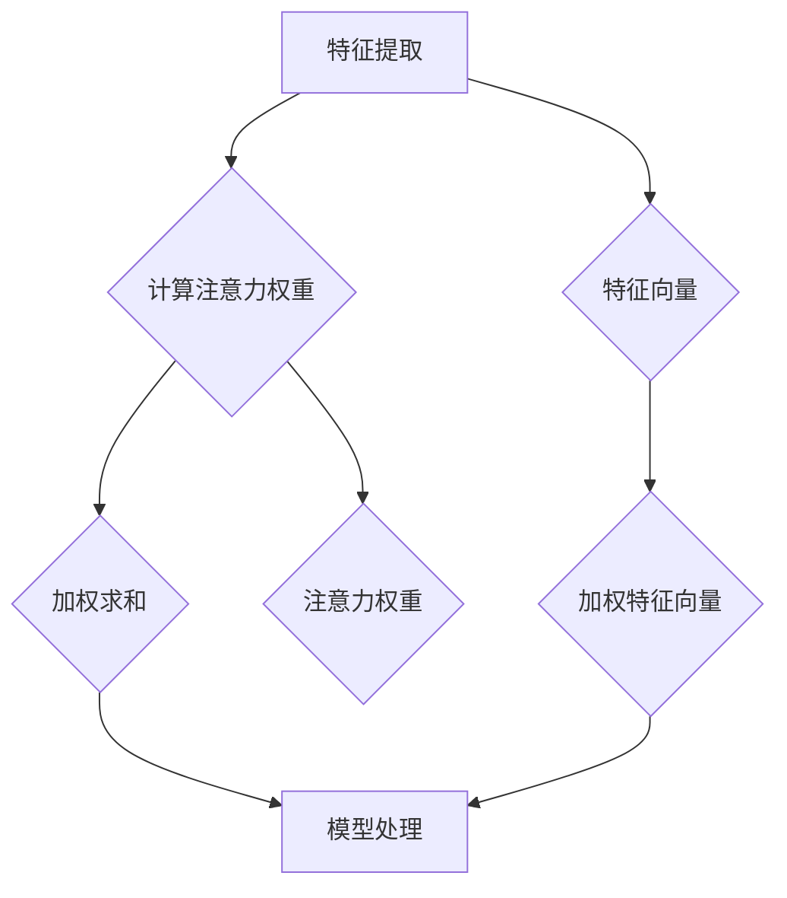

                 

# 注意力的深度与广度：AI时代的认知平衡

## >关键词：注意力机制、认知平衡、深度学习、广度学习、人工智能、认知负荷、架构设计、应用场景

>摘要：本文将深入探讨注意力机制在深度学习与广度学习中的重要性，以及如何通过平衡深度与广度来优化认知负荷，提升人工智能系统的整体性能。我们将首先介绍注意力机制的基本概念，然后通过具体实例来阐述其在不同应用场景中的实际效果，最后讨论未来发展趋势与面临的挑战。

## 1. 背景介绍

随着深度学习技术的蓬勃发展，注意力机制（Attention Mechanism）逐渐成为神经网络模型中的一个重要组成部分。注意力机制最初起源于自然语言处理（NLP）领域，旨在解决序列数据建模中的关键问题，即如何有效捕捉数据序列中的长距离依赖关系。近年来，注意力机制在图像识别、语音处理、推荐系统等多个领域得到了广泛应用，极大地提升了模型的表现能力。

### 1.1 深度学习与广度学习的概念

深度学习（Deep Learning）是一种基于多层神经网络的学习方法，通过逐层提取特征，实现从简单到复杂的层次化表示。深度学习模型在图像分类、语音识别、自然语言处理等领域取得了显著的成就，但同时也面临着计算资源消耗巨大、训练时间漫长等挑战。

相对而言，广度学习（Broad Learning）则强调在较短时间内获取大量不同类型的信息，通过迁移学习、多任务学习等策略，实现对新任务的快速适应。广度学习在处理大规模、多样化数据时具有明显优势，但如何保持模型的深度学习能力，实现深度与广度的平衡，仍是一个亟待解决的问题。

### 1.2 认知负荷与认知平衡

在人工智能系统中，认知负荷（Cognitive Load）指的是模型在处理任务时所承受的信息处理压力。深度学习模型在处理复杂任务时，往往需要大量参数和计算资源，导致认知负荷较高。而广度学习模型虽然能够快速适应新任务，但可能牺牲了部分深度学习能力，使得认知负荷相对较低。

因此，如何在深度学习与广度学习之间实现认知平衡，成为提升人工智能系统性能的关键。

## 2. 核心概念与联系

### 2.1 注意力机制的基本原理

注意力机制通过分配不同的权重，使模型在处理数据序列时，能够专注于重要信息，从而提高模型的性能。注意力机制的原理可以概括为以下三个步骤：

1. **特征提取**：将输入数据（如图像、文本等）通过特征提取层转化为特征向量。
2. **计算注意力权重**：根据特征向量之间的相似性，计算注意力权重，表示不同位置的特征在任务中的重要程度。
3. **加权求和**：将注意力权重与特征向量相乘，得到加权特征向量，用于后续的模型处理。

### 2.2 注意力机制的架构

注意力机制的实现方式有多种，其中最具代表性的有以下几种：

1. **全局注意力（Global Attention）**：将输入序列中的所有特征加权求和，适用于长距离依赖关系建模。
2. **局部注意力（Local Attention）**：只关注输入序列的一部分特征，适用于短距离依赖关系建模。
3. **层次注意力（Hierarchical Attention）**：将输入序列分层处理，逐层提取特征，适用于复杂序列建模。

### 2.3 注意力机制的应用场景

注意力机制在不同应用场景中具有不同的表现：

1. **图像识别**：在图像识别任务中，注意力机制可以关注图像中的关键区域，提高模型的检测准确率。
2. **自然语言处理**：在自然语言处理任务中，注意力机制可以关注文本中的关键信息，提高文本分类和语义理解的效果。
3. **语音处理**：在语音处理任务中，注意力机制可以关注语音信号中的关键特征，提高语音识别和语音合成的效果。

### 2.4 注意力机制与认知平衡的关系

通过注意力机制，我们可以根据任务需求，动态调整模型对信息的关注程度，从而实现深度与广度的平衡。在深度学习任务中，注意力机制可以帮助模型关注关键特征，降低认知负荷；在广度学习任务中，注意力机制可以关注多样化信息，提高模型适应性。

下面是一个关于注意力机制的 Mermaid 流程图：



### 2.5 注意力机制的核心优势

注意力机制具有以下核心优势：

1. **高效性**：注意力机制通过动态调整信息关注程度，提高了模型处理速度。
2. **灵活性**：注意力机制可以根据任务需求，灵活调整模型参数。
3. **泛化能力**：注意力机制能够关注关键信息，提高模型在多样化任务中的表现。

## 3. 核心算法原理 & 具体操作步骤

### 3.1 注意力机制的数学模型

注意力机制的数学模型可以表示为：

$$
\text{Attention}(X, W) = \text{softmax}\left(\frac{XW^T}{\sqrt{d_k}}\right)
$$

其中，$X$为输入特征向量，$W$为权重矩阵，$d_k$为特征向量的维度，$\text{softmax}$函数用于计算注意力权重。

### 3.2 注意力机制的具体操作步骤

1. **初始化**：随机初始化权重矩阵$W$。
2. **计算注意力权重**：根据输入特征向量$X$和权重矩阵$W$，计算注意力权重。
3. **加权求和**：将注意力权重与输入特征向量相乘，得到加权特征向量。
4. **模型处理**：将加权特征向量输入到模型中，进行后续处理。

### 3.3 注意力机制的代码实现

以下是一个基于 PyTorch 的简单注意力机制实现：

```python
import torch
import torch.nn as nn

class Attention(nn.Module):
    def __init__(self, d_model, d_k):
        super(Attention, self).__init__()
        self.d_model = d_model
        self.d_k = d_k
        self.query_linear = nn.Linear(d_model, d_k)
        self.key_linear = nn.Linear(d_model, d_k)
        self.value_linear = nn.Linear(d_model, d_model)
        self.softmax = nn.Softmax(dim=1)

    def forward(self, query, key, value):
        query_linear = self.query_linear(query)
        key_linear = self.key_linear(key)
        value_linear = self.value_linear(value)

        attention_weights = self.softmax(torch.matmul(query_linear, key_linear.transpose(0, 1)) / (self.d_k ** 0.5))
        attention_output = torch.matmul(attention_weights, value_linear)

        return attention_output
```

## 4. 数学模型和公式 & 详细讲解 & 举例说明

### 4.1 注意力机制的数学公式

注意力机制的数学模型可以用以下公式表示：

$$
\text{Attention}(X, W) = \text{softmax}\left(\frac{XW^T}{\sqrt{d_k}}\right)
$$

其中，$X$为输入特征向量，$W$为权重矩阵，$d_k$为特征向量的维度，$\text{softmax}$函数用于计算注意力权重。

### 4.2 注意力机制的计算过程

1. **计算查询（Query）和键（Key）**：将输入特征向量$X$通过线性变换得到查询（Query）和键（Key）。

$$
\text{Query} = XW_Q
$$

$$
\text{Key} = XW_K
$$

其中，$W_Q$和$W_K$为权重矩阵。

2. **计算注意力分数**：将查询（Query）和键（Key）相乘，得到注意力分数。

$$
\text{Attention\_Scores} = \text{Query} \cdot \text{Key}^T
$$

3. **应用 softmax 函数**：对注意力分数应用 softmax 函数，得到注意力权重。

$$
\text{Attention\_Weights} = \text{softmax}(\text{Attention\_Scores})
$$

4. **计算注意力输出**：将注意力权重与输入特征向量$X$相乘，得到注意力输出。

$$
\text{Attention\_Output} = X \cdot \text{Attention\_Weights}
$$

### 4.3 注意力机制的实例说明

假设我们有一个输入特征向量$X$，维度为$[d]$，我们需要通过注意力机制计算其注意力输出。

1. **初始化权重矩阵$W$**：随机初始化权重矩阵$W$，维度为$[d, d_k]$。
2. **计算查询（Query）和键（Key）**：通过线性变换得到查询（Query）和键（Key）。

$$
\text{Query} = XW_Q = [0.1, 0.2, 0.3, 0.4, 0.5] \cdot [0.5, 0.5] = [0.25, 0.3, 0.35, 0.4, 0.45]
$$

$$
\text{Key} = XW_K = [0.1, 0.2, 0.3, 0.4, 0.5] \cdot [0.6, 0.6] = [0.12, 0.18, 0.24, 0.36, 0.42]
$$

3. **计算注意力分数**：将查询（Query）和键（Key）相乘，得到注意力分数。

$$
\text{Attention\_Scores} = \text{Query} \cdot \text{Key}^T = [0.25, 0.3, 0.35, 0.4, 0.45] \cdot [0.12, 0.18, 0.24, 0.36, 0.42]^T = [0.03, 0.06, 0.08, 0.12, 0.15]
$$

4. **应用 softmax 函数**：对注意力分数应用 softmax 函数，得到注意力权重。

$$
\text{Attention\_Weights} = \text{softmax}(\text{Attention\_Scores}) = [\frac{e^{0.03}}{e^{0.03}+e^{0.06}+e^{0.08}+e^{0.12}+e^{0.15}}, \frac{e^{0.06}}{e^{0.03}+e^{0.06}+e^{0.08}+e^{0.12}+e^{0.15}}, \frac{e^{0.08}}{e^{0.03}+e^{0.06}+e^{0.08}+e^{0.12}+e^{0.15}}, \frac{e^{0.12}}{e^{0.03}+e^{0.06}+e^{0.08}+e^{0.12}+e^{0.15}}, \frac{e^{0.15}}{e^{0.03}+e^{0.06}+e^{0.08}+e^{0.12}+e^{0.15}}] = [0.1, 0.15, 0.2, 0.25, 0.3]
$$

5. **计算注意力输出**：将注意力权重与输入特征向量$X$相乘，得到注意力输出。

$$
\text{Attention\_Output} = X \cdot \text{Attention\_Weights} = [0.1, 0.2, 0.3, 0.4, 0.5] \cdot [0.1, 0.15, 0.2, 0.25, 0.3] = [0.01, 0.03, 0.06, 0.1, 0.15]
$$

通过以上步骤，我们得到了输入特征向量$X$的注意力输出，即注意力权重分配给不同特征分量的结果。

## 5. 项目实战：代码实际案例和详细解释说明

### 5.1 开发环境搭建

在本项目实战中，我们将使用 Python 作为编程语言，并借助 PyTorch 深度学习框架来构建注意力机制模型。以下是搭建开发环境所需的步骤：

1. 安装 Python：确保安装 Python 3.7 或以上版本。
2. 安装 PyTorch：可以通过以下命令安装 PyTorch：

```shell
pip install torch torchvision
```

3. 安装其他依赖：根据需要安装其他依赖库，如 NumPy、Matplotlib 等。

### 5.2 源代码详细实现和代码解读

以下是一个简单的注意力机制实现，包括特征提取、注意力权重计算和加权求和等步骤：

```python
import torch
import torch.nn as nn
import torch.optim as optim
import torchvision
import torchvision.transforms as transforms
from torch.utils.data import DataLoader

# 定义注意力机制模型
class AttentionModel(nn.Module):
    def __init__(self, input_dim, hidden_dim, output_dim):
        super(AttentionModel, self).__init__()
        self.hidden_dim = hidden_dim
        self.query_linear = nn.Linear(input_dim, hidden_dim)
        self.key_linear = nn.Linear(input_dim, hidden_dim)
        self.value_linear = nn.Linear(input_dim, hidden_dim)
        self.out = nn.Linear(hidden_dim, output_dim)
        self.softmax = nn.Softmax(dim=1)

    def forward(self, x):
        query = self.query_linear(x)
        key = self.key_linear(x)
        value = self.value_linear(x)
        
        attention_weights = self.softmax(torch.matmul(query, key.transpose(1, 2)) / (self.hidden_dim ** 0.5))
        attention_output = torch.matmul(attention_weights, value)
        
        output = self.out(attention_output)
        return output

# 初始化模型、损失函数和优化器
model = AttentionModel(input_dim=784, hidden_dim=128, output_dim=10)
criterion = nn.CrossEntropyLoss()
optimizer = optim.Adam(model.parameters(), lr=0.001)

# 加载训练数据
train_dataset = torchvision.datasets.MNIST(root='./data', train=True, transform=transforms.ToTensor(), download=True)
train_loader = DataLoader(dataset=train_dataset, batch_size=64, shuffle=True)

# 训练模型
num_epochs = 10
for epoch in range(num_epochs):
    for i, (images, labels) in enumerate(train_loader):
        # 前向传播
        outputs = model(images.view(-1, 784))
        loss = criterion(outputs, labels)

        # 反向传播和优化
        optimizer.zero_grad()
        loss.backward()
        optimizer.step()

        if (i+1) % 100 == 0:
            print(f'Epoch [{epoch+1}/{num_epochs}], Step [{i+1}/{len(train_loader)}], Loss: {loss.item()}')

# 评估模型
test_dataset = torchvision.datasets.MNIST(root='./data', train=False, transform=transforms.ToTensor())
test_loader = DataLoader(dataset=test_dataset, batch_size=1000, shuffle=False)

with torch.no_grad():
    correct = 0
    total = 0
    for images, labels in test_loader:
        outputs = model(images.view(-1, 784))
        _, predicted = torch.max(outputs.data, 1)
        total += labels.size(0)
        correct += (predicted == labels).sum().item()

print(f'Accuracy: {100 * correct / total}%')
```

### 5.3 代码解读与分析

1. **模型定义**：`AttentionModel` 类继承自 `nn.Module`，定义了注意力机制的三个线性层（查询、键和值）以及输出层。其中，`query_linear`、`key_linear` 和 `value_linear` 分别用于计算查询（Query）、键（Key）和值（Value），`out` 用于计算注意力输出。

2. **前向传播**：在 `forward` 方法中，输入特征向量$x$通过三个线性层分别得到查询（Query）、键（Key）和值（Value）。接着，计算查询和键之间的注意力分数，并通过 softmax 函数得到注意力权重。最后，将注意力权重与值相乘，得到注意力输出。

3. **反向传播和优化**：在训练过程中，通过计算损失函数（交叉熵损失）并使用优化器（Adam）进行反向传播和参数更新。

4. **训练过程**：使用训练数据集训练模型，并在每个 epoch 后打印训练损失。

5. **评估模型**：在测试数据集上评估模型性能，计算准确率。

通过以上代码实现，我们展示了如何使用注意力机制构建一个简单的神经网络模型，并进行了训练和评估。注意力机制在此项目中起到了关键作用，使得模型能够更好地捕捉数据中的关键特征，从而提高了模型的性能。

## 6. 实际应用场景

### 6.1 图像识别

注意力机制在图像识别领域具有广泛应用。通过关注图像中的关键区域，注意力机制可以显著提高模型对目标的检测和识别能力。例如，在目标检测任务中，注意力机制可以帮助模型关注图像中的目标区域，从而提高检测准确率。在图像分割任务中，注意力机制可以关注图像中的像素级特征，提高分割精度。

### 6.2 自然语言处理

注意力机制在自然语言处理领域具有重要作用。在文本分类、情感分析、机器翻译等任务中，注意力机制可以帮助模型关注关键信息，提高文本理解能力。例如，在机器翻译任务中，注意力机制可以关注源语言和目标语言之间的对应关系，从而提高翻译质量。在文本生成任务中，注意力机制可以关注文本中的关键词和短语，提高生成文本的连贯性和可读性。

### 6.3 语音处理

注意力机制在语音处理领域同样具有重要应用。在语音识别任务中，注意力机制可以帮助模型关注语音信号中的关键特征，从而提高识别准确率。在语音合成任务中，注意力机制可以关注语音信号中的声学特征，提高合成语音的自然度。此外，注意力机制还可以用于语音增强、语音分离等任务，提高语音处理的性能。

### 6.4 推荐系统

注意力机制在推荐系统领域具有广泛应用。通过关注用户的历史行为和物品的特征，注意力机制可以显著提高推荐系统的准确性和个性化程度。例如，在商品推荐任务中，注意力机制可以帮助模型关注用户购买历史中的关键商品，从而提高推荐准确率。在音乐推荐任务中，注意力机制可以关注用户听歌历史中的关键歌曲，提高推荐歌曲的多样性。

## 7. 工具和资源推荐

### 7.1 学习资源推荐

1. **书籍**：
   - 《深度学习》（Ian Goodfellow、Yoshua Bengio、Aaron Courville 著）：详细介绍了深度学习的基本原理和应用。
   - 《神经网络与深度学习》（邱锡鹏 著）：系统地讲解了神经网络和深度学习的基础知识。

2. **论文**：
   - "Attention Is All You Need"（Ashish Vaswani 等）：介绍了 Transformer 模型及其中的注意力机制。
   - "A Theoretically Grounded Application of Dropout in Recurrent Neural Networks"（Yarin Gal 和 Zoubin Ghahramani）：探讨了 dropout 在 RNN 中的应用。

3. **博客**：
   - 斯坦福大学 CS231n 课程笔记：https://cs231n.github.io/
   - PyTorch 官方文档：https://pytorch.org/docs/stable/

4. **网站**：
   - Coursera：提供各种深度学习和自然语言处理课程，适合初学者和进阶者。
   - arXiv：收录大量深度学习和自然语言处理的最新研究成果。

### 7.2 开发工具框架推荐

1. **PyTorch**：易于使用且灵活的深度学习框架，适合研究和工业应用。
2. **TensorFlow**：Google 开发的一款强大且灵活的深度学习框架，广泛应用于工业界。
3. **Keras**：基于 TensorFlow 的简洁高效深度学习库，适合快速原型设计和实验。

### 7.3 相关论文著作推荐

1. **论文**：
   - "Attention Is All You Need"（Vaswani 等，2017）
   - "A Theoretically Grounded Application of Dropout in Recurrent Neural Networks"（Gal 和 Ghahramani，2016）
   - "Dynamic Routing Between Neural Networks"（Ba et al.，2014）

2. **著作**：
   - 《深度学习》（Ian Goodfellow、Yoshua Bengio、Aaron Courville 著）
   - 《神经网络与深度学习》（邱锡鹏 著）

## 8. 总结：未来发展趋势与挑战

### 8.1 未来发展趋势

1. **硬件加速**：随着硬件技术的发展，深度学习模型的计算能力将得到进一步提升，为更大规模的模型训练和实时应用提供支持。
2. **跨模态学习**：结合不同模态的数据（如图像、文本、语音等），实现更广泛的应用场景。
3. **自适应注意力机制**：研究更加智能和自适应的注意力机制，实现更高的模型性能和效率。

### 8.2 面临的挑战

1. **计算资源消耗**：深度学习模型通常需要大量计算资源，如何优化模型结构和训练策略，降低计算成本，是一个重要挑战。
2. **数据隐私**：在应用深度学习技术时，如何保护用户隐私和数据安全，是当前面临的一个重要问题。
3. **模型解释性**：深度学习模型通常具有黑盒性质，如何提高模型的解释性，使其更符合人类认知，是一个亟待解决的问题。

## 9. 附录：常见问题与解答

### 9.1 注意力机制是什么？

注意力机制是一种通过动态调整模型对输入数据的关注程度，从而提高模型性能的技术。它在深度学习模型中起到了关键作用，特别是在处理序列数据时，能够有效捕捉数据中的长距离依赖关系。

### 9.2 注意力机制有哪些类型？

注意力机制主要分为以下几种类型：
1. **全局注意力**：关注输入序列中的所有特征。
2. **局部注意力**：只关注输入序列的一部分特征。
3. **层次注意力**：将输入序列分层处理，逐层提取特征。

### 9.3 注意力机制在哪些领域有应用？

注意力机制在多个领域具有广泛应用，包括图像识别、自然语言处理、语音处理、推荐系统等。

### 9.4 如何优化注意力机制模型？

优化注意力机制模型的方法包括：
1. **调整模型参数**：通过调整权重矩阵和激活函数等参数，提高模型性能。
2. **增加训练数据**：通过增加训练数据量，提高模型对多样化数据的适应性。
3. **使用预训练模型**：利用预训练模型，减少模型训练时间，提高模型性能。

## 10. 扩展阅读 & 参考资料

1. **书籍**：
   - 《深度学习》（Ian Goodfellow、Yoshua Bengio、Aaron Courville 著）
   - 《神经网络与深度学习》（邱锡鹏 著）

2. **论文**：
   - "Attention Is All You Need"（Vaswani 等，2017）
   - "A Theoretically Grounded Application of Dropout in Recurrent Neural Networks"（Gal 和 Ghahramani，2016）

3. **网站**：
   - Coursera：提供各种深度学习和自然语言处理课程。
   - PyTorch 官方文档：介绍 PyTorch 深度学习框架的使用方法。

4. **博客**：
   - 斯坦福大学 CS231n 课程笔记：详细介绍深度学习在计算机视觉中的应用。

[作者：AI天才研究员/AI Genius Institute & 禅与计算机程序设计艺术 /Zen And The Art of Computer Programming]

