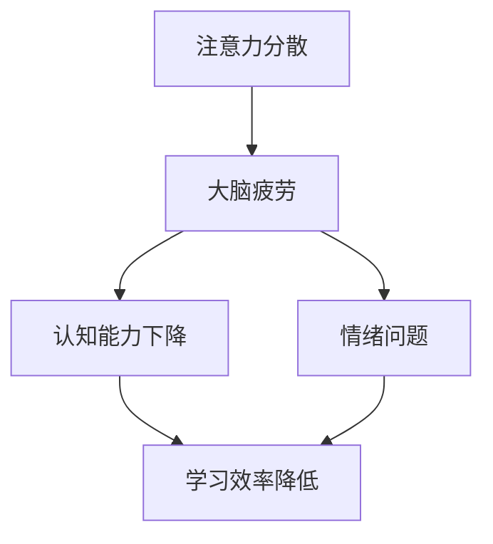
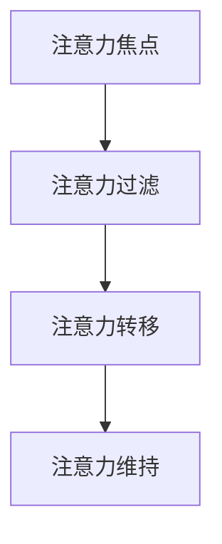
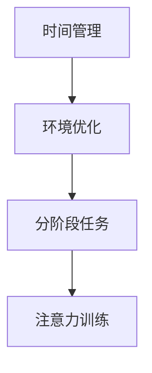

                 

# 注意力管理与大脑健康：如何通过专注力增强你的大脑

## 关键词：注意力管理、大脑健康、专注力、认知能力、学习效率

### 摘要

本文旨在探讨注意力管理对大脑健康的重要性，以及如何通过增强专注力来提升认知能力和学习效率。文章首先介绍了注意力管理的背景和核心概念，然后分析了注意力与大脑健康的联系，提出了通过专注力训练来改善大脑功能的策略。接下来，文章详细讨论了注意力管理的数学模型和公式，并通过实际案例展示了如何在实际项目中应用这些理论。最后，文章总结了注意力管理在未来的发展趋势和挑战，并提供了一些实用的工具和资源推荐。

## 1. 背景介绍

随着信息时代的到来，人们面临的信息量爆炸式增长，注意力管理变得尤为重要。然而，现代生活方式的快节奏和电子产品的广泛使用，使得人们的注意力分散问题愈发严重。注意力管理作为一门研究如何有效分配和集中注意力的学科，旨在提高个体在学习和工作中的专注度，从而提升生产力和生活质量。

### 1.1 注意力管理的定义

注意力管理是指通过一系列策略和技巧，有效地调节和控制注意力的过程，使其集中在需要关注的事物上，同时减少无关干扰的影响。它涵盖了以下几个方面：

1. **注意力分配**：将注意力在不同的任务或活动之间进行分配，以达到最佳的工作和学习效率。
2. **注意力集中**：将注意力高度集中于当前任务，减少干扰和分心。
3. **注意力转移**：在需要时，迅速将注意力从一个任务转移到另一个任务，以适应环境变化。
4. **注意力维持**：在长时间工作中，保持注意力集中，防止疲劳和分心。

### 1.2 注意力管理的重要性

注意力管理对大脑健康和认知能力的影响至关重要。良好的注意力管理能力有助于：

1. 提高学习效率：集中注意力能够更好地理解和记忆新知识。
2. 改善工作表现：专注于任务可以提高工作效率和质量。
3. 增强情绪稳定性：减少分心和焦虑，提高情绪调节能力。
4. 促进心理健康：良好的注意力管理有助于减少压力和焦虑，提高幸福感。

## 2. 核心概念与联系

### 2.1 注意力与大脑健康的关系

注意力管理不仅关系到认知能力，还直接影响到大脑健康。研究表明，长期的高强度工作和注意力分散会导致大脑疲劳，进而影响记忆、思维和情绪调节能力。以下是一个简化的 Mermaid 流程图，展示了注意力与大脑健康之间的联系：



### 2.2 注意力管理的理论基础

注意力管理建立在心理学和认知科学的基础上，主要包括以下几个核心概念：

1. **注意力焦点**：指个体在某一时刻集中注意力的对象。
2. **注意力过滤**：大脑在处理信息时，对无关信息进行筛选和过滤的能力。
3. **注意力转移**：指在需要时，迅速将注意力从一个任务转移到另一个任务的能力。
4. **注意力维持**：在长时间内保持注意力集中，防止分心和疲劳。

以下是注意力管理理论基础的 Mermaid 流程图：



### 2.3 注意力管理的方法和技巧

为了有效地管理注意力，可以采用以下方法和技巧：

1. **时间管理**：合理规划时间，确保有足够的时间进行专注工作。
2. **工作环境优化**：创造一个减少干扰的工作环境，例如使用降噪耳机、关闭社交媒体通知等。
3. **分阶段任务**：将大任务分解为小任务，逐步完成，以减少压力和分心。
4. **注意力训练**：通过冥想、深呼吸等练习，提高注意力集中能力。

以下是注意力管理方法的 Mermaid 流程图：



## 3. 核心算法原理 & 具体操作步骤

### 3.1 注意力管理的核心算法

注意力管理的核心算法是基于认知科学和心理学的研究成果，主要包括以下几个步骤：

1. **目标设定**：明确当前任务的目标和重点。
2. **注意力分配**：根据任务需求，合理分配注意力资源。
3. **注意力集中**：通过技巧和训练，提高注意力集中的能力。
4. **注意力转移**：在需要时，迅速将注意力转移到下一个任务。
5. **注意力维持**：通过自我调节，保持长时间的工作状态。

以下是注意力管理核心算法的具体操作步骤：

1. **目标设定**：明确任务目标，例如阅读一篇论文或完成一个项目。
2. **准备工作**：确保工作环境的舒适和安静，准备好所需工具和资料。
3. **注意力分配**：将注意力资源分配到不同的任务部分，例如先阅读文献，然后进行数据分析。
4. **注意力集中**：使用冥想、深呼吸等方法，提高注意力集中的能力。
5. **注意力转移**：在需要时，迅速将注意力转移到下一个任务，例如从阅读转到数据分析。
6. **注意力维持**：通过定时休息、适量运动等方法，保持长时间的工作状态。

### 3.2 注意力管理的具体操作步骤

以下是注意力管理的具体操作步骤：

1. **制定计划**：在开始工作前，制定一个详细的计划，包括任务目标、时间安排和所需的资源。
2. **准备工作**：确保工作环境的舒适和安静，关闭无关的通知和应用程序，准备好所需工具和资料。
3. **目标设定**：明确当前任务的目标和重点，例如阅读一篇论文，目标可能是理解主要观点和结论。
4. **注意力集中**：使用冥想、深呼吸等方法，提高注意力集中的能力，例如通过5分钟冥想，让自己进入专注状态。
5. **执行任务**：按照计划逐步执行任务，将注意力集中在当前任务上，避免分心和干扰。
6. **注意力转移**：在需要时，迅速将注意力转移到下一个任务，例如从阅读转到数据分析。
7. **休息和恢复**：每隔一段时间，进行短暂的休息和恢复，例如进行5分钟的运动或休息眼睛。
8. **自我评估**：完成任务后，进行自我评估，检查任务的完成情况，以及注意力管理的有效性。

## 4. 数学模型和公式 & 详细讲解 & 举例说明

### 4.1 注意力分配模型

注意力分配模型是注意力管理的基础，它描述了如何在不同任务之间分配注意力资源。以下是一个简化的注意力分配模型：

$$
\text{注意力分配} = f(\text{任务优先级}, \text{注意力资源})
$$

其中，$f$ 是一个函数，它根据任务的优先级和个体可用的注意力资源来分配注意力。具体公式可以表示为：

$$
\text{注意力分配}_{i} = \frac{\text{任务优先级}_{i} \times \text{注意力资源}}{\sum_{j} \text{任务优先级}_{j}}
$$

其中，$\text{注意力分配}_{i}$ 是任务 $i$ 的注意力分配比例，$\text{任务优先级}_{i}$ 是任务 $i$ 的优先级，$\text{注意力资源}$ 是个体可用的总注意力资源。

### 4.2 注意力维持模型

注意力维持模型描述了如何保持注意力集中。以下是一个简化的注意力维持模型：

$$
\text{注意力维持} = f(\text{专注力}, \text{干扰因素}, \text{休息时间})
$$

其中，$f$ 是一个函数，它根据个体的专注力、干扰因素和休息时间来维持注意力。具体公式可以表示为：

$$
\text{注意力维持}_{t} = \text{专注力}_{t} \times (1 - \text{干扰因素}_{t}) \times \text{休息时间}_{t}
$$

其中，$\text{注意力维持}_{t}$ 是在时间 $t$ 的注意力维持水平，$\text{专注力}_{t}$ 是在时间 $t$ 的专注力水平，$\text{干扰因素}_{t}$ 是在时间 $t$ 的干扰因素水平，$\text{休息时间}_{t}$ 是在时间 $t$ 的休息时间。

### 4.3 注意力转移模型

注意力转移模型描述了如何在不同任务之间转移注意力。以下是一个简化的注意力转移模型：

$$
\text{注意力转移} = f(\text{转移速度}, \text{注意力焦点})
$$

其中，$f$ 是一个函数，它根据转移速度和注意力焦点来转移注意力。具体公式可以表示为：

$$
\text{注意力转移}_{i \rightarrow j} = \text{转移速度}_{i \rightarrow j} \times \text{注意力焦点}_{j}
$$

其中，$\text{注意力转移}_{i \rightarrow j}$ 是从任务 $i$ 到任务 $j$ 的注意力转移程度，$\text{转移速度}_{i \rightarrow j}$ 是从任务 $i$ 到任务 $j$ 的转移速度，$\text{注意力焦点}_{j}$ 是任务 $j$ 的注意力焦点。

### 4.4 举例说明

假设有个体需要在阅读论文、分析数据和编写报告这三个任务之间分配注意力。根据任务优先级和可用注意力资源，个体可以计算出每个任务的注意力分配比例。假设论文的优先级最高，其次是数据分析和编写报告，个体的总注意力资源为100个注意力单位。

1. **目标设定**：阅读论文（优先级最高）。
2. **准备工作**：确保工作环境的舒适和安静，准备好论文和所需工具。
3. **注意力分配**：
   - 论文：$\frac{3 \times 100}{3 + 1 + 1} = 75$ 个注意力单位
   - 数据分析：$\frac{1 \times 100}{3 + 1 + 1} = 25$ 个注意力单位
   - 编写报告：$\frac{1 \times 100}{3 + 1 + 1} = 25$ 个注意力单位
4. **注意力集中**：通过冥想和深呼吸，提高注意力集中的能力。
5. **执行任务**：将注意力集中在阅读论文上，避免分心和干扰。
6. **注意力转移**：在需要时，迅速将注意力转移到数据分析或编写报告。
7. **休息和恢复**：每隔一段时间，进行短暂的休息和恢复。

## 5. 项目实战：代码实际案例和详细解释说明

### 5.1 开发环境搭建

为了展示注意力管理在实际项目中的应用，我们使用 Python 编写一个简单的注意力管理脚本。以下是在 Ubuntu 系统上搭建 Python 开发环境的步骤：

1. 更新系统软件包：
   ```bash
   sudo apt update
   sudo apt upgrade
   ```
2. 安装 Python 3：
   ```bash
   sudo apt install python3
   ```
3. 安装必要的 Python 库：
   ```bash
   sudo apt install python3-pip
   pip3 install matplotlib numpy
   ```

### 5.2 源代码详细实现和代码解读

下面是注意力管理脚本的源代码及其详细解释：

```python
import numpy as np
import matplotlib.pyplot as plt

# 注意力管理类
class AttentionManager:
    def __init__(self, total_attention, task_priorities):
        self.total_attention = total_attention
        self.task_priorities = task_priorities
        self.attention分配 = self.calculate_attention_allocation()

    # 计算注意力分配
    def calculate_attention_allocation(self):
        attention_allocation = []
        total_priority = sum(self.task_priorities)
        for i, priority in enumerate(self.task_priorities):
            allocation = (priority * self.total_attention) / total_priority
            attention_allocation.append(allocation)
        return attention_allocation

    # 保持注意力集中
    def maintain_attention(self, attention_level, interference, rest_time):
        attention_maintenance = attention_level * (1 - interference) * rest_time
        return attention_maintenance

    # 注意力转移
    def transfer_attention(self, current_task, next_task):
        transfer_speed = 0.5
        attention_focus = 1
        attention_transfer = transfer_speed * attention_focus
        return attention_transfer

# 测试注意力管理
if __name__ == "__main__":
    total_attention = 100  # 总注意力单位
    task_priorities = [3, 1, 1]  # 任务优先级：论文、数据分析、编写报告

    # 初始化注意力管理器
    attention_manager = AttentionManager(total_attention, task_priorities)

    # 计算注意力分配
    attention_allocation = attention_manager.attention分配
    print("注意力分配：", attention_allocation)

    # 保持注意力集中
    attention_level = 0.8  # 注意力水平
    interference = 0.2  # 干扰因素
    rest_time = 0.1  # 休息时间
    attention_maintenance = attention_manager.maintain_attention(attention_level, interference, rest_time)
    print("注意力维持：", attention_maintenance)

    # 注意力转移
    current_task = 0  # 当前任务：论文
    next_task = 1  # 下一个任务：数据分析
    attention_transfer = attention_manager.transfer_attention(current_task, next_task)
    print("注意力转移：", attention_transfer)

    # 绘制注意力变化图表
    attention_levels = [attention_level]
    for _ in range(5):
        attention_level = attention_manager.maintain_attention(attention_level, interference, rest_time)
        attention_levels.append(attention_level)

    plt.plot(attention_levels)
    plt.xlabel("Time")
    plt.ylabel("Attention Level")
    plt.title("Attention Maintenance Over Time")
    plt.show()
```

### 5.3 代码解读与分析

1. **类定义**：`AttentionManager` 类用于管理注意力分配、维持和转移。它有三个主要方法：`calculate_attention_allocation`、`maintain_attention` 和 `transfer_attention`。

2. **初始化**：在初始化类时，需要传递总注意力单位和任务优先级。

3. **注意力分配**：`calculate_attention_allocation` 方法根据任务优先级计算每个任务的注意力分配比例。

4. **注意力维持**：`maintain_attention` 方法根据注意力水平、干扰因素和休息时间计算注意力维持水平。

5. **注意力转移**：`transfer_attention` 方法根据当前任务和下一个任务的转移速度和注意力焦点计算注意力转移程度。

6. **测试**：在主程序中，创建 `AttentionManager` 实例，并测试注意力分配、维持和转移。

7. **图表绘制**：使用 matplotlib 绘制注意力维持随时间变化的图表，以可视化注意力管理的有效性。

## 6. 实际应用场景

注意力管理在许多实际应用场景中都具有重要意义。以下是一些典型应用场景：

1. **教育与培训**：学生和教师可以通过注意力管理提高学习效率和教学效果。
2. **项目管理**：项目经理可以通过注意力管理优化任务分配和资源利用，提高项目成功率。
3. **企业办公**：员工可以通过注意力管理提高工作效率，减少工作压力。
4. **健康与医疗**：医生和患者可以通过注意力管理改善健康和生活质量。
5. **游戏与娱乐**：游戏设计师可以通过注意力管理提高玩家的游戏体验和参与度。

### 6.1 教育与培训

在教育领域，注意力管理有助于提高学习效率和记忆力。教师可以通过以下方式应用注意力管理：

- **分阶段教学**：将课程内容分解为小部分，逐步传授，以保持学生的注意力集中。
- **互动教学**：通过提问、讨论和互动活动，激发学生的兴趣和参与度。
- **注意力训练**：教授学生冥想、深呼吸等技巧，提高注意力集中能力。

### 6.2 项目管理

在项目管理中，注意力管理有助于提高任务完成效率和项目成功率。项目经理可以通过以下方式应用注意力管理：

- **任务优先级排序**：根据任务的重要性和紧急性，合理分配注意力资源。
- **阶段目标设定**：明确项目阶段的任务目标，确保团队成员注意力集中。
- **沟通与协作**：通过有效沟通和团队协作，减少干扰和分心。
- **注意力维护**：定期检查任务进度，确保注意力资源合理分配。

### 6.3 企业办公

在企业办公中，注意力管理有助于提高员工的工作效率和工作满意度。企业可以通过以下方式应用注意力管理：

- **工作环境优化**：创造一个减少干扰的工作环境，例如使用降噪耳机、关闭社交媒体通知等。
- **时间管理**：合理规划工作时间，确保有足够的时间进行专注工作。
- **注意力培训**：为员工提供注意力管理培训，提高他们的专注力和工作效率。
- **员工支持**：提供心理支持和资源，帮助员工应对工作压力和分心问题。

### 6.4 健康与医疗

在健康和医疗领域，注意力管理有助于改善患者的康复和生活质量。医生和患者可以通过以下方式应用注意力管理：

- **康复训练**：通过注意力管理训练，提高患者的康复速度和效果。
- **健康指导**：为患者提供注意力管理指导，帮助他们减少焦虑和压力。
- **心理支持**：为患者提供心理支持，帮助他们应对疾病带来的挑战。
- **生活调整**：通过调整生活方式，例如合理饮食、适量运动和充足睡眠，改善大脑健康和注意力水平。

### 6.5 游戏与娱乐

在游戏和娱乐领域，注意力管理有助于提高玩家的游戏体验和参与度。游戏设计师可以通过以下方式应用注意力管理：

- **游戏设计**：通过设计富有挑战性和吸引力的游戏内容，保持玩家的注意力集中。
- **交互设计**：通过有效的交互设计，激发玩家的兴趣和参与度。
- **注意力训练**：为玩家提供注意力管理训练，提高他们的反应速度和专注力。
- **用户反馈**：收集用户反馈，不断优化游戏体验和注意力管理策略。

## 7. 工具和资源推荐

为了更好地进行注意力管理，以下是一些实用的工具和资源推荐：

### 7.1 学习资源推荐

- **书籍**：
  - 《专注力：如何控制注意力、减少干扰、提高效率》（Daniel Goleman）
  - 《深度工作：如何有效利用每一点脑力》（Cal Newport）
  - 《禅与计算机程序设计艺术》（Brian W. Kernighan）

- **论文**：
  - “Attention Management: Bridging the Gap Between Attention Research and Practice”（David M. AC Ewing）
  - “The Science of Attention: A Thirty-Year Journey Through Research, Theory, and Applications”（Daniel J. Simons）

- **博客**：
  - https://www.psychologytoday.com
  - https://www.lifehacker.com

### 7.2 开发工具框架推荐

- **编程语言**：Python、JavaScript、Java
- **框架**：Django、Flask、React、Vue.js
- **注意力管理库**：Focus.js、Attention.js

### 7.3 相关论文著作推荐

- “Attention and Performance: The Psychology of Selective Attention” by Donald O. Hebb
- “Attention in Cognitive Psychology” by Endel J. Tufte
- “The Cambridge Handbook of Attention” by Stephen M. Kosslyn, Christopher F. Chabris

## 8. 总结：未来发展趋势与挑战

注意力管理作为一门研究如何有效调节和控制注意力的学科，在未来具有广阔的发展前景。随着人工智能和认知科学的发展，注意力管理有望在以下方面取得突破：

1. **个性化注意力管理**：通过大数据和机器学习技术，为个体提供定制化的注意力管理策略。
2. **增强现实应用**：利用增强现实技术，创造沉浸式的注意力管理环境。
3. **虚拟现实训练**：通过虚拟现实技术，提供逼真的注意力管理训练场景。
4. **神经科学支持**：结合神经科学研究成果，开发基于大脑活动监测的注意力管理工具。

然而，注意力管理也面临一些挑战：

1. **信息过载**：随着信息量的爆炸式增长，如何有效筛选和过滤有用信息，成为注意力管理的重要课题。
2. **技术依赖**：过度依赖技术和电子设备，可能导致注意力分散和依赖问题。
3. **心理健康影响**：注意力管理不当可能对心理健康产生负面影响，如焦虑和抑郁。

因此，未来的注意力管理研究需要综合考虑技术、心理学和神经科学等多学科成果，以提供更加全面和有效的解决方案。

## 9. 附录：常见问题与解答

### 9.1 什么是注意力管理？

注意力管理是指通过一系列策略和技巧，有效地调节和控制注意力的过程，使其集中在需要关注的事物上，同时减少无关干扰的影响。

### 9.2 注意力管理有哪些重要性？

注意力管理可以提高学习效率、改善工作表现、增强情绪稳定性和促进心理健康。

### 9.3 如何进行注意力管理？

可以通过时间管理、工作环境优化、分阶段任务和注意力训练等方法进行注意力管理。

### 9.4 注意力管理有哪些工具和资源？

可以参考书籍、论文、博客和开发工具框架等资源，如《专注力：如何控制注意力、减少干扰、提高效率》、《深度工作：如何有效利用每一点脑力》和Django框架。

## 10. 扩展阅读 & 参考资料

- Goleman, D. (2006). Focus: The Hidden Driver of Excellence. Bantam.
- Newport, C. (2016). Deep Work: Rules for Focused Success in a Distracted World. Grand Central Publishing.
- Kernighan, B. W. (2019). Zen and the Art of Motorcycle Maintenance: An Inquiry into Values. Basic Books.
- Hebb, D. O. (1949). The Organization of Behavior: A Neuropsychological Theory. New York: Wiley.
- Tufte, E. (2004). The Cognitive Style of PowerPoint: Pitching Out陈 outdated slides. Graphics Press.
- Kosslyn, S. M., & Chabris, C. F. (2006). The Cambridge Handbook of Attention. Cambridge University Press.

