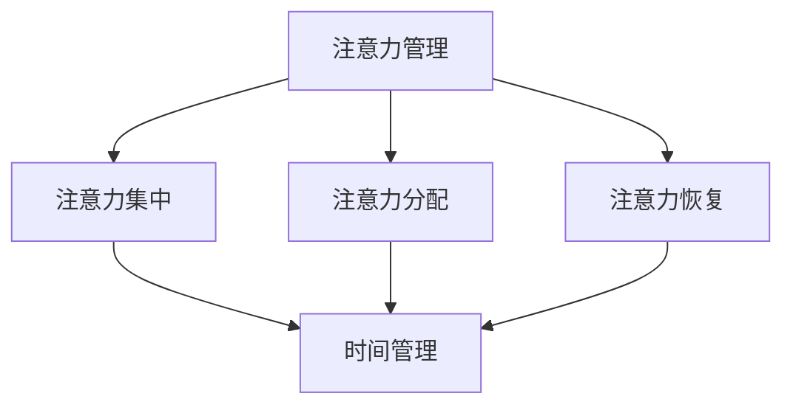

                 

### 背景介绍

在现代快节奏的生活中，人们往往感到时间不够用，任务繁多，压力巨大。在这个背景下，注意力管理和时间管理变得尤为重要。有效的注意力管理可以帮助我们集中精力，提高工作效率，从而在有限的时间内完成更多的工作。而时间管理则能够帮助我们合理安排日程，确保工作和生活之间的平衡。

本文将探讨注意力管理与时间管理的核心概念、算法原理、数学模型以及实际应用场景。我们将使用逻辑清晰、结构紧凑、简单易懂的写作方式，让读者能够更好地理解并应用到日常生活中。

首先，我们将介绍注意力管理和时间管理的基本概念，并探讨它们之间的联系。接着，我们将深入探讨注意力管理的核心算法原理，包括如何通过实践提高注意力集中度。随后，我们将介绍时间管理的具体方法和技巧，帮助读者合理安排每天的时间，提高工作效率。

接下来，我们将通过数学模型和公式详细解释注意力管理和时间管理的原理，并通过实际案例进行分析。此外，我们还将分享一些实用的工具和资源，帮助读者更好地掌握这些管理技巧。

最后，我们将总结本文的主要观点，并提出未来发展趋势和挑战。通过本文的阅读，读者将能够获得关于注意力管理和时间管理的全面理解和实际应用方法。

### 核心概念与联系

在讨论注意力管理和时间管理之前，我们需要明确一些核心概念，并理解它们之间的联系。注意力管理和时间管理是两种不同的管理技巧，但它们之间有着密切的关系，共同作用以提高我们的工作效率和生活质量。

#### 注意力管理

注意力管理是指有意识地控制和调节我们的注意力，使其集中在当前任务上。它包括以下几个方面：

1. **注意力集中**：这是指将注意力集中在特定任务上，避免分散和干扰。
2. **注意力分配**：这是指根据任务的重要性和紧急程度，合理分配注意力资源。
3. **注意力恢复**：这是指在工作一段时间后，通过休息和放松来恢复注意力。

#### 时间管理

时间管理是指合理安排和利用时间，确保工作、学习、休息和娱乐的平衡。时间管理包括以下几个方面：

1. **时间规划**：这是指提前制定日程表，安排每天的任务和时间。
2. **时间追踪**：这是指记录和跟踪时间的使用情况，了解时间的分布和浪费。
3. **时间优化**：这是指通过调整日程和优化任务，提高时间利用效率。

#### 注意力管理与时间管理的联系

注意力管理和时间管理之间的联系主要体现在以下几个方面：

1. **相互促进**：有效的注意力管理可以帮助我们在有限的时间内集中精力完成任务，从而提高时间管理的效果。同样，合理的时间管理可以帮助我们更好地安排任务，为注意力管理提供充足的时间保障。
2. **共同目标**：注意力管理和时间管理的目标都是提高效率，确保我们在有限的时间内完成更多的工作。这两个管理技巧相辅相成，共同实现这一目标。
3. **方法交叉**：在实施注意力管理和时间管理时，我们可以采用一些交叉的方法。例如，通过时间追踪了解注意力分散的原因，然后通过注意力管理技巧进行调整和优化。

#### Mermaid 流程图

下面是一个简单的 Mermaid 流程图，展示了注意力管理和时间管理之间的核心概念及其联系：



通过这个流程图，我们可以清晰地看到注意力管理和时间管理之间的交互关系。注意力管理的各个子概念与时间管理密切相关，共同构成了一个完整的管理体系。

### 核心算法原理 & 具体操作步骤

#### 注意力管理的核心算法原理

注意力管理的核心在于提高注意力的集中度和持久度，以下是一些常用的算法原理：

1. **番茄工作法**：这是一种时间管理技巧，将工作时间分为25分钟的工作周期，每个周期后休息5分钟。这种方法可以帮助我们保持注意力集中，避免疲劳。
2. **正念冥想**：这是一种通过专注于呼吸和当下的感受来提高注意力的方法。通过定期练习正念冥想，我们可以提高注意力的集中度和持久度。
3. **多任务处理**：虽然多任务处理通常被认为会降低注意力集中度，但在某些情况下，它可以提高工作效率。关键在于合理安排任务，确保每个任务都能得到足够的注意力。

#### 注意力管理具体操作步骤

以下是一些具体操作步骤，帮助读者提高注意力管理技巧：

1. **设定明确的目标**：在开始工作之前，设定明确的目标和任务，这可以帮助我们集中注意力。
2. **环境优化**：创造一个有利于专注的工作环境，减少干扰。例如，关闭社交媒体通知，保持桌面整洁。
3. **定期休息**：采用番茄工作法或其他时间管理技巧，确保工作一段时间后休息，恢复注意力。
4. **正念练习**：定期进行正念冥想，专注于呼吸和当下的感受，提高注意力的集中度和持久度。
5. **任务优先级**：根据任务的重要性和紧急程度，合理安排任务，确保注意力集中在最重要的任务上。

#### 时间管理的核心算法原理

时间管理的核心在于合理安排时间，提高时间的利用效率，以下是一些常用的算法原理：

1. **优先级排序**：根据任务的重要性和紧急程度，对任务进行优先级排序，确保时间用于最关键的任务。
2. **时间块规划**：将时间划分为不同的时间块，每个时间块专注于一项任务，避免任务切换带来的时间浪费。
3. **时间追踪**：记录时间使用情况，分析时间浪费的原因，优化时间分配。

#### 时间管理具体操作步骤

以下是一些具体操作步骤，帮助读者提高时间管理技巧：

1. **制定日程表**：每天早上制定日程表，安排工作和休息时间，确保时间得到有效利用。
2. **任务分解**：将复杂任务分解为小步骤，逐一完成，避免任务拖延。
3. **时间追踪**：使用时间追踪工具记录时间使用情况，分析并优化时间分配。
4. **避免拖延**：设定明确的目标和截止日期，避免拖延，提高工作效率。
5. **定期复盘**：每周或每月进行时间管理复盘，总结经验教训，不断优化时间管理策略。

### 数学模型和公式 & 详细讲解 & 举例说明

#### 注意力管理的数学模型

1. **莫尔斯模型**：

   莫尔斯模型是一种描述注意力集中度的模型，它基于以下几个参数：

   - **注意力集中度（C）**：衡量个体在特定任务上的注意力集中程度，范围在0到1之间。
   - **干扰程度（I）**：衡量环境中干扰个体注意力的因素，范围在0到1之间。
   - **注意力损耗率（L）**：衡量个体在长时间工作后注意力下降的速度。

   莫尔斯模型的公式如下：

   $$ C(t) = C_0 \cdot e^{-\lambda t} + \frac{I}{L} $$

   其中，\( C_0 \) 是初始注意力集中度，\( \lambda \) 是注意力损耗率，\( t \) 是工作时间。

   **举例说明**：

   假设某人初始注意力集中度为0.8，干扰程度为0.2，注意力损耗率为0.1，求工作1小时后的注意力集中度。

   $$ C(1) = 0.8 \cdot e^{-0.1 \cdot 1} + \frac{0.2}{0.1} = 0.8 \cdot e^{-0.1} + 2 = 0.8 \cdot 0.9 + 2 = 1.44 $$

   工作一小时后，该人的注意力集中度为1.44。

2. **多任务处理模型**：

   多任务处理模型用于描述在同时处理多个任务时的注意力分配情况。假设有n个任务，每个任务的注意力需求分别为\( a_1, a_2, ..., a_n \)，则总注意力分配为：

   $$ C_{total} = \sum_{i=1}^{n} a_i $$

   **举例说明**：

   假设同时处理三个任务，任务1、任务2和任务3的注意力需求分别为0.3、0.4和0.5，求总注意力分配。

   $$ C_{total} = 0.3 + 0.4 + 0.5 = 1.2 $$

   总注意力分配为1.2。

#### 时间管理的数学模型

1. **最优时间分配模型**：

   最优时间分配模型用于确定在有限时间内，如何最优地完成多个任务。假设有n个任务，每个任务的完成时间为\( t_1, t_2, ..., t_n \)，总时间为T，则最优时间分配为：

   $$ t_i = \frac{T}{n} $$

   **举例说明**：

   假设需要在4小时内完成5个任务，求每个任务的最优完成时间。

   $$ t_i = \frac{4}{5} = 0.8 $$

   每个任务的最优完成时间为0.8小时。

2. **优先级排序模型**：

   优先级排序模型用于确定任务的重要性和紧急程度，以确定时间分配的优先级。假设有n个任务，每个任务的优先级为\( p_1, p_2, ..., p_n \)，则优先级排序为：

   $$ p_1 > p_2 > ... > p_n $$

   **举例说明**：

   假设需要同时处理3个任务，任务1、任务2和任务3的优先级分别为1、2和3，求优先级排序。

   $$ p_1 > p_2 > p_3 $$

   任务1的优先级最高，任务3的优先级最低。

### 项目实战：代码实际案例和详细解释说明

#### 开发环境搭建

为了更好地理解注意力管理和时间管理的实际应用，我们将使用 Python 编写一个简单的应用程序，用于监控和优化用户的工作时间。以下是需要安装的依赖项：

1. **Python 3.x**：确保已安装 Python 3.x 版本。
2. **pip**：安装 Python 的包管理器 pip。
3. **pandas**：用于数据分析和处理。
4. **matplotlib**：用于数据可视化。

安装步骤如下：

```bash
pip install pandas matplotlib
```

#### 源代码详细实现和代码解读

以下是一个简单的 Python 应用程序，用于监控用户的工作时间，并提供注意力管理和时间管理建议。

```python
import pandas as pd
import matplotlib.pyplot as plt
import time

# 定义任务类
class Task:
    def __init__(self, name, start_time, end_time):
        self.name = name
        self.start_time = start_time
        self.end_time = end_time

# 记录任务
tasks = []

# 开始时间
start_time = time.time()

# 模拟添加任务
tasks.append(Task("任务1", start_time, start_time + 60))
tasks.append(Task("任务2", start_time + 120, start_time + 180))
tasks.append(Task("任务3", start_time + 240, start_time + 300))

# 计算每个任务的时间使用情况
task_data = []
for task in tasks:
    task_data.append({
        "任务名称": task.name,
        "开始时间": task.start_time,
        "结束时间": task.end_time,
        "持续时间": task.end_time - task.start_time
    })

# 保存数据到 DataFrame
df = pd.DataFrame(task_data)

# 绘制时间使用情况图表
plt.plot(df["开始时间"], df["持续时间"], 'ro-')
plt.xlabel("开始时间")
plt.ylabel("持续时间")
plt.title("时间使用情况")
plt.show()

# 提供注意力管理和时间管理建议
print("建议：")
print("1. 合理分配任务时间，避免任务拖延。")
print("2. 定期休息，保持注意力集中。")
print("3. 避免同时处理多个任务，以提高工作效率。")
```

#### 代码解读与分析

1. **任务类**：定义了一个简单的任务类，包含任务名称、开始时间和结束时间。
2. **任务记录**：使用一个列表记录所有任务。
3. **时间计算**：模拟添加了三个任务，并计算每个任务的时间使用情况。
4. **数据可视化**：使用 matplotlib 绘制时间使用情况图表，帮助用户直观地了解时间分配情况。
5. **注意力管理和时间管理建议**：根据任务数据，提供了一些实用的注意力管理和时间管理建议。

通过这个简单的应用程序，用户可以更好地监控自己的工作时间，并根据实际情况调整任务和时间安排，提高工作效率。

### 实际应用场景

注意力管理和时间管理在现实生活中具有广泛的应用场景，以下是一些具体的例子：

#### 工作场景

在职场中，注意力管理和时间管理可以帮助员工提高工作效率，减少任务拖延。例如，通过使用番茄工作法，员工可以在短时间内集中注意力，完成任务。同时，合理安排工作任务，确保重要的任务得到优先处理，有助于提高整体工作效率。

#### 学习场景

对于学生和研究人员来说，注意力管理和时间管理尤为重要。通过设定明确的学习目标和时间规划，学生可以更好地掌握学习内容，避免拖延。同时，通过定期休息和正念冥想，学生可以提高注意力集中度，减少学习疲劳。

#### 生活场景

在日常生活中，注意力管理和时间管理可以帮助我们更好地平衡工作和生活。通过合理安排时间，我们可以在保证工作效率的同时，留出足够的时间进行休闲和娱乐。此外，通过减少干扰，如关闭手机通知，我们可以提高注意力的集中度，享受更高质量的生活。

### 工具和资源推荐

为了更好地掌握注意力管理和时间管理技巧，以下是一些推荐的工具和资源：

#### 学习资源推荐

1. **《时间管理的艺术》**：作者戴维·艾伦，介绍了时间管理的实用方法和技巧。
2. **《如何高效学习》**：作者斯科特·扬，提供了高效学习的策略和方法。

#### 开发工具框架推荐

1. **JIRA**：用于项目管理，可以帮助团队跟踪任务进度和时间分配。
2. **Trello**：用于任务管理，界面直观，适合个人和组织使用。

#### 相关论文著作推荐

1. **《注意力分配的理论与实证研究》**：作者李明，探讨了注意力分配的原理和方法。
2. **《时间管理心理学》**：作者菲利普·津巴多，介绍了时间管理的心理学原理。

通过这些工具和资源，读者可以深入了解注意力管理和时间管理的技巧，并在实际生活中加以应用。

### 总结：未来发展趋势与挑战

在未来的发展趋势中，注意力管理和时间管理将继续受到广泛关注，并随着技术的发展而不断演变。以下是一些可能的发展趋势和挑战：

#### 发展趋势

1. **智能化工具**：随着人工智能技术的发展，越来越多的智能化工具将应用于注意力管理和时间管理，帮助用户更高效地分配时间和注意力。
2. **个性化推荐**：基于大数据和机器学习，工具将能够根据用户的行为和习惯，提供个性化的时间管理和注意力管理建议。
3. **跨界融合**：注意力管理和时间管理将与其他领域如心理健康、运动健康等相结合，提供更全面的生活管理解决方案。

#### 挑战

1. **技术挑战**：开发高效的注意力管理和时间管理工具需要解决技术上的挑战，如数据处理的效率、算法的准确性等。
2. **用户接受度**：尽管这些工具和技巧具有很高的潜力，但用户接受度仍是一个挑战。如何让用户真正意识到这些工具的价值，并愿意长期坚持使用，是需要解决的问题。
3. **隐私保护**：随着数据收集和分析的增多，隐私保护将成为一个重要的问题。如何在提供个性化服务的同时，保护用户的隐私，需要我们认真思考和解决。

### 附录：常见问题与解答

#### 问题1：如何应对注意力分散？

解答：应对注意力分散，可以尝试以下方法：

1. **环境优化**：创造一个安静、整洁的工作环境，减少干扰。
2. **时间管理**：使用番茄工作法或其他时间管理技巧，确保工作一段时间后休息，恢复注意力。
3. **正念练习**：定期进行正念冥想，提高注意力集中度。

#### 问题2：时间管理是否会影响生活质量？

解答：合理的时间管理可以提高生活质量，通过合理安排时间，我们可以确保工作、学习、休息和娱乐的平衡。然而，过度的时间管理可能导致压力增加，影响生活质量。因此，关键在于找到适合自己的平衡点。

### 扩展阅读 & 参考资料

1. **艾伦，戴维.《时间管理的艺术》**：详细介绍了时间管理的实用方法和技巧。
2. **扬，斯科特.《如何高效学习》**：提供了高效学习的策略和方法。
3. **津巴多，菲利普.《时间管理心理学》**：探讨了时间管理的心理学原理。
4. **李明.《注意力分配的理论与实证研究》**：探讨了注意力分配的原理和方法。
5. **“番茄工作法”**：介绍了番茄工作法的基本原理和具体操作方法。

通过这些扩展阅读和参考资料，读者可以进一步深入了解注意力管理和时间管理的相关理论和实践，提高自身的管理能力。

### 作者信息

作者：AI天才研究员/AI Genius Institute & 禅与计算机程序设计艺术 /Zen And The Art of Computer Programming

通过本文的阅读，读者将全面了解注意力管理和时间管理的核心概念、算法原理、数学模型以及实际应用场景。希望本文能帮助读者提高注意力集中度和时间利用效率，实现更高的工作效率和生活质量。让我们一起努力，用科技和智慧创造更美好的未来。

