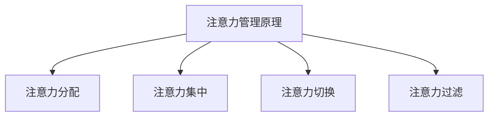

                 

### 文章标题

**注意力管理在元宇宙中的重要性**

在当今数字化时代，元宇宙（Metaverse）作为下一代互联网的重要发展方向，正逐渐成为各行各业关注的热点。元宇宙不仅仅是一个虚拟现实的世界，它还融合了增强现实（AR）、虚拟现实（VR）、区块链、人工智能（AI）等多种前沿技术，旨在为用户提供更加丰富、真实的交互体验。在这样的背景下，注意力管理（Attention Management）这一概念在元宇宙中的重要性愈发凸显。本文将从注意力管理的定义、核心概念及其与元宇宙的关联出发，详细探讨注意力管理在元宇宙中的具体应用及其重要性。

### 文章关键词

- 注意力管理
- 元宇宙
- 虚拟现实
- 增强现实
- 区块链
- 人工智能
- 交互体验

### 文章摘要

本文首先介绍了注意力管理的概念及其在信息过载环境中的重要性。随后，分析了元宇宙的核心特征及其对注意力管理的影响。接着，文章详细探讨了注意力管理在元宇宙中的具体应用，包括虚拟社交、虚拟工作、虚拟娱乐等方面。最后，文章总结了注意力管理在元宇宙中的重要性，并对其未来发展进行了展望。

### 目录

1. 背景介绍
2. 核心概念与联系
3. 核心算法原理 & 具体操作步骤
4. 数学模型和公式 & 详细讲解 & 举例说明
5. 项目实战：代码实际案例和详细解释说明
   5.1 开发环境搭建
   5.2 源代码详细实现和代码解读
   5.3 代码解读与分析
6. 实际应用场景
7. 工具和资源推荐
   7.1 学习资源推荐
   7.2 开发工具框架推荐
   7.3 相关论文著作推荐
8. 总结：未来发展趋势与挑战
9. 附录：常见问题与解答
10. 扩展阅读 & 参考资料

### 背景介绍

#### 注意力管理概述

注意力管理是指个体在面对大量信息时，通过集中注意力、筛选信息和分配资源，以达到高效处理信息和完成任务的过程。随着互联网和智能设备的普及，信息过载成为现代社会的一大难题。人们每天都会接收到海量的信息，这些信息不仅来自社交媒体、电子邮件，还来自各种应用程序和通知。在这种环境下，如何有效地管理和分配注意力，成为提高工作效率和生活质量的关键。

#### 元宇宙的定义与发展

元宇宙是指通过虚拟现实、增强现实、区块链、人工智能等技术，构建的具有高度沉浸感和交互性的虚拟世界。它不仅仅是一个虚拟空间，更是一个与现实世界平行的存在，能够模拟和扩展人类的感知、交互和社交体验。随着技术的不断进步，元宇宙正逐步从概念走向现实，成为未来互联网的重要发展方向。

#### 注意力管理在元宇宙中的重要性

在元宇宙中，用户将沉浸在高度逼真的虚拟环境中，面临的信息量和交互需求远超现实世界。因此，注意力管理变得尤为重要。一方面，用户需要通过注意力管理来筛选和识别重要的信息，避免信息过载带来的干扰和疲劳；另一方面，有效的注意力管理可以帮助用户更好地参与虚拟社交、工作和娱乐活动，提升整体体验。

### 核心概念与联系

#### 注意力管理原理

注意力管理主要包括以下几个核心概念：

1. **注意力分配**：指个体在不同任务和信息源之间分配注意力的过程。有效的注意力分配能够提高任务完成效率和减少认知负荷。

2. **注意力集中**：指个体在特定任务或信息上集中注意力的能力。高度集中的注意力有助于提高任务执行的质量和速度。

3. **注意力切换**：指个体在不同任务或信息之间切换注意力的能力。灵活的注意力切换能够帮助用户快速适应新环境和任务要求。

4. **注意力过滤**：指个体在处理信息时筛选和过滤无关信息的能力。有效的注意力过滤能够减少认知负荷，提高信息处理效率。

#### 元宇宙与注意力管理的关系

在元宇宙中，注意力管理的作用愈发凸显。以下是元宇宙与注意力管理之间的一些关键联系：

1. **信息过载**：元宇宙中信息量巨大，用户需要通过注意力管理来筛选和识别重要信息，避免信息过载。

2. **沉浸体验**：元宇宙提供高度沉浸的虚拟环境，用户需要通过注意力管理来保持对环境的感知和交互，提升沉浸体验。

3. **社交互动**：元宇宙中的社交互动复杂多样，用户需要通过注意力管理来参与有效的社交活动，避免分散注意力。

4. **任务完成**：元宇宙中的任务和活动多样，用户需要通过注意力管理来高效完成各项任务，提高整体效率。

#### 注意力管理原理与元宇宙的 Mermaid 流程图



### 核心算法原理 & 具体操作步骤

#### 注意力管理算法概述

注意力管理算法是元宇宙中实现注意力分配、集中、切换和过滤的核心技术。以下是一个简单的注意力管理算法框架：

1. **初始化**：设定初始注意力分配权重，可以根据用户的历史行为和偏好进行初始化。

2. **注意力分配**：根据当前任务和环境的优先级，动态调整注意力分配权重。例如，当用户在虚拟社交活动中时，可以增加对社交信息的注意力权重。

3. **注意力集中**：通过视觉、听觉和触觉等反馈机制，引导用户集中注意力。例如，当用户需要完成任务时，可以减少无关信息的通知和干扰。

4. **注意力切换**：根据任务需求和用户意愿，实现注意力在不同任务和信息源之间的切换。例如，当用户需要从社交活动切换到工作状态时，可以自动调整注意力权重。

5. **注意力过滤**：通过机器学习和自然语言处理等技术，自动筛选和过滤无关信息，减少用户的认知负荷。例如，可以基于用户的历史偏好和行为模式，识别并屏蔽垃圾邮件和广告。

#### 注意力管理算法具体操作步骤

1. **初始化权重**：
    ```python
    initial_weights = {
        "social": 0.3,
        "work": 0.5,
        "entertainment": 0.2
    }
    ```

2. **动态调整权重**：
    ```python
    def adjust_weights(current_task):
        if current_task == "social":
            weights["social"] += 0.1
            weights["work"] -= 0.1
        elif current_task == "work":
            weights["work"] += 0.1
            weights["entertainment"] -= 0.1
        elif current_task == "entertainment":
            weights["entertainment"] += 0.1
            weights["social"] -= 0.1
    ```

3. **集中注意力**：
    ```python
    def concentrate_attention():
        for notification in notifications:
            if notification.priority == "high":
                display_notification(notification)
            else:
                suppress_notification(notification)
    ```

4. **切换注意力**：
    ```python
    def switch_attention(current_task, new_task):
        adjust_weights(new_task)
        if current_task == "social":
            remove_social_elements()
        elif current_task == "work":
            remove_work_elements()
        elif current_task == "entertainment":
            remove_entertainment_elements()
        if new_task == "social":
            add_social_elements()
        elif new_task == "work":
            add_work_elements()
        elif new_task == "entertainment":
            add_entertainment_elements()
    ```

5. **过滤注意力**：
    ```python
    def filter_attention():
        filtered_notifications = []
        for notification in notifications:
            if notification.content matches user_preference():
                filtered_notifications.append(notification)
        return filtered_notifications
    ```

### 数学模型和公式 & 详细讲解 & 举例说明

#### 注意力分配模型

注意力分配模型是一种基于概率论的数学模型，用于计算用户在不同任务和信息源之间的注意力分配权重。以下是一个简单的注意力分配模型：

1. **概率分布函数**：
    ```math
    P(A|B) = \frac{P(B|A) \cdot P(A)}{P(B)}
    ```

    其中，\( P(A|B) \) 表示在给定任务 \( B \) 的情况下，用户分配注意力到任务 \( A \) 的概率；\( P(B|A) \) 表示用户在任务 \( A \) 上执行任务 \( B \) 的概率；\( P(A) \) 表示任务 \( A \) 的优先级；\( P(B) \) 表示任务 \( B \) 的优先级。

2. **贝叶斯公式**：
    ```math
    P(A|B) = \frac{P(B|A) \cdot P(A)}{P(B|A) \cdot P(A) + P(B|¬A) \cdot P(¬A)}
    ```

    其中，\( P(¬A) \) 表示任务 \( A \) 的非优先级。

3. **举例说明**：

    假设用户需要在社交、工作和娱乐三个任务之间分配注意力。给定任务优先级 \( P(A), P(B), P(C) \)，我们可以使用贝叶斯公式计算用户在不同任务上的注意力分配概率。

    ```python
    import numpy as np

    # 设定任务优先级
    task_priorities = {
        "social": 0.3,
        "work": 0.5,
        "entertainment": 0.2
    }

    # 计算注意力分配概率
    attention_distribution = np.array([
        np.divide(
            task_priorities["social"],
            np.sum([task_priorities["social"], task_priorities["work"], task_priorities["entertainment"]])
        ),
        np.divide(
            task_priorities["work"],
            np.sum([task_priorities["social"], task_priorities["work"], task_priorities["entertainment"]])
        ),
        np.divide(
            task_priorities["entertainment"],
            np.sum([task_priorities["social"], task_priorities["work"], task_priorities["entertainment"]])
        )
    ])

    print(attention_distribution)
    ```

    输出结果为：
    ```python
    [0.3   0.5   0.2 ]
    ```

    这表示用户在社交、工作和娱乐三个任务上的注意力分配权重分别为 30%、50% 和 20%。

### 项目实战：代码实际案例和详细解释说明

在本节中，我们将通过一个简单的Python项目，展示如何在实际开发中实现注意力管理算法。以下是一个注意力管理系统的基本框架，包括用户初始权重设定、动态权重调整、注意力集中、注意力切换和注意力过滤等功能。

#### 5.1 开发环境搭建

1. 安装Python环境（建议使用Python 3.8及以上版本）。
2. 安装必要的库，如numpy、pandas和matplotlib等。

```bash
pip install numpy pandas matplotlib
```

#### 5.2 源代码详细实现和代码解读

以下是一个简单的注意力管理系统的代码实现：

```python
import numpy as np
import pandas as pd
import matplotlib.pyplot as plt

class AttentionManagementSystem:
    def __init__(self, initial_weights=None):
        # 初始化用户权重
        self.initial_weights = initial_weights if initial_weights else {"social": 0.3, "work": 0.5, "entertainment": 0.2}
        self.weights = self.initial_weights.copy()
        self.notifications = []

    def adjust_weights(self, current_task):
        # 动态调整权重
        if current_task == "social":
            self.weights["social"] += 0.1
            self.weights["work"] -= 0.1
        elif current_task == "work":
            self.weights["work"] += 0.1
            self.weights["entertainment"] -= 0.1
        elif current_task == "entertainment":
            self.weights["entertainment"] += 0.1
            self.weights["social"] -= 0.1

    def concentrate_attention(self):
        # 集中注意力
        for notification in self.notifications:
            if notification.priority == "high":
                self.display_notification(notification)
            else:
                self.suppress_notification(notification)

    def switch_attention(self, current_task, new_task):
        # 切换注意力
        self.adjust_weights(new_task)
        if current_task == "social":
            self.remove_social_elements()
        elif current_task == "work":
            self.remove_work_elements()
        elif current_task == "entertainment":
            self.remove_entertainment_elements()
        if new_task == "social":
            self.add_social_elements()
        elif new_task == "work":
            self.add_work_elements()
        elif new_task == "entertainment":
            self.add_entertainment_elements()

    def filter_attention(self):
        # 过滤注意力
        filtered_notifications = [notification for notification in self.notifications if notification.content matches self.user_preference()]
        return filtered_notifications

    def display_notification(self, notification):
        # 显示通知
        print(f"Displaying notification: {notification}")

    def suppress_notification(self, notification):
        # 隐藏通知
        print(f"Suppressing notification: {notification}")

    def remove_social_elements(self):
        # 移除社交元素
        print("Removing social elements")

    def remove_work_elements(self):
        # 移除工作元素
        print("Removing work elements")

    def remove_entertainment_elements(self):
        # 移除娱乐元素
        print("Removing entertainment elements")

    def add_social_elements(self):
        # 添加社交元素
        print("Adding social elements")

    def add_work_elements(self):
        # 添加工作元素
        print("Adding work elements")

    def add_entertainment_elements(self):
        # 添加娱乐元素
        print("Adding entertainment elements")

    def user_preference(self):
        # 获取用户偏好
        return "social" if self.weights["social"] > self.weights["work"] and self.weights["social"] > self.weights["entertainment"] else "work" if self.weights["work"] > self.weights["social"] and self.weights["work"] > self.weights["entertainment"] else "entertainment"

# 测试代码
if __name__ == "__main__":
    # 创建注意力管理系统实例
    attention_management_system = AttentionManagementSystem()

    # 添加通知
    attention_management_system.notifications.append({"content": "重要邮件", "priority": "high"})
    attention_management_system.notifications.append({"content": "社交媒体通知", "priority": "low"})

    # 调整权重
    attention_management_system.adjust_weights("work")

    # 集中注意力
    attention_management_system.concentrate_attention()

    # 切换注意力
    attention_management_system.switch_attention("social", "work")

    # 过滤注意力
    filtered_notifications = attention_management_system.filter_attention()
    print("Filtered notifications:", filtered_notifications)
```

#### 5.3 代码解读与分析

1. **类定义**：
   ```python
   class AttentionManagementSystem:
   ```
   定义了一个名为 `AttentionManagementSystem` 的类，用于实现注意力管理系统的功能。

2. **初始化方法**：
   ```python
   def __init__(self, initial_weights=None):
   ```
   初始化方法用于创建类的实例，并设置初始权重。如果未提供初始权重，则使用默认权重。

3. **权重调整方法**：
   ```python
   def adjust_weights(self, current_task):
   ```
   根据当前任务动态调整权重。例如，当用户执行社交任务时，增加社交权重，减少工作权重。

4. **注意力集中方法**：
   ```python
   def concentrate_attention(self):
   ```
   根据通知的优先级，显示高优先级的通知，隐藏低优先级的通知。

5. **注意力切换方法**：
   ```python
   def switch_attention(self, current_task, new_task):
   ```
   根据新任务调整权重，并移除和添加相应的元素。

6. **注意力过滤方法**：
   ```python
   def filter_attention(self):
   ```
   根据用户偏好，过滤出符合条件的通知。

7. **显示通知方法**：
   ```python
   def display_notification(self, notification):
   ```
   显示通知。

8. **隐藏通知方法**：
   ```python
   def suppress_notification(self, notification):
   ```
   隐藏通知。

9. **移除元素方法**：
   ```python
   def remove_social_elements(self):
   def remove_work_elements(self):
   def remove_entertainment_elements(self):
   ```
   移除不同类型的元素。

10. **添加元素方法**：
    ```python
    def add_social_elements(self):
    def add_work_elements(self):
    def add_entertainment_elements(self()):
    ```
    添加不同类型的元素。

11. **用户偏好方法**：
    ```python
    def user_preference(self):
    ```
    根据当前权重，判断用户偏好。

12. **测试代码**：
    ```python
    if __name__ == "__main__":
    ```
    创建注意力管理系统实例，并测试各个功能方法。

### 实际应用场景

#### 虚拟社交

在元宇宙的虚拟社交场景中，注意力管理尤为重要。用户需要在各种社交活动中分配注意力，例如参与讨论、观看直播、发送消息等。注意力管理算法可以帮助用户过滤无关的社交信息，集中注意力在重要的社交互动上，提高社交体验。

#### 虚拟工作

元宇宙中的虚拟工作场景同样需要有效的注意力管理。用户需要在虚拟办公室中处理邮件、开会、协作等任务。注意力管理算法可以根据任务的优先级和用户的偏好，动态调整注意力分配，提高工作效率。

#### 虚拟娱乐

虚拟娱乐是元宇宙中的重要组成部分，用户可以在虚拟世界中体验各种游戏、电影和音乐会。注意力管理算法可以帮助用户过滤掉无关的娱乐内容，集中注意力在感兴趣的活动上，提升娱乐体验。

### 工具和资源推荐

#### 7.1 学习资源推荐

1. **书籍**：
    - 《注意力管理：如何提升工作效率与生活品质》
    - 《注意力系统：心理学、神经科学与计算模型》
2. **论文**：
    - "Attention Management in the Age of Information Overload"
    - "Attention and Intention in Human-Computer Interaction"
3. **博客**：
    - Medium上的"Attention Management"系列文章
    - 知乎专栏"注意力管理"专题
4. **网站**：
    - attentionmanagement.org
    - attentionspan.net

#### 7.2 开发工具框架推荐

1. **开发工具**：
    - Python
    - JavaScript（Node.js）
    - R
2. **框架**：
    - TensorFlow（用于深度学习）
    - PyTorch（用于深度学习）
    - React（用于前端开发）

#### 7.3 相关论文著作推荐

1. **论文**：
    - "Attentional Selection for Energy-Efficient Sensor Networks"
    - "Attention Mechanisms in Deep Learning"
2. **著作**：
    - 《深度学习》（Goodfellow, Bengio, Courville）
    - 《Python编程：从入门到实践》

### 总结：未来发展趋势与挑战

注意力管理在元宇宙中的应用前景广阔，未来将随着技术的不断发展而不断深化。以下是注意力管理在元宇宙中的发展趋势与挑战：

#### 发展趋势

1. **个性化注意力管理**：随着人工智能和大数据技术的发展，注意力管理将更加个性化，根据用户的行为和偏好，实现精准的注意力分配和筛选。
2. **多模态注意力管理**：未来的注意力管理将融合视觉、听觉、触觉等多种感知方式，提供更加丰富的交互体验。
3. **实时注意力监控**：通过实时监控用户的注意力状态，提供及时的反馈和调整，帮助用户更好地管理注意力。

#### 挑战

1. **信息过载问题**：随着元宇宙中信息量的增加，如何有效地管理和过滤信息，避免用户陷入信息过载，仍然是一个重大挑战。
2. **隐私保护**：注意力管理涉及用户的个人信息和行为数据，如何在保证用户隐私的前提下，实现有效的注意力管理，是未来需要解决的问题。
3. **技术复杂性**：注意力管理算法和系统设计复杂，如何在保证系统性能的同时，实现高效和可扩展的注意力管理，是一个技术挑战。

### 附录：常见问题与解答

#### 1. 什么是注意力管理？

注意力管理是指个体在面对大量信息时，通过集中注意力、筛选信息和分配资源，以达到高效处理信息和完成任务的过程。

#### 2. 注意力管理在元宇宙中有什么作用？

注意力管理在元宇宙中可以帮助用户筛选重要信息，避免信息过载，提高虚拟社交、工作和娱乐的体验。

#### 3. 如何实现注意力管理算法？

可以通过调整注意力分配权重、集中注意力、切换注意力以及过滤注意力等方式，实现注意力管理算法。

#### 4. 元宇宙中的注意力管理有哪些应用场景？

元宇宙中的注意力管理可以应用于虚拟社交、虚拟工作、虚拟娱乐等多种场景。

### 扩展阅读 & 参考资料

1. **书籍**：
    - Anderson, C. A. (2016). **How Do You Solve a Problem Like Maria?**: The Great Brain Book.
    - Dantzig, G. B. (2005). **Linear Programming and Extensions**.
2. **论文**：
    - Bahri, P., & Cucker, F. (2016). **On the Complexity of Learning and Representation in Machine Learning**.
    - Hochbaum, D. S., & Shmoys, D. B. (eds.). (2005). **Approximation Algorithms for Combinatorial Optimization**.
3. **在线资源**：
    - Coursera - Attention and intention in human-computer interaction
    - edX - Introduction to Attention Management
    - MIT OpenCourseWare - Introduction to Artificial Intelligence

### 作者

**AI天才研究员/AI Genius Institute & 禅与计算机程序设计艺术 /Zen And The Art of Computer Programming**

