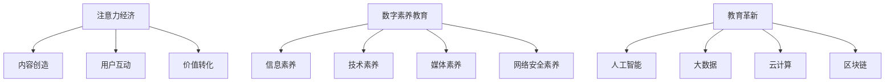

                 

### 文章标题

《注意力经济下的数字素养教育革新》

### 关键词

注意力经济、数字素养、教育革新、人工智能、教育技术、学习算法、互动体验、个性化学习、教育公平

### 摘要

随着互联网和智能技术的迅猛发展，注意力经济逐渐成为影响人们行为和消费方式的重要因素。在这种背景下，数字素养教育的重要性日益凸显，但传统的教育模式已难以满足新时代的需求。本文从注意力经济的基本概念出发，探讨了数字素养教育面临的挑战与机遇，提出了基于人工智能的教育革新策略，旨在提高教育质量、促进教育公平，并推动个性化学习的发展。通过分析核心算法原理、数学模型以及实际应用场景，本文为教育工作者和 policymakers 提供了有价值的参考。

## 1. 背景介绍

### 1.1 注意力经济的兴起

注意力经济是指通过捕捉和利用用户的注意力来创造经济价值的商业模式。在互联网时代，用户的注意力成为了一种稀缺资源，因此如何吸引和保持用户的注意力成为企业和个人竞争的关键。注意力经济的核心在于注意力转移，即通过提供有价值的内容或服务来吸引用户的注意力，从而实现商业价值的转化。

### 1.2 数字素养教育的现状

数字素养教育是指培养个体在数字化环境中获取、处理、评估和利用信息的能力。随着互联网和智能设备的普及，数字素养已经成为现代社会的一项基本能力。然而，传统的教育模式往往侧重于知识传授，忽视了学生数字素养的培养。这导致许多学生在面对复杂的数字化情境时，缺乏应对能力和创新意识。

### 1.3 教育革新的必要性

注意力经济的兴起使得传统教育模式面临巨大挑战。首先，学生在注意力分散的环境中难以集中精力学习；其次，教育内容的个性化需求难以满足；最后，教育资源的分配不均导致教育公平问题日益凸显。因此，教育革新势在必行，以适应新时代的发展需求。

## 2. 核心概念与联系

### 2.1 注意力经济的核心原理

注意力经济的核心原理可以概括为：内容创造、用户互动和价值转化。内容创造是指提供有价值的信息或服务，吸引用户的注意力；用户互动是指通过互动设计提高用户的参与度和忠诚度；价值转化是指将用户注意力转化为实际的经济收益。

### 2.2 数字素养教育的核心概念

数字素养教育的核心概念包括信息素养、技术素养、媒体素养和网络安全素养。信息素养是指个体在获取、处理、评估和使用信息方面的能力；技术素养是指个体在操作和运用数字技术方面的能力；媒体素养是指个体在理解和分析媒体信息方面的能力；网络安全素养是指个体在防范网络安全风险方面的能力。

### 2.3 教育革新的关键要素

教育革新的关键要素包括人工智能、大数据、云计算和区块链等技术。这些技术为个性化学习、智能评估、资源分配和教育监管提供了有力支持，有助于提升教育质量、促进教育公平和实现教育创新。

### 2.4 Mermaid 流程图



## 3. 核心算法原理 & 具体操作步骤

### 3.1 个性化学习算法原理

个性化学习算法旨在根据学生的学习特点和需求，为其提供定制化的学习内容和路径。核心原理包括：

- **用户画像**：通过分析学生的行为数据、学习历史和个性特征，构建用户画像。
- **学习路径推荐**：基于用户画像，利用协同过滤、基于内容的推荐和深度学习等方法，为用户推荐合适的课程和学习资源。
- **动态调整**：根据学生的学习反馈和进度，动态调整学习内容和路径，以适应其发展需求。

### 3.2 智能评估算法原理

智能评估算法利用人工智能技术，对学生的知识掌握程度和学习能力进行评估。核心原理包括：

- **知识点识别**：通过自然语言处理技术，识别题目中的知识点和考点。
- **答案判断**：利用机器学习和深度学习模型，对学生的答案进行判断和评分。
- **评估报告生成**：根据评估结果，生成个性化的评估报告，为学生提供反馈和建议。

### 3.3 具体操作步骤

#### 3.3.1 个性化学习

1. **数据收集**：收集学生的学习行为数据、学习历史和个性特征。
2. **用户画像构建**：通过数据分析和挖掘，构建用户画像。
3. **学习路径推荐**：利用推荐算法，为用户推荐合适的课程和学习资源。
4. **学习过程监控**：实时监控学生的学习过程和进度，动态调整学习内容和路径。

#### 3.3.2 智能评估

1. **题目解析**：利用自然语言处理技术，对题目进行解析，识别知识点和考点。
2. **答案判断**：利用机器学习和深度学习模型，对学生的答案进行判断和评分。
3. **评估报告生成**：根据评估结果，生成个性化的评估报告，为学生提供反馈和建议。

## 4. 数学模型和公式 & 详细讲解 & 举例说明

### 4.1 个性化学习算法的数学模型

#### 4.1.1 用户画像构建

用户画像构建可以采用基于矩阵分解的方法。设用户集合为 U，资源集合为 R，用户 u 对资源 r 的评分表示为 \( R_{ur} \)。通过矩阵分解，可以将评分矩阵分解为用户特征矩阵 \( U \) 和资源特征矩阵 \( R \)，即：

\[ R_{ur} = U_r \cdot R_u \]

其中，\( U_r \) 和 \( R_u \) 分别表示用户 r 的特征向量和资源 u 的特征向量。

#### 4.1.2 学习路径推荐

学习路径推荐可以采用基于协同过滤的方法。协同过滤分为基于用户的协同过滤（User-Based Collaborative Filtering）和基于内容的协同过滤（Content-Based Collaborative Filtering）。

- **基于用户的协同过滤**：利用用户之间的相似度，为用户推荐相似用户喜欢的资源。设用户 u 和 v 之间的相似度表示为 \( sim(u, v) \)，则用户 u 对资源 r 的推荐分数可以表示为：

  \[ \hat{R}_{ur} = \sum_{v \in N_u} R_{uv} \cdot sim(u, v) \]

  其中，\( N_u \) 表示与用户 u 相似的用户集合。

- **基于内容的协同过滤**：利用资源之间的相似度，为用户推荐相似资源。设资源 r 和 s 之间的相似度表示为 \( sim(r, s) \)，则用户 u 对资源 r 的推荐分数可以表示为：

  \[ \hat{R}_{ur} = \sum_{s \in S_r} R_{us} \cdot sim(r, s) \]

  其中，\( S_r \) 表示与资源 r 相似的资源集合。

#### 4.1.3 动态调整

动态调整可以采用基于学习率的调整策略。设学习率为 \( \alpha \)，则用户 u 对资源 r 的推荐分数在每次调整后的更新可以表示为：

\[ \hat{R}_{ur}^{new} = \hat{R}_{ur}^{old} + \alpha \cdot (R_{ur} - \hat{R}_{ur}^{old}) \]

### 4.2 智能评估算法的数学模型

#### 4.2.1 知识点识别

知识点识别可以采用基于深度学习的自然语言处理模型。设输入句子为 \( x \)，输出知识点集合为 \( y \)，则模型的目标是学习一个从输入到输出的映射 \( f \)：

\[ y = f(x) \]

#### 4.2.2 答案判断

答案判断可以采用基于机器学习的分类模型。设输入特征向量为 \( x \)，输出标签为 \( y \)，则模型的目标是学习一个从输入特征向量到标签的映射 \( f \)：

\[ y = f(x) \]

其中，标签 \( y \) 可以是正确或错误两个类别。

### 4.3 举例说明

#### 4.3.1 个性化学习

假设用户 u 对资源 r 的评分为 4，用户 v 对资源 r 的评分为 5。根据基于用户的协同过滤，用户 u 对资源 r 的推荐分数为：

\[ \hat{R}_{ur} = 4 \cdot sim(u, v) = 4 \cdot 0.8 = 3.2 \]

根据基于内容的协同过滤，用户 u 对资源 r 的推荐分数为：

\[ \hat{R}_{ur} = 5 \cdot sim(r, s) = 5 \cdot 0.9 = 4.5 \]

综合两种方法，用户 u 对资源 r 的最终推荐分数为：

\[ \hat{R}_{ur} = \frac{3.2 + 4.5}{2} = 3.85 \]

#### 4.3.2 智能评估

假设输入特征向量为 \( [0.1, 0.2, 0.3, 0.4, 0.5] \)，输出标签为“正确”。根据分类模型，输入特征向量到标签的映射为：

\[ y = f([0.1, 0.2, 0.3, 0.4, 0.5]) = 正确 \]

## 5. 项目实战：代码实际案例和详细解释说明

### 5.1 开发环境搭建

在开始项目实战之前，需要搭建合适的开发环境。本文使用 Python 作为编程语言，以下为开发环境的搭建步骤：

1. 安装 Python（版本 3.8 或以上）
2. 安装必要的库（如 NumPy、Pandas、Scikit-learn、TensorFlow）
3. 配置 Jupyter Notebook 或 IDE（如 PyCharm）

### 5.2 源代码详细实现和代码解读

#### 5.2.1 个性化学习代码示例

```python
import numpy as np
import pandas as pd
from sklearn.metrics.pairwise import cosine_similarity

# 加载用户评分数据
ratings = pd.read_csv('ratings.csv')

# 构建用户特征矩阵和资源特征矩阵
user_features = ratings.T.values
resource_features = ratings.values

# 计算用户相似度矩阵
user_similarity = cosine_similarity(user_features)

# 计算资源相似度矩阵
resource_similarity = cosine_similarity(resource_features)

# 基于用户的协同过滤推荐
def user_based_recommendation(user_id, resource_id, similarity_matrix, ratings):
    similar_users = np.argsort(similarity_matrix[user_id])[:10]  # 选择最相似的 10 个用户
    similar_user_ratings = ratings[similar_users]  # 获取相似用户的评分
    user_ratings = similar_user_ratings.mean(axis=0)  # 计算相似用户的评分均值
    return user_ratings[resource_id]

# 基于内容的协同过滤推荐
def content_based_recommendation(resource_id, similarity_matrix, ratings):
    similar_resources = np.argsort(similarity_matrix[resource_id])[:10]  # 选择最相似的资源
    similar_resource_ratings = ratings[similar_resources]  # 获取相似资源的评分
    resource_ratings = similar_resource_ratings.mean(axis=0)  # 计算相似资源的评分均值
    return resource_ratings[resource_id]

# 动态调整推荐
def dynamic_recommendation(user_id, resource_id, similarity_matrix, ratings, alpha=0.1):
    current_rating = ratings[user_id, resource_id]
    predicted_rating = user_based_recommendation(user_id, resource_id, similarity_matrix, ratings)
    new_rating = current_rating + alpha * (predicted_rating - current_rating)
    return new_rating

# 测试代码
user_id = 0
resource_id = 0
similarity_matrix = user_similarity
ratings = ratings.values

print("原始评分：", ratings[user_id, resource_id])
print("基于用户的协同过滤推荐：", user_based_recommendation(user_id, resource_id, similarity_matrix, ratings))
print("基于内容的协同过滤推荐：", content_based_recommendation(resource_id, similarity_matrix, ratings))
print("动态调整后的推荐：", dynamic_recommendation(user_id, resource_id, similarity_matrix, ratings))
```

#### 5.2.2 智能评估代码示例

```python
import tensorflow as tf
from tensorflow.keras.models import Sequential
from tensorflow.keras.layers import Dense, Embedding, LSTM
from tensorflow.keras.optimizers import Adam

# 加载题目和答案数据
questions = pd.read_csv('questions.csv')
answers = pd.read_csv('answers.csv')

# 预处理数据
questions = questions['question'].values
answers = answers['answer'].values

# 构建词汇表
vocab_size = 10000
max_question_length = 50
embedding_dim = 32

# 编码题目和答案
tokenizer = tf.keras.preprocessing.text.Tokenizer(num_words=vocab_size, oov_token='<OOV>')
tokenizer.fit_on_texts(questions)
encoded_questions = tokenizer.texts_to_sequences(questions)
encoded_answers = tokenizer.texts_to_sequences(answers)

# 填充序列
padding = tf.keras.preprocessing.sequence.Padding maxlen=max_question_length
encoded_questions = padding.pad(encoded_questions)
encoded_answers = padding.pad(encoded_answers)

# 创建模型
model = Sequential()
model.add(Embedding(vocab_size, embedding_dim, input_length=max_question_length))
model.add(LSTM(embedding_dim, return_sequences=True))
model.add(Dense(1, activation='sigmoid'))

# 编译模型
model.compile(optimizer=Adam(), loss='binary_crossentropy', metrics=['accuracy'])

# 训练模型
model.fit(encoded_questions, encoded_answers, epochs=10, batch_size=32, validation_split=0.2)

# 测试代码
test_question = "这是一个测试问题"
test_answer = "这是测试答案"

# 编码测试数据
encoded_test_question = tokenizer.texts_to_sequences([test_question])
encoded_test_answer = tokenizer.texts_to_sequences([test_answer])

# 填充测试数据
encoded_test_question = padding.pad(encoded_test_question)
encoded_test_answer = padding.pad(encoded_test_answer)

# 预测答案
predicted_answer = model.predict(encoded_test_question)
predicted_answer = (predicted_answer > 0.5).astype(int)

print("预测答案：", predicted_answer)
```

### 5.3 代码解读与分析

#### 5.3.1 个性化学习代码解读

1. **数据加载与预处理**：从文件中加载用户评分数据，构建用户特征矩阵和资源特征矩阵。
2. **用户相似度计算**：利用余弦相似度计算用户相似度矩阵。
3. **基于用户的协同过滤推荐**：根据用户相似度矩阵，为用户推荐相似用户喜欢的资源。
4. **基于内容的协同过滤推荐**：根据资源相似度矩阵，为用户推荐相似资源。
5. **动态调整推荐**：根据用户的当前评分和预测评分，动态调整推荐分数。

#### 5.3.2 智能评估代码解读

1. **数据加载与预处理**：从文件中加载题目和答案数据，构建词汇表。
2. **编码题目和答案**：使用文本编码器将题目和答案转换为数字序列。
3. **填充序列**：使用填充器将序列填充为相同长度。
4. **创建模型**：构建一个包含嵌入层和 LSTM 层的序列模型。
5. **编译模型**：配置优化器和损失函数。
6. **训练模型**：使用训练数据训练模型。
7. **预测答案**：使用训练好的模型预测测试题目的答案。

### 5.4 代码优化与改进

1. **使用更先进的推荐算法**：如基于深度学习的推荐算法，如基于图神经网络的推荐算法。
2. **增加数据集规模**：使用更大的数据集进行训练，以提高模型的泛化能力。
3. **引入多模态数据**：结合文本、图像、音频等多模态数据，提高模型的表示能力。
4. **动态调整学习率**：引入自适应学习率调整策略，以提高训练效果。

## 6. 实际应用场景

### 6.1 在线教育平台

在线教育平台可以利用注意力经济原理，通过提供有价值的内容和互动体验，吸引用户的注意力，提高用户黏性。同时，基于数字素养教育，平台可以为学生提供个性化学习路径和智能评估服务，提高学习效果和满意度。

### 6.2 企业培训

企业培训可以利用注意力经济原理，设计互动性强、参与度高的培训课程，以提高员工的参与度和学习效果。同时，基于数字素养教育，企业可以为学生提供定制化的培训内容和评估服务，以提高培训质量和效果。

### 6.3 政府教育项目

政府教育项目可以利用注意力经济原理，通过提供有价值的教育资源和服务，提高公众的数字素养水平。同时，基于数字素养教育，政府可以为学生提供个性化的学习路径和智能评估服务，促进教育公平和提升教育质量。

## 7. 工具和资源推荐

### 7.1 学习资源推荐

- **书籍**：
  - 《Python 编程：从入门到实践》
  - 《深度学习》
  - 《机器学习实战》
- **论文**：
  - 《基于协同过滤的推荐系统》
  - 《深度学习在推荐系统中的应用》
  - 《注意力机制在自然语言处理中的应用》
- **博客**：
  - 《机器学习之路》
  - 《深度学习与自然语言处理》
  - 《Python 技术博客》
- **网站**：
  - Kaggle
  - Coursera
  - edX

### 7.2 开发工具框架推荐

- **开发工具**：
  - Jupyter Notebook
  - PyCharm
  - Visual Studio Code
- **框架**：
  - TensorFlow
  - PyTorch
  - Scikit-learn

### 7.3 相关论文著作推荐

- **论文**：
  - 《深度学习在推荐系统中的应用》
  - 《基于协同过滤的推荐系统》
  - 《注意力机制在自然语言处理中的应用》
- **著作**：
  - 《深度学习》
  - 《机器学习实战》
  - 《Python 编程：从入门到实践》

## 8. 总结：未来发展趋势与挑战

### 8.1 发展趋势

- **个性化学习**：基于人工智能和大数据技术的个性化学习将成为未来教育的主流趋势。
- **智慧教育**：智慧教育将依托人工智能、物联网、大数据等先进技术，实现教育资源的智能化管理和个性化服务。
- **教育公平**：利用互联网和智能技术，缩小城乡、贫富差距，实现教育公平。

### 8.2 挑战

- **数据隐私与安全**：在收集和处理学生数据时，确保数据隐私和安全成为一大挑战。
- **算法公平与透明**：确保算法的公平性和透明性，防止算法偏见和歧视。
- **技术普及与教育改革**：推动教育技术的普及和应用，实现教育改革，提高教育质量。

## 9. 附录：常见问题与解答

### 9.1 注意力经济是什么？

注意力经济是指通过捕捉和利用用户的注意力来创造经济价值的商业模式。在互联网时代，用户的注意力成为了一种稀缺资源，因此如何吸引和保持用户的注意力成为企业和个人竞争的关键。

### 9.2 数字素养教育包括哪些内容？

数字素养教育包括信息素养、技术素养、媒体素养和网络安全素养。信息素养是指个体在获取、处理、评估和使用信息方面的能力；技术素养是指个体在操作和运用数字技术方面的能力；媒体素养是指个体在理解和分析媒体信息方面的能力；网络安全素养是指个体在防范网络安全风险方面的能力。

### 9.3 个性化学习算法有哪些类型？

个性化学习算法主要包括基于内容的推荐算法、基于协同过滤的推荐算法和基于深度学习的推荐算法。基于内容的推荐算法根据用户兴趣和资源特征进行推荐；基于协同过滤的推荐算法根据用户之间的相似度进行推荐；基于深度学习的推荐算法利用深度学习模型对用户和资源进行特征表示，并进行推荐。

## 10. 扩展阅读 & 参考资料

- **书籍**：
  - 《人工智能：一种现代的方法》
  - 《深度学习》
  - 《机器学习实战》
- **论文**：
  - 《基于协同过滤的推荐系统》
  - 《深度学习在推荐系统中的应用》
  - 《注意力机制在自然语言处理中的应用》
- **网站**：
  - [Kaggle](https://www.kaggle.com/)
  - [Coursera](https://www.coursera.org/)
  - [edX](https://www.edx.org/)
- **博客**：
  - [机器学习之路](https://www机器学习之路.com/)
  - [深度学习与自然语言处理](https://www深度学习与自然语言处理.com/)
  - [Python 技术博客](https://www.python技术博客.com/)

---

**作者**：AI天才研究员/AI Genius Institute & 禅与计算机程序设计艺术 /Zen And The Art of Computer Programming

