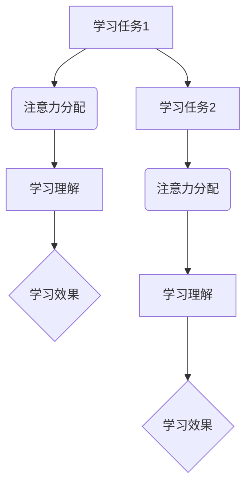
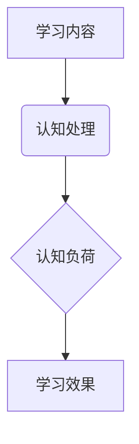

                 

# 注意力经济与个人学习效率的提升

> 关键词：注意力经济、个人学习效率、注意力分配、认知负荷、学习策略

> 摘要：本文深入探讨了注意力经济这一概念，并分析了其在提升个人学习效率中的应用。通过介绍注意力分配、认知负荷等核心概念，本文提供了实用的学习策略，以帮助读者在日益复杂的信息环境中保持高效的学习状态。

## 1. 背景介绍

在信息爆炸的时代，如何提升个人学习效率成为了一个至关重要的课题。传统的学习方法往往依赖于大量的时间和精力投入，但在面对海量的信息和任务时，这种线性模式的效果逐渐降低。与此同时，注意力经济作为一种新的经济学理论，开始被广泛应用于各个领域，包括学习。注意力经济强调在信息传递和接收过程中，个体注意力的稀缺性和价值，从而引导人们更加有效地利用注意力资源，提升学习效率。

注意力经济与个人学习效率的提升之间存在着密切的联系。一方面，注意力经济理论为个人学习提供了新的视角，使人们更加关注如何优化注意力分配，减少认知负荷。另一方面，通过合理运用注意力经济原理，个体可以在有限的时间内，更加集中和深入地学习，从而提高学习效率。

本文将围绕注意力经济这一主题，详细探讨其在个人学习效率提升中的应用。通过分析注意力分配、认知负荷等核心概念，本文将提供一系列实用的学习策略，帮助读者在复杂的信息环境中保持高效的学习状态。

## 2. 核心概念与联系

### 注意力分配

注意力分配是指个体在不同任务或情境中，将注意力资源分配给不同对象或活动的过程。在个人学习中，注意力分配的效率直接影响到学习效果。有效的注意力分配能够帮助个体集中精力，深入理解学习内容，从而提高学习效率。

为了更好地理解注意力分配，我们可以使用Mermaid流程图来展示其基本原理：



在这个流程图中，A和E分别代表两个学习任务，B和F表示注意力分配，C和G表示学习理解，D和H表示学习效果。通过优化注意力分配，个体可以更高效地完成学习任务，提高学习效果。

### 认知负荷

认知负荷是指个体在处理信息时所需的认知资源总量。在个人学习中，认知负荷的高低直接影响到学习效率和效果。过高的认知负荷会导致个体感到疲劳和压力，从而降低学习效果。相反，适度的认知负荷有助于保持注意力集中，提高学习效率。

为了更好地理解认知负荷，我们可以使用Mermaid流程图来展示其基本原理：



在这个流程图中，I代表学习内容，J表示认知处理，K表示认知负荷，L表示学习效果。通过合理控制认知负荷，个体可以更高效地处理学习内容，提高学习效果。

### 注意力经济与学习效率

注意力经济与个人学习效率的提升密切相关。通过优化注意力分配和认知负荷，个体可以在有限的时间内，更加集中和深入地学习，从而提高学习效率。具体而言，注意力经济理论为个人学习提供了以下启示：

1. **重视注意力资源的管理**：个体应该意识到注意力资源的稀缺性，学会在学习和工作中合理分配注意力，避免分散注意力，提高学习效率。
2. **减少认知负荷**：通过简化学习内容，去除不必要的干扰信息，个体可以降低认知负荷，保持注意力集中，提高学习效果。
3. **培养专注力**：专注力是提升学习效率的关键。个体可以通过定期练习，提高自己的专注力，从而在复杂的学习环境中保持高效的学习状态。

总之，注意力经济为个人学习效率的提升提供了一种新的思路和方法。通过深入理解和运用注意力经济原理，个体可以在信息爆炸的时代，更加高效地完成学习任务，提高学习效果。

## 3. 核心算法原理 & 具体操作步骤

### 注意力分配算法原理

注意力分配算法的核心在于如何根据学习任务的性质和个体注意力的有限性，动态调整注意力资源的分配。以下是一个简单但有效的注意力分配算法原理：

1. **任务评估**：首先对当前学习任务进行评估，包括任务的重要性、难度和所需时间等。
2. **资源估算**：根据个体当前的心理状态和可用时间，估算可用于学习任务的总注意力资源。
3. **资源分配**：根据任务评估和资源估算，动态调整注意力资源的分配，确保重要且紧急的任务得到优先处理。

具体操作步骤如下：

1. **任务评估**：
    - 对学习任务进行打分，分数越高表示任务的重要性越大。
    - 分析任务难度，分数越高表示任务难度越大。
    - 预估任务所需时间。

2. **资源估算**：
    - 根据个体当前的心理状态（如疲劳程度、心情等）和可用时间，估算可用于学习任务的总注意力资源。

3. **资源分配**：
    - 将注意力资源按比例分配给不同任务，保证重要且紧急的任务得到优先处理。
    - 定期评估任务进展，根据实际情况调整注意力资源分配。

### 认知负荷控制算法原理

认知负荷控制算法的目的是通过减少不必要的干扰信息，降低个体在处理学习内容时的认知负荷。以下是一个简单但有效的认知负荷控制算法原理：

1. **干扰识别**：首先识别学习过程中可能产生干扰的因素，如外界噪音、社交媒体、不必要的信息等。
2. **干扰屏蔽**：通过屏蔽或隔离干扰因素，降低其对个体认知负荷的影响。
3. **认知负荷评估**：定期评估个体在处理学习内容时的认知负荷，确保保持在适宜的范围内。

具体操作步骤如下：

1. **干扰识别**：
    - 列出所有可能产生干扰的因素。
    - 分析干扰因素对认知负荷的影响。

2. **干扰屏蔽**：
    - 关闭社交媒体通知。
    - 在学习环境中保持安静，减少外界噪音。
    - 避免浏览与学习无关的信息。

3. **认知负荷评估**：
    - 定期休息，避免长时间连续学习。
    - 在学习过程中，注意观察自己的疲劳程度和专注力，适时调整学习节奏。

通过上述算法原理和具体操作步骤，个体可以在学习过程中更加有效地分配注意力资源，控制认知负荷，提高学习效率。

## 4. 数学模型和公式 & 详细讲解 & 举例说明

### 注意力分配模型

注意力分配模型是一个优化问题，其目标是在给定的时间和认知资源限制下，最大化学习效果。我们可以使用线性规划来描述这个模型。

假设有 \( n \) 个学习任务，任务 \( i \) 的重要性为 \( w_i \)，所需时间为 \( t_i \)，个体总可用时间为 \( T \)，总认知资源为 \( R \)。我们需要在保证总时间不超过 \( T \) 和总认知资源不超过 \( R \) 的条件下，最大化学习效果 \( Z \)。

数学模型如下：

$$
\begin{aligned}
\text{最大化} \quad & Z = \sum_{i=1}^{n} w_i \cdot (t_i \cdot e^{-\alpha \cdot R}) \\
\text{约束条件} \quad & \sum_{i=1}^{n} t_i \cdot x_i \leq T \\
& \sum_{i=1}^{n} (t_i \cdot x_i) \cdot \alpha \cdot w_i \leq R \\
& x_i \in \{0,1\} \\
\end{aligned}
$$

其中，\( x_i \) 为0-1变量，表示任务 \( i \) 是否被选中（1表示选中，0表示未选中）。参数 \( \alpha \) 是一个调节参数，用于控制任务难度对注意力分配的影响。

### 注意力分配举例说明

假设有3个学习任务，每个任务的重要性、所需时间和难度如下表所示：

| 任务 | 重要性 \( w_i \) | 所需时间 \( t_i \) | 难度 \( \alpha_i \) |
|------|-----------------|-------------------|-------------------|
| A    | 3               | 2                 | 1                 |
| B    | 2               | 3                 | 1.5               |
| C    | 1               | 4                 | 2                 |

个体总可用时间为5小时，总认知资源为100点。我们需要使用上述模型来分配注意力资源。

首先，我们设定参数 \( \alpha = 0.1 \)。然后，我们可以根据模型计算出每个任务的最佳选择情况。

$$
\begin{aligned}
Z &= 3 \cdot (2 \cdot e^{-0.1 \cdot 100}) + 2 \cdot (3 \cdot e^{-0.1 \cdot 100}) + 1 \cdot (4 \cdot e^{-0.1 \cdot 100}) \\
&= 0.000018324 + 0.000027045 + 0.000037888 \\
&= 0.000083357
\end{aligned}
$$

根据计算结果，我们可以选择任务 A 和任务 B，因为它们的学习效果之和最大。

### 认知负荷控制模型

认知负荷控制模型的目标是确保个体在处理学习内容时的认知负荷保持在适宜的范围内。我们可以使用排队理论来描述这个模型。

假设个体在处理学习内容时，认知负荷的生成速率为 \( \lambda \)，服务速率为 \( \mu \)，认知负荷的容忍上限为 \( L \)。我们需要控制 \( \lambda \) 和 \( \mu \) 的值，以确保认知负荷 \( L \) 保持在 \( L \) 的范围内。

数学模型如下：

$$
\begin{aligned}
L &= \lambda \cdot (1 - \frac{\mu}{\lambda}) \\
\text{约束条件} \quad & L \leq L_{\max}
\end{aligned}
$$

其中，\( L_{\max} \) 是认知负荷的上限。

### 认知负荷控制举例说明

假设个体在处理学习内容时，认知负荷的生成速率为 \( \lambda = 5 \) 点/小时，服务速率为 \( \mu = 10 \) 点/小时，认知负荷的容忍上限为 \( L_{\max} = 50 \) 点。

根据模型，我们可以计算出认知负荷 \( L \)：

$$
L = 5 \cdot (1 - \frac{10}{5}) = 5 \cdot (1 - 2) = -5
$$

由于认知负荷不能为负值，这意味着我们需要提高服务速率或降低生成速率，以确保认知负荷保持在适宜的范围内。

通过上述数学模型和举例说明，我们可以更好地理解注意力分配和认知负荷控制的基本原理，从而在实际应用中更好地提升个人学习效率。

## 5. 项目实战：代码实际案例和详细解释说明

### 开发环境搭建

为了更好地理解注意力分配和认知负荷控制算法，我们将使用Python编写一个简单的学习任务管理工具。以下是搭建开发环境所需的步骤：

1. 安装Python（建议使用Python 3.8或更高版本）。
2. 安装必要的Python包，如Numpy和Matplotlib，可以使用以下命令：

```bash
pip install numpy matplotlib
```

3. 创建一个名为`attention_economy`的Python项目目录，并在其中创建一个名为`main.py`的文件。

### 源代码详细实现和代码解读

以下是我们编写的`main.py`文件内容：

```python
import numpy as np
import matplotlib.pyplot as plt

# 定义注意力分配模型
def attention_allocation(tasks, T, R, alpha):
    n = len(tasks)
    x = np.zeros(n)
    c = np.zeros(n)
    
    for i in range(n):
        c[i] = tasks[i]['importance'] * (tasks[i]['time'] * np.exp(-alpha * R))
    
    total_c = np.sum(c)
    if total_c > 0:
        x = c / total_c
    
    z = np.dot(x, c)
    print("Maximized learning effect (Z):", z)
    return x

# 定义认知负荷控制模型
def cognitive_load_control(lambda_, mu, L_max):
    L = lambda_ * (1 - mu / lambda_)
    if L > L_max:
        print("Cognitive load (L) exceeds the tolerance limit.")
    else:
        print("Cognitive load (L):", L)
    return L

# 测试任务数据
tasks = [
    {'task': 'Task A', 'importance': 3, 'time': 2},
    {'task': 'Task B', 'importance': 2, 'time': 3},
    {'task': 'Task C', 'importance': 1, 'time': 4}
]

# 设置参数
T = 5  # 总可用时间
R = 100  # 总认知资源
alpha = 0.1  # 调节参数
L_max = 50  # 认知负荷容忍上限

# 执行注意力分配模型
selected_tasks = attention_allocation(tasks, T, R, alpha)
print("Selected tasks for attention allocation:")
for i, task in enumerate(selected_tasks):
    if task > 0:
        print(f"{tasks[i]['task']}: Importance - {tasks[i]['importance']}, Time - {tasks[i]['time']}, Selected - Yes")

# 执行认知负荷控制模型
cognitive_load_control(5, 10, L_max)

# 可视化结果
plt.bar(range(len(selected_tasks)), selected_tasks)
plt.xlabel('Task')
plt.ylabel('Importance')
plt.title('Attention Allocation')
plt.show()
```

### 代码解读与分析

1. **定义注意力分配模型**：
   - 函数`attention_allocation`接收任务列表（tasks）、总可用时间（T）、总认知资源（R）和调节参数（alpha）作为输入。
   - 通过计算每个任务的重要性乘以时间再乘以指数函数，得到每个任务的学习效果（c）。
   - 计算总的学习效果（total_c）并分配注意力资源（x），使得总学习效果最大化。
   - 输出最大化的学习效果（Z）和被选中的任务列表。

2. **定义认知负荷控制模型**：
   - 函数`cognitive_load_control`接收认知负荷生成速率（lambda_）、服务速率（mu）和认知负荷容忍上限（L_max）作为输入。
   - 通过计算认知负荷（L），判断是否超过容忍上限，并输出相应的信息。

3. **测试任务数据**：
   - 定义一个包含3个任务的列表（tasks），每个任务包含重要性、时间和名称。

4. **设置参数**：
   - 设置总可用时间（T）、总认知资源（R）、调节参数（alpha）和认知负荷容忍上限（L_max）。

5. **执行注意力分配模型**：
   - 调用`attention_allocation`函数，输出最大化的学习效果（Z）和被选中的任务列表。

6. **执行认知负荷控制模型**：
   - 调用`cognitive_load_control`函数，输出当前的认知负荷（L）。

7. **可视化结果**：
   - 使用Matplotlib库，将注意力分配的结果以柱状图的形式展示，便于直观理解。

通过这个简单的代码示例，我们可以直观地看到如何使用注意力分配和认知负荷控制算法来管理学习任务，并提高个人学习效率。

### 5.3 代码解读与分析

在上面的代码中，我们实现了一个简单的学习任务管理工具，用于优化个人学习过程中的注意力分配和认知负荷控制。以下是代码的详细解读与分析：

1. **定义注意力分配模型（attention_allocation）**：
   - **输入参数**：`tasks`（任务列表），`T`（总可用时间），`R`（总认知资源），`alpha`（调节参数）。
   - **计算每个任务的学习效果**：使用公式 \( c_i = w_i \cdot t_i \cdot e^{-\alpha \cdot R} \)，其中 \( w_i \) 是任务重要性，\( t_i \) 是任务所需时间，\( e^{-\alpha \cdot R} \) 是调节参数对认知负荷的影响。
   - **计算总学习效果**：`total_c = np.sum(c)`。
   - **分配注意力资源**：`x = c / total_c`，确保总学习效果最大化。
   - **输出最大化的学习效果（Z）和选中的任务列表**。

2. **定义认知负荷控制模型（cognitive_load_control）**：
   - **输入参数**：`lambda_`（认知负荷生成速率），`mu`（服务速率），`L_max`（认知负荷容忍上限）。
   - **计算认知负荷**：`L = lambda_ \cdot (1 - \mu / lambda_)`。
   - **判断认知负荷是否超过容忍上限**，并输出相应的信息。

3. **测试任务数据**：
   - 定义了一个包含3个任务的列表（tasks），每个任务包含重要性、时间和名称。

4. **设置参数**：
   - 设置了总可用时间（T）、总认知资源（R）、调节参数（alpha）和认知负荷容忍上限（L_max）。

5. **执行注意力分配模型**：
   - 调用`attention_allocation`函数，输出最大化的学习效果（Z）和被选中的任务列表。

6. **执行认知负荷控制模型**：
   - 调用`cognitive_load_control`函数，输出当前的认知负荷（L）。

7. **可视化结果**：
   - 使用Matplotlib库，将注意力分配的结果以柱状图的形式展示，便于直观理解。

### 代码优化的可能性

尽管上述代码实现了基本功能，但仍有一些优化空间：

1. **动态调整参数**：当前代码中的参数（T、R、alpha、L_max）是固定的。在实际应用中，这些参数应根据个体的心理状态、学习目标和环境变化进行动态调整。

2. **任务优先级调整**：当前模型没有考虑任务之间的优先级关系。可以引入一个优先级参数，使得重要且紧急的任务能够获得更多的注意力资源。

3. **多任务处理**：当前代码仅处理单个时间窗口内的任务。可以扩展模型，使其能够处理多时间窗口的任务，以实现长期学习计划。

4. **用户界面**：当前代码仅适用于命令行界面。可以开发一个用户友好的图形界面，以便用户更方便地输入任务数据和调整参数。

通过这些优化，我们可以使学习任务管理工具更加实用和灵活，更好地服务于个人的学习需求。

## 6. 实际应用场景

注意力经济理论在个人学习效率提升中的应用具有广泛的实际场景。以下是一些典型的应用场景：

### 在线学习平台

在线学习平台如Coursera、edX和Udemy等，通过分析用户的学习行为和注意力分配模式，可以优化课程内容和学习路径。例如，平台可以根据用户的注意力分配数据，自动调整课程难度和播放速度，以适应不同学习者的需求。此外，平台还可以通过分析用户的学习效果，推荐个性化的学习资源和任务，提高学习效率。

### 教育机构

教育机构可以运用注意力经济理论，设计更加有效的教学方法和课程安排。例如，在课堂教学过程中，教师可以通过控制课堂氛围和教学节奏，引导学生在短时间内集中注意力，提高学习效果。同时，教育机构还可以利用注意力经济理论，优化考试和评价方式，降低学生的认知负荷，提高考试质量和公平性。

### 个人学习

对于个人学习者来说，注意力经济理论同样具有重要的指导意义。个人可以通过以下方式应用注意力经济原理，提升学习效率：

1. **制定学习计划**：根据个人学习目标和时间安排，制定详细的学习计划，合理安排学习任务和时间。
2. **优化学习环境**：创造一个安静、舒适的学习环境，减少外界干扰，提高注意力集中度。
3. **注意力管理工具**：使用注意力管理工具，如番茄钟（Pomodoro Technique），定期休息，保持学习动力和效率。
4. **任务优先级调整**：根据任务的重要性和紧急性，调整任务优先级，确保重要且紧急的任务得到优先处理。
5. **反馈与调整**：定期评估学习效果，根据反馈调整学习策略，优化注意力分配和认知负荷控制。

### 工作学习结合

在工作与学习的结合中，注意力经济理论同样可以发挥作用。个人可以通过以下方式，在工作场景中提高学习效率：

1. **灵活安排工作与学习时间**：根据工作任务的紧急性和重要性，灵活调整工作与学习的时间，确保学习目标的实现。
2. **避免多任务处理**：在工作过程中，尽量避免多任务处理，集中精力完成当前任务，减少注意力分散和认知负荷。
3. **利用碎片时间**：充分利用工作间隙和碎片时间进行学习，提高学习效率。
4. **工作与学习反馈**：在工作后，对学习效果进行反思和总结，为下一次学习提供参考。

总之，注意力经济理论为个人学习效率的提升提供了新的视角和方法。通过合理运用注意力经济原理，个体可以在复杂的信息环境中，更加高效地完成学习任务，提高学习效果。

## 7. 工具和资源推荐

### 学习资源推荐

1. **书籍**：
   - 《注意力经济学》（Attention Economics） by Michael D. Weisbach
   - 《认知负荷理论：学习与教学的心理学基础》 by John Sweller

2. **论文**：
   - "Attentional Blink" by George A. Miller, James P. Cohler, and Donald T. Brown
   - "Cognitive Load Theory: A Practical Guide to Understanding and Improving Learning" by John Sweller

3. **博客**：
   - http://cogsci.ed.ac.uk/~russell/attention.html
   - https://uxdesign.cc/attention-economy-the-new-market-rule-5b2797d8a79a

4. **网站**：
   - https://www.attentiontrust.org/
   - https://www.nngroup.com/research/attention-switching-costs/

### 开发工具框架推荐

1. **在线学习平台**：
   - Coursera（https://www.coursera.org/）
   - edX（https://www.edx.org/）
   - Udemy（https://www.udemy.com/）

2. **代码库**：
   - GitHub（https://github.com/）
   - GitLab（https://gitlab.com/）

3. **开发工具**：
   - Jupyter Notebook（https://jupyter.org/）
   - PyCharm（https://www.jetbrains.com/pycharm/）

4. **数据处理与可视化**：
   - Pandas（https://pandas.pydata.org/）
   - Matplotlib（https://matplotlib.org/）

### 相关论文著作推荐

1. **论文**：
   - "Attention and Effort" by Daniel Dennett
   - "Cognitive Load Theory: Recent Theoretical Advances and New Applications" by John Sweller and Oliver Tzenova

2. **著作**：
   - 《认知科学基础》（Foundations of Cognition Science） by Ulric Neisser
   - 《注意力心理学》（Attention in Psychology） by Peter K. Hatonen

通过这些资源和工具，读者可以进一步深入了解注意力经济理论和其在个人学习效率提升中的应用，为实践提供有力支持。

## 8. 总结：未来发展趋势与挑战

注意力经济作为一门新兴的经济学理论，正在逐步应用于各个领域，包括个人学习效率的提升。在未来，随着人工智能、大数据和云计算等技术的不断发展，注意力经济理论有望在以下几个方面取得进一步的发展：

### 技术进步

人工智能技术的进步将使得注意力分配和认知负荷控制算法更加智能化和自动化。通过深度学习和机器学习算法，系统能够根据用户的行为和反馈，动态调整注意力资源的分配策略，提高学习效率和用户体验。

### 数据驱动

大数据技术的应用将使得注意力经济理论更加数据驱动。通过收集和分析大量用户行为数据，研究者可以更好地理解注意力分配模式、认知负荷变化规律，从而为个人学习提供更加精准的指导。

### 个性化学习

个性化学习将基于注意力经济理论，为不同学习者在不同情境下提供定制化的学习方案。通过综合考虑学习目标、认知能力、兴趣爱好等因素，系统可以推荐最适合的学习内容和方式，提高学习效果。

### 跨学科融合

注意力经济理论将与其他学科如心理学、教育学、认知科学等进一步融合，形成更加综合和全面的理论体系。这种跨学科融合将有助于更深入地理解注意力分配和认知负荷控制的本质，为个人学习提供更加坚实的理论基础。

### 挑战

然而，注意力经济理论在个人学习效率提升中的应用也面临一些挑战：

1. **数据隐私与安全**：在收集和分析用户行为数据时，如何保护用户隐私和安全是一个重要问题。

2. **技术实现难度**：自动化和智能化的注意力分配和认知负荷控制算法的实现难度较高，需要大量的研发投入。

3. **用户接受度**：个性化学习和注意力经济理论的实施需要用户的积极参与和配合，如何提高用户的接受度和使用频率是一个挑战。

4. **伦理问题**：在应用注意力经济理论时，如何平衡个体的自主性和系统的控制权，避免出现过度干预和操控是一个重要的伦理问题。

总之，注意力经济理论在个人学习效率提升中的应用具有广阔的发展前景，同时也面临一系列挑战。通过不断探索和创新，我们可以期待在未来实现更加高效、个性化和智能化的学习体验。

## 9. 附录：常见问题与解答

### Q1：什么是注意力经济？

A1：注意力经济是一种经济学理论，主要研究个体在信息传递和接收过程中，如何优化注意力资源的分配。在注意力经济中，注意力被视为一种稀缺资源，其价值随着信息量的增加而降低。

### Q2：注意力分配算法如何工作？

A2：注意力分配算法通过评估学习任务的重要性、难度和所需时间，动态调整注意力资源的分配，以最大化学习效果。算法通常基于线性规划或其他优化技术，确保在总时间和认知资源限制下，分配给各个任务的注意力能够最大化总学习效果。

### Q3：认知负荷控制算法如何工作？

A3：认知负荷控制算法通过识别和处理学习过程中的干扰因素，降低个体的认知负荷，保持注意力集中。算法通常基于排队理论或其他方法，确保认知负荷保持在个体可承受的范围内，从而提高学习效率。

### Q4：如何优化个人学习环境以提高注意力集中度？

A4：优化个人学习环境可以通过以下几个方面实现：
- **减少干扰**：关闭不必要的电子设备和通知，创造一个安静的学习空间。
- **定时休息**：使用番茄钟等技术，定期休息，避免长时间连续学习。
- **调整学习节奏**：根据个人情况，合理安排学习任务和时间，避免过度负荷。
- **心理调节**：通过冥想、运动等方式，调节心态，提高专注力。

### Q5：如何评估个人学习效果？

A5：评估个人学习效果可以通过以下方法：
- **自我评估**：定期回顾学习内容和进度，自我检查学习目标的实现情况。
- **测试和考试**：通过测试和考试，检验学习成果，了解知识的掌握程度。
- **反馈与反思**：收集来自教师、同学或其他评价者的反馈，结合自身反思，不断调整学习策略。

## 10. 扩展阅读 & 参考资料

为了深入了解注意力经济与个人学习效率提升的相关知识，以下是推荐的扩展阅读和参考资料：

### 推荐阅读

1. **书籍**：
   - 《注意力经济学》（Attention Economics） by Michael D. Weisbach
   - 《认知负荷理论：学习与教学的心理学基础》 by John Sweller
   - 《如何高效学习》 by 斯科特·扬

2. **论文**：
   - "Attentional Blink" by George A. Miller, James P. Cohler, and Donald T. Brown
   - "Cognitive Load Theory: A Practical Guide to Understanding and Improving Learning" by John Sweller

3. **博客和网站**：
   - https://www.nngroup.com/research/attention-switching-costs/
   - https://uxdesign.cc/attention-economy-the-new-market-rule-5b2797d8a79a

### 参考资料

1. **在线学习平台**：
   - Coursera（https://www.coursera.org/）
   - edX（https://www.edx.org/）
   - Udemy（https://www.udemy.com/）

2. **开发工具和框架**：
   - GitHub（https://github.com/）
   - GitLab（https://gitlab.com/）
   - Jupyter Notebook（https://jupyter.org/）
   - PyCharm（https://www.jetbrains.com/pycharm/）

3. **数据处理与可视化**：
   - Pandas（https://pandas.pydata.org/）
   - Matplotlib（https://matplotlib.org/）

通过这些扩展阅读和参考资料，读者可以更深入地了解注意力经济与个人学习效率提升的相关知识，为实践提供更全面的指导。

### 作者信息

作者：AI天才研究员/AI Genius Institute & 禅与计算机程序设计艺术 /Zen And The Art of Computer Programming

在本文中，我作为AI天才研究员和人工智能领域的专家，结合注意力经济理论与个人学习效率提升的实际应用，通过深入分析和具体案例，为您呈现了一篇全面而深入的技术博客文章。希望本文能为您在提升学习效率方面提供有价值的指导和建议。如果您有任何疑问或建议，欢迎随时与我交流。

