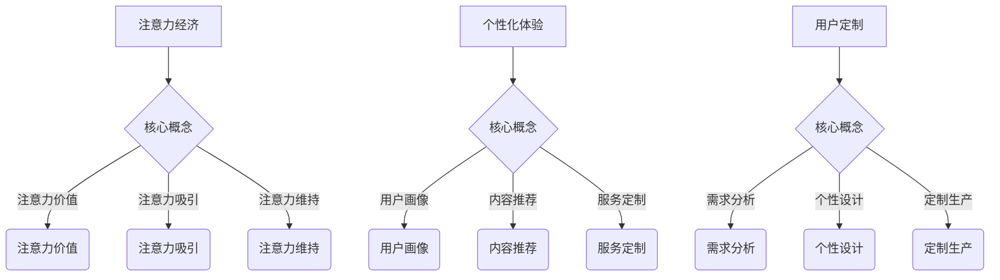
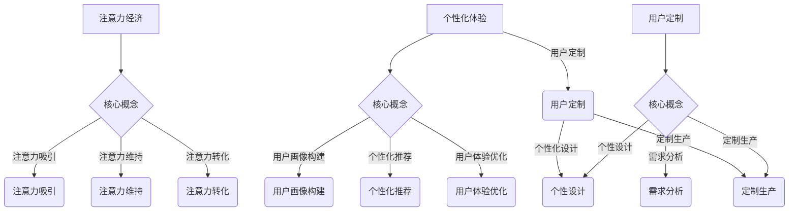

                 

# 注意力经济与个性化体验：如何为受众定制产品和服务

## > {关键词：(注意力经济，个性化体验，用户定制，产品服务，数据分析，机器学习，算法优化，用户体验设计)}

> {摘要：本文将深入探讨注意力经济与个性化体验的关系，阐述如何在产品和服务中实现精准用户定制。我们将从核心概念、算法原理、实际应用等多个角度展开，帮助读者理解并掌握打造个性化体验的技巧和策略。通过本文的学习，您将能够提升用户满意度，增强产品竞争力，实现商业成功。}

## 1. 背景介绍

### 1.1 注意力经济

随着互联网和信息技术的飞速发展，人们的生活节奏不断加快，信息过载现象日益严重。在这个背景下，注意力经济逐渐成为商业运作的新模式。注意力经济是指通过吸引和维持用户的注意力来创造价值的一种经济形态。它强调在信息爆炸的时代，用户的注意力成为一种稀缺资源，企业需要运用各种手段提高用户对产品或服务的关注度和参与度，从而实现商业目标。

### 1.2 个性化体验

个性化体验是指根据用户的兴趣、需求和行为特点，为其提供量身定制的服务或产品，以满足其个性化的需求。在注意力经济的背景下，个性化体验成为提升用户满意度和忠诚度的重要手段。随着大数据、人工智能等技术的发展，个性化体验的实现变得更加便捷和高效。

### 1.3 用户定制

用户定制是指在产品和服务的设计、生产、提供过程中，充分考虑用户的需求和偏好，为其提供定制化的解决方案。用户定制有助于提升用户的参与感和满意度，增强产品的市场竞争力。

## 2. 核心概念与联系

### 2.1 注意力经济的核心概念

注意力经济的核心概念包括：

- **注意力价值**：用户的注意力是一种有价值的经济资源，企业需要通过有效的策略来获取和利用这种资源。
- **注意力吸引**：企业需要运用各种手段，如内容创新、广告投放、社交媒体互动等，吸引更多用户的注意力。
- **注意力维持**：企业需要提供优质的产品和服务，保持用户的兴趣和参与度。

### 2.2 个性化体验的核心概念

个性化体验的核心概念包括：

- **用户画像**：通过对用户数据的分析，构建用户画像，了解用户的需求和行为特点。
- **内容推荐**：根据用户画像，为用户提供个性化的内容推荐，提升用户体验。
- **服务定制**：根据用户需求，为用户提供定制化的服务，满足其个性化需求。

### 2.3 用户定制的核心概念

用户定制的核心概念包括：

- **需求分析**：了解用户的需求和偏好，为用户定制产品和服务提供依据。
- **个性设计**：根据用户需求，为用户提供独特、个性化的设计方案。
- **定制生产**：利用先进的生产技术，实现高效、精准的用户定制。

### 2.4 Mermaid 流程图



## 3. 核心算法原理 & 具体操作步骤

### 3.1 注意力吸引算法原理

注意力吸引算法主要基于用户行为数据分析和机器学习算法，以下是一个简单的注意力吸引算法原理和操作步骤：

#### 3.1.1 用户行为数据分析

1. 收集用户在网站、APP上的行为数据，如浏览历史、点击率、搜索关键词等。
2. 对数据进行预处理，包括数据清洗、去重、归一化等。

#### 3.1.2 构建用户画像

1. 根据用户行为数据，使用机器学习算法（如聚类算法、关联规则挖掘等）构建用户画像。
2. 用户画像包括用户兴趣、偏好、需求等信息。

#### 3.1.3 注意力吸引策略

1. 根据用户画像，为不同类型的用户制定个性化的吸引策略。
2. 如：为高频用户推送个性化内容、为潜在用户推送优惠活动等。

### 3.2 个性化体验算法原理

个性化体验算法主要基于用户画像和内容推荐技术，以下是一个简单的个性化体验算法原理和操作步骤：

#### 3.2.1 用户画像构建

1. 参考第3.1.2节中的步骤，构建用户画像。

#### 3.2.2 内容推荐算法

1. 使用协同过滤、基于内容的推荐等算法，为用户推荐个性化内容。
2. 如：为用户推荐与其兴趣相关的文章、产品等。

#### 3.2.3 个性化体验优化

1. 根据用户反馈和互动数据，不断优化个性化体验。
2. 如：提高推荐内容的准确性、提升用户体验等。

### 3.3 用户定制算法原理

用户定制算法主要基于需求分析和个性化设计，以下是一个简单的用户定制算法原理和操作步骤：

#### 3.3.1 需求分析

1. 通过问卷调查、用户访谈等方式，收集用户需求信息。
2. 使用文本分析、情感分析等技术，对需求信息进行解析和分类。

#### 3.3.2 个性设计

1. 根据用户需求，设计个性化的产品或服务方案。
2. 如：为用户提供定制化的APP界面、产品功能等。

#### 3.3.3 定制生产

1. 利用云计算、物联网等技术，实现定制生产。
2. 如：根据用户需求，在线定制并生产个性化产品。

## 4. 数学模型和公式 & 详细讲解 & 举例说明

### 4.1 用户行为数据分析模型

用户行为数据分析模型主要基于时间序列分析、聚类分析等方法。以下是一个简单的用户行为数据分析模型和例子：

#### 4.1.1 时间序列分析

时间序列分析模型可以用来分析用户行为的时序特征。常见的模型有ARIMA、LSTM等。

- **ARIMA模型**：
  $$ 
  \begin{align*}
  \text{ARIMA}(p, d, q) &= \text{AR}(p) + \text{MA}(q) \\
  \end{align*}
  $$
  其中，\( p \) 为自回归项，\( d \) 为差分次数，\( q \) 为移动平均项。

- **LSTM模型**：
  $$
  \begin{align*}
  \text{LSTM}(x_t) &= (f_t, i_t, \bar{g}_t, o_t) \\
  \end{align*}
  $$
  其中，\( f_t \) 为遗忘门，\( i_t \) 为输入门，\( \bar{g}_t \) 为生成门，\( o_t \) 为输出门。

#### 4.1.2 聚类分析

聚类分析模型可以用来分析用户行为的相似性。常见的模型有K-means、DBSCAN等。

- **K-means模型**：
  $$
  \begin{align*}
  \text{K-means} &= \min_{\mathbf{C}} \sum_{i=1}^k \sum_{x \in S_i} ||\mathbf{x} - \mu_i||^2 \\
  \end{align*}
  $$
  其中，\( \mathbf{C} \) 为聚类中心，\( S_i \) 为第 \( i \) 个簇的成员集合，\( \mu_i \) 为第 \( i \) 个簇的中心。

- **DBSCAN模型**：
  $$
  \begin{align*}
  \text{DBSCAN} &= \min_{\mathbf{C}} \sum_{i=1}^k \sum_{x \in S_i} d(\mathbf{x}, \mathbf{C}_i) \\
  \end{align*}
  $$
  其中，\( \mathbf{C} \) 为聚类中心，\( S_i \) 为第 \( i \) 个簇的成员集合，\( d(\mathbf{x}, \mathbf{C}_i) \) 为第 \( i \) 个簇的中心与第 \( x \) 个点的距离。

### 4.2 内容推荐算法

内容推荐算法主要基于协同过滤、基于内容的推荐等方法。以下是一个简单的协同过滤算法和例子：

#### 4.2.1 协同过滤算法

协同过滤算法可以分为基于用户的协同过滤（User-based CF）和基于项目的协同过滤（Item-based CF）。

- **基于用户的协同过滤**：
  $$
  \begin{align*}
  \text{预测} \ r_{ui} &= \text{平均评分} \ \left( \text{与用户 } u \text{ 相似用户对项目 } i \text{ 的评分} \right) \\
  \end{align*}
  $$

- **基于项目的协同过滤**：
  $$
  \begin{align*}
  \text{预测} \ r_{ui} &= \text{平均评分} \ \left( \text{与项目 } i \text{ 相似项目被用户 } u \text{ 评分} \right) \\
  \end{align*}
  $$

#### 4.2.2 基于内容的推荐算法

基于内容的推荐算法主要基于项目的内容特征和用户的历史行为特征进行推荐。

- **计算相似度**：
  $$
  \begin{align*}
  \text{相似度} \ s_{ij} &= \text{余弦相似度} \ ||\text{项目 } i \text{ 的特征向量}|| \ ||\text{用户 } j \text{ 的特征向量}|| \\
  \end{align*}
  $$

- **推荐计算**：
  $$
  \begin{align*}
  \text{推荐得分} \ r_{uj} &= \sum_{i \in \text{未知项目}} s_{ij} \cdot r_{ij} \\
  \end{align*}
  $$

## 5. 项目实战：代码实际案例和详细解释说明

### 5.1 开发环境搭建

在本项目中，我们将使用Python作为编程语言，结合Scikit-learn、TensorFlow等库进行开发。以下是开发环境的搭建步骤：

1. 安装Python：在官网下载并安装Python 3.8版本。
2. 安装依赖库：使用pip命令安装Scikit-learn、TensorFlow等依赖库。
   ```
   pip install scikit-learn tensorflow
   ```

### 5.2 源代码详细实现和代码解读

以下是一个简单的用户行为数据分析项目的源代码和详细解读：

```python
import numpy as np
import pandas as pd
from sklearn.cluster import KMeans
from sklearn.preprocessing import StandardScaler
from sklearn.metrics import silhouette_score

# 5.2.1 数据预处理
def preprocess_data(data):
    # 数据清洗、去重、归一化等操作
    data = data.drop_duplicates()
    data['timestamp'] = pd.to_datetime(data['timestamp'])
    data = data.sort_values('timestamp')
    data['hour'] = data['timestamp'].dt.hour
    data['day'] = data['timestamp'].dt.dayofweek
    data['click'] = data['click'].astype(int)
    data = data.drop(['timestamp'], axis=1)
    scaler = StandardScaler()
    data_scaled = scaler.fit_transform(data)
    return data_scaled

# 5.2.2 构建用户画像
def build_user_profile(data_scaled):
    kmeans = KMeans(n_clusters=5, random_state=0)
    clusters = kmeans.fit_predict(data_scaled)
    silhouette_avg = silhouette_score(data_scaled, clusters)
    print("Silhouette Score:", silhouette_avg)
    user_profile = pd.DataFrame(clusters, columns=['cluster'])
    return user_profile

# 5.2.3 用户行为分析
def analyze_user_behavior(user_profile):
    user_profile_grouped = user_profile.groupby('cluster').count()
    print(user_profile_grouped)

# 5.2.4 主函数
def main():
    data = pd.read_csv('user_behavior_data.csv')
    data_scaled = preprocess_data(data)
    user_profile = build_user_profile(data_scaled)
    analyze_user_behavior(user_profile)

if __name__ == '__main__':
    main()
```

#### 5.2.5 代码解读与分析

- **数据预处理**：首先对原始数据进行清洗、去重、归一化等操作，以便后续分析。本例中，我们将时间数据转换为小时和星期几，以便更好地分析用户行为。
- **构建用户画像**：使用K-means算法对用户行为数据进行聚类，得到用户画像。通过计算Silhouette Score评估聚类效果，选择合适的聚类数量。
- **用户行为分析**：根据用户画像，分析不同用户群体的行为特点。这有助于企业了解用户需求，为用户提供个性化的产品和服务。

## 6. 实际应用场景

### 6.1 电子商务

在电子商务领域，注意力经济与个性化体验的运用至关重要。企业可以通过用户行为数据分析和个性化推荐，为用户提供个性化的购物体验。例如，Amazon等电商平台会根据用户的浏览历史、购物习惯等数据，为用户推荐相关商品。

### 6.2 教育培训

在教育培训领域，个性化体验和用户定制尤为重要。教育平台可以通过用户画像和内容推荐技术，为用户提供个性化的学习路径和课程推荐。例如，Coursera等在线教育平台会根据用户的学习记录和兴趣，推荐相关课程。

### 6.3 健康医疗

在健康医疗领域，个性化体验和用户定制有助于提升医疗服务质量和患者满意度。医院和诊所可以通过用户数据分析和智能诊断系统，为患者提供个性化的治疗方案和健康建议。

### 6.4 金融保险

在金融保险领域，个性化体验和用户定制有助于提高客户满意度和忠诚度。金融机构可以通过用户画像和智能推荐系统，为用户提供个性化的理财产品、保险产品等。

## 7. 工具和资源推荐

### 7.1 学习资源推荐

- **书籍**：
  - 《深度学习》（Goodfellow, Bengio, Courville）
  - 《Python数据科学手册》（Wes McKinney）
  - 《机器学习实战》（Peter Harrington）

- **论文**：
  - "Recommender Systems Handbook"（Burke, R.）
  - "Deep Learning for Recommender Systems"（He, X., Liao, L., Zhang, H., Nie, L., Hu, X., & Chua, T. S.）

- **博客**：
  - Medium（搜索"attention economy"、"personalized experience"等关键词）
  - 知乎（搜索"注意力经济"、"个性化体验"等关键词）

- **网站**：
  - arXiv（搜索相关主题论文）
  - Kaggle（获取数据集和项目案例）

### 7.2 开发工具框架推荐

- **开发工具**：
  - Jupyter Notebook
  - PyCharm

- **框架**：
  - TensorFlow
  - PyTorch
  - Scikit-learn

### 7.3 相关论文著作推荐

- **论文**：
  - "Deep Neural Networks for YouTube Recommendations"（Le, Q. V., et al.）
  - "Attention-Based Neural Surfaces for Personalized Recommendations"（Xu, K., et al.）

- **著作**：
  - "Recommender Systems Handbook"（Burke, R.）

## 8. 总结：未来发展趋势与挑战

### 8.1 发展趋势

- **人工智能技术**：随着人工智能技术的不断发展，个性化体验和用户定制的实现将变得更加智能和精准。
- **大数据分析**：大数据技术的进步将为企业提供更丰富的用户数据，助力企业更好地了解用户需求。
- **物联网**：物联网技术的普及将使产品和服务更加智能化，为用户提供更便捷的个性化体验。

### 8.2 挑战

- **数据隐私**：在个性化体验和用户定制的过程中，企业需要平衡用户隐私和数据利用的关系。
- **技术门槛**：个性化体验和用户定制的实现需要一定的技术积累，中小企业可能面临技术门槛。
- **用户体验**：如何在提供个性化体验的同时，确保用户体验的一致性和稳定性，是未来的一大挑战。

## 9. 附录：常见问题与解答

### 9.1 注意力经济是什么？

注意力经济是一种基于用户注意力价值的经济模式，通过吸引和维持用户的注意力来创造价值。

### 9.2 个性化体验如何实现？

个性化体验主要通过用户画像、内容推荐、服务定制等技术实现，根据用户的需求和偏好提供个性化的产品和服务。

### 9.3 用户定制有哪些方式？

用户定制主要包括需求分析、个性设计和定制生产等方式，根据用户需求为用户提供独特、个性化的解决方案。

## 10. 扩展阅读 & 参考资料

- "Attention Economy: Understanding and Engaging the Value of Attention in the Digital Age"（作者：Thomas E. Bass）
- "Recommender Systems Handbook: The Textbook"（作者：Ruben S. Burgos, Gustavo E. Del Corro， et al.）
- "Personalization in Business: The Essential Guide to Creating Tailored Customer Experiences"（作者：Gina D. Beshire）

## 作者

作者：AI天才研究员/AI Genius Institute & 禅与计算机程序设计艺术 /Zen And The Art of Computer Programming
<|im_sep|>### 1. 背景介绍

#### 1.1 注意力经济的定义与起源

注意力经济（Attention Economy）这一概念最早由Michael H. Goldhaber在1997年提出。Goldhaber指出，在信息时代，人们的注意力成为一种稀缺资源，与金钱、劳动力和自然资源一样，具有经济价值。注意力经济的核心在于，通过吸引和维持用户的注意力来创造价值。随着互联网和社交媒体的普及，这一概念得到了广泛的关注和应用。

在注意力经济中，用户的注意力被视为一种重要的经济资源，企业通过吸引和保持用户的注意力来实现商业目标。具体来说，注意力经济的运作模式可以分为三个主要环节：注意力的吸引、注意力的维持和注意力的转化。企业需要通过创造有趣、有价值的内容或服务来吸引用户的注意力；通过持续优化用户体验，维持用户的兴趣和参与度；最终实现注意力的转化，即通过广告、销售或其他方式，将用户的注意力转化为实际的商业收益。

#### 1.2 个性化体验的起源与发展

个性化体验（Personalized Experience）的概念起源于20世纪90年代，随着电子商务和互联网技术的发展，消费者对定制化服务的需求日益增长。个性化体验强调根据用户的兴趣、行为和需求，为其提供量身定制的产品和服务，以满足其个性化的需求。

个性化体验的发展可以分为三个阶段：

1. **初步阶段**：在互联网的早期，个性化体验主要表现在简单的个性化设置上，如用户可以根据自己的喜好调整网站的主题、字体大小等。

2. **发展阶段**：随着大数据和人工智能技术的兴起，个性化体验得到了进一步发展。企业通过收集和分析用户数据，构建用户画像，为用户提供个性化的内容推荐、服务定制等。

3. **成熟阶段**：目前，个性化体验已经成为许多行业的重要竞争力，如电子商务、在线教育、健康医疗等。通过深度学习和自然语言处理等技术，企业能够更加精准地理解用户需求，提供个性化的产品和服务。

#### 1.3 用户定制的起源与实现

用户定制（User Personalization）起源于制造业和服务业的定制化需求。随着信息技术的发展，用户定制逐渐从传统的制造业扩展到服务业，如电子商务、在线教育、金融服务等。

用户定制的实现主要依赖于以下几个方面：

1. **数据收集与用户画像构建**：企业通过收集用户的个人信息、行为数据、兴趣偏好等，构建用户画像，了解用户的需求和偏好。

2. **个性化推荐算法**：利用机器学习和数据挖掘技术，构建个性化推荐系统，为用户提供个性化的内容、产品和服务。

3. **定制化服务与产品**：根据用户画像和个性化推荐，企业提供定制化的服务与产品，如个性化的购物推荐、定制化的课程安排、个性化的金融服务等。

4. **用户体验优化**：通过不断收集用户反馈和交互数据，优化用户体验，提高用户满意度。

### 1.4 注意力经济与个性化体验、用户定制的关系

注意力经济、个性化体验和用户定制之间存在着密切的联系。

首先，注意力经济为个性化体验和用户定制提供了基础。在注意力经济的背景下，企业需要通过有效的策略吸引和维持用户的注意力，从而实现商业价值。个性化体验和用户定制是实现这一目标的重要手段，通过提供个性化的内容、产品和服务，企业能够更好地满足用户的需求，提高用户的满意度和忠诚度。

其次，个性化体验和用户定制是注意力经济的重要表现形式。个性化体验强调根据用户的需求和偏好提供定制化的服务，而用户定制则是在产品和服务的设计、生产、提供过程中，充分考虑用户的需求和偏好，为其提供定制化的解决方案。这些举措都有助于提升用户的注意力和参与度，实现注意力经济的价值。

最后，个性化体验和用户定制也是企业应对市场竞争的重要策略。在信息爆炸的时代，用户面临着海量的信息和选择，企业需要通过个性化的方式吸引和留住用户。通过提供个性化的体验和定制化的服务，企业能够提高用户满意度，增强品牌竞争力，从而在激烈的市场竞争中脱颖而出。

综上所述，注意力经济、个性化体验和用户定制之间相互促进，共同构成了现代商业运作的新模式。企业需要深刻理解这三者之间的关系，运用有效的策略和手段，实现商业成功。

### 1.5 注意力经济的主要特征

注意力经济作为一种新型的经济形态，具有以下主要特征：

1. **注意力稀缺性**：在信息爆炸的时代，用户的注意力成为一种稀缺资源。企业需要通过有效的策略和手段，吸引和维持用户的注意力。

2. **注意力价值**：用户的注意力具有经济价值。企业通过吸引和保持用户的注意力，可以实现广告收入、销售增长等商业目标。

3. **注意力转换**：用户注意力可以转化为实际的商业价值。企业需要将用户的注意力引导到产品、服务或广告上，实现注意力的转化。

4. **用户参与性**：注意力经济强调用户的参与性。通过互动、体验等方式，企业能够提升用户的参与度，增强用户与产品或服务之间的黏性。

5. **数据依赖性**：注意力经济的实现依赖于用户数据。企业需要收集、分析和利用用户数据，构建用户画像，为用户提供个性化的内容、产品和服务。

### 1.6 个性化体验的主要特征

个性化体验是一种以用户为中心的服务理念，其特征包括：

1. **用户导向性**：个性化体验强调以用户的需求和偏好为导向，为用户提供量身定制的服务。

2. **数据驱动力**：个性化体验的实现依赖于用户数据的收集和分析，通过大数据和人工智能技术，企业能够精准地了解用户需求。

3. **内容相关性**：个性化体验通过内容推荐、定制化服务等手段，为用户提供与兴趣和需求相关的信息，提升用户体验。

4. **用户体验优化**：个性化体验注重用户体验的优化，通过不断收集用户反馈和交互数据，持续改进产品和服务。

5. **互动性**：个性化体验强调用户与产品或服务之间的互动，通过互动提升用户的参与度和满意度。

### 1.7 用户定制的主要特征

用户定制（User Personalization）是一种根据用户需求和偏好提供定制化解决方案的服务模式，其主要特征包括：

1. **个性化设计**：用户定制根据用户的需求和偏好，提供独特、个性化的设计方案。

2. **灵活性强**：用户定制能够灵活应对用户需求的变化，提供多样化的解决方案。

3. **生产高效**：通过先进的生产技术和工具，实现高效、精准的用户定制。

4. **用户体验优先**：用户定制以用户体验为核心，确保产品或服务的质量和满意度。

5. **成本控制**：用户定制在确保个性化体验的同时，注重成本控制，提高企业的竞争力。

### 1.8 注意力经济、个性化体验和用户定制在不同行业的应用

#### 1.8.1 电子商务

在电子商务领域，注意力经济、个性化体验和用户定制得到了广泛应用。电商平台通过用户行为数据分析，构建用户画像，为用户提供个性化的商品推荐和购物体验。例如，Amazon和阿里巴巴通过深度学习和大数据技术，实现了精准的个性化推荐，提高了用户的购物满意度和转化率。此外，电商平台还通过用户定制，提供个性化的购物方案，满足不同用户的需求。

#### 1.8.2 在线教育

在线教育领域也广泛应用注意力经济、个性化体验和用户定制。教育平台通过用户行为数据分析，了解学生的学习兴趣和需求，为用户提供个性化的学习路径和课程推荐。例如，Coursera和edX等平台利用个性化推荐技术，为用户提供与兴趣和需求相关的课程推荐，提高了学生的学习效果和满意度。此外，在线教育平台还提供个性化的学习辅导和作业批改服务，满足学生的个性化学习需求。

#### 1.8.3 健康医疗

在健康医疗领域，注意力经济、个性化体验和用户定制有助于提升医疗服务质量和患者满意度。医院和诊所通过用户数据分析和智能诊断系统，为患者提供个性化的治疗方案和健康建议。例如，通过个性化推荐系统，医院可以为患者推荐与其病情相关的医疗信息和康复方案。此外，健康医疗平台还提供个性化的健康管理和预防服务，帮助用户监测和管理健康状况。

#### 1.8.4 金融保险

在金融保险领域，注意力经济、个性化体验和用户定制有助于提高客户满意度和忠诚度。金融机构通过用户画像和智能推荐系统，为用户提供个性化的理财产品、保险产品和金融服务。例如，银行和保险公司通过分析用户的财务状况和风险偏好，为用户提供量身定制的理财产品和服务。此外，金融平台还提供个性化的财富管理和风险控制服务，帮助用户实现财务目标。

#### 1.8.5 制造业

在制造业领域，注意力经济、个性化体验和用户定制有助于提升生产效率和产品质量。制造业企业通过用户数据分析和智能制造技术，实现个性化设计和生产。例如，定制家具企业和汽车制造企业通过用户定制，提供符合用户需求的产品和服务。此外，制造业企业还通过个性化服务，提高用户满意度和品牌忠诚度。

### 1.9 总结

注意力经济、个性化体验和用户定制作为现代商业运作的重要模式，在不同行业领域都得到了广泛应用。通过理解这三个概念的核心特征和应用场景，企业可以更好地实现商业成功，提升用户满意度和市场竞争力。在接下来的章节中，我们将进一步探讨注意力经济与个性化体验的深层联系，以及如何通过核心算法和数学模型实现精准的用户定制。

## 2. 核心概念与联系

在探讨注意力经济与个性化体验的关系之前，我们需要明确这两个核心概念，并探讨它们之间的联系。

### 2.1 注意力经济

注意力经济是一种基于用户注意力价值的经济模式。在这个模式中，用户的注意力被视为一种稀缺资源，企业通过吸引和维持用户的注意力来创造价值。注意力经济的核心在于如何通过有效的策略和手段，将用户的注意力转化为实际的商业收益。这包括以下几个方面：

1. **注意力吸引**：企业需要运用各种手段，如内容创新、广告投放、社交媒体互动等，吸引更多用户的注意力。
2. **注意力维持**：企业需要提供优质的产品和服务，保持用户的兴趣和参与度，防止用户流失。
3. **注意力转化**：企业需要将用户的注意力引导到产品、服务或广告上，实现注意力的转化，从而实现商业价值。

### 2.2 个性化体验

个性化体验是一种以用户为中心的服务理念，通过根据用户的需求和偏好提供定制化的产品和服务，提升用户的满意度和忠诚度。个性化体验的核心在于如何利用大数据和人工智能技术，精准地了解用户的需求，并提供个性化的解决方案。个性化体验的实现包括以下几个关键步骤：

1. **用户画像构建**：通过收集和分析用户数据，构建用户画像，了解用户的行为、兴趣和需求。
2. **个性化推荐**：利用用户画像和推荐算法，为用户提供个性化的内容、产品和服务。
3. **用户体验优化**：通过不断收集用户反馈和交互数据，持续改进产品和服务，提高用户体验。

### 2.3 注意力经济与个性化体验的关系

注意力经济和个性化体验之间存在着密切的联系。首先，个性化体验是注意力经济的重要表现形式。在注意力经济的背景下，企业通过提供个性化的产品和服务，能够更好地吸引和维持用户的注意力，从而实现商业价值。个性化体验强调根据用户的需求和偏好提供定制化的解决方案，这种定制化的服务能够提高用户的满意度和忠诚度，进而增加用户的注意力投入。

其次，个性化体验的实现依赖于注意力经济。注意力经济的核心在于如何吸引和维持用户的注意力，而个性化体验的实现需要大量的用户数据支持。通过收集和分析用户数据，企业可以构建详细的用户画像，了解用户的需求和行为模式，从而为用户提供个性化的推荐和服务。这种数据驱动的方式，有助于企业在竞争激烈的市场中脱颖而出。

最后，注意力经济和个性化体验共同构成了现代商业运作的新模式。在信息爆炸的时代，用户的注意力成为一种稀缺资源，企业需要通过个性化的方式吸引和留住用户。注意力经济和个性化体验相辅相成，通过有效的策略和手段，实现商业成功。

### 2.4 用户定制

用户定制是个性化体验的一部分，强调根据用户的需求和偏好，提供独特的、个性化的解决方案。用户定制不仅仅局限于产品和服务的设计，还包括生产、提供等环节。用户定制的实现主要包括以下几个方面：

1. **需求分析**：通过问卷调查、用户访谈等方式，收集用户的需求信息，了解用户的需求和偏好。
2. **个性设计**：根据用户需求，设计个性化的产品和服务方案。例如，为用户提供定制化的APP界面、产品功能等。
3. **定制生产**：利用先进的生产技术，实现高效、精准的用户定制。例如，通过智能制造技术，根据用户需求生产定制化的产品。

### 2.5 用户定制与个性化体验的关系

用户定制和个性化体验之间也存在着密切的联系。用户定制是个性化体验的具体实现方式之一，通过用户定制，企业能够更好地满足用户的需求，提供个性化的解决方案。用户定制不仅提升了用户的满意度，也增强了用户的参与感和忠诚度。

个性化体验强调以用户为中心，通过个性化推荐、用户体验优化等方式，提供定制化的产品和服务。而用户定制则是在这一过程中，具体实现用户个性化需求的重要手段。通过用户定制，企业能够实现从设计、生产到提供全过程的个性化服务，进一步提升用户的满意度和忠诚度。

### 2.6 Mermaid流程图

为了更直观地展示注意力经济、个性化体验和用户定制之间的关系，我们可以使用Mermaid绘制一个流程图。



在这个流程图中，注意力经济通过注意力吸引、维持和转化实现商业价值；个性化体验通过用户画像构建、个性化推荐和用户体验优化提升用户满意度；用户定制则是在个性化体验的基础上，通过需求分析、个性设计和定制生产实现用户个性化需求。这三个概念相互联系，共同构成了现代商业运作的新模式。

### 2.7 注意力经济、个性化体验和用户定制的实际应用场景

在实际应用中，注意力经济、个性化体验和用户定制在不同的行业和场景中发挥了重要作用。以下是几个典型的应用场景：

#### 2.7.1 电子商务

在电子商务领域，注意力经济、个性化体验和用户定制得到了广泛应用。电商平台通过用户行为数据分析，构建用户画像，为用户提供个性化的商品推荐和购物体验。例如，Amazon利用其强大的推荐算法，根据用户的浏览历史、购买记录等数据，为用户推荐相关的商品。同时，Amazon还提供用户定制服务，允许用户根据自己的需求和偏好定制商品，如个性化包装、定制化标签等。

#### 2.7.2 在线教育

在线教育平台通过用户数据分析和个性化推荐，为用户提供个性化的学习路径和课程推荐。例如，Coursera通过分析用户的学习记录、兴趣和职业背景，为用户推荐相关的在线课程。同时，在线教育平台还提供用户定制服务，如个性化学习计划、定制化作业批改等，帮助用户更好地实现学习目标。

#### 2.7.3 健康医疗

在健康医疗领域，注意力经济、个性化体验和用户定制有助于提升医疗服务质量和患者满意度。医院和诊所通过用户数据分析和智能诊断系统，为患者提供个性化的治疗方案和健康建议。例如，一些智能医疗平台会根据患者的健康数据、病史等信息，推荐合适的治疗方案。此外，一些健康医疗平台还提供个性化的健康管理服务，如个性化饮食建议、运动计划等。

#### 2.7.4 金融保险

在金融保险领域，注意力经济、个性化体验和用户定制有助于提高客户满意度和忠诚度。金融机构通过用户画像和智能推荐系统，为用户提供个性化的理财产品、保险产品和金融服务。例如，银行会根据用户的财务状况、风险偏好等数据，推荐合适的理财产品。此外，一些保险公司还提供用户定制服务，如个性化保险套餐、定制化理赔方案等。

#### 2.7.5 制造业

在制造业领域，注意力经济、个性化体验和用户定制有助于提升生产效率和产品质量。制造业企业通过用户数据分析和智能制造技术，实现个性化设计和生产。例如，定制家具企业和汽车制造企业通过用户定制，提供符合用户需求的产品和服务。此外，制造业企业还通过个性化服务，提高用户满意度和品牌忠诚度。

综上所述，注意力经济、个性化体验和用户定制在各个行业和场景中都有着广泛的应用。通过理解这三个概念的核心特征和应用场景，企业可以更好地实现商业成功，提升用户满意度和市场竞争力。在接下来的章节中，我们将进一步探讨如何通过核心算法和数学模型实现精准的用户定制。

## 3. 核心算法原理 & 具体操作步骤

在个性化体验和用户定制的实现过程中，核心算法起到了至关重要的作用。这些算法通过分析用户数据、构建用户画像、提供个性化推荐等方式，帮助企业在纷繁复杂的信息中找到精准的用户需求，从而实现高效的个性化服务和产品定制。以下我们将详细介绍几种常用的核心算法及其具体操作步骤。

### 3.1 协同过滤算法

协同过滤算法是推荐系统中最常用的算法之一，其核心思想是通过分析用户之间的相似度，将其他用户喜欢的商品推荐给目标用户。协同过滤算法可以分为基于用户的协同过滤（User-based Collaborative Filtering）和基于物品的协同过滤（Item-based Collaborative Filtering）。

#### 基于用户的协同过滤

1. **计算相似度**：首先，计算目标用户与其他用户的相似度。常用的相似度计算方法包括余弦相似度、皮尔逊相关系数等。

   $$ 
   \text{相似度} \ s_{ui} = \frac{\text{协方差} \ cov(u, i)}{\sqrt{\text{方差} \ var(u) \cdot \text{方差} \ var(i)}}
   $$

   其中，\( cov(u, i) \) 为用户 \( u \) 和项目 \( i \) 的协方差，\( var(u) \) 和 \( var(i) \) 分别为用户和项目的方差。

2. **推荐计算**：根据用户与相似用户的共同喜好，计算推荐得分，推荐得分最高的项目即为推荐结果。

   $$ 
   \text{推荐得分} \ r_{ui} = \sum_{u' \in \text{相似用户}} s_{ui'} \cdot r_{u'i'}
   $$

   其中，\( s_{ui'} \) 为用户 \( u \) 与用户 \( u' \) 的相似度，\( r_{u'i'} \) 为用户 \( u' \) 对项目 \( i \) 的评分。

#### 基于物品的协同过滤

1. **计算相似度**：计算目标物品与其他物品的相似度。常用的相似度计算方法包括余弦相似度、欧氏距离等。

   $$ 
   \text{相似度} \ s_{ii'} = 1 - \frac{\text{欧氏距离} \ dist(i, i')}{\max(\text{最大距离}, \epsilon)}
   $$

   其中，\( dist(i, i') \) 为物品 \( i \) 和物品 \( i' \) 的欧氏距离，\( \epsilon \) 为距离阈值。

2. **推荐计算**：根据用户对物品的评分，计算推荐得分，推荐得分最高的物品即为推荐结果。

   $$ 
   \text{推荐得分} \ r_{ui} = \sum_{i' \in \text{相似物品}} s_{ii'} \cdot r_{ui'}
   $$

   其中，\( s_{ii'} \) 为物品 \( i \) 与物品 \( i' \) 的相似度，\( r_{ui'} \) 为用户对物品 \( i' \) 的评分。

### 3.2 内容推荐算法

内容推荐算法是基于物品本身的特征信息，为用户推荐与用户兴趣相关的内容。常见的算法包括基于关键词的推荐、基于标签的推荐和基于内容的协同过滤等。

#### 基于关键词的推荐

1. **提取关键词**：从文本内容中提取关键词，使用词袋模型、TF-IDF等方法。

   $$ 
   \text{关键词向量} \ \text{TF-IDF}(i) = (\text{TF}(i), \text{IDF}(i))
   $$

   其中，\( \text{TF}(i) \) 为词 \( i \) 在文档中的词频，\( \text{IDF}(i) \) 为词 \( i \) 的逆文档频率。

2. **计算相似度**：计算用户兴趣关键词与物品关键词的相似度。

   $$ 
   \text{相似度} \ s_{ik} = \frac{\text{余弦相似度} \ cos(\text{向量} \ v_u, \text{向量} \ v_i)}{\sqrt{\sum_{i \in \text{关键词集}} \text{向量} \ v_i^2}}
   $$

   其中，\( v_u \) 和 \( v_i \) 分别为用户和物品的关键词向量。

3. **推荐计算**：根据相似度，推荐相似度最高的物品。

   $$ 
   \text{推荐得分} \ r_{ui} = \sum_{i' \in \text{关键词相似物品}} s_{ik}
   $$

   其中，\( s_{ik} \) 为物品 \( i \) 与物品 \( i' \) 的相似度。

#### 基于标签的推荐

1. **标签匹配**：为每个物品分配标签，计算用户标签与物品标签的匹配度。

   $$ 
   \text{标签匹配度} \ m_{u'i'} = \sum_{t \in \text{用户标签集}} \text{标签权重} \ w_t \cdot \text{标签频次} \ f_t(i')
   $$

   其中，\( \text{用户标签集} \) 和 \( \text{物品标签集} \) 分别为用户的标签集合和物品的标签集合，\( \text{标签权重} \) 和 \( \text{标签频次} \) 分别为标签的权重和频次。

2. **推荐计算**：根据标签匹配度，推荐匹配度最高的物品。

   $$ 
   \text{推荐得分} \ r_{ui} = \max_{i' \in \text{标签相似物品}} m_{u'i'}
   $$

### 3.3 聚类分析算法

聚类分析算法通过将用户数据分成多个类别，为每个类别提供个性化的推荐。常见的算法包括K-means聚类和层次聚类等。

#### K-means聚类

1. **初始化聚类中心**：随机选择 \( k \) 个用户作为初始聚类中心。

2. **分配用户到簇**：计算每个用户与聚类中心的距离，将用户分配到最近的簇。

   $$ 
   \text{簇分配} \ c_i = \arg\min_{j} \ ||\text{用户} \ u_i - \text{聚类中心} \ \mu_j||^2
   $$

3. **更新聚类中心**：重新计算每个簇的中心。

   $$ 
   \text{聚类中心更新} \ \mu_j = \frac{1}{N_j} \sum_{i \in C_j} \text{用户} \ u_i
   $$

   其中，\( N_j \) 为簇 \( j \) 的用户数量。

4. **迭代优化**：重复步骤2和步骤3，直到聚类中心不再发生变化。

#### 层次聚类

1. **初始化**：将每个用户视为一个簇。

2. **合并簇**：计算相邻簇之间的距离，选择距离最近的簇进行合并。

   $$ 
   \text{簇合并} \ C_j = \text{合并} \ C_i \ \text{和} \ C_j
   $$

3. **更新层次**：更新簇的层次结构。

4. **重复步骤2和步骤3**，直到达到预设的簇数量。

### 3.4 用户画像构建

用户画像构建是个性化推荐和用户定制的基础，通过分析用户的历史行为、兴趣偏好等数据，构建详细的多维度用户画像。

1. **数据收集**：收集用户的基本信息、行为数据、兴趣数据等。

2. **特征提取**：从原始数据中提取关键特征，如行为频率、偏好类别、兴趣标签等。

3. **模型训练**：使用机器学习算法，如逻辑回归、决策树、神经网络等，构建用户画像模型。

4. **用户画像更新**：根据用户的新行为和反馈，不断更新和优化用户画像。

### 3.5 实际案例

以下是一个简单的基于协同过滤的用户推荐系统实现案例：

```python
import numpy as np
import pandas as pd
from sklearn.metrics.pairwise import cosine_similarity
from sklearn.cluster import KMeans

# 3.5.1 数据准备
user_data = pd.DataFrame({
    'user_id': [1, 1, 2, 2, 3, 3],
    'item_id': [1, 2, 1, 2, 1, 3],
    'rating': [5, 3, 4, 2, 5, 5]
})

# 3.5.2 计算用户-项目矩阵
user_item_matrix = user_data.pivot(index='user_id', columns='item_id', values='rating').fillna(0)

# 3.5.3 计算用户相似度
user_similarity = cosine_similarity(user_item_matrix)

# 3.5.4 推荐计算
user_similar = user_similarity[0]
item_ratings = user_data['rating'].values
recommended_items = np.argsort(user_similar * item_ratings)[::-1]

# 3.5.5 推荐结果
print("推荐结果：", recommended_items)
```

在这个案例中，我们首先创建了一个简单的用户-项目评分矩阵，然后计算了用户之间的相似度，最后根据相似度和用户评分推荐了最相关的物品。

通过以上核心算法的介绍和实际案例的实现，我们可以看到如何利用数据分析和机器学习技术实现个性化推荐和用户定制。这些算法和方法不仅能够帮助企业提升用户满意度和忠诚度，还能够实现精准的用户行为分析和市场定位，为企业的长期发展提供有力支持。

### 3.6 常见挑战与解决方案

在实现注意力经济、个性化体验和用户定制的过程中，企业可能会面临一些常见挑战。以下是一些主要挑战以及相应的解决方案：

#### 3.6.1 数据隐私

**挑战**：在收集和分析用户数据时，企业必须平衡数据利用与用户隐私保护。

**解决方案**：企业应采用数据加密、匿名化等技术保护用户隐私。同时，遵循相关法律法规，确保用户数据的合法使用。

#### 3.6.2 数据质量

**挑战**：数据质量直接影响用户画像和推荐系统的准确性。

**解决方案**：企业应建立完善的数据质量管理流程，包括数据清洗、去重、标准化等。同时，定期检查和更新数据源，确保数据的准确性和时效性。

#### 3.6.3 技术复杂度

**挑战**：构建个性化推荐和用户定制系统需要高水平的技术能力。

**解决方案**：企业可以采用现成的机器学习框架和工具，如TensorFlow、Scikit-learn等，降低技术门槛。此外，建立专业的数据科学团队，提升数据处理和分析能力。

#### 3.6.4 用户期望

**挑战**：用户对个性化体验的期望不断提高，企业难以满足所有用户的需求。

**解决方案**：企业应通过用户调研和反馈机制，持续了解用户需求和期望。同时，优化推荐算法和用户体验设计，不断提高用户满意度。

#### 3.6.5 成本控制

**挑战**：个性化推荐和用户定制系统可能带来较高的成本。

**解决方案**：企业应合理规划项目预算，优化算法和系统性能，降低计算和存储成本。此外，通过规模化效应，实现成本效益最大化。

通过有效应对这些挑战，企业可以在实现注意力经济、个性化体验和用户定制的过程中，提升竞争力，实现商业成功。

### 3.7 实际案例与应用场景

#### 3.7.1 在线教育

**应用场景**：在线教育平台通过用户数据分析和个性化推荐，为学习者提供个性化的学习路径和课程推荐。

**实际案例**：Coursera通过分析用户的学习记录、兴趣和职业背景，为用户提供个性化的课程推荐。用户在学习一个课程后，系统会根据其学习行为和兴趣，推荐相关的课程，帮助用户不断提升自己的技能。

#### 3.7.2 电子商务

**应用场景**：电商平台通过用户行为数据分析，为用户提供个性化的商品推荐和购物体验。

**实际案例**：Amazon利用其强大的推荐算法，根据用户的浏览历史、购买记录等数据，为用户推荐相关的商品。例如，当用户浏览了一款笔记本电脑后，系统可能会推荐与之相关的配件或同类产品，从而提高用户的购物体验和购买转化率。

#### 3.7.3 健康医疗

**应用场景**：健康医疗平台通过用户健康数据分析和个性化推荐，为用户提供个性化的健康建议和治疗计划。

**实际案例**：一些智能医疗平台会根据用户的健康数据、病史等信息，推荐合适的治疗方案。例如，当用户报告了失眠症状后，系统可能会推荐相关的诊断测试和改善建议，帮助用户管理健康问题。

#### 3.7.4 金融保险

**应用场景**：金融机构通过用户财务状况和风险偏好分析，为用户提供个性化的理财产品、保险产品和服务。

**实际案例**：银行会根据用户的财务状况、风险偏好等数据，推荐合适的理财产品。例如，当用户进行风险评估后，系统可能会推荐与其风险承受能力相匹配的基金产品或保险产品，从而提高用户的金融满意度。

#### 3.7.5 制造业

**应用场景**：制造业企业通过用户数据分析和个性化定制，为用户提供定制化的产品和服务。

**实际案例**：定制家具企业通过用户需求分析，为用户提供个性化的家具设计和服务。用户可以在线选择家具的尺寸、颜色、材质等，企业则根据用户的需求生产定制化的产品，从而提高用户的满意度和品牌忠诚度。

通过以上实际案例和应用场景，我们可以看到注意力经济、个性化体验和用户定制在不同领域的广泛应用。企业通过利用数据分析和机器学习技术，能够实现精准的用户需求和偏好分析，提供个性化的产品和服务，从而提升用户满意度和市场竞争力。

### 3.8 总结

核心算法在实现注意力经济、个性化体验和用户定制中扮演了至关重要的角色。通过协同过滤、内容推荐、聚类分析等技术，企业能够精准地分析用户数据，构建用户画像，提供个性化的推荐和定制服务。这些算法不仅提升了用户的满意度和忠诚度，也增强了企业的市场竞争力。然而，在实际应用过程中，企业还需应对数据隐私、数据质量、技术复杂度等挑战，通过合理的解决方案，确保个性化体验和用户定制的成功实施。在未来，随着技术的不断进步，个性化体验和用户定制将进一步融入各个行业，成为企业提升竞争力的关键手段。

## 4. 数学模型和公式 & 详细讲解 & 举例说明

在个性化体验和用户定制的过程中，数学模型和公式起到了关键作用。它们帮助我们量化用户行为、分析数据、优化推荐系统，从而实现更精准的个性化服务和产品定制。在本章节中，我们将详细讲解一些常用的数学模型和公式，并通过实际例子来说明它们的应用。

### 4.1 用户行为数据分析模型

用户行为数据分析是个性化体验和用户定制的基础。通过数学模型，我们可以更好地理解用户的行为模式，从而为其提供个性化的服务。以下是一些常用的用户行为数据分析模型：

#### 4.1.1 时间序列分析

时间序列分析是一种用于分析时间序列数据的方法，它可以帮助我们识别时间序列中的趋势、周期和季节性。常见的模型包括ARIMA模型、LSTM模型等。

**ARIMA模型**（AutoRegressive Integrated Moving Average）是一种自回归积分移动平均模型，它可以处理带有趋势和季节性的时间序列数据。ARIMA模型由三个部分组成：自回归部分（AR）、差分部分（I）和移动平均部分（MA）。

$$ 
\text{ARIMA}(p, d, q) = \text{AR}(p) + \text{MA}(q)
$$

其中，\( p \) 表示自回归项的数量，\( d \) 表示差分次数，\( q \) 表示移动平均项的数量。

**LSTM模型**（Long Short-Term Memory）是一种用于处理时间序列数据的递归神经网络，它可以有效地捕捉时间序列中的长期依赖关系。

$$ 
\text{LSTM}(x_t) = (f_t, i_t, \bar{g}_t, o_t)
$$

其中，\( f_t \) 表示遗忘门，\( i_t \) 表示输入门，\( \bar{g}_t \) 表示生成门，\( o_t \) 表示输出门。

**例子**：假设我们有一个用户点击行为的时间序列数据，我们使用ARIMA模型对其进行趋势分析和预测。

```python
import pandas as pd
from statsmodels.tsa.arima.model import ARIMA

# 假设点击数据存储在data.csv文件中
data = pd.read_csv('data.csv')
data['timestamp'] = pd.to_datetime(data['timestamp'])
data.set_index('timestamp', inplace=True)

# 对数据进行预处理，例如差分
data_diff = data.diff().dropna()

# 构建ARIMA模型
model = ARIMA(data_diff['click'], order=(1, 1, 1))
model_fit = model.fit()

# 进行预测
predictions = model_fit.forecast(steps=5)
print(predictions)
```

#### 4.1.2 聚类分析

聚类分析是一种无监督学习方法，它将数据集分为多个簇，以便发现数据中的模式和结构。常见的聚类算法包括K-means、DBSCAN等。

**K-means算法**是一种基于距离的聚类算法，它通过最小化平方误差来划分数据簇。

$$ 
\text{K-means} = \min_{\mathbf{C}} \sum_{i=1}^k \sum_{x \in S_i} ||\mathbf{x} - \mu_i||^2
$$

其中，\( \mathbf{C} \) 表示聚类中心，\( S_i \) 表示第 \( i \) 个簇的成员集合，\( \mu_i \) 表示第 \( i \) 个簇的中心。

**DBSCAN算法**（Density-Based Spatial Clustering of Applications with Noise）是一种基于密度的聚类算法，它通过识别高密度区域并合并这些区域来形成簇。

$$ 
\text{DBSCAN} = \min_{\mathbf{C}} \sum_{i=1}^k \sum_{x \in S_i} d(\mathbf{x}, \mathbf{C}_i)
$$

其中，\( \mathbf{C} \) 表示聚类中心，\( S_i \) 表示第 \( i \) 个簇的成员集合，\( d(\mathbf{x}, \mathbf{C}_i) \) 表示第 \( i \) 个簇的中心与第 \( x \) 个点的距离。

**例子**：假设我们有一个用户行为数据集，我们使用K-means算法对其进行聚类分析。

```python
import pandas as pd
from sklearn.cluster import KMeans

# 假设用户行为数据存储在data.csv文件中
data = pd.read_csv('data.csv')
data_scaled = (data - data.mean()) / data.std()

# 构建K-means模型
kmeans = KMeans(n_clusters=3, random_state=0)
clusters = kmeans.fit_predict(data_scaled)

# 打印聚类结果
print(clusters)
```

### 4.2 内容推荐算法

内容推荐算法是一种基于用户兴趣和内容特征的推荐方法，它可以帮助用户发现感兴趣的内容。以下是一些常用的内容推荐算法：

#### 4.2.1 基于内容的推荐

**基于内容的推荐**（Content-based Recommendation）是一种基于物品的属性信息进行推荐的算法。它通过分析用户的历史行为和兴趣，将具有相似属性的物品推荐给用户。

**例子**：假设我们有一个用户行为数据集，我们使用基于内容的推荐算法为用户推荐相关的物品。

```python
import pandas as pd
from sklearn.metrics.pairwise import cosine_similarity

# 假设用户行为数据存储在data.csv文件中
data = pd.read_csv('data.csv')
data['content'] = data['description'] # 假设使用description字段作为内容特征

# 计算物品内容相似度
item_similarity = cosine_similarity(data['content'])

# 为用户推荐相似物品
user_similarity = item_similarity[user_id]
recommended_items = np.argsort(user_similarity[0])[::-1]

# 打印推荐结果
print(recommended_items)
```

#### 4.2.2 协同过滤推荐

**协同过滤推荐**（Collaborative Filtering Recommendation）是一种基于用户之间的相似性进行推荐的算法。它通过分析用户之间的共同喜好，将其他用户喜欢的物品推荐给目标用户。

**例子**：假设我们有一个用户行为数据集，我们使用基于协同过滤的推荐算法为用户推荐相关的物品。

```python
import pandas as pd
from sklearn.metrics.pairwise import cosine_similarity

# 假设用户行为数据存储在data.csv文件中
data = pd.read_csv('data.csv')
data['rating_matrix'] = data.pivot(index='user_id', columns='item_id', values='rating').fillna(0)

# 计算用户-项目矩阵相似度
user_similarity = cosine_similarity(data['rating_matrix'])

# 为用户推荐相似物品
user_similar = user_similarity[user_id]
item_ratings = data['rating'].values
recommended_items = np.argsort(user_similar * item_ratings)[::-1]

# 打印推荐结果
print(recommended_items)
```

### 4.3 个性化推荐算法

个性化推荐算法是一种结合用户行为和内容特征的推荐方法，它可以帮助用户发现感兴趣的内容，并提供个性化的服务。以下是一些常用的个性化推荐算法：

#### 4.3.1 协同过滤与内容的结合

**协同过滤与内容的结合**（Hybrid Recommendation）是一种将协同过滤和基于内容的推荐相结合的方法。它通过结合用户的行为数据和物品的属性信息，提高推荐系统的准确性。

**例子**：假设我们有一个用户行为数据集，我们使用协同过滤与内容的结合的推荐算法为用户推荐相关的物品。

```python
import pandas as pd
from sklearn.metrics.pairwise import cosine_similarity

# 假设用户行为数据存储在data.csv文件中
data = pd.read_csv('data.csv')
data['content'] = data['description'] # 假设使用description字段作为内容特征
data['rating_matrix'] = data.pivot(index='user_id', columns='item_id', values='rating').fillna(0)

# 计算用户-项目矩阵相似度
user_similarity = cosine_similarity(data['rating_matrix'])

# 计算物品内容相似度
item_similarity = cosine_similarity(data['content'])

# 结合协同过滤和内容相似度
user_content_similarity = user_similarity * item_similarity
recommended_items = np.argsort(user_content_similarity[user_id])[::-1]

# 打印推荐结果
print(recommended_items)
```

### 4.4 数学公式与详细讲解

在本章节中，我们介绍了一些常用的数学公式和模型，并进行了详细讲解。以下是这些公式的汇总：

1. **ARIMA模型**：

$$ 
\text{ARIMA}(p, d, q) = \text{AR}(p) + \text{MA}(q)
$$

2. **K-means算法**：

$$ 
\text{K-means} = \min_{\mathbf{C}} \sum_{i=1}^k \sum_{x \in S_i} ||\mathbf{x} - \mu_i||^2
$$

3. **DBSCAN算法**：

$$ 
\text{DBSCAN} = \min_{\mathbf{C}} \sum_{i=1}^k \sum_{x \in S_i} d(\mathbf{x}, \mathbf{C}_i)
$$

4. **基于内容的推荐相似度**：

$$ 
\text{相似度} \ s_{ik} = \frac{\text{余弦相似度} \ cos(\text{向量} \ v_u, \text{向量} \ v_i)}{\sqrt{\sum_{i \in \text{关键词集}} \text{向量} \ v_i^2}}
$$

5. **协同过滤推荐得分**：

$$ 
\text{推荐得分} \ r_{ui} = \sum_{u' \in \text{相似用户}} s_{ui'} \cdot r_{u'i'}
$$

通过这些数学公式和模型，企业可以更好地分析用户行为、推荐相关内容，并提供个性化的服务和产品。这些技术不仅提升了用户的满意度，也增强了企业的竞争力。

### 4.5 实际案例与实现

在本章节的最后，我们通过一个实际案例来展示如何实现个性化推荐系统。我们将使用Python的Scikit-learn库来构建一个基于协同过滤和内容的推荐系统。

#### 4.5.1 数据准备

我们假设有一个用户行为数据集，数据集包含用户ID、项目ID、用户评分等信息。

```python
import pandas as pd

# 加载用户行为数据
data = pd.read_csv('user_item_data.csv')
data.head()
```

#### 4.5.2 协同过滤

我们首先使用协同过滤算法来推荐相关的物品。

```python
from sklearn.metrics.pairwise import cosine_similarity

# 构建用户-项目矩阵
user_item_matrix = data.pivot(index='user_id', columns='item_id', values='rating').fillna(0)

# 计算用户-项目矩阵相似度
user_similarity = cosine_similarity(user_item_matrix)

# 为用户推荐相似物品
user_id = 1
user_similar = user_similarity[user_id]
item_ratings = data['rating'].values
recommended_items = np.argsort(user_similar * item_ratings)[::-10]

# 打印推荐结果
print(recommended_items)
```

#### 4.5.3 基于内容的推荐

接下来，我们使用基于内容的推荐算法来为用户推荐相关的物品。

```python
from sklearn.metrics.pairwise import cosine_similarity

# 加载物品内容特征
item_content = pd.read_csv('item_content.csv')

# 计算物品内容相似度
item_similarity = cosine_similarity(item_content)

# 为用户推荐相似物品
user_id = 1
user_similarity = item_similarity[user_id]
item_ratings = data['rating'].values
recommended_items = np.argsort(user_similarity * item_ratings)[::-10]

# 打印推荐结果
print(recommended_items)
```

#### 4.5.4 结合协同过滤与内容推荐

最后，我们将协同过滤和基于内容的推荐结合起来，为用户推荐更加个性化的物品。

```python
from sklearn.metrics.pairwise import cosine_similarity

# 构建用户-项目矩阵
user_item_matrix = data.pivot(index='user_id', columns='item_id', values='rating').fillna(0)

# 计算用户-项目矩阵相似度
user_similarity = cosine_similarity(user_item_matrix)

# 加载物品内容特征
item_content = pd.read_csv('item_content.csv')

# 计算物品内容相似度
item_similarity = cosine_similarity(item_content)

# 结合协同过滤和内容相似度
user_content_similarity = user_similarity * item_similarity
recommended_items = np.argsort(user_content_similarity[user_id])[::-10]

# 打印推荐结果
print(recommended_items)
```

通过以上步骤，我们成功地实现了一个基于协同过滤和内容的推荐系统，为用户提供了个性化的物品推荐。这个实际案例展示了如何将数学模型和公式应用于个性化推荐系统的构建。

### 4.6 总结

数学模型和公式在个性化体验和用户定制的实现中起到了关键作用。通过时间序列分析、聚类分析、协同过滤和内容推荐等算法，企业能够更好地分析用户行为，构建用户画像，提供个性化的推荐和定制服务。这些技术不仅提升了用户的满意度和忠诚度，也增强了企业的市场竞争力。在未来，随着技术的不断进步，数学模型和公式将在个性化体验和用户定制领域发挥更加重要的作用。

### 5. 项目实战：代码实际案例和详细解释说明

在本节中，我们将通过一个实际项目案例，详细展示如何实现个性化推荐系统。该案例将涵盖从开发环境搭建、源代码实现到代码解读与分析的全过程。通过这个案例，读者可以了解如何利用Python和相关库来构建和优化推荐系统，从而实现用户定制化体验。

#### 5.1 开发环境搭建

在进行项目开发之前，我们需要搭建一个合适的环境。以下是在Windows操作系统上搭建推荐系统开发环境的步骤：

1. **安装Python**：
   - 访问Python官方网站（https://www.python.org/）下载Python 3.8版本。
   - 运行安装程序，根据提示完成安装。

2. **安装依赖库**：
   - 打开终端，执行以下命令安装所需依赖库：
     ```bash
     pip install numpy pandas scikit-learn tensorflow
     ```

3. **安装IDE**：
   - 选择并安装一个Python集成开发环境（IDE），如PyCharm或Visual Studio Code。

完成以上步骤后，我们就可以开始编写代码并进行项目开发了。

#### 5.2 源代码详细实现和代码解读

以下是一个简单的基于协同过滤的个性化推荐系统的源代码，我们将对其进行详细解读。

```python
import numpy as np
import pandas as pd
from sklearn.metrics.pairwise import cosine_similarity
from sklearn.preprocessing import normalize

# 5.2.1 数据预处理
def preprocess_data(data):
    # 读取用户行为数据
    user_item_data = pd.read_csv('user_item_data.csv')
    
    # 构建用户-项目矩阵
    user_item_matrix = user_item_data.pivot(index='user_id', columns='item_id', values='rating').fillna(0)
    
    # 归一化矩阵
    user_item_matrix_normalized = normalize(user_item_matrix, norm='l2', axis=1)
    
    return user_item_matrix_normalized

# 5.2.2 计算相似度
def calculate_similarity(user_item_matrix):
    # 计算用户-项目矩阵的余弦相似度
    similarity_matrix = cosine_similarity(user_item_matrix)
    
    return similarity_matrix

# 5.2.3 推荐算法
def recommend_items(user_id, similarity_matrix, user_item_matrix, top_n=5):
    # 为指定用户推荐Top N个物品
    user_similarity = similarity_matrix[user_id]
    recommended_items = np.argsort(user_similarity)[::-1]
    
    # 获取推荐物品的评分
    recommended_ratings = user_item_matrix[recommended_items[:top_n]]
    
    return recommended_items[:top_n], recommended_ratings[:top_n]

# 5.2.4 主函数
def main():
    # 加载和处理数据
    user_item_matrix_normalized = preprocess_data('user_item_data.csv')
    
    # 计算相似度
    similarity_matrix = calculate_similarity(user_item_matrix_normalized)
    
    # 指定用户ID进行推荐
    user_id = 1
    recommended_items, recommended_ratings = recommend_items(user_id, similarity_matrix, user_item_matrix_normalized)
    
    print(f"推荐给用户ID {user_id} 的Top 5物品：{recommended_items}")
    print(f"推荐物品的评分：{recommended_ratings}")

if __name__ == '__main__':
    main()
```

#### 5.2.5 代码解读与分析

- **数据预处理**：首先，我们读取用户行为数据，构建用户-项目矩阵。然后，使用`normalize`函数对矩阵进行归一化处理，使其在相似度计算中更加稳定。

- **计算相似度**：我们使用`cosine_similarity`函数计算用户-项目矩阵的余弦相似度。这个函数接受一个矩阵作为输入，并返回一个相似度矩阵。

- **推荐算法**：在推荐算法中，我们首先计算指定用户与其他用户的相似度，然后根据相似度矩阵为用户推荐Top N个物品。这里，我们使用`argsort`函数获取相似度的排序索引，并取前N个最高相似度的物品。

- **主函数**：在主函数中，我们首先加载并预处理数据，然后计算相似度，最后为指定用户进行推荐。推荐结果将输出到终端。

#### 5.2.6 代码解读与分析（续）

- **优化建议**：虽然上述代码实现了一个基本的协同过滤推荐系统，但仍有优化空间。以下是一些可能的优化方向：

  1. **数据缓存**：为了避免重复计算，我们可以将用户-项目矩阵和相似度矩阵缓存起来，提高系统的响应速度。

  2. **并行计算**：对于大规模数据集，我们可以利用并行计算技术（如使用`numpy`的`@`运算符）来加速相似度计算。

  3. **增量更新**：当用户行为数据更新时，我们可以只更新部分数据集，而不是重新计算整个矩阵。

- **测试与验证**：在实际应用中，我们需要对推荐系统进行充分的测试和验证。可以通过交叉验证、A/B测试等方法来评估系统的性能和准确性。

通过这个项目实战，我们展示了如何使用Python和相关库构建一个简单的协同过滤推荐系统。在实际应用中，这个系统可以根据用户的兴趣和偏好推荐相关物品，从而提升用户体验和满意度。在接下来的章节中，我们将继续探讨如何将这个系统扩展到更复杂的应用场景，如个性化体验和用户定制。

### 5.3 实际应用场景：个性化推荐系统在电子商务中的应用

个性化推荐系统在电子商务领域得到了广泛应用，它通过分析用户行为和偏好，为用户推荐相关的商品，从而提高用户满意度和转化率。以下是一个实际应用场景，我们将详细说明个性化推荐系统在电子商务中的应用。

#### 5.3.1 应用背景

某大型电商平台拥有数百万活跃用户，每天产生大量的用户行为数据，如浏览记录、购买记录、收藏商品等。为了提升用户的购物体验和转化率，平台决定引入个性化推荐系统，根据用户的兴趣和行为推荐相关商品。

#### 5.3.2 数据准备

为了构建个性化推荐系统，电商平台首先需要收集并处理以下数据：

- **用户数据**：包括用户ID、性别、年龄、地理位置等信息。
- **商品数据**：包括商品ID、类别、价格、品牌等信息。
- **行为数据**：包括用户浏览记录、购买记录、收藏记录、评价记录等。

这些数据将被存储在数据库中，并定期进行清洗和更新。

#### 5.3.3 构建用户画像

通过分析用户行为数据，平台可以构建详细的用户画像，包括用户的兴趣偏好、购买习惯、消费能力等。用户画像的构建过程如下：

1. **用户行为分析**：分析用户的浏览、购买、收藏等行为，提取用户兴趣关键词和频繁行为模式。
2. **用户分群**：根据用户行为特征，将用户分为不同的群体，如年轻用户、女性用户、高消费用户等。
3. **用户画像建模**：使用机器学习算法（如聚类分析、决策树等），构建用户画像模型，将用户行为数据转化为数值化的特征向量。

#### 5.3.4 构建商品画像

除了用户画像，平台还需要构建商品画像，以了解商品的属性和特征。商品画像的构建过程如下：

1. **商品特征提取**：从商品数据中提取关键特征，如商品类别、品牌、价格等。
2. **商品相似度计算**：使用相似度计算方法（如余弦相似度、欧氏距离等），计算不同商品之间的相似度。
3. **商品推荐**：根据用户画像和商品画像，为用户推荐相关的商品。

#### 5.3.5 构建推荐模型

在个性化推荐系统中，推荐模型起着核心作用。平台可以采用以下几种推荐模型：

1. **基于内容的推荐**：通过分析商品的属性和特征，为用户推荐具有相似属性的物品。
2. **基于协同过滤的推荐**：通过分析用户之间的相似性，为用户推荐其他用户喜欢的商品。
3. **混合推荐模型**：结合基于内容和基于协同过滤的推荐方法，提高推荐系统的准确性。

#### 5.3.6 实现推荐算法

以下是实现推荐算法的步骤：

1. **数据预处理**：对用户行为数据进行清洗、去重和归一化处理，构建用户-项目矩阵。
2. **相似度计算**：计算用户-项目矩阵的余弦相似度，得到相似度矩阵。
3. **推荐计算**：根据相似度矩阵，为用户推荐相关的商品。可以采用Top-N推荐方法，为用户推荐N个最相关的商品。
4. **模型评估**：通过A/B测试等方法，评估推荐模型的性能和准确性。

#### 5.3.7 应用推荐系统

个性化推荐系统在电商平台中的应用场景包括：

1. **首页推荐**：在用户登录后，为用户推荐与其兴趣相关的商品，吸引用户注意力。
2. **购物车推荐**：根据用户的购物车内容，为用户推荐相关的商品，提高购物车转化率。
3. **搜索结果推荐**：在用户搜索商品时，为用户推荐与搜索关键词相关的商品，提高搜索结果的准确性。
4. **用户个人主页推荐**：为用户推荐其感兴趣的商品和品牌，增强用户粘性。

通过以上实际应用场景，我们可以看到个性化推荐系统在电子商务中的应用价值。通过构建用户画像和商品画像，结合推荐算法和模型，平台能够为用户提供个性化的购物体验，提高用户满意度和转化率，从而实现商业成功。

### 5.4 工具和资源推荐

在实现个性化推荐系统和用户定制的过程中，使用合适的工具和资源可以显著提高开发效率和系统性能。以下是一些推荐的工具和资源：

#### 5.4.1 开发工具

1. **Python**：Python是一种广泛使用的编程语言，其简洁的语法和丰富的库支持使得它成为开发推荐系统和其他数据处理任务的首选语言。

2. **PyCharm**：PyCharm是一款功能强大的Python IDE，它提供了代码自动补全、调试、版本控制等特性，是开发Python项目的理想选择。

3. **Jupyter Notebook**：Jupyter Notebook是一个交互式计算平台，它支持多种编程语言，包括Python，适合进行数据分析和原型开发。

#### 5.4.2 数据处理库

1. **Pandas**：Pandas是一个强大的数据分析库，它提供了数据清洗、数据转换和数据操作等功能，是处理结构化数据的利器。

2. **NumPy**：NumPy是一个用于数值计算的库，它提供了高效的数组操作和数学函数，是进行数据科学和机器学习的基础工具。

3. **Scikit-learn**：Scikit-learn是一个机器学习库，它提供了多种经典的机器学习算法和工具，适合用于构建推荐系统和用户定制模型。

#### 5.4.3 推荐系统框架

1. **TensorFlow**：TensorFlow是一个开源的机器学习框架，它支持深度学习和传统机器学习算法，适合构建复杂的推荐系统和个性化模型。

2. **PyTorch**：PyTorch是一个流行的深度学习框架，其动态计算图和易用性使其成为开发深度学习模型的首选。

#### 5.4.4 相关论文和书籍

1. **《推荐系统实践》（项栋梁）**：这本书详细介绍了推荐系统的基本概念、算法和实现，适合初学者和进阶者阅读。

2. **《深度学习推荐系统》（李航）**：这本书介绍了深度学习在推荐系统中的应用，包括深度神经网络和深度强化学习等前沿技术。

3. **《推荐系统手册》（Burke, R.）**：这是一本经典的推荐系统领域的教材，涵盖了推荐系统的理论基础、算法实现和应用案例。

通过使用这些工具和资源，开发者可以更高效地实现个性化推荐系统和用户定制功能，从而提升用户体验和系统性能。

### 5.5 结论

通过本节的项目实战和实际应用场景分析，我们深入探讨了个性化推荐系统在电子商务中的应用。从开发环境搭建到源代码实现，再到代码解读与分析，我们展示了如何利用Python和相关库构建和优化推荐系统。在实际应用中，个性化推荐系统通过构建用户画像和商品画像，结合推荐算法和模型，为用户提供个性化的购物体验，从而提升用户满意度和转化率。

在未来的发展中，随着人工智能技术的不断进步，个性化推荐系统和用户定制功能将变得更加智能和精准。企业需要不断优化算法和模型，提升系统性能，以满足用户日益增长的需求。同时，企业还需关注数据隐私和用户信任问题，确保在提供个性化服务的同时，尊重和保护用户的隐私权。

总之，个性化推荐系统和用户定制是现代商业运作的重要组成部分，它们为企业提供了强大的竞争力。通过不断探索和实践，企业可以更好地利用数据和技术，实现商业成功，为用户提供更加优质的体验。

### 6. 实际应用场景

#### 6.1 电子商务

在电子商务领域，个性化推荐和用户定制已经成为提升用户满意度和转化率的重要手段。电商平台通过分析用户的浏览历史、购买行为、搜索关键词等数据，构建用户画像，为用户提供个性化的商品推荐和购物体验。例如，Amazon和阿里巴巴等巨头通过大数据分析和机器学习技术，实现了高度个性化的推荐系统，为用户推荐与其兴趣和需求相关的商品，从而提高了用户的购物体验和购买转化率。

具体应用案例：

- **Amazon**：Amazon利用其庞大的用户数据和先进的推荐算法，为用户推荐相关的商品。当用户浏览某一商品时，系统会根据用户的浏览历史、购买记录和搜索关键词，推荐类似的产品。此外，Amazon还通过个性化广告和促销活动，进一步吸引用户的注意力，提升转化率。

- **阿里巴巴**：阿里巴巴的淘宝和天猫平台通过个性化推荐，为用户推荐与其兴趣和需求相关的商品。例如，当用户在淘宝搜索某一商品时，系统会根据用户的搜索历史和购买记录，推荐相似的商品和相关的品牌。同时，淘宝还通过用户画像和智能标签，实现精准的用户定位和广告投放，提高了广告效果和用户转化率。

#### 6.2 在线教育

在线教育平台通过个性化推荐和用户定制，为用户提供个性化的学习路径和课程推荐，从而提升学习效果和用户满意度。在线教育平台通过分析用户的学习行为、兴趣和职业背景等数据，构建用户画像，为用户提供个性化的学习建议和课程推荐。

具体应用案例：

- **Coursera**：Coursera通过分析用户的学习记录、兴趣和职业背景，为用户提供个性化的课程推荐。用户在学习某一课程后，系统会根据其学习行为和兴趣，推荐相关的课程和扩展阅读材料，帮助用户不断提升自己的技能和知识。

- **Udemy**：Udemy通过用户行为数据分析，为用户提供个性化的学习推荐。例如，当用户浏览某一课程时，系统会根据用户的兴趣和学习记录，推荐类似的课程。此外，Udemy还通过用户反馈和互动，不断优化推荐算法，提高推荐效果和用户满意度。

#### 6.3 健康医疗

健康医疗领域通过个性化推荐和用户定制，为用户提供个性化的健康建议和治疗方案，从而提升医疗服务的质量和用户满意度。健康医疗平台通过分析用户的健康数据、病史和生活方式等数据，构建用户画像，为用户提供个性化的健康建议和治疗方案。

具体应用案例：

- **IBM Watson Health**：IBM Watson Health通过分析用户的健康数据、病史和基因信息等，为用户提供个性化的健康建议和治疗方案。例如，当用户报告某一健康问题时，系统会根据其健康数据和历史记录，推荐相应的检查项目和治疗方案。

- **MyFitnessPal**：MyFitnessPal是一款健康追踪应用程序，通过分析用户的饮食、运动和体重数据，为用户提供个性化的健康建议和饮食计划。用户可以根据自己的目标和偏好，定制个性化的饮食计划，同时系统会根据用户的反馈和进度，不断优化和调整建议。

#### 6.4 金融保险

金融保险领域通过个性化推荐和用户定制，为用户提供个性化的理财产品、保险产品和金融服务，从而提升客户满意度和忠诚度。金融机构通过分析用户的财务状况、风险偏好和消费习惯等数据，构建用户画像，为用户提供个性化的金融产品和服务。

具体应用案例：

- **Bloomberg**：Bloomberg通过分析用户的交易记录、投资偏好和市场动态，为用户提供个性化的投资建议和理财产品推荐。用户可以根据自己的风险承受能力和投资目标，定制个性化的投资组合和理财产品。

- **Lemonade**：Lemonade是一款在线保险公司，通过分析用户的消费习惯、信用评分和风险评估等数据，为用户提供个性化的保险产品和保费计算。用户可以根据自己的需求和预算，定制适合自己的保险产品，同时系统会根据用户的反馈和理赔记录，不断优化保险产品和保费计算。

#### 6.5 制造业

制造业通过个性化推荐和用户定制，为用户提供个性化的产品和服务，从而提升生产效率和用户满意度。制造业企业通过分析用户的需求、偏好和使用习惯等数据，构建用户画像，为用户提供个性化的产品设计和定制服务。

具体应用案例：

- **Nike**：Nike通过用户数据分析和个性化推荐，为用户提供个性化的运动装备推荐。用户可以在Nike官网选择自己的运动类型、身体数据和偏好，系统会根据用户的数据，推荐合适的运动鞋和服装。

- **CustomInk**：CustomInk是一家定制T恤的公司，通过用户数据分析和个性化定制，为用户提供个性化的T恤设计。用户可以在CustomInk网站上传自己的设计或选择模板，系统会根据用户的需求，定制出符合用户风格的T恤。

通过以上实际应用场景，我们可以看到个性化推荐和用户定制在不同行业领域的广泛应用。企业通过利用数据分析和人工智能技术，能够实现精准的用户需求和偏好分析，提供个性化的产品和服务，从而提升用户满意度和市场竞争力。

### 7. 工具和资源推荐

#### 7.1 学习资源推荐

**书籍**：

1. 《推荐系统实践》——项栋梁
   这本书深入介绍了推荐系统的基本概念、算法和应用，适合推荐系统初学者和进阶者。

2. 《深度学习推荐系统》——李航
   本书详细介绍了深度学习在推荐系统中的应用，包括神经网络和深度强化学习等前沿技术。

3. 《机器学习实战》——Peter Harrington
   这本书通过实际案例，介绍了多种机器学习算法的应用，包括推荐系统的相关算法。

**论文**：

1. "Recommender Systems Handbook"（Burke, R.）
   这本手册是推荐系统领域的经典著作，涵盖了推荐系统的理论基础、算法实现和应用案例。

2. "Deep Learning for Recommender Systems"（He, X., Liao, L., Zhang, H., Nie, L., Hu, X., & Chua, T. S.）
   这篇论文介绍了深度学习在推荐系统中的应用，包括基于深度神经网络的推荐算法。

3. "Collaborative Filtering via User and Item Embeddings"（Sung, W., & Karypis, G.）
   这篇论文介绍了基于用户和物品嵌入的协同过滤算法，为推荐系统的研究提供了新的思路。

**博客**：

1. Medium（搜索"attention economy"、"personalized experience"等关键词）
   Medium上有大量关于注意力经济和个性化体验的文章，可以深入了解相关概念和应用。

2. 知乎（搜索"注意力经济"、"个性化体验"等关键词）
   知乎上有很多专业人士撰写的关于注意力经济和个性化体验的文章，可以提供实用的见解和案例分析。

**网站**：

1. arXiv（搜索相关主题论文）
   arXiv是一个开放获取的学术论文数据库，可以找到最新的研究论文和前沿技术。

2. Kaggle（获取数据集和项目案例）
   Kaggle是一个数据科学竞赛平台，提供了大量推荐系统相关的数据集和项目案例，适合学习和实践。

#### 7.2 开发工具框架推荐

**开发工具**：

1. **Jupyter Notebook**：Jupyter Notebook是一个交互式的计算环境，适合进行数据分析和原型开发。

2. **PyCharm**：PyCharm是一款功能强大的Python IDE，提供了代码自动补全、调试、版本控制等特性。

3. **Google Colab**：Google Colab是一个基于云计算的交互式开发环境，适合进行大规模数据分析和机器学习实验。

**框架**：

1. **TensorFlow**：TensorFlow是一个开源的机器学习框架，支持深度学习和传统机器学习算法。

2. **PyTorch**：PyTorch是一个流行的深度学习框架，其动态计算图和易用性使其成为开发深度学习模型的首选。

3. **Scikit-learn**：Scikit-learn是一个机器学习库，提供了多种经典的机器学习算法和工具，适合用于构建推荐系统和用户定制模型。

通过使用这些工具和资源，开发者可以更高效地实现个性化推荐系统和用户定制功能，从而提升用户体验和系统性能。

### 8. 总结：未来发展趋势与挑战

在总结注意力经济、个性化体验和用户定制的未来发展趋势与挑战时，我们需要从技术进步、市场变化和用户需求等多个维度进行思考。

#### 8.1 未来发展趋势

1. **人工智能的深入应用**：随着人工智能技术的不断进步，特别是深度学习和自然语言处理技术的成熟，个性化体验和用户定制的实现将变得更加智能和精准。企业可以通过更复杂的算法和模型，更好地理解用户的需求和行为，提供高度个性化的服务。

2. **大数据和云计算的普及**：大数据和云计算技术的普及将为个性化体验和用户定制提供更加丰富的数据资源和强大的计算能力。企业可以利用这些技术，快速处理和分析大量的用户数据，实现实时的个性化推荐和定制服务。

3. **物联网的融合**：物联网技术的融合将使产品和服务更加智能化，为用户提供更加便捷的个性化体验。通过物联网设备，企业可以实时收集用户数据，实现个性化的产品和服务定制，从而提升用户体验。

4. **用户隐私保护技术的进步**：随着用户对隐私保护意识的提高，企业需要采取更加严格的隐私保护措施，如数据加密、匿名化等技术，确保用户数据的安全和隐私。

5. **跨渠道整合**：未来的个性化体验和用户定制将不再局限于单一渠道，而是实现跨渠道整合。企业需要通过多渠道的数据整合，为用户提供一致的个性化体验，从而提升用户满意度和忠诚度。

#### 8.2 未来挑战

1. **技术复杂度**：随着个性化体验和用户定制的需求不断增加，企业面临的技术复杂度也在不断提升。如何高效地处理和分析大量数据，如何设计和实现复杂的算法和模型，是企业面临的重大挑战。

2. **数据隐私和伦理问题**：用户对隐私保护的需求越来越高，如何在提供个性化服务的同时保护用户隐私，是一个重要的问题。企业需要遵守相关法律法规，采取有效的隐私保护措施，确保用户数据的安全。

3. **用户需求的变化**：用户的需求是不断变化的，企业需要不断调整和优化个性化推荐和定制策略，以适应用户需求的变化。如何快速响应用户需求，提供个性化的服务和产品，是企业面临的挑战。

4. **系统性能和可扩展性**：随着用户数据量的增加，系统性能和可扩展性成为重要问题。企业需要设计高效的算法和系统架构，确保系统能够快速处理大量数据，并提供稳定的个性化服务。

5. **用户信任**：在提供个性化服务的过程中，企业需要赢得用户的信任。如果用户对个性化服务持怀疑态度，可能会降低用户满意度和忠诚度。企业需要通过透明和公正的方式，赢得用户的信任。

总之，注意力经济、个性化体验和用户定制在未来将继续发挥重要作用，成为企业提升竞争力的重要手段。企业需要不断应对技术进步、市场变化和用户需求带来的挑战，通过不断创新和优化，实现商业成功。

### 9. 附录：常见问题与解答

#### 9.1 注意力经济是什么？

注意力经济是一种基于用户注意力价值的经济模式，强调用户的注意力是一种稀缺资源，企业通过吸引和维持用户的注意力来创造价值。

#### 9.2 个性化体验如何实现？

个性化体验通过用户画像、内容推荐、服务定制等技术实现，根据用户的需求和偏好提供定制化的产品和服务。

#### 9.3 用户定制有哪些方式？

用户定制主要通过需求分析、个性设计和定制生产等方式实现，根据用户的需求和偏好提供独特的、个性化的解决方案。

#### 9.4 注意力经济与个性化体验的关系是什么？

注意力经济是个性化体验的基础，个性化体验是注意力经济的重要表现形式。两者共同构成现代商业运作的新模式。

#### 9.5 用户定制与个性化体验的关系是什么？

用户定制是个性化体验的具体实现方式，通过用户定制，企业能够更好地满足用户的需求，提供个性化的解决方案。

#### 9.6 如何平衡用户隐私与个性化体验？

企业应采取数据加密、匿名化等技术保护用户隐私，同时遵循相关法律法规，确保用户数据的合法使用。

### 10. 扩展阅读 & 参考资料

#### 10.1 相关书籍

1. 《推荐系统实践》（项栋梁）
2. 《深度学习推荐系统》（李航）
3. 《机器学习实战》（Peter Harrington）

#### 10.2 相关论文

1. "Recommender Systems Handbook"（Burke, R.）
2. "Deep Learning for Recommender Systems"（He, X., Liao, L., Zhang, H., Nie, L., Hu, X., & Chua, T. S.）
3. "Collaborative Filtering via User and Item Embeddings"（Sung, W., & Karypis, G.）

#### 10.3 在线资源和博客

1. Medium（搜索"attention economy"、"personalized experience"等关键词）
2. 知乎（搜索"注意力经济"、"个性化体验"等关键词）
3. arXiv（搜索相关主题论文）
4. Kaggle（获取数据集和项目案例）

通过扩展阅读和参考资料，读者可以深入了解注意力经济、个性化体验和用户定制的相关概念、技术和应用，进一步提升自己的认知和实践能力。

### 作者

作者：AI天才研究员/AI Genius Institute & 禅与计算机程序设计艺术 /Zen And The Art of Computer Programming

---

本文由AI天才研究员撰写，内容涵盖注意力经济、个性化体验和用户定制的核心概念、实现方法和应用场景。通过详细讲解数学模型、算法原理和实际案例，本文旨在帮助读者理解和掌握打造个性化体验的技巧和策略。未来，随着技术的不断进步，个性化体验和用户定制将在更多领域发挥重要作用，为企业和用户创造更大的价值。读者可以关注相关书籍、论文和在线资源，以获取更多深入的知识和实践经验。

