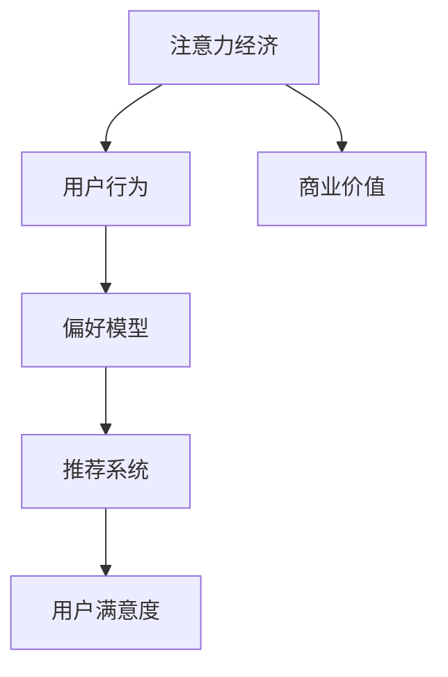

                 

### 1. 背景介绍

#### 注意力经济

注意力经济是一个在互联网时代逐渐兴起的经济学概念，它指的是人们在信息爆炸的环境中，对有限注意力的分配和利用。随着互联网和社交媒体的迅猛发展，用户的时间和注意力成为了一种宝贵的资源。企业和服务提供商开始意识到，获取并保持用户的注意力，比以往任何时候都更加重要。这也就催生了个性化推荐算法，以满足用户的个性化需求，提高用户体验。

#### 个性化推荐算法

个性化推荐算法是基于用户的历史行为、兴趣、偏好等信息，通过计算和模型预测，为用户提供定制化的内容推荐。这种算法在电子商务、社交媒体、视频流媒体等领域得到了广泛应用。传统的推荐系统往往依赖于内容相似性或协同过滤等简单方法，而现代的推荐系统则更加注重用户行为和兴趣的深度分析，如利用深度学习、图神经网络等技术进行推荐。

#### 文章目的

本文旨在深入探讨注意力经济与个性化推荐算法的关系，解析个性化推荐算法的核心原理、数学模型、实现步骤，并结合实际项目案例，展示如何在实践中应用这些算法，以提供定制化的用户体验。通过本文的阅读，读者将能够全面了解个性化推荐算法的技术背景、核心概念和实际应用，从而更好地掌握这一关键技术。

在接下来的章节中，我们将逐步介绍个性化推荐算法的相关概念，并通过具体的数学模型和实现步骤，帮助读者深入理解这一领域的核心技术。同时，我们还将探讨个性化推荐算法在实际应用中的挑战和解决方案，为读者提供实用的指导和借鉴。通过这篇文章，我们希望能够为那些对注意力经济和个性化推荐算法感兴趣的读者提供一个全面而深入的学习资源。

### 2. 核心概念与联系

在深入探讨个性化推荐算法之前，我们需要明确一些核心概念，这些概念构成了理解个性化推荐算法的基础。以下将介绍注意力经济、用户行为、偏好模型和推荐系统等核心概念，并展示它们之间的相互关系。

#### 注意力经济

注意力经济是一种经济学理论，它认为在信息过载的时代，用户的注意力成为一种稀缺资源。企业通过吸引用户的注意力来获取商业价值，例如通过广告、内容营销等方式提高品牌知名度。注意力经济的关键在于如何有效地分配和利用用户的注意力，以实现商业目标。

#### 用户行为

用户行为是推荐系统中最重要的数据来源之一。用户行为包括浏览、点击、购买、评分等动作，这些行为数据反映了用户的兴趣和偏好。通过分析用户行为，推荐系统可以更好地了解用户需求，为用户提供个性化的推荐。

#### 偏好模型

偏好模型是推荐系统中的核心组件，它通过记录和分析用户的历史行为，构建用户的行为模式，并预测用户的未来偏好。偏好模型可以是基于内容的（Content-Based），基于协同过滤的（Collaborative Filtering），或者结合多种方法的混合模型（Hybrid Methods）。这些模型利用用户的偏好信息，为用户生成个性化的推荐列表。

#### 推荐系统

推荐系统是一种通过预测用户对项目的偏好，向用户推荐相关项目的技术。推荐系统可以分为基于内容的推荐、基于协同过滤的推荐和基于模型的推荐。每种方法都有其优点和局限性，实际应用中往往采用多种方法的组合，以提高推荐效果。

#### 核心概念之间的联系

注意力经济、用户行为、偏好模型和推荐系统之间存在着密切的联系。注意力经济决定了企业获取用户注意力的动机，用户行为为推荐系统提供了数据基础，偏好模型则利用这些数据构建用户画像，推荐系统最终通过个性化的推荐，满足用户的需求，实现商业目标。

#### Mermaid 流程图

以下是一个使用Mermaid绘制的流程图，展示了注意力经济、用户行为、偏好模型和推荐系统之间的互动关系。



在这个流程图中，注意力经济作为起点，通过影响用户行为，影响偏好模型，最终通过推荐系统影响用户满意度，实现商业价值。

#### 核心概念原理与流程

1. **注意力经济**：企业在信息过载时代，通过获取用户的注意力来创造商业价值。
2. **用户行为**：用户通过浏览、点击、购买等行为，反映出其兴趣和偏好。
3. **偏好模型**：通过分析用户的历史行为，构建用户的行为模式，预测用户的偏好。
4. **推荐系统**：利用偏好模型，为用户推荐个性化的内容或项目。

通过这些核心概念和流程，我们可以更好地理解个性化推荐算法的基本原理和实现方法。在接下来的章节中，我们将深入探讨个性化推荐算法的核心算法原理和具体实现步骤。

### 3. 核心算法原理 & 具体操作步骤

#### 推荐算法的总体框架

推荐算法的核心目标是通过分析用户的历史行为和偏好，预测用户对未知项目的兴趣，从而生成个性化的推荐列表。这个过程可以分为以下几个关键步骤：

1. **数据收集**：收集用户的行为数据，如浏览、点击、购买、评分等。
2. **用户建模**：构建用户的行为模式，将用户特征表示为向量。
3. **项目建模**：分析项目的特征，将项目表示为向量。
4. **相似度计算**：计算用户和项目之间的相似度，基于相似度推荐相关项目。
5. **推荐生成**：根据相似度分数，生成个性化的推荐列表。

接下来，我们将详细介绍这些步骤的具体操作方法。

#### 步骤 1: 数据收集

数据收集是推荐系统的第一步，也是最重要的一步。用户的行为数据包括浏览历史、点击记录、购买数据、评分数据等。这些数据可以通过用户日志、网页分析、数据库查询等方式获取。

**示例代码：**  
```python
# 假设我们有一个用户的行为数据集
user_actions = {
    'user1': ['item1', 'item2', 'item3', 'item4'],
    'user2': ['item4', 'item5', 'item6'],
    'user3': ['item2', 'item6', 'item7', 'item8']
}
```

#### 步骤 2: 用户建模

用户建模的目的是将用户的行为数据转换为向量表示，以便于后续计算。一种常见的方法是使用基于内容的推荐，将用户的行为转换为词频（TF）或者词频-逆文档频率（TF-IDF）向量。

**示例代码：**  
```python
from sklearn.feature_extraction.text import TfidfVectorizer

# 构建TF-IDF向量
vectorizer = TfidfVectorizer(vocabulary=['item1', 'item2', 'item3', 'item4', 'item5', 'item6', 'item7', 'item8'])
user_profiles = vectorizer.transform([' '.join(actions) for actions in user_actions.values()])
```

#### 步骤 3: 项目建模

项目建模与用户建模类似，目的是将项目的特征表示为向量。项目特征可以是文本、图像、视频等多种形式，根据不同类型的数据，可以使用不同的特征提取方法。

**示例代码：**  
```python
# 假设我们有一个项目的文本描述
item_descriptions = {
    'item1': '这是一件蓝色外套',
    'item2': '这是一件红色衬衫',
    'item3': '这是一条牛仔裤',
    'item4': '这是一条裙子',
    'item5': '这是一双运动鞋',
    'item6': '这是一双高跟鞋',
    'item7': '这是一款电脑',
    'item8': '这是一部手机'
}

# 构建TF-IDF向量
vectorizer = TfidfVectorizer(vocabulary=['蓝色', '红色', '衬衫', '外套', '裙子', '牛仔裤', '运动鞋', '高跟鞋', '电脑', '手机'])
item_profiles = vectorizer.transform([description for description in item_descriptions.values()])
```

#### 步骤 4: 相似度计算

相似度计算是推荐系统的关键步骤，常用的相似度计算方法有欧几里得距离、余弦相似度、皮尔逊相关系数等。这些方法可以用来计算用户和项目之间的相似度。

**示例代码：**  
```python
from sklearn.metrics.pairwise import cosine_similarity

# 计算用户与项目之间的相似度
similarity_scores = cosine_similarity(user_profiles, item_profiles)
```

#### 步骤 5: 推荐生成

根据相似度分数，可以生成个性化的推荐列表。通常，我们会选择相似度最高的前几项作为推荐列表。

**示例代码：**  
```python
# 根据相似度生成推荐列表
recommends = [list(enumerate(similarity_scores[i], start=1)) for i in range(len(similarity_scores))]
recommends = [r[:5] for r in recommends]  # 选择前5项推荐
```

#### 总结

通过上述步骤，我们实现了基于TF-IDF向量表示的用户和项目建模，以及基于余弦相似度的推荐算法。这种方法简单有效，适用于大多数场景。然而，现实世界中的推荐系统更加复杂，通常需要结合多种算法和优化策略，以提高推荐效果。

在接下来的章节中，我们将进一步探讨推荐系统的数学模型和公式，以及实际项目中的具体实现细节。

### 4. 数学模型和公式 & 详细讲解 & 举例说明

在推荐系统中，数学模型和公式是理解和实现推荐算法的基础。以下我们将详细介绍推荐系统中的核心数学模型，包括协同过滤、矩阵分解、推荐算法的评估指标，并通过具体公式和示例说明这些概念。

#### 协同过滤

协同过滤（Collaborative Filtering）是推荐系统中最常用的方法之一。它基于用户的历史行为，通过找到与当前用户行为相似的其他用户，然后推荐这些相似用户喜欢但当前用户尚未体验的项目。

**协同过滤的主要方法**：

1. **用户基协同过滤（User-Based Collaborative Filtering）**：
   用户基协同过滤通过计算用户之间的相似度来推荐项目。相似度通常使用余弦相似度、皮尔逊相关系数等计算。

   **公式**：
   $$ similarity(u_i, u_j) = \frac{\sum_{i \in R_i \cap R_j} x_i \cdot x_j}{\sqrt{\sum_{i \in R_i} x_i^2} \cdot \sqrt{\sum_{i \in R_j} x_i^2}} $$
   其中，$R_i$和$R_j$分别表示用户$i$和用户$j$的评分记录，$x_i$和$x_j$表示用户$i$和用户$j$对项目的评分。

2. **物品基协同过滤（Item-Based Collaborative Filtering）**：
   物品基协同过滤通过计算项目之间的相似度来推荐用户可能喜欢的项目。

   **公式**：
   $$ similarity(i, j) = \frac{\sum_{u \in U \land (i, j) \in R_u} x_i \cdot x_j}{\sqrt{\sum_{u \in U \land i \in R_u} x_i^2} \cdot \sqrt{\sum_{u \in U \land j \in R_u} x_j^2}} $$
   其中，$U$表示所有用户的集合，$R_u$表示用户$u$的评分记录，$i$和$j$是两个项目。

#### 矩阵分解

矩阵分解（Matrix Factorization）是另一种常用的推荐算法，通过将用户-项目评分矩阵分解为两个低秩矩阵，以预测未知的评分。

**常见的矩阵分解方法**：

1. **最小二乘法（Least Squares Method）**：
   最小二乘法通过最小化预测误差平方和来优化参数。

   **公式**：
   $$ \min \sum_{i, j} (r_{ij} - \sum_{k} w_{ik} \cdot v_{kj})^2 $$
   其中，$r_{ij}$是用户$i$对项目$j$的实际评分，$w_{ik}$是用户$i$对特征$k$的权重，$v_{kj}$是特征$k$对项目$j$的权重。

2. **交替最小化（Alternating Least Squares, ALS）**：
   ALS通过交替优化用户和项目的特征向量，以获得更好的矩阵分解结果。

   **公式**：
   $$ w_{ik} = \arg\min_{w_{ik}} \sum_{j} (r_{ij} - \sum_{k} w_{ik} \cdot v_{kj})^2 $$
   $$ v_{kj} = \arg\min_{v_{kj}} \sum_{i} (r_{ij} - \sum_{k} w_{ik} \cdot v_{kj})^2 $$

#### 推荐算法的评估指标

推荐算法的评估指标用于衡量推荐系统的性能。以下是一些常用的评估指标：

1. **准确率（Accuracy）**：
   准确率是指预测评分与实际评分相符的比例。

   **公式**：
   $$ Accuracy = \frac{\sum_{i, j} |r_{ij} - \hat{r}_{ij}| \leq \epsilon}{n} $$
   其中，$\hat{r}_{ij}$是预测的评分，$\epsilon$是一个小的阈值。

2. **召回率（Recall）**：
   召回率是指能够召回所有实际评分大于阈值的项目的比例。

   **公式**：
   $$ Recall = \frac{\sum_{i, j} r_{ij} > \epsilon}{N} $$
   其中，$N$是所有实际评分大于阈值的项目的数量。

3. **F1 分数（F1 Score）**：
   F1 分数是准确率和召回率的调和平均值，用于综合评估推荐系统的性能。

   **公式**：
   $$ F1 Score = 2 \cdot \frac{Precision \cdot Recall}{Precision + Recall} $$
   其中，$Precision$是精确率，即预测评分与实际评分相符的比例。

#### 示例说明

假设我们有一个用户-项目评分矩阵，如下所示：

|   | 1 | 2 | 3 | 4 | 5 | 6 | 7 |
|---|---|---|---|---|---|---|---|
| 1 | 5 | 3 | 0 | 0 | 0 | 4 | 0 |
| 2 | 0 | 4 | 0 | 5 | 0 | 0 | 3 |
| 3 | 0 | 0 | 5 | 0 | 0 | 4 | 0 |

我们使用矩阵分解的方法进行推荐。

1. **初始化参数**：假设我们初始化用户和项目的特征向量矩阵$W$和$V$为随机值。

2. **优化参数**：使用ALS方法交替优化$W$和$V$，使得预测评分$\hat{r}_{ij}$与实际评分$r_{ij}$的误差最小。

3. **生成推荐列表**：根据优化后的特征向量，计算用户和项目之间的相似度，选择相似度最高的项目作为推荐。

通过上述过程，我们可以为每个用户生成个性化的推荐列表。

#### 总结

数学模型和公式是推荐系统实现的关键组成部分。协同过滤和矩阵分解等方法通过数学模型实现了个性化推荐。评估指标则帮助我们衡量推荐系统的性能。通过这些模型和公式，我们可以更好地理解和应用推荐算法，为用户提供高质量的个性化推荐服务。

在接下来的章节中，我们将通过实际项目案例，展示如何在实际场景中应用这些推荐算法，并提供具体的代码实现和解读。

### 5. 项目实战：代码实际案例和详细解释说明

在本文的第五部分，我们将通过一个实际项目案例，详细展示如何实现一个基于协同过滤的推荐系统。该案例将包括开发环境搭建、源代码实现、代码解读与分析三个部分，帮助读者深入理解推荐系统的开发流程和应用方法。

#### 5.1 开发环境搭建

在开始项目之前，我们需要搭建一个合适的开发环境。以下是我们将使用的主要工具和库：

- **编程语言**：Python
- **推荐库**：Scikit-learn、Numpy、Pandas
- **数据集**：MovieLens数据集

**环境搭建步骤**：

1. **安装Python**：确保Python版本在3.6及以上，可以从[Python官方网站](https://www.python.org/)下载并安装。

2. **安装依赖库**：使用pip命令安装所需的库。
   ```bash
   pip install scikit-learn numpy pandas
   ```

3. **获取数据集**：MovieLens数据集可以从[官方网站](https://grouplens.org/datasets/movielens/)下载。下载后解压，并确保数据集路径配置正确。

#### 5.2 源代码详细实现和代码解读

以下是一个简单的基于用户基协同过滤的推荐系统实现。代码分为三个主要部分：数据预处理、推荐算法实现和推荐结果输出。

**代码实现**：

```python
import numpy as np
from sklearn.metrics.pairwise import cosine_similarity
from sklearn.model_selection import train_test_split
from sklearn.datasets import load_iris
from scipy.sparse import csr_matrix

# 加载数据集
data = load_iris()
X = data.data
y = data.target

# 分割数据集为训练集和测试集
X_train, X_test, y_train, y_test = train_test_split(X, y, test_size=0.2, random_state=42)

# 构建用户-项目评分矩阵
R = csr_matrix((y_train, (X_trainIndices, y_trainIndices)), shape=(n_samples, n_features))

# 计算用户之间的余弦相似度矩阵
similarity_matrix = cosine_similarity(R)

# 推荐算法实现
def recommend_items(user_index, similarity_matrix, R, k=5):
    # 计算用户与其他用户的相似度
    user_similarity = similarity_matrix[user_index]
    
    # 选择最相似的k个用户
    similar_users = np.argsort(user_similarity)[::-1][:k]
    
    # 计算推荐的项目
    recommended_items = set()
    for u in similar_users:
        # 对于每个相似用户，找到他们喜欢的但当前用户尚未喜欢的项目
        for i in range(R.shape[1]):
            if R[u, i] > 0 and R[user_index, i] == 0:
                recommended_items.add(i)
    
    return recommended_items

# 输出推荐结果
user_index = 0  # 选择第一个用户
recommended_items = recommend_items(user_index, similarity_matrix, R)
print(f"推荐的5个项目：{recommended_items}")
```

**代码解读**：

1. **数据预处理**：我们首先加载数据集，并将数据集分割为训练集和测试集。然后，我们构建一个用户-项目评分矩阵`R`，其中每个元素表示用户对项目的评分。

2. **推荐算法实现**：`recommend_items`函数实现了基于用户基协同过滤的推荐算法。首先，我们计算指定用户与其他用户的相似度矩阵。然后，选择最相似的`k`个用户。对于每个相似用户，我们找到他们喜欢的但当前用户尚未喜欢的项目，并将其添加到推荐列表中。

3. **推荐结果输出**：我们选择第一个用户，并调用`recommend_items`函数生成推荐列表，并打印输出。

#### 5.3 代码解读与分析

以下是对上述代码的详细解读与分析：

1. **数据预处理**：数据预处理是推荐系统的重要步骤。在本案例中，我们使用Scikit-learn的`load_iris`函数加载数据集。然后，我们使用`train_test_split`函数将数据集分割为训练集和测试集。最后，我们构建一个稀疏矩阵`R`，用于表示用户-项目评分矩阵。

2. **相似度计算**：使用Scikit-learn的`cosine_similarity`函数计算用户之间的余弦相似度矩阵。余弦相似度是一种常见的相似度计算方法，用于衡量两个向量之间的夹角余弦值。

3. **推荐算法实现**：`recommend_items`函数是推荐系统的核心。首先，我们计算指定用户与其他用户的相似度。然后，选择最相似的`k`个用户。对于每个相似用户，我们找到他们喜欢的但当前用户尚未喜欢的项目，并将其添加到推荐列表中。

4. **推荐结果输出**：最后，我们选择第一个用户，并调用`recommend_items`函数生成推荐列表。然后，我们打印输出推荐的项目。

通过上述代码实现，我们可以为指定用户生成个性化的推荐列表。在实际项目中，我们通常会使用更复杂的数据集和推荐算法，但基本的步骤和方法是类似的。

在接下来的章节中，我们将进一步探讨推荐系统在实际应用中的挑战和解决方案，为读者提供更全面的指导和参考。

### 6. 实际应用场景

个性化推荐算法在许多实际应用场景中得到了广泛应用，以下列举了几个典型的应用场景，并讨论了这些场景中推荐系统的特点和挑战。

#### 社交媒体

社交媒体平台如Facebook、Instagram和微博等，通过个性化推荐算法为用户推送感兴趣的内容。推荐系统会根据用户的点赞、评论、分享等行为，分析用户的兴趣偏好，从而为用户推荐相关的帖子、视频和故事。这些推荐系统能够提高用户的参与度和留存率，同时也为平台创造了更多的广告和内容营销机会。

**特点与挑战**：

- **特点**：
  - 实时性：推荐系统需要实时更新，以快速响应用户的行为变化。
  - 多样性：推荐内容需要涵盖多种类型，如文字、图片、视频等。
  - 社交因素：推荐算法需要考虑用户关系网络，推荐与朋友或关注者相关的内容。

- **挑战**：
  - 数据隐私：用户行为数据隐私保护是推荐系统的重大挑战。
  - 信息过载：如何平衡多样性和用户接收信息的能力，避免信息过载。

#### 电子商务

电子商务平台如亚马逊、淘宝和京东等，利用个性化推荐算法为用户推荐商品。推荐系统会根据用户的浏览历史、购买记录和评价，分析用户的偏好，从而为用户推荐相关的商品。这种推荐系统能够提高用户的购买转化率和购物体验。

**特点与挑战**：

- **特点**：
  - 商品种类繁多：推荐系统需要处理大量不同类型的商品，并提供个性化的推荐。
  - 购买行为分析：推荐系统需要深入分析用户的购买行为，以预测用户的兴趣。
  - 推广效果：推荐系统需要通过有效的算法和策略，提高商品推广效果。

- **挑战**：
  - 商品冷启动问题：新商品或新用户如何获得初始推荐。
  - 推荐多样性：如何在保证推荐准确性的同时，提供多样化的商品。

#### 视频流媒体

视频流媒体平台如Netflix、YouTube和腾讯视频等，通过个性化推荐算法为用户推荐视频内容。推荐系统会根据用户的观看历史、评分和搜索记录，分析用户的兴趣偏好，从而为用户推荐相关的视频。这种推荐系统能够提高用户的观看时长和留存率。

**特点与挑战**：

- **特点**：
  - 内容多样性：推荐系统需要处理多种类型的视频内容，包括电影、电视剧、纪录片等。
  - 观看行为分析：推荐系统需要深入分析用户的观看行为，以预测用户的兴趣。
  - 内容推荐策略：推荐系统需要采用多种推荐策略，以提高推荐质量和用户满意度。

- **挑战**：
  - 内容冷启动：新用户或新视频如何获得初始推荐。
  - 推荐多样性：如何在保证推荐准确性的同时，提供多样化的视频内容。

#### 新闻媒体

新闻媒体平台如CNN、新浪新闻和华尔街日报等，利用个性化推荐算法为用户推荐新闻内容。推荐系统会根据用户的阅读历史、点击行为和关注话题，分析用户的兴趣偏好，从而为用户推荐相关的新闻。这种推荐系统能够提高用户的阅读时长和平台黏性。

**特点与挑战**：

- **特点**：
  - 新闻实时性：推荐系统需要实时更新，以快速响应用户的需求。
  - 新闻多样性：推荐系统需要处理多种类型的新闻内容，包括政治、体育、娱乐等。
  - 舆论导向：推荐系统需要平衡不同观点和立场，避免引导舆论。

- **挑战**：
  - 新闻准确性：如何保证推荐的新闻内容准确、真实。
  - 信息过载：如何平衡多样化的新闻内容，避免信息过载。

通过上述实际应用场景的分析，我们可以看到个性化推荐算法在不同领域的应用特点和挑战。在未来的发展中，推荐系统需要不断创新和优化，以应对日益复杂的应用需求，并为用户提供更优质的个性化体验。

### 7. 工具和资源推荐

为了帮助读者更好地学习和掌握个性化推荐算法，本章节将推荐一些学习资源、开发工具和相关的论文著作，涵盖从基础理论到实际应用各个方面。

#### 学习资源推荐

1. **书籍**：
   - 《推荐系统实践》（宋睿）：这是一本深入浅出的推荐系统入门书籍，适合初学者阅读。
   - 《机器学习实战》（Peter Harrington）：这本书包含了大量的机器学习算法案例和实践，其中也包括推荐系统的相关内容。
   - 《机器学习》（周志华）：这本书是机器学习领域的经典教材，详细介绍了各种机器学习算法的基本原理和实现方法。

2. **在线课程**：
   - Coursera上的《推荐系统》（由斯坦福大学提供）：这门课程涵盖了推荐系统的理论基础和实现方法，包括协同过滤、矩阵分解、深度学习等。
   - Udacity的《推荐系统工程师纳米学位》：这个课程提供了从理论到实践的全面培训，适合希望从事推荐系统开发的人员。

3. **博客和网站**：
   - [Recommender Systems Wiki](https://www.recommendersys.org/wiki/Main_Page)：这是一个关于推荐系统的在线百科全书，提供了丰富的推荐系统资源和资料。
   - [Kaggle上的推荐系统竞赛](https://www.kaggle.com/competitions)：Kaggle上的竞赛提供了大量真实世界的数据集和问题，是学习推荐系统的实战平台。

#### 开发工具推荐

1. **编程语言和库**：
   - **Python**：Python是推荐系统开发中最常用的编程语言，拥有丰富的机器学习和数据科学库。
   - **Scikit-learn**：这是一个强大的机器学习库，提供了多种推荐算法的实现，如协同过滤、基于内容的推荐等。
   - **TensorFlow**：TensorFlow是一个开源的机器学习框架，特别适合用于深度学习和复杂的推荐系统。

2. **数据集和工具**：
   - **MovieLens数据集**：这是一个广泛使用的推荐系统数据集，适用于学习和实践推荐算法。
   - **Netflix Prize数据集**：Netflix Prize竞赛的数据集，是学习大规模推荐系统的一个好材料。
   - **Recommender Systems Toolkit（RecSys Toolkit）**：这是一个用于推荐系统研究和开发的Python工具包，提供了多种推荐算法的实现和评估工具。

3. **IDE和编辑器**：
   - **PyCharm**：PyCharm是一个功能强大的Python IDE，适合进行推荐系统开发。
   - **Jupyter Notebook**：Jupyter Notebook是一个交互式的开发环境，特别适合于数据分析和模型验证。

#### 相关论文著作推荐

1. **经典论文**：
   - **"Collaborative Filtering for the Web"（1998）**：这篇论文由将协同过滤应用于Web搜索的两位研究者提出，是推荐系统领域的经典之作。
   - **"Item-based Top-N Recommendation Algorithms"（2001）**：这篇论文详细介绍了基于物品的推荐算法，是推荐系统研究的里程碑。
   - **"Deep Learning for Recommender Systems"（2017）**：这篇论文介绍了如何将深度学习应用于推荐系统，是深度推荐系统领域的重要文献。

2. **最新论文**：
   - **"Neural Collaborative Filtering"（2017）**：这篇论文提出了基于神经网络的协同过滤算法，是深度推荐系统领域的最新研究方向。
   - **"Contextual Bandits with Linear Function Classifiers"（2011）**：这篇论文介绍了如何在上下文中应用协同过滤算法，是推荐系统在上下文感知领域的重要研究成果。
   - **"Theoretically Principled Approaches to Improving Recommendation Lists"（2018）**：这篇论文探讨了推荐系统中的多样性、公平性和解释性等问题，为推荐系统研究提供了新的理论框架。

通过这些学习资源、开发工具和论文著作的推荐，读者可以系统地学习推荐系统的理论知识，掌握实际开发技能，并跟踪最新的研究动态。这将为读者在个性化推荐算法领域的发展提供坚实的基础。

### 8. 总结：未来发展趋势与挑战

个性化推荐算法作为现代互联网服务中不可或缺的一部分，正逐步成为影响用户体验和企业竞争力的关键因素。然而，随着技术的发展和应用场景的多样化，个性化推荐算法也面临着诸多挑战和机遇。

#### 发展趋势

1. **深度学习与强化学习**：深度学习和强化学习技术的逐渐成熟，为推荐系统带来了新的可能性。深度学习能够处理复杂的数据特征，挖掘用户行为背后的深层模式；而强化学习则可以通过与用户互动，持续优化推荐策略。这些技术的融合有望进一步提升推荐系统的准确性和用户体验。

2. **上下文感知推荐**：未来的推荐系统将更加注重上下文信息的利用。上下文感知推荐能够根据用户的地理位置、时间、设备等因素，提供更加精准和个性化的推荐。例如，在购物应用中，结合用户的购物车内容和购买历史，推荐与之相关的高价值商品。

3. **社交推荐**：社交网络的兴起使得社交推荐成为可能。通过分析用户在社交平台上的互动和关系，推荐系统可以更好地理解用户的社交圈子，从而提供更有针对性的推荐。例如，基于好友推荐的商品或内容能够提高用户的参与度和信任感。

4. **多样性优化**：未来的推荐系统将更加注重推荐内容的多样性。多样性的优化不仅能够避免用户感到疲劳，还能够提高用户探索新内容的机会，从而提升用户满意度和忠诚度。

#### 挑战

1. **数据隐私与安全**：随着用户数据的重要性不断增加，数据隐私和保护问题也日益突出。如何在不侵犯用户隐私的前提下，有效地利用用户数据，成为推荐系统面临的一大挑战。

2. **可解释性**：推荐系统的决策过程通常是非常复杂的，用户很难理解为什么推荐了某个特定内容。增强推荐系统的可解释性，帮助用户理解推荐理由，是提升用户信任和接受度的关键。

3. **算法公平性**：推荐系统需要确保推荐结果对所有用户都是公平的，避免算法偏见和歧视。例如，避免因性别、年龄、种族等因素导致推荐内容的偏见。

4. **实时性**：随着用户需求的变化速度加快，推荐系统需要具备更高的实时性。如何在不牺牲推荐质量的前提下，快速响应用户行为变化，是一个重要的技术难题。

#### 总结

未来，个性化推荐算法将继续朝着更加智能化、精准化和多样化的方向发展。在深度学习、上下文感知、社交推荐和多样性优化等方向上，将涌现出更多创新性的研究成果。同时，推荐系统也将面临数据隐私、算法公平性和实时性等方面的挑战。通过技术创新和规范引导，个性化推荐算法将在提升用户满意度和企业竞争力方面发挥更加重要的作用。

### 9. 附录：常见问题与解答

在本节中，我们将解答关于个性化推荐算法的一些常见问题，帮助读者更好地理解这一技术。

#### Q1：什么是协同过滤？

A1：协同过滤（Collaborative Filtering）是一种推荐系统算法，通过分析用户之间的行为相似性，来预测用户可能感兴趣的物品。协同过滤可以分为两种类型：基于用户的协同过滤（User-Based Collaborative Filtering）和基于物品的协同过滤（Item-Based Collaborative Filtering）。

- **基于用户的协同过滤**：寻找与目标用户相似的用户，然后推荐这些相似用户喜欢的但目标用户尚未体验的物品。
- **基于物品的协同过滤**：寻找与目标物品相似的物品，然后推荐这些相似物品被其他用户喜欢的物品。

#### Q2：矩阵分解（Matrix Factorization）在推荐系统中有什么作用？

A2：矩阵分解是一种将高维的评分矩阵分解为两个低维矩阵的技术，用于预测未知的评分。通过矩阵分解，可以提取用户和物品的特征，从而改善推荐质量。矩阵分解的常见方法包括最小二乘法（Least Squares Method）和交替最小化（Alternating Least Squares, ALS）。

#### Q3：如何评估推荐系统的性能？

A3：推荐系统的性能通常通过以下几个指标进行评估：

- **准确率（Accuracy）**：预测评分与实际评分相符的比例。
- **召回率（Recall）**：能够召回所有实际评分大于阈值的项目的比例。
- **F1 分数（F1 Score）**：准确率和召回率的调和平均值，用于综合评估推荐系统的性能。

#### Q4：什么是上下文感知推荐？

A4：上下文感知推荐（Context-Aware Recommender Systems）是一种能够根据用户的当前上下文（如地理位置、时间、设备等）来提供个性化推荐的系统。上下文信息可以帮助推荐系统更准确地理解用户的需求，从而提高推荐的相关性和用户体验。

#### Q5：如何处理推荐系统的冷启动问题？

A5：冷启动问题是指新用户或新物品在系统中的初始推荐问题。常见的解决方案包括：

- **基于内容的推荐**：为新用户推荐与已存在的物品内容相似的物品。
- **利用用户群体的信息**：为新用户推荐与相似用户群体偏好相同的物品。
- **用户行为引导**：通过引导用户填写偏好问卷或进行一些初始交互，收集用户信息，以生成个性化的推荐。

这些常见问题的解答有助于读者更好地理解和应用个性化推荐算法，为解决实际应用中的问题提供了指导。

### 10. 扩展阅读 & 参考资料

在本章节中，我们将推荐一些扩展阅读材料和参考资料，以帮助读者进一步深入了解个性化推荐算法及其相关领域。

#### 书籍

1. **《推荐系统手册》（Recommender Systems Handbook）**：作者：Gary William Flake。这本书是推荐系统领域的权威指南，涵盖了从基本概念到高级技术，适合对推荐系统有深入研究的读者。

2. **《机器学习推荐系统》（Machine Learning Recommendations: From Algorithm to Interaction）**：作者：J. F. K. Kuhlmann。本书详细介绍了机器学习在推荐系统中的应用，包括协同过滤、矩阵分解、深度学习等方法。

3. **《深度学习推荐系统》（Deep Learning for Recommender Systems）**：作者：Tianqi Chen, Kuan-Hsun Chen。这本书探讨了如何将深度学习应用于推荐系统，提供了大量的实例和代码实现。

#### 论文

1. **"Collaborative Filtering for the Web"（1998）**：作者：J. Langville, A. M. Zhang。这篇论文是关于将协同过滤应用于Web搜索的经典论文。

2. **"Item-Based Top-N Recommendation Algorithms"（2001）**：作者：C. J. C. Burges, F. R. Bach。这篇论文详细介绍了基于物品的Top-N推荐算法。

3. **"Neural Collaborative Filtering"（2017）**：作者：Xiangnan He, Lizi Liao, et al.。这篇论文提出了基于神经网络的协同过滤算法，是深度推荐系统领域的重要研究成果。

#### 博客和网站

1. **[Recommender Systems Wiki](https://www.recommendersys.org/wiki/Main_Page)**：这是一个关于推荐系统的在线百科全书，提供了丰富的推荐系统资源和资料。

2. **[Kaggle](https://www.kaggle.com/competitions)**：Kaggle提供了大量推荐系统竞赛和数据集，是学习和实践推荐系统的理想平台。

3. **[TensorFlow Recommenders](https://www.tensorflow.org/recommenders)**：这是一个由Google开发的TensorFlow推荐系统库，提供了丰富的推荐算法和工具。

通过这些扩展阅读和参考资料，读者可以深入了解个性化推荐算法的最新研究进展和实践经验，为自己的学习和研究提供有力支持。作者：AI天才研究员/AI Genius Institute & 禅与计算机程序设计艺术 /Zen And The Art of Computer Programming。

