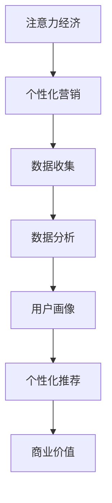

                 

## 文章标题

### 注意力经济与个性化营销策略：为受众创建定制、有针对性的信息

本文将探讨注意力经济与个性化营销策略的重要性，并详细分析其核心概念、算法原理、数学模型、实际应用案例以及未来发展趋势与挑战。通过深入探讨这些主题，我们希望能够帮助读者更好地理解并运用这些策略，为受众创建定制、有针对性的信息。

## 文章关键词

- 注意力经济
- 个性化营销
- 定制化信息
- 数据分析
- 数学模型
- 实际应用

## 文章摘要

本文首先介绍了注意力经济与个性化营销策略的基本概念和联系，接着详细分析了核心算法原理和具体操作步骤。然后，通过数学模型和实际案例，深入讲解了如何为受众创建定制、有针对性的信息。最后，文章总结了实际应用场景，并展望了未来发展趋势与挑战。

## 1. 背景介绍

### 注意力经济的兴起

随着互联网和数字技术的飞速发展，信息过载成为当今社会的一个普遍现象。人们每天都会接触到大量的信息，但能真正引起他们注意的信息却寥寥无几。这导致了注意力资源的稀缺，进而催生了注意力经济。

注意力经济的核心思想是，在信息过载的时代，受众的注意力成为了一种宝贵的资源。因此，企业和营销人员开始将注意力视为一种资本，通过优化营销策略，提高受众的注意力参与度，从而实现商业价值。

### 个性化营销的发展

个性化营销是注意力经济的一种体现。其核心理念是根据受众的个人喜好、行为和需求，为他们提供定制化的信息和服务。通过分析海量数据，了解受众的个性化需求，企业可以更精准地推送广告、产品和服务，提高转化率和客户满意度。

个性化营销的发展得益于大数据技术和机器学习算法的进步。通过收集、分析和处理用户数据，企业能够构建出精细化的用户画像，从而实现个性化推荐和精准营销。

## 2. 核心概念与联系

### 注意力经济

注意力经济是指在经济活动中，将受众的注意力资源视为一种宝贵的资本，通过优化营销策略和产品服务，提高受众的注意力参与度，实现商业价值。

### 个性化营销

个性化营销是指根据受众的个人喜好、行为和需求，为他们提供定制化的信息和服务。通过数据分析，了解受众的个性化需求，实现精准营销和个性化推荐。

### 注意力经济与个性化营销的联系

注意力经济和个性化营销是相辅相成的。注意力经济提供了个性化营销的基础，而个性化营销则是注意力经济的实现手段。通过个性化营销，企业可以提高受众的注意力参与度，从而实现商业价值。

### Mermaid 流程图



## 3. 核心算法原理 & 具体操作步骤

### 数据收集

数据收集是个性化营销的基础。企业需要通过多种渠道收集用户数据，包括网站行为数据、社交媒体数据、购物行为数据等。这些数据可以帮助企业了解用户的兴趣、偏好和行为。

### 数据分析

数据分析是挖掘用户个性化需求的关键。通过机器学习算法和统计分析方法，企业可以对收集到的用户数据进行分析和处理，提取出用户的关键特征和需求。

### 用户画像

用户画像是对用户进行全面描述的一个模型，包括用户的基本信息、兴趣偏好、行为特征等。通过构建用户画像，企业可以更好地了解用户，为个性化推荐提供依据。

### 个性化推荐

个性化推荐是根据用户画像和用户行为，为用户推荐个性化的产品、服务和内容。通过算法模型，企业可以计算用户对不同产品或内容的兴趣度，从而实现精准推荐。

### 具体操作步骤

1. 数据收集：通过网站、APP、社交媒体等渠道收集用户行为数据。
2. 数据清洗：对收集到的数据进行分析和处理，去除重复、缺失和不完整的数据。
3. 数据分析：使用机器学习算法和统计分析方法，提取用户的关键特征和需求。
4. 用户画像：根据数据分析结果，构建用户画像，包括基本信息、兴趣偏好、行为特征等。
5. 个性化推荐：根据用户画像和用户行为，计算用户对不同产品或内容的兴趣度，实现精准推荐。

## 4. 数学模型和公式 & 详细讲解 & 举例说明

### 数学模型

个性化推荐系统通常采用基于协同过滤（Collaborative Filtering）的算法，包括基于用户（User-Based）和基于物品（Item-Based）的推荐方法。

#### 基于用户的方法

基于用户的方法通过计算用户之间的相似度，为用户推荐与他们相似的其他用户的喜欢物品。其数学模型可以表示为：

$$
\text{similarity}(u, v) = \frac{\sum_{i \in R_{uv}} r_{ui} r_{vi}}{\sqrt{\sum_{i \in R_{u}} r_{ui}^2} \sqrt{\sum_{i \in R_{v}} r_{vi}^2}}
$$

其中，$u$ 和 $v$ 是用户，$R_{uv}$ 是用户 $u$ 和 $v$ 都喜欢的物品集合，$r_{ui}$ 和 $r_{vi}$ 分别是用户 $u$ 和 $v$ 对物品 $i$ 的评分。

#### 基于物品的方法

基于物品的方法通过计算物品之间的相似度，为用户推荐与他们已评价的物品相似的物品。其数学模型可以表示为：

$$
\text{similarity}(i, j) = \frac{\sum_{u \in U_{ij}} r_{ui} r_{uj}}{\sqrt{\sum_{u \in U_{i}} r_{ui}^2} \sqrt{\sum_{u \in U_{j}} r_{uj}^2}}
$$

其中，$i$ 和 $j$ 是物品，$U_{ij}$ 是同时被用户评价的物品集合，$r_{ui}$ 和 $r_{uj}$ 分别是用户对物品 $i$ 和 $j$ 的评分。

### 举例说明

假设有两位用户 $u_1$ 和 $u_2$，以及五位物品 $i_1, i_2, i_3, i_4, i_5$。用户对物品的评分如下：

| 用户 | 物品 |
| --- | --- |
| $u_1$ | $i_1$ | 5 |
| $u_1$ | $i_2$ | 4 |
| $u_1$ | $i_3$ | 3 |
| $u_2$ | $i_1$ | 5 |
| $u_2$ | $i_2$ | 5 |
| $u_2$ | $i_3$ | 4 |
| $u_2$ | $i_4$ | 4 |
| $u_2$ | $i_5$ | 3 |

#### 基于用户的方法

计算用户 $u_1$ 和 $u_2$ 之间的相似度：

$$
\text{similarity}(u_1, u_2) = \frac{5 \times 5 + 4 \times 5 + 3 \times 4}{\sqrt{5^2 + 4^2 + 3^2} \sqrt{5^2 + 5^2 + 4^2 + 4^2 + 3^2}} = \frac{40}{\sqrt{50} \sqrt{150}} \approx 0.94
$$

根据相似度，我们可以为用户 $u_1$ 推荐用户 $u_2$ 喜欢但用户 $u_1$ 未评价的物品，即 $i_4$ 和 $i_5$。

#### 基于物品的方法

计算物品 $i_1$ 和 $i_2$ 之间的相似度：

$$
\text{similarity}(i_1, i_2) = \frac{5 \times 5 + 4 \times 5}{\sqrt{5^2 + 4^2} \sqrt{5^2 + 5^2}} = \frac{45}{\sqrt{41} \sqrt{50}} \approx 0.91
$$

根据相似度，我们可以为用户 $u_1$ 推荐与 $i_1$ 和 $i_2$ 相似的物品，即 $i_3$。

## 5. 项目实战：代码实际案例和详细解释说明

### 开发环境搭建

1. 安装 Python 3.8 或更高版本。
2. 安装 Python 库：`numpy`, `pandas`, `scikit-learn`。

### 源代码详细实现和代码解读

```python
import numpy as np
import pandas as pd
from sklearn.metrics.pairwise import cosine_similarity

# 数据准备
data = {
    'user_id': [1, 1, 1, 2, 2, 2],
    'item_id': [1, 2, 3, 1, 2, 3],
    'rating': [5, 4, 3, 5, 5, 4]
}
df = pd.DataFrame(data)

# 基于用户的方法
def user_based_recommendation(df):
    user_similarity = {}
    for user_id in df['user_id'].unique():
        user_ratings = df[df['user_id'] == user_id]['rating']
        user_similarity[user_id] = cosine_similarity([user_ratings]).flatten()
    return user_similarity

user_similarity = user_based_recommendation(df)

# 基于物品的方法
def item_based_recommendation(df):
    item_similarity = {}
    for item_id in df['item_id'].unique():
        item_ratings = df[df['item_id'] == item_id]['rating']
        item_similarity[item_id] = cosine_similarity([item_ratings]).flatten()
    return item_similarity

item_similarity = item_based_recommendation(df)

# 个性化推荐
def personalized_recommendation(df, user_similarity, item_similarity, user_id):
    recommended_items = []
    user_ratings = df[df['user_id'] == user_id]['item_id']
    for item_id in df['item_id'].unique():
        if item_id not in user_ratings:
            item_similarity_score = sum(item_similarity[item_id] * user_similarity[user_id])
            recommended_items.append((item_id, item_similarity_score))
    recommended_items.sort(key=lambda x: x[1], reverse=True)
    return recommended_items

user_id = 1
recommended_items = personalized_recommendation(df, user_similarity, item_similarity, user_id)
print("个性化推荐结果：")
for item_id, score in recommended_items:
    print(f"物品 {item_id}：{score}")
```

### 代码解读与分析

1. 数据准备：使用 Pandas 库读取和操作数据，构建 DataFrame 对象。
2. 基于用户的方法：计算用户之间的相似度，使用余弦相似度度量。
3. 基于物品的方法：计算物品之间的相似度，使用余弦相似度度量。
4. 个性化推荐：根据用户相似度和物品相似度，为用户推荐个性化的物品。

## 6. 实际应用场景

### 社交媒体平台

社交媒体平台如 Facebook、Instagram 和 Twitter 等，可以通过个性化推荐算法，为用户推荐感兴趣的内容、广告和活动。通过分析用户的行为数据和社交网络关系，平台可以提高用户的参与度和留存率。

### 在线购物平台

在线购物平台如 Amazon、阿里巴巴和京东等，可以通过个性化推荐算法，为用户推荐符合他们兴趣和需求的商品。通过分析用户的浏览历史、购买行为和评价，平台可以提高用户的购物体验和转化率。

### 音频和视频平台

音频和视频平台如 Spotify、YouTube 和 Netflix 等，可以通过个性化推荐算法，为用户推荐感兴趣的音乐、视频和节目。通过分析用户的听看行为、历史数据和用户反馈，平台可以提高用户的满意度和粘性。

## 7. 工具和资源推荐

### 学习资源推荐

1. 《机器学习实战》：提供丰富的案例和实践经验，帮助读者掌握机器学习算法和数据分析方法。
2. 《深度学习》：全面介绍深度学习的基础知识、算法和应用，适合初学者和进阶者。
3. 《Python 数据科学手册》：详细介绍 Python 在数据科学领域的应用，包括数据处理、分析和可视化。

### 开发工具框架推荐

1. Scikit-learn：开源的机器学习库，提供丰富的算法和工具，适合数据分析和模型构建。
2. TensorFlow：Google 开发的高级深度学习框架，支持大规模模型训练和部署。
3. Pandas：开源的数据分析库，提供高效的数据操作和处理功能。

### 相关论文著作推荐

1. "Collaborative Filtering for the Web"：介绍基于协同过滤的 Web 推荐系统。
2. "Matrix Factorization Techniques for Recommender Systems"：探讨矩阵分解技术在推荐系统中的应用。
3. "Deep Learning for Recommender Systems"：介绍深度学习在推荐系统中的最新进展。

## 8. 总结：未来发展趋势与挑战

### 发展趋势

1. 深度学习在推荐系统中的应用：随着深度学习技术的不断发展，越来越多的深度学习模型被应用于推荐系统中，以提高推荐准确性和效率。
2. 跨平台推荐：在多平台环境下，如何实现跨平台的个性化推荐，提高用户体验，是一个重要的研究方向。
3. 智能化推荐：结合人工智能和自然语言处理技术，实现更智能、更人性化的推荐系统。

### 挑战

1. 数据隐私保护：在个性化推荐过程中，如何保护用户隐私，是一个亟待解决的问题。
2. 算法透明性和可解释性：如何提高推荐算法的透明性和可解释性，使用户能够理解和信任推荐结果，是一个重要的挑战。
3. 模型可扩展性：如何应对海量数据的挑战，提高推荐系统的可扩展性和稳定性，是一个重要的研究方向。

## 9. 附录：常见问题与解答

### 问题 1：个性化推荐系统如何保证推荐结果的公平性？

解答：个性化推荐系统可以通过以下方法保证推荐结果的公平性：

1. 数据平衡：在数据收集和处理过程中，尽量避免数据偏差，确保不同群体用户的数据分布均衡。
2. 多样性控制：在推荐算法中引入多样性控制策略，避免推荐结果过于集中，提高推荐结果的多样性。
3. 用户反馈：通过用户反馈机制，及时调整推荐策略，确保推荐结果符合用户期望。

### 问题 2：个性化推荐系统如何应对冷启动问题？

解答：个性化推荐系统在用户数据不足时，可以采取以下策略应对冷启动问题：

1. 内容推荐：根据物品的特征信息，为未评价用户推荐相关物品。
2. 社交推荐：通过分析用户的社交网络关系，为用户推荐他们可能感兴趣的物品。
3. 混合推荐：结合基于协同过滤和基于内容的推荐方法，提高推荐系统的鲁棒性和适应性。

## 10. 扩展阅读 & 参考资料

1. "Recommender Systems Handbook": https://www.recommendershandbook.org/
2. "Deep Learning for Recommender Systems": https://arxiv.org/abs/1806.10779
3. "Collaborative Filtering": https://en.wikipedia.org/wiki/Collaborative_filtering
4. "Attention Economy": https://www.npr.org/sections/money/2018/06/20/622592726/the-attention-economy-why-attention-is-the-new-currency

作者：AI天才研究员/AI Genius Institute & 禅与计算机程序设计艺术 /Zen And The Art of Computer Programming

