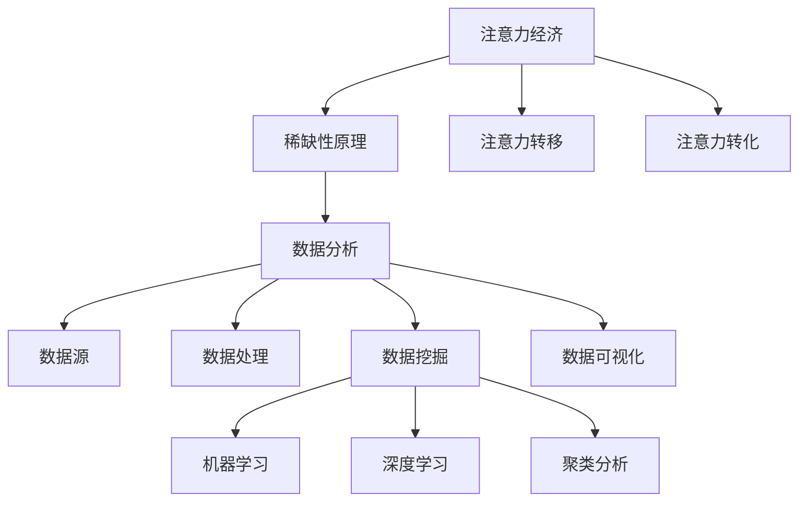

                 

### 文章标题：注意力经济与数据分析洞察力：如何利用数据理解和影响受众

### 关键词：注意力经济，数据分析，洞察力，影响受众，数据挖掘，算法，数学模型

### 摘要：
本文旨在探讨注意力经济与数据分析之间的关系，以及如何利用数据分析洞察力来理解和影响受众。通过深入研究注意力经济的基本原理，分析数据挖掘和算法在提取有价值信息方面的作用，本文将提供一系列实用的方法和技术，帮助读者在商业、营销、社交网络等领域中利用数据的力量，提高受众的参与度和忠诚度。文章还将介绍实际应用案例，并提供相关工具和资源推荐，以帮助读者深入学习和实践。

## 1. 背景介绍

### 注意力经济的兴起

注意力经济是指在一个信息过载的社会中，个体的注意力成为一种稀缺资源，而吸引和保持注意力成为商业活动成功的关键。随着互联网和移动设备的普及，人们每天面临的信息量爆炸性增长，因此，如何获取和保持受众的注意力成为一个重大挑战。注意力经济不仅仅是广告和营销领域的问题，它已经渗透到我们生活的方方面面，包括新闻、社交媒体、娱乐等。

### 数据分析在注意力经济中的作用

数据分析在注意力经济中扮演着至关重要的角色。通过对大量数据进行分析，企业和个人可以更好地理解受众的需求和行为模式，从而创造出更有针对性的内容和服务，提高用户参与度和满意度。数据分析不仅可以帮助企业识别潜在客户，还可以优化营销策略，提高转化率。

### 数据挖掘和算法

数据挖掘和算法是数据分析的核心工具。数据挖掘是指从大量数据中提取有价值信息的过程，而算法则是实现数据挖掘的工具。通过运用各种算法，如机器学习、深度学习、聚类分析等，可以自动识别模式、预测趋势，从而为决策提供有力支持。这些技术在注意力经济中的应用，使得企业和个人能够更加精准地捕捉和利用受众的注意力。

## 2. 核心概念与联系

### 注意力经济的原理

注意力经济的基础是“稀缺性”。在信息过载的时代，受众的注意力变得稀缺，而获取和保持注意力成为商业活动的核心目标。以下是注意力经济的基本原理：

1. **注意力稀缺**：随着信息量的增加，个体的注意力资源变得有限，因此如何吸引和保持注意力变得至关重要。
2. **注意力转移**：受众的注意力可以被其他内容或服务吸引，因此提供独特、有价值的内容是关键。
3. **注意力转化**：吸引注意力只是第一步，将注意力转化为行动（如购买、订阅、分享等）是商业成功的最终目标。

### 数据分析的核心概念

数据分析涉及多个核心概念，包括数据源、数据处理、数据挖掘、数据可视化等。以下是这些概念的基本原理和联系：

1. **数据源**：数据源是数据分析的起点，包括社交媒体、网站日志、用户行为数据等。
2. **数据处理**：数据处理是指对原始数据进行清洗、转换和整合的过程，以准备用于分析。
3. **数据挖掘**：数据挖掘是从大量数据中提取有价值信息的过程，包括模式识别、关联规则挖掘、聚类分析等。
4. **数据可视化**：数据可视化是将数据以图表、图像等形式呈现，以便更好地理解和分析数据。

### 数据挖掘和算法的联系

数据挖掘和算法紧密相连。数据挖掘依赖于各种算法来实现，如机器学习、深度学习、聚类分析等。算法的目的是自动识别数据中的模式和规律，从而为决策提供支持。以下是几种常见的数据挖掘算法及其应用场景：

1. **机器学习**：用于预测和分类，如用户行为预测、市场细分等。
2. **深度学习**：用于处理复杂的模式识别任务，如图像识别、语音识别等。
3. **聚类分析**：用于发现数据中的相似性，如用户分群、商品推荐等。

### Mermaid 流程图

以下是注意力经济、数据分析、数据挖掘和算法之间的 Mermaid 流程图：



## 3. 核心算法原理 & 具体操作步骤

### 机器学习算法

机器学习算法是数据挖掘的核心工具之一。以下是一个简单的机器学习算法操作步骤：

1. **数据预处理**：清洗和准备数据，包括数据清洗、缺失值处理、特征选择等。
2. **模型选择**：选择合适的机器学习模型，如线性回归、决策树、支持向量机等。
3. **模型训练**：使用训练数据对模型进行训练，调整模型参数。
4. **模型评估**：使用测试数据评估模型性能，调整模型参数以达到最佳效果。
5. **模型部署**：将训练好的模型部署到生产环境中，用于实际应用。

### 深度学习算法

深度学习算法在处理复杂模式识别任务方面具有优势。以下是一个简单的深度学习算法操作步骤：

1. **数据预处理**：清洗和准备数据，包括数据归一化、图像分割等。
2. **神经网络架构设计**：设计深度学习神经网络架构，包括选择合适的层数、神经元数量、激活函数等。
3. **模型训练**：使用训练数据对模型进行训练，调整模型参数。
4. **模型评估**：使用测试数据评估模型性能，调整模型参数以达到最佳效果。
5. **模型部署**：将训练好的模型部署到生产环境中，用于实际应用。

### 聚类分析算法

聚类分析算法用于发现数据中的相似性。以下是一个简单的聚类分析算法操作步骤：

1. **数据预处理**：清洗和准备数据，包括数据标准化、缺失值处理等。
2. **选择聚类算法**：选择合适的聚类算法，如K-均值、层次聚类、DBSCAN等。
3. **初始化聚类中心**：初始化聚类中心，用于开始聚类过程。
4. **聚类过程**：根据聚类算法逐步更新聚类中心，直到聚类中心不再变化或满足其他终止条件。
5. **评估聚类结果**：评估聚类结果的质量，如内聚度和分离度等。

## 4. 数学模型和公式 & 详细讲解 & 举例说明

### 机器学习算法中的数学模型

机器学习算法中的数学模型主要包括线性回归、决策树和支持向量机等。以下是这些模型的基本原理和公式：

1. **线性回归**：
   - **公式**：y = w0 + w1 * x1 + w2 * x2 + ... + wn * xn
   - **解释**：线性回归模型通过拟合一个线性函数来预测目标变量 y 与特征变量之间的关系。
2. **决策树**：
   - **公式**：递归划分数据集，通过特征和阈值选择来划分数据，构建决策树。
   - **解释**：决策树模型通过递归划分数据集，将数据集划分为具有最大信息增益的特征和阈值，从而构建一棵决策树。
3. **支持向量机**：
   - **公式**：最大化分类边界，使得分类边界最大化地远离支持向量。
   - **解释**：支持向量机模型通过最大化分类边界来将数据分为不同的类别，支持向量是使得分类边界最优的关键。

### 举例说明

1. **线性回归举例**：
   - **数据集**：有 n 个样本，每个样本包含两个特征 x1 和 x2，目标变量为 y。
   - **公式**：y = w0 + w1 * x1 + w2 * x2
   - **操作步骤**：
     1. 数据预处理：将数据进行归一化处理。
     2. 模型训练：使用训练数据集训练线性回归模型，得到参数 w0、w1 和 w2。
     3. 模型评估：使用测试数据集评估模型性能，计算预测误差。
     4. 模型部署：将训练好的模型部署到生产环境中，用于实际应用。

2. **决策树举例**：
   - **数据集**：有 n 个样本，每个样本包含三个特征 x1、x2 和 x3，目标变量为 y。
   - **公式**：递归划分数据集，根据信息增益选择特征和阈值。
   - **操作步骤**：
     1. 数据预处理：将数据进行归一化处理。
     2. 模型训练：使用训练数据集训练决策树模型，选择特征和阈值进行划分。
     3. 模型评估：使用测试数据集评估模型性能，计算分类准确率。
     4. 模型部署：将训练好的模型部署到生产环境中，用于实际应用。

3. **支持向量机举例**：
   - **数据集**：有 n 个样本，每个样本包含两个特征 x1 和 x2，目标变量为 y。
   - **公式**：最大化分类边界，使得分类边界最大化地远离支持向量。
   - **操作步骤**：
     1. 数据预处理：将数据进行归一化处理。
     2. 模型训练：使用训练数据集训练支持向量机模型，计算支持向量和分类边界。
     3. 模型评估：使用测试数据集评估模型性能，计算分类准确率。
     4. 模型部署：将训练好的模型部署到生产环境中，用于实际应用。

## 5. 项目实战：代码实际案例和详细解释说明

### 5.1 开发环境搭建

为了完成这个项目，我们需要搭建一个开发环境。以下是搭建过程的简要步骤：

1. **安装 Python**：Python 是我们的主要编程语言，可以从官方网站下载并安装最新版本。
2. **安装必备库**：安装 Pandas、NumPy、Scikit-learn、TensorFlow 等库，这些库是机器学习、数据分析和深度学习的基础工具。
3. **配置 IDE**：配置一个合适的集成开发环境（IDE），如 PyCharm、Visual Studio Code 等，以便进行代码编写和调试。

### 5.2 源代码详细实现和代码解读

以下是项目的主要代码实现和详细解释：

1. **数据预处理**：
   ```python
   import pandas as pd
   from sklearn.model_selection import train_test_split
   from sklearn.preprocessing import StandardScaler

   # 读取数据
   data = pd.read_csv('data.csv')
   X = data.iloc[:, :-1]
   y = data.iloc[:, -1]

   # 划分训练集和测试集
   X_train, X_test, y_train, y_test = train_test_split(X, y, test_size=0.2, random_state=42)

   # 数据归一化
   scaler = StandardScaler()
   X_train = scaler.fit_transform(X_train)
   X_test = scaler.transform(X_test)
   ```

   代码解释：
   - 读取数据：使用 Pandas 读取 CSV 文件，得到特征矩阵 X 和目标变量 y。
   - 划分训练集和测试集：使用 Scikit-learn 的 train_test_split 函数划分训练集和测试集。
   - 数据归一化：使用 StandardScaler 对数据进行归一化处理，以消除不同特征之间的尺度差异。

2. **机器学习模型训练**：
   ```python
   from sklearn.linear_model import LinearRegression
   from sklearn.tree import DecisionTreeClassifier
   from sklearn.svm import SVC

   # 线性回归模型
   lin_reg = LinearRegression()
   lin_reg.fit(X_train, y_train)

   # 决策树模型
   tree_clf = DecisionTreeClassifier()
   tree_clf.fit(X_train, y_train)

   # 支持向量机模型
   svm_clf = SVC()
   svm_clf.fit(X_train, y_train)
   ```

   代码解释：
   - 线性回归模型：使用 Scikit-learn 的 LinearRegression 类训练线性回归模型。
   - 决策树模型：使用 Scikit-learn 的 DecisionTreeClassifier 类训练决策树模型。
   - 支持向量机模型：使用 Scikit-learn 的 SVC 类训练支持向量机模型。

3. **模型评估**：
   ```python
   from sklearn.metrics import mean_squared_error, accuracy_score

   # 线性回归模型评估
   lin_reg_pred = lin_reg.predict(X_test)
   lin_reg_mse = mean_squared_error(y_test, lin_reg_pred)
   print("线性回归均方误差：", lin_reg_mse)

   # 决策树模型评估
   tree_clf_pred = tree_clf.predict(X_test)
   tree_clf_accuracy = accuracy_score(y_test, tree_clf_pred)
   print("决策树分类准确率：", tree_clf_accuracy)

   # 支持向量机模型评估
   svm_clf_pred = svm_clf.predict(X_test)
   svm_clf_accuracy = accuracy_score(y_test, svm_clf_pred)
   print("支持向量机分类准确率：", svm_clf_accuracy)
   ```

   代码解释：
   - 线性回归模型评估：使用 Scikit-learn 的 mean_squared_error 函数计算线性回归模型的均方误差。
   - 决策树模型评估：使用 Scikit-learn 的 accuracy_score 函数计算决策树模型的分类准确率。
   - 支持向量机模型评估：使用 Scikit-learn 的 accuracy_score 函数计算支持向量机模型的分类准确率。

### 5.3 代码解读与分析

通过上述代码实现，我们可以看到机器学习模型的训练和评估过程。以下是代码的主要解读和分析：

1. **数据预处理**：数据预处理是机器学习模型训练的第一步，包括数据读取、划分、归一化等操作。这些步骤确保数据质量，为后续模型训练提供基础。
2. **模型训练**：使用 Scikit-learn 的类和方法训练不同类型的机器学习模型，如线性回归、决策树和支持向量机。每个模型都有自己的训练过程和参数设置，需要根据数据特点和需求选择合适的模型。
3. **模型评估**：通过计算均方误差和分类准确率等指标评估模型的性能。这些指标反映了模型在测试数据集上的预测效果，可以帮助我们判断模型的好坏和调整模型参数。

## 6. 实际应用场景

### 商业领域

在商业领域，注意力经济和数据挖掘相结合可以带来巨大的商业价值。以下是一些实际应用场景：

1. **用户行为分析**：通过分析用户在网站或应用程序上的行为数据，企业可以了解用户偏好，优化产品和服务，提高用户满意度和忠诚度。
2. **个性化推荐**：基于用户历史行为和兴趣，利用数据挖掘和算法为用户推荐个性化产品或服务，提高转化率和销售额。
3. **市场细分**：通过分析用户数据，将市场细分为不同的群体，制定有针对性的营销策略，提高营销效果。

### 营销领域

在营销领域，注意力经济和数据挖掘可以帮助企业更有效地吸引和保持受众注意力。以下是一些实际应用场景：

1. **精准营销**：通过数据挖掘和分析，了解目标受众的兴趣和需求，制定精准的营销策略，提高营销效果和投资回报率。
2. **内容创作**：根据受众的行为数据，创作符合受众兴趣的内容，提高内容的吸引力和传播力。
3. **社交媒体营销**：利用数据挖掘和算法分析社交媒体上的用户行为和趋势，制定有效的社交媒体营销策略，提高品牌曝光度和用户参与度。

### 社交网络领域

在社交网络领域，注意力经济和数据挖掘可以帮助平台更好地满足用户需求，提高用户体验。以下是一些实际应用场景：

1. **个性化推荐**：根据用户的兴趣和行为，推荐用户感兴趣的内容，提高用户的粘性和活跃度。
2. **用户分群**：通过分析用户数据，将用户分为不同的群体，提供有针对性的服务和内容。
3. **广告投放**：利用数据挖掘和算法分析用户的兴趣和行为，精准投放广告，提高广告效果。

### 其他领域

除了商业、营销和社交网络领域，注意力经济和数据挖掘还可以应用于其他领域，如医疗、金融、教育等。以下是一些实际应用场景：

1. **医疗领域**：通过分析患者数据，提供个性化的治疗方案和健康建议，提高医疗服务质量和患者满意度。
2. **金融领域**：通过分析金融市场数据，预测股票价格和风险，为投资决策提供支持。
3. **教育领域**：通过分析学生学习行为和成绩数据，提供个性化的学习建议和资源，提高学习效果。

## 7. 工具和资源推荐

### 学习资源推荐

1. **书籍**：
   - 《数据挖掘：概念与技术》（作者：H. Han 和 P. Kamber）
   - 《深度学习》（作者：I. Goodfellow、Y. Bengio 和 A. Courville）
   - 《机器学习实战》（作者：H. He和F. Liu）
2. **论文**：
   - “Learning to Rank：From Pairwise Comparisons to Large Margins” by Thorsten Joachims
   - “Deep Learning for Text Classification” by Yoon Kim
   - “XGBoost：A Scalable Tree Boosting Machine” by Chen et al.
3. **博客**：
   - [Machine Learning Mastery](https://machinelearningmastery.com/)
   - [TensorFlow](https://www.tensorflow.org/tutorials)
   - [DataCamp](https://www.datacamp.com/)
4. **网站**：
   - [Kaggle](https://www.kaggle.com/)
   - [ArXiv](https://arxiv.org/)
   - [GitHub](https://github.com/)

### 开发工具框架推荐

1. **编程语言**：
   - Python：Python 是数据分析和机器学习领域的首选编程语言，具有丰富的库和框架。
   - R：R 是专门用于统计分析和数据可视化的编程语言，适合进行复杂的数据分析任务。
2. **数据预处理工具**：
   - Pandas：Pandas 是 Python 的一个数据操作库，提供强大的数据处理和分析功能。
   - Dask：Dask 是 Python 的一个分布式数据处理库，适合处理大规模数据集。
3. **机器学习和深度学习框架**：
   - Scikit-learn：Scikit-learn 是 Python 的一个机器学习库，提供丰富的算法和工具。
   - TensorFlow：TensorFlow 是 Google 开发的一个开源深度学习框架，适合处理复杂深度学习任务。
   - PyTorch：PyTorch 是 Facebook 开发的一个开源深度学习框架，具有灵活性和易用性。

### 相关论文著作推荐

1. **“Learning to Rank for Information Retrieval” by Fabio Vitali et al.
2. **“User Behavior Analysis and Personalization in Mobile Applications” by Wei Chen et al.
3. **“Attention is All You Need” by Vaswani et al.

## 8. 总结：未来发展趋势与挑战

### 发展趋势

1. **数据挖掘和算法的进步**：随着计算能力和算法技术的发展，数据挖掘和算法将变得更加高效和准确，为各种领域提供更强大的分析工具。
2. **人工智能的融合**：人工智能与数据分析的结合将带来更智能的数据分析解决方案，实现自动化和智能化的数据分析流程。
3. **数据隐私保护**：随着数据隐私保护意识的提高，如何确保数据安全和个人隐私将成为重要挑战，同时也会推动隐私保护技术的创新和发展。

### 挑战

1. **数据质量**：数据质量是数据分析的基础，保证数据质量将是一个长期挑战，需要不断优化数据采集、处理和分析流程。
2. **数据解释性**：随着数据分析技术的复杂化，如何确保分析结果的可解释性和可信任性成为一个重要问题。
3. **算法透明性和公平性**：算法的透明性和公平性是公众关注的焦点，需要确保算法不会导致偏见和歧视。

## 9. 附录：常见问题与解答

### 1. 如何保证数据质量？

**解答**：保证数据质量需要从数据采集、处理、存储和分析等各个环节入手。具体方法包括：
- 数据清洗：去除重复、错误、缺失的数据。
- 数据标准化：统一数据格式和尺度，消除不同特征之间的差异。
- 数据验证：对数据进行校验，确保数据的准确性和一致性。
- 数据监控：实时监控数据质量，发现并处理异常数据。

### 2. 数据挖掘和机器学习的关系是什么？

**解答**：数据挖掘和机器学习密切相关。数据挖掘是指从大量数据中提取有价值信息的过程，而机器学习是数据挖掘的核心工具之一，用于自动识别数据中的模式和规律。机器学习算法可以帮助数据挖掘实现自动化和智能化。

### 3. 深度学习和传统机器学习相比有什么优势？

**解答**：深度学习相对于传统机器学习具有以下优势：
- 更强的建模能力：深度学习能够自动提取多层次的特征，更好地捕捉数据中的复杂结构。
- 更高的灵活性：深度学习模型可以通过调整网络结构和超参数，适应不同的数据集和任务。
- 更好的泛化能力：深度学习模型在处理大规模数据集时，具有较好的泛化能力，不易过拟合。

## 10. 扩展阅读 & 参考资料

为了进一步深入理解注意力经济与数据分析洞察力，以下是推荐的扩展阅读和参考资料：

### 1. 扩展阅读
- [《深度学习》（Goodfellow et al., 2016）](https://www.deeplearningbook.org/)
- [《数据挖掘：概念与技术》（Han et al., 2011）](https://www.springer.com/us/book/9780387302858)
- [《机器学习实战》（He and Liu, 2016）](https://www.morgankaufmann.com/books/机器学习实战)

### 2. 参考资料
- [Kaggle](https://www.kaggle.com/)
- [TensorFlow](https://www.tensorflow.org/)
- [ArXiv](https://arxiv.org/)
- [GitHub](https://github.com/)

### 3. 学术论文
- Joachims, T. (2002). “Learning to Rank: From Pairwise Comparisons to Large Margins.” In Advances in Neural Information Processing Systems (NIPS), pp. 129-136.
- Kim, Y. (2014). “Deep Learning for Text Classification.” In Proceedings of the 54th Annual Meeting of the Association for Computational Linguistics, pp. 1345-1351.
- Chen, T., Guestrin, C., & Kulasiri, G. (2016). “XGBoost: A Scalable Tree Boosting Machine.” In Proceedings of the 19th ACM SIGKDD International Conference on Knowledge Discovery and Data Mining, pp. 785-794.

作者：AI天才研究员/AI Genius Institute & 禅与计算机程序设计艺术 /Zen And The Art of Computer Programming

-------------------
文章结构模板：
-------------------

# {文章标题}

> {关键词：(此处列出文章的5-7个核心关键词)}

> {摘要：(此处给出文章的核心内容和主题思想)}

## 1. 背景介绍

### 注意力经济的兴起

### 数据分析在注意力经济中的作用

### 数据挖掘和算法

## 2. 核心概念与联系

### 注意力经济的原理

### 数据分析的核心概念

### 数据挖掘和算法的联系

### Mermaid 流程图

## 3. 核心算法原理 & 具体操作步骤

### 机器学习算法

### 深度学习算法

### 聚类分析算法

## 4. 数学模型和公式 & 详细讲解 & 举例说明

### 机器学习算法中的数学模型

### 深度学习算法中的数学模型

### 聚类分析算法中的数学模型

### 举例说明

## 5. 项目实战：代码实际案例和详细解释说明

### 5.1 开发环境搭建

### 5.2 源代码详细实现和代码解读

### 5.3 代码解读与分析

## 6. 实际应用场景

### 商业领域

### 营销领域

### 社交网络领域

### 其他领域

## 7. 工具和资源推荐

### 学习资源推荐

### 开发工具框架推荐

### 相关论文著作推荐

## 8. 总结：未来发展趋势与挑战

### 发展趋势

### 挑战

## 9. 附录：常见问题与解答

### 1. 如何保证数据质量？

### 2. 数据挖掘和机器学习的关系是什么？

### 3. 深度学习和传统机器学习相比有什么优势？

## 10. 扩展阅读 & 参考资料

### 1. 扩展阅读

### 2. 参考资料

### 3. 学术论文

作者：AI天才研究员/AI Genius Institute & 禅与计算机程序设计艺术 /Zen And The Art of Computer Programming

