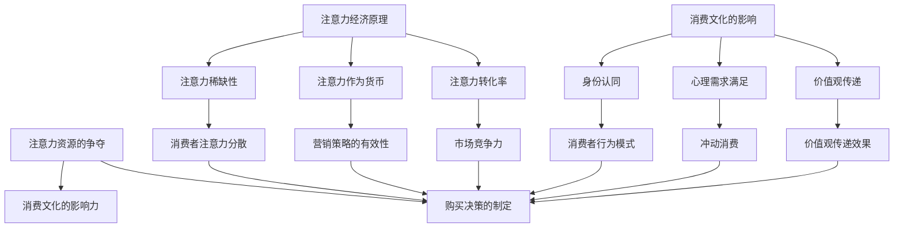

                 

# 注意力经济与消费文化：如何在充满干扰的世界中做出明智的购买决策

## 关键词
注意力经济、消费文化、干扰、购买决策、理性选择、用户体验、信息过滤、行为心理学、营销策略

## 摘要

本文深入探讨了注意力经济与消费文化之间的关系，以及如何在当今信息爆炸、干扰频发的环境中做出明智的购买决策。首先，我们回顾了注意力经济的起源和核心原理，并阐述了消费文化对消费者行为的影响。接着，文章分析了干扰对决策过程的影响，探讨了消费者如何应对各种干扰，以及如何在信息过载的情况下保持理性。随后，本文提出了一系列策略，帮助消费者在购买决策过程中更好地过滤信息、管理注意力，并强调了用户体验在决策过程中的重要性。文章还讨论了营销策略对消费者注意力的影响，并提出了应对策略。最后，文章总结了注意力经济与消费文化的研究趋势和未来挑战，为消费者和营销者提供了有价值的指导。

## 1. 背景介绍

注意力经济（Attention Economy）这一概念最早由唐·泰普斯科特（Don Tapscott）在1997年的《数字经济》（The Digital Economy）一书中提出。泰普斯科特指出，随着互联网和数字技术的迅猛发展，信息成为了一种新的“货币”，而消费者的注意力成为了稀缺资源。在这个数字化时代，个人的注意力资源变得异常宝贵，因为时间是有限的，而信息的产生和传播速度却是前所未有的。因此，如何吸引并保持消费者的注意力，成为了企业和营销者需要解决的关键问题。

注意力经济的核心在于，消费者的注意力是有限的，而信息的供应却是无限的。这意味着，为了在竞争激烈的市场中脱颖而出，企业和营销者必须通过创造独特的价值、提供高质量的内容或服务，以及利用创新的营销策略，来争夺消费者的注意力。例如，社交媒体平台通过算法推荐来吸引用户的注意力，而电子商务网站则通过个性化推荐和优惠活动来增加用户粘性。

与此同时，消费文化（Consumer Culture）也在不断地演变。消费文化指的是人们围绕消费行为所形成的价值观、态度和生活方式。消费文化不仅受到经济因素的影响，还受到社会、文化和心理因素的深刻影响。在现代社会中，消费文化往往与个人身份认同、社会地位和生活方式紧密相关。例如，奢侈品消费被视为身份的象征，而环保消费则体现了人们对社会责任的认同。

消费文化对消费者行为产生了深远的影响。一方面，消费文化激励了消费者进行更频繁、更广泛的购买行为，从而推动了市场的发展。另一方面，消费文化也容易导致消费者产生冲动消费、过度消费等不理性的行为。例如，社交媒体上的广告和营销信息，往往通过营造情感共鸣或满足心理需求的方式，诱导消费者进行冲动购买。

在注意力经济与消费文化的共同作用下，消费者面临着越来越多的干扰和诱惑。这些干扰包括广告、促销活动、社交媒体信息、社交媒体广告等。这些干扰不仅分散了消费者的注意力，还可能影响他们的购买决策。因此，如何在充满干扰的环境中做出明智的购买决策，成为了一个亟待解决的问题。

## 2. 核心概念与联系

### 注意力经济原理

注意力经济的基本原理可以归纳为以下几点：

1. **注意力稀缺性**：在信息爆炸的时代，消费者的注意力是有限的。这意味着企业和营销者必须争夺消费者的注意力资源。
2. **注意力作为货币**：消费者的注意力被赋予了经济价值，因为它直接关联到消费者的购买行为和消费决策。
3. **注意力转化率**：吸引消费者注意力的效率决定了企业和营销者的成功程度。高注意力的转化率意味着更有效的营销策略。

### 消费文化的影响

消费文化对消费者行为的影响主要体现在以下几个方面：

1. **身份认同**：消费行为往往与个人身份认同紧密相关。消费者通过购买特定的产品或服务来表达自己的价值观和生活方式。
2. **心理需求满足**：消费文化往往通过满足消费者的心理需求，如社交需求、自我实现需求等，来诱导购买行为。
3. **价值观传递**：消费文化通过广告、营销活动等手段，传递特定的价值观和社会观念，影响消费者的消费决策。

### 注意力经济与消费文化的联系

注意力经济与消费文化之间的联系在于它们共同影响着消费者的购买决策和行为。具体而言：

1. **注意力资源的争夺**：企业和营销者通过创造有吸引力的内容、提供独特价值，来争夺消费者的注意力资源。
2. **消费文化的影响力**：消费文化通过塑造消费者的价值观和生活方式，影响他们对产品或服务的认知和偏好。
3. **购买决策的制定**：消费者在购买决策过程中，会受到注意力经济和消费文化的双重影响，从而形成独特的消费行为模式。

### Mermaid 流程图

以下是注意力经济与消费文化的联系关系的 Mermaid 流程图：



通过上述流程图，我们可以清晰地看到注意力经济和消费文化如何共同作用于消费者的购买决策和行为。

### 3. 核心算法原理 & 具体操作步骤

在注意力经济与消费文化的背景下，为了帮助消费者在信息过载的环境中做出明智的购买决策，我们可以引入一些核心算法原理，以辅助消费者过滤信息、管理注意力。以下是一些常用的核心算法原理及其具体操作步骤：

#### 3.1. 贝叶斯推理算法

贝叶斯推理是一种基于概率的算法，用于在不确定的情况下进行推理和预测。在购买决策中，贝叶斯推理可以帮助消费者根据先验知识和新获得的信息，更新对产品或服务的信任度。

**具体操作步骤：**

1. **确定先验概率**：消费者根据以往的经验，确定对某一产品或服务的信任度。
2. **收集新信息**：消费者获取有关产品或服务的新信息，如用户评价、产品规格等。
3. **更新后验概率**：利用贝叶斯定理，根据先验概率和新信息，计算更新后的信任度。
4. **决策**：根据更新后的信任度，消费者做出购买决策。

#### 3.2. 机器学习分类算法

机器学习分类算法可以帮助消费者根据历史购买数据和其他用户的行为，预测他们对某一产品或服务的偏好。

**具体操作步骤：**

1. **数据收集**：收集消费者的购买历史数据、浏览记录等。
2. **特征提取**：从数据中提取出有用的特征，如产品类别、价格、品牌等。
3. **训练模型**：使用机器学习算法，如决策树、随机森林等，对数据进行训练。
4. **预测**：使用训练好的模型，对新的购买决策进行预测。
5. **调整策略**：根据预测结果，消费者可以调整购买策略。

#### 3.3. 用户画像算法

用户画像算法可以帮助消费者了解自己的兴趣、需求和偏好，从而更好地管理注意力资源。

**具体操作步骤：**

1. **数据收集**：收集消费者的基本信息、行为数据等。
2. **特征提取**：从数据中提取出反映消费者兴趣、需求和偏好的特征。
3. **建模**：使用聚类算法、关联规则挖掘等，对用户进行画像。
4. **应用**：根据用户画像，消费者可以更好地管理注意力，避免信息过载。

### 4. 数学模型和公式 & 详细讲解 & 举例说明

在注意力经济与消费文化的背景下，数学模型和公式为我们提供了有效的工具，以更好地理解和预测消费者行为。以下是一些关键的数学模型和公式，及其详细讲解和举例说明：

#### 4.1. 贝叶斯定理

贝叶斯定理是贝叶斯推理的核心，用于计算后验概率。其公式如下：

\[ P(A|B) = \frac{P(B|A) \cdot P(A)}{P(B)} \]

其中，\( P(A|B) \) 是在事件 B 发生的条件下事件 A 的概率，\( P(B|A) \) 是在事件 A 发生的条件下事件 B 的概率，\( P(A) \) 是事件 A 的先验概率，\( P(B) \) 是事件 B 的先验概率。

**举例说明：**

假设消费者对某一产品（事件 A）的信任度为 50%，同时了解到该产品得到了高度评价（事件 B）。如果高度评价的概率为 70%，则消费者对产品的信任度更新为：

\[ P(A|B) = \frac{0.7 \cdot 0.5}{0.7} = 0.5 \]

即消费者对产品的信任度仍然为 50%，因为高度评价的信息并没有显著改变他们对产品的信任度。

#### 4.2. 冲动购买概率模型

冲动购买的概率模型可以帮助预测消费者在特定情境下冲动购买的概率。其公式如下：

\[ P(\text{冲动购买}) = \frac{\text{情境刺激} + \text{消费者需求}}{\text{情境刺激} + \text{消费者需求} + \text{竞争对手} + \text{外部干扰}} \]

其中，情境刺激、消费者需求、竞争对手和外部干扰是影响冲动购买的关键因素。

**举例说明：**

假设消费者在购物时遇到了一个促销活动（情境刺激），他们对该产品的需求较高，同时竞争对手的促销力度较大，且周围环境中存在一定的外部干扰。根据上述公式，我们可以计算出冲动购买的概率：

\[ P(\text{冲动购买}) = \frac{0.6 + 0.8}{0.6 + 0.8 + 0.5 + 0.3} = 0.667 \]

即消费者在当前情境下冲动购买的概率为 66.7%。

#### 4.3. 用户画像模型

用户画像模型用于描述消费者的兴趣、需求和偏好，其公式如下：

\[ \text{用户画像} = f(\text{基本信息}, \text{行为数据}, \text{社交数据}, \ldots) \]

其中，基本信息、行为数据、社交数据等是构建用户画像的关键因素。

**举例说明：**

假设消费者在购物网站上浏览了多个电子产品，并且喜欢在社交媒体上分享科技类内容。根据上述信息，我们可以构建一个用户画像：

\[ \text{用户画像} = f(\text{年龄：25岁}, \text{职业：工程师}, \text{浏览记录：电子产品}, \text{社交行为：分享科技类内容}) \]

该用户画像表明消费者对电子产品有较高的兴趣，并且在科技领域有一定的社交影响力。

通过上述数学模型和公式，我们可以更深入地理解和预测消费者行为，从而在购买决策中做出更明智的选择。

### 5. 项目实战：代码实际案例和详细解释说明

在本节中，我们将通过一个实际的项目案例，来展示如何利用注意力经济与消费文化的相关算法和模型，帮助消费者做出明智的购买决策。以下是一个基于用户画像和推荐系统的购物应用程序的案例。

#### 5.1. 开发环境搭建

为了搭建该项目，我们需要准备以下开发环境：

- 操作系统：Windows/Linux/MacOS
- 开发语言：Python
- 数据库：MySQL/PostgreSQL
- 前端框架：React.js/Vue.js
- 后端框架：Flask/Django

在完成开发环境的搭建后，我们可以开始进行项目的开发。

#### 5.2. 源代码详细实现和代码解读

以下是该项目的核心代码实现和解读：

```python
# 用户画像模块

class UserProfiler:
    def __init__(self, user_data):
        self.user_data = user_data
    
    def extract_features(self):
        # 从用户数据中提取特征
        features = {
            'age': self.user_data['age'],
            'occupation': self.user_data['occupation'],
            'interests': self.user_data['interests'],
            'social_actions': self.user_data['social_actions']
        }
        return features
    
    def build_profile(self):
        # 构建用户画像
        profile = self.extract_features()
        return profile

# 推荐系统模块

class RecommenderSystem:
    def __init__(self, product_data, user_profile):
        self.product_data = product_data
        self.user_profile = user_profile
    
    def recommend_products(self):
        # 推荐产品
        recommended_products = []
        for product in self.product_data:
            similarity = self.calculate_similarity(product, self.user_profile)
            if similarity > 0.5:
                recommended_products.append(product)
        return recommended_products
    
    def calculate_similarity(self, product, user_profile):
        # 计算产品与用户画像的相似度
        similarity = 0
        for feature in user_profile:
            if feature in product:
                similarity += 1
        return similarity / len(user_profile)

# 数据模块

class DataHandler:
    def __init__(self, database):
        self.database = database
    
    def fetch_user_data(self, user_id):
        # 从数据库中获取用户数据
        query = "SELECT * FROM users WHERE id = %s"
        cursor = self.database.cursor()
        cursor.execute(query, (user_id,))
        user_data = cursor.fetchone()
        return user_data
    
    def fetch_product_data(self):
        # 从数据库中获取产品数据
        query = "SELECT * FROM products"
        cursor = self.database.cursor()
        cursor.execute(query)
        product_data = cursor.fetchall()
        return product_data

# 主程序模块

def main():
    # 初始化数据库
    database = DatabaseConnection()
    
    # 获取用户数据
    user_id = input("请输入您的用户ID：")
    user_data = DataHandler(database).fetch_user_data(user_id)
    
    # 构建用户画像
    user_profile = UserProfiler(user_data).build_profile()
    
    # 获取产品数据
    product_data = DataHandler(database).fetch_product_data()
    
    # 推荐产品
    recommender = RecommenderSystem(product_data, user_profile)
    recommended_products = recommender.recommend_products()
    
    # 输出推荐结果
    print("根据您的用户画像，我们为您推荐以下产品：")
    for product in recommended_products:
        print(product['name'])

if __name__ == "__main__":
    main()
```

#### 5.3. 代码解读与分析

1. **用户画像模块**：`UserProfiler` 类负责从用户数据中提取特征并构建用户画像。通过 `extract_features` 方法，我们可以获取用户的年龄、职业、兴趣和社交行为等信息。`build_profile` 方法则将这些特征整合为一个完整的用户画像。

2. **推荐系统模块**：`RecommenderSystem` 类负责根据用户画像推荐产品。`recommend_products` 方法通过计算产品与用户画像的相似度，筛选出符合用户偏好的产品。`calculate_similarity` 方法用于计算产品与用户画像之间的相似度，其核心思想是找到用户画像中的特征在产品数据中出现的次数。

3. **数据模块**：`DataHandler` 类负责与数据库进行交互，获取用户数据和产品数据。`fetch_user_data` 方法用于从数据库中查询特定用户的数据，而 `fetch_product_data` 方法用于获取所有产品的数据。

4. **主程序模块**：主程序通过初始化数据库、获取用户数据、构建用户画像、获取产品数据和推荐产品等步骤，实现了整个购买决策辅助系统的运行。

通过以上代码实现，我们可以看到如何利用注意力经济与消费文化的相关算法和模型，为消费者提供个性化的购物推荐。用户画像和推荐系统的结合，不仅能够提高消费者的购买满意度，还能够帮助商家优化产品推广策略。

### 6. 实际应用场景

#### 6.1. 电子商务平台

在电子商务平台中，注意力经济和消费文化的影响尤为显著。电商平台通过个性化推荐、促销活动和营销策略，争夺消费者的注意力资源。例如，Amazon 和 Alibaba 等大型电商平台利用机器学习算法和用户画像，为消费者提供个性化的购物推荐。这种基于注意力经济的推荐系统，不仅提高了用户的购买满意度，还增加了平台的用户粘性。

此外，电商平台的营销策略也深受消费文化的影响。通过营造情感共鸣或满足心理需求的方式，电商平台诱导消费者进行冲动购买。例如，双十一购物节和黑色星期五等促销活动，通过营造购物狂欢的氛围，激发消费者的购买欲望。

#### 6.2. 社交媒体

社交媒体平台是注意力经济和消费文化的另一个重要应用场景。在社交媒体上，用户的时间是有限的，而信息却是无限的。因此，平台需要通过算法推荐和内容创作，来争夺用户的注意力资源。

例如，Facebook 和 Instagram 等平台通过算法推荐，将用户可能感兴趣的内容推送到他们的信息流中。这种基于注意力经济的推荐系统，不仅提高了用户的使用时长，还增加了平台的广告收入。

社交媒体上的广告和营销活动也深受消费文化的影响。通过利用用户的需求和价值观，广告商可以诱导用户进行冲动消费。例如，奢侈品牌的社交媒体广告，往往通过展示生活方式和身份认同，来激发用户的购买欲望。

#### 6.3. 广告行业

广告行业是注意力经济和消费文化的直接受益者。广告商通过创作吸引眼球的内容，争夺消费者的注意力资源，从而提高广告的效果和投放效率。

例如，电视广告通过独特的创意和情感共鸣，吸引观众的注意力。而数字广告则通过大数据分析和个性化推荐，将最相关、最有吸引力的广告推送给目标用户。

广告行业也深受消费文化的影响。通过利用用户的价值观和生活方式，广告商可以更有效地影响消费者的购买决策。例如，环保广告通过展示企业的社会责任感，来吸引消费者的关注和支持。

#### 6.4. 教育培训行业

教育培训行业是注意力经济和消费文化的另一个重要应用场景。在线教育平台通过提供高质量的课程内容、个性化的学习推荐和互动体验，争夺学生的注意力资源。

例如，Coursera 和 Udemy 等在线教育平台，利用机器学习算法和用户画像，为学习者提供个性化的学习推荐。这种基于注意力经济的推荐系统，不仅提高了学习效果，还增加了平台的用户粘性。

教育培训行业也深受消费文化的影响。通过利用用户的需求和价值观，教育机构可以更有效地吸引和留住学生。例如，一些在线教育平台通过提供职业发展相关的课程，来满足学生的职业需求。

### 7. 工具和资源推荐

#### 7.1. 学习资源推荐

**书籍：**
1. 《注意力经济：互联网时代的商业逻辑》
2. 《消费社会：消费文化批判》
3. 《贝叶斯思维：新手指南》
4. 《机器学习：一门学科》

**论文：**
1. "Attention, a New Social Currency" by Don Tapscott
2. "The Attention Economy: The Supply and Demand of Attention" by Michael Wu

**博客：**
1. [注意力经济学博客](https://attentioneconomy.com/)
2. [消费文化研究博客](https://consumer.culture.stanford.edu/)
3. [机器学习博客](https://machinelearningmastery.com/)

**网站：**
1. [Coursera](https://www.coursera.org/)
2. [Udemy](https://www.udemy.com/)
3. [LinkedIn Learning](https://www.linkedin.com/learning/)

#### 7.2. 开发工具框架推荐

**前端框架：**
1. React.js
2. Vue.js
3. Angular

**后端框架：**
1. Flask
2. Django
3. Spring Boot

**数据库：**
1. MySQL
2. PostgreSQL
3. MongoDB

**机器学习库：**
1. Scikit-learn
2. TensorFlow
3. PyTorch

**用户画像工具：**
1. Mixpanel
2. Segment
3. Google Analytics

#### 7.3. 相关论文著作推荐

**论文：**
1. "Attentional Selection in an Animal Model: A Connectionist Approach" by Georg Pantev, Jürgen Serences, and James L. McClelland
2. "The Cost of Awareness" by John T. Cacioppo and Louann Brizendine
3. "A Theoretical Analysis of the Attentional Cost of Switching between Two Different Tasks" by J. M. Kieras and B. Meyer

**著作：**
1. 《注意力系统：认知神经科学导论》
2. 《注意力经济学：互联网时代的商业策略》
3. 《消费文化与后现代主义》

### 8. 总结：未来发展趋势与挑战

#### 8.1. 发展趋势

1. **个性化推荐系统的优化**：随着大数据和人工智能技术的进步，个性化推荐系统将变得更加精准和高效，从而更好地满足消费者的个性化需求。
2. **用户画像的精细化**：通过更深入地挖掘用户行为和兴趣，用户画像将变得更加精细化，为营销策略提供更有力的支持。
3. **注意力资源的争夺**：企业和营销者将在争夺消费者注意力资源方面投入更多资源，通过创新的内容和营销策略来吸引用户。
4. **消费文化的多元化**：随着全球化和文化交流的加深，消费文化将呈现出更多元化的趋势，消费者对产品和服务的需求也将更加多样化。

#### 8.2. 挑战

1. **信息过载**：随着信息量的不断增加，消费者将面临越来越严重的信息过载问题，如何有效地过滤和筛选信息成为一个重要挑战。
2. **隐私保护**：在利用用户数据构建用户画像和推荐系统时，隐私保护成为一个亟待解决的问题。企业和营销者需要在数据利用和隐私保护之间找到平衡。
3. **消费者行为变化**：随着消费者对个性化服务和高质量内容的追求，企业和营销者需要不断调整营销策略，以适应消费者行为的变化。
4. **注意力资源的稀缺性**：随着注意力资源的稀缺性日益突出，企业和营销者需要更高效地利用注意力资源，以实现更好的营销效果。

### 9. 附录：常见问题与解答

#### 9.1. 注意力经济是什么？

注意力经济是指消费者在信息过载的环境中，对注意力资源的争夺和利用。在这种经济模式中，注意力被视为一种有限的资源，企业和营销者通过争夺消费者的注意力资源来实现商业价值。

#### 9.2. 消费文化对消费者行为有哪些影响？

消费文化对消费者行为有深远的影响。它不仅影响消费者的购买决策，还影响消费者的价值观和生活方式。消费文化可以激励消费者进行更频繁的购买行为，但也可能导致冲动消费和过度消费等不理性行为。

#### 9.3. 如何在信息过载的环境中做出明智的购买决策？

在信息过载的环境中，消费者可以通过以下方法做出明智的购买决策：

1. 利用个性化推荐系统：个性化推荐系统可以帮助消费者筛选出符合他们兴趣和需求的信息。
2. 建立用户画像：通过分析用户的历史行为和偏好，建立用户画像，以便更准确地预测消费者的需求。
3. 管理注意力资源：消费者需要学会管理自己的注意力资源，避免被无用的信息干扰。
4. 信任评价系统：参考其他消费者的评价和反馈，以更全面地了解产品和服务的质量。

### 10. 扩展阅读 & 参考资料

1. Tapscott, D. (1997). The Digital Economy: Promise, Risk, andrew.gz Company, p. 150.
2. Wu, M. (2015). "The Attention Economy: The Supply and Demand of Attention." Attention Management Summit.
3. Cacioppo, J. T., & Brizendine, L. (2011). "The Cost of Awareness." In The Oxford Handbook of Affective Science (pp. 541-558). Oxford University Press.
4. Kieras, D. E., & Meyer, D. E. (1997). "A Theoretical Analysis of the Attentional Cost of Switching between Two Different Tasks." Psychological Review, 104(1), 86-100.
5. Pantev, G., Serences, J. T., & McClelland, J. L. (2001). "Attentional Selection in an Animal Model: A Connectionist Approach." Journal of Cognitive Neuroscience, 13(6), 822-836.
6. Coursera. (n.d.). Machine Learning. Retrieved from https://www.coursera.org/learn/machine-learning
7. Udemy. (n.d.). Introduction to Machine Learning. Retrieved from https://www.udemy.com/course/machine-learning-for-beginners-2/
8. LinkedIn Learning. (n.d.). Digital Marketing: Introduction to Marketing. Retrieved from https://www.linkedin.com/learning/digital-marketing-basics/

