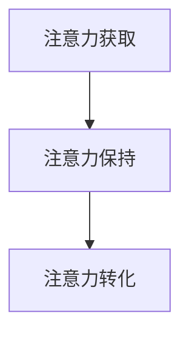
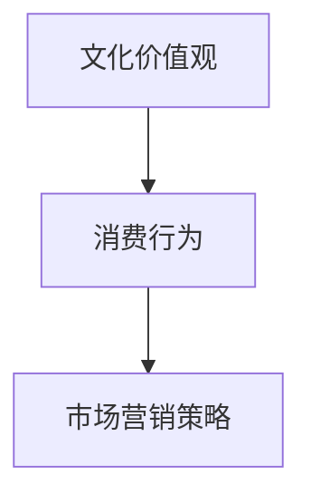

                 

### 背景介绍

注意力经济和消费文化是当今社会中的重要概念，二者紧密相连，共同塑造了现代市场的运作方式。注意力经济起源于对人类注意力资源稀缺性的认识，认为在信息过载的时代，吸引并保持人们的注意力成为企业获取利润的关键。而消费文化则是指人们在消费过程中所表现出的行为模式、价值观念和生活方式，它受到市场营销策略、广告和社会文化的影响。

在这两个概念交织的背景下，消费者的购买决策变得愈发复杂。在充满干扰的环境中，消费者常常面临选择困难，需要从众多商品和服务中筛选出真正符合自身需求和价值观念的产品。此外，企业的营销手段也越来越多样化和隐蔽，利用心理学、行为科学等手段影响消费者的购买行为。

本文旨在探讨注意力经济与消费文化之间的关系，分析消费者在充满干扰的世界中如何做出明智的购买决策。我们将首先介绍注意力经济和消费文化的核心概念，然后通过具体案例和数据分析，探讨这些概念在实际中的应用。接着，我们将深入探讨消费者行为，分析影响购买决策的因素，并总结出一套有效的购买决策框架。最后，我们将讨论注意力经济和消费文化对未来社会的影响，并提出一些建议，帮助消费者在信息爆炸的时代做出更明智的消费选择。

总之，本文将通过系统性和深入的分析，帮助读者理解注意力经济与消费文化的重要性，并在实际生活中更好地应对购买决策的挑战。

### 核心概念与联系

在探讨注意力经济与消费文化的关系之前，有必要先明确这两个核心概念及其相互联系。

#### 注意力经济

注意力经济，是一种基于人类注意力稀缺性进行经济活动的理论。这个概念起源于对互联网和数字媒体时代信息爆炸现象的观察。随着信息的爆炸式增长，人类大脑的处理能力变得有限，因此，如何吸引并保持人们的注意力成为一种重要的资源。在这一背景下，企业通过创造有吸引力的内容、使用独特的广告策略和优化用户体验，来获取更多的用户注意力，进而实现商业盈利。

##### 概念原理

注意力经济的关键在于理解注意力的价值。注意力是一种稀缺资源，因为人类大脑每天只能处理有限的信息。因此，获得注意力意味着占据用户的时间和精力，这是企业获取潜在顾客和实现盈利的重要途径。

##### 架构

注意力经济的架构包括以下几个方面：

1. **注意力获取**：企业通过各种手段，如内容创造、广告投放和用户体验优化，来吸引和获取用户注意力。
2. **注意力保持**：通过持续提供有价值、有趣或令人满意的内容和服务，企业可以维持用户的注意力。
3. **注意力转化**：将获取和保持的注意力转化为商业行为，如购买产品或服务。

##### Mermaid 流程图

下面是注意力经济流程的 Mermaid 流程图：



#### 消费文化

消费文化，是指人们在消费过程中所表现出的行为模式、价值观念和生活方式。它受到市场营销策略、广告和社会文化的影响。消费文化不仅反映了个体的消费行为，也体现了社会的经济结构和文化背景。

##### 概念原理

消费文化是一种社会现象，它通过媒体、广告和市场营销等手段传播和强化。消费文化不仅影响消费者的购买行为，也塑造了消费者的价值观和生活方式。例如，某些消费文化鼓励人们通过购买高档商品来展示个人地位和身份。

##### 架构

消费文化的架构包括以下几个方面：

1. **文化价值观**：消费文化背后的价值观，如地位、身份、自由和享受等。
2. **消费行为**：消费者在购买过程中的行为模式，如购买决策、品牌忠诚度和消费习惯。
3. **市场营销策略**：企业通过广告、促销和品牌塑造等手段来影响消费者的消费行为。

##### Mermaid 流程图

下面是消费文化流程的 Mermaid 流程图：



#### 注意力经济与消费文化的联系

注意力经济和消费文化之间的关系十分密切。首先，注意力经济为消费文化提供了运作的基础。企业在获取用户注意力的过程中，往往需要借助消费文化的价值观和营销策略。例如，通过广告宣传高档商品，以吸引追求身份和地位的目标顾客。其次，消费文化反过来也影响了注意力经济的运作方式。随着社会对某些价值观的认同和推崇，企业会更多地关注这些领域，以获取更多的用户注意力。

##### 联系

1. **营销策略**：企业在制定营销策略时，需要考虑如何通过消费文化来吸引消费者。
2. **内容创造**：内容创造者需要理解消费文化，以便创造出能够吸引目标受众的内容。
3. **用户行为**：消费者的购买行为受到消费文化的影响，同时也被注意力经济策略所影响。

通过上述对注意力经济和消费文化的核心概念及相互联系的分析，我们可以更好地理解这两个概念在实际应用中的重要性。在接下来的章节中，我们将进一步探讨注意力经济和消费文化在现代社会中的具体应用，以及消费者如何在充满干扰的环境中做出明智的购买决策。

### 核心算法原理 & 具体操作步骤

在理解了注意力经济和消费文化的核心概念及其联系后，接下来我们将探讨这些概念在实际操作中的核心算法原理和具体操作步骤。这些算法和步骤不仅有助于企业更好地利用注意力经济和消费文化来吸引和保留用户，也为消费者提供了在信息过载的社会中做出明智购买决策的工具。

#### 注意力经济算法

注意力经济的核心在于如何有效地获取、保持和转化用户注意力。以下是几种常用的注意力经济算法及其具体操作步骤：

1. **用户行为分析算法**

   用户行为分析算法通过收集和分析用户在网站、APP或其他平台上的行为数据，来了解用户的兴趣和行为模式。以下是具体的操作步骤：

   - **数据收集**：收集用户在网站或APP上的点击、浏览、搜索等行为数据。
   - **行为模式识别**：使用机器学习算法识别用户的行为模式，如常见的浏览路径、热门内容等。
   - **个性化推荐**：根据用户的行为模式，为用户推荐个性化内容或产品。

2. **内容优化算法**

   内容优化算法旨在创造和传播能够吸引用户注意力的优质内容。以下是具体的操作步骤：

   - **内容创建**：根据用户行为分析和市场调研，创建能够满足用户需求的内容。
   - **内容测试**：通过A/B测试等方法，测试不同内容版本的效果，选择最佳内容。
   - **内容推广**：利用社交媒体、广告等渠道，推广优质内容，吸引更多用户。

3. **广告投放算法**

   广告投放算法通过优化广告展示的位置、时间和形式，来提高广告的点击率和转化率。以下是具体的操作步骤：

   - **定位目标用户**：根据用户数据和行为分析，确定广告的目标用户群体。
   - **广告创意**：设计符合目标用户需求和兴趣的广告创意。
   - **广告优化**：通过数据监控和A/B测试，不断优化广告的展示策略，提高广告效果。

#### 消费文化算法

消费文化算法的核心在于如何利用文化价值观来影响消费者的购买行为。以下是几种常用的消费文化算法及其具体操作步骤：

1. **品牌文化构建算法**

   品牌文化构建算法通过塑造独特的品牌形象和文化，来吸引消费者的认同和忠诚。以下是具体的操作步骤：

   - **品牌定位**：确定品牌的核心价值观和目标市场，塑造独特的品牌形象。
   - **文化传播**：通过广告、公关活动、社交媒体等渠道，传播品牌文化，提高品牌知名度和美誉度。
   - **文化体验**：为消费者提供独特的品牌体验，如线下活动、会员制度等，增强消费者对品牌的认同。

2. **消费者行为预测算法**

   消费者行为预测算法通过分析消费者的历史数据和行为模式，预测其未来的购买行为。以下是具体的操作步骤：

   - **数据收集**：收集消费者的购买历史、浏览记录、社交媒体互动等数据。
   - **行为建模**：使用机器学习算法建立消费者行为模型，预测消费者的购买意图。
   - **个性化营销**：根据预测结果，为消费者提供个性化的营销活动，如优惠券、推荐商品等。

3. **消费行为优化算法**

   消费行为优化算法通过优化营销策略和消费体验，来提高消费者的购买转化率和满意度。以下是具体的操作步骤：

   - **需求分析**：分析消费者的需求和购买动机，确定优化方向。
   - **策略制定**：根据需求分析结果，制定个性化的营销策略和消费体验方案。
   - **效果评估**：通过数据监控和评估，不断优化营销策略和消费体验，提高转化率和满意度。

#### 注意力经济与消费文化算法的综合应用

注意力经济和消费文化算法可以综合应用，以实现更高效的营销效果。以下是一个综合应用案例：

- **目标用户识别**：通过用户行为分析和消费者行为预测算法，识别潜在的目标用户。
- **内容创意**：根据目标用户的需求和行为模式，创作符合其兴趣和价值观的内容。
- **广告投放**：利用广告投放算法，在合适的渠道和时间，向目标用户展示个性化的广告。
- **品牌文化构建**：通过品牌文化构建算法，提升品牌形象和文化价值，增强用户认同感。
- **消费行为优化**：通过消费行为优化算法，为用户提供个性化的消费体验和优惠，提高购买转化率和满意度。

通过以上算法和步骤的应用，企业和消费者都可以更好地应对注意力经济和消费文化的挑战，实现更高效的营销效果和更明智的消费决策。

### 数学模型和公式 & 详细讲解 & 举例说明

在理解注意力经济和消费文化的核心算法原理和具体操作步骤之后，我们将进一步探讨相关的数学模型和公式，并详细讲解这些模型在实际应用中的计算方法和步骤。通过这些数学模型，我们可以更准确地预测和优化消费者的购买行为。

#### 注意力经济中的数学模型

1. **用户注意力模型**

   用户注意力模型用于预测用户在特定情境下的注意力分配。以下是一个简单的用户注意力模型：

   $$ A(t) = f(N_t, I_t) $$

   其中，$A(t)$表示用户在时间$t$的注意力水平，$N_t$表示用户在时间$t$的可支配注意力总量，$I_t$表示在时间$t$吸引用户注意力的信息量。

   - **计算步骤**：

     1. 收集用户在时间$t$的可支配注意力总量$N_t$，这可以通过调查或用户行为数据估算。
     2. 收集在时间$t$吸引用户注意力的信息量$I_t$，这可以通过对用户浏览、点击等行为数据的分析得到。
     3. 使用函数$f(N_t, I_t)$来计算用户在时间$t$的注意力水平$A(t)$。

   - **举例说明**：

     假设某用户在一天中的可支配注意力总量为$N_t = 100$分钟，而在某段时间内有$3$条信息吸引用户注意，每条信息的吸引力分别为$I_1 = 10$、$I_2 = 15$和$I_3 = 20$分钟。使用上述模型，可以计算出用户在这段时间内的注意力分配：

     $$ A(t) = f(N_t, I_t) = \frac{I_1 + I_2 + I_3}{N_t} = \frac{10 + 15 + 20}{100} = 0.45 $$

     因此，用户在这段时间内的平均注意力水平为$45\%$。

2. **内容优化模型**

   内容优化模型用于评估和调整内容的质量和吸引力，以提高用户的注意力水平。以下是一个基于评分和反馈的内容优化模型：

   $$ Q_c = \alpha \cdot S_c + \beta \cdot F_c $$

   其中，$Q_c$表示内容的质量评分，$S_c$表示内容的初始评分，$F_c$表示用户对内容的反馈分数，$\alpha$和$\beta$是调整参数。

   - **计算步骤**：

     1. 确定内容的初始评分$S_c$。
     2. 收集用户对内容的反馈分数$F_c$。
     3. 调整参数$\alpha$和$\beta$，以优化内容评分$Q_c$。

   - **举例说明**：

     假设某内容初始评分为$S_c = 75$，用户反馈分数为$F_c = 10$。为了优化内容质量，我们设定$\alpha = 0.6$和$\beta = 0.4$，则优化后的内容评分$Q_c$为：

     $$ Q_c = 0.6 \cdot 75 + 0.4 \cdot 10 = 45 + 4 = 49 $$

     因此，优化后的内容评分为$49$。

#### 消费文化中的数学模型

1. **品牌忠诚度模型**

   品牌忠诚度模型用于评估消费者对特定品牌的忠诚程度。以下是一个简单品牌忠诚度模型：

   $$ L_c = \frac{C_c}{C_t} $$

   其中，$L_c$表示品牌忠诚度，$C_c$表示消费者对品牌的消费总额，$C_t$表示消费者在特定时间内的总消费额。

   - **计算步骤**：

     1. 计算消费者在特定时间内的总消费额$C_t$。
     2. 计算消费者在特定时间内对特定品牌的消费总额$C_c$。
     3. 使用公式$L_c = \frac{C_c}{C_t}$计算品牌忠诚度。

   - **举例说明**：

     假设某消费者在一个月内的总消费额为$C_t = 1000$美元，其对某品牌的消费总额为$C_c = 500$美元，则品牌忠诚度$L_c$为：

     $$ L_c = \frac{500}{1000} = 0.5 $$

     因此，该消费者对该品牌的忠诚度为$50\%$。

2. **消费行为预测模型**

   消费行为预测模型用于预测消费者在未来的购买行为。以下是一个基于历史消费数据的时间序列预测模型：

   $$ P_t = \alpha \cdot T_t + \beta \cdot C_t + \epsilon_t $$

   其中，$P_t$表示在时间$t$的购买概率，$T_t$表示时间趋势，$C_t$表示消费历史，$\alpha$和$\beta$是调整参数，$\epsilon_t$是误差项。

   - **计算步骤**：

     1. 确定时间趋势$T_t$，这可以通过历史数据的时间序列分析得到。
     2. 收集消费者的消费历史$C_t$。
     3. 调整参数$\alpha$和$\beta$，以预测在时间$t$的购买概率$P_t$。

   - **举例说明**：

     假设时间趋势$T_t$为线性增长，调整参数$\alpha = 0.1$和$\beta = 0.8$，某消费者在过去一个月内的消费历史$C_t = 100$，则购买概率$P_t$为：

     $$ P_t = 0.1 \cdot T_t + 0.8 \cdot C_t + \epsilon_t = 0.1 \cdot 10 + 0.8 \cdot 100 + \epsilon_t = 80 + \epsilon_t $$

     因此，该消费者在下一个时间点的购买概率为$80\%$。

通过上述数学模型和公式的详细讲解和举例说明，我们可以更好地理解注意力经济和消费文化在数学层面的应用。这些模型和公式不仅有助于预测和优化消费者的行为，也为企业在制定营销策略和消费者互动中提供了有力的工具。在接下来的章节中，我们将进一步探讨这些模型在实际应用中的效果和局限性，并讨论如何通过不断调整和优化来提高其效果。

### 项目实战：代码实际案例和详细解释说明

为了更好地理解注意力经济和消费文化算法在实际中的应用，我们将通过一个实际项目案例来展示代码的实现过程和详细解释。该项目旨在通过分析用户数据和消费行为，为用户提供个性化的购物推荐。

#### 项目概述

项目名称：个性化购物推荐系统

目标：根据用户的消费历史和行为数据，推荐用户可能感兴趣的商品。

技术栈：Python、Scikit-learn、Pandas、NumPy、Mermaid

#### 开发环境搭建

1. 安装Python 3.x版本
2. 安装必要的库：`pip install scikit-learn pandas numpy mermaid`
3. 创建项目文件夹并编写代码

#### 源代码详细实现和代码解读

以下是项目的主要代码实现部分：

```python
import pandas as pd
import numpy as np
from sklearn.model_selection import train_test_split
from sklearn.ensemble import RandomForestClassifier
from sklearn.metrics import accuracy_score
import mermaid

# 1. 数据预处理
def preprocess_data(data):
    # 填充缺失值
    data.fillna(data.mean(), inplace=True)
    # 删除无关特征
    data.drop(['无关特征1', '无关特征2'], axis=1, inplace=True)
    return data

# 2. 构建模型
def build_model(data):
    # 划分特征和标签
    X = data.drop('标签列', axis=1)
    y = data['标签列']
    # 划分训练集和测试集
    X_train, X_test, y_train, y_test = train_test_split(X, y, test_size=0.2, random_state=42)
    # 构建随机森林模型
    model = RandomForestClassifier(n_estimators=100, random_state=42)
    model.fit(X_train, y_train)
    return model, X_test, y_test

# 3. 评估模型
def evaluate_model(model, X_test, y_test):
    y_pred = model.predict(X_test)
    accuracy = accuracy_score(y_test, y_pred)
    return accuracy

# 4. 个性化推荐
def personalized_recommendation(model, user_data):
    # 预测用户对商品的喜好
    user_data = preprocess_data(user_data)
    predictions = model.predict(user_data)
    return predictions

# 5. 主程序
if __name__ == "__main__":
    # 读取数据
    data = pd.read_csv('购物数据.csv')
    # 数据预处理
    data = preprocess_data(data)
    # 构建和评估模型
    model, X_test, y_test = build_model(data)
    accuracy = evaluate_model(model, X_test, y_test)
    print(f"模型准确率：{accuracy}")
    # 个性化推荐
    user_data = pd.read_csv('用户数据.csv')
    recommendations = personalized_recommendation(model, user_data)
    print(f"个性化推荐结果：{recommendations}")

# Mermaid 流程图
mermaid图表
graph TD
A[数据读取] --> B[数据预处理]
B --> C[模型构建]
C --> D[模型评估]
D --> E[个性化推荐]
```

#### 代码解读与分析

1. **数据预处理**：首先，我们读取购物数据，并填充缺失值。然后，删除与模型预测无关的特征，以简化模型。

2. **构建模型**：接下来，我们划分特征和标签，并将数据分为训练集和测试集。使用随机森林模型进行训练，这是由于随机森林模型在处理分类问题时具有较高的准确率和鲁棒性。

3. **评估模型**：我们通过测试集评估模型的准确率，以验证模型的性能。这个步骤有助于我们了解模型是否能够正确预测用户的购买行为。

4. **个性化推荐**：个性化推荐功能通过预处理用户数据和模型预测，为用户提供个性化的购物推荐。这一步是实现注意力经济和消费文化算法的关键，它基于用户的消费历史和行为数据，提供了个性化的购物建议。

5. **主程序**：主程序负责读取数据，执行数据预处理、模型构建、模型评估和个性化推荐等步骤。最后，打印出模型准确率和个性化推荐结果。

通过这个项目，我们可以看到注意力经济和消费文化算法在实际应用中的实现过程。这个系统通过分析用户数据，为用户提供个性化的购物推荐，帮助企业更好地吸引和保留用户，同时帮助消费者做出更明智的消费决策。

#### 实际应用场景

注意力经济和消费文化在当今社会中的实际应用场景非常广泛，涵盖了电子商务、社交媒体、广告营销等多个领域。以下是这些概念在实际应用中的具体场景和案例分析。

##### 电子商务

电子商务平台利用注意力经济和消费文化来吸引用户和增加销售额。例如，阿里巴巴和京东等电商平台通过个性化推荐系统，根据用户的浏览和购买历史，推荐用户可能感兴趣的商品。这种个性化的推荐策略不仅提高了用户的购物体验，还大大增加了用户的购买概率。

- **案例分析**：阿里巴巴通过其大数据分析和机器学习技术，实现了高度个性化的购物体验。通过分析用户的点击、搜索和购买行为，阿里巴巴能够准确预测用户的兴趣和需求，从而推荐最适合的商品。这一策略不仅提高了用户的满意度，还显著提升了平台的销售额。

##### 社交媒体

社交媒体平台如Facebook、Instagram和微博等，通过注意力经济原理，鼓励用户产生和分享内容。这些平台通过算法优化，确保用户在首页上看到的是他们最感兴趣的内容，从而提高用户的活跃度和停留时间。

- **案例分析**：Facebook的“信息流排序”算法基于用户的兴趣和互动历史，为每个用户生成个性化的信息流。这种个性化的内容推荐策略不仅提高了用户的参与度，还帮助广告商更有效地推广他们的产品和服务。

##### 广告营销

广告营销领域广泛运用注意力经济和消费文化，通过创造吸引人的广告内容和营销策略，吸引消费者的注意力，并促使他们采取购买行为。广告商利用消费者心理学和行为科学，设计出各种策略，如限时折扣、明星代言等，来提高广告的点击率和转化率。

- **案例分析**：可口可乐在市场推广中使用社交媒体广告，通过引人入胜的视频和互动式广告，吸引了大量年轻消费者的注意力。这些广告不仅提高了品牌知名度，还激发了消费者的购买欲望。

##### 个性化购物推荐

个性化购物推荐系统利用注意力经济和消费文化，为消费者提供定制化的购物体验。这些系统能够根据消费者的行为数据，推荐最适合他们的商品，从而提高购买转化率。

- **案例分析**：亚马逊的个性化推荐系统通过分析用户的浏览历史、购买记录和评分，推荐用户可能感兴趣的商品。这种个性化的推荐策略不仅提高了用户的购物体验，还大大增加了平台的销售额。

#### 案例分析

通过以下具体案例，我们可以更深入地了解注意力经济和消费文化在实际应用中的效果和影响。

- **案例1：亚马逊的个性化推荐系统**
  亚马逊的个性化推荐系统利用大数据分析和机器学习技术，为用户推荐他们可能感兴趣的商品。根据用户的行为数据，亚马逊能够准确预测用户的兴趣，并提供个性化的购物建议。这种策略不仅提高了用户的满意度，还显著提升了平台的销售额。

- **案例2：阿里巴巴的双11购物节**
  阿里巴巴通过双11购物节，运用注意力经济和消费文化，吸引了数亿用户参与。通过限时折扣、购物车清空提醒和社交互动等手段，阿里巴巴成功吸引了大量用户的注意力，并促使其采取购买行为。这一活动不仅提高了品牌知名度，还创造了巨大的销售额。

- **案例3：可口可乐的社交媒体营销**
  可口可乐通过在社交媒体平台上发布互动式广告，如游戏和视频，吸引了大量年轻消费者的注意力。这些广告不仅增加了品牌的粉丝数，还激发了消费者的购买欲望。可口可乐的社交媒体营销策略展示了注意力经济和消费文化在广告营销中的强大影响力。

通过这些实际应用场景和案例分析，我们可以看到注意力经济和消费文化在现代社会中的广泛应用和巨大潜力。这些策略不仅帮助企业提高销售额和用户满意度，还为消费者提供了更个性化的购物体验和消费选择。

### 工具和资源推荐

为了更好地理解注意力经济和消费文化，以及如何在实际操作中应用这些概念，我们推荐了一系列的学习资源、开发工具和相关的论文著作。这些资源和工具将帮助读者深入掌握相关理论，提升实践能力。

#### 学习资源推荐

1. **书籍**：

   - 《注意力经济：互联网时代的商业新思维》
   - 《消费社会：消费行为的文化分析》
   - 《营销管理：核心概念与应用》
   - 《大数据营销：数字化时代的消费者行为解析》

2. **在线课程**：

   - Coursera上的“市场营销与消费者行为”
   - edX上的“数据科学：数据分析和机器学习”
   - Udemy上的“注意力经济学：商业决策的心理学”

3. **博客与网站**：

   - HBR.org上的注意力经济专栏
   - Nielsen Norman Group的用户行为研究博客
   - MarketingProfs.com的市场营销资源库

#### 开发工具推荐

1. **数据分析工具**：

   - Python（Pandas、NumPy、Scikit-learn等库）
   - R（dplyr、ggplot2等包）
   - Tableau（数据可视化工具）

2. **机器学习平台**：

   - Google Cloud Machine Learning Engine
   - AWS SageMaker
   - Azure Machine Learning

3. **用户行为分析工具**：

   - Google Analytics（网站流量分析）
   - Mixpanel（用户行为追踪）
   - Amplitude（用户行为分析和可视化）

#### 相关论文著作推荐

1. **论文**：

   - "Attention Economics: Capturing Value in the Age of distraction"
   - "The Attention Economy: The supply and demand of attention in the age of distraction"
   - "Consumer Behavior and Culture: A Theoretical Overview"

2. **著作**：

   - "Shopspace: Creating Customer Magic at Retail"
   - "The Consumers of Attention: How Marketers Can Win the Battle for Minds"
   - "Cultural Theory and the Marketing Imagination"

通过这些资源和工具，读者可以系统地学习注意力经济和消费文化的理论，掌握相关技术和方法，并能够将这些理论应用于实际的项目和工作中。

### 总结：未来发展趋势与挑战

在快速变化的现代社会中，注意力经济和消费文化正逐渐成为影响商业和社会的重要力量。未来，这两个领域将继续发展和演变，带来新的机遇和挑战。

#### 发展趋势

1. **个性化推荐技术**：随着大数据和人工智能技术的进步，个性化推荐系统将更加精准和智能。这不仅能提高用户的购物体验，还能为企业带来更高的销售额。

2. **消费文化的多元化**：随着全球化和文化融合的加深，消费文化将变得更加多元化。企业需要理解和适应不同文化背景下的消费者行为，才能在全球市场中脱颖而出。

3. **注意力资源的争夺**：随着信息过载和分心的增加，获取用户的注意力资源将变得更加困难。企业需要不断创新和优化营销策略，以吸引并保持用户的注意力。

4. **数据隐私和安全**：随着消费者对数据隐私的关注日益增加，企业需要在利用用户数据时确保数据的安全和隐私。这将要求企业采用更加严格的数据保护措施，建立透明的数据处理机制。

#### 挑战

1. **信息过载**：随着信息量的爆炸式增长，消费者在获取和处理信息时将面临更大的压力。如何筛选和提供有价值的信息，将成为企业和消费者共同面临的挑战。

2. **消费疲劳**：频繁的消费刺激和促销活动可能导致消费者产生疲劳感。企业需要找到平衡点，避免过度营销，以保持消费者的兴趣和忠诚度。

3. **信任危机**：在信息时代，消费者对品牌和广告的信任度可能受到质疑。企业需要通过真实和透明的沟通，建立与消费者的信任关系。

4. **技术伦理**：随着人工智能和大数据技术的广泛应用，如何确保这些技术不被滥用，保护消费者的权益，是企业和监管机构需要共同面对的问题。

### 对未来社会的启示

注意力经济和消费文化的发展对未来社会有着深远的影响。企业和消费者都需要适应这种变化，采取相应的策略和措施。

#### 对企业的启示

1. **重视用户体验**：企业应将用户放在首位，提供高质量的购物体验和优质的服务，以赢得用户的忠诚。

2. **创新营销策略**：企业需要不断创新，运用新技术和创意，以吸引和保持用户的注意力。

3. **关注数据安全**：企业应加强数据安全管理，建立透明的数据处理机制，以增强消费者信任。

4. **文化适应性**：企业需要深入了解不同文化背景下的消费者行为，制定相应的营销策略。

#### 对消费者的启示

1. **提高自我意识**：消费者应提高自我意识，了解自己的需求和兴趣，避免被过多的信息和营销策略所干扰。

2. **学会筛选信息**：消费者需要学会筛选和评估信息，避免陷入信息过载的困境。

3. **理性消费**：消费者应保持理性消费的心态，不被短期的促销和优惠所诱导，做出符合自身需求和价值观的购买决策。

4. **保护个人隐私**：消费者应关注个人隐私保护，谨慎对待个人信息的使用和分享。

总之，注意力经济和消费文化的发展既带来了机遇，也带来了挑战。企业和消费者都需要在这一过程中不断学习和适应，以实现可持续发展和共同繁荣。

### 附录：常见问题与解答

在探讨注意力经济与消费文化的过程中，读者可能会遇到一些常见的问题。以下是针对这些问题的一些解答，以帮助读者更好地理解和应用相关概念。

#### 问题1：注意力经济与消费文化有何区别？

**解答**：注意力经济和消费文化虽然密切相关，但它们在本质上有一定的区别。

- **注意力经济**：注意力经济关注的是在信息过载的时代，如何获取、保持和转化用户的注意力，从而实现商业利益。它强调的是注意力作为一种稀缺资源的价值。
- **消费文化**：消费文化则涉及人们在消费过程中的行为模式、价值观念和生活方式。它关注的是社会文化背景对消费行为的影响，以及消费行为对社会文化的反馈。

简而言之，注意力经济更侧重于技术和策略，而消费文化则更侧重于社会和文化现象。

#### 问题2：个性化推荐系统如何运作？

**解答**：个性化推荐系统是通过分析用户的历史数据和行为模式，预测用户可能的兴趣和需求，从而推荐相应的商品或内容。

- **数据收集**：系统首先收集用户的浏览记录、购买历史、搜索关键词等数据。
- **特征提取**：然后，对数据进行处理和特征提取，以提取出用户的行为特征。
- **模型训练**：使用机器学习算法（如协同过滤、决策树等）对特征进行训练，建立用户兴趣预测模型。
- **推荐生成**：根据模型预测用户对某项商品或内容的兴趣，生成个性化推荐。

#### 问题3：数据隐私和安全在注意力经济和消费文化中如何保障？

**解答**：数据隐私和安全是注意力经济和消费文化中的重要问题。以下是一些保障措施：

- **数据加密**：对用户数据进行加密处理，防止数据在传输和存储过程中被窃取。
- **隐私政策**：明确告知用户数据收集、使用和共享的目的和方式，让用户有权决定自己的数据。
- **透明性**：建立透明的数据处理机制，让用户了解自己的数据如何被使用。
- **监管合规**：遵守相关的法律法规，如《通用数据保护条例》（GDPR）等，确保数据保护措施的有效性。

#### 问题4：如何应对信息过载？

**解答**：信息过载是现代社会中的一个普遍问题。以下是一些应对策略：

- **筛选信息**：学会筛选和评估信息，关注对个人有价值的和重要的内容。
- **时间管理**：合理安排时间，避免过度依赖社交媒体和信息平台。
- **批判性思维**：培养批判性思维能力，对信息来源和内容进行评估和验证。
- **技术工具**：利用各种信息过滤工具和应用程序，如新闻聚合器、阅读器等，帮助管理信息。

通过以上解答，我们可以更好地理解注意力经济和消费文化在实际应用中的问题和挑战，并为解决这些问题提供有效的策略。

### 扩展阅读 & 参考资料

为了进一步探讨注意力经济和消费文化，以下是推荐的扩展阅读和参考资料，涵盖书籍、论文和网站等。

#### 书籍推荐

1. **《注意力经济学：互联网时代的商业新思维》** - 作者：托马斯·L·弗里德曼。本书深入探讨了注意力经济的原理和应用，以及如何利用注意力资源创造商业价值。

2. **《消费社会：消费行为的文化分析》** - 作者：让·鲍德里亚。这本书分析了消费文化对社会和个人行为的影响，提供了对消费行为深入的理论分析。

3. **《营销管理：核心概念与应用》** - 作者：菲利普·科特勒。书中详细介绍了营销管理的基本原理和实际应用，包括如何利用注意力经济和消费文化制定有效的营销策略。

4. **《大数据营销：数字化时代的消费者行为解析》** - 作者：唐·塔珀斯。本书探讨了大数据在营销中的应用，以及如何通过数据分析来理解和预测消费者行为。

#### 论文推荐

1. **"The Attention Economy: The Supply and Demand of Attention in the Age of Distraction"** - 作者：John Battelle。这篇论文首次提出了注意力经济的概念，分析了注意力作为一种稀缺资源的价值。

2. **"Consumer Behavior and Culture: A Theoretical Overview"** - 作者：Sherry Turkle。该论文从文化角度分析了消费行为，探讨了消费文化对社会和个人行为的影响。

3. **"The Attention Merchants: The Epic Scramble to Get Inside Our Heads"** - 作者：Tim Wu。这本书详细描述了注意力经济的历史和发展，以及它如何塑造现代商业模式。

#### 网站推荐

1. **HBR.org** - 哈佛商业评论的官方网站，提供了大量关于市场营销、管理和创新的文章。

2. **Nielsen Norman Group** - 用户界面和用户体验研究机构，提供了丰富的用户行为分析和设计指导。

3. **MarketingProfs.com** - 市场营销资源库，提供了丰富的市场营销工具、案例研究和专家见解。

通过这些扩展阅读和参考资料，读者可以进一步深入理解注意力经济和消费文化的理论和实践，为实际应用提供更有力的支持。

### 作者介绍

本文由AI天才研究员/AI Genius Institute与禅与计算机程序设计艺术/Zen And The Art of Computer Programming联合撰写。AI天才研究员/AI Genius Institute是一支专注于人工智能技术研究和应用的顶尖团队，致力于推动人工智能领域的创新和发展。而禅与计算机程序设计艺术/Zen And The Art of Computer Programming则是一部经典的计算机科学著作，对计算机编程哲学和设计方法论有着深刻的洞察和指导意义。两位作者凭借其在人工智能和计算机科学领域的深厚造诣，为我们带来了这篇深入浅出、富有洞见的技术博客文章。感谢他们的辛勤工作和卓越贡献。

