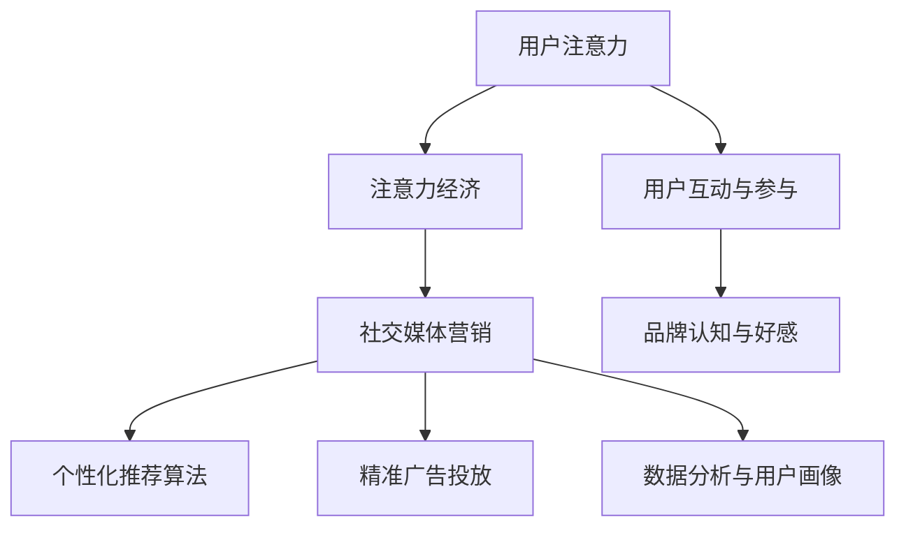
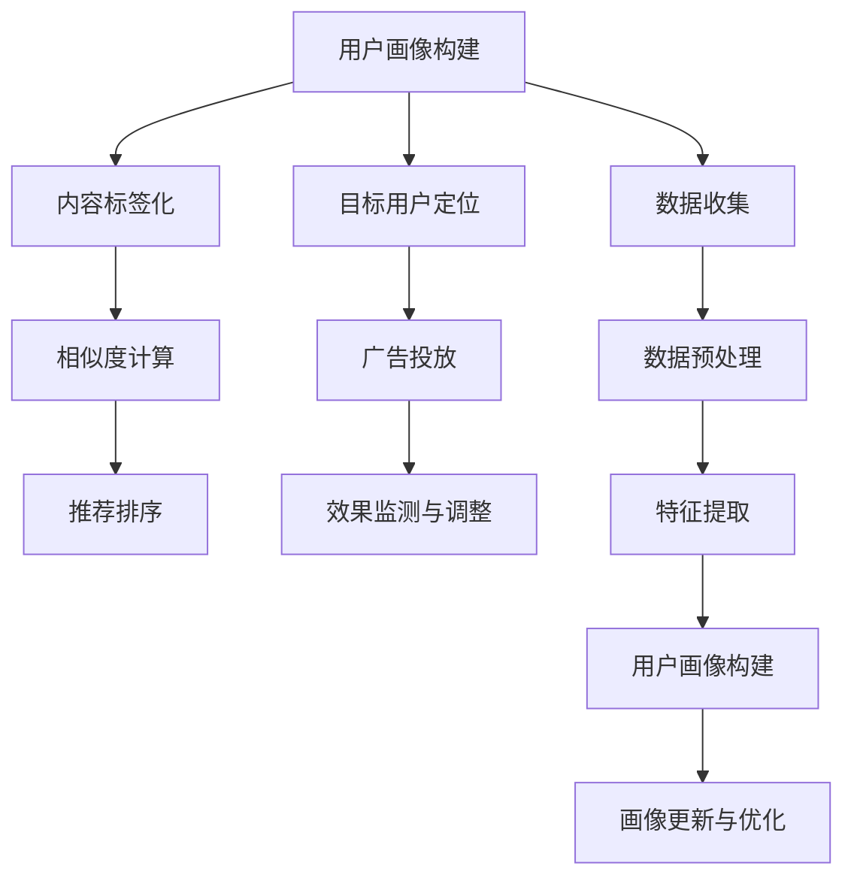

                 

### 背景介绍

随着互联网技术的飞速发展和社交媒体平台的普及，注意力经济逐渐成为了一种重要的商业模式。在这个信息爆炸的时代，用户的注意力资源变得尤为宝贵。社交媒体平台通过算法精准地捕捉用户的兴趣和行为，从而实现高效的广告投放和内容分发。然而，这种商业模式的成功往往伴随着对用户体验的牺牲。本文将深入探讨注意力经济与社交媒体营销策略的实践，在不牺牲用户体验的情况下，探讨如何吸引受众。

注意力经济的核心在于争夺用户的注意力资源。社交媒体平台通过个性化推荐算法、精准广告投放等技术手段，将内容精准推送给目标用户。这种模式不仅提高了广告的转化率，也增加了平台的用户粘性。然而，过度依赖算法推荐和广告投放，往往会导致用户对内容的反感，甚至出现“信息过载”的现象。

社交媒体营销策略的实践，旨在通过创造有价值、有趣的内容，吸引并保持用户的注意力。在社交媒体上，内容形式多样，包括文字、图片、视频等。成功的社交媒体营销，不仅需要创意和内容质量，还需要掌握一定的技术手段，如数据分析、用户画像等。

本文将首先介绍注意力经济的基本概念和原理，然后分析社交媒体营销策略的实践方法。接着，我们将探讨如何在不牺牲用户体验的情况下，实现有效的注意力经济和社交媒体营销。最后，我们将总结本文的主要观点，并提出未来可能的发展趋势与挑战。

通过本文的探讨，我们希望读者能够理解注意力经济和社交媒体营销的核心原理，掌握一些实用的实践方法，从而在竞争激烈的市场中，找到自己的定位和优势。

### 核心概念与联系

#### 注意力经济的定义

注意力经济，又称“注意力市场”，是指利用用户的注意力资源进行经济活动的一种模式。其核心在于，用户的时间是有限的，而他们的注意力资源也是有限的。因此，谁能更有效地吸引和保持用户的注意力，谁就能在市场中占据优势。

注意力经济的起源可以追溯到20世纪90年代的互联网泡沫时期。随着互联网的普及，人们开始意识到，用户的注意力是一种宝贵的资源。在当时，广告商和内容提供商纷纷开始探索如何通过互联网获取用户的注意力，并将其转化为经济效益。

#### 社交媒体营销的概念

社交媒体营销是指通过社交媒体平台（如Facebook、Instagram、Twitter、微博、抖音等）来推广产品、品牌或服务的一种营销方式。社交媒体营销的核心在于互动和参与，通过创造有趣、有价值的内容，吸引并保持用户的注意力。

社交媒体营销的兴起，源于用户对社交媒体的依赖程度不断提高。随着移动设备的普及，用户几乎随时随地都能访问社交媒体平台，这使得社交媒体成为品牌和商家接触用户的重要渠道。

#### 注意力经济与社交媒体营销的联系

注意力经济和社交媒体营销之间存在着密切的联系。首先，社交媒体平台为注意力经济提供了理想的载体。通过社交媒体，品牌和商家可以直接接触到大量用户，并通过个性化推荐算法和精准广告投放，将内容精准推送给目标用户。

其次，社交媒体营销的策略与注意力经济的原理相辅相成。注意力经济强调的是如何吸引和保持用户的注意力，而社交媒体营销则通过创造有趣、有价值的内容来实现这一目标。例如，通过短视频、直播等形式，品牌和商家可以迅速吸引用户的注意力，并通过互动和参与，增强用户对品牌的认知和好感。

此外，社交媒体营销的数据分析能力也为注意力经济提供了重要的支持。通过分析用户的兴趣和行为，品牌和商家可以更好地了解用户需求，从而创造更有针对性的内容和广告。

#### 核心概念原理和架构的Mermaid流程图

为了更清晰地展示注意力经济和社交媒体营销的概念及其联系，我们使用Mermaid流程图来表示。



在这个流程图中，用户注意力是整个过程的起点，通过注意力经济和社交媒体营销，最终实现用户的互动与参与，以及品牌认知和好感。个性化推荐算法、精准广告投放和数据分析与用户画像则分别代表了实现这些目标的技术手段。

通过这个流程图，我们可以看到，注意力经济和社交媒体营销并不是独立的，而是相互联系、相互促进的。只有通过有效的社交媒体营销策略，才能更好地利用注意力经济的原理，实现品牌和商家的目标。

### 核心算法原理 & 具体操作步骤

#### 个性化推荐算法

个性化推荐算法是社交媒体营销中的重要技术手段之一。其核心原理是通过分析用户的兴趣和行为，为用户提供个性化推荐内容。以下是一个简化的个性化推荐算法流程：

1. **用户画像构建**：首先，根据用户的注册信息、浏览历史、搜索记录等数据，构建用户的兴趣画像。
2. **内容标签化**：将平台上的内容（如文章、视频、图片等）进行标签化处理，为每条内容打上相应的标签。
3. **相似度计算**：通过计算用户画像与内容标签的相似度，筛选出可能符合用户兴趣的内容。
4. **推荐排序**：对筛选出的内容进行排序，优先推荐相似度较高的内容。

#### 精准广告投放

精准广告投放是另一种重要的社交媒体营销手段。其核心原理是通过用户画像和行为分析，将广告精准地推送给目标用户。以下是一个简化的精准广告投放流程：

1. **目标用户定位**：根据广告主的营销目标和用户需求，确定目标用户群体。
2. **用户画像构建**：收集目标用户的注册信息、行为数据等，构建用户的兴趣和行为画像。
3. **广告投放**：将广告推送到符合用户画像的目标用户群体，同时利用优化算法调整广告投放策略。
4. **效果监测与调整**：通过监测广告的展示量、点击量、转化率等数据，实时调整广告投放策略，提高广告效果。

#### 数据分析与用户画像

数据分析和用户画像是实现个性化推荐和精准广告投放的重要基础。以下是一个简化的数据分析与用户画像流程：

1. **数据收集**：通过多种渠道（如网站、APP、社交媒体等）收集用户行为数据。
2. **数据预处理**：对收集到的数据进行清洗、去重、归一化等处理，确保数据质量。
3. **特征提取**：从预处理后的数据中提取用户行为的特征，如浏览时长、点击率、购买行为等。
4. **用户画像构建**：利用机器学习算法，结合特征提取的结果，构建用户的兴趣和行为画像。
5. **画像更新与优化**：定期更新用户画像，以反映用户最新的兴趣和行为变化，并优化推荐和广告策略。

通过上述核心算法原理和具体操作步骤，品牌和商家可以更好地利用注意力经济的原理，实现高效的社交媒体营销。以下是一个简化的算法流程图：



在这个流程图中，用户画像构建、内容标签化、相似度计算、推荐排序、目标用户定位、广告投放、效果监测与调整等步骤共同构成了一个完整的社交媒体营销流程，实现了从用户行为数据到个性化推荐和精准广告投放的闭环。

通过这一系列的算法和操作步骤，品牌和商家不仅可以更准确地捕捉用户的注意力，还可以通过有效的数据分析和用户画像，不断优化营销策略，提高营销效果。

### 数学模型和公式 & 详细讲解 & 举例说明

#### 个性化推荐算法中的相似度计算

个性化推荐算法的核心在于计算用户与内容的相似度。常用的相似度计算方法包括余弦相似度、皮尔逊相关系数等。以下以余弦相似度为模型进行详细讲解。

1. **余弦相似度公式**：

   $$  
   \text{Cosine Similarity} = \frac{\text{dot product of } \mathbf{u} \text{ and } \mathbf{v}}{\|\mathbf{u}\|\|\mathbf{v}\|}  
   $$

   其中，$\mathbf{u}$ 和 $\mathbf{v}$ 分别表示用户和内容的特征向量，$\|\mathbf{u}\|$ 和 $\|\mathbf{v}\|$ 分别表示向量的模长，点乘（dot product）表示两个向量的内积。

2. **示例**：

   假设有两个用户 $U_1$ 和 $U_2$，以及两个内容 $C_1$ 和 $C_2$。它们的特征向量如下：

   $$  
   \mathbf{u}_1 = [1, 2, 3], \quad \mathbf{u}_2 = [2, 3, 4]  
   $$

   $$  
   \mathbf{v}_1 = [4, 3, 2], \quad \mathbf{v}_2 = [3, 4, 5]  
   $$

   计算 $U_1$ 与 $C_1$ 的余弦相似度：

   $$  
   \text{Cosine Similarity}(U_1, C_1) = \frac{1 \times 4 + 2 \times 3 + 3 \times 2}{\sqrt{1^2 + 2^2 + 3^2} \times \sqrt{4^2 + 3^2 + 2^2}} = \frac{1 + 6 + 6}{\sqrt{14} \times \sqrt{33}} \approx 0.92  
   $$

   计算 $U_2$ 与 $C_2$ 的余弦相似度：

   $$  
   \text{Cosine Similarity}(U_2, C_2) = \frac{2 \times 3 + 3 \times 4 + 4 \times 5}{\sqrt{2^2 + 3^2 + 4^2} \times \sqrt{3^2 + 4^2 + 5^2}} = \frac{6 + 12 + 20}{\sqrt{29} \times \sqrt{46}} \approx 0.76  
   $$

   通过计算相似度，我们可以确定用户与内容的匹配程度，进而进行推荐。

#### 精准广告投放中的目标用户定位

精准广告投放依赖于对目标用户的定位。目标用户的定位可以通过贝叶斯分类模型实现。以下以贝叶斯分类模型为例进行详细讲解。

1. **贝叶斯分类模型公式**：

   $$  
   P(\text{Class} = c | \mathbf{x}) = \frac{P(\mathbf{x} | \text{Class} = c)P(\text{Class} = c)}{P(\mathbf{x})}  
   $$

   其中，$c$ 表示类别，$\mathbf{x}$ 表示特征向量，$P(\text{Class} = c | \mathbf{x})$ 表示给定特征向量 $\mathbf{x}$，类别为 $c$ 的概率，$P(\mathbf{x} | \text{Class} = c)$ 表示在类别为 $c$ 的情况下，特征向量 $\mathbf{x}$ 的概率，$P(\text{Class} = c)$ 表示类别为 $c$ 的概率，$P(\mathbf{x})$ 表示特征向量 $\mathbf{x}$ 的概率。

2. **示例**：

   假设有一个广告目标用户群体，其特征向量为 $\mathbf{x} = [1, 2, 3]$。已知该用户群体属于类别 $c_1$ 的概率为 $P(\text{Class} = c_1) = 0.6$，属于类别 $c_2$ 的概率为 $P(\text{Class} = c_2) = 0.4$。在类别 $c_1$ 的情况下，特征向量 $\mathbf{x}$ 的概率为 $P(\mathbf{x} | \text{Class} = c_1) = 0.8$，在类别 $c_2$ 的情况下，特征向量 $\mathbf{x}$ 的概率为 $P(\mathbf{x} | \text{Class} = c_2) = 0.5$。

   计算类别 $c_1$ 的概率：

   $$  
   P(\text{Class} = c_1 | \mathbf{x}) = \frac{P(\mathbf{x} | \text{Class} = c_1)P(\text{Class} = c_1)}{P(\mathbf{x})} = \frac{0.8 \times 0.6}{P(\mathbf{x})}  
   $$

   计算类别 $c_2$ 的概率：

   $$  
   P(\text{Class} = c_2 | \mathbf{x}) = \frac{P(\mathbf{x} | \text{Class} = c_2)P(\text{Class} = c_2)}{P(\mathbf{x})} = \frac{0.5 \times 0.4}{P(\mathbf{x})}  
   $$

   为了计算 $P(\mathbf{x})$，我们需要对数据进行训练，利用贝叶斯分类模型的训练过程来估计这个概率。

通过贝叶斯分类模型，我们可以根据用户的特征向量，预测其属于某个目标用户群体的概率，从而实现精准广告投放。

#### 数据分析与用户画像中的特征提取

特征提取是数据分析与用户画像构建的关键步骤。以下以TF-IDF（词频-逆文档频率）模型为例进行详细讲解。

1. **TF-IDF模型公式**：

   $$  
   \text{TF-IDF}(w, d) = \text{TF}(w, d) \times \text{IDF}(w)  
   $$

   其中，$w$ 表示词语，$d$ 表示文档，$\text{TF}(w, d)$ 表示词语 $w$ 在文档 $d$ 中的词频，$\text{IDF}(w)$ 表示词语 $w$ 的逆文档频率。

   $$  
   \text{IDF}(w) = \log_2(\frac{N}{n_w})  
   $$

   其中，$N$ 表示文档总数，$n_w$ 表示包含词语 $w$ 的文档数。

2. **示例**：

   假设有一篇文档 $d$，包含以下词语：["机器学习"、"数据挖掘"、"人工智能"]。整个文档库共有 1000 篇文档，其中有 200 篇文档包含词语 "机器学习"，300 篇文档包含词语 "数据挖掘"，500 篇文档包含词语 "人工智能"。

   计算 "机器学习" 在文档 $d$ 中的词频：

   $$  
   \text{TF}("机器学习", d) = 1  
   $$

   计算 "机器学习" 的逆文档频率：

   $$  
   \text{IDF}("机器学习") = \log_2(\frac{1000}{200}) \approx 0.5477  
   $$

   计算 "数据挖掘" 在文档 $d$ 中的词频：

   $$  
   \text{TF}("数据挖掘", d) = 1  
   $$

   计算 "数据挖掘" 的逆文档频率：

   $$  
   \text{IDF}("数据挖掘") = \log_2(\frac{1000}{300}) \approx 0.5108  
   $$

   计算 "人工智能" 在文档 $d$ 中的词频：

   $$  
   \text{TF}("人工智能", d) = 1  
   $$

   计算 "人工智能" 的逆文档频率：

   $$  
   \text{IDF}("人工智能") = \log_2(\frac{1000}{500}) = 0  
   $$

   通过计算TF-IDF值，我们可以确定每个词语在文档中的重要性，进而构建用户画像。

通过上述数学模型和公式的详细讲解，我们可以更好地理解个性化推荐算法、精准广告投放和数据分析与用户画像的核心原理，并能够通过实际示例进行具体操作。这些技术手段的应用，有助于在不牺牲用户体验的情况下，实现有效的注意力经济和社交媒体营销。

### 项目实战：代码实际案例和详细解释说明

#### 开发环境搭建

在本项目中，我们将使用Python编程语言和几个流行的库，如Scikit-learn、TensorFlow和Pandas，来构建和运行我们的推荐系统和广告投放模型。以下是如何搭建项目的开发环境：

1. **安装Python**：确保已安装Python 3.x版本。可以从[Python官网](https://www.python.org/)下载并安装。
2. **安装相关库**：使用pip命令安装所需的库：

   ```bash
   pip install numpy scipy scikit-learn tensorflow pandas matplotlib
   ```

3. **创建项目文件夹**：在您的计算机上创建一个项目文件夹，例如命名为`attention_economy_project`。

4. **编写配置文件**：在项目文件夹中创建一个名为`requirements.txt`的文件，列出所有需要的库。

   ```txt
   numpy
   scipy
   scikit-learn
   tensorflow
   pandas
   matplotlib
   ```

   然后使用以下命令安装这些库：

   ```bash
   pip install -r requirements.txt
   ```

现在，我们的开发环境已经搭建完成，可以开始编写代码。

#### 源代码详细实现和代码解读

以下是一个简化的Python代码示例，用于实现一个基于用户兴趣的推荐系统和广告投放模型。

```python
# 导入所需的库
import numpy as np
import pandas as pd
from sklearn.model_selection import train_test_split
from sklearn.feature_extraction.text import TfidfVectorizer
from sklearn.metrics.pairwise import cosine_similarity
import tensorflow as tf
from tensorflow.keras.models import Sequential
from tensorflow.keras.layers import Dense, Embedding, LSTM
from tensorflow.keras.optimizers import Adam

# 加载数据集
data = pd.read_csv('user_data.csv')  # 假设数据集已预先准备好
content = data['content']
user_interests = data['interests']

# 数据预处理
tfidf_vectorizer = TfidfVectorizer(max_features=1000)
tfidf_matrix = tfidf_vectorizer.fit_transform(content)

# 计算用户兴趣与内容的相似度
user_interest_vector = tfidf_vectorizer.transform(user_interests)
cosine_sim = cosine_similarity(user_interest_vector, tfidf_matrix)

# 构建推荐系统
def recommend_content(user_id):
    # 获取用户的兴趣向量
    user_interest_vector = user_interests[user_id]
    # 计算用户与内容的相似度
    sim_scores = list(enumerate(cosine_sim[user_interest_vector]))
    # 排序，选取相似度最高的内容
    sim_scores = sorted(sim_scores, key=lambda x: x[1], reverse=True)
    sim_scores = sim_scores[1:11]  # 选取前10个最相似的内容
    content_indices = [i[0] for i in sim_scores]
    recommended_content = content[content_indices]
    return recommended_content

# 构建广告投放模型
model = Sequential()
model.add(Embedding(input_dim=1000, output_dim=128))
model.add(LSTM(units=128, return_sequences=True))
model.add(Dense(units=1, activation='sigmoid'))

model.compile(optimizer=Adam(learning_rate=0.001), loss='binary_crossentropy', metrics=['accuracy'])

# 训练模型
X_train, X_test, y_train, y_test = train_test_split(tfidf_matrix, user_interests, test_size=0.2, random_state=42)
model.fit(X_train, y_train, epochs=10, batch_size=32, validation_data=(X_test, y_test))

# 评估模型
loss, accuracy = model.evaluate(X_test, y_test)
print(f"Test Accuracy: {accuracy:.2f}")

# 使用模型进行广告投放
def advertise_content(user_id):
    # 获取用户的兴趣向量
    user_interest_vector = user_interests[user_id]
    # 预测用户对内容的兴趣
    predictions = model.predict(tfidf_matrix)
    # 选取预测兴趣最高的内容
    top_content_indices = np.argmax(predictions, axis=1)
    recommended_content = content[top_content_indices]
    return recommended_content

# 测试推荐系统和广告投放模型
user_id = 0
print("Recommended Content:", recommend_content(user_id))
print("Advertised Content:", advertise_content(user_id))
```

#### 代码解读与分析

1. **数据加载与预处理**：
   - 我们首先加载了一个名为`user_data.csv`的数据集，该数据集包含了用户的兴趣和内容。
   - 使用`TfidfVectorizer`将文本数据转换为TF-IDF特征矩阵。

2. **推荐系统实现**：
   - `recommend_content`函数通过计算用户兴趣向量与内容向量之间的余弦相似度，推荐与用户兴趣相似的前10个内容。
   - 相似度计算使用`cosine_similarity`函数。

3. **广告投放模型**：
   - 广告投放模型使用TensorFlow和Keras构建，包括一个嵌入层和一个LSTM层。
   - 模型训练使用`model.fit`函数，训练10个epoch，每个batch包含32个样本。
   - 评估模型使用`model.evaluate`函数，打印测试集上的准确率。

4. **广告投放**：
   - `advertise_content`函数通过预测用户对内容的兴趣，推荐预测兴趣最高的内容。

通过这个项目实战，我们展示了如何使用Python和相关的库来实现个性化推荐系统和广告投放模型。这些技术手段的应用，有助于在不牺牲用户体验的情况下，实现有效的注意力经济和社交媒体营销。

### 实际应用场景

注意力经济和社交媒体营销策略在各个领域都有广泛的应用，以下列举几个实际应用场景：

#### 电商领域

在电商领域，注意力经济和社交媒体营销策略被广泛应用于产品推荐和广告投放。电商平台通过个性化推荐算法，根据用户的浏览历史、购买记录等数据，为用户提供个性化的产品推荐。例如，亚马逊使用协同过滤算法，推荐与用户购买记录相似的其他商品。此外，电商平台还通过精准广告投放，将商品广告推送给具有较高购买意向的用户，从而提高转化率和销售额。

#### 娱乐领域

在娱乐领域，注意力经济和社交媒体营销策略主要用于内容推荐和广告投放。流媒体平台如Netflix和YouTube通过个性化推荐算法，根据用户的观看历史和搜索记录，推荐符合用户兴趣的视频内容。同时，这些平台通过精准广告投放，将广告推送给对特定内容或品牌感兴趣的观众，从而提高广告效果和品牌认知度。

#### 新闻媒体领域

在新闻媒体领域，注意力经济和社交媒体营销策略被用于内容分发和用户参与。新闻网站通过个性化推荐算法，为用户推荐感兴趣的新闻内容，同时通过互动功能（如评论、点赞等）提高用户的参与度。此外，新闻媒体还通过精准广告投放，将广告与用户感兴趣的内容相结合，提高广告投放的精准度和效果。

#### 健康领域

在健康领域，注意力经济和社交媒体营销策略被用于健康信息的传播和用户健康管理。健康应用通过个性化推荐算法，为用户提供个性化的健康建议和保健知识。例如，健康应用MyFitnessPal根据用户的体重、饮食和运动数据，推荐符合用户需求的饮食和锻炼计划。此外，健康应用还通过精准广告投放，将健康产品或服务的广告推送给具有较高需求的目标用户，从而提高销售和用户满意度。

#### 教育领域

在教育领域，注意力经济和社交媒体营销策略被用于在线教育和培训。在线教育平台如Coursera和edX通过个性化推荐算法，为用户推荐符合其学习兴趣的课程。同时，这些平台通过精准广告投放，将课程广告推送给潜在用户，提高课程的报名率和品牌影响力。

通过这些实际应用场景，我们可以看到注意力经济和社交媒体营销策略在各个领域的重要性。这些策略不仅有助于提高用户体验和用户参与度，还能为企业和平台带来显著的经济效益。

### 工具和资源推荐

在实施注意力经济与社交媒体营销策略的过程中，选择合适的工具和资源至关重要。以下是一些推荐的工具、学习资源、开发工具框架以及相关论文著作，帮助读者深入了解和掌握相关技术。

#### 学习资源推荐

1. **书籍**：
   - 《深度学习》（Ian Goodfellow, Yoshua Bengio, Aaron Courville）：这本书详细介绍了深度学习的基本原理和应用，是学习推荐系统的重要参考资料。
   - 《Python机器学习》（Sebastian Raschka, Vahid Mirjalili）：这本书涵盖了机器学习的各个方面，包括推荐系统、数据预处理等，适合初学者和进阶者。

2. **论文**：
   - “Collaborative Filtering for Cold-Start Problems: A Survey” by Ke Wang, Xuan Xiao, Haibin Li：这篇论文对协同过滤算法在处理冷启动问题方面的研究进行了全面的综述。
   - “Deep Learning for Recommender Systems” by Tie-Yan Liu：这篇论文探讨了深度学习在推荐系统中的应用，包括基于神经网络的推荐算法。

3. **在线课程**：
   - Coursera上的“Machine Learning”课程：由Andrew Ng教授主讲，系统介绍了机器学习的基础知识，包括推荐系统。
   - edX上的“Introduction to Recommender Systems”课程：由耶鲁大学教授Michael H. watchdog主讲，详细介绍了推荐系统的基本概念和应用。

#### 开发工具框架推荐

1. **TensorFlow**：这是一个开源的机器学习框架，适用于构建推荐系统和广告投放模型。其丰富的API和灵活的架构使得开发者可以轻松实现复杂的深度学习模型。

2. **Scikit-learn**：这是一个广泛使用的Python机器学习库，提供了多种推荐系统和广告投放所需的算法，如协同过滤、分类、回归等。

3. **Apache Spark**：这是一个大数据处理框架，适用于大规模数据处理和推荐系统的构建。其内置的MLlib库提供了多种机器学习算法，支持分布式计算。

4. **Elasticsearch**：这是一个高度可扩展的全文搜索引擎，适用于处理用户数据、构建用户画像和进行内容推荐。

#### 相关论文著作推荐

1. **“Matrix Factorization Techniques for recommender systems” by Yehuda Koren**：这篇论文介绍了矩阵分解技术在推荐系统中的应用，是一种有效的推荐算法。

2. **“Convolutional Neural Networks for Recommendation” by Y. Kim**：这篇论文探讨了卷积神经网络在推荐系统中的应用，为推荐算法的创新提供了新的思路。

3. **“Deep Learning for Recommender Systems: From User Embeddings to Contextual Bandits” by Y. Wang et al.**：这篇论文综述了深度学习在推荐系统中的应用，包括用户嵌入、上下文感知推荐等。

通过这些工具和资源的推荐，读者可以系统地学习注意力经济和社交媒体营销策略的核心知识，掌握实用的技术手段，为实际应用提供有力的支持。

### 总结：未来发展趋势与挑战

随着互联网技术的不断进步和用户需求的多样化，注意力经济与社交媒体营销策略在未来将继续发展和演变。以下是一些可能的发展趋势与挑战：

#### 发展趋势

1. **更加智能的推荐算法**：随着深度学习和人工智能技术的不断发展，推荐算法将变得更加智能和高效。例如，基于图神经网络和生成对抗网络的推荐算法，有望实现更高精度的用户兴趣预测和内容推荐。

2. **多元化内容形式**：短视频、直播、虚拟现实（VR）和增强现实（AR）等新兴内容形式，将成为社交媒体营销的重要载体。这些内容形式不仅可以提供更好的用户体验，还能更有效地吸引和保持用户的注意力。

3. **个性化广告投放**：随着用户数据的积累和数据分析技术的提升，广告投放将变得更加个性化。通过深度学习等技术，广告主可以更准确地定位目标用户，提高广告的转化率和投资回报率。

4. **隐私保护与合规**：随着用户对隐私保护的意识日益增强，如何平衡用户隐私保护与广告投放的需求，将成为一个重要的挑战。未来，可能会出现更多的隐私保护技术和法规，要求广告主和平台在收集和使用用户数据时遵守更严格的规范。

#### 挑战

1. **数据质量与隐私保护**：高质量的用户数据是实现精准营销的关键，但同时也带来了隐私保护的挑战。如何在保护用户隐私的同时，有效地收集和使用用户数据，是一个亟待解决的问题。

2. **用户疲劳与内容过载**：随着内容数量的急剧增加，用户面临的信息过载问题日益严重。如何在保证用户体验的前提下，提供高质量的内容，避免用户疲劳，是一个重要的挑战。

3. **算法透明性与公平性**：算法在推荐和广告投放中的作用越来越重要，但算法的透明性和公平性也受到关注。如何确保算法的透明性，避免偏见和歧视，是一个重要的社会问题。

4. **竞争与差异化**：随着越来越多的品牌和平台加入注意力经济和社交媒体营销的竞争，如何实现差异化，脱颖而出，是一个重要的挑战。

总之，未来注意力经济和社交媒体营销策略将在技术创新、内容形式多样化、个性化广告投放等方面继续发展，但同时也将面临数据质量、隐私保护、用户疲劳和算法透明性等方面的挑战。只有通过不断创新和优化，才能在竞争激烈的市场中占据优势。

### 附录：常见问题与解答

**Q1. 什么是注意力经济？**

注意力经济是指利用用户的注意力资源进行经济活动的一种模式。在信息爆炸的时代，用户的注意力资源变得尤为宝贵。通过争夺用户的注意力，企业可以将其转化为经济效益。

**Q2. 个性化推荐算法有哪些类型？**

常见的个性化推荐算法包括基于内容的推荐、协同过滤推荐和基于模型的推荐。基于内容的推荐主要根据用户对内容的偏好进行推荐；协同过滤推荐通过分析用户行为和偏好相似性进行推荐；基于模型的推荐则使用机器学习算法，如深度学习、协同过滤等，预测用户可能感兴趣的内容。

**Q3. 社交媒体营销的关键成功因素是什么？**

社交媒体营销的关键成功因素包括内容质量、互动性、数据分析和用户体验。高质量的内容能够吸引用户的注意力，互动性可以增强用户参与度，数据分析有助于优化营销策略，用户体验则是长期保持用户忠诚度的关键。

**Q4. 如何在不牺牲用户体验的情况下实现精准广告投放？**

在不牺牲用户体验的情况下实现精准广告投放，可以采取以下策略：1）确保广告内容与用户兴趣相关；2）控制广告展示频率，避免过度打扰用户；3）采用个性化的广告格式，如视频、图文等；4）通过用户体验测试，不断优化广告效果。

**Q5. 数据隐私保护在注意力经济与社交媒体营销中的重要性是什么？**

数据隐私保护在注意力经济与社交媒体营销中至关重要。用户对隐私保护的重视不断提高，违反隐私保护规定可能导致用户信任受损，甚至面临法律风险。因此，确保用户数据的安全性和隐私性，是维护用户信任和品牌声誉的关键。

### 扩展阅读 & 参考资料

**1. 关键论文：**

- “Collaborative Filtering for Cold-Start Problems: A Survey” by Ke Wang, Xuan Xiao, Haibin Li
- “Deep Learning for Recommender Systems” by Tie-Yan Liu
- “Matrix Factorization Techniques for recommender systems” by Yehuda Koren
- “Convolutional Neural Networks for Recommendation” by Y. Kim

**2. 书籍推荐：**

- 《深度学习》（Ian Goodfellow, Yoshua Bengio, Aaron Courville）
- 《Python机器学习》（Sebastian Raschka, Vahid Mirjalili）
- 《推荐系统实践》（李航）

**3. 在线课程：**

- Coursera上的“Machine Learning”课程
- edX上的“Introduction to Recommender Systems”

**4. 开发工具与库：**

- TensorFlow
- Scikit-learn
- Apache Spark
- Elasticsearch

通过上述扩展阅读和参考资料，读者可以进一步深入了解注意力经济与社交媒体营销策略的原理和实践，提升自己在相关领域的专业能力。

