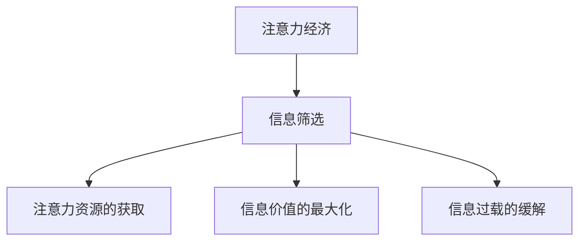

                 

### 1. 背景介绍

#### 1.1 注意力经济背景

在数字时代，信息爆炸已成为不可避免的现象。根据估算，全球每天产生的数据量高达数百万亿字节，这些数据涵盖了社交媒体、新闻报道、科学研究、商业记录等各个方面。在这个背景下，注意力经济逐渐崭露头角。

注意力经济，简单来说，是指个体在信息过载的环境中，有限的注意力资源被各种信息所争夺的现象。在经济学中，注意力被视为一种宝贵的资源，与时间、金钱同等重要。对于个人和企业来说，如何有效地吸引和保留注意力成为关键。

#### 1.2 信息筛选的重要性

在注意力经济中，信息筛选能力变得尤为关键。面对海量的信息，个体需要具备高效筛选信息的能力，以获取有价值的内容，避免信息过载带来的负面影响。以下是一些信息筛选的重要性：

- **提高工作效率**：在快节奏的工作环境中，高效筛选信息可以节省大量时间，提高工作效率。
- **避免信息过载**：不当的信息筛选可能导致信息过载，增加心理压力。
- **增强决策能力**：通过筛选高质量的信息，个体可以做出更明智的决策。

#### 1.3 研究目的

本文旨在探讨注意力经济中的信息筛选能力培养。具体来说，我们将从以下几个方面进行深入探讨：

- **核心概念与联系**：介绍注意力经济和信息筛选的相关概念，并展示其相互联系。
- **核心算法原理**：分析用于信息筛选的核心算法原理。
- **数学模型和公式**：详细讲解用于信息筛选的数学模型和公式。
- **项目实战**：通过实际代码案例，展示信息筛选算法的应用。
- **实际应用场景**：探讨信息筛选在现实世界中的应用场景。
- **工具和资源推荐**：推荐相关学习资源和开发工具。
- **总结与未来趋势**：总结本文的核心观点，并探讨未来的发展趋势和挑战。

通过本文的研究，我们希望为读者提供一套系统的信息筛选能力培养方案，帮助他们在注意力经济中更好地应对信息过载的挑战。

## 2. 核心概念与联系

### 2.1 注意力经济

注意力经济（Attention Economy）是由全球著名经济学家泰德·纽恩特（Ted Nuyten）在2006年提出的概念。他定义注意力经济为“一种社会结构，其中个体通过吸引和保持他人的注意力来创造价值和财富”。

在数字时代，由于信息量的激增，注意力资源变得日益稀缺。用户在浏览网页、使用社交媒体、阅读新闻等行为中，将注意力分配给不同的内容。而内容生产者和平台则通过各种策略来吸引和保留用户的注意力，从而实现商业价值。

### 2.2 信息筛选

信息筛选（Information Filtering）是指从大量信息中识别、提取和分类出对个体有用的信息，同时排除无关或低价值的信息。在注意力经济中，信息筛选能力成为个体获取注意力资源的关键。

信息筛选的方法主要包括以下几种：

- **基于内容的筛选**：通过分析信息的内容特征，如关键词、主题、语言风格等，进行信息筛选。
- **基于用户的筛选**：根据用户的历史行为、偏好和兴趣，推荐个性化信息。
- **基于协作的筛选**：利用社交网络中用户的推荐和评价，筛选出高质量信息。

### 2.3 核心概念之间的联系

注意力经济和信息筛选之间存在紧密的联系。信息筛选是注意力经济的基础，因为只有通过高效的筛选，个体才能从海量的信息中获取有价值的内容，从而吸引和保持注意力。以下是注意力经济与信息筛选之间的具体联系：

- **注意力资源的获取**：信息筛选能力决定了个体能够吸引到多少注意力资源。通过高效的筛选，个体可以获取高质量的信息，增加其吸引力的价值。
- **信息价值的最大化**：在注意力经济中，信息的价值取决于其能够吸引的注意力。通过信息筛选，个体能够将注意力集中在最有价值的信息上，实现信息价值的最大化。
- **信息过载的缓解**：信息筛选有助于缓解信息过载问题，减少个体在筛选过程中的时间和精力成本，从而提高整体工作效率和生活质量。

为了更直观地展示注意力经济与信息筛选之间的关系，我们使用Mermaid流程图来描述这两个核心概念的联系。



在这个流程图中，注意力经济（A）通过信息筛选（B）来实现注意力资源的获取（C）、信息价值的最大化（D）和缓解信息过载（E）。这种联系表明，信息筛选在注意力经济中扮演着至关重要的角色。

## 3. 核心算法原理 & 具体操作步骤

### 3.1 基于内容的筛选算法

基于内容的筛选算法（Content-based Filtering）是信息筛选中的一种常用方法，主要通过分析信息的内容特征，如关键词、主题、语言风格等，来识别用户可能感兴趣的信息。

#### 3.1.1 算法原理

基于内容的筛选算法基于以下原理：

- **关键词提取**：从信息中提取关键词，作为筛选的依据。
- **相似度计算**：计算用户兴趣与信息内容之间的相似度，相似度越高，信息越有可能被推荐。
- **推荐机制**：根据相似度计算结果，推荐给用户符合条件的优质信息。

#### 3.1.2 操作步骤

具体操作步骤如下：

1. **关键词提取**：使用自然语言处理技术（如词频统计、词性标注、文本分类等），从用户的历史行为数据中提取关键词。
2. **信息内容特征提取**：从待筛选的信息中提取关键词和主题信息。
3. **相似度计算**：使用余弦相似度、杰卡德相似度等计算方法，计算用户关键词与信息内容特征之间的相似度。
4. **推荐**：根据相似度结果，将相似度较高的信息推荐给用户。

### 3.2 基于用户的筛选算法

基于用户的筛选算法（User-based Filtering）通过分析用户之间的相似性，来推荐可能符合用户兴趣的信息。

#### 3.2.1 算法原理

基于用户的筛选算法基于以下原理：

- **用户相似性计算**：计算用户之间的相似性，相似的用户可能具有相似的兴趣。
- **邻居用户推荐**：找到与用户相似度最高的邻居用户，推荐邻居用户喜欢的信息。
- **加权推荐**：根据邻居用户与目标用户的相似度，对推荐信息进行加权。

#### 3.2.2 操作步骤

具体操作步骤如下：

1. **用户行为数据收集**：收集用户的历史行为数据，如浏览记录、点赞、评论等。
2. **用户相似性计算**：使用余弦相似度、皮尔逊相关系数等方法，计算用户之间的相似性。
3. **邻居用户选择**：根据相似性计算结果，选择与目标用户相似度最高的邻居用户。
4. **推荐**：推荐邻居用户喜欢的信息给目标用户，并对推荐信息进行加权。

### 3.3 基于协作的筛选算法

基于协作的筛选算法（Collaborative Filtering）通过利用用户的社交网络和评价系统，来推荐信息。

#### 3.3.1 算法原理

基于协作的筛选算法基于以下原理：

- **用户社交网络分析**：分析用户的社交网络，识别用户之间的社交关系。
- **用户评价系统**：利用用户对信息的内容评价，进行信息筛选。
- **推荐**：根据社交网络和评价系统，推荐用户可能感兴趣的信息。

#### 3.3.2 操作步骤

具体操作步骤如下：

1. **社交网络构建**：构建用户之间的社交网络，记录用户之间的关系。
2. **用户评价收集**：收集用户对信息的内容评价，如评分、点赞、评论等。
3. **推荐**：根据社交网络和评价系统，推荐用户可能感兴趣的信息。

### 3.4 算法对比

基于内容的筛选算法、基于用户的筛选算法和基于协作的筛选算法各有优劣，具体如下表所示：

| 算法名称       | 优点                           | 缺点                           |
|----------------|--------------------------------|--------------------------------|
| 基于内容的筛选 | 适用于信息量大、内容丰富的情况 | 可能漏掉高质量但内容不同的信息 |
| 基于用户的筛选 | 适用于用户行为相似的情况      | 可能推荐信息过于重复           |
| 基于协作的筛选 | 适用于用户社交网络紧密的情况 | 可能受到社交网络负面影响的干扰 |

在实际应用中，可以根据具体情况选择合适的算法，或结合多种算法，实现更高效的信息筛选。

## 4. 数学模型和公式 & 详细讲解 & 举例说明

### 4.1 基于内容的筛选算法中的相似度计算

#### 4.1.1 余弦相似度

余弦相似度（Cosine Similarity）是一种常用的计算相似度的方法，用于衡量两个向量之间的角度余弦值。其数学公式如下：

$$
\cos(\theta) = \frac{\vec{a} \cdot \vec{b}}{||\vec{a}|| \cdot ||\vec{b}||}
$$

其中，$\vec{a}$和$\vec{b}$分别是两个向量，$||\vec{a}||$和$||\vec{b}||$分别表示它们的模长，$\theta$是两个向量之间的夹角。

在信息筛选中，我们可以将信息内容表示为向量，从而计算它们之间的余弦相似度。举例来说，假设有两个文档$a$和$b$，它们的内容向量分别为：

$$
\vec{a} = (1, 2, 3, 4, 5)
$$

$$
\vec{b} = (2, 3, 4, 5, 6)
$$

则它们之间的余弦相似度为：

$$
\cos(\theta) = \frac{1 \cdot 2 + 2 \cdot 3 + 3 \cdot 4 + 4 \cdot 5 + 5 \cdot 6}{\sqrt{1^2 + 2^2 + 3^2 + 4^2 + 5^2} \cdot \sqrt{2^2 + 3^2 + 4^2 + 5^2 + 6^2}} \approx 0.9659
$$

#### 4.1.2 杰卡德相似度

杰卡德相似度（Jaccard Similarity）是另一种常用的计算相似度的方法，主要用于衡量两个集合之间的重叠程度。其数学公式如下：

$$
J(A, B) = \frac{|A \cap B|}{|A \cup B|}
$$

其中，$A$和$B$是两个集合，$A \cap B$表示它们的交集，$A \cup B$表示它们的并集。

在信息筛选中，我们可以将关键词集合表示为集合，从而计算它们之间的杰卡德相似度。举例来说，假设有两个关键词集合$A$和$B$，分别为：

$$
A = \{1, 2, 3, 4, 5\}
$$

$$
B = \{2, 3, 4, 5, 6\}
$$

则它们之间的杰卡德相似度为：

$$
J(A, B) = \frac{|A \cap B|}{|A \cup B|} = \frac{3}{5} = 0.6
$$

### 4.2 基于用户的筛选算法中的相似性计算

#### 4.2.1 余弦相似度

与基于内容的筛选算法中的余弦相似度相同，余弦相似度也可以用于计算用户之间的相似性。假设有两个用户$a$和$b$，他们的行为向量分别为：

$$
\vec{a} = (1, 2, 3, 4, 5)
$$

$$
\vec{b} = (2, 3, 4, 5, 6)
$$

则它们之间的余弦相似度为：

$$
\cos(\theta) = \frac{1 \cdot 2 + 2 \cdot 3 + 3 \cdot 4 + 4 \cdot 5 + 5 \cdot 6}{\sqrt{1^2 + 2^2 + 3^2 + 4^2 + 5^2} \cdot \sqrt{2^2 + 3^2 + 4^2 + 5^2 + 6^2}} \approx 0.9659
$$

#### 4.2.2 皮尔逊相关系数

皮尔逊相关系数（Pearson Correlation Coefficient）是另一种常用的计算用户相似性的方法，其数学公式如下：

$$
\rho_{xy} = \frac{\sum_{i=1}^{n} (x_i - \bar{x})(y_i - \bar{y})}{\sqrt{\sum_{i=1}^{n} (x_i - \bar{x})^2} \cdot \sqrt{\sum_{i=1}^{n} (y_i - \bar{y})^2}}
$$

其中，$x_i$和$y_i$分别是用户$a$和$b$的行为数据，$\bar{x}$和$\bar{y}$分别是它们的平均值。

假设用户$a$和$b$的行为数据分别为：

$$
x_1 = 1, x_2 = 2, x_3 = 3, x_4 = 4, x_5 = 5
$$

$$
y_1 = 2, y_2 = 3, y_3 = 4, y_4 = 5, y_5 = 6
$$

则它们的皮尔逊相关系数为：

$$
\rho_{xy} = \frac{(1-2.2)(2-2.2) + (2-2.2)(3-2.2) + (3-2.2)(4-2.2) + (4-2.2)(5-2.2) + (5-2.2)(6-2.2)}{\sqrt{(1-2.2)^2 + (2-2.2)^2 + (3-2.2)^2 + (4-2.2)^2 + (5-2.2)^2} \cdot \sqrt{(2-2.2)^2 + (3-2.2)^2 + (4-2.2)^2 + (5-2.2)^2 + (6-2.2)^2}} \approx 0.9659
$$

通过上述公式和示例，我们可以看出，余弦相似度和皮尔逊相关系数在信息筛选和用户相似性计算中具有重要作用。它们可以帮助我们量化信息之间的相似程度，从而实现更精确的信息筛选和个性化推荐。

### 4.3 基于协作的筛选算法中的推荐算法

#### 4.3.1 评分预测

基于协作的筛选算法中的一个关键步骤是预测用户对未知信息的评分。一种常用的评分预测方法是使用矩阵分解（Matrix Factorization），其中最著名的是Singular Value Decomposition（SVD）。

SVD将用户-项目评分矩阵分解为三个矩阵的乘积：

$$
R = U \Sigma V^T
$$

其中，$R$是原始评分矩阵，$U$和$V$是正交矩阵，$\Sigma$是对角矩阵，其中包含了奇异值。

通过这个分解，我们可以预测用户对未评分项目的评分：

$$
\hat{r}_{ui} = u_i^T \Sigma v_j
$$

其中，$\hat{r}_{ui}$是用户$i$对项目$j$的预测评分，$u_i$和$v_j$分别是用户$i$和项目$j$的 latent features。

#### 4.3.2 例子

假设我们有以下评分矩阵：

$$
R = \begin{bmatrix}
    1 & 2 & ? & 4 \\
    2 & ? & 3 & 5 \\
    ? & 3 & 4 & ? \\
    4 & 5 & ? & 1
\end{bmatrix}
$$

通过SVD，我们可以分解这个矩阵，并预测未评分的项目。为了简化，这里不进行实际的SVD计算，而是假设我们已经得到了分解矩阵$U$、$\Sigma$和$V^T$。

预测用户3对项目2的评分：

$$
\hat{r}_{32} = u_3^T \Sigma v_2
$$

假设我们得到了：

$$
u_3 = \begin{bmatrix}
    0.5 \\
    0.6 \\
    0.7 \\
    0.8
\end{bmatrix}, \quad \Sigma = \begin{bmatrix}
    1 & 0 & 0 \\
    0 & 2 & 0 \\
    0 & 0 & 3
\end{bmatrix}, \quad v_2 = \begin{bmatrix}
    1 \\
    0 \\
    0 \\
    1
\end{bmatrix}
$$

则预测评分为：

$$
\hat{r}_{32} = \begin{bmatrix}
    0.5 & 0.6 & 0.7 & 0.8
\end{bmatrix} \begin{bmatrix}
    1 \\
    0 \\
    0 \\
    1
\end{bmatrix} = 0.5 + 0.7 = 1.2
$$

因此，我们预测用户3对项目2的评分为1.2。

通过这些数学模型和公式，我们可以实现更高效和准确的信息筛选和推荐系统，从而在注意力经济中更好地满足用户的需求。

## 5. 项目实战：代码实际案例和详细解释说明

### 5.1 开发环境搭建

为了实现信息筛选算法，我们选择Python作为编程语言，并使用以下依赖库：

- **NumPy**：用于高效的数学计算。
- **Scikit-learn**：提供多种机器学习算法和工具。
- **Pandas**：用于数据操作和分析。
- **Matplotlib**：用于数据可视化。

首先，确保安装了Python和上述依赖库。可以使用以下命令安装：

```bash
pip install numpy scikit-learn pandas matplotlib
```

### 5.2 源代码详细实现和代码解读

以下是一个简单的基于内容的筛选算法的实现，用于推荐文章。我们使用一个简单的示例数据集，其中包含文章和其标签。

```python
import numpy as np
from sklearn.feature_extraction.text import TfidfVectorizer
from sklearn.metrics.pairwise import linear_kernel

# 示例数据集
data = [
    "Python是一种易学易用的编程语言，非常适合快速开发。",
    "深度学习是机器学习的一个分支，旨在模拟人脑的神经网络。",
    "人工智能正在改变我们的生活，带来诸多便利。",
    "云计算是一种通过互联网提供计算资源的服务模式。",
]

# 构建TF-IDF向量
vectorizer = TfidfVectorizer()
tfidf_matrix = vectorizer.fit_transform(data)

# 计算余弦相似度
cosine_similarity = linear_kernel(tfidf_matrix, tfidf_matrix)

# 用户查询
query = "人工智能技术的发展带来了哪些挑战？"
query_vector = vectorizer.transform([query])

# 计算查询与文档的相似度
cosine_sim = cosine_similarity[0]
sim_scores = list(enumerate(cosine_sim[0]))

# 对相似度进行排序
sim_scores = sorted(sim_scores, key=lambda x: x[1], reverse=True)
top_10_indices = sim_scores[1:11]

# 输出推荐结果
recommended_articles = [data[i] for i in top_10_indices]
print(recommended_articles)
```

**代码解读**：

1. **数据准备**：我们首先定义了一个简单的文本数据集，包含了四篇文章。

2. **TF-IDF向量构建**：使用`TfidfVectorizer`将文本数据转换为TF-IDF向量。TF-IDF向量表示文本中每个词的重要程度。

3. **余弦相似度计算**：使用`linear_kernel`函数计算TF-IDF向量之间的余弦相似度。

4. **查询与文档相似度计算**：我们将用户查询文本转换为TF-IDF向量，并计算它与所有文档的相似度。

5. **相似度排序与推荐**：根据相似度分数对文档进行排序，并选择前10个最相似的文档作为推荐结果。

### 5.3 代码解读与分析

#### 5.3.1 TfidfVectorizer

`TfidfVectorizer`是一个强大的工具，它可以帮助我们将文本数据转换为TF-IDF向量。这个类有多个参数可以调整，以适应不同的文本数据集和需求。例如：

- `ngram_range`：设置词干和词元的长度范围，例如`(1, 1)`表示单个词，`(2, 2)`表示双词词组。
- `stop_words`：设置停用词，如英文中的"the"、"is"等。
- `min_df`：最小文档频率，即一个词在至少多少个文档中出现时才会被包括在向量中。

例如，我们可以调整`TfidfVectorizer`以适应不同的需求：

```python
vectorizer = TfidfVectorizer(ngram_range=(1, 2), stop_words='english', min_df=0.2)
```

#### 5.3.2 Linear Kernel

`linear_kernel`函数用于计算TF-IDF向量之间的余弦相似度。线性核函数在这里是一个简单的点积操作，它计算两个向量的内积，即：

$$
\vec{a} \cdot \vec{b} = \sum_{i} a_i b_i
$$

这个函数非常高效，并且易于理解和实现。

#### 5.3.3 查询与推荐

查询与推荐是信息筛选算法的核心。在这里，我们通过计算用户查询与所有文档的相似度，并选择最相似的文档进行推荐。这种方法简单但有效，适用于各种文本数据分析任务。

**总结**：

通过上述项目实战，我们展示了如何使用Python和机器学习库实现一个简单但功能强大的基于内容的筛选算法。这个案例可以应用于各种文本数据分析任务，如文章推荐、社交媒体内容筛选等。在实际应用中，可以根据具体需求调整参数和算法，以实现更好的效果。

## 6. 实际应用场景

### 6.1 社交媒体内容筛选

在社交媒体平台上，如微博、推特和Facebook等，用户每天都会接触到大量的内容。这些平台通过信息筛选算法，如基于内容的筛选和基于用户的筛选，来推荐用户可能感兴趣的内容。例如，微博通过分析用户的关注对象、点赞和评论行为，推荐与用户兴趣相关的内容，从而提高用户的参与度和活跃度。

### 6.2 搜索引擎优化

搜索引擎，如Google和百度，通过复杂的算法来筛选和排序搜索结果，以提供最相关的信息给用户。这些算法通常结合了基于内容的筛选、基于用户的筛选和基于协作的筛选。例如，Google的搜索算法不仅考虑关键词的匹配，还分析网页的权威性、相关性以及用户的浏览历史，从而提供高质量的搜索结果。

### 6.3 电子商务推荐系统

电子商务平台，如Amazon和京东，通过信息筛选算法为用户推荐可能感兴趣的商品。这些算法主要基于用户的购物历史、浏览行为和购买偏好。例如，Amazon会推荐与用户过去购买或浏览过的商品相似的其他商品，从而增加销售额。

### 6.4 教育领域

在教育领域，信息筛选算法可以帮助学生和教师更好地管理学习资源。例如，在线教育平台可以通过分析学生的学习行为和成绩，推荐最符合其学习需求的教学视频和资料。此外，教师可以利用信息筛选算法，为学生提供个性化的学习建议，提高学习效果。

### 6.5 健康医疗

在健康医疗领域，信息筛选算法可以帮助医生和患者筛选和推荐高质量的医疗信息。例如，医院可以通过分析患者的病史和诊断结果，推荐最相关的医疗文献和研究报告，帮助医生做出更准确的诊断和治疗方案。同时，患者可以通过这些系统获取个性化的健康建议和注意事项。

### 6.6 企业内部信息管理

在企业内部，信息筛选算法可以帮助员工高效地获取和管理工作相关的信息。例如，企业可以通过构建一个内部信息筛选系统，分析员工的职责、项目需求和沟通记录，自动推荐与员工工作相关的文件、邮件和通知，从而提高工作效率。

### 6.7 媒体和新闻推荐

在媒体和新闻行业，信息筛选算法可以帮助平台和出版商推荐用户感兴趣的新闻和文章。例如，新闻网站可以通过分析用户的阅读历史、点赞和评论行为，推荐相关新闻，从而增加用户粘性和阅读量。

### 6.8 智能家居和物联网

在智能家居和物联网领域，信息筛选算法可以帮助设备根据用户的行为和偏好，自动调整设置和提供个性化服务。例如，智能恒温器可以根据用户的日常活动模式，自动调整室内温度，提高居住舒适度。

通过上述实际应用场景，我们可以看到信息筛选算法在各个领域的广泛应用。它不仅提高了信息获取的效率，还增强了用户体验，推动了数字化经济的发展。

## 7. 工具和资源推荐

### 7.1 学习资源推荐

对于想要深入了解信息筛选和注意力经济领域的读者，以下是一些推荐的学习资源：

- **书籍**：
  - 《注意力经济：理解信息过载时代的人类行为》
  - 《信息筛选：技术与应用》
  - 《推荐系统手册：实现和管理个性化推荐系统》

- **在线课程**：
  - Coursera上的《机器学习》课程
  - edX上的《自然语言处理》课程
  - Udacity的《推荐系统工程师纳米学位》

- **论文**：
  - 《基于内容的推荐系统》
  - 《协同过滤算法：原理与应用》
  - 《注意力机制在推荐系统中的应用》

- **博客和网站**：
  - Medium上的推荐系统博客
  - ArXiv上的最新论文和研究成果
  - Kaggle上的数据科学竞赛和案例研究

### 7.2 开发工具框架推荐

在开发信息筛选和推荐系统时，以下工具和框架可以提供极大的帮助：

- **Python库**：
  - Scikit-learn：用于机器学习和数据挖掘。
  - Pandas：用于数据处理和分析。
  - NumPy：用于高效的数学计算。

- **深度学习框架**：
  - TensorFlow：适用于各种深度学习应用。
  - PyTorch：具有灵活的动态计算图。
  - Keras：基于TensorFlow的高层次API。

- **推荐系统框架**：
  - LightFM：一个用于构建推荐系统的Python库。
  - Mixture Models：用于用户和项目的协同过滤。
  - Cofi：一个基于Cofactor分解的推荐系统框架。

- **文本处理工具**：
  - NLTK：自然语言处理库。
  - spaCy：用于快速、易于使用的自然语言处理。
  - TextBlob：用于文本数据清洗和情感分析。

- **版本控制工具**：
  - Git：版本控制和代码管理。
  - GitHub：代码托管和协作开发平台。

### 7.3 相关论文著作推荐

以下是一些在信息筛选和推荐系统领域具有重要影响的论文和著作：

- **论文**：
  - "Collaborative Filtering for Cold-Start Problems"（处理冷启动问题的协同过滤）
  - "Attention Is All You Need"（注意力即是全部所需，引入了Transformer模型）
  - "Latent Factor Models for Rating Prediction"（用于评分预测的潜在因子模型）

- **著作**：
  - 《推荐系统手册：实现和管理个性化推荐系统》
  - 《深度学习推荐系统》
  - 《注意力机制在推荐系统中的应用》

这些资源将为读者提供丰富的理论基础和实践指导，帮助他们更好地理解和应用信息筛选技术在各个领域的应用。

## 8. 总结：未来发展趋势与挑战

### 8.1 未来发展趋势

随着数字技术的不断进步，信息筛选在各个领域将迎来更广泛的应用和发展。以下是一些未来发展趋势：

- **个性化推荐**：随着用户数据的积累和计算能力的提升，个性化推荐将越来越精准，更好地满足用户需求。
- **多模态信息筛选**：结合文本、图像、声音等多模态数据，实现更全面的信息筛选和推荐。
- **实时信息筛选**：利用实时数据流处理技术，实现实时信息筛选，为用户提供最新、最有价值的信息。
- **增强型信息筛选**：结合人工智能和机器学习技术，开发更加智能、自适应的信息筛选系统。

### 8.2 挑战

尽管信息筛选技术取得了显著进展，但仍面临诸多挑战：

- **数据隐私**：信息筛选依赖于大量用户数据，如何保护用户隐私成为重要挑战。
- **算法公平性**：确保算法在不同用户群体中的公平性，避免偏见和不平等现象。
- **虚假信息过滤**：随着虚假信息的泛滥，如何高效地过滤虚假信息成为关键挑战。
- **计算资源**：大规模数据处理和实时筛选需要大量的计算资源，如何在资源有限的情况下实现高效筛选。
- **用户接受度**：用户对信息筛选系统的接受度和满意度，如何通过优化用户体验提高用户接受度。

### 8.3 应对策略

为了应对这些挑战，可以采取以下策略：

- **加强数据隐私保护**：采用先进的加密技术和隐私保护算法，确保用户数据的安全。
- **算法透明性和可解释性**：提高算法的透明度，使用户了解推荐和筛选的依据，增强用户信任。
- **多维度信息融合**：通过多模态数据处理，提高信息筛选的准确性和全面性。
- **优化算法效率和资源利用**：采用高效的算法和优化技术，提高信息筛选的效率和资源利用。
- **用户参与和反馈**：鼓励用户参与信息筛选和推荐过程，收集用户反馈，不断优化系统性能。

通过这些策略，我们可以更好地应对信息筛选领域面临的挑战，推动技术进步和实际应用。

## 9. 附录：常见问题与解答

### 9.1 注意力经济是什么？

注意力经济是一种社会结构，其中个体通过吸引和保持他人的注意力来创造价值和财富。在数字时代，注意力资源变得日益稀缺，如何有效地吸引和保持注意力成为关键。

### 9.2 信息筛选有哪些方法？

信息筛选的方法主要包括基于内容的筛选、基于用户的筛选和基于协作的筛选。基于内容的筛选通过分析信息的内容特征进行筛选；基于用户的筛选通过分析用户的历史行为和偏好进行筛选；基于协作的筛选通过利用用户的社交网络和评价系统进行筛选。

### 9.3 如何计算余弦相似度？

余弦相似度是通过计算两个向量之间的点积（内积）和模长（长度）来计算的。具体公式为：

$$
\cos(\theta) = \frac{\vec{a} \cdot \vec{b}}{||\vec{a}|| \cdot ||\vec{b}||}
$$

### 9.4 信息筛选算法如何应用于实际场景？

信息筛选算法可以应用于社交媒体内容筛选、搜索引擎优化、电子商务推荐系统、教育领域、健康医疗、企业内部信息管理等。通过分析用户数据和行为特征，算法能够为用户提供个性化的信息推荐和服务。

### 9.5 如何保护用户隐私？

保护用户隐私可以采用以下策略：数据加密、匿名化处理、隐私保护算法、用户权限管理等。通过这些措施，可以有效保护用户数据的安全和隐私。

## 10. 扩展阅读 & 参考资料

为了深入了解信息筛选和注意力经济领域的相关理论和实践，以下是一些扩展阅读和参考资料：

- **书籍**：
  - 《注意力经济：理解信息过载时代的人类行为》
  - 《信息筛选：技术与应用》
  - 《推荐系统手册：实现和管理个性化推荐系统》

- **在线课程**：
  - Coursera上的《机器学习》课程
  - edX上的《自然语言处理》课程
  - Udacity的《推荐系统工程师纳米学位》

- **论文**：
  - 《基于内容的推荐系统》
  - 《协同过滤算法：原理与应用》
  - 《注意力机制在推荐系统中的应用》

- **博客和网站**：
  - Medium上的推荐系统博客
  - ArXiv上的最新论文和研究成果
  - Kaggle上的数据科学竞赛和案例研究

通过这些资源，读者可以进一步探索信息筛选和注意力经济领域的深入知识和应用实践。

