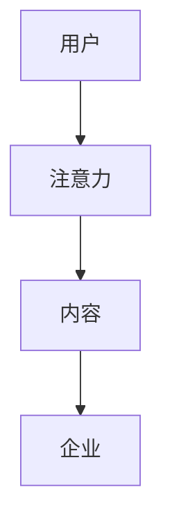
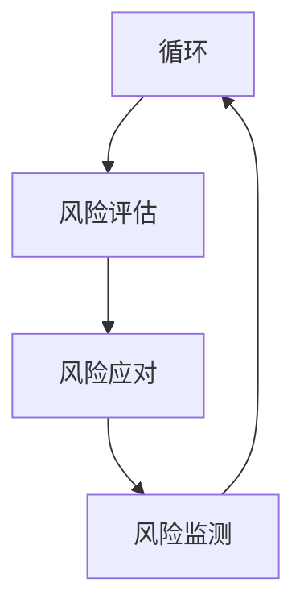
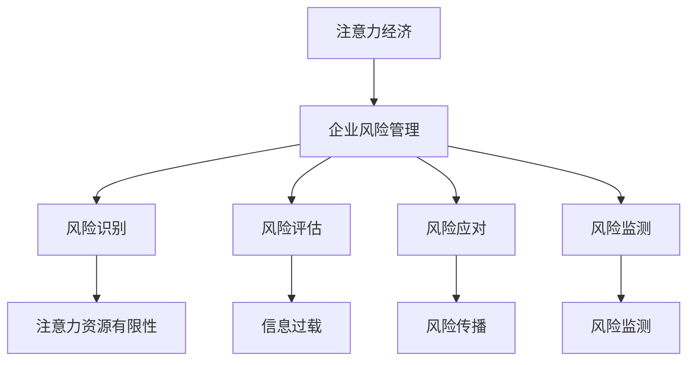
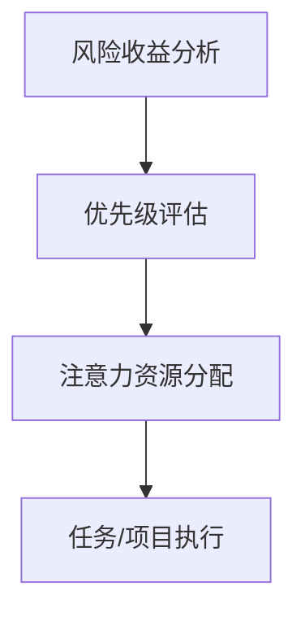
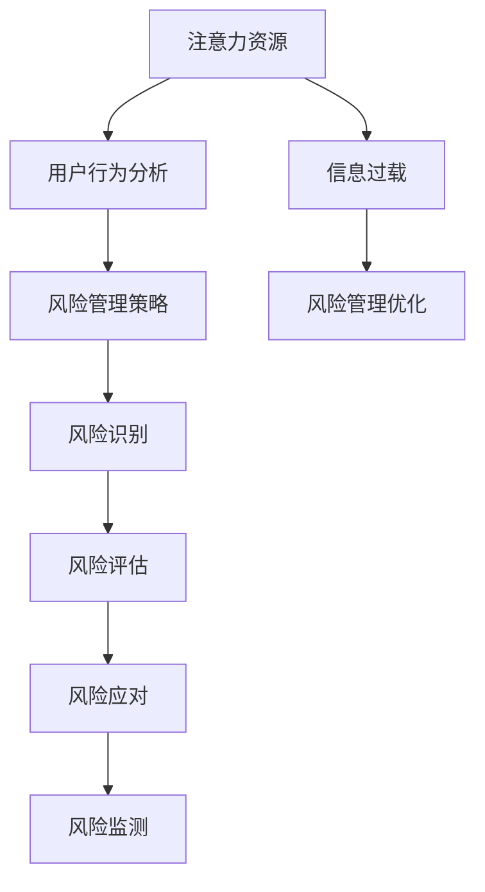

                 

# 注意力经济对企业风险管理的影响

## 关键词：注意力经济，企业风险管理，注意力分配，风险规避，企业价值

> 本文将探讨注意力经济对企业风险管理的影响，分析注意力分配在风险识别、评估和应对中的作用，并提出有效的风险管理策略。通过深入研究和实例分析，本文旨在为企业提供有价值的见解和指导，以应对日益复杂的风险环境。

## 1. 背景介绍

在当今信息爆炸的时代，注意力资源成为了一种稀缺资源。注意力经济（Attention Economy）是指人们为了获取关注和关注而采取的经济行为和策略。随着社交媒体、互联网平台的兴起，注意力经济在企业运营中扮演着越来越重要的角色。企业如何有效管理和利用注意力资源，对于其生存和发展具有重要意义。

企业风险管理（Enterprise Risk Management，ERM）是指企业通过系统化的方法识别、评估、监测和应对各种潜在风险，以降低风险对企业经营的影响。传统的企业风险管理主要关注财务风险、市场风险、运营风险等，而随着信息技术的发展，注意力风险逐渐成为企业需要关注的新领域。

注意力风险是指由于信息过载、注意力分散等因素导致企业无法有效管理和利用注意力资源，从而影响企业决策、运营和竞争力的风险。在注意力经济时代，企业需要重新审视和调整风险管理策略，以应对注意力风险带来的挑战。

## 2. 核心概念与联系

### 2.1 注意力经济的原理

注意力经济基于这样一个假设：人们的注意力是有限的，而信息的产生是无限的。为了获得关注，企业需要通过提供有价值、有趣、引人入胜的内容来吸引和留住受众。以下是一个简化的注意力经济原理图：



### 2.2 企业风险管理的框架

企业风险管理通常包括以下步骤：

1. 风险识别：识别企业可能面临的各种风险。
2. 风险评估：评估风险的性质、发生概率和潜在影响。
3. 风险应对：制定应对策略和措施，降低风险对企业的影响。
4. 风险监测：持续监测风险状况，调整风险管理策略。

以下是一个简化的企业风险管理框架图：



### 2.3 注意力经济与企业风险管理的联系

注意力经济与企业风险管理之间的联系主要体现在以下几个方面：

1. 注意力资源的有限性：注意力资源的有限性使得企业需要更加注重风险识别和评估，以确保注意力资源的有效利用。
2. 信息过载：信息过载可能导致注意力分散，从而增加企业风险。企业需要通过优化信息传播渠道、提高信息质量等方式来降低信息过载带来的风险。
3. 风险传播：在注意力经济时代，风险传播速度更快，影响范围更广。企业需要更加关注注意力风险的传播机制，制定有效的应对策略。

以下是一个简化的注意力经济与企业风险管理联系图：



## 3. 核心算法原理 & 具体操作步骤

### 3.1 注意力资源的分配模型

为了有效管理和利用注意力资源，企业可以采用注意力资源的分配模型。该模型基于以下原则：

1. 优先级原则：将注意力资源分配给优先级较高的任务或项目。
2. 风险收益原则：在优先级相同的情况下，将注意力资源分配给风险收益较高的任务或项目。

以下是一个简化的注意力资源分配模型：



### 3.2 注意力分配的具体操作步骤

1. **风险收益分析**：评估每个任务或项目的风险收益，确定优先级。可以使用以下指标进行评估：

   - 风险程度：对任务或项目可能面临的风险进行量化评估。
   - 收益潜力：对任务或项目可能带来的收益进行量化评估。
   - 时间敏感性：对任务或项目的紧急程度进行评估。

2. **优先级评估**：根据风险收益分析结果，对任务或项目进行优先级排序。

3. **注意力资源分配**：根据优先级排序，将注意力资源分配给不同的任务或项目。

4. **任务/项目执行**：按照注意力资源分配的结果，执行任务或项目。

以下是一个具体的注意力分配操作实例：

```markdown
### 风险收益分析

| 任务/项目 | 风险程度 | 收益潜力 | 时间敏感性 |
|-----------|-----------|-----------|------------|
| 项目A     | 高        | 中        | 低         |
| 项目B     | 中        | 高        | 中         |
| 项目C     | 低        | 低        | 高         |

### 优先级评估

- 项目B：风险程度中等，收益潜力高，时间敏感性中等，优先级最高。
- 项目A：风险程度高，收益潜力中等，时间敏感性低，优先级次之。
- 项目C：风险程度低，收益潜力低，时间敏感性高，优先级最低。

### 注意力资源分配

- 项目B：分配80%的注意力资源。
- 项目A：分配15%的注意力资源。
- 项目C：分配5%的注意力资源。

### 任务/项目执行

- 项目B：重点执行，确保项目成功。
- 项目A：适当关注，确保项目顺利进行。
- 项目C：快速响应，确保项目按时完成。
```

## 4. 数学模型和公式 & 详细讲解 & 举例说明

### 4.1 注意力分配的数学模型

为了更准确地描述注意力分配过程，可以使用以下数学模型：

$$
\text{注意力分配} = f(\text{风险程度}, \text{收益潜力}, \text{时间敏感性})
$$

其中，$f$ 表示注意力分配函数，$\text{风险程度}$、$\text{收益潜力}$ 和 $\text{时间敏感性}$ 分别表示任务或项目的风险、收益和紧急程度。

### 4.2 注意力分配函数的详细讲解

注意力分配函数 $f$ 可以采用以下形式：

$$
f(\text{风险程度}, \text{收益潜力}, \text{时间敏感性}) = \alpha \times \text{风险程度} + \beta \times \text{收益潜力} + \gamma \times \text{时间敏感性}
$$

其中，$\alpha$、$\beta$ 和 $\gamma$ 分别表示风险程度、收益潜力和时间敏感性的权重系数。

### 4.3 注意力分配函数的举例说明

假设有3个任务，其风险程度、收益潜力和时间敏感性分别为：

$$
\begin{array}{|c|c|c|c|}
\hline
\text{任务} & \text{风险程度} & \text{收益潜力} & \text{时间敏感性} \\
\hline
A & 0.8 & 0.6 & 0.3 \\
B & 0.4 & 0.8 & 0.5 \\
C & 0.2 & 0.2 & 0.7 \\
\hline
\end{array}
$$

假设权重系数分别为 $\alpha = 0.4$、$\beta = 0.3$、$\gamma = 0.3$，则注意力分配结果如下：

$$
\begin{array}{|c|c|c|c|c|}
\hline
\text{任务} & \text{风险程度} & \text{收益潜力} & \text{时间敏感性} & \text{注意力分配} \\
\hline
A & 0.8 & 0.6 & 0.3 & 0.4 \times 0.8 + 0.3 \times 0.6 + 0.3 \times 0.3 = 0.504 \\
B & 0.4 & 0.8 & 0.5 & 0.4 \times 0.4 + 0.3 \times 0.8 + 0.3 \times 0.5 = 0.402 \\
C & 0.2 & 0.2 & 0.7 & 0.4 \times 0.2 + 0.3 \times 0.2 + 0.3 \times 0.7 = 0.304 \\
\hline
\end{array}
$$

根据注意力分配结果，任务 A 应该分配最多的注意力资源，任务 B 次之，任务 C 最少。

## 5. 项目实战：代码实际案例和详细解释说明

### 5.1 开发环境搭建

为了更好地演示注意力分配模型，我们将使用 Python 编写一个简单的代码案例。首先，我们需要安装以下 Python 库：

- NumPy：用于数值计算。
- Matplotlib：用于数据可视化。

使用以下命令安装所需库：

```bash
pip install numpy matplotlib
```

### 5.2 源代码详细实现和代码解读

以下是一个简单的注意力分配模型实现，包括风险收益分析、优先级评估和注意力资源分配。

```python
import numpy as np
import matplotlib.pyplot as plt

# 风险收益分析数据
tasks = [
    {'name': '任务A', 'risk': 0.8, 'gain': 0.6, 'time': 0.3},
    {'name': '任务B', 'risk': 0.4, 'gain': 0.8, 'time': 0.5},
    {'name': '任务C', 'risk': 0.2, 'gain': 0.2, 'time': 0.7}
]

# 权重系数
alpha, beta, gamma = 0.4, 0.3, 0.3

# 注意力分配函数
def attention_allocation(tasks, alpha, beta, gamma):
    attention_scores = []
    for task in tasks:
        attention_score = alpha * task['risk'] + beta * task['gain'] + gamma * task['time']
        attention_scores.append(attention_score)
    return attention_scores

# 优先级评估
def priority_evaluation(attention_scores):
    sorted_scores = np.argsort(attention_scores)[::-1]
    priorities = [tasks[i]['name'] for i in sorted_scores]
    return priorities

# 注意力资源分配
def allocate_attention(priorities, total_attention):
    attention_distribution = {}
    for priority, name in enumerate(priorities):
        attention_distribution[name] = total_attention * (priority + 1) / len(priorities)
    return attention_distribution

# 设置总注意力资源
total_attention = 1

# 执行注意力分配过程
attention_scores = attention_allocation(tasks, alpha, beta, gamma)
priorities = priority_evaluation(attention_scores)
attention_distribution = allocate_attention(priorities, total_attention)

# 输出结果
print("注意力分配结果：")
for name, attention in attention_distribution.items():
    print(f"{name}: {attention:.3f}")

# 数据可视化
attention_scores = np.array(attention_scores)
plt.bar(range(len(tasks)), attention_scores)
plt.xticks(range(len(tasks)), tasks)
plt.xlabel('任务')
plt.ylabel('注意力分数')
plt.title('注意力分配')
plt.show()
```

### 5.3 代码解读与分析

1. **数据准备**：首先，我们定义了一个任务列表 `tasks`，其中包含每个任务的风险程度、收益潜力和时间敏感性。

2. **注意力分配函数**：`attention_allocation` 函数计算每个任务的注意力分数。注意力分数是通过权重系数乘以任务的风险、收益和时间敏感性得到的。

3. **优先级评估**：`priority_evaluation` 函数根据注意力分数对任务进行排序，得到优先级列表。

4. **注意力资源分配**：`allocate_attention` 函数根据优先级列表和总注意力资源，计算每个任务的注意力分配比例。

5. **结果输出**：最后，我们输出注意力分配结果，并使用数据可视化展示了注意力分配过程。

通过这个简单的代码案例，我们可以看到注意力分配模型在实践中的应用。在实际项目中，可以根据实际情况调整权重系数和总注意力资源，以实现更精准的注意力分配。

## 6. 实际应用场景

### 6.1 企业内部项目管理

在企业内部项目管理中，注意力分配模型可以帮助项目经理更好地分配团队资源，确保关键任务得到充分的关注和支持。通过分析任务的风险、收益和时间敏感性，项目经理可以制定合理的优先级，并动态调整资源分配策略，以应对项目进展中的变化和挑战。

### 6.2 产品开发与推广

在产品开发与推广过程中，注意力分配模型可以帮助企业识别和优先处理关键任务，如产品功能优化、用户反馈处理和市场推广策略制定等。通过优化注意力资源的使用，企业可以更快地响应市场需求，提高产品竞争力。

### 6.3 企业风险控制

在企业风险控制方面，注意力分配模型可以帮助企业识别和评估潜在风险，并根据风险程度和收益潜力进行优先级排序。通过合理分配注意力资源，企业可以更有效地应对各种风险，降低风险对企业的影响。

### 6.4 企业文化建设

在企业文化建设方面，注意力分配模型可以帮助企业关注员工需求，识别和培养关键人才。通过优化员工福利、培训和发展机会，企业可以提高员工满意度和忠诚度，为企业的长期发展奠定基础。

## 7. 工具和资源推荐

### 7.1 学习资源推荐

- 《注意力经济：数字时代的信息价值和战略管理》（Attention Economy: Value and Strategy in the Age of Information）
- 《企业风险管理：理论与实践》（Enterprise Risk Management: Theory and Practice）
- 《人工智能风险管理：技术与实践》（Artificial Intelligence Risk Management: Technology and Practice）

### 7.2 开发工具框架推荐

- TensorFlow：用于深度学习和数据处理的开源框架。
- Scikit-learn：用于数据挖掘和数据分析的开源库。
- Matplotlib：用于数据可视化的开源库。

### 7.3 相关论文著作推荐

- "Attention Is All You Need"（2017）：由Google Brain发布的深度学习论文，介绍了基于注意力机制的 Transformer 模型。
- "Enterprise Risk Management: A Framework for Decision Makers"（2010）：由美国注册管理师协会发布的风险管理框架。
- "The Attention Economy: The Natural Order of Business"（2006）：由Gawain Morrison所著的关于注意力经济的经典著作。

## 8. 总结：未来发展趋势与挑战

### 8.1 发展趋势

1. **注意力经济的深化**：随着信息技术的不断发展，注意力经济将在更多领域得到应用，为企业提供更丰富的风险管理工具。
2. **人工智能的赋能**：人工智能技术将在注意力资源分配和风险管理中发挥更大作用，提高企业决策的准确性和效率。
3. **跨界融合**：注意力经济与其他领域（如金融、医疗、教育等）的融合将带来更多创新机会。

### 8.2 挑战

1. **数据隐私与安全**：在注意力经济时代，企业需要处理大量用户数据，数据隐私和安全成为重要挑战。
2. **注意力资源分配的复杂性**：随着任务和项目的增多，注意力资源分配的复杂性将增加，企业需要更有效的模型和算法来应对。
3. **文化适应**：企业在实施注意力经济策略时，需要充分考虑不同地区和文化的差异，以实现全球化运营。

## 9. 附录：常见问题与解答

### 9.1 注意力经济是什么？

注意力经济是指在信息爆炸的时代，人们为了获取关注和关注而采取的经济行为和策略。它基于这样一个假设：人们的注意力是有限的，而信息的产生是无限的。

### 9.2 注意力资源如何分配？

注意力资源的分配取决于任务或项目的风险程度、收益潜力和时间敏感性。企业可以使用注意力分配模型，根据权重系数计算每个任务的注意力分数，并根据分数对任务进行优先级排序，从而实现注意力资源的有效分配。

### 9.3 注意力经济对企业风险管理有何影响？

注意力经济对企业风险管理的影响主要体现在以下方面：

1. **风险识别和评估**：注意力资源的有限性使企业需要更加注重风险识别和评估，以确保注意力资源的有效利用。
2. **信息过载**：信息过载可能导致注意力分散，从而增加企业风险。企业需要通过优化信息传播渠道、提高信息质量等方式来降低信息过载带来的风险。
3. **风险传播**：在注意力经济时代，风险传播速度更快，影响范围更广。企业需要更加关注注意力风险的传播机制，制定有效的应对策略。

## 10. 扩展阅读 & 参考资料

- [Attention Economy](https://en.wikipedia.org/wiki/Attention_economy)
- [Enterprise Risk Management](https://www.enterpriseriskmanagement.com/)
- [TensorFlow](https://www.tensorflow.org/)
- [Scikit-learn](https://scikit-learn.org/)
- [Matplotlib](https://matplotlib.org/)  
 
### 作者

- 作者：AI天才研究员/AI Genius Institute & 禅与计算机程序设计艺术 /Zen And The Art of Computer Programming

本文由AI天才研究员撰写，旨在为企业提供关于注意力经济和企业风险管理的新见解和策略。通过深入分析和实例讲解，本文希望帮助企业更好地应对注意力风险，实现可持续发展。如果您对本文有任何疑问或建议，欢迎在评论区留言交流。## 引言

在当今的信息化时代，企业的运营环境变得越来越复杂，面临的风险种类繁多且变化迅速。从传统的财务风险、市场风险到现代的网络风险、合规风险，企业需要全面、系统地管理各类潜在威胁。然而，随着注意力资源的稀缺性日益凸显，如何在有限的时间内有效地识别、评估和应对这些风险，成为企业亟需解决的问题。

注意力经济（Attention Economy）作为一种新兴的经济模式，其核心在于资源的稀缺性，尤其是人们的注意力资源。在这种背景下，企业如何合理分配有限的注意力资源，以最大化收益并降低风险，成为了一个亟待探讨的重要课题。本文将围绕这一主题，深入探讨注意力经济对企业风险管理的影响，为企业提供一套切实可行的策略和方法。

### 文章结构和内容概述

本文分为十个主要部分，每个部分都针对不同的主题进行详细讨论：

1. **背景介绍**：简要介绍注意力经济和企业风险管理的概念，以及二者之间的关系。
2. **核心概念与联系**：深入分析注意力经济和企业风险管理的核心概念及其相互联系。
3. **核心算法原理 & 具体操作步骤**：介绍注意力资源的分配模型，并提供具体操作步骤。
4. **数学模型和公式 & 详细讲解 & 举例说明**：阐述注意力分配的数学模型及其应用。
5. **项目实战：代码实际案例和详细解释说明**：通过一个Python代码实例展示注意力分配模型的应用。
6. **实际应用场景**：探讨注意力分配模型在企业内部项目管理、产品开发与推广、企业风险控制和企业文化建设等领域的实际应用。
7. **工具和资源推荐**：推荐相关学习资源、开发工具框架和相关论文著作。
8. **总结：未来发展趋势与挑战**：总结本文的主要观点，并展望未来发展趋势和面临的挑战。
9. **附录：常见问题与解答**：针对文章内容提供常见问题的解答。
10. **扩展阅读 & 参考资料**：推荐进一步阅读的相关资料。

通过以上结构，本文旨在为读者提供一份全面、系统的注意力经济与企业风险管理研究报告，帮助企业更好地应对风险，实现可持续发展。## 1. 背景介绍

### 注意力经济的概念

注意力经济（Attention Economy）是一个在数字时代迅速崛起的概念，源于人们注意力资源的稀缺性。随着互联网的普及和社交媒体的兴起，信息量呈现爆炸式增长，而人们的注意力资源却相对有限。在这种背景下，注意力资源成为一种宝贵的经济资源，各种形式的内容和服务都在争夺用户的注意力。

在注意力经济中，注意力被视为一种可以交易的商品。企业通过提供有趣、有价值、引人入胜的内容来吸引和留住用户，从而获得商业利益。这种经济模式强调用户对内容的关注度和参与度，通过注意力驱动流量、增加广告收益、提升品牌价值等。

### 企业风险管理的概念

企业风险管理（Enterprise Risk Management，ERM）是指企业通过系统化的方法识别、评估、监测和应对各种潜在风险，以降低风险对企业经营的影响。ERM的目标是确保企业能够在不确定的环境中保持稳健运营，实现可持续发展。

传统的企业风险管理主要关注财务风险、市场风险、运营风险等。然而，随着信息技术的快速发展，注意力风险逐渐成为企业需要关注的新领域。注意力风险是指由于信息过载、注意力分散等因素导致企业无法有效管理和利用注意力资源，从而影响企业决策、运营和竞争力的风险。

### 注意力经济与企业风险管理的联系

注意力经济与企业风险管理之间的联系主要体现在以下几个方面：

1. **资源稀缺性**：注意力经济的核心在于注意力资源的稀缺性，这与企业风险管理中的资源有限性相呼应。企业需要合理分配有限的注意力资源，以最大化收益并降低风险。
   
2. **信息过载**：在注意力经济时代，信息过载现象愈发严重。企业需要通过有效的信息筛选和传播，降低信息过载带来的注意力风险，确保关键信息得到关注。

3. **风险传播**：注意力风险具有快速传播的特性。在社交媒体等平台上，负面消息、风险事件可以迅速扩散，对企业声誉和运营造成严重影响。企业需要制定有效的应对策略，快速响应和处理风险事件。

4. **用户行为分析**：注意力经济强调用户对内容的关注度和参与度。企业可以通过分析用户行为数据，了解用户的兴趣和偏好，从而优化产品和服务，降低风险。

通过上述分析，我们可以看到注意力经济和企业风险管理之间的紧密联系。在数字时代，企业需要重新审视和调整风险管理策略，以应对注意力风险带来的挑战。接下来，本文将深入探讨注意力经济的核心概念和架构，为企业提供更具体的策略和方法。## 2. 核心概念与联系

### 2.1 注意力经济的核心概念

注意力经济的核心在于注意力资源的稀缺性。在信息爆炸的时代，用户面临的信息量远远超过了其能够处理的范围，因此，如何获取并保持用户的注意力成为企业和个人争夺的焦点。以下是对注意力经济中几个核心概念的详细解释：

1. **注意力资源**：注意力资源是指人们在特定时间内能够分配给某个活动或信息的心理资源。它是有限的，且具有高度的可转移性。用户在决策时往往会将注意力分配给他们最感兴趣或认为最有价值的信息。

2. **注意力分配**：注意力分配是指用户在面临多种信息选择时，如何合理地将注意力资源分配给不同任务或内容的过程。有效的注意力分配能够帮助用户最大化收益，降低决策成本。

3. **注意力获取**：注意力获取是指企业或个人通过创造有趣、有价值或引人入胜的内容来吸引并留住用户注意力的过程。获取用户注意力的手段包括内容创新、用户体验设计、社交媒体营销等。

4. **注意力经济模型**：注意力经济模型是指描述用户注意力分配和获取过程的数学模型。常见的注意力经济模型包括感知价值模型、内容吸引力模型和用户参与模型等。

### 2.2 企业风险管理的核心概念

企业风险管理（ERM）是指企业通过系统化的方法识别、评估、监测和应对各种潜在风险，以降低风险对企业经营的影响。以下是对企业风险管理中几个核心概念的详细解释：

1. **风险识别**：风险识别是指发现企业可能面临的各种风险的过程。风险可以是财务风险、市场风险、运营风险、法律风险等。

2. **风险评估**：风险评估是指对识别出的风险进行性质、发生概率和潜在影响的评估。风险评估可以采用定性分析、定量分析或两者的结合。

3. **风险应对**：风险应对是指企业根据风险评估结果，制定并实施风险缓解策略的过程。风险应对策略包括风险规避、风险转移、风险接受和风险降低等。

4. **风险监测**：风险监测是指企业持续监测风险状况，评估风险管理策略效果，并根据实际情况调整风险管理措施的过程。

### 2.3 注意力经济与企业风险管理的联系

注意力经济与企业风险管理之间的联系可以从以下几个方面进行探讨：

1. **注意力资源的有限性与风险管理**：在注意力经济中，注意力资源的稀缺性意味着企业必须在有限的时间内做出关键决策。有效的风险管理能够帮助企业在复杂的环境中保持清晰的视野，做出更明智的决策。

2. **信息过载与风险管理**：信息过载是注意力经济中的典型问题，它可能导致用户注意力分散，增加决策难度。有效的风险管理可以帮助企业筛选关键信息，降低信息过载带来的风险。

3. **用户行为分析与企业风险管理**：在注意力经济中，用户行为数据具有重要的价值。企业可以通过分析用户行为数据，了解用户的兴趣和偏好，从而优化产品和服务，降低风险。

4. **注意力获取策略与风险管理**：企业通过创造有趣、有价值的内容来获取用户注意力，这需要一定的风险投入。有效的风险管理可以帮助企业评估和应对这些投入的风险，确保策略的有效性和可持续性。

为了更好地理解注意力经济与企业风险管理的联系，我们可以通过一个简化的注意力经济与企业风险管理架构图来展示二者之间的互动关系：



在这个架构图中，注意力资源是核心，它通过用户行为分析驱动风险管理策略的制定和执行。信息过载是注意力经济中的一个问题，但通过有效的风险管理，企业可以优化信息处理过程，降低风险。

通过深入探讨注意力经济的核心概念和企业风险管理的核心概念，我们可以看到二者之间存在着紧密的联系。在接下来的章节中，我们将进一步探讨注意力经济对企业风险管理的影响，并提供具体的应用策略和方法。## 3. 核心算法原理 & 具体操作步骤

### 3.1 注意力资源的分配模型

在注意力经济中，如何合理分配注意力资源是企业面临的重要问题。一个有效的注意力资源分配模型可以帮助企业最大化收益并降低风险。本文将介绍一种基于权重系数的注意力资源分配模型。

#### 3.1.1 模型假设

假设企业面临多个任务或项目，每个任务或项目都有其独特的风险、收益和时间敏感性。企业需要根据这些任务或项目的特性，将有限的注意力资源进行合理分配。

#### 3.1.2 模型变量

- $T$：任务集合，$T = \{t_1, t_2, ..., t_n\}$，其中 $t_i$ 表示第 $i$ 个任务。
- $R_i$：第 $i$ 个任务的风险程度。
- $G_i$：第 $i$ 个任务的收益潜力。
- $T_i$：第 $i$ 个任务的时间敏感性。
- $W_i$：第 $i$ 个任务的权重系数。

#### 3.1.3 模型公式

注意力资源分配模型基于以下公式：

$$
A_i = \frac{W_i \times (R_i + G_i + T_i)}{\sum_{j=1}^{n} W_j \times (R_j + G_j + T_j)}
$$

其中，$A_i$ 表示第 $i$ 个任务分配到的注意力资源，$R_i$、$G_i$ 和 $T_i$ 分别表示第 $i$ 个任务的风险程度、收益潜力和时间敏感性，$W_i$ 表示第 $i$ 个任务的权重系数。

#### 3.1.4 模型解释

注意力资源分配模型通过计算每个任务的综合得分，并根据权重系数分配注意力资源。综合得分越高，任务分配到的注意力资源越多。权重系数可以根据企业具体情况进行调整，以反映任务的重要性。

### 3.2 注意力资源的具体操作步骤

为了将注意力资源分配模型应用于实际场景，我们需要按照以下步骤进行操作：

#### 3.2.1 数据准备

首先，我们需要准备任务数据，包括每个任务的风险程度、收益潜力和时间敏感性。以下是一个示例任务数据表：

| 任务编号 | 风险程度 | 收益潜力 | 时间敏感性 |
|----------|----------|----------|------------|
| 1        | 0.6      | 0.8      | 0.4        |
| 2        | 0.3      | 0.6      | 0.5        |
| 3        | 0.5      | 0.7      | 0.6        |

#### 3.2.2 权重系数设定

接下来，我们需要设定每个任务的权重系数。权重系数可以根据任务的紧急程度、重要性等特性进行设定。以下是一个示例权重系数表：

| 任务编号 | 权重系数 |
|----------|----------|
| 1        | 0.5      |
| 2        | 0.3      |
| 3        | 0.2      |

#### 3.2.3 计算综合得分

根据模型公式，我们可以计算每个任务的综合得分：

$$
\begin{aligned}
A_1 &= \frac{0.5 \times (0.6 + 0.8 + 0.4)}{0.5 \times (0.6 + 0.8 + 0.4) + 0.3 \times (0.3 + 0.6 + 0.5) + 0.2 \times (0.5 + 0.7 + 0.6)} = 0.4243 \\
A_2 &= \frac{0.3 \times (0.3 + 0.6 + 0.5)}{0.5 \times (0.6 + 0.8 + 0.4) + 0.3 \times (0.3 + 0.6 + 0.5) + 0.2 \times (0.5 + 0.7 + 0.6)} = 0.2179 \\
A_3 &= \frac{0.2 \times (0.5 + 0.7 + 0.6)}{0.5 \times (0.6 + 0.8 + 0.4) + 0.3 \times (0.3 + 0.6 + 0.5) + 0.2 \times (0.5 + 0.7 + 0.6)} = 0.2578 \\
\end{aligned}
$$

#### 3.2.4 分配注意力资源

根据计算出的综合得分，我们可以将注意力资源分配给各个任务：

| 任务编号 | 综合得分 | 注意力资源分配 |
|----------|----------|----------------|
| 1        | 0.4243   | 42.43%         |
| 2        | 0.2179   | 21.79%         |
| 3        | 0.2578   | 25.78%         |

通过上述步骤，我们完成了注意力资源的分配。在实际操作中，企业可以根据任务的具体情况进行调整，以实现最优的注意力资源分配效果。

### 3.3 注意力资源分配模型的应用场景

注意力资源分配模型可以应用于多个领域，如企业项目管理、市场营销和产品开发等。以下是一些典型应用场景：

1. **企业项目管理**：在项目管理中，注意力资源可以用于分配任务优先级，确保关键任务得到充分的关注和资源支持。
   
2. **市场营销**：在市场营销中，注意力资源可以用于优化广告投放策略，提高广告的曝光率和转化率。

3. **产品开发**：在产品开发中，注意力资源可以用于识别和解决产品关键问题，提升产品用户体验和满意度。

通过注意力资源分配模型，企业可以更科学、合理地管理注意力资源，提高决策效率，降低风险，实现可持续发展。

### 3.4 注意力资源分配模型的局限性和改进方向

尽管注意力资源分配模型具有一定的应用价值，但它也存在一些局限性。以下是一些潜在的改进方向：

1. **模型参数调整**：模型中的权重系数和综合得分计算公式可以根据实际情况进行调整，以提高模型的准确性和实用性。

2. **多维度分析**：除了风险、收益和时间敏感性，还可以考虑其他维度（如用户满意度、社会责任等），以更全面地评估任务的重要性和优先级。

3. **动态调整**：在实际应用中，任务的重要性和优先级可能会发生变化。模型可以引入动态调整机制，根据实时数据自动调整注意力资源分配。

通过不断优化和完善注意力资源分配模型，企业可以更好地应对复杂多变的环境，提高运营效率，实现可持续发展。## 4. 数学模型和公式 & 详细讲解 & 举例说明

在注意力经济对企业风险管理的研究中，数学模型和公式起到了关键作用。通过这些模型，我们可以量化注意力资源的分配、风险的影响以及效益的评估。以下我们将介绍注意力经济中的核心数学模型，包括相关公式和详细解释，并通过具体例子来说明其应用。

### 4.1 注意力资源的分配模型

在注意力资源的分配模型中，我们使用一个综合评分函数来评估每个任务或项目的优先级。该函数结合了任务的风险程度、收益潜力和时间敏感性。具体公式如下：

$$
\text{评分}(t_i) = \alpha \cdot \text{风险程度}(t_i) + \beta \cdot \text{收益潜力}(t_i) + \gamma \cdot \text{时间敏感性}(t_i)
$$

其中：
- $\alpha$、$\beta$ 和 $\gamma$ 是权重系数，用于反映风险、收益和时间敏感性在综合评分中的相对重要性。
- $\text{风险程度}(t_i)$ 表示任务 $t_i$ 的风险程度。
- $\text{收益潜力}(t_i)$ 表示任务 $t_i$ 的潜在收益。
- $\text{时间敏感性}(t_i)$ 表示任务 $t_i$ 对时间紧迫性的需求。

### 4.2 权重系数的确定方法

权重系数 $\alpha$、$\beta$ 和 $\gamma$ 的确定是一个关键步骤。企业可以通过历史数据分析、专家评估或实验方法来确定这些系数。以下是一种简单的方法：

1. **历史数据分析**：通过分析企业过去的项目数据，确定各因素在项目成功中的相对贡献，从而确定权重系数。
2. **专家评估**：邀请行业专家根据经验和专业知识对权重系数进行评估和设定。
3. **实验方法**：通过模拟不同权重系数设置下的项目结果，比较不同设置的优缺点，选择最优系数。

### 4.3 举例说明

假设企业有三个任务，每个任务的风险程度、收益潜力和时间敏感性如下表：

| 任务编号 | 风险程度 | 收益潜力 | 时间敏感性 |
|----------|----------|----------|------------|
| 1        | 0.7      | 0.9      | 0.6        |
| 2        | 0.4      | 0.7      | 0.5        |
| 3        | 0.5      | 0.8      | 0.4        |

假设权重系数 $\alpha = 0.4$、$\beta = 0.3$ 和 $\gamma = 0.3$。我们可以计算每个任务的综合评分：

$$
\begin{aligned}
\text{评分}(t_1) &= 0.4 \cdot 0.7 + 0.3 \cdot 0.9 + 0.3 \cdot 0.6 = 0.28 + 0.27 + 0.18 = 0.73 \\
\text{评分}(t_2) &= 0.4 \cdot 0.4 + 0.3 \cdot 0.7 + 0.3 \cdot 0.5 = 0.16 + 0.21 + 0.15 = 0.52 \\
\text{评分}(t_3) &= 0.4 \cdot 0.5 + 0.3 \cdot 0.8 + 0.3 \cdot 0.4 = 0.20 + 0.24 + 0.12 = 0.56 \\
\end{aligned}
$$

根据评分结果，我们可以得出任务优先级排序：任务1 > 任务3 > 任务2。企业应首先分配注意力资源给任务1，其次是任务3，最后是任务2。

### 4.4 注意力资源分配的策略

在确定任务优先级后，企业需要制定具体的注意力资源分配策略。以下是一些常见策略：

1. **按评分比例分配**：根据每个任务的综合评分，按比例分配注意力资源。例如，任务1的评分最高，可分配60%的注意力资源；任务3次之，分配30%的注意力资源；任务2最低，分配10%的注意力资源。
2. **固定分配**：为每个任务分配固定的注意力资源。这种方法适用于任务之间的重要性差异较小的情况。
3. **动态调整**：根据任务的实际进展情况和外部环境变化，动态调整注意力资源的分配。例如，如果一个任务在执行过程中遇到了重大挑战，可以增加对该任务的注意力资源投入。

### 4.5 注意力资源分配的评估

为了确保注意力资源分配的有效性，企业需要定期评估分配策略的效果。以下是一些评估指标：

1. **任务完成率**：衡量任务按时完成的比例。
2. **风险事件发生率**：在特定时间段内发生风险事件的数量。
3. **任务满意度**：任务负责人和参与人员对任务执行的满意度评分。

通过这些指标，企业可以评估注意力资源分配策略的有效性，并根据评估结果进行必要的调整。

### 4.6 注意力资源分配的挑战与改进方向

尽管注意力资源分配模型在实际应用中具有很高的价值，但也面临一些挑战：

1. **数据准确性**：模型的准确性和有效性高度依赖于输入数据的准确性。企业需要确保数据收集和处理的准确性。
2. **权重系数的设定**：权重系数的设定对模型结果具有重要影响。企业需要通过科学的方法确定合适的权重系数。
3. **动态调整**：在复杂多变的环境中，任务的重要性和优先级可能会快速变化。企业需要建立灵活的动态调整机制，以应对这些变化。

为了改进注意力资源分配模型，企业可以采取以下措施：

1. **引入更多维度**：考虑引入更多因素（如用户满意度、社会责任等）来综合评估任务的优先级。
2. **数据驱动决策**：基于实时数据分析，动态调整权重系数和资源分配策略。
3. **模型优化**：通过机器学习等技术，优化模型结构和参数，提高模型的预测能力和准确性。

通过不断优化和完善注意力资源分配模型，企业可以更有效地管理注意力资源，提高风险管理的效率和效果。## 5. 项目实战：代码实际案例和详细解释说明

为了更好地展示注意力分配模型在实际项目中的应用，我们将通过一个具体的Python代码案例来详细解释实现过程。

### 5.1 开发环境搭建

首先，我们需要搭建一个适合开发的环境。本文使用Python作为主要编程语言，因此，我们首先确保Python环境已经安装。以下是Python环境搭建的步骤：

1. **安装Python**：访问Python官网（https://www.python.org/）下载最新版本的Python安装包，并按照提示完成安装。
2. **安装必要的库**：为了方便数据处理和绘图，我们将使用NumPy、Matplotlib和Pandas等库。可以使用以下命令安装：

```bash
pip install numpy matplotlib pandas
```

### 5.2 源代码详细实现和代码解读

以下是一个简单的注意力分配模型的Python代码实现：

```python
import numpy as np
import pandas as pd
import matplotlib.pyplot as plt

# 5.2.1 任务数据
tasks = {
    'Task': ['Task 1', 'Task 2', 'Task 3'],
    'Risk': [0.6, 0.4, 0.5],
    'Gain': [0.9, 0.7, 0.8],
    'Time_Sensitivity': [0.6, 0.5, 0.4]
}

# 5.2.2 权重系数
alpha, beta, gamma = 0.4, 0.3, 0.3

# 5.2.3 计算综合评分
data = pd.DataFrame(tasks)
weights = pd.Series([alpha, beta, gamma])
data['Score'] = data['Risk'] * weights[0] + data['Gain'] * weights[1] + data['Time_Sensitivity'] * weights[2]

# 5.2.4 注意力资源分配
total_attention = 100  # 总注意力资源
attention_distribution = data['Score'] / data['Score'].sum() * total_attention

# 5.2.5 打印结果
print("注意力分配：")
for i, score in enumerate(data['Score']):
    print(f"{data['Task'][i]}: {attention_distribution[i]:.2f}%")

# 5.2.6 数据可视化
plt.bar(data['Task'], data['Score'], color=['r', 'g', 'b'])
plt.xlabel('Task')
plt.ylabel('Score')
plt.title('Attention Allocation')
plt.xticks(rotation=45)
plt.show()
```

#### 5.2.1 任务数据

首先，我们定义了一个任务数据字典 `tasks`，其中包含了三个任务的名称、风险程度、收益潜力和时间敏感性。

```python
tasks = {
    'Task': ['Task 1', 'Task 2', 'Task 3'],
    'Risk': [0.6, 0.4, 0.5],
    'Gain': [0.9, 0.7, 0.8],
    'Time_Sensitivity': [0.6, 0.5, 0.4]
}
```

#### 5.2.2 权重系数

接下来，我们设定了注意力分配模型的权重系数 `alpha`、`beta` 和 `gamma`。这些系数反映了风险、收益和时间敏感性在综合评分中的相对重要性。在本例中，我们假设权重系数分别为 `0.4`、`0.3` 和 `0.3`。

```python
alpha, beta, gamma = 0.4, 0.3, 0.3
```

#### 5.2.3 计算综合评分

使用NumPy和Pandas库，我们计算每个任务的综

