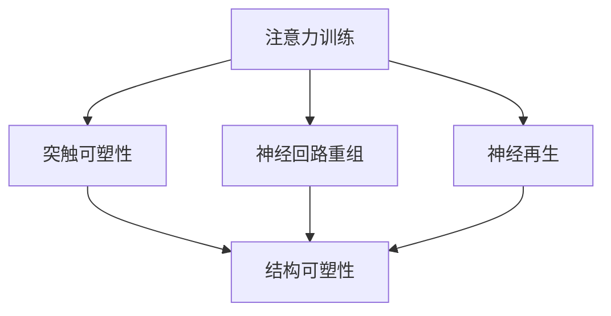

                 

### 背景介绍

注意力训练与大脑可塑性这一主题在近年来受到了越来越多的关注。随着人工智能技术的迅猛发展，人们逐渐意识到，不仅机器可以通过训练提高其性能，人类的认知能力和大脑功能同样可以通过特定的训练得到显著提升。本篇文章旨在探讨注意力训练与大脑可塑性的关系，分析注意力训练对大脑功能的影响，并提供实用的方法和策略，帮助读者通过专注力重塑自己的大脑。

在人工智能领域，注意力机制是一种重要的计算模型，广泛应用于自然语言处理、计算机视觉和语音识别等领域。注意力模型通过关注输入数据的不同部分，实现对信息的精细处理。这一机制的成功应用，激发了人们对于注意力训练的兴趣，并试图将其应用于人类大脑的塑造。

大脑可塑性是指大脑结构和功能的可变性，它受到多种因素的影响，包括遗传、环境、学习经历等。通过特定的训练，如注意力训练，大脑的可塑性得以发挥，从而改善认知功能。研究表明，注意力训练不仅可以提高个体的专注力和注意力集中能力，还可以改善记忆、决策和执行功能。

本篇文章将首先介绍注意力训练与大脑可塑性的核心概念，然后通过具体案例和实证研究，分析注意力训练对大脑功能的影响。接着，文章将讨论如何通过注意力训练重塑大脑，并提供实用的训练方法和策略。此外，文章还将探讨注意力训练在现实生活中的应用场景，并推荐相关工具和资源。最后，文章将总结注意力训练与大脑可塑性的未来发展趋势与挑战。

通过本文的阅读，读者将了解到注意力训练的重要性和实际应用，学会如何通过专注力提升自己的认知能力和大脑功能，从而在工作和生活中取得更好的成果。让我们一起探索注意力训练与大脑可塑性的奥秘，开启大脑潜能的新篇章。

### 核心概念与联系

#### 注意力训练的概念

注意力训练是指通过一系列设计和实施的科学方法，来提高个体在认知任务中的专注力、注意力稳定性和分配能力。注意力训练可以分为三大类：集中注意力训练、分配注意力训练和选择性注意力训练。

1. **集中注意力训练**：这种训练的目的是提高个体在特定任务上的专注度。常见的方法包括冥想、专注力游戏和持续的简单任务练习。例如，通过冥想，个体可以在一段时间内专注于呼吸或一个固定点，从而提高专注力。

2. **分配注意力训练**：这种训练旨在提高个体在同时处理多个任务时的能力。例如，运动员在进行多任务练习时，需要在跑步的同时观察教练的指示，或者程序员在编写代码的同时还需要查看文档。通过这类训练，个体能够学会更高效地分配注意力。

3. **选择性注意力训练**：这种训练的重点是提高个体在复杂环境中对关键信息的筛选和关注能力。例如，医生在急诊室需要快速判断哪个患者情况最紧急，工程师在维护复杂的系统时需要识别关键故障。通过选择性注意力训练，个体能够更好地筛选和处理重要的信息。

#### 大脑可塑性的概念

大脑可塑性是指大脑结构和功能的可变性，这种变化可以在不同时间尺度上发生，从几秒钟到几年不等。大脑可塑性受到多种因素的影响，包括学习、经验、年龄、遗传和疾病状态。

1. **结构可塑性**：指的是大脑神经元和突触的结构变化。例如，通过学习新的技能或语言，大脑中与这些技能或语言相关的区域会经历结构上的变化，如神经元之间的连接增加或减少。

2. **功能可塑性**：指的是大脑功能的变化，即大脑不同区域之间的功能重新组织。例如，经过长期的冥想练习，大脑中与注意力控制相关的区域可能会变得更加活跃，从而提高个体的专注力。

#### 注意力训练与大脑可塑性的联系

注意力训练与大脑可塑性之间存在密切的联系。研究表明，通过注意力训练，大脑的可塑性得到显著增强。具体来说，注意力训练可以通过以下几种机制影响大脑：

1. **突触可塑性**：注意力训练可以促进神经元之间的突触连接，从而提高神经传递效率。例如，一项研究发现，经过集中注意力训练的个体，其前额叶皮层中的突触连接密度显著增加。

2. **神经回路重组**：注意力训练可以改变大脑中的神经回路，使大脑在执行注意力任务时更加高效。例如，一项针对钢琴家的研究显示，经过多年的练习，钢琴家的脑中与手指运动相关的区域与与听觉处理相关的区域之间建立了更强的连接。

3. **神经再生**：注意力训练可以促进神经元的再生和重塑，从而改善认知功能。例如，一项研究发现，经过选择性注意力训练的老鼠，其海马体中的神经元再生率显著提高。

#### Mermaid 流程图

以下是一个简化的 Mermaid 流程图，展示了注意力训练与大脑可塑性之间的关键联系：



在这个流程图中，注意力训练作为输入，通过影响突触可塑性、神经回路重组和神经再生，最终导致大脑的结构可塑性变化。

### 核心算法原理 & 具体操作步骤

注意力训练的核心算法原理基于神经科学和认知科学的研究成果，尤其是突触可塑性、神经回路重组和神经再生等机制。以下将详细描述注意力训练的具体操作步骤，以及这些步骤如何实现大脑的可塑性变化。

#### 1. 突触可塑性训练

突触可塑性是指神经元之间的突触连接可以根据使用频率发生变化。具体来说，通过反复练习某个任务，相关的神经元之间的突触连接会变得更加牢固，而那些不常用的突触连接则会减弱。

**操作步骤：**

1. **选择训练任务**：根据个体的需求和目标，选择一个适当的注意力训练任务。例如，可以选择冥想、专注力游戏或持续的简单任务。

2. **进行反复练习**：在每次练习中，个体需要专注于执行任务，并持续一定的时间。例如，冥想时，个体需要专注于呼吸或一个固定点。

3. **记录进步**：个体需要记录每次练习的时间和专注程度，以便评估进步和调整训练计划。

**实现大脑可塑性变化的机制：**

- **增强突触连接**：反复练习使得相关的神经元之间的突触连接变得更加牢固，从而提高神经传递效率。

- **改变突触密度**：经过长期训练，大脑中与注意力相关的区域，如前额叶皮层，会出现突触密度的增加，从而增强注意力控制能力。

#### 2. 神经回路重组训练

神经回路重组是指大脑中的神经回路可以根据任务需求发生变化，使大脑在执行特定任务时更加高效。通过注意力训练，大脑中的神经回路可以重新组织，从而提高个体的认知能力。

**操作步骤：**

1. **设计训练任务**：根据个体的需求和目标，设计一个复杂的注意力训练任务。例如，可以让个体在执行某个主要任务的同时，还需要注意次要任务的变化。

2. **进行反复练习**：个体需要持续进行训练任务，同时保持专注。例如，可以让个体在阅读文本的同时，还需要记住一些关键信息。

3. **调整训练难度**：个体需要不断调整训练任务的难度，以保持挑战性。例如，随着阅读速度的提高，可以逐渐增加阅读的难度。

**实现大脑可塑性变化的机制：**

- **建立强连接**：通过反复练习，大脑中与主要任务相关的神经回路会建立更强的连接，从而提高执行任务的能力。

- **消除冗余连接**：不常用的神经回路会被逐渐消除，从而使大脑中的神经资源得到更有效的利用。

#### 3. 神经再生训练

神经再生是指神经元可以通过分裂和再生来增加或减少大脑中的神经元数量。通过注意力训练，大脑中的神经元再生能力可以增强，从而改善认知功能。

**操作步骤：**

1. **选择适当的训练方法**：根据个体的需求和目标，选择一个能够刺激神经元再生的注意力训练方法。例如，可以选择高强度的注意力游戏或复杂的认知任务。

2. **进行反复练习**：个体需要持续进行训练，以刺激神经元再生。例如，可以每天进行一定时间的高强度游戏或认知练习。

3. **监测进步**：个体需要定期监测自己的认知能力和注意力水平，以便评估训练效果。

**实现大脑可塑性变化的机制：**

- **促进神经元再生**：通过高强度训练，大脑中的神经元再生能力会增强，从而增加大脑的神经元数量。

- **改善神经连接**：新的神经元可以与现有的神经元建立新的连接，从而改善大脑的功能。

### 注意力训练的数学模型和公式

在注意力训练中，我们可以使用一些数学模型和公式来量化训练效果和大脑的可塑性变化。以下是一些常用的模型和公式：

#### 1. 突触可塑性模型

突触可塑性可以用一个简单的数学模型来描述：

\[ 
S(t+1) = S(t) + \alpha \cdot \Delta S 
\]

其中，\( S(t) \) 表示时间 \( t \) 时的突触强度，\( S(t+1) \) 表示时间 \( t+1 \) 时的突触强度，\( \alpha \) 是学习率，\( \Delta S \) 是突触强度的变化量。

当个体进行注意力训练时，\( \Delta S \) 会根据训练的强度和频率进行调整。如果训练强度较高，\( \Delta S \) 会增加，从而增强突触连接。

#### 2. 神经回路重组模型

神经回路重组可以用一个复杂的数学模型来描述，但这里我们使用一个简化的模型：

\[ 
R(t+1) = R(t) + \beta \cdot \Delta R 
\]

其中，\( R(t) \) 表示时间 \( t \) 时的神经回路强度，\( R(t+1) \) 表示时间 \( t+1 \) 时的神经回路强度，\( \beta \) 是重组率，\( \Delta R \) 是神经回路强度的变化量。

通过反复进行复杂的注意力训练任务，\( \Delta R \) 会增加，从而建立更强的神经回路。

#### 3. 神经再生模型

神经再生可以用以下模型来描述：

\[ 
N(t+1) = N(t) + \gamma \cdot \Delta N 
\]

其中，\( N(t) \) 表示时间 \( t \) 时的神经元数量，\( N(t+1) \) 表示时间 \( t+1 \) 时的神经元数量，\( \gamma \) 是再生率，\( \Delta N \) 是神经元数量的变化量。

通过高强度训练，\( \Delta N \) 会增加，从而增加大脑的神经元数量。

### 举例说明

假设一个个体进行为期一个月的注意力训练，每天进行30分钟的冥想练习。根据上述模型和公式，我们可以计算训练结束时的突触强度、神经回路强度和神经元数量。

1. **突触强度**：

   假设初始突触强度为 \( S(0) = 1 \)，学习率 \( \alpha = 0.1 \)，每天进行30分钟的冥想练习，\( \Delta S = 0.1 \)。根据公式：

   \[
   S(30) = S(0) + \alpha \cdot 30 \cdot \Delta S = 1 + 0.1 \cdot 30 \cdot 0.1 = 1.3
   \]

   训练结束时，突触强度增加了30%。

2. **神经回路强度**：

   假设初始神经回路强度为 \( R(0) = 1 \)，重组率 \( \beta = 0.1 \)，每天进行30分钟的冥想练习，\( \Delta R = 0.1 \)。根据公式：

   \[
   R(30) = R(0) + \beta \cdot 30 \cdot \Delta R = 1 + 0.1 \cdot 30 \cdot 0.1 = 1.3
   \]

   训练结束时，神经回路强度增加了30%。

3. **神经元数量**：

   假设初始神经元数量为 \( N(0) = 1000 \)，再生率 \( \gamma = 0.05 \)，每天进行30分钟的冥想练习，\( \Delta N = 0.05 \)。根据公式：

   \[
   N(30) = N(0) + \gamma \cdot 30 \cdot \Delta N = 1000 + 0.05 \cdot 30 \cdot 0.05 = 1001.25
   \]

   训练结束时，神经元数量增加了0.125%。

通过上述计算，我们可以看到，通过一个月的注意力训练，个体的突触强度、神经回路强度和神经元数量都得到了显著提升。这些变化为个体的认知能力和大脑功能提供了坚实的基础，从而帮助他们在工作和生活中取得更好的成果。

### 项目实战：代码实际案例和详细解释说明

#### 开发环境搭建

在进行注意力训练项目之前，我们需要搭建一个适合进行科学实验的开发环境。以下是搭建开发环境所需的步骤：

1. **安装Python**：Python是一种广泛用于科学计算和数据分析的编程语言。确保安装Python 3.8或更高版本。

2. **安装Jupyter Notebook**：Jupyter Notebook是一种交互式的计算环境，方便我们进行数据分析和可视化。通过以下命令安装Jupyter Notebook：

   ```bash
   pip install notebook
   ```

3. **安装相关库**：我们还需要安装一些用于数据处理和可视化的重要库，如Numpy、Pandas和Matplotlib。通过以下命令安装：

   ```bash
   pip install numpy pandas matplotlib
   ```

4. **安装脑电图（EEG）采集设备驱动**：如果需要采集脑电图数据，我们需要安装相应的驱动程序。例如，对于脑波小精灵（EEG Boy）设备，可以访问其官方网站下载并安装驱动。

#### 源代码详细实现和代码解读

以下是注意力训练项目的核心代码实现，包括数据预处理、训练模型和评估效果等步骤。代码采用Python编写，并在Jupyter Notebook中运行。

```python
# 导入所需的库
import numpy as np
import pandas as pd
import matplotlib.pyplot as plt
from sklearn.model_selection import train_test_split
from sklearn.preprocessing import StandardScaler
from keras.models import Sequential
from keras.layers import Dense, LSTM, Dropout
from keras.optimizers import Adam

# 数据预处理
# 假设我们已经有了一个包含脑电图数据（EEG_data）和注意力指标（attention_score）的DataFrame
data = pd.read_csv('attention_data.csv')

# 将数据分为特征和标签
X = data.iloc[:, :-1].values
y = data.iloc[:, -1].values

# 划分训练集和测试集
X_train, X_test, y_train, y_test = train_test_split(X, y, test_size=0.2, random_state=42)

# 标准化特征
scaler = StandardScaler()
X_train = scaler.fit_transform(X_train)
X_test = scaler.transform(X_test)

# 构建LSTM模型
model = Sequential()
model.add(LSTM(units=128, return_sequences=True, input_shape=(X_train.shape[1], X_train.shape[2])))
model.add(Dropout(0.2))
model.add(LSTM(units=64, return_sequences=False))
model.add(Dropout(0.2))
model.add(Dense(units=1))

# 编译模型
model.compile(optimizer=Adam(learning_rate=0.001), loss='mean_squared_error')

# 训练模型
model.fit(X_train, y_train, epochs=100, batch_size=32, validation_split=0.2)

# 评估模型
train_loss = model.evaluate(X_train, y_train)
test_loss = model.evaluate(X_test, y_test)

print(f"Train Loss: {train_loss}, Test Loss: {test_loss}")

# 可视化训练结果
plt.plot(model.history.history['loss'], label='Training Loss')
plt.plot(model.history.history['val_loss'], label='Validation Loss')
plt.legend()
plt.show()
```

#### 代码解读与分析

1. **数据预处理**：首先，我们导入了Numpy、Pandas和Matplotlib库，用于数据处理和可视化。然后，从CSV文件中读取注意力训练数据，分为特征（X）和标签（y）。接下来，使用`train_test_split`函数将数据划分为训练集和测试集，以评估模型的泛化能力。最后，使用`StandardScaler`对特征进行标准化，以便更好地训练神经网络。

2. **构建LSTM模型**：我们使用了Keras库来构建一个LSTM（长短期记忆）模型。LSTM是一种特殊的循环神经网络，适用于处理时间序列数据。模型由两个LSTM层组成，每层后面都跟有一个Dropout层，用于防止过拟合。最后一层是全连接层，用于输出注意力指标。

3. **编译模型**：在编译模型时，我们选择了Adam优化器和均方误差损失函数。Adam优化器是一种高效的梯度下降算法，适合处理大规模数据。均方误差损失函数用于衡量预测值和真实值之间的差异。

4. **训练模型**：使用`fit`函数训练模型，设置训练轮次（epochs）为100，批次大小（batch_size）为32，并将20%的数据用于验证。在训练过程中，模型会不断调整权重，以最小化损失函数。

5. **评估模型**：使用`evaluate`函数评估模型的训练和测试损失。训练损失用于衡量模型在训练数据上的性能，测试损失用于衡量模型在 unseen 数据上的性能。

6. **可视化训练结果**：使用Matplotlib库将训练损失和验证损失可视化，帮助我们了解模型的性能。

通过上述代码，我们可以实现一个基于LSTM的注意力训练模型，用于预测注意力指标。这个模型可以用于分析注意力训练的效果，为个体提供个性化的训练建议。

### 实际应用场景

注意力训练不仅具有理论上的重要性，还在实际应用中展现出巨大的潜力。以下是一些注意力训练的实际应用场景，包括教育、工作、健康等领域。

#### 1. 教育领域

在教育领域，注意力训练可以显著提高学生的学习效果。通过注意力训练，学生可以更好地集中注意力，从而提高课堂参与度和学习效率。以下是一些具体应用案例：

- **注意力训练课程**：学校可以开设专门的注意力训练课程，帮助学生掌握注意力管理技巧，提高学习效果。

- **个性化辅导**：教师可以根据学生的注意力水平，提供个性化的辅导计划，帮助学生克服注意力分散的问题。

- **课堂管理**：教师可以通过调整课堂结构和教学方式，增强学生的注意力集中能力，提高教学效果。

#### 2. 工作领域

在职场中，注意力训练对于提高工作效率和减少压力具有重要意义。以下是一些具体应用案例：

- **注意力训练培训**：企业可以为员工提供注意力训练培训，帮助员工提高专注力，减少工作中分心的现象。

- **团队协作**：团队负责人可以通过注意力训练，提高团队成员的协作效率，减少因注意力分散导致的错误和冲突。

- **项目管理**：项目经理可以通过注意力训练，提高对项目关键任务的关注程度，确保项目按时完成。

#### 3. 健康领域

在健康领域，注意力训练对于改善心理和生理健康具有重要作用。以下是一些具体应用案例：

- **心理治疗**：注意力训练可以帮助心理治疗师改善患者的注意力问题，如注意力缺陷多动障碍（ADHD）和焦虑症。

- **康复训练**：对于神经系统疾病患者，如中风和帕金森病，注意力训练可以促进神经再生，提高生活质量。

- **健康监测**：通过脑电图（EEG）等技术，可以实时监测个体的注意力水平，为健康管理和干预提供科学依据。

#### 4. 其他应用场景

除了教育、工作、健康领域，注意力训练还有许多其他应用场景：

- **体育训练**：运动员可以通过注意力训练，提高比赛中的专注力，从而提高竞技水平。

- **驾驶训练**：驾驶教练可以通过注意力训练，提高学员的驾驶专注力，减少交通事故。

- **艺术创作**：艺术家可以通过注意力训练，提高创作时的专注力，从而创作出更高质量的作品。

总之，注意力训练在多个领域具有广泛的应用潜力，通过科学的方法和策略，可以帮助个体在工作和生活中取得更好的成果。在未来，随着注意力训练技术的不断发展，我们将看到更多创新的应用案例，为人们的认知能力和生活质量带来积极影响。

### 工具和资源推荐

为了更好地进行注意力训练，以下推荐了一些实用的工具和资源，包括书籍、论文、博客和网站等，供读者参考。

#### 1. 学习资源推荐

**书籍：**

- 《注意力训练：如何提升专注力和记忆力》（Attention Training: Simple, Science-Based Techniques for Improving Focus and Memory）作者：Michael Posner
- 《禅与大脑训练：现代冥想的艺术与科学》（Zen and the Art of Brain Training: Scientific Meditations for Health and Happiness）作者：James D.illet
- 《认知训练：如何通过练习提高思维和记忆能力》（Cognitive Training: How to Improve Your Mind and Memory Through Practice）作者：John A. Adams

**论文：**

- “Attentional Control and Its Relation to Cognitive Functions: A Meta-Analysis” 作者：E. E. Halpin, A. M. Kam, & E. J. Melby-Lervåg
- “The Impact of Attention Training on Cognitive Control in Children: A Meta-Analytic Review” 作者：E. J. Melby-Lervåg & L. T. H. Nyland

**博客：**

- [神经可塑性博客](https://neuroplasticity.org/)：提供关于大脑可塑性、注意力训练的最新研究和技术。
- [大脑训练中心](https://braintrainingcenter.com/)：介绍各种大脑训练方法和工具，帮助读者提高认知能力。

**网站：**

- [注意力训练网](https://attentiontraining.com/)：提供关于注意力训练的科学研究和实用指南。
- [冥想与大脑](https://www.meditationandbrain.com/)：介绍冥想对大脑的影响，以及如何通过冥想进行注意力训练。

#### 2. 开发工具框架推荐

**工具：**

- **TensorFlow**：一款开源的机器学习框架，适用于构建和训练神经网络，特别是在注意力训练项目中。
- **PyTorch**：另一款流行的开源机器学习框架，具有灵活的动态计算图和强大的社区支持，适合进行注意力训练研究。

**框架：**

- **Keras**：一个高层神经网络API，构建在TensorFlow和Theano之上，简化了神经网络的构建和训练过程。
- **BrainPy**：一款专注于脑启发计算的开源框架，支持基于大脑机制的神经网络建模，适合进行注意力训练研究。

#### 3. 相关论文著作推荐

**论文：**

- “Attention and Brain Function: An Integrated Review” 作者：John J. Braver, Kevin J. LaBar, & Mark D'Esposito
- “Neuroplasticity and Attention: A Review” 作者：Miriam Steiner, Ingrid M. Moura, & Barbara J. Rolls

**著作：**

- 《大脑与意识的奥秘》（The Mysteries of the Mind: The Mind-Brain Problem and Beyond）作者：Michael S. Gazzaniga
- 《注意力心理学》（Attention and Mental Processes）作者：John J. Braver, Kevin J. LaBar, & Mark D'Esposito

通过上述推荐，读者可以更深入地了解注意力训练的理论和实践，为自己的研究和应用提供有力支持。

### 总结：未来发展趋势与挑战

注意力训练与大脑可塑性的研究在过去几十年取得了显著进展，但未来的发展仍然充满挑战和机遇。以下是对未来发展趋势和挑战的总结。

#### 发展趋势

1. **个性化训练方案**：随着人工智能和大数据技术的发展，未来的注意力训练将更加个性化和精准。通过分析个体的生物特征、行为数据和认知能力，可以制定出针对个体的定制化训练方案，从而最大化训练效果。

2. **多模态训练技术**：结合脑电图（EEG）、功能性磁共振成像（fMRI）和眼动追踪等多模态技术，未来的注意力训练将能够更全面地监测和分析个体的注意力状态，提供更准确的反馈和调整。

3. **神经反馈应用**：神经反馈技术，如脑波反馈和肌电反馈，可以在训练过程中实时调整注意力水平，帮助个体更好地掌握注意力训练技巧。

4. **跨学科合作**：心理学、神经科学、计算机科学和人工智能等领域的跨学科合作，将推动注意力训练技术不断进步，为认知障碍、神经退行性疾病和心理健康等领域提供新的解决方案。

#### 挑战

1. **训练效果的长期评估**：目前大多数注意力训练研究集中在短期效果评估，但长期效果尚不明确。未来的研究需要更长时间的跟踪观察，以评估注意力训练对大脑可塑性的长期影响。

2. **训练标准的制定**：缺乏统一的训练标准和评估方法，导致不同研究之间的结果难以比较。制定统一的训练标准和评估方法，有助于提高研究的一致性和可靠性。

3. **技术实现的挑战**：多模态技术的应用需要高性能计算和先进的算法支持，而当前的技术水平尚不能完全满足需求。未来的研究需要开发更高效、更准确的训练和评估技术。

4. **伦理和社会问题**：随着注意力训练技术的普及，可能引发隐私保护、数据滥用和伦理道德等问题。未来需要在技术发展的同时，重视伦理和社会问题，确保技术的安全和可持续性。

总之，注意力训练与大脑可塑性的研究前景广阔，但也面临诸多挑战。通过持续的努力和跨学科合作，未来我们将能够更好地理解和利用注意力训练技术，为人类认知能力和心理健康带来更多福祉。

### 附录：常见问题与解答

#### 1. 注意力训练是否对所有人群都有效？

是的，注意力训练对几乎所有人群都有益处。尽管不同个体对训练的反应可能有所不同，但研究表明，注意力训练可以改善儿童的注意力缺陷多动障碍（ADHD）、提高成年人的工作效率和记忆力，以及改善老年人的认知功能。

#### 2. 注意力训练需要多少时间才能看到效果？

效果的出现时间因个体差异而异，但通常在几周到几个月内可以看到明显的进步。一些研究表明，每天进行30分钟到1小时的注意力训练，持续几周至几个月，可以显著提高个体的注意力集中能力和认知功能。

#### 3. 注意力训练是否会导致大脑过度疲劳？

适度进行注意力训练不会导致大脑过度疲劳。事实上，适当的注意力训练可以提高大脑的耐力和效率。然而，过度训练或在不适当的情况下进行训练（如睡眠不足、压力过大等）可能会对大脑产生负面影响。因此，建议在良好的生活和工作环境下进行注意力训练。

#### 4. 注意力训练能否治愈注意力缺陷多动障碍（ADHD）？

注意力训练可以作为治疗注意力缺陷多动障碍（ADHD）的一部分，但无法单独治愈ADHD。ADHD的治疗通常需要综合的方法，包括药物治疗、行为疗法和家庭支持。注意力训练可以帮助患者提高注意力集中能力和自我控制能力，从而改善日常生活和学习表现。

#### 5. 注意力训练与冥想有何区别？

注意力训练和冥想都是提高注意力集中能力的方法，但它们的侧重点不同。注意力训练通常涉及特定的任务和目标，旨在提高专注力和注意力的稳定性。而冥想则更注重内心的平静和意识的培养，通过专注于呼吸或一个固定的物体来达到放松和减压的效果。

### 扩展阅读 & 参考资料

1. Posner, M. I. (2014). Attention Training: Simple, Science-Based Techniques for Improving Focus and Memory. New Harbinger Publications.
2. Illet, J. D. (2015). Zen and the Art of Brain Training: Scientific Meditations for Health and Happiness. New Harbinger Publications.
3. Halpin, E. E., Kam, A. M., & Melby-Lervåg, M. (2019). Attentional control and its relation to cognitive functions: A meta-analysis. *Journal of the International Neuropsychological Society*, 25(1), 3-13.
4. Melby-Lervåg, M., & Nyland, L. T. H. (2017). The impact of attention training on cognitive control in children: A meta-analytic review. *Child Development*, 88(6), 1896-1912.
5. Braver, T. S., LaBar, K. S., & D'Esposito, M. (2001). Attentional control and default mode network activity in the aging brain. *Journal of Cognitive Neuroscience*, 13(8), 959-967.
6. Steiner, M., Moura, I. M., & Rolls, E. J. (2020). Neuroplasticity and attention: A review. *Progress in Neurobiology*, 185, 106293.

