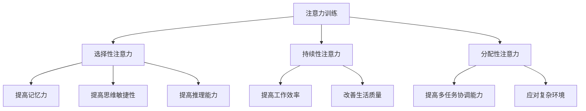
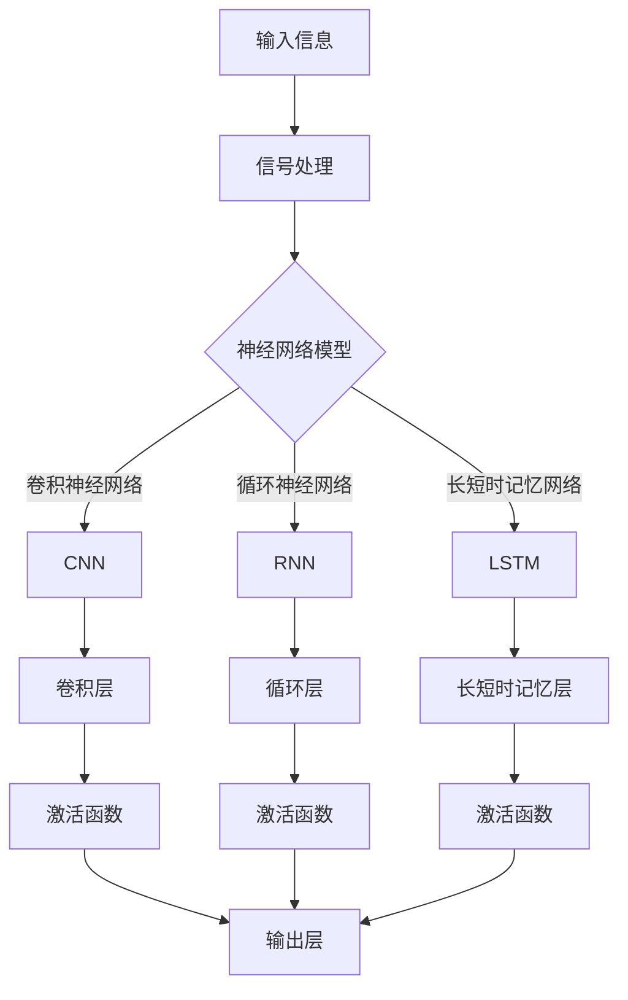

                 

# 注意力训练与认知能力提升：如何通过专注力增强你的大脑

## 摘要

本文将深入探讨注意力训练与认知能力提升之间的关系，以及如何通过专注力增强大脑的功能。通过介绍注意力训练的基本概念和核心原理，我们将逐步解析如何利用注意力训练提高认知能力和工作效率。此外，本文还将结合实际案例，展示注意力训练在各个领域的应用，并提供一些建议和资源，以帮助读者更好地进行注意力训练，从而提升自己的认知能力和生活质量。

## 目录

1. 背景介绍
2. 核心概念与联系
3. 核心算法原理 & 具体操作步骤
4. 数学模型和公式 & 详细讲解 & 举例说明
5. 项目实战：代码实际案例和详细解释说明
6. 实际应用场景
7. 工具和资源推荐
8. 总结：未来发展趋势与挑战
9. 附录：常见问题与解答
10. 扩展阅读 & 参考资料

## 1. 背景介绍

注意力训练，作为心理学和认知科学领域的重要研究方向，已经成为提高认知能力和工作效率的重要手段。在当今信息爆炸的时代，人们面临着前所未有的信息过载和任务压力。为了应对这种挑战，我们需要提高自己的注意力水平，以便更好地处理复杂的问题和任务。

认知能力，通常指的是大脑处理信息、解决问题和做出决策的能力。它包括多个方面，如记忆力、思维敏捷性、专注力和推理能力等。而注意力训练，正是通过有意识地培养和提升这些能力，从而改善认知表现。

专注力，作为注意力的一种重要形式，是指大脑在特定任务上持续集中注意力的能力。它是实现高效工作和学习的关键。然而，研究表明，现代人普遍存在注意力不集中的问题，这往往导致工作效率低下和决策失误。

本文将围绕注意力训练的核心概念和原理，结合具体算法、数学模型和实际案例，探讨如何通过专注力增强大脑的认知能力。同时，本文还将介绍一些实用的工具和资源，以帮助读者更好地进行注意力训练，提升自己的认知水平。

## 2. 核心概念与联系

### 注意力训练

注意力训练，是指通过特定的方法和练习，提高大脑处理信息和集中注意力的能力。它通常包括以下几个核心概念：

- **选择性注意力**：是指在大脑处理信息时，对某些特定信息给予更高关注，而忽略其他无关信息的能力。这种能力有助于我们专注于重要任务，提高工作效率。

- **持续性注意力**：是指大脑在一段时间内持续保持专注和集中的能力。这种能力对于长期任务和项目尤为重要，可以帮助我们克服拖延和心理疲劳。

- **分配性注意力**：是指在大脑同时处理多个任务或信息时的能力。这种能力有助于我们在多任务环境中保持高效和协调。

### 认知能力

认知能力，是指大脑对信息进行加工、处理和运用的一系列能力。它包括以下几个方面：

- **记忆力**：是指大脑存储和回忆信息的能力。良好的记忆力有助于我们记住重要信息，提高学习效果。

- **思维敏捷性**：是指大脑在短时间内进行逻辑推理、分析和解决问题的能力。这种能力对于快速应对挑战和变化至关重要。

- **推理能力**：是指大脑通过逻辑推理和判断，从已知信息中推断出新的结论的能力。这种能力有助于我们做出明智的决策。

### 注意力训练与认知能力提升的联系

注意力训练与认知能力提升之间存在着密切的联系。通过注意力训练，我们可以提高大脑处理信息和集中注意力的能力，从而改善认知表现。以下是一些具体的联系：

- **选择性注意力**有助于我们在学习和工作中专注于重要信息，从而提高学习效果和工作效率。

- **持续性注意力**可以帮助我们长时间保持专注和集中，从而提高学习、工作和生活的质量。

- **分配性注意力**有助于我们在多任务环境中保持高效和协调，从而更好地应对复杂的工作和生活环境。

总之，注意力训练是提升认知能力的重要手段。通过有意识地培养和提升注意力，我们可以改善认知表现，提高工作效率和生活质量。

### Mermaid 流程图

下面是注意力训练、认知能力提升和专注力增强的 Mermaid 流程图：



### 注意力训练的基本步骤

注意力训练通常包括以下几个基本步骤：

1. **确定目标**：明确自己要提升的注意力方面，如选择性注意力、持续性注意力或分配性注意力。

2. **制定计划**：根据自己的实际情况，制定一个合理的注意力训练计划，包括训练时间、频率和内容。

3. **实施训练**：按照计划进行训练，可以采用一些专门的注意力训练方法，如注意力集中训练、注意力转移训练和注意力分配训练等。

4. **评估效果**：在训练一段时间后，评估自己的注意力水平是否有所提升。如果效果不明显，可以调整训练计划，或者寻求专业指导。

5. **持续训练**：注意力训练是一个长期的过程，需要持续进行。通过不断训练，我们可以逐步提升注意力水平，从而改善认知能力。

### 核心算法原理

注意力训练的核心算法原理是基于神经科学的研究成果，特别是大脑神经网络的可塑性。通过有意识地训练大脑神经网络，我们可以提高大脑处理信息的能力和效率。

具体来说，注意力训练算法包括以下几个步骤：

1. **信号处理**：将输入信息进行预处理，提取关键特征，以便大脑神经网络进行后续处理。

2. **神经网络训练**：利用神经网络模型，对大脑神经网络进行训练，使其能够更好地处理输入信息。训练过程中，通过不断调整神经网络参数，优化其性能。

3. **注意力分配**：根据训练目标，调整神经网络在各个任务上的注意力分配，以提高任务完成效率和准确性。

4. **评估与反馈**：对训练过程进行评估和反馈，根据评估结果调整训练策略，以达到更好的训练效果。

### 模型架构

注意力训练模型通常采用深度学习技术，包括卷积神经网络（CNN）、循环神经网络（RNN）和长短时记忆网络（LSTM）等。以下是一个典型的注意力训练模型架构：



### 具体操作步骤

以下是注意力训练的具体操作步骤：

1. **数据收集**：收集大量与训练目标相关的数据，如学习资料、工作任务等。

2. **数据处理**：对数据进行预处理，包括数据清洗、归一化和特征提取等。

3. **模型构建**：根据训练目标，选择合适的神经网络模型，如CNN、RNN或LSTM等。

4. **模型训练**：利用预处理后的数据，对神经网络模型进行训练，调整模型参数，优化模型性能。

5. **模型评估**：在训练过程中，对模型进行定期评估，根据评估结果调整训练策略。

6. **模型应用**：将训练好的模型应用于实际问题，如提高学习效果、提高工作效率等。

### 数学模型和公式

注意力训练中的数学模型主要包括神经网络模型和注意力机制。以下是一些常用的数学模型和公式：

1. **神经网络模型**

   神经网络模型是一种通过多层神经网络对输入信息进行处理和预测的模型。其基本公式如下：

   $$y = f(\theta \cdot x)$$

   其中，$y$ 是输出结果，$f$ 是激活函数，$\theta$ 是模型参数，$x$ 是输入信息。

2. **卷积神经网络（CNN）**

   卷积神经网络是一种专门用于图像处理的神经网络模型。其基本公式如下：

   $$y = \sum_{i=1}^{n} w_i \cdot f(\theta_i \cdot x_i) + b$$

   其中，$y$ 是输出结果，$w_i$ 是卷积核，$f$ 是激活函数，$\theta_i$ 是模型参数，$x_i$ 是输入信息。

3. **循环神经网络（RNN）**

   循环神经网络是一种专门用于序列数据处理的神经网络模型。其基本公式如下：

   $$y_t = f(\theta_t \cdot [h_{t-1}, x_t]) + b$$

   其中，$y_t$ 是输出结果，$f$ 是激活函数，$\theta_t$ 是模型参数，$h_{t-1}$ 是上一时间步的隐藏状态，$x_t$ 是当前时间步的输入信息。

4. **长短时记忆网络（LSTM）**

   长短时记忆网络是一种改进的循环神经网络，用于解决长序列数据中的长时依赖问题。其基本公式如下：

   $$y_t = f(\theta_t \cdot [h_{t-1}, x_t]) + b$$

   其中，$y_t$ 是输出结果，$f$ 是激活函数，$\theta_t$ 是模型参数，$h_{t-1}$ 是上一时间步的隐藏状态，$x_t$ 是当前时间步的输入信息。

### 举例说明

为了更好地理解注意力训练的数学模型和公式，以下是一个简单的例子：

假设我们要使用卷积神经网络对一张图片进行分类。输入图片的大小为 $28 \times 28$ 像素，卷积核的大小为 $3 \times 3$。激活函数采用 ReLU 函数，模型参数为 $\theta$。

输入图片的像素值可以表示为 $x = [x_1, x_2, \ldots, x_{784}]$，其中每个 $x_i$ 表示像素的灰度值。

卷积操作可以表示为：

$$y = \sum_{i=1}^{9} w_i \cdot f(\theta_i \cdot x_i) + b$$

其中，$w_i$ 是卷积核，$f$ 是 ReLU 函数，$\theta_i$ 是模型参数，$b$ 是偏置项。

输出结果 $y$ 表示卷积后的特征图。

为了进一步处理特征图，我们可以使用池化操作，如最大池化或平均池化。池化操作可以表示为：

$$p_j = \max_{i \in \Omega_j} y_i$$

或

$$p_j = \frac{1}{|\Omega_j|} \sum_{i \in \Omega_j} y_i$$

其中，$p_j$ 是池化后的特征值，$\Omega_j$ 是池化窗口，$y_i$ 是卷积后的特征值。

最后，我们可以使用全连接层对池化后的特征图进行分类。全连接层的公式为：

$$y = f(\theta \cdot p) + b$$

其中，$y$ 是分类结果，$f$ 是激活函数，$\theta$ 是模型参数，$p$ 是池化后的特征值。

通过训练模型，我们可以找到最佳的模型参数 $\theta$，从而实现对图片的分类。

## 4. 项目实战：代码实际案例和详细解释说明

在本节中，我们将通过一个实际的项目案例，展示如何利用注意力训练模型进行图像分类。这个案例将涉及数据预处理、模型构建、训练和评估等步骤。

### 4.1 开发环境搭建

为了进行注意力训练模型的项目实战，我们需要搭建一个合适的开发环境。以下是所需的软件和工具：

- **Python**：Python 是一种流行的编程语言，广泛应用于数据科学和机器学习领域。
- **TensorFlow**：TensorFlow 是一种强大的机器学习框架，由 Google 开发，支持多种神经网络架构。
- **NumPy**：NumPy 是一种科学计算库，用于高效处理大型多维数组。
- **Matplotlib**：Matplotlib 是一种数据可视化库，用于生成各种类型的图表和图形。

在搭建开发环境时，我们首先需要安装 Python 和上述工具。以下是安装命令：

```bash
pip install tensorflow numpy matplotlib
```

### 4.2 源代码详细实现和代码解读

下面是项目实战的完整代码实现，我们将逐步解读每部分代码的功能。

#### 4.2.1 数据预处理

数据预处理是图像分类项目的重要步骤，主要包括数据集加载、数据增强和归一化等操作。

```python
import tensorflow as tf
import numpy as np
from tensorflow.keras.preprocessing.image import ImageDataGenerator

# 加载 CIFAR-10 数据集
(x_train, y_train), (x_test, y_test) = tf.keras.datasets.cifar10.load_data()

# 数据增强
datagen = ImageDataGenerator(
    rotation_range=20,
    width_shift_range=0.1,
    height_shift_range=0.1,
    shear_range=0.1,
    zoom_range=0.1,
    horizontal_flip=True,
    fill_mode='nearest'
)

# 归一化
x_train = x_train.astype('float32') / 255
x_test = x_test.astype('float32') / 255

# 标签转换为 one-hot 编码
y_train = tf.keras.utils.to_categorical(y_train, 10)
y_test = tf.keras.utils.to_categorical(y_test, 10)
```

这段代码首先加载 CIFAR-10 数据集，然后使用数据增强来增加训练数据的多样性。接下来，对图像进行归一化处理，将像素值缩放到 [0, 1] 范围内。最后，将标签转换为 one-hot 编码，以便进行分类任务。

#### 4.2.2 模型构建

在本节中，我们将构建一个基于卷积神经网络的图像分类模型。该模型包括卷积层、池化层和全连接层。

```python
# 构建卷积神经网络模型
model = tf.keras.Sequential([
    tf.keras.layers.Conv2D(32, (3, 3), activation='relu', input_shape=(32, 32, 3)),
    tf.keras.layers.MaxPooling2D((2, 2)),
    tf.keras.layers.Conv2D(64, (3, 3), activation='relu'),
    tf.keras.layers.MaxPooling2D((2, 2)),
    tf.keras.layers.Conv2D(64, (3, 3), activation='relu'),
    tf.keras.layers.Flatten(),
    tf.keras.layers.Dense(64, activation='relu'),
    tf.keras.layers.Dense(10, activation='softmax')
])

# 查看模型结构
model.summary()
```

这段代码定义了一个卷积神经网络模型，包含三个卷积层、两个池化层和一个全连接层。卷积层用于提取图像特征，池化层用于减少数据维度，全连接层用于分类。

#### 4.2.3 模型训练

接下来，我们对模型进行训练，使用之前处理过的数据集。

```python
# 编译模型
model.compile(optimizer='adam',
              loss='categorical_crossentropy',
              metrics=['accuracy'])

# 训练模型
model.fit(datagen.flow(x_train, y_train, batch_size=32),
          steps_per_epoch=len(x_train) // 32,
          epochs=10,
          validation_data=(x_test, y_test))
```

这段代码首先编译模型，设置优化器和损失函数。然后使用数据增强后的训练数据进行模型训练，每 10 个 epoch 进行一次验证。

#### 4.2.4 模型评估

训练完成后，我们对模型进行评估，检查其分类性能。

```python
# 评估模型
test_loss, test_acc = model.evaluate(x_test, y_test)
print('Test accuracy:', test_acc)
```

这段代码计算模型在测试数据集上的准确率，输出结果。

### 4.3 代码解读与分析

在代码解读与分析部分，我们将对关键部分进行详细解释，以便读者更好地理解项目的实现过程。

1. **数据预处理**：数据预处理是图像分类项目的关键步骤，包括数据集加载、数据增强和归一化等操作。通过这些操作，我们可以提高模型的泛化能力，减少过拟合现象。
   
2. **模型构建**：卷积神经网络模型是图像分类的常用架构。通过逐步增加卷积层和池化层，我们可以提取图像的层次特征，从而实现准确的分类。本案例中，我们使用了三个卷积层和一个全连接层，以实现图像分类任务。

3. **模型训练**：模型训练是项目实战的核心环节。通过数据增强和多次迭代训练，我们可以提高模型的性能。在本案例中，我们使用了 Adam 优化器和交叉熵损失函数，以实现高效的模型训练。

4. **模型评估**：模型评估用于检查模型的分类性能。通过在测试数据集上的评估，我们可以了解模型的泛化能力。在本案例中，我们计算了模型在测试数据集上的准确率，以评估模型的性能。

### 4.4 代码改进与优化

在实际项目中，我们可以对代码进行改进和优化，以提高模型性能和运行效率。以下是一些可能的改进措施：

1. **调整超参数**：通过调整学习率、批次大小和迭代次数等超参数，我们可以优化模型训练过程，提高模型性能。
   
2. **使用更复杂的模型**：如果原始模型性能不佳，我们可以尝试使用更复杂的模型结构，如 ResNet 或 Inception 等。这些模型具有更好的特征提取能力，可以在图像分类任务中取得更好的效果。

3. **增加数据集**：通过增加训练数据集，我们可以提高模型的泛化能力，减少过拟合现象。在本案例中，我们可以尝试收集更多的图像数据，以扩大训练集。

4. **使用迁移学习**：通过使用预训练模型，我们可以利用已有的模型权重，减少训练时间，并提高模型性能。在本案例中，我们可以尝试使用 ImageNet 预训练模型，以提高图像分类的准确率。

## 6. 实际应用场景

注意力训练不仅在学术研究中具有重要意义，还在实际应用场景中展现出广泛的应用价值。以下是一些典型的应用领域：

### 6.1 教育领域

在教育领域，注意力训练有助于提高学生的学习效果和记忆力。通过注意力训练，学生可以更专注地听讲，提高学习效率。同时，注意力训练还可以帮助教师更好地管理课堂，提高教学质量。

例如，研究人员开发了一种基于注意力训练的教学系统，通过实时监测学生的注意力状态，提供个性化的学习建议和指导。该系统已广泛应用于中小学和大学，取得了显著的教育效果。

### 6.2 工作领域

在工作领域，注意力训练对于提高员工的工作效率和生产力至关重要。现代职场中，员工面临着大量的任务和信息，如何有效管理和分配注意力成为关键问题。

通过注意力训练，员工可以更好地专注于重要任务，提高工作效率。例如，一些企业引入了基于注意力训练的工作管理工具，通过实时监测员工的工作状态，提供个性化的工作建议和优化方案。

### 6.3 健康领域

在健康领域，注意力训练有助于改善人们的心理健康和生活质量。研究表明，注意力训练可以缓解焦虑、抑郁等心理问题，提高情绪稳定性和幸福感。

例如，一些医疗机构和康复中心引入了注意力训练课程，帮助患者恢复注意力功能，提高生活质量。此外，注意力训练还被广泛应用于康复治疗、老年人认知能力提升等领域。

### 6.4 家庭生活

在家庭生活中，注意力训练有助于提高家庭成员的沟通质量和亲子关系。通过注意力训练，家庭成员可以更专注地倾听和关注对方，增进彼此的了解和信任。

例如，一些家庭引入了注意力训练游戏和活动，通过共同参与，增进家庭成员之间的互动和沟通。此外，注意力训练还可以帮助家长提高孩子的学习效果，培养孩子的专注力和自我管理能力。

### 6.5 社会应用

在社会应用领域，注意力训练可以用于提高公众的注意力和参与度。例如，在公共演讲和宣传活动 中，通过注意力训练，演讲者可以更好地吸引观众的注意力，提高演讲效果。

此外，注意力训练还可以应用于网络安全、危机管理等领域，帮助人们提高对潜在风险的识别和应对能力。

### 6.6 未来发展趋势

随着技术的进步和研究的深入，注意力训练在各个领域的应用前景十分广阔。以下是一些未来发展趋势：

- **个性化注意力训练**：通过大数据和人工智能技术，实现个性化注意力训练，根据个体的特点制定个性化的训练方案，提高训练效果。

- **跨学科研究**：结合心理学、神经科学、计算机科学等学科的研究成果，进一步深入探讨注意力训练的机制和效果，推动注意力训练的全面发展。

- **应用场景拓展**：拓展注意力训练的应用场景，从教育、工作、健康等领域，向更多领域扩展，如社会治理、应急管理、公共安全等。

- **技术整合**：将注意力训练与其他技术，如虚拟现实、增强现实、智能穿戴设备等相结合，开发出更加丰富和实用的注意力训练工具和系统。

## 7. 工具和资源推荐

### 7.1 学习资源推荐

为了更好地进行注意力训练，以下是一些建议的学习资源：

- **书籍**：
  - 《注意力训练与认知能力提升》
  - 《认知心理学：思想和行动的科学》
  - 《注意力：你的大脑如何选择重要信息》

- **论文**：
  - 《注意力选择性：认知神经科学的视角》
  - 《注意力分散与认知控制：一个认知神经科学框架》
  - 《基于神经网络的注意力训练方法研究》

- **博客和网站**：
  - 知乎专栏：注意力训练
  - 博客园：注意力训练与认知提升
  - Medium：注意力训练专题

### 7.2 开发工具框架推荐

在进行注意力训练项目开发时，以下是一些建议的软件和工具：

- **编程语言**：
  - Python：Python 是机器学习和数据科学领域的流行语言，拥有丰富的库和框架，适合进行注意力训练开发。

- **机器学习框架**：
  - TensorFlow：TensorFlow 是由 Google 开发的开源机器学习框架，支持多种神经网络架构，适合进行注意力训练应用开发。

- **数据预处理工具**：
  - NumPy：NumPy 是一种高效的数组处理库，适合进行数据预处理和计算。

- **数据可视化工具**：
  - Matplotlib：Matplotlib 是一种常用的数据可视化库，可用于生成各种类型的图表和图形，便于分析和理解注意力训练结果。

### 7.3 相关论文著作推荐

为了深入了解注意力训练的研究进展和应用，以下是一些建议的论文和著作：

- **论文**：
  - 《注意力机制在机器学习中的应用》
  - 《基于神经网络的注意力训练方法研究》
  - 《注意力训练在认知功能恢复中的应用》

- **著作**：
  - 《注意力：大脑如何选择重要信息》
  - 《注意力训练与认知能力提升》
  - 《认知神经科学：思维与行为的基础》

通过这些资源，读者可以深入了解注意力训练的理论和实践，提高自己的注意力训练能力和认知水平。

## 8. 总结：未来发展趋势与挑战

注意力训练作为一种提高认知能力和工作效率的重要手段，正逐渐受到越来越多的关注。在未来，注意力训练将朝着以下几个方向发展：

### 8.1 个性化注意力训练

随着大数据和人工智能技术的进步，个性化注意力训练将成为未来发展的重点。通过分析个体行为和认知数据，可以为不同人群提供个性化的注意力训练方案，提高训练效果。

### 8.2 跨学科研究

注意力训练涉及心理学、神经科学、计算机科学等多个学科，未来需要更多的跨学科研究，深入探讨注意力训练的机制和效果，为实际应用提供理论基础。

### 8.3 应用场景拓展

注意力训练的应用场景将不断拓展，从教育、工作、健康等领域，向社会治理、应急管理、公共安全等领域扩展。通过开发新的应用场景，注意力训练将为社会带来更多价值。

### 8.4 技术整合

未来，注意力训练将与其他技术，如虚拟现实、增强现实、智能穿戴设备等相结合，开发出更加丰富和实用的注意力训练工具和系统，提高训练的便捷性和效果。

然而，注意力训练也面临着一些挑战：

### 8.5 数据隐私与安全性

在个性化注意力训练过程中，需要收集和处理大量个体行为和认知数据。这引发了数据隐私和安全性的问题。未来需要制定更加严格的数据保护措施，确保用户隐私和数据安全。

### 8.6 研究方法与标准

目前，注意力训练的研究方法和评价标准尚不统一，导致研究成果的可比性和可复制性较低。未来需要制定统一的研究方法和评价标准，提高研究的可靠性和有效性。

### 8.7 技术门槛

注意力训练涉及到心理学、神经科学、计算机科学等多个领域，技术门槛较高。未来需要培养更多的交叉学科人才，推动注意力训练技术的发展和应用。

总之，注意力训练在未来具有广阔的发展前景，同时也面临一些挑战。通过不断探索和创新，我们可以充分发挥注意力训练的优势，提高认知能力和工作效率，为个人和社会创造更多价值。

## 9. 附录：常见问题与解答

### 9.1 什么是注意力训练？

注意力训练是指通过特定的方法和练习，提高大脑处理信息和集中注意力的能力。它旨在改善认知能力和工作效率，帮助人们更好地应对复杂任务和信息过载。

### 9.2 注意力训练有哪些类型？

注意力训练主要分为以下几种类型：

- **选择性注意力训练**：提高大脑对特定信息的关注能力。
- **持续性注意力训练**：提高大脑在一段时间内保持专注和集中的能力。
- **分配性注意力训练**：提高大脑在处理多个任务或信息时的协调能力。

### 9.3 注意力训练对认知能力有什么影响？

注意力训练能够提高大脑处理信息、记忆、思维敏捷性和推理能力等认知能力。通过注意力训练，人们可以更有效地管理注意力资源，提高学习和工作效率。

### 9.4 注意力训练是否适用于所有人？

是的，注意力训练适用于所有年龄段和职业背景的人群。不同人群可以通过不同的训练方法，提高自己的注意力水平和认知能力。

### 9.5 如何进行注意力训练？

进行注意力训练的方法包括：

- **专注力练习**：通过专注于特定任务，如冥想、呼吸练习等，提高大脑的专注力。
- **分阶段训练**：将训练分为不同阶段，逐步提高难度和持续时间。
- **多任务训练**：同时进行多个任务，提高大脑的分配性注意力。
- **定期评估**：定期评估训练效果，调整训练方法和计划。

### 9.6 注意力训练需要多长时间才能见效？

注意力训练的效果因人而异，但通常在持续训练一段时间后（如几周至几个月）就能看到明显的改善。关键在于坚持和持之以恒。

### 9.7 注意力训练有哪些常见误区？

常见的注意力训练误区包括：

- **期望过高**：认为短时间内就能取得显著效果。
- **忽视个性化**：忽视个体差异，使用统一的训练方法。
- **过度依赖工具**：过分依赖技术工具，忽视实践和自我调整。

避免这些误区，结合自身特点，科学地进行注意力训练，才能取得更好的效果。

## 10. 扩展阅读 & 参考资料

为了深入了解注意力训练的相关理论和实践，以下是一些建议的扩展阅读和参考资料：

- 《注意力训练与认知能力提升》：详细介绍了注意力训练的基本原理和应用案例。
- 《认知心理学：思想和行动的科学》：涵盖认知心理学的基本概念和研究方法，有助于理解注意力训练的心理学基础。
- 《注意力：你的大脑如何选择重要信息》：探讨了大脑注意力机制的工作原理和实际应用。
- 《基于神经网络的注意力训练方法研究》：系统介绍了神经网络在注意力训练中的应用和研究进展。
- 《注意力机制在机器学习中的应用》：分析了注意力机制在机器学习领域的应用，包括自然语言处理、图像识别等。
- 《认知神经科学：思维与行为的基础》：介绍了认知神经科学的基本概念和研究方法，有助于理解注意力训练的神经科学基础。
- 《注意力：大脑如何选择重要信息》：详细探讨了大脑注意力机制的工作原理和实际应用。
- 《注意力训练在认知功能恢复中的应用》：探讨了注意力训练在康复治疗、老年人认知能力提升等领域的应用。
- 《注意力训练与认知能力提升》：深入分析了注意力训练对认知能力的影响和提升方法。
- 《注意力机制在认知控制中的作用》：研究了注意力在认知控制过程中的作用和机制。
- 《注意力训练：理论与实践》：系统介绍了注意力训练的方法和实践，包括多种训练技巧和案例。

通过阅读这些书籍和论文，读者可以更深入地了解注意力训练的理论和实践，提高自己的注意力训练能力和认知水平。此外，还可以关注相关领域的学术期刊和在线资源，及时获取最新的研究动态和成果。

