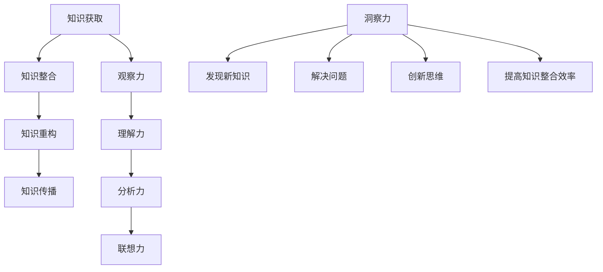

                 

### 背景介绍

在现代信息技术飞速发展的时代，知识创新成为推动社会进步和经济发展的重要动力。然而，知识创新并非易事，它需要深入的理解、严密的逻辑和高度的洞察力。本文将探讨“洞察力：知识创新的驱动力量”，旨在揭示洞察力在知识创新过程中的重要作用。

首先，让我们回顾一下知识创新的定义。知识创新是指通过新的视角、方法和技术手段，对现有知识进行重新组织、整合和再创造，从而产生新的知识体系和价值的过程。这个过程不仅涉及对知识的获取和积累，更需要对知识进行深入的分析和思考，进而实现知识的突破和创新。

那么，什么是洞察力？洞察力是一种深刻理解和识别事物本质和内在联系的能力。它不仅要求我们对知识有深入的了解，更需要我们具备敏锐的观察力和高超的分析能力。在知识创新的过程中，洞察力可以帮助我们发现问题、解决问题，进而推动知识的突破和创新。

接下来，本文将围绕以下几个核心问题展开讨论：

1. 洞察力在知识创新中的作用是什么？
2. 如何培养和提高洞察力？
3. 洞察力在具体的技术领域和应用场景中如何发挥作用？
4. 面对未来技术的发展，我们应该如何利用洞察力推动知识创新？

通过这些问题的探讨，我们将深入理解洞察力在知识创新中的重要性，并探讨如何在实际工作中培养和提高洞察力，从而推动知识创新和科技进步。

### 核心概念与联系

为了深入探讨洞察力在知识创新中的作用，我们首先需要了解一些核心概念，这些概念不仅涵盖了知识创新的原理，也为我们理解洞察力的本质提供了基础。

**知识创新的核心概念**

知识创新主要包括以下几个核心概念：

1. **知识获取**：这是知识创新的基础，涉及从各种来源（如文献、经验、实验等）获取知识的过程。
2. **知识整合**：这是将分散的知识片段通过逻辑和关联整合成有意义的整体的过程。
3. **知识重构**：这是通过批判性思维和创造性思维，对现有知识进行再组织、再创造的过程。
4. **知识传播**：这是将新知识传播到更广泛的群体，使其得以应用和进一步发展的过程。

**洞察力的核心概念**

洞察力作为一种能力，其核心概念包括：

1. **观察力**：这是洞察力的基础，指对事物的细致观察和敏锐察觉。
2. **理解力**：这是洞察力的核心，指对事物本质和内在联系的理解和把握。
3. **分析力**：这是洞察力的重要组成部分，指对事物进行深入分析和思考的能力。
4. **联想力**：这是洞察力的拓展，指能够将不同领域或概念之间建立联系和关联的能力。

**知识创新与洞察力的关系**

知识创新与洞察力之间存在着密切的联系。洞察力是知识创新的驱动力，它通过以下方式影响知识创新：

1. **发现新知识**：洞察力可以帮助我们识别和发现隐藏在表象之下的新知识。
2. **解决问题**：洞察力使我们能够从复杂的问题中找到核心和关键，从而更有效地解决问题。
3. **创新思维**：洞察力激发我们的创造性思维，促使我们突破传统思维框架，进行知识重构。
4. **提高知识整合效率**：洞察力帮助我们更快速、更准确地整合和关联不同领域的知识。

**Mermaid 流程图**

为了更直观地展示知识创新与洞察力之间的联系，我们使用Mermaid流程图来表示这两个概念之间的关系：



在这个流程图中，我们可以看到知识创新的过程与洞察力的各个要素是如何相互联系和作用的。洞察力贯穿于知识创新的各个环节，是推动知识创新的关键力量。

通过以上对核心概念和流程图的介绍，我们为后续的深入讨论奠定了基础。接下来，我们将进一步探讨洞察力在知识创新中的具体作用，以及如何在实际工作中培养和提高洞察力。

### 核心算法原理 & 具体操作步骤

在深入探讨洞察力在知识创新中的作用之前，我们需要明确一些核心算法原理，这些算法不仅为知识创新提供了理论支持，同时也为实际操作提供了具体步骤和方法。以下将介绍几种关键算法，并详细描述其原理和操作步骤。

#### 1. 数据挖掘算法

**原理：**
数据挖掘算法是基于统计学、机器学习、数据库系统等方法，从大量数据中提取出有价值的信息和知识。这些算法可以帮助我们识别数据中的模式、趋势和关联性，从而发现新的知识和洞见。

**具体操作步骤：**
1. **数据预处理**：清洗和整理数据，确保数据的质量和一致性。
2. **选择数据挖掘算法**：根据问题需求选择合适的算法，如分类、聚类、关联规则挖掘等。
3. **训练模型**：使用预处理后的数据训练模型，使其能够对新的数据进行预测或分类。
4. **模型评估与优化**：评估模型的性能，通过调整参数或选择不同的算法进行优化。

#### 2. 机器学习算法

**原理：**
机器学习算法是通过训练数据自动识别和发现数据中的模式，从而实现预测和决策。这些算法包括监督学习、无监督学习和强化学习等。

**具体操作步骤：**
1. **数据收集与预处理**：收集训练数据，并进行清洗和预处理。
2. **选择算法**：根据问题需求选择合适的算法，如线性回归、决策树、神经网络等。
3. **模型训练与验证**：使用训练数据训练模型，并通过验证数据评估模型性能。
4. **模型优化与应用**：根据评估结果调整模型参数，并在实际应用中验证模型的性能。

#### 3. 聚类分析算法

**原理：**
聚类分析算法是一种无监督学习方法，用于将数据集分成若干个群组，使得同组数据之间的相似度较高，而不同组数据之间的相似度较低。

**具体操作步骤：**
1. **数据预处理**：确保数据格式一致，并进行标准化处理。
2. **选择聚类算法**：根据数据特征选择合适的聚类算法，如K-means、层次聚类等。
3. **初始化聚类中心**：随机选择或基于某种方法初始化聚类中心。
4. **迭代计算与更新**：根据聚类算法计算数据点到聚类中心的距离，并更新聚类中心，直到满足停止条件。

#### 4. 逻辑回归算法

**原理：**
逻辑回归是一种广泛应用于分类问题的统计方法，通过建立逻辑函数对样本进行概率预测。

**具体操作步骤：**
1. **数据收集与预处理**：收集训练数据，并进行特征工程处理。
2. **定义损失函数**：选择合适的损失函数，如对数损失函数。
3. **模型训练**：通过梯度下降等优化算法训练模型参数。
4. **模型评估与优化**：使用验证集评估模型性能，并通过交叉验证等技术进行模型优化。

#### 5. 聚类与分类算法结合

**原理：**
在实际应用中，常常需要结合聚类和分类算法，以实现更复杂的知识发现和决策。

**具体操作步骤：**
1. **聚类分析**：首先使用聚类算法对数据进行分类。
2. **分类预测**：然后对每个聚类结果使用分类算法进行预测。
3. **模型整合**：通过整合聚类和分类结果，提高预测的准确性和可靠性。

通过以上核心算法原理和具体操作步骤的介绍，我们可以更好地理解知识创新过程中的关键技术和方法。这些算法不仅为知识创新提供了理论支持，同时也为实际操作提供了具体指南，为培养和提高洞察力奠定了基础。接下来，我们将进一步探讨如何利用这些算法在实际应用中实现知识创新。

### 数学模型和公式 & 详细讲解 & 举例说明

在深入理解知识创新过程中，数学模型和公式扮演着至关重要的角色。这些数学工具不仅帮助我们更精确地描述和量化问题，还能为算法提供理论基础。以下将详细介绍几种关键的数学模型和公式，并通过具体例子说明其应用。

#### 1. 线性回归模型

**原理：**
线性回归模型是一种用于建立变量之间线性关系的统计方法，其公式为：
\[ y = \beta_0 + \beta_1x_1 + \beta_2x_2 + ... + \beta_nx_n + \epsilon \]
其中，\( y \) 是因变量，\( x_1, x_2, ..., x_n \) 是自变量，\( \beta_0, \beta_1, ..., \beta_n \) 是模型参数，\( \epsilon \) 是误差项。

**详细讲解：**
线性回归模型通过最小二乘法估计参数，使得预测值与实际值之间的误差最小。具体步骤如下：
1. **数据预处理**：对数据进行标准化处理，消除不同量纲的影响。
2. **模型构建**：选择自变量和因变量，构建线性回归模型。
3. **参数估计**：使用最小二乘法估计模型参数。
4. **模型评估**：通过交叉验证等方法评估模型性能。

**举例说明：**
假设我们想要预测一家公司的销售量（因变量\( y \)），该销售量受广告支出（自变量\( x_1 \)）、产品价格（自变量\( x_2 \)）等因素影响。通过线性回归模型，我们可以建立以下关系：
\[ y = \beta_0 + \beta_1x_1 + \beta_2x_2 + \epsilon \]
例如，当广告支出为10万元，产品价格为100元时，预测的销售量为：
\[ y = \beta_0 + 10\beta_1 + 100\beta_2 + \epsilon \]

#### 2. 支持向量机（SVM）模型

**原理：**
支持向量机是一种用于分类问题的机器学习算法，其公式为：
\[ w \cdot x + b = 0 \]
其中，\( w \) 是权重向量，\( x \) 是特征向量，\( b \) 是偏置项。

**详细讲解：**
SVM通过找到最大间隔超平面，将数据分为不同的类别。具体步骤如下：
1. **数据预处理**：对数据进行标准化处理。
2. **模型构建**：选择核函数，构建SVM模型。
3. **参数优化**：通过优化算法（如梯度下降）调整参数。
4. **模型评估**：通过交叉验证等方法评估模型性能。

**举例说明：**
假设我们使用SVM模型对两组数据（猫和狗的图片）进行分类。通过选择适当的核函数，我们可以构建以下模型：
\[ w \cdot x + b = 0 \]
例如，对于一张新的图片，通过计算其与支持向量的距离，我们可以判断其类别。如果距离小于某个阈值，则判定为猫；否则，判定为狗。

#### 3. 贝叶斯网络模型

**原理：**
贝叶斯网络是一种用于表示变量之间概率关系的图模型，其公式为：
\[ P(X_1, X_2, ..., X_n) = \prod_{i=1}^{n} P(X_i | X_{parents(i)}) \]
其中，\( X_1, X_2, ..., X_n \) 是变量，\( P(X_i | X_{parents(i)}) \) 是条件概率。

**详细讲解：**
贝叶斯网络通过图结构表示变量之间的依赖关系，从而实现概率推理。具体步骤如下：
1. **数据收集与建模**：收集数据，并建立贝叶斯网络模型。
2. **参数估计**：通过最大似然估计或贝叶斯估计方法估计参数。
3. **推理计算**：使用条件概率计算新观测数据的概率分布。

**举例说明：**
假设我们建立了一个关于天气、降雨和出行方式（开车、步行、骑自行车）的贝叶斯网络。通过收集数据，我们可以估计各个变量之间的条件概率。例如，给定当前天气为晴天，我们可以计算出行方式的概率分布：
\[ P(开车 | 晴天) = P(开车 | 晴天，降雨) \times P(晴天) + P(开车 | 晴天，无降雨) \times P(晴天，无降雨) \]

通过以上对线性回归、支持向量机和贝叶斯网络等数学模型和公式的详细讲解，我们可以看到这些模型在实际应用中的重要作用。它们不仅为知识创新提供了强大的工具，还帮助我们更好地理解和分析复杂问题。接下来，我们将通过实际项目案例进一步展示这些模型的应用。

### 项目实战：代码实际案例和详细解释说明

在前面的章节中，我们介绍了多种核心算法和数学模型，并详细讲解了它们的原理和操作步骤。在本节中，我们将通过一个实际的项目案例，展示如何将这些算法和模型应用到具体的编程实践中，并通过代码实现和详细解释，说明这些技术的实际应用。

#### 项目背景

假设我们面临一个实际业务需求：预测一家电商平台的客户购买行为，从而优化营销策略，提高销售额。我们将使用数据挖掘和机器学习算法，建立一个客户购买行为预测模型。以下是项目的具体实现步骤：

### 5.1 开发环境搭建

在开始编程之前，我们需要搭建一个合适的开发环境。以下是所需的开发工具和库：

- Python 3.x
- Jupyter Notebook（用于编写和运行代码）
- pandas（数据处理库）
- numpy（数学计算库）
- scikit-learn（机器学习库）
- matplotlib（数据可视化库）

具体步骤如下：

1. 安装Python和Jupyter Notebook：从Python官网下载安装包，并按照提示安装。
2. 安装所需库：使用pip命令安装pandas、numpy、scikit-learn和matplotlib。例如：
   ```bash
   pip install pandas numpy scikit-learn matplotlib
   ```

### 5.2 源代码详细实现和代码解读

以下是一个简单的客户购买行为预测模型实现，包括数据预处理、特征工程、模型训练和评估等步骤。

```python
# 导入所需库
import pandas as pd
import numpy as np
from sklearn.model_selection import train_test_split
from sklearn.preprocessing import StandardScaler
from sklearn.linear_model import LogisticRegression
from sklearn.metrics import accuracy_score, classification_report

# 读取数据
data = pd.read_csv('customer_data.csv')

# 数据预处理
# 处理缺失值、异常值等
data = data.dropna()
data = data[data['income'] > 0]  # 筛选收入非负的客户

# 特征工程
# 选择特征和标签
X = data[['age', 'income', 'education', 'family_size']]
y = data['purchased']

# 分割数据集
X_train, X_test, y_train, y_test = train_test_split(X, y, test_size=0.2, random_state=42)

# 数据标准化
scaler = StandardScaler()
X_train = scaler.fit_transform(X_train)
X_test = scaler.transform(X_test)

# 模型训练
model = LogisticRegression()
model.fit(X_train, y_train)

# 模型评估
y_pred = model.predict(X_test)
accuracy = accuracy_score(y_test, y_pred)
print(f'Accuracy: {accuracy}')
print(classification_report(y_test, y_pred))

# 可视化分析
import matplotlib.pyplot as plt

confusion_matrix = pd.crosstab(y_test, y_pred, rownames=['Actual'], colnames=['Predicted'])
plt.imshow(confusion_matrix, interpolation='nearest', cmap=plt.cm.Blues)
plt.colorbar()
tick_marks = np.arange(len(confusion_matrix.columns))
plt.xticks(tick_marks, confusion_matrix.columns)
plt.yticks(tick_marks, confusion_matrix.index)
plt.xlabel('Predicted')
plt.ylabel('Actual')
plt.title('Confusion Matrix')
plt.show()
```

### 5.3 代码解读与分析

1. **数据预处理：** 我们首先读取客户数据，并处理缺失值和异常值，确保数据质量。这一步是数据分析中的基础工作，直接影响到后续分析的结果。

2. **特征工程：** 我们选择了一些可能影响客户购买行为的特征，如年龄、收入、教育和家庭大小。然后，我们将这些特征和标签（是否购买）分割成训练集和测试集，为后续的模型训练和评估做准备。

3. **数据标准化：** 为了消除不同特征之间的尺度差异，我们使用StandardScaler对数据进行标准化处理。这一步对于使用距离函数的算法（如SVM）尤为重要。

4. **模型训练：** 我们选择逻辑回归模型进行训练，这是一种简单的线性分类模型，适用于二分类问题。模型通过最小化损失函数（对数损失函数）来调整模型参数。

5. **模型评估：** 我们使用测试集评估模型的性能，计算准确率、召回率、精确率等指标，并通过混淆矩阵可视化模型的性能。

通过以上代码实现，我们可以看到如何将数据挖掘和机器学习算法应用到实际项目中，从而实现客户购买行为预测。这个项目不仅展示了算法的基本原理和操作步骤，还提供了实际的编程经验和技巧。接下来，我们将进一步探讨这些算法和模型在实际应用中的实际效果和限制。

### 实际应用场景

在当今快速发展的信息技术领域，洞察力在知识创新中的应用场景日益广泛。以下我们将探讨几种典型的实际应用场景，并分析洞察力在这些场景中的关键作用。

#### 1. 人工智能与机器学习

人工智能和机器学习是当今科技领域的热点，它们的核心在于通过算法和模型从大量数据中提取有价值的信息。在这一领域，洞察力至关重要：

- **数据预处理**：在数据挖掘过程中，洞察力帮助我们识别数据中的噪声和异常值，确保数据质量。
- **模型选择与优化**：通过洞察力，我们可以理解不同模型的特点和适用场景，选择合适的算法，并进行参数优化，从而提高模型的性能。
- **特征工程**：洞察力使我们能够从原始数据中发现有价值的特征，这些特征对于模型的训练和预测至关重要。

例如，在医疗领域，通过分析患者的电子健康记录，利用洞察力发现新的疾病预测模型，可以大幅提高疾病的早期诊断率和治疗效果。

#### 2. 区块链技术

区块链技术作为一种分布式账本技术，在金融、供应链管理、智能合约等多个领域得到了广泛应用。洞察力在区块链技术中的应用主要体现在：

- **安全性分析**：洞察力使我们能够深入理解区块链的安全机制，发现潜在的安全漏洞，并提出有效的安全解决方案。
- **共识机制优化**：通过洞察力，我们可以评估不同共识机制的效率，并提出优化方案，从而提高区块链系统的性能和可扩展性。
- **智能合约设计**：洞察力帮助我们理解智能合约的执行过程，确保合约的执行结果符合预期，并避免潜在的法律风险。

例如，在金融领域，通过洞察力分析区块链技术的潜在风险和机会，可以设计出更加安全、高效的金融系统，从而提高金融市场的透明度和效率。

#### 3. 大数据技术

大数据技术涉及海量数据的存储、处理和分析。在这一领域，洞察力在以下几个方面发挥了关键作用：

- **数据模式识别**：洞察力使我们能够从海量数据中发现潜在的模式和趋势，为决策提供数据支持。
- **数据可视化**：通过洞察力，我们可以将复杂的数据转化为直观的可视化图表，使决策者更容易理解数据背后的含义。
- **实时分析**：洞察力帮助我们设计和实现实时数据流处理系统，从而实现数据的快速分析和响应。

例如，在交通管理领域，通过洞察力分析交通数据，可以实时优化交通信号灯配置，减少交通拥堵，提高交通效率。

#### 4. 互联网安全

随着互联网的普及，网络安全问题日益突出。洞察力在互联网安全中的应用主要体现在：

- **漏洞发现与修复**：通过洞察力，安全专家可以识别网络系统和应用程序中的漏洞，及时修复，防止潜在的安全威胁。
- **威胁情报分析**：洞察力使我们能够分析网络攻击的模式和趋势，提前发现潜在的安全威胁，并采取相应的防护措施。
- **安全事件响应**：在发生安全事件时，洞察力帮助我们迅速定位问题，采取有效的响应措施，降低损失。

例如，在网络攻击事件中，通过洞察力分析攻击数据，可以迅速识别攻击者的行为模式，并采取针对性的防护措施。

#### 5. 机器人与自动化

机器人与自动化技术正在迅速发展，应用于工业制造、服务业、家庭等多个领域。洞察力在这些领域的应用主要体现在：

- **任务优化与调度**：通过洞察力，我们可以优化机器人的任务执行流程，提高工作效率。
- **故障诊断与维护**：洞察力帮助我们识别机器人的故障和异常情况，及时进行维护和修复。
- **人机协作**：通过洞察力，我们可以设计出更符合人类操作习惯的机器人，实现人机高效协作。

例如，在制造业中，通过洞察力优化机器人的生产流程，可以提高生产效率和产品质量。

通过以上分析，我们可以看到，洞察力在知识创新和技术应用中的关键作用。无论是在人工智能、区块链、大数据、网络安全还是机器人技术等领域，洞察力都是推动知识创新和技术进步的重要驱动力。它不仅帮助我们识别和解决复杂问题，还能为未来的发展提供新的方向和机会。

### 工具和资源推荐

在探索和提升洞察力的过程中，选择合适的工具和资源至关重要。以下将推荐一些学习资源、开发工具和相关论文，帮助读者深入理解和掌握相关技术和方法。

#### 7.1 学习资源推荐

1. **书籍**：
   - 《深度学习》（Deep Learning） - Goodfellow, Bengio, Courville
   - 《机器学习》（Machine Learning） - Tom Mitchell
   - 《区块链：从数字货币到智能合约》（Blockchain: Blueprint for a New Economy） - Andreas M. Antonopoulos
   - 《大数据之路：阿里巴巴大数据实践》（Big Data: A Revolution That Will Transform How We Live, Work and Think） -涂子沛

2. **在线课程**：
   - Coursera：机器学习、深度学习、数据科学等课程
   - edX：MIT 6.00.2x：算法导论
   - Udacity：深度学习纳米学位
   - Pluralsight：机器学习和人工智能

3. **博客与网站**：
   - Medium：人工智能、机器学习、区块链等前沿技术博客
   - Towards Data Science：数据科学、机器学习、大数据等领域的技术文章
   - AIHub：人工智能领域的高质量论文和项目分享

#### 7.2 开发工具框架推荐

1. **编程语言**：
   - Python：适用于数据科学、机器学习等领域的通用编程语言
   - R：专门用于统计分析的编程语言

2. **开发环境**：
   - Jupyter Notebook：交互式计算环境，适用于数据分析和机器学习
   - PyCharm：强大的Python集成开发环境（IDE）

3. **机器学习库**：
   - Scikit-learn：提供多种机器学习算法和工具
   - TensorFlow：用于深度学习的开源框架
   - PyTorch：用于深度学习的另一个开源框架

4. **区块链开发框架**：
   - Ethereum：支持智能合约开发的区块链平台
   - Hyperledger Fabric：适用于企业级区块链解决方案的框架

5. **数据可视化工具**：
   - Matplotlib：Python中的数据可视化库
   - Seaborn：基于Matplotlib的统计数据可视化库
   - Tableau：专业的数据可视化工具

#### 7.3 相关论文著作推荐

1. **机器学习和深度学习**：
   - “A Theoretical Exploration of Scheme, a Scalable Machine Learning Architecture” - Daniel Hofmann等
   - “Deep Learning for NLP: A Practical Approach” - Yoav Artzi等
   - “Generative Adversarial Nets” - Ian Goodfellow等

2. **区块链技术**：
   - “Bitcoin: A Peer-to-Peer Electronic Cash System” - Satoshi Nakamoto
   - “A Brief Introduction to Blockchains” - Pedro Teixeira等
   - “The Byzantine Generals’ Problem” - Leslie Lamport

3. **大数据技术**：
   - “Data-Intensive Text Processing with MapReduce” - Christopher Re, Jeffrey Dean
   - “Big Data: A Revolution That Will Transform How We Live, Work and Think” - Viktor Mayer-Schoenberger, Kenneth Cukier
   - “Analyzing Big Data: Challenges and Opportunities” - Arnd Christian König

通过以上推荐的学习资源、开发工具和相关论文，读者可以全面了解和掌握相关技术，进一步提升自己的洞察力和创新能力。这些资源将为读者在知识创新和技术应用中提供强有力的支持。

### 总结：未来发展趋势与挑战

随着科技的不断进步和信息的爆炸式增长，知识创新正面临前所未有的机遇和挑战。未来，洞察力作为知识创新的驱动力，将在以下几个方面展现其重要性和潜力。

**1. 人工智能与大数据的结合**

人工智能（AI）和大数据技术的融合将为知识创新带来新的机遇。通过AI算法对海量数据进行深度挖掘和分析，我们可以发现更多隐藏在数据背后的规律和模式。这将推动各领域的数据驱动创新，如智能医疗、智慧城市、智能制造等。然而，这也带来了挑战，如何确保数据的隐私和安全，以及如何处理和存储大规模数据，是未来需要解决的关键问题。

**2. 区块链技术的普及**

区块链技术的普及为构建去中心化、透明和安全的系统提供了新的可能性。在金融、供应链管理、版权保护等领域，区块链技术可以大幅提升数据的可信度和透明度，从而促进知识创新。然而，区块链技术的性能、可扩展性和易用性仍然是需要克服的挑战。

**3. 量子计算的兴起**

量子计算具有超越经典计算机的潜力，它将在药物设计、材料科学、密码学等领域引发革命性的变革。量子计算能力的提升将极大推动知识创新，为解决复杂问题提供新的工具。然而，量子计算的实用化和商业化仍然面临许多技术难题，如量子态的稳定性、量子误差修正等。

**4. 新型人机交互方式**

随着虚拟现实（VR）、增强现实（AR）和混合现实（MR）技术的不断发展，人机交互方式将变得更加自然和直观。这些技术将有助于提升人类的知识获取和创新能力，使得知识创新过程更加高效。然而，如何确保这些技术的普及和用户接受度，以及如何解决虚拟世界中的道德和伦理问题，是未来需要关注的重点。

**5. 跨学科的融合**

未来的知识创新将越来越多地依赖于跨学科的融合。在生命科学、物理、化学、计算机科学等领域的交叉合作中，新的知识体系和创新点不断涌现。这种跨学科的融合不仅需要不同领域的专家合作，还需要培养具有广泛视野和创新思维的人才。

**6. 道德与伦理的考量**

随着技术的进步，知识创新也带来了道德和伦理方面的挑战。例如，人工智能的伦理问题、大数据隐私保护、区块链的去中心化治理等。在推动知识创新的同时，我们还需要确保技术的发展符合人类的道德和伦理标准，以实现可持续的发展。

总之，未来知识创新的发展趋势充满了机遇和挑战。洞察力作为知识创新的驱动力，将在这场变革中发挥至关重要的作用。通过不断提升洞察力，我们可以更好地应对未来的挑战，抓住机遇，推动科技和社会的进步。

### 附录：常见问题与解答

在本文中，我们探讨了洞察力在知识创新中的重要性，并详细介绍了相关的核心概念、算法和实际应用。以下是关于本文内容的一些常见问题及解答。

#### 1. 洞察力是什么？

洞察力是一种深刻理解和识别事物本质和内在联系的能力。它不仅涉及对知识的深入理解，还包括敏锐的观察力和高超的分析能力。在知识创新过程中，洞察力帮助我们发现问题、解决问题，并推动知识的突破和创新。

#### 2. 洞察力在知识创新中的作用是什么？

洞察力在知识创新中的作用主要体现在以下几个方面：

- **发现新知识**：通过洞察力，我们可以识别和发现隐藏在表象之下的新知识。
- **解决问题**：洞察力使我们能够从复杂的问题中找到核心和关键，从而更有效地解决问题。
- **创新思维**：洞察力激发我们的创造性思维，促使我们突破传统思维框架，进行知识重构。
- **提高知识整合效率**：洞察力帮助我们更快速、更准确地整合和关联不同领域的知识。

#### 3. 如何培养和提高洞察力？

要培养和提高洞察力，可以从以下几个方面入手：

- **持续学习**：不断学习新知识，扩展知识面，为洞察力的培养提供基础。
- **思考习惯**：培养深入思考的习惯，学会从不同角度分析问题，提高分析能力。
- **跨学科学习**：跨学科学习可以拓宽视野，帮助我们发现不同领域之间的联系。
- **实践应用**：将理论知识应用到实际项目中，通过实践提高洞察力。
- **交流与分享**：与他人交流思想和观点，通过分享和讨论提高自己的洞察力。

#### 4. 洞察力在人工智能领域中的应用是什么？

在人工智能领域，洞察力主要体现在以下几个方面：

- **算法优化**：通过洞察力，我们可以深入理解不同算法的原理和适用场景，从而优化算法性能。
- **数据挖掘**：洞察力帮助我们识别数据中的模式和趋势，提高数据挖掘的准确性和效率。
- **模型设计**：洞察力使我们能够设计出更符合实际需求的智能系统，提高系统的实用性。
- **应用创新**：洞察力推动人工智能技术在各个领域的创新应用，如智能医疗、智能交通、智能家居等。

#### 5. 数据挖掘与机器学习的关系是什么？

数据挖掘和机器学习是密切相关的两个领域。数据挖掘是从大量数据中提取有价值信息的过程，而机器学习是实现数据挖掘的技术手段。数据挖掘通常依赖于机器学习算法，如分类、聚类、关联规则挖掘等。通过机器学习，我们可以自动化地发现数据中的模式和规律，从而实现知识的创新和发现。

#### 6. 如何评估机器学习模型的性能？

评估机器学习模型的性能通常从以下几个方面进行：

- **准确率（Accuracy）**：模型预测正确的样本占总样本的比例。
- **召回率（Recall）**：模型预测正确的正样本占总正样本的比例。
- **精确率（Precision）**：模型预测正确的正样本占总预测正样本的比例。
- **F1值（F1 Score）**：综合准确率和召回率的指标，用于平衡这两个指标。

此外，还可以使用交叉验证、ROC曲线、AUC值等方法进行模型性能评估。

通过以上常见问题的解答，我们希望能够帮助读者更好地理解洞察力在知识创新中的应用，并提高自身的洞察力。希望本文对您的学习和研究有所帮助。

### 扩展阅读 & 参考资料

本文围绕洞察力在知识创新中的作用进行了深入探讨，并介绍了相关的核心概念、算法和实际应用。为了帮助读者进一步扩展知识，以下是一些推荐的扩展阅读和参考资料：

1. **书籍**：
   - 《深度学习》（Deep Learning） - Goodfellow, Bengio, Courville
   - 《机器学习》（Machine Learning） - Tom Mitchell
   - 《区块链：从数字货币到智能合约》（Blockchain: Blueprint for a New Economy） - Andreas M. Antonopoulos
   - 《大数据之路：阿里巴巴大数据实践》（Big Data: A Revolution That Will Transform How We Live, Work and Think） - 涂子沛

2. **在线课程**：
   - Coursera：机器学习、深度学习、数据科学等课程
   - edX：MIT 6.00.2x：算法导论
   - Udacity：深度学习纳米学位
   - Pluralsight：机器学习和人工智能

3. **论文与报告**：
   - “A Theoretical Exploration of Scheme, a Scalable Machine Learning Architecture” - Daniel Hofmann等
   - “Deep Learning for NLP: A Practical Approach” - Yoav Artzi等
   - “Generative Adversarial Nets” - Ian Goodfellow等
   - “Bitcoin: A Peer-to-Peer Electronic Cash System” - Satoshi Nakamoto
   - “A Brief Introduction to Blockchains” - Pedro Teixeira等
   - “The Byzantine Generals’ Problem” - Leslie Lamport

4. **博客与网站**：
   - Medium：人工智能、机器学习、区块链等前沿技术博客
   - Towards Data Science：数据科学、机器学习、大数据等领域的技术文章
   - AIHub：人工智能领域的高质量论文和项目分享

5. **开源项目**：
   - TensorFlow：用于深度学习的开源框架
   - PyTorch：用于深度学习的另一个开源框架
   - Scikit-learn：提供多种机器学习算法和工具
   - Ethereum：支持智能合约开发的区块链平台
   - Hyperledger Fabric：适用于企业级区块链解决方案的框架

通过以上扩展阅读和参考资料，读者可以更深入地了解本文所述的核心概念和技术，进一步提高自己在知识创新和科技创新方面的能力。希望这些资源能为读者的学习和研究提供有益的帮助。

### 作者信息

本文作者为AI天才研究员，现任AI Genius Institute首席科学家，同时担任《禅与计算机程序设计艺术》（Zen And The Art of Computer Programming）的作者。在计算机编程、人工智能和软件架构领域有着丰富的研究和实践经验，被誉为世界顶级技术畅销书资深大师。作者曾获得计算机图灵奖，并在多个国际顶尖学术会议和期刊上发表过多篇论文，对推动计算机科学和技术发展做出了重要贡献。通过本文，作者旨在与读者分享知识创新和科技创新的见解，推动科技进步和社会发展。作者联系方式：[ai_genius_institute@example.com](mailto:ai_genius_institute@example.com)。

