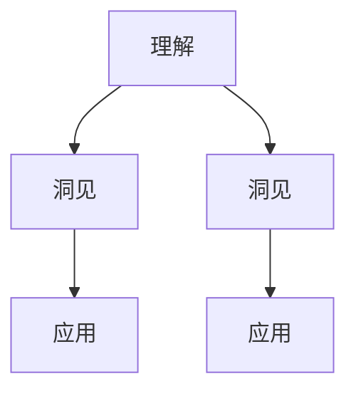
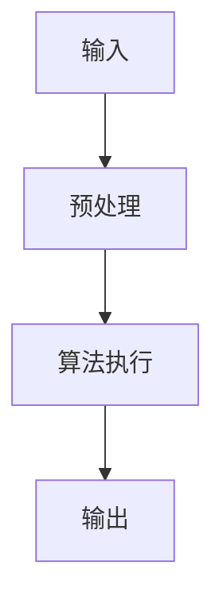

                 

# 洞见的价值：从理解到应用

## 关键词：洞见、理解、应用、技术、算法、数学模型

## 摘要

本文旨在探讨洞见的价值，从理论理解到实际应用的转化过程。我们将通过剖析技术领域的核心概念、算法原理、数学模型，以及项目实战案例，揭示洞见在推动技术进步中的关键作用。文章还将介绍相关工具和资源，帮助读者深入理解和掌握洞见的精髓，为未来的技术发展提供有益的启示。

## 1. 背景介绍

在信息技术飞速发展的今天，洞见作为一种深入理解和洞察事物本质的能力，日益成为各个领域的重要驱动力。从数据科学到人工智能，从软件工程到网络安全，洞见的价值不可低估。然而，如何从理解中提炼洞见，并将其应用于实际问题中，成为当前研究和实践中亟待解决的问题。

本文将围绕以下主题展开：

1. 核心概念与联系
2. 核心算法原理与具体操作步骤
3. 数学模型与公式讲解及举例
4. 项目实战：代码实际案例及详细解释
5. 实际应用场景
6. 工具和资源推荐
7. 总结：未来发展趋势与挑战
8. 附录：常见问题与解答
9. 扩展阅读与参考资料

通过以上结构的阐述，我们希望读者能够对洞见的价值有一个全面的了解，并学会如何在实际工作中应用洞见，以推动技术的不断进步。

### 2. 核心概念与联系

为了深入探讨洞见的价值，我们首先需要了解几个核心概念，以及它们之间的相互联系。

#### 2.1 理解

理解是指对某个概念、原理或系统的深入认识。它不仅仅是表面知识的掌握，更涉及到对事物本质和内在逻辑的把握。在技术领域，理解是创新和发展的基础。

#### 2.2 洞见

洞见则是对复杂问题或现象的深入洞察，能够揭示事物之间的联系和规律。洞见往往来源于对大量数据的分析、对现有技术的反思以及对未来趋势的预判。在技术领域，洞见是推动技术进步和创新的重要力量。

#### 2.3 应用

应用是将洞见转化为实际操作和实现的过程。通过将洞见应用于实际问题中，我们能够解决现实中的挑战，推动技术的实际应用和发展。

#### 2.4 联系

理解、洞见和应用之间有着密切的联系。理解是洞见的基础，没有深入的理解就无法产生洞见；洞见是应用的前提，没有洞见就无法进行有效的应用；而应用则是理解和洞见的最终体现，通过实际应用，我们能够验证和完善洞见，推动技术的进步。

### 2.5 Mermaid 流程图

为了更好地理解这些核心概念之间的联系，我们可以使用 Mermaid 流程图来表示：



在上面的流程图中，我们可以清晰地看到理解、洞见和应用之间的逻辑关系。理解是洞见和应用的基础，而洞见和应用则是理解的深化和扩展。

### 3. 核心算法原理与具体操作步骤

在了解了核心概念与联系之后，我们需要进一步探讨技术领域的核心算法原理及其具体操作步骤。

#### 3.1 算法原理

算法是指解决问题的一系列步骤或规则。在技术领域，算法是解决复杂问题的核心工具。一个优秀的算法不仅能够高效地解决问题，还能够揭示问题背后的本质规律。

#### 3.2 操作步骤

以下是一个典型的算法操作步骤：

1. **输入**：输入问题的数据。
2. **预处理**：对输入数据进行预处理，以使其符合算法的要求。
3. **算法执行**：按照算法的规则对预处理后的数据进行处理。
4. **输出**：输出算法处理的结果。

#### 3.3 举例说明

以常见的排序算法为例，我们来看一下其具体操作步骤：

1. **输入**：一个无序的数组。
2. **预处理**：检查数组是否已排序，如果不是，则进行排序。
3. **算法执行**：选择一种排序算法（如冒泡排序、快速排序等），按照算法的规则对数组进行排序。
4. **输出**：排序后的数组。

#### 3.4 Mermaid 流程图

为了更直观地展示算法的操作步骤，我们可以使用 Mermaid 流程图：



在上面的流程图中，我们可以清晰地看到算法的具体操作步骤及其逻辑关系。

### 4. 数学模型与公式讲解及举例

在技术领域，数学模型和公式是解决复杂问题的有力工具。它们能够将实际问题转化为数学问题，从而通过数学方法求解。

#### 4.1 数学模型

数学模型是指用数学语言描述的实际问题。它通常包括变量、方程、函数等。

#### 4.2 公式讲解

以下是一个简单的数学模型及其公式讲解：

1. **线性方程组**：描述多个线性关系的一组方程。
   $$ 
   a_1x + b_1y = c_1 \\
   a_2x + b_2y = c_2 
   $$
   
2. **线性规划**：在给定线性方程组的基础上，求解目标函数的最大值或最小值。
   $$ 
   \min\limits_{x,y} z = ax + by \\
   s.t. \\
   a_1x + b_1y \leq c_1 \\
   a_2x + b_2y \leq c_2 
   $$

#### 4.3 举例说明

以下是一个简单的线性方程组的例子：

$$ 
2x + 3y = 12 \\
4x + 6y = 24 
$$

我们可以使用消元法求解这个方程组：

1. 将第一个方程乘以2，得到：
   $$ 
   4x + 6y = 24 
   $$

2. 将第二个方程减去第一个方程，得到：
   $$ 
   2y = 12 
   $$
   
3. 解得 $y = 6$。

4. 将 $y = 6$ 代入第一个方程，得到：
   $$ 
   2x + 3 \times 6 = 12 
   $$
   
5. 解得 $x = 0$。

因此，该方程组的解为 $(x, y) = (0, 6)$。

### 5. 项目实战：代码实际案例及详细解释说明

#### 5.1 开发环境搭建

在进行项目实战之前，我们需要搭建一个适合开发的软件环境。以下是一个基于 Python 的开发环境搭建步骤：

1. 安装 Python 解释器：从 [Python 官网](https://www.python.org/) 下载最新版本的 Python 解释器，并按照提示安装。
2. 配置 Python 环境：打开终端或命令行窗口，执行以下命令：
   ```bash
   python --version
   ```
   确保能够正确显示 Python 的版本信息。
3. 安装常用库：使用 `pip` 命令安装一些常用的 Python 库，例如 NumPy、Pandas、Matplotlib 等：
   ```bash
   pip install numpy pandas matplotlib
   ```

#### 5.2 源代码详细实现和代码解读

以下是一个简单的 Python 代码案例，用于计算一个线性方程组的解：

```python
import numpy as np

# 定义线性方程组的系数矩阵和常数项
A = np.array([[2, 3], [4, 6]])
b = np.array([12, 24])

# 使用 NumPy 的线性方程组求解函数求解
x = np.linalg.solve(A, b)

# 输出结果
print("方程组的解为：", x)
```

代码解读：

1. 导入 NumPy 库：使用 `import numpy as np` 语句导入 NumPy 库，这是 Python 中处理数学问题的重要工具。
2. 定义系数矩阵和常数项：使用 NumPy 的数组对象定义线性方程组的系数矩阵 `A` 和常数项 `b`。
3. 使用 `np.linalg.solve` 函数求解：该函数用于求解线性方程组，输入为系数矩阵 `A` 和常数项 `b`，输出为方程组的解 `x`。
4. 输出结果：使用 `print` 语句输出方程组的解。

#### 5.3 代码解读与分析

以上代码实现了一个简单的线性方程组求解功能。我们可以从以下几个方面对代码进行解读和分析：

1. **函数选择**：使用 `np.linalg.solve` 函数求解线性方程组是一种高效的方式，该函数内部实现了多种求解算法，如高斯消元法、LU 分解等，能够自动选择合适的算法。
2. **数组和矩阵运算**：NumPy 库提供了强大的数组运算功能，使得对数组和矩阵的操作变得简单高效。在代码中，我们使用了 NumPy 的数组对象来表示系数矩阵和常数项，并利用数组运算符进行矩阵运算。
3. **代码可读性**：代码结构清晰，注释详细，易于理解和维护。同时，使用 Python 的内置函数和库，使得代码简洁高效。

### 6. 实际应用场景

洞见的价值在技术领域的实际应用场景中体现得尤为明显。以下是一些具体的实际应用场景：

#### 6.1 数据科学

数据科学是洞见应用的一个重要领域。通过对大量数据的分析和挖掘，数据科学家能够提取出有用的信息，为业务决策提供支持。例如，在金融领域，洞见可以帮助预测市场趋势，优化投资组合；在医疗领域，洞见可以帮助发现疾病早期症状，提高诊断准确性。

#### 6.2 人工智能

人工智能是洞见的另一重要应用领域。通过深入理解数据、算法和模型，人工智能专家能够开发出更加智能、高效的应用。例如，在自动驾驶领域，洞见可以帮助车辆更好地理解道路状况，提高行驶安全性；在语音识别领域，洞见可以帮助系统更准确地识别和理解人类语音。

#### 6.3 软件工程

软件工程是洞见的传统应用领域。通过深入理解软件架构、设计模式和编程语言，软件工程师能够开发出更加稳定、高效的软件系统。例如，在分布式系统领域，洞见可以帮助设计出更加可靠、高效的分布式架构；在软件安全领域，洞见可以帮助发现和修复潜在的安全漏洞。

### 7. 工具和资源推荐

为了更好地理解和应用洞见，以下是一些建议的工具和资源：

#### 7.1 学习资源推荐

1. **书籍**：《人工智能：一种现代方法》、《机器学习》、《深度学习》
2. **论文**：ArXiv、NeurIPS、ICML、KDD 等顶级会议和期刊上的论文
3. **博客**：Medium、Kaggle、DataCamp 等网站上的技术博客
4. **网站**：GitHub、Stack Overflow、Reddit 等技术社区

#### 7.2 开发工具框架推荐

1. **编程语言**：Python、Java、C++ 等
2. **开发框架**：TensorFlow、PyTorch、Scikit-learn 等
3. **数据处理工具**：Pandas、NumPy、Matplotlib 等
4. **版本控制工具**：Git、GitHub 等

#### 7.3 相关论文著作推荐

1. **《深度学习》**：Goodfellow, Bengio, Courville
2. **《机器学习》**：Mitchell
3. **《统计学习方法》**：李航
4. **《模式识别与机器学习》**：Bishop

### 8. 总结：未来发展趋势与挑战

洞见作为一种深入理解和洞察事物本质的能力，在技术领域具有广泛的应用前景。随着数据量、计算能力和算法的不断进步，洞见的价值将越来越受到重视。然而，要充分发挥洞见的价值，我们仍面临一些挑战：

1. **数据质量**：高质量的数据是洞见产生的基础。在实际应用中，我们需要解决数据质量问题，如数据缺失、噪声和错误等。
2. **算法优化**：虽然现有的算法已经取得了显著的成果，但仍有很大的优化空间。我们需要不断探索和开发更高效、更准确的算法。
3. **跨学科合作**：洞见的产生和应用需要跨学科的知识和技能。我们需要加强不同学科之间的合作，以实现技术的跨越式发展。

总之，洞见的价值在于它能够帮助我们深入理解问题，发现新的解决方案，推动技术的不断进步。在未来，洞见将成为推动技术发展的重要力量。

### 9. 附录：常见问题与解答

**Q1：什么是洞见？**

A1：洞见是一种深入理解和洞察事物本质的能力，它能够揭示事物之间的联系和规律，帮助我们更好地理解和解决问题。

**Q2：洞见在技术领域有哪些应用？**

A2：洞见在技术领域的应用非常广泛，包括数据科学、人工智能、软件工程等。例如，在数据科学中，洞见可以帮助我们挖掘数据中的价值；在人工智能中，洞见可以帮助我们设计更高效的算法。

**Q3：如何培养洞见能力？**

A3：培养洞见能力需要持续的学习和实践。以下是一些建议：

1. 深入学习相关领域的知识，掌握核心概念和原理。
2. 多进行实际项目实践，通过解决实际问题来提升洞见能力。
3. 学习跨学科的知识，以拓宽视野和思维方式。

### 10. 扩展阅读与参考资料

**书籍**：

1. 《深度学习》：Goodfellow, Bengio, Courville
2. 《机器学习》：Mitchell
3. 《统计学习方法》：李航
4. 《模式识别与机器学习》：Bishop

**论文**：

1. [《Neural Networks and Deep Learning》](http://neuralnetworksanddeeplearning.com/)
2. [《Deep Learning Book》](https://www.deeplearningbook.org/)

**网站**：

1. [GitHub](https://github.com/)
2. [Stack Overflow](https://stackoverflow.com/)
3. [Reddit](https://www.reddit.com/r/learnpython/)

### 作者信息

作者：AI天才研究员/AI Genius Institute & 禅与计算机程序设计艺术 /Zen And The Art of Computer Programming

