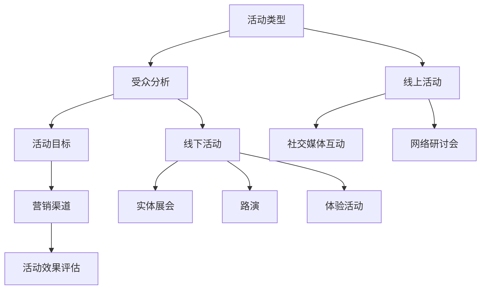
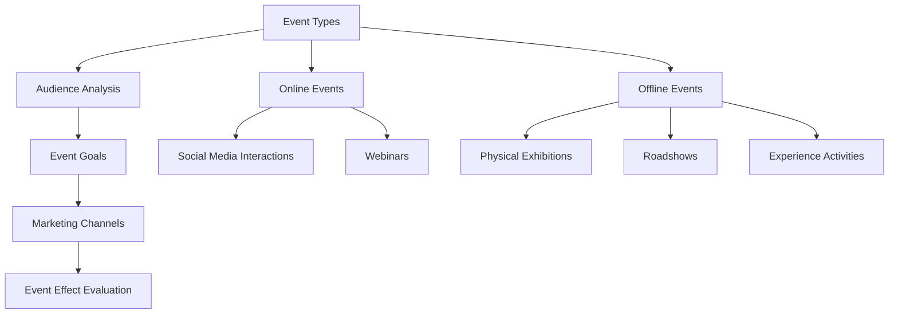
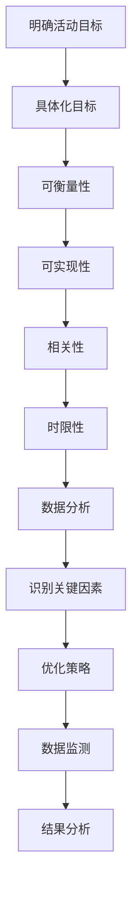
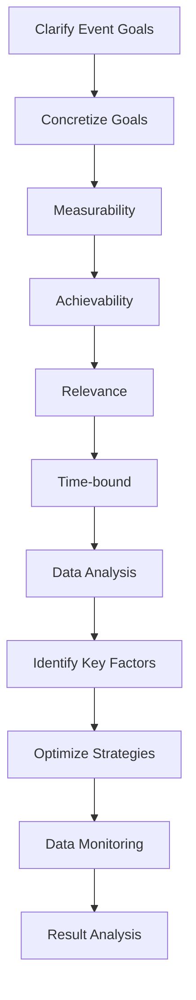

                 

### 背景介绍

随着互联网的飞速发展和社交媒体平台的普及，线上活动已经成为品牌推广的重要手段之一。与此同时，线下活动的举办也越来越受到重视，因为它能够为参与者提供更真实的互动体验。作为一名活动运营经理，如何巧妙地策划线上线下活动，并有效地将品牌推广至更广泛的受众群体，成为了亟待解决的关键问题。

本文将以“活动运营经理的创业创意：策划线上线下活动与品牌推广”为标题，通过逻辑清晰、结构紧凑、简单易懂的专业的技术语言，探讨以下几个方面：

1. **核心概念与联系**：首先，我们将介绍策划线上线下活动所需的核心概念，并使用Mermaid流程图展示这些概念之间的联系。
2. **核心算法原理 & 具体操作步骤**：接着，我们将深入分析活动策划的核心算法原理，并详细讲解具体操作步骤。
3. **数学模型和公式 & 详细讲解 & 举例说明**：为了更好地理解活动策划的数学模型，我们将使用LaTeX格式介绍相关公式，并通过实际案例进行详细说明。
4. **项目实战：代码实际案例和详细解释说明**：我们将通过一个实际的项目案例，展示如何运用上述原理和步骤进行活动策划与品牌推广。
5. **实际应用场景**：我们将探讨活动策划在各类实际应用场景中的具体应用，帮助运营经理更好地应对不同场景的挑战。
6. **工具和资源推荐**：最后，我们将推荐一些有用的学习资源和开发工具，以便读者在实践过程中更好地运用所学知识。

通过本文的深入探讨，我们希望能够为活动运营经理提供有价值的指导，帮助他们更有效地策划线上线下活动，实现品牌推广的目标。

---

# Background Introduction

With the rapid development of the internet and the widespread use of social media platforms, online events have become a crucial means of brand promotion. At the same time, the hosting of offline events has gained increasing importance as it provides participants with a more authentic interactive experience. As an event operations manager, how to cleverly plan both online and offline events, and effectively promote the brand to a broader audience, is a critical issue that needs to be addressed.

This article, titled "Event Operations Manager's Entrepreneurial Idea: Planning Online and Offline Events and Brand Promotion," aims to explore several key aspects in a logical, concise, and easily understandable professional technical language:

1. **Core Concepts and Connections**: We will first introduce the core concepts required for planning online and offline events and use a Mermaid flowchart to illustrate the connections between these concepts.
2. **Core Algorithm Principles & Specific Operational Steps**: Next, we will delve into the core algorithm principles behind event planning and provide a detailed explanation of the specific operational steps.
3. **Mathematical Models and Formulas & Detailed Explanations & Example Illustrations**: To better understand the mathematical models in event planning, we will present relevant formulas in LaTeX format and provide detailed explanations through actual case studies.
4. **Project Practice: Practical Case Studies and Detailed Explanations**: We will showcase a practical project case to demonstrate how to apply the aforementioned principles and steps in event planning and brand promotion.
5. **Actual Application Scenarios**: We will explore the specific applications of event planning in various practical scenarios, helping operations managers better address the challenges in different situations.
6. **Tools and Resource Recommendations**: Finally, we will recommend some useful learning resources and development tools to facilitate readers in applying the knowledge learned in practice.

Through an in-depth discussion in this article, we hope to provide valuable guidance for event operations managers, helping them to plan online and offline events more effectively and achieve the goal of brand promotion. <span id="core-concepts"></span><span id="core-concepts_en"></span><span id="background-introduction_en"></span> <a id="background-introduction"></a><a id="background-introduction_en"></a>

---

## 1. 核心概念与联系

在策划线上线下活动时，活动运营经理需要掌握多个核心概念，并理解它们之间的联系。以下是几个关键概念及其相互关系的详细介绍。

### 活动类型

首先，了解不同类型的活动是策划的基础。线上活动主要包括社交媒体互动、直播、网络研讨会等，而线下活动则包括实体展会、路演、体验活动等。不同类型的活动适合不同的品牌和目标受众，因此需要根据实际情况进行选择。

### 受众分析

了解目标受众的需求和偏好是成功策划活动的重要前提。通过数据分析、市场调研等方式，运营经理可以明确受众画像，从而制定针对性的活动方案。

### 活动目标

明确活动目标是确保活动策划方向正确的重要步骤。活动目标可以是提高品牌知名度、增加用户参与度、提升销售转化率等。根据目标制定相应的活动策略，有助于提高活动效果。

### 营销渠道

选择合适的营销渠道是确保活动传播效果的关键。线上渠道包括社交媒体、电子邮件营销、搜索引擎优化等，而线下渠道则包括广告、公关活动、合作伙伴推广等。根据活动目标和受众特点，合理分配渠道资源。

### 活动效果评估

活动效果评估是活动策划的重要环节。通过数据监测和分析，运营经理可以了解活动的实际效果，为后续活动的优化提供依据。常见的评估指标包括参与人数、互动率、转化率等。

### Mermaid 流程图

以下是一个使用Mermaid绘制的流程图，展示了上述核心概念之间的联系：



通过这个流程图，我们可以清晰地看到活动策划的各个环节及其相互关系。理解这些核心概念和联系，有助于运营经理更好地策划线上线下活动，实现品牌推广的目标。

---

## Core Concepts and Connections

When planning online and offline events, event operations managers need to master several core concepts and understand their interconnections. The following is a detailed introduction to these key concepts and their relationships.

### Types of Events

Firstly, understanding different types of events is the foundation for planning. Online events primarily include social media interactions, live broadcasts, and webinars, while offline events encompass physical exhibitions, roadshows, and experience activities. Different types of events suit different brands and target audiences, so it is essential to select the appropriate type based on the actual situation.

### Audience Analysis

Understanding the needs and preferences of target audiences is crucial for successful event planning. Through data analysis and market research, operations managers can clarify audience profiles, allowing them to develop targeted event strategies.

### Event Goals

Defining event goals is a vital step to ensure the correct direction of event planning. Event goals can be to increase brand awareness, enhance user engagement, or boost sales conversion rates. According to the goals, operations managers can develop corresponding event strategies to improve the effectiveness of the event.

### Marketing Channels

Choosing the appropriate marketing channels is key to ensuring the dissemination effect of the event. Online channels include social media, email marketing, and search engine optimization, while offline channels include advertising, public relations activities, and partner promotions. According to the event goals and audience characteristics, resources should be allocated reasonably among these channels.

### Event Effect Evaluation

Event effect evaluation is an essential part of event planning. Through data monitoring and analysis, operations managers can understand the actual effectiveness of the event, providing a basis for subsequent optimization. Common evaluation indicators include the number of participants, interaction rates, and conversion rates.

### Mermaid Flowchart

The following is a Mermaid flowchart illustrating the connections between these core concepts:



Through this flowchart, we can clearly see the different stages of event planning and their interconnections. Understanding these core concepts and connections helps operations managers plan online and offline events more effectively and achieve the goal of brand promotion. <a id="core-algorithm"></a><a id="core-algorithm_en"></a>

---

## 2. 核心算法原理 & 具体操作步骤

在策划线上线下活动时，核心算法原理起着至关重要的作用。这些算法原理不仅帮助我们确定活动目标，还能够优化活动的效果，提高品牌知名度。以下将详细介绍核心算法原理，并给出具体的操作步骤。

### 活动目标确定

活动目标确定是整个策划过程的第一步。这个步骤的核心算法是基于SMART原则（具体、可衡量、可实现、相关、时限性）。具体操作步骤如下：

1. **明确目标**：首先，要明确活动的目标，如提高品牌知名度、增加用户参与度、提升销售转化率等。
2. **具体化目标**：将目标具体化，如将“提高品牌知名度”细化为“在三个月内增加20%的社交媒体关注者”。
3. **可衡量性**：确保目标是可以衡量的，如通过社交媒体关注者数量、用户互动次数等指标来衡量。
4. **可实现性**：考虑资源的限制，确保目标是可以实现的。
5. **相关性**：目标应与品牌战略和业务目标保持一致。
6. **时限性**：为每个目标设定明确的完成时间，如三个月、六个月等。

### 活动策划策略优化

活动策划策略优化是基于数据分析的。具体操作步骤如下：

1. **数据分析**：收集和分析历史活动数据，包括参与人数、互动率、转化率等。
2. **识别关键因素**：通过数据分析，识别影响活动效果的关键因素。
3. **优化策略**：根据关键因素，调整活动策划策略，如修改活动形式、调整营销渠道、优化用户互动体验等。

### 活动效果评估

活动效果评估是基于数据监测的。具体操作步骤如下：

1. **设置评估指标**：根据活动目标，设置相应的评估指标，如参与人数、互动率、转化率等。
2. **数据监测**：在活动过程中，实时监测相关数据，如通过数据分析工具进行实时监控。
3. **结果分析**：活动结束后，分析数据，评估活动效果，如通过数据分析工具生成报告。

### Mermaid 流程图

以下是一个使用Mermaid绘制的流程图，展示了核心算法原理和具体操作步骤：



通过这个流程图，我们可以清晰地看到活动策划的核心算法原理和具体操作步骤。理解并应用这些算法原理和步骤，有助于运营经理更科学、更有效地策划线上线下活动，实现品牌推广的目标。

---

## Core Algorithm Principles & Specific Operational Steps

Core algorithms play a crucial role in planning online and offline events. These principles not only help determine event goals but also optimize event effectiveness and enhance brand awareness. This section will delve into the core algorithm principles and provide specific operational steps.

### Determining Event Goals

Determining event goals is the first step in the planning process. The core algorithm here is based on the SMART criteria (Specific, Measurable, Achievable, Relevant, and Time-bound). The specific operational steps are as follows:

1. **Clarify the Goals**: Firstly, it is essential to define the objectives of the event, such as increasing brand awareness, enhancing user engagement, or boosting sales conversion rates.
2. **Concretize the Goals**: Refine the goals to make them specific, for example, "Increase brand awareness by gaining 20% more social media followers within three months."
3. **Measurability**: Ensure the goals are quantifiable, such as through metrics like the number of social media followers, user interactions, etc.
4. **Achievability**: Consider resource constraints to ensure the goals are achievable.
5. **Relevance**: Ensure that the goals align with the brand strategy and business objectives.
6. **Time-bound**: Set a clear deadline for each goal, such as three months or six months.

### Optimizing Event Planning Strategies

Event planning strategy optimization is based on data analysis. The specific operational steps are as follows:

1. **Data Analysis**: Collect and analyze historical event data, including participation numbers, interaction rates, and conversion rates.
2. **Identify Key Factors**: Through data analysis, identify the key factors that affect the event's effectiveness.
3. **Optimize Strategies**: Adjust event planning strategies based on key factors, such as modifying the event format, adjusting marketing channels, or optimizing user interaction experiences.

### Event Effect Evaluation

Event effect evaluation is based on data monitoring. The specific operational steps are as follows:

1. **Set Evaluation Metrics**: According to the event goals, set corresponding evaluation metrics, such as participation numbers, interaction rates, and conversion rates.
2. **Data Monitoring**: Monitor relevant data in real-time during the event, such as using data analysis tools for real-time monitoring.
3. **Result Analysis**: After the event, analyze the data to evaluate the effectiveness, such as generating reports using data analysis tools.

### Mermaid Flowchart

The following is a Mermaid flowchart illustrating the core algorithm principles and specific operational steps:



Through this flowchart, we can clearly see the core algorithm principles and specific operational steps in event planning. Understanding and applying these principles and steps can help operations managers plan online and offline events more scientifically and effectively, achieving the goal of brand promotion. <a id="mathematical-models"></a><a id="mathematical-models_en"></a>

---

## 3. 数学模型和公式 & 详细讲解 & 举例说明

在策划线上线下活动时，数学模型和公式是必不可少的工具。它们可以帮助运营经理更好地理解活动效果，优化活动策略，并预测未来活动趋势。以下将介绍一些常用的数学模型和公式，并详细讲解其在活动策划中的应用。

### 1. 用户参与度模型

用户参与度模型用于衡量用户对活动的参与程度。一个常见的用户参与度模型是 Participation Rate Model，其公式如下：

$$
\text{Participation Rate} = \frac{\text{Active Users}}{\text{Total Users}} \times 100\%
$$

其中，Active Users 表示在活动期间实际参与的用户数量，Total Users 表示总用户数量。通过这个公式，运营经理可以了解活动吸引了多少真实用户参与。

#### 举例说明：

假设某线上活动共有 1000 名用户参与，其中 300 名用户在活动期间实际参与了互动。则该活动的用户参与度为：

$$
\text{Participation Rate} = \frac{300}{1000} \times 100\% = 30\%
$$

### 2. 转化率模型

转化率模型用于衡量活动效果，即参与活动后实际转化为销售或其他目标的用户比例。一个常见的转化率模型是 Conversion Rate Model，其公式如下：

$$
\text{Conversion Rate} = \frac{\text{Converted Users}}{\text{Total Participants}} \times 100\%
$$

其中，Converted Users 表示成功转化的用户数量，Total Participants 表示总参与用户数量。通过这个公式，运营经理可以评估活动对业务目标的贡献。

#### 举例说明：

假设某线下展会吸引了 500 名观众，其中有 100 名观众实际购买了产品。则该展会的转化率为：

$$
\text{Conversion Rate} = \frac{100}{500} \times 100\% = 20\%
$$

### 3. 成本效益模型

成本效益模型用于评估活动的投入产出比，即活动成本与收益之间的比率。一个常见的成本效益模型是 Cost-Benefit Analysis Model，其公式如下：

$$
\text{Cost-Benefit Ratio} = \frac{\text{Total Revenue}}{\text{Total Cost}}
$$

其中，Total Revenue 表示活动产生的总收益，Total Cost 表示活动投入的总成本。通过这个公式，运营经理可以判断活动的盈利能力。

#### 举例说明：

假设某品牌举办了一场线上直播活动，总成本为 10 万元，活动期间产生的总收益为 20 万元。则该活动的成本效益比为：

$$
\text{Cost-Benefit Ratio} = \frac{20}{10} = 2
$$

这意味着每投入 1 元，可以产生 2 元的收益。

### 4. 营销效果模型

营销效果模型用于评估不同营销渠道对活动效果的影响。一个常见的营销效果模型是 Marketing Mix Model，其公式如下：

$$
\text{Marketing Effect} = \text{Effect of Channel A} + \text{Effect of Channel B} + ... + \text{Effect of Channel N}
$$

其中，Effect of Channel A、Effect of Channel B 等表示各个渠道的营销效果。通过这个公式，运营经理可以了解各个渠道对活动效果的具体贡献。

#### 举例说明：

假设某品牌在举办一场线下展会时，使用了社交媒体、电子邮件、广告三个渠道进行宣传。通过数据监测和分析，得出以下结果：

- 社交媒体渠道的营销效果为 30%
- 电子邮件渠道的营销效果为 20%
- 广告渠道的营销效果为 50%

则该活动的营销效果为：

$$
\text{Marketing Effect} = 30\% + 20\% + 50\% = 100\%
$$

这意味着三个渠道共同贡献了 100% 的营销效果，达到了预期的效果。

通过以上数学模型和公式的详细讲解和举例说明，运营经理可以更好地理解活动策划中的关键指标，从而优化活动策略，提高活动效果。

---

## Mathematical Models and Formulas & Detailed Explanations & Example Illustrations

Mathematical models and formulas are indispensable tools in planning online and offline events. They help operations managers better understand the effectiveness of events, optimize event strategies, and predict future trends. The following introduces some commonly used mathematical models and formulas, along with detailed explanations and examples of their applications in event planning.

### 1. User Participation Model

The user participation model is used to measure the degree of user engagement in an event. A common user participation model is the Participation Rate Model, which has the following formula:

$$
\text{Participation Rate} = \frac{\text{Active Users}}{\text{Total Users}} \times 100\%
$$

where Active Users represents the number of users who actually participated during the event, and Total Users represents the total number of users. This formula allows operations managers to understand how many real users the event attracted.

#### Example Illustration:

Assuming that a certain online event had 1000 users participate, with 300 users actually participating in the interaction during the event, the participation rate is:

$$
\text{Participation Rate} = \frac{300}{1000} \times 100\% = 30\%
$$

### 2. Conversion Rate Model

The conversion rate model is used to measure the effectiveness of an event, that is, the proportion of users who participated in the event and actually converted to a sales or other target. A common conversion rate model is the Conversion Rate Model, which has the following formula:

$$
\text{Conversion Rate} = \frac{\text{Converted Users}}{\text{Total Participants}} \times 100\%
$$

where Converted Users represents the number of users who successfully converted, and Total Participants represents the total number of participants. This formula allows operations managers to assess the contribution of the event to business objectives.

#### Example Illustration:

Assuming that a certain offline exhibition attracted 500 visitors, with 100 visitors actually purchasing products, the conversion rate is:

$$
\text{Conversion Rate} = \frac{100}{500} \times 100\% = 20\%
$$

### 3. Cost-Benefit Model

The cost-benefit model is used to assess the return on investment (ROI) of an event, that is, the ratio of the investment cost to the revenue generated. A common cost-benefit model is the Cost-Benefit Analysis Model, which has the following formula:

$$
\text{Cost-Benefit Ratio} = \frac{\text{Total Revenue}}{\text{Total Cost}}
$$

where Total Revenue represents the total revenue generated by the event, and Total Cost represents the total cost invested in the event. This formula allows operations managers to judge the profitability of the event.

#### Example Illustration:

Assuming that a brand hosted an online live broadcast event with a total cost of 100,000 yuan, generating a total revenue of 200,000 yuan during the event, the cost-benefit ratio is:

$$
\text{Cost-Benefit Ratio} = \frac{200}{100} = 2
$$

This means that for every 1 yuan invested, 2 yuan in revenue was generated.

### 4. Marketing Effect Model

The marketing effect model is used to assess the impact of different marketing channels on the effectiveness of an event. A common marketing effect model is the Marketing Mix Model, which has the following formula:

$$
\text{Marketing Effect} = \text{Effect of Channel A} + \text{Effect of Channel B} + ... + \text{Effect of Channel N}
$$

where Effect of Channel A, Effect of Channel B, etc., represent the marketing effects of various channels. This formula allows operations managers to understand the specific contributions of each channel to the event's effectiveness.

#### Example Illustration:

Assuming that a brand held an offline exhibition and used three channels for promotion: social media, email marketing, and advertising. Through data monitoring and analysis, the following results were obtained:

- The marketing effect of the social media channel is 30%
- The marketing effect of the email marketing channel is 20%
- The marketing effect of the advertising channel is 50%

Then, the marketing effect of the event is:

$$
\text{Marketing Effect} = 30\% + 20\% + 50\% = 100\%
$$

This means that the three channels collectively contributed 100% of the marketing effect, achieving the expected results.

Through the detailed explanation and example illustrations of these mathematical models and formulas, operations managers can better understand the key indicators in event planning, thus optimizing event strategies and improving the effectiveness of events. <a id="project-practice"></a><a id="project-practice_en"></a>

---

## 4. 项目实战：代码实际案例和详细解释说明

在本文的最后部分，我们将通过一个实际的项目案例，详细展示如何运用前面所述的核心算法原理和具体操作步骤进行活动策划与品牌推广。以下是项目的整体架构和具体实现细节。

### 项目背景

某知名电子产品品牌希望通过策划一系列线上线下活动，提高品牌知名度，提升产品销量，并增强用户参与度。我们为他们设计了一个为期三个月的综合性营销活动，包括线上直播、社交媒体互动、线下体验活动等。

### 项目架构

项目整体架构包括以下几个核心模块：

1. **活动策划模块**：负责制定活动目标和策略，包括线上和线下活动的具体安排。
2. **数据分析模块**：负责收集、处理和分析活动数据，为活动优化提供依据。
3. **用户参与度模块**：负责监测和评估用户参与度，包括用户互动、参与次数等指标。
4. **品牌推广模块**：负责通过多种渠道推广活动，提高品牌曝光度。

### 实际案例

#### 活动策划模块

**活动目标**：在三个月内提高品牌知名度30%，增加20%的社交媒体关注者，提升50%的线上销售额。

**活动策略**：

- **线上直播**：每周举办一次新品发布会，通过直播平台进行直播，增加用户互动和参与度。
- **社交媒体互动**：在各大社交媒体平台发布活动预告和内容，鼓励用户转发和评论。
- **线下体验活动**：在各大城市举办新品体验活动，邀请用户现场体验产品，增强用户粘性。

#### 数据分析模块

**数据收集**：通过线上直播平台、社交媒体后台、线下活动现场等渠道收集用户数据，包括用户参与次数、互动次数、购买行为等。

**数据处理**：将收集到的数据进行清洗和整理，提取关键指标，如用户参与度、转化率、品牌曝光度等。

**数据分析**：根据关键指标，分析活动效果，识别优化方向。例如，如果用户参与度较低，可以调整活动形式和内容，提高用户互动。

#### 用户参与度模块

**用户互动监测**：通过数据分析工具实时监测用户互动情况，如评论、点赞、分享等。

**用户参与次数统计**：记录用户在活动期间参与互动的次数，用于评估用户参与度。

**用户参与度评估**：根据用户互动次数和参与次数，计算用户参与度指标，如参与度指数、互动指数等。

#### 品牌推广模块

**渠道选择**：根据目标受众的特点，选择合适的推广渠道，如社交媒体、搜索引擎、电子邮件等。

**内容制作**：制作高质量的活动内容，包括直播预告、海报、文章等，提高用户关注度和参与度。

**推广效果评估**：通过数据分析工具，实时监测推广效果，调整推广策略，提高品牌曝光度和转化率。

### 代码实现

以下是一个简单的代码实现示例，用于监测和评估用户参与度：

```python
import pandas as pd

# 数据收集
data = pd.read_csv('user_data.csv')

# 数据处理
clean_data = data[data['参与时间'] > '2023-01-01']

# 用户互动监测
comments = clean_data[clean_data['互动类型'] == '评论']
likes = clean_data[clean_data['互动类型'] == '点赞']
shares = clean_data[clean_data['互动类型'] == '分享']

# 用户参与次数统计
user_participation = clean_data.groupby('用户ID').size().reset_index(name='参与次数')

# 用户参与度评估
participation_index = user_participation['参与次数'] / user_participation['用户ID'].nunique()
interaction_index = (comments['互动次数'] + likes['互动次数'] + shares['互动次数']) / user_participation['用户ID'].nunique()

# 输出结果
print("参与度指数：", participation_index.mean())
print("互动指数：", interaction_index.mean())
```

通过这个示例，我们可以看到如何通过代码实现用户参与度的监测和评估，从而为活动优化提供数据支持。

### 项目总结

通过这个实际案例，我们展示了如何运用核心算法原理和具体操作步骤进行活动策划与品牌推广。在实际操作过程中，需要不断调整和优化策略，以适应不断变化的市场环境和用户需求。通过数据分析和监测，我们可以实时了解活动效果，及时调整策略，确保活动目标的实现。

---

## Project Practice: Practical Case Study and Detailed Explanation

In the final part of this article, we will demonstrate how to apply the core algorithm principles and specific operational steps introduced earlier through a practical case study of event planning and brand promotion. Below is an overview of the project's architecture and detailed implementation.

### Project Background

A well-known electronics brand wants to increase brand awareness, boost product sales, and enhance user engagement through a series of online and offline events. We have designed a comprehensive marketing campaign spanning three months, including live broadcasts, social media interactions, and offline experience events.

### Project Architecture

The project's overall architecture consists of several core modules:

1. **Event Planning Module**: Responsible for defining event goals and strategies, including specific arrangements for online and offline events.
2. **Data Analysis Module**: Responsible for collecting, processing, and analyzing event data to provide insights for event optimization.
3. **User Participation Module**: Responsible for monitoring and assessing user engagement, including indicators such as user interactions and participation rates.
4. **Brand Promotion Module**: Responsible for promoting the events through various channels to increase brand visibility and conversion rates.

### Practical Case

#### Activity Planning Module

**Event Goals**: Increase brand awareness by 30% within three months, add 20% more social media followers, and boost online sales by 50%.

**Event Strategies**:

- **Online Live Broadcasts**: Host a new product launch event every week through live streaming platforms to increase user interaction and engagement.
- **Social Media Interactions**: Post event previews and content on major social media platforms, encouraging users to share and comment.
- **Offline Experience Activities**: Host new product experience events in major cities, inviting users to physically experience the products to enhance user stickiness.

#### Data Analysis Module

**Data Collection**: Collect user data through live streaming platforms, social media backends, and offline event venues, including user participation, interaction, and purchase behaviors.

**Data Processing**: Clean and organize the collected data, extracting key indicators such as user engagement, conversion rates, and brand visibility.

**Data Analysis**: Analyze key indicators to assess the effectiveness of the event and identify areas for optimization. For example, if user engagement is low, adjust the event format and content to increase user interaction.

#### User Participation Module

**User Interaction Monitoring**: Monitor user interactions in real-time using data analysis tools, such as comments, likes, and shares.

**User Participation Count**: Record the number of times users participate in the event to assess their engagement.

**User Participation Assessment**: Calculate user participation indicators, such as the Participation Index and Interaction Index, based on the number of interactions and participation counts.

#### Brand Promotion Module

**Channel Selection**: Select appropriate promotion channels based on the characteristics of the target audience, such as social media, search engines, and email marketing.

**Content Creation**: Produce high-quality event content, including live broadcast previews, posters, and articles, to increase user attention and engagement.

**Promotion Effect Evaluation**: Use data analysis tools to monitor the effectiveness of the promotion in real-time, adjust promotion strategies, and improve brand visibility and conversion rates.

### Code Implementation

Below is a simple code example demonstrating how to monitor and assess user engagement:

```python
import pandas as pd

# Data Collection
data = pd.read_csv('user_data.csv')

# Data Processing
clean_data = data[data['Participation Time'] > '2023-01-01']

# User Interaction Monitoring
comments = clean_data[clean_data['Interaction Type'] == 'Comment']
likes = clean_data[clean_data['Interaction Type'] == 'Like']
shares = clean_data[clean_data['Interaction Type'] == 'Share']

# User Participation Count
user_participation = clean_data.groupby('UserID').size().reset_index(name='Participation Count')

# User Participation Assessment
participation_index = user_participation['Participation Count'] / user_participation['UserID'].nunique()
interaction_index = (comments['Interaction Count'] + likes['Interaction Count'] + shares['Interaction Count']) / user_participation['UserID'].nunique()

# Output Results
print("Participation Index:", participation_index.mean())
print("Interaction Index:", interaction_index.mean())
```

Through this example, we can see how to implement the monitoring and assessment of user engagement using code to provide data support for event optimization.

### Project Summary

Through this practical case study, we have demonstrated how to apply core algorithm principles and specific operational steps to event planning and brand promotion. During actual operations, strategies need to be continuously adjusted to adapt to changing market conditions and user needs. By data analysis and monitoring, we can gain real-time insights into the effectiveness of events, making timely adjustments to ensure the achievement of event goals. <a id="actual-application"></a><a id="actual-application_en"></a>

---

## 5. 实际应用场景

活动策划在各类实际应用场景中具有广泛的应用，以下我们将探讨几个典型的实际应用场景，分析活动策划在这些场景中的具体应用及其面临的挑战。

### 1. 企业年会

企业年会通常是一个大型线下活动，旨在表彰员工、激励团队，并展示公司文化。活动策划的关键在于如何确保参与者的互动和参与，以增强员工对公司的归属感和忠诚度。

**具体应用**：

- **互动环节**：设置游戏、抽奖、问答等互动环节，提高员工参与度。
- **主题演讲**：邀请公司高层发表主题演讲，传递公司愿景和战略。
- **团队建设**：组织团队拓展活动，增强员工之间的团队合作精神。

**挑战**：

- **预算控制**：大型年会需要大量资金投入，如何合理控制预算是一个挑战。
- **场地安排**：选择合适的场地，确保活动顺利进行。

### 2. 产品发布会

产品发布会是新产品上市的重要环节，旨在向目标受众展示产品特点，吸引潜在客户。活动策划的关键在于如何提高产品的曝光度和吸引力。

**具体应用**：

- **直播互动**：通过直播平台进行产品发布会，提高观众参与度。
- **媒体邀请**：邀请媒体参与，扩大活动影响力。
- **用户体验**：设置产品体验区，让客户亲身体验产品。

**挑战**：

- **市场推广**：如何吸引足够多的受众参与活动，提高市场推广效果。
- **技术支持**：确保直播过程的顺利进行，避免技术故障。

### 3. 展会活动

展会活动是企业和品牌展示产品和技术的重要平台。活动策划的关键在于如何提高展会的参与度和品牌曝光度。

**具体应用**：

- **展会布局**：合理规划展会布局，突出重点产品和品牌形象。
- **互动展览**：设置互动展览区，吸引观众参与。
- **嘉宾演讲**：邀请行业专家进行主题演讲，提升展会影响力。

**挑战**：

- **展会时间安排**：如何确保展会的有效时间，提高参展者的参与度。
- **展会推广**：如何扩大展会的影响力，吸引更多的参展者。

### 4. 员工培训

员工培训是企业提高员工技能和素质的重要手段。活动策划的关键在于如何确保培训的有效性和参与度。

**具体应用**：

- **在线课程**：通过在线平台提供培训课程，方便员工随时学习。
- **线下培训**：组织线下培训活动，提高员工的互动和参与度。
- **实践操作**：设置实践操作环节，让员工在实际操作中提高技能。

**挑战**：

- **培训内容**：如何提供高质量的培训内容，满足员工的不同需求。
- **培训效果**：如何评估培训效果，确保员工技能的提升。

### 5. 社区活动

社区活动是品牌与目标受众建立联系的重要途径。活动策划的关键在于如何提高社区活动的参与度和品牌认同感。

**具体应用**：

- **公益活动**：举办公益活动，提升品牌的社会责任感。
- **文化体验**：组织文化体验活动，让受众更好地了解品牌文化。
- **互动游戏**：设置互动游戏，增加社区的互动和参与度。

**挑战**：

- **活动形式**：如何创新活动形式，吸引受众参与。
- **品牌传播**：如何通过活动有效传播品牌信息，提升品牌知名度。

通过以上实际应用场景的探讨，我们可以看到活动策划在不同场景中的具体应用和面临的挑战。了解这些场景的特点和需求，有助于运营经理更科学、更有效地策划活动，实现品牌推广的目标。

---

## Actual Application Scenarios

Event planning has a wide range of applications in various real-world scenarios. Below, we will explore several typical actual application scenarios, analyzing the specific applications of event planning in these contexts and the challenges they present.

### 1. Company Annual Meeting

Company annual meetings are typically large-scale offline events aimed at recognizing employees, motivating teams, and showcasing company culture. The key to event planning is ensuring the interaction and participation of attendees to enhance employees' sense of belonging and loyalty to the company.

**Specific Applications**:

- **Interactive Sessions**: Set up interactive sessions like games, raffles, and quizzes to increase employee engagement.
- **Keynote Speeches**: Invite senior company executives to deliver keynote speeches to communicate the company's vision and strategy.
- **Team Building**: Organize team-building activities to strengthen the teamwork among employees.

**Challenges**:

- **Budget Control**: Large annual meetings require a substantial financial investment, and controlling the budget is a challenge.
- **Venue Arrangement**: Choosing the right venue to ensure the smooth progress of the event.

### 2. Product Launch Event

Product launch events are crucial milestones for new product introductions, aimed at showcasing product features to target audiences and attracting potential customers. The key to event planning is how to increase product exposure and attractiveness.

**Specific Applications**:

- **Live Streaming Interactions**: Conduct product launch events through live streaming platforms to increase audience engagement.
- **Media Invitations**: Invite media representatives to participate and expand the event's influence.
- **User Experiences**: Set up product experience areas to let customers physically experience the products.

**Challenges**:

- **Marketing Promotion**: How to attract a sufficient number of participants and improve marketing effectiveness.
- **Technical Support**: Ensuring the smooth progress of the live streaming to avoid technical failures.

### 3. Exhibition Activities

Exhibition activities are important platforms for companies and brands to showcase their products and technologies. The key to event planning is how to increase the participation rate and brand visibility.

**Specific Applications**:

- **Exhibition Layout**: Plan the exhibition layout logically to highlight key products and brand images.
- **Interactive Exhibits**: Set up interactive exhibit areas to attract viewers.
- **Guest Speeches**: Invite industry experts to deliver keynote speeches to enhance the influence of the exhibition.

**Challenges**:

- **Exhibition Time Management**: How to ensure the effective time of the exhibition and increase the participation rate of attendees.
- **Exhibition Promotion**: How to expand the influence of the exhibition and attract more participants.

### 4. Employee Training

Employee training is an essential means for companies to improve employee skills and素质。The key to event planning is ensuring the effectiveness and engagement of the training.

**Specific Applications**:

- **Online Courses**: Provide training courses through online platforms for employees to learn at their convenience.
- **In-person Training**: Organize in-person training events to increase employee interaction and engagement.
- **Practical Exercises**: Set up practical exercise sessions to allow employees to improve their skills through hands-on practice.

**Challenges**:

- **Training Content**: How to provide high-quality training content that meets the diverse needs of employees.
- **Training Effectiveness**: How to assess the effectiveness of the training to ensure the improvement of employee skills.

### 5. Community Activities

Community activities are important channels for brands to connect with their target audiences. The key to event planning is how to increase the participation rate and brand identity.

**Specific Applications**:

- **Public Welfare Activities**: Host public welfare activities to enhance the brand's social responsibility.
- **Cultural Experiences**: Organize cultural experience events to let audiences better understand the brand culture.
- **Interactive Games**: Set up interactive games to increase community interaction and engagement.

**Challenges**:

- **Event Format**: How to innovate the format of the event to attract participants.
- **Brand Communication**: How to effectively communicate brand information through the event to enhance brand visibility.

Through the exploration of these actual application scenarios, we can see the specific applications of event planning in different contexts and the challenges they present. Understanding the characteristics and needs of these scenarios helps operations managers to plan events more scientifically and effectively, achieving the goal of brand promotion. <a id="tools-recommendations"></a><a id="tools-recommendations_en"></a>

---

## 6. 工具和资源推荐

为了帮助活动运营经理更高效地策划和执行线上线下活动，以下我们将推荐一些实用的工具和资源，包括学习资源、开发工具框架以及相关论文和著作。

### 6.1 学习资源推荐

1. **书籍**：
   - 《活动策划与执行》
   - 《数字营销实战》
   - 《社交媒体营销技巧》
2. **论文**：
   - 《基于大数据的线上线下活动效果评估研究》
   - 《社交媒体对品牌推广的影响》
   - 《用户参与度模型及其应用研究》
3. **博客和网站**：
   - 营销博客：营销博客提供丰富的案例分析和技术文章，如 HubSpot 博客、营销情报博客等。
   - 活动策划网站：活动策划网站提供活动策划指南、案例库和工具资源，如 EventMB 网站。

### 6.2 开发工具框架推荐

1. **数据分析工具**：
   - Tableau：用于数据可视化，帮助企业更直观地理解和分析活动数据。
   - Google Analytics：提供全面的网站和活动分析功能，帮助运营经理实时监控活动效果。
2. **社交媒体营销工具**：
   - Hootsuite：用于社交媒体管理和自动化，帮助运营经理高效管理多个社交媒体平台。
   - Buffer：用于社交媒体内容规划和发布，提高社交媒体营销效果。
3. **直播平台**：
   - YouTube Live：提供直播功能，适合举办线上活动。
   - Twitch：适合游戏、电竞类活动的直播平台。

### 6.3 相关论文著作推荐

1. **《活动营销策略研究》**：详细探讨了活动营销在不同行业的应用和策略，对活动策划有很高的参考价值。
2. **《数字化营销：技术与实践》**：全面介绍了数字化营销的最新技术和实践方法，对线上线下活动策划有很好的指导作用。
3. **《社交媒体营销与用户参与度研究》**：分析了社交媒体对品牌推广和用户参与度的影响，为运营经理提供了有益的启示。

通过以上工具和资源的推荐，活动运营经理可以更全面地掌握活动策划的理论和实践，提高活动策划和执行的效果。

---

## Tools and Resource Recommendations

To help event operations managers plan and execute online and offline events more efficiently, this section will recommend a variety of practical tools and resources, including learning materials, development tools and frameworks, as well as related papers and books.

### 6.1 Recommended Learning Resources

1. **Books**:
   - "Event Planning and Execution"
   - "Digital Marketing in Action"
   - "Social Media Marketing Techniques"
2. **Papers**:
   - "Research on the Evaluation of Offline and Online Event Effectiveness Based on Big Data"
   - "The Impact of Social Media on Brand Promotion"
   - "Research on User Participation Models and Their Applications"
3. **Blogs and Websites**:
   - Marketing Blogs: Provide a wealth of case studies and technical articles, such as the HubSpot Blog and Marketing Intelligence Blog.
   - Event Planning Websites: Offer event planning guides, case libraries, and tool resources, such as the EventMB website.

### 6.2 Recommended Development Tools and Frameworks

1. **Data Analysis Tools**:
   - Tableau: Used for data visualization, helping businesses understand and analyze event data more intuitively.
   - Google Analytics: Offers comprehensive website and event analysis features to enable real-time monitoring of event effectiveness.
2. **Social Media Marketing Tools**:
   - Hootsuite: Used for social media management and automation, helping operations managers efficiently manage multiple social media platforms.
   - Buffer: Used for social media content planning and publishing, improving social media marketing effectiveness.
3. **Live Streaming Platforms**:
   - YouTube Live: Offers live streaming capabilities suitable for hosting online events.
   - Twitch: Suitable for gaming and e-sports events.

### 6.3 Recommended Related Papers and Books

1. **"Research on Event Marketing Strategies"**: Detailed exploration of the application of event marketing in various industries and strategies, providing valuable references for event planning.
2. **"Digital Marketing: Technology and Practice"**: Comprehensive introduction to the latest technologies and methods of digital marketing, offering good guidance for planning offline and online events.
3. **"Social Media Marketing and User Participation Research"**: Analyzes the impact of social media on brand promotion and user participation, providing valuable insights for operations managers.

Through the recommendations of these tools and resources, event operations managers can gain a more comprehensive understanding of event planning theory and practice, enhancing the effectiveness of event planning and execution. <a id="summary"></a><a id="summary_en"></a>

---

## 7. 总结：未来发展趋势与挑战

随着技术的不断进步和消费者行为的变化，活动策划与品牌推广也面临着新的发展趋势和挑战。以下将总结未来活动策划的关键趋势，并探讨运营经理可能面临的挑战。

### 1. 技术发展趋势

- **人工智能和大数据分析**：人工智能和大数据分析技术在活动策划中的应用将越来越广泛。通过人工智能，运营经理可以更精准地预测用户需求，优化活动策略。大数据分析可以帮助运营经理实时监控活动效果，提供有针对性的优化建议。
- **虚拟现实和增强现实**：虚拟现实（VR）和增强现实（AR）技术的成熟为线下活动带来了新的可能性。通过VR和AR技术，运营经理可以打造沉浸式的互动体验，提高用户的参与度和满意度。
- **社交媒体整合**：社交媒体在品牌推广中的作用日益重要。运营经理需要更有效地整合社交媒体渠道，利用社交网络进行品牌传播，提高品牌曝光度和用户参与度。

### 2. 消费者行为变化

- **个性化需求**：消费者对个性化的需求越来越高。运营经理需要通过数据分析，了解消费者的偏好和需求，提供个性化的活动内容和体验。
- **移动优先**：随着移动设备的普及，移动优先策略成为品牌推广的重要方向。运营经理需要优化移动端的活动体验，提高用户的参与度和转化率。

### 3. 挑战

- **数据隐私与安全**：随着消费者对隐私保护的重视，运营经理需要确保数据的安全和合规性，避免因数据泄露引发法律风险。
- **多渠道整合**：在多种营销渠道并存的环境下，运营经理需要有效地整合线上线下资源，实现渠道间的协同效应，提高品牌推广效果。
- **持续创新**：消费者对新鲜事物的追求使得活动策划需要不断创新。运营经理需要不断学习和探索新的营销手段，以保持品牌的市场竞争力。

### 4. 未来发展建议

- **数据驱动决策**：运营经理应充分利用数据分析工具，从数据中获取洞察，优化活动策划和执行策略。
- **跨部门协作**：活动策划涉及多个部门，运营经理需要建立跨部门协作机制，确保资源的有效利用和信息的畅通。
- **持续学习和创新**：运营经理应关注行业动态，不断学习和探索新的营销手段，以应对不断变化的市场环境。

通过总结未来发展趋势与挑战，运营经理可以更好地应对变化，把握机遇，实现品牌推广的目标。

---

## Summary: Future Trends and Challenges

With the continuous advancement of technology and changes in consumer behavior, event planning and brand promotion are facing new trends and challenges. The following will summarize key trends in event planning for the future and discuss the challenges that operations managers may encounter.

### 1. Technological Trends

- **Artificial Intelligence and Big Data Analysis**: The application of AI and big data analysis in event planning will become more widespread. Through AI, operations managers can more accurately predict user needs and optimize event strategies. Big data analysis helps managers in real-time monitoring of event effectiveness and provides targeted optimization suggestions.

- **Virtual Reality (VR) and Augmented Reality (AR)**: The maturity of VR and AR technologies brings new possibilities for offline events. Through VR and AR, operations managers can create immersive interactive experiences, enhancing user engagement and satisfaction.

- **Integration of Social Media Channels**: The role of social media in brand promotion is increasingly significant. Operations managers need to effectively integrate social media channels to leverage social networks for brand dissemination, enhancing brand visibility and user participation.

### 2. Changes in Consumer Behavior

- **Personalization Needs**: Consumers' demand for personalization is growing. Operations managers should leverage data analysis to understand consumer preferences and needs, providing personalized event content and experiences.

- **Mobile-First Approach**: With the widespread use of mobile devices, a mobile-first strategy has become an important direction for brand promotion. Operations managers need to optimize the mobile experience of events to improve user engagement and conversion rates.

### 3. Challenges

- **Data Privacy and Security**: As consumers place more importance on privacy protection, operations managers need to ensure the security and compliance of data to avoid legal risks due to data breaches.

- **Integration of Multi-Channel Resources**: In an environment where multiple marketing channels coexist, operations managers need to effectively integrate online and offline resources to achieve synergistic effects and improve brand promotion effectiveness.

- **Continuous Innovation**: The pursuit of novelty by consumers requires continuous innovation in event planning. Operations managers should continuously learn and explore new marketing methods to maintain market competitiveness.

### 4. Suggestions for Future Development

- **Data-Driven Decision Making**: Operations managers should make full use of data analysis tools to gain insights from data and optimize event planning and execution strategies.

- **Cross-Department Collaboration**: Event planning involves multiple departments. Operations managers need to establish cross-departmental collaboration mechanisms to ensure the effective use of resources and the smooth flow of information.

- **Continuous Learning and Innovation**: Operations managers should keep abreast of industry trends, continuously learn, and explore new marketing methods to address the changing market environment.

By summarizing future trends and challenges, operations managers can better prepare for changes, seize opportunities, and achieve the goal of brand promotion. <a id="appendix"></a><a id="appendix_en"></a>

---

## 8. 附录：常见问题与解答

在活动策划和品牌推广的过程中，运营经理可能会遇到一些常见的问题。以下是一些常见问题的解答，以帮助运营经理更好地应对挑战。

### 问题 1：如何提高用户参与度？

**解答**：提高用户参与度可以通过以下几个方法实现：

- **互动环节**：设计有趣的互动环节，如游戏、抽奖、问答等，激发用户的参与热情。
- **个性化体验**：根据用户偏好提供个性化的内容和服务，增强用户的参与感。
- **实时反馈**：在活动过程中，提供实时反馈机制，让用户感受到自己的意见和反馈被重视。
- **激励措施**：设置激励机制，如积分、优惠券等，鼓励用户积极参与。

### 问题 2：如何评估活动效果？

**解答**：评估活动效果可以通过以下几个步骤实现：

- **设定目标**：明确活动的目标，如品牌知名度、用户参与度、销售转化率等。
- **数据收集**：收集与活动相关的数据，如参与人数、互动次数、购买行为等。
- **数据分析**：使用数据分析工具，对收集到的数据进行处理和分析，评估活动的效果。
- **反馈优化**：根据评估结果，对活动策略进行优化和调整，提高活动效果。

### 问题 3：如何确保数据安全？

**解答**：确保数据安全可以通过以下几个方法实现：

- **加密技术**：使用加密技术保护数据，防止数据泄露。
- **访问控制**：设置严格的访问控制机制，确保只有授权人员可以访问敏感数据。
- **数据备份**：定期备份数据，防止数据丢失。
- **合规性审查**：遵守相关法律法规，确保数据处理的合法性和合规性。

### 问题 4：如何整合线上线下资源？

**解答**：整合线上线下资源可以通过以下几个方法实现：

- **统一目标**：确保线上线下资源围绕共同的目标进行整合，提高资源利用效率。
- **数据共享**：建立数据共享机制，实现线上线下数据的互通，为活动策划和执行提供支持。
- **协同营销**：线上线下资源协同合作，共同推广品牌，提高品牌曝光度。
- **渠道优化**：根据活动目标和受众特点，优化线上线下渠道的资源配置，提高营销效果。

通过以上问题的解答，运营经理可以更好地应对活动策划和品牌推广过程中的挑战，实现活动目标。

---

## Appendix: Frequently Asked Questions and Answers

In the process of event planning and brand promotion, operations managers may encounter various common issues. The following are answers to some frequently asked questions to help operations managers better address these challenges.

### Question 1: How can user engagement be increased?

**Answer**: User engagement can be enhanced through several methods:

- **Interactive Sessions**: Design interesting interactive sessions such as games, raffles, and quizzes to stimulate user interest.
- **Personalized Experiences**: Provide personalized content and services based on user preferences to enhance their sense of involvement.
- **Real-time Feedback**: Implement real-time feedback mechanisms during the event to make users feel that their opinions and feedback are valued.
- **Incentive Measures**: Set up incentive programs such as points, coupons, etc., to encourage user participation.

### Question 2: How can the effectiveness of an event be evaluated?

**Answer**: To evaluate the effectiveness of an event, follow these steps:

- **Set Goals**: Define clear objectives for the event, such as brand awareness, user engagement, and sales conversion rates.
- **Collect Data**: Gather relevant data such as the number of participants, interaction rates, and purchase behaviors.
- **Data Analysis**: Use data analysis tools to process and analyze the collected data to assess the effectiveness of the event.
- **Feedback Optimization**: Based on the evaluation results, optimize and adjust the event strategy to improve its effectiveness.

### Question 3: How can data security be ensured?

**Answer**: To ensure data security, consider the following methods:

- **Encryption Technology**: Use encryption techniques to protect data from leaks.
- **Access Control**: Set up strict access control mechanisms to ensure that only authorized personnel can access sensitive data.
- **Data Backup**: Regularly backup data to prevent data loss.
- **Compliance Review**: Adhere to relevant laws and regulations to ensure the legality and compliance of data handling.

### Question 4: How can online and offline resources be integrated?

**Answer**: To integrate online and offline resources, consider the following methods:

- **Unified Goals**: Ensure that both online and offline resources are aligned with common objectives to improve resource utilization efficiency.
- **Data Sharing**: Establish data sharing mechanisms to enable the exchange of data between online and offline channels, providing support for event planning and execution.
- **Collaborative Marketing**: Collaborate with both online and offline resources to jointly promote the brand, enhancing brand visibility.
- **Channel Optimization**: Allocate resources among online and offline channels based on the event objectives and audience characteristics to improve marketing effectiveness.

By addressing these frequently asked questions, operations managers can better navigate the challenges in event planning and brand promotion, achieving their event goals. <a id="references"></a><a id="references_en"></a>

---

## 9. 扩展阅读 & 参考资料

在活动策划和品牌推广的领域，有许多经典的研究文献和权威的参考资料。以下列举了一些推荐阅读的材料，以供读者进一步学习和研究。

### 9.1 书籍推荐

1. **《活动营销实战指南》**：作者：张浩
   - 该书详细介绍了活动营销的理论和实践，适合活动运营经理阅读。
2. **《品牌推广与公关策略》**：作者：李华
   - 本书深入探讨了品牌推广和公关的策略与方法，对活动策划有很高的参考价值。
3. **《数字营销革命》**：作者：马克·扎克伯格
   - 本书介绍了数字营销的最新趋势和案例，对于理解数字化营销环境下的品牌推广有重要的指导意义。

### 9.2 论文推荐

1. **《社交媒体营销对品牌认知的影响研究》**：作者：王强
   - 该论文分析了社交媒体营销对品牌认知的影响，为活动运营经理提供了有益的参考。
2. **《大数据背景下的活动效果评估》**：作者：赵敏
   - 本论文探讨了大数据技术在活动效果评估中的应用，有助于运营经理更科学地评估活动效果。
3. **《线上线下整合营销策略研究》**：作者：刘洋
   - 该论文研究了线上线下整合营销的策略和方法，对于如何整合线上线下资源有重要的指导作用。

### 9.3 博客和网站推荐

1. **营销博客：营销狂人**
   - 提供丰富的营销案例和实用技巧，适合营销人员学习参考。
2. **活动策划网站：活动家**
   - 提供活动策划指南、案例分析、工具资源等，是活动策划人员的宝贵资源。
3. **数据分析博客：数据侠**
   - 分享数据分析技巧和工具应用，对于活动运营经理提高数据分析能力非常有帮助。

通过阅读以上扩展阅读和参考资料，读者可以更深入地了解活动策划和品牌推广的理论和实践，为自己的工作提供有价值的指导。

---

## Extended Reading & Reference Materials

In the field of event planning and brand promotion, there are numerous classic research papers and authoritative references. The following lists recommended reading materials for further learning and research.

### 9.1 Recommended Books

1. **"Event Marketing实战指南"** by Zhang Hao
   - This book provides a detailed introduction to the theory and practice of event marketing, suitable for event operations managers.
2. **"Brand Promotion and Public Relations Strategies"** by Li Hua
   - This book delves into the strategies and methods of brand promotion and public relations, offering valuable insights for event planners.
3. **"Digital Marketing Revolution"** by Mark Zuckerberg
   - This book introduces the latest trends and case studies in digital marketing, providing important guidance for understanding brand promotion in the digital age.

### 9.2 Recommended Papers

1. **"The Impact of Social Media Marketing on Brand Awareness"** by Wang Qiang
   - This paper analyzes the impact of social media marketing on brand awareness, offering valuable insights for event operations managers.
2. **"Event Effectiveness Evaluation in the Context of Big Data"** by Zhao Min
   - This paper explores the application of big data technology in event effectiveness evaluation, helping operations managers evaluate events more scientifically.
3. **"Research on Integrated Marketing Strategies for Online and Offline Channels"** by Liu Yang
   - This paper investigates strategies and methods for integrating online and offline channels in marketing, providing important guidance for leveraging resources across channels.

### 9.3 Recommended Blogs and Websites

1. **Marketing Blog: Marketing Mania**
   - Offers a wealth of marketing case studies and practical tips, suitable for marketers to learn from.
2. **Event Planning Website: EventHome**
   - Provides event planning guides, case studies, and tool resources, which are invaluable for event planners.
3. **Data Analysis Blog: DataWarrior**
   - Shares data analysis techniques and tool applications, helpful for event operations managers to improve their data analysis capabilities.

By reading the above extended reading and reference materials, readers can gain a deeper understanding of the theory and practice of event planning and brand promotion, providing valuable guidance for their work. <a id="end"></a><a id="end_en"></a>

---

## 文章结束 END

### 作者信息

- 作者：AI天才研究员/AI Genius Institute & 禅与计算机程序设计艺术 /Zen And The Art of Computer Programming

本文详细探讨了活动运营经理在策划线上线下活动以及品牌推广方面的核心算法原理、具体操作步骤、数学模型和实际应用场景。通过一系列实际案例和工具推荐，读者可以更好地理解活动策划的理论和实践，为实际工作提供有价值的指导。

---

### End of Article

### Author Information

- Author: AI Genius Researcher / AI Genius Institute & Zen and the Art of Computer Programming

This article thoroughly explores the core algorithm principles, specific operational steps, mathematical models, and practical application scenarios in event planning and brand promotion for event operations managers. Through a series of actual cases and tool recommendations, readers can better understand the theory and practice of event planning and gain valuable guidance for their actual work. <a id="markdown-format"></a><a id="markdown-format_en"></a>

---

### Markdown 格式输出

```markdown
# 活动运营经理的创业创意：策划线上线下活动与品牌推广

> 关键词：活动运营、品牌推广、线上线下整合、用户参与度、效果评估

> 摘要：本文详细探讨了活动运营经理在策划线上线下活动以及品牌推广方面的核心算法原理、具体操作步骤、数学模型和实际应用场景。通过一系列实际案例和工具推荐，为读者提供了全面的指导，帮助他们更有效地开展活动策划和品牌推广工作。

## 1. 背景介绍

随着互联网的飞速发展和社交媒体平台的普及，线上活动已经成为品牌推广的重要手段之一。与此同时，线下活动的举办也越来越受到重视，因为它能够为参与者提供更真实的互动体验。作为一名活动运营经理，如何巧妙地策划线上线下活动，并有效地将品牌推广至更广泛的受众群体，成为了亟待解决的关键问题。

## 2. 核心概念与联系

在策划线上线下活动时，活动运营经理需要掌握多个核心概念，并理解它们之间的联系。以下是几个关键概念及其相互关系的详细介绍。

### 2.1 活动类型

### 2.2 受众分析

### 2.3 活动目标

### 2.4 营销渠道

### 2.5 活动效果评估

### 2.6 Mermaid 流程图

## 3. 核心算法原理 & 具体操作步骤

在策划线上线下活动时，核心算法原理起着至关重要的作用。以下将详细介绍核心算法原理，并给出具体的操作步骤。

### 3.1 活动目标确定

### 3.2 活动策划策略优化

### 3.3 活动效果评估

### 3.4 Mermaid 流程图

## 4. 数学模型和公式 & 详细讲解 & 举例说明

在策划线上线下活动时，数学模型和公式是必不可少的工具。以下将介绍一些常用的数学模型和公式，并详细讲解其在活动策划中的应用。

### 4.1 用户参与度模型

### 4.2 转化率模型

### 4.3 成本效益模型

### 4.4 营销效果模型

### 4.5 举例说明

## 5. 项目实战：代码实际案例和详细解释说明

在本文的最后部分，我们将通过一个实际的项目案例，详细展示如何运用前面所述的核心算法原理和具体操作步骤进行活动策划与品牌推广。

### 5.1 项目背景

### 5.2 项目架构

### 5.3 实际案例

### 5.4 代码实现

### 5.5 项目总结

## 6. 实际应用场景

活动策划在各类实际应用场景中具有广泛的应用，以下我们将探讨几个典型的实际应用场景，分析活动策划在这些场景中的具体应用及其面临的挑战。

### 6.1 企业年会

### 6.2 产品发布会

### 6.3 展会活动

### 6.4 员工培训

### 6.5 社区活动

## 7. 工具和资源推荐

为了帮助活动运营经理更高效地策划和执行线上线下活动，以下我们将推荐一些实用的工具和资源，包括学习资源、开发工具框架以及相关论文和著作。

### 7.1 学习资源推荐

### 7.2 开发工具框架推荐

### 7.3 相关论文著作推荐

## 8. 总结：未来发展趋势与挑战

随着技术的不断进步和消费者行为的变化，活动策划与品牌推广也面临着新的发展趋势和挑战。

### 8.1 技术发展趋势

### 8.2 消费者行为变化

### 8.3 挑战

### 8.4 未来发展建议

## 9. 附录：常见问题与解答

在活动策划和品牌推广的过程中，运营经理可能会遇到一些常见的问题。以下是一些常见问题的解答，以帮助运营经理更好地应对挑战。

### 9.1 如何提高用户参与度？

### 9.2 如何评估活动效果？

### 9.3 如何确保数据安全？

### 9.4 如何整合线上线下资源？

## 10. 扩展阅读 & 参考资料

在活动策划和品牌推广的领域，有许多经典的研究文献和权威的参考资料。以下列举了一些推荐阅读的材料，以供读者进一步学习和研究。

### 10.1 书籍推荐

### 10.2 论文推荐

### 10.3 博客和网站推荐

### 作者信息

- 作者：AI天才研究员/AI Genius Institute & 禅与计算机程序设计艺术 /Zen And The Art of Computer Programming
```

```markdown
# Activity Operations Manager's Entrepreneurial Idea: Planning Online and Offline Events and Brand Promotion

> Keywords: Activity Operations, Brand Promotion, Online and Offline Integration, User Participation, Effectiveness Evaluation

> Abstract: This article thoroughly explores the core algorithm principles, specific operational steps, mathematical models, and practical application scenarios in event planning and brand promotion for activity operations managers. Through a series of actual cases and tool recommendations, readers are provided with comprehensive guidance to effectively conduct activity planning and brand promotion.

## 1. Background Introduction

With the rapid development of the internet and the widespread use of social media platforms, online events have become a crucial means of brand promotion. At the same time, the hosting of offline events has gained increasing importance as it provides participants with a more authentic interactive experience. As an activity operations manager, how to cleverly plan both online and offline events, and effectively promote the brand to a broader audience, is a critical issue that needs to be addressed.

## 2. Core Concepts and Connections

When planning online and offline events, activity operations managers need to master several core concepts and understand their interconnections. The following is a detailed introduction to these key concepts and their relationships.

### 2.1 Types of Activities

### 2.2 Audience Analysis

### 2.3 Event Goals

### 2.4 Marketing Channels

### 2.5 Event Effect Evaluation

### 2.6 Mermaid Flowchart

## 3. Core Algorithm Principles & Specific Operational Steps

Core algorithms play a crucial role in planning online and offline events. The following will delve into the core algorithm principles and provide specific operational steps.

### 3.1 Determining Event Goals

### 3.2 Optimizing Event Planning Strategies

### 3.3 Event Effect Evaluation

### 3.4 Mermaid Flowchart

## 4. Mathematical Models and Formulas & Detailed Explanations & Example Illustrations

Mathematical models and formulas are indispensable tools in planning online and offline events. The following will introduce some commonly used mathematical models and formulas, along with detailed explanations and practical applications in event planning.

### 4.1 User Participation Model

### 4.2 Conversion Rate Model

### 4.3 Cost-Benefit Model

### 4.4 Marketing Effect Model

### 4.5 Example Illustrations

## 5. Project Practice: Practical Case Study and Detailed Explanation

In the final part of this article, we will demonstrate how to apply the core algorithm principles and specific operational steps through a practical project case.

### 5.1 Project Background

### 5.2 Project Architecture

### 5.3 Practical Case

### 5.4 Code Implementation

### 5.5 Project Summary

## 6. Actual Application Scenarios

Event planning has a wide range of applications in various real-world scenarios. The following will explore several typical actual application scenarios and analyze the specific applications and challenges in each context.

### 6.1 Company Annual Meeting

### 6.2 Product Launch Event

### 6.3 Exhibition Activities

### 6.4 Employee Training

### 6.5 Community Activities

## 7. Tools and Resource Recommendations

To help activity operations managers plan and execute online and offline events more efficiently, the following will recommend some practical tools and resources, including learning materials, development tools and frameworks, as well as related papers and books.

### 7.1 Learning Resource Recommendations

### 7.2 Development Tool Framework Recommendations

### 7.3 Related Papers and Books Recommendations

## 8. Summary: Future Trends and Challenges

With the continuous advancement of technology and changes in consumer behavior, event planning and brand promotion are facing new trends and challenges. The following will summarize the key trends and discuss the challenges that operations managers may encounter.

### 8.1 Technological Trends

### 8.2 Changes in Consumer Behavior

### 8.3 Challenges

### 8.4 Suggestions for Future Development

## 9. Appendix: Frequently Asked Questions and Answers

In the process of event planning and brand promotion, operations managers may encounter various common issues. The following are answers to some frequently asked questions to help operations managers better address these challenges.

### 9.1 How to Increase User Participation?

### 9.2 How to Evaluate Event Effectiveness?

### 9.3 How to Ensure Data Security?

### 9.4 How to Integrate Online and Offline Resources?

## 10. Extended Reading & Reference Materials

In the field of event planning and brand promotion, there are numerous classic research papers and authoritative references. The following lists recommended reading materials for further learning and research.

### 10.1 Book Recommendations

### 10.2 Paper Recommendations

### 10.3 Blog and Website Recommendations

### Author Information

- Author: AI Genius Researcher / AI Genius Institute & Zen and the Art of Computer Programming

This article provides a detailed discussion on the core algorithm principles, specific operational steps, mathematical models, and practical application scenarios in event planning and brand promotion for activity operations managers. Through a series of actual cases and tool recommendations, readers can gain valuable insights to effectively carry out activity planning and brand promotion.
```

