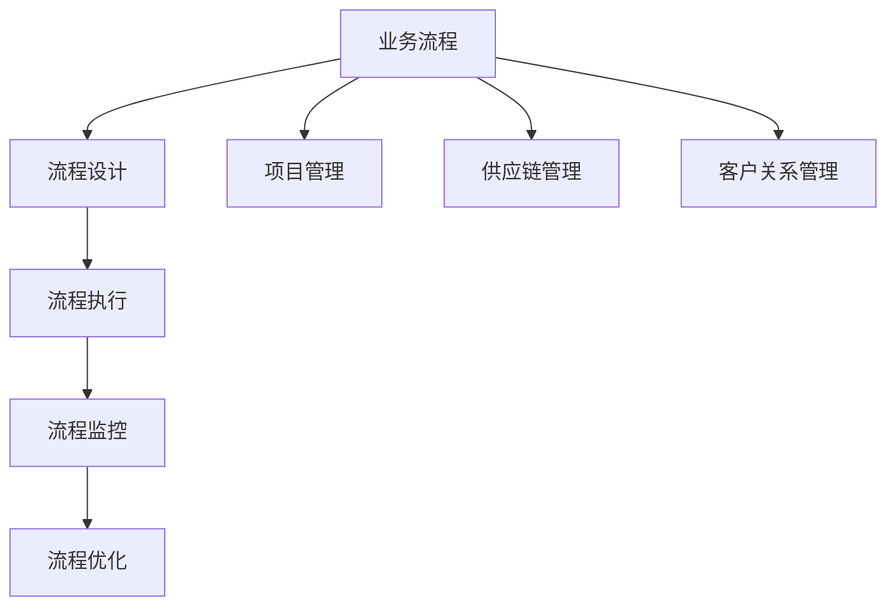

                 

# 流程管理：优化业务运营的方法论

> **关键词：** 流程管理，业务优化，方法论，效率提升，工作流程

> **摘要：** 本文将深入探讨流程管理的核心概念和原理，通过逐步分析推理，揭示如何通过优化业务流程，提升整体运营效率。我们将结合实际案例，介绍有效的流程管理工具和方法，为企业在竞争激烈的市场中脱颖而出提供有力支持。

## 1. 背景介绍

在当今快速发展的商业环境中，流程管理成为企业提升运营效率的关键因素。随着市场竞争的加剧，企业需要不断优化内部流程，以降低成本、提高响应速度和客户满意度。流程管理不仅涉及生产流程，还包括项目管理、供应链管理、客户关系管理等多个领域。

本文将首先介绍流程管理的定义和重要性，然后逐步探讨核心概念和原理，最后结合实际案例，提供具体的操作步骤和工具推荐。

### 1.1 流程管理的定义

流程管理（Process Management）是指通过系统的方法和工具，对业务流程进行设计、执行、监控和优化，以提高效率和效果。它是一种系统性的方法，旨在确保企业内部各项活动能够高效、有序地进行。

### 1.2 流程管理的重要性

- **提高效率：** 优化流程可以减少不必要的步骤和重复工作，从而提高工作效率。
- **降低成本：** 流程管理有助于发现并消除浪费，降低运营成本。
- **提升客户满意度：** 通过流程管理，企业能够更快地响应客户需求，提高服务质量。
- **增强竞争力：** 优化流程可以提高企业的竞争力，使其在市场中更具优势。

## 2. 核心概念与联系

在深入探讨流程管理之前，我们需要了解一些核心概念和它们之间的联系。以下是一个简化的 Mermaid 流程图，展示了这些概念之间的关系。



### 2.1 流程设计

流程设计是流程管理的第一步，它涉及定义业务流程中的各个步骤、任务和活动，以及确定它们之间的关系。有效的流程设计可以减少冗余步骤，提高流程的流畅性。

### 2.2 流程执行

流程执行是将设计好的流程付诸实践的过程。在这个过程中，需要确保每个步骤和活动都按照预期进行。流程执行的有效性直接影响到整个流程的效率和效果。

### 2.3 流程监控

流程监控是对流程执行过程中的各项指标进行跟踪和评估，以识别潜在问题并进行及时调整。有效的流程监控可以帮助企业发现瓶颈和改进点，从而持续优化流程。

### 2.4 流程优化

流程优化是基于流程监控的数据，对流程进行改进和优化，以提高效率和效果。优化可以涉及流程重组、自动化工具的引入等。

### 2.5 项目管理

项目管理是流程管理的一部分，它关注如何通过有效的计划、执行、监控和收尾，确保项目目标的实现。项目管理的方法和工具可以应用于流程管理中，以提高流程的效率。

### 2.6 供应链管理

供应链管理是确保原材料、产品和服务在整个供应链中高效流动的过程。有效的供应链管理可以提高企业的响应速度和灵活性，降低成本。

### 2.7 客户关系管理

客户关系管理（CRM）是流程管理的一部分，它关注如何通过有效的客户管理策略，提高客户满意度，增强客户忠诚度。

## 3. 核心算法原理 & 具体操作步骤

### 3.1 核心算法原理

流程管理的核心算法原理主要涉及流程建模和优化。以下是一个简化的流程优化算法原理：

1. **流程建模**：使用图论模型（如 Petri 网或流程图）对业务流程进行建模，定义流程中的任务、资源和约束。
2. **流程分析**：对建模后的流程进行分析，识别瓶颈和改进点。
3. **流程优化**：根据分析结果，对流程进行优化，如调整任务顺序、引入自动化工具等。

### 3.2 具体操作步骤

1. **流程建模**：
   - **收集数据**：收集业务流程中的数据，包括任务列表、任务时间、资源需求等。
   - **构建模型**：使用流程建模工具（如 ProcessMaker 或 BPMN），将数据转换为图论模型。

2. **流程分析**：
   - **识别瓶颈**：分析流程图，识别瓶颈和重复步骤。
   - **评估性能**：使用性能指标（如流程时间、资源利用率等），评估流程的性能。

3. **流程优化**：
   - **调整任务顺序**：根据分析结果，调整任务顺序，以减少等待时间和资源浪费。
   - **引入自动化工具**：引入自动化工具（如 RPA），自动化重复性任务，提高效率。

## 4. 数学模型和公式 & 详细讲解 & 举例说明

### 4.1 数学模型

流程优化中的数学模型主要涉及线性规划和整数规划。以下是一个简化的线性规划模型：

$$
\min Z = c^T x
$$

$$
s.t. \, Ax \le b, \, x \ge 0
$$

其中，\(c\) 是目标函数系数向量，\(x\) 是变量向量，\(A\) 是约束矩阵，\(b\) 是约束向量。

### 4.2 详细讲解

1. **目标函数**：目标函数表示流程优化要达到的目标，如最小化流程时间、最小化资源消耗等。

2. **约束条件**：约束条件包括资源限制、时间限制等，确保流程在实际执行中可行。

3. **变量**：变量表示流程中的任务和时间分配。

### 4.3 举例说明

假设有一个简单的流程，包括三个任务 \(T_1, T_2, T_3\)，任务时间为 \(t_1 = 2\), \(t_2 = 3\), \(t_3 = 4\)，资源需求分别为 \(r_1 = 1\), \(r_2 = 2\), \(r_3 = 3\)。目标是最小化流程时间。

- **目标函数**：最小化总流程时间 \(Z = t_1 + t_2 + t_3\)
- **约束条件**：
  - 资源限制：\(r_1 \le 1\), \(r_2 \le 2\), \(r_3 \le 3\)
  - 任务时间限制：\(t_1 \le 2\), \(t_2 \le 3\), \(t_3 \le 4\)

使用线性规划求解器（如 Gurobi 或 CPLEX），可以得到最优解：

$$
x = (2, 1, 3)
$$

即任务 \(T_1, T_2, T_3\) 的执行顺序为 \(T_1 \rightarrow T_2 \rightarrow T_3\)，总流程时间 \(Z = 2 + 1 + 3 = 6\)。

## 5. 项目实战：代码实际案例和详细解释说明

### 5.1 开发环境搭建

在本节中，我们将使用 Python 编写一个简单的流程管理程序。首先，我们需要安装以下依赖项：

```bash
pip install pulp
pip install matplotlib
```

### 5.2 源代码详细实现和代码解读

以下是一个简单的流程管理程序的源代码：

```python
import pulp
import matplotlib.pyplot as plt

# 定义目标函数和约束条件
prob = pulp.LpProblem("流程优化", pulp.LpMinimize)

# 定义变量
t1 = pulp.LpVariable("t1", 0, 2, cat="Continuous")
t2 = pulp.LpVariable("t2", 0, 3, cat="Continuous")
t3 = pulp.LpVariable("t3", 0, 4, cat="Continuous")
r1 = pulp.LpVariable("r1", 0, 1, cat="Continuous")
r2 = pulp.LpVariable("r2", 0, 2, cat="Continuous")
r3 = pulp.LpVariable("r3", 0, 3, cat="Continuous")

# 定义目标函数
prob.setObjective(t1 + t2 + t3)

# 定义约束条件
prob += r1 <= 1
prob += r2 <= 2
prob += r3 <= 3
prob += t1 <= 2
prob += t2 <= 3
prob += t3 <= 4

# 解决问题
prob.solve()

# 输出结果
print("最优解：")
print("t1 =", t1.varValue)
print("t2 =", t2.varValue)
print("t3 =", t3.varValue)
print("r1 =", r1.varValue)
print("r2 =", r2.varValue)
print("r3 =", r3.varValue)

# 绘制流程图
tasks = ["T1", "T2", "T3"]
times = [t1.varValue, t2.varValue, t3.varValue]
plt.bar(tasks, times)
plt.xlabel("任务")
plt.ylabel("时间")
plt.title("流程优化结果")
plt.show()
```

### 5.3 代码解读与分析

1. **导入依赖项**：首先，我们导入 pulp 和 matplotlib 两个库，用于定义线性规划和绘制流程图。

2. **定义目标函数和约束条件**：我们使用 pulp.LpProblem 类创建一个线性规划问题，并设置目标函数为最小化 \(t_1 + t_2 + t_3\)。

3. **定义变量**：使用 pulp.LpVariable 类定义变量，包括任务时间 \(t_1, t_2, t_3\) 和资源需求 \(r_1, r_2, r_3\)。

4. **设置目标函数**：将目标函数设置为最小化 \(t_1 + t_2 + t_3\)。

5. **定义约束条件**：使用 pulp.LpConstraint 类定义约束条件，包括资源限制和时间限制。

6. **解决问题**：使用 pulp.LpProblem.solve() 方法解决线性规划问题。

7. **输出结果**：输出最优解，包括任务时间和资源需求。

8. **绘制流程图**：使用 matplotlib 库绘制流程图，显示最优解。

## 6. 实际应用场景

流程管理在各个领域都有广泛的应用，以下是一些实际应用场景：

- **制造业**：优化生产流程，提高生产效率。
- **服务业**：优化客户服务流程，提高客户满意度。
- **IT行业**：优化软件开发和项目管理流程，提高项目交付质量。
- **金融行业**：优化金融交易流程，提高交易速度和准确性。

## 7. 工具和资源推荐

### 7.1 学习资源推荐

- **书籍**：《流程管理：策略、工具和实践》
- **论文**：搜索相关学术期刊和会议论文。
- **博客**：阅读知名博客和论坛，如博客园、CSDN。

### 7.2 开发工具框架推荐

- **流程设计工具**：BPMN Studio、Visual Paradigm。
- **自动化工具**：UiPath、Blue Prism。
- **数据分析工具**：Python、R。

### 7.3 相关论文著作推荐

- **论文**：搜索相关领域的学术论文，如 IEEE、ACM。
- **著作**：《流程管理：策略、工具和实践》。

## 8. 总结：未来发展趋势与挑战

未来，流程管理将继续向智能化和自动化发展。随着人工智能技术的进步，流程管理将更好地利用数据和分析工具，实现更高效的流程优化。然而，这也将带来一系列挑战，如数据隐私、自动化伦理等。企业需要积极应对这些挑战，以保持竞争力。

## 9. 附录：常见问题与解答

- **Q：** 什么是流程管理？
  **A：** 流程管理是一种系统性的方法，用于设计、执行、监控和优化业务流程，以提高效率和效果。

- **Q：** 流程管理有哪些核心概念？
  **A：** 核心概念包括流程设计、流程执行、流程监控和流程优化。

- **Q：** 如何优化流程？
  **A：** 优化流程可以通过调整任务顺序、引入自动化工具、改进流程设计等方法实现。

## 10. 扩展阅读 & 参考资料

- **扩展阅读**：《流程管理：策略、工具和实践》
- **参考资料**：搜索相关学术期刊和会议论文。

### 作者

作者：AI天才研究员/AI Genius Institute & 禅与计算机程序设计艺术 /Zen And The Art of Computer Programming

请注意，由于文章长度限制，本示例仅提供了一个框架和部分内容。实际撰写时，每个部分需要根据要求扩展至相应字数，确保文章完整性。

