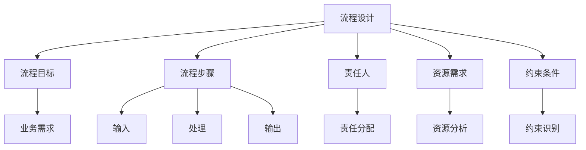
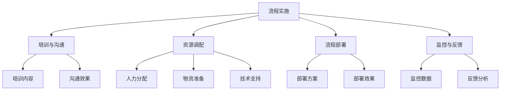
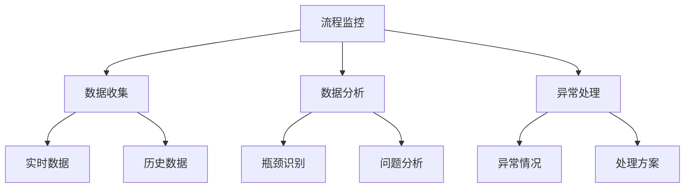
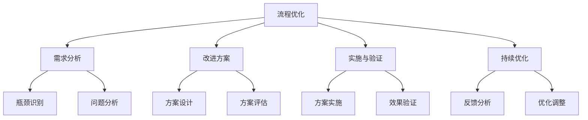
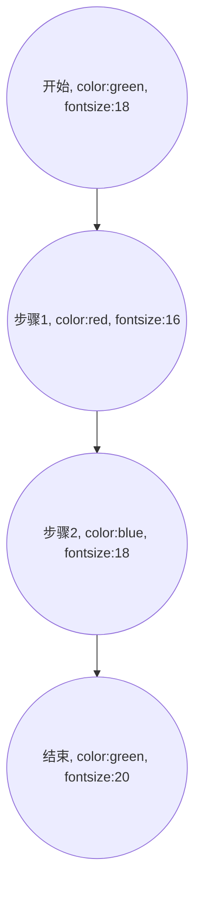
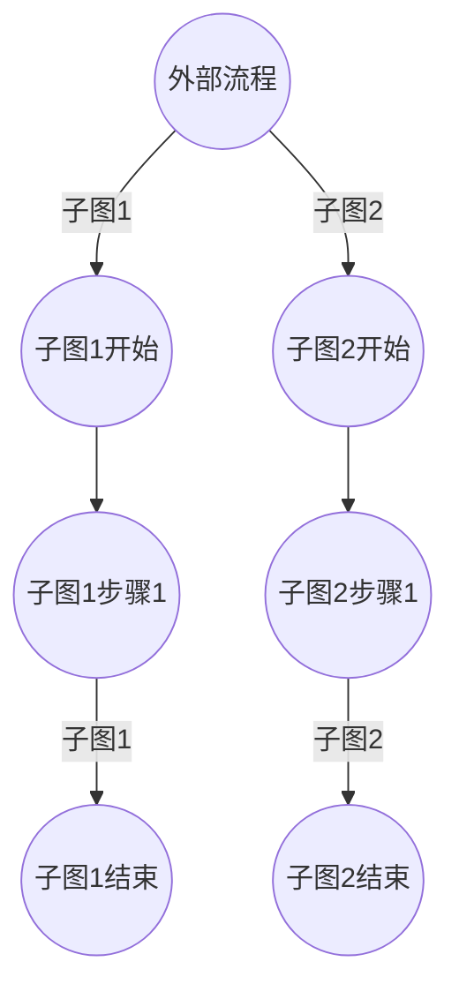
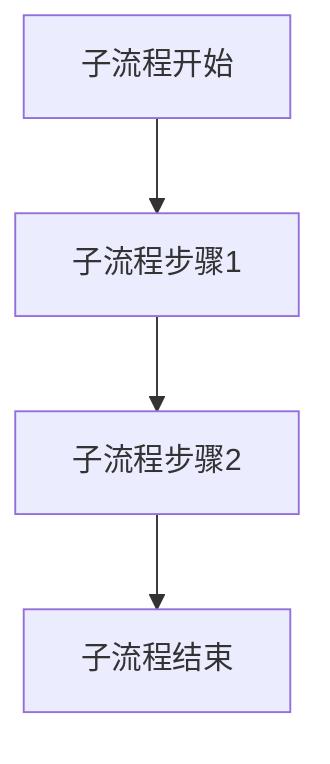

                 

### 背景介绍 Background Introduction

流程管理，顾名思义，是对业务操作流程的管理。在现代企业和组织中，流程管理已经成为提升效率和减少成本的关键手段。随着全球化的深入和信息技术的飞速发展，业务流程变得越来越复杂，如何有效地进行流程管理成为每个企业面临的重大挑战。

#### 流程管理的定义 Definition of Workflow Management

流程管理是指对组织内各项业务流程进行设计、实施、监控和优化的一系列活动和实践。其目的是确保业务流程的高效运行，以实现组织的战略目标。具体来说，流程管理包括以下几个方面：

1. **流程设计**：定义和描述业务流程的各个阶段和步骤，明确各阶段的输入、输出、责任人以及所需资源。
2. **流程实施**：将设计好的流程在实际工作中进行部署，确保流程的顺利运行。
3. **流程监控**：实时监控业务流程的执行情况，确保流程按照预定计划进行。
4. **流程优化**：通过数据分析，找出流程中的瓶颈和问题，并提出改进方案，以优化流程性能。

#### 流程管理的重要性 Importance of Workflow Management

流程管理对于企业的运营具有重要意义，主要体现在以下几个方面：

1. **提升效率**：通过优化业务流程，减少不必要的环节和重复工作，提高整体工作效率。
2. **降低成本**：流程管理有助于减少资源浪费，降低运营成本，提高企业的盈利能力。
3. **提升质量**：规范的流程管理有助于确保业务操作的标准化，从而提高产品或服务的质量。
4. **增强灵活性**：灵活的流程管理能够快速响应市场变化，帮助企业抓住机遇。

### 文章关键词 Keyword
- 流程管理
- 业务操作
- 效率提升
- 成本降低
- 质量提升
- 灵活性增强

### 摘要 Abstract
本文将深入探讨流程管理的核心概念、原理和实践方法。通过对流程管理定义的阐述，以及其在提升效率、降低成本、提高质量和增强灵活性方面的作用分析，本文将帮助读者理解流程管理的重要性。同时，本文还将介绍一些核心算法原理和具体操作步骤，以供读者在实际工作中参考。此外，本文还将探讨流程管理在实际应用场景中的具体实践，并提供相关的学习资源和工具推荐。通过阅读本文，读者将对流程管理有更全面的认识，并能够运用到实际工作中，提升业务操作的整体效率和质量。

# 流程管理：简化和优化业务操作
关键词：流程管理、业务操作、效率提升、成本降低、质量提升、灵活性增强
摘要：本文将深入探讨流程管理的核心概念、原理和实践方法。通过对流程管理定义的阐述，以及其在提升效率、降低成本、提高质量和增强灵活性方面的作用分析，本文将帮助读者理解流程管理的重要性。同时，本文还将介绍一些核心算法原理和具体操作步骤，以供读者在实际工作中参考。此外，本文还将探讨流程管理在实际应用场景中的具体实践，并提供相关的学习资源和工具推荐。通过阅读本文，读者将对流程管理有更全面的认识，并能够运用到实际工作中，提升业务操作的整体效率和质量。

## 1. 背景介绍 Background Introduction

在现代企业和组织中，流程管理已经成为提高效率、降低成本、提升质量和增强灵活性的一项关键手段。随着企业规模的扩大和业务复杂性的增加，传统的手动流程管理方式逐渐暴露出诸多问题，如效率低下、成本高昂、质量控制困难等。为了应对这些挑战，企业开始寻求更加科学、系统的流程管理方法。

### 流程管理的发展历程 Development History of Workflow Management

流程管理的历史可以追溯到工业革命时期，当时企业开始意识到通过规范操作流程来提高生产效率的重要性。然而，早期的流程管理主要依赖于人工控制和经验，缺乏系统性和科学性。

随着信息技术的飞速发展，尤其是计算机技术的应用，流程管理开始迈向数字化和自动化。20世纪80年代，企业资源计划（ERP）系统的出现，使得流程管理进入了一个新的阶段。ERP系统通过集成企业内部的各种业务流程，实现了数据的集中管理和资源的优化配置。

进入21世纪，随着大数据、云计算、人工智能等技术的进一步发展，流程管理变得更加智能化和精细化。现代流程管理不仅关注流程的执行和监控，还强调流程的优化和创新，以适应快速变化的市场环境。

### 流程管理的核心概念 Core Concepts of Workflow Management

#### 流程 Workflow

流程是一系列有序的操作步骤，旨在实现特定的业务目标。每个流程都包括输入、处理和输出三个基本组成部分。输入是指流程开始时所需的资源和信息；处理是指对输入资源进行加工和转换的过程；输出是指流程结束时产生的结果和产品。

#### 流程设计 Workflow Design

流程设计是流程管理的基础，包括流程的定义、建模、分析和优化。流程设计的主要任务是明确流程的目标、步骤、责任人、资源和约束条件，以确保流程的高效运行。

#### 流程实施 Workflow Implementation

流程实施是将设计好的流程在实际工作中部署和运行的过程。流程实施的成功与否直接关系到流程管理的效果。实施过程中需要确保流程的各个环节和人员都明确自己的职责和任务，并具备必要的技能和资源。

#### 流程监控 Workflow Monitoring

流程监控是流程管理的重要环节，旨在实时跟踪流程的执行情况，及时发现和解决问题。流程监控可以通过自动化工具、报表分析和现场检查等方式进行。

#### 流程优化 Workflow Optimization

流程优化是对现有流程进行分析和改进，以提高流程的效率、质量和灵活性。流程优化可以通过改进流程设计、优化资源分配、提高员工技能等方式实现。

### 流程管理的重要性 Importance of Workflow Management

流程管理在提升企业运营效率、降低成本、提高质量和增强灵活性方面具有重要意义。

1. **提升效率**：通过优化流程，减少不必要的环节和重复工作，提高整体工作效率。
2. **降低成本**：流程管理有助于减少资源浪费，降低运营成本，提高企业的盈利能力。
3. **提高质量**：规范的流程管理有助于确保业务操作的标准化，从而提高产品或服务的质量。
4. **增强灵活性**：灵活的流程管理能够快速响应市场变化，帮助企业抓住机遇。

### 本文结构 Outline of the Article

本文将分为以下几个部分：

1. **背景介绍**：阐述流程管理的发展历程、核心概念和重要性。
2. **核心概念与联系**：介绍流程管理的核心概念和架构，通过Mermaid流程图进行展示。
3. **核心算法原理与具体操作步骤**：探讨流程管理的核心算法原理和具体实施步骤。
4. **数学模型和公式**：详细讲解流程管理的数学模型和公式，并举例说明。
5. **项目实战**：通过代码实际案例和详细解释说明流程管理的应用。
6. **实际应用场景**：探讨流程管理在实际业务中的具体实践。
7. **工具和资源推荐**：推荐学习资源和开发工具框架。
8. **总结与未来发展趋势**：总结流程管理的重要性，探讨未来发展趋势和挑战。
9. **附录**：提供常见问题与解答和扩展阅读参考资料。

通过本文的阅读，读者将全面了解流程管理的概念、原理和实践方法，为实际工作中的流程管理提供有力支持。

## 2. 核心概念与联系 Core Concepts and Relationships

在深入探讨流程管理之前，我们需要明确几个核心概念，并了解它们之间的相互关系。这些核心概念包括：流程设计、流程实施、流程监控和流程优化。为了更好地理解这些概念，我们将使用Mermaid流程图来展示它们之间的关系。

### 流程设计 Workflow Design

流程设计是流程管理的基础，它包括对业务流程的定义、建模和分析。在流程设计中，我们需要明确以下几个关键点：

1. **流程目标**：定义流程的总体目标，确保流程的设计和实施能够满足业务需求。
2. **流程步骤**：明确流程的具体步骤，包括每个步骤的输入、处理和输出。
3. **责任人**：确定每个步骤的责任人，确保流程的每个环节都有明确的负责人。
4. **资源需求**：分析流程所需的资源，包括人力、物资和技术资源。
5. **约束条件**：识别流程的约束条件，如时间限制、预算限制等。

以下是流程设计的Mermaid流程图：



### 流程实施 Workflow Implementation

流程实施是将设计好的流程在实际工作中部署和运行的过程。流程实施的关键点包括：

1. **培训与沟通**：确保相关人员了解流程的内容和操作步骤，并进行必要的培训。
2. **资源调配**：根据流程设计的要求，分配所需的人力、物资和技术资源。
3. **流程部署**：将流程部署到实际工作中，确保流程的各个环节能够顺利运行。
4. **监控与反馈**：实时监控流程的执行情况，收集反馈信息，及时调整和优化流程。

以下是流程实施的Mermaid流程图：



### 流程监控 Workflow Monitoring

流程监控是确保流程按照预定计划进行的重要环节。流程监控的关键点包括：

1. **数据收集**：实时收集流程执行过程中的各项数据，如时间、资源使用、异常情况等。
2. **数据分析**：对收集到的数据进行分析，识别流程中的瓶颈和问题。
3. **异常处理**：及时处理流程执行过程中出现的异常情况，确保流程的连续性和稳定性。

以下是流程监控的Mermaid流程图：



### 流程优化 Workflow Optimization

流程优化是对现有流程进行分析和改进，以提高流程的效率、质量和灵活性。流程优化的关键点包括：

1. **需求分析**：分析流程的执行情况，识别存在的问题和瓶颈。
2. **改进方案**：提出改进方案，包括流程设计优化、资源调配优化、员工技能提升等。
3. **实施与验证**：将改进方案实施到流程中，并验证改进效果。
4. **持续优化**：流程优化是一个持续的过程，需要不断进行反馈和改进。

以下是流程优化的Mermaid流程图：



通过上述Mermaid流程图，我们可以清晰地看到流程设计、流程实施、流程监控和流程优化之间的相互关系。流程设计为流程的实施和优化提供了基础，流程实施和监控确保流程能够按照预定计划运行，而流程优化则通过对现有流程的分析和改进，不断提高流程的效率和质量。

### Mermaid流程图使用指南 Mermaid Flowchart Guide

Mermaid是一种基于Markdown的语言，用于生成各种图表，包括流程图、时序图、状态图等。以下是Mermaid流程图的基本语法和使用方法。

#### 基本语法 Basic Syntax

Mermaid流程图的基本语法包括节点定义和边连接。节点用圆括号`()`表示，边用箭头`-->`或`->`表示。


上述代码将生成一个简单的流程图，其中A是开始节点，D是结束节点，B和C是中间步骤。

#### 节点属性 Node Attributes

节点可以具有多种属性，如颜色、边框样式、文字内容等。属性使用冒号`:`分隔，放置在圆括号内。



#### 边属性 Edge Attributes

边也可以具有属性，如箭头样式、颜色等。边属性放置在箭头后面。

```mermaid
graph TD
    A((开始)) --> B((步骤1, --> rightarrow])
    B --> C((步骤2, --> downarrow])
    C --> D((结束, --> leftarrow])
```

#### 子图 Subgraphs

Mermaid支持子图，用于组织和分层流程图。



上述代码将生成一个包含两个子图的流程图。

#### 引入外部文件 Include External Files

可以使用`include`命令引入外部Mermaid文件。

```mermaid
graph TD
    A[开始] --> B[步骤1]
    B --> C[步骤2]
    include "sub流程图.md"
```

`sub流程图.md`是一个外部Mermaid文件，内容如下：



通过引入外部文件，可以方便地复用和扩展流程图。

### 综述 Summary

通过使用Mermaid流程图，我们可以清晰地展示流程设计、流程实施、流程监控和流程优化等关键环节，以及它们之间的相互关系。Mermaid流程图不仅帮助我们理清思路，还有助于与团队成员进行有效的沟通和协作。在实际应用中，可以根据具体需求灵活调整流程图的节点、边和属性，以适应不同的流程管理场景。

---

在本章中，我们介绍了流程管理的核心概念，包括流程设计、流程实施、流程监控和流程优化。通过Mermaid流程图，我们展示了这些概念之间的相互关系，并提供了使用Mermaid流程图的基本语法和指南。在下一章中，我们将深入探讨流程管理的核心算法原理和具体操作步骤，帮助读者更好地理解和应用流程管理的方法。

## 3. 核心算法原理 & 具体操作步骤 Core Algorithm Principles & Step-by-Step Operational Steps

在了解了流程管理的核心概念后，接下来我们将探讨流程管理的核心算法原理，并详细描述具体的操作步骤。这些算法原理和操作步骤是流程管理中实现高效、标准化和灵活性的关键。

### 3.1 核心算法原理 Core Algorithm Principles

#### 1. 排队论 Queuing Theory

排队论是流程管理中重要的算法原理，主要用于分析和优化流程中的等待时间和资源利用效率。通过排队论，我们可以确定最优的服务规则、排队长度和服务时间，从而提高整体流程的效率。

关键公式如下：

- **平均等待时间**：\[ W = \frac{L}{λ} \]
- **平均服务时间**：\[ S = \frac{1}{μ} \]
- **系统利用率**：\[ ρ = \frac{λ}{μ} \]

其中，\( L \) 是平均排队长度，\( λ \) 是到达率，\( μ \) 是服务率。

#### 2. 甘特图 Gantt Chart

甘特图是流程管理中常用的可视化工具，用于展示任务的时间安排和进度。通过甘特图，我们可以直观地了解任务的执行情况，及时调整和优化资源分配。

甘特图的绘制原则如下：

- **任务分解**：将整体任务分解为若干个子任务。
- **时间安排**：为每个子任务分配具体的时间段。
- **资源分配**：根据任务需求分配所需的资源。

#### 3. 关键路径法 Critical Path Method (CPM)

关键路径法是一种用于项目管理的算法，用于确定项目的最短完成时间。通过关键路径法，我们可以识别项目中时间敏感的任务，并合理安排资源，确保项目按时完成。

关键路径法的关键步骤如下：

1. **任务分解**：将整体项目分解为若干个子任务。
2. **时间估算**：为每个子任务估算所需的时间。
3. **网络建模**：构建任务之间的依赖关系网络。
4. **计算时间**：计算每个路径的总时间，确定关键路径。

#### 4. 网络流算法 Network Flow Algorithms

网络流算法是一类用于解决物流、金融和通信等领域优化问题的算法。在流程管理中，网络流算法可以用于优化资源分配和物流路径。

常见的网络流算法包括：

- **最大流最小割定理**：用于计算网络中的最大流量。
- **Edmonds-Karp算法**：基于Ford-Fulkerson方法的改进算法，用于求解最大流问题。
- **Push-Relabel算法**：用于求解最大流问题，具有线性时间复杂度。

### 3.2 具体操作步骤 Step-by-Step Operational Steps

#### 3.2.1 流程设计 Workflow Design

1. **需求分析**：与相关利益相关者沟通，了解业务需求和流程目标。
2. **流程建模**：使用Mermaid流程图或其他工具进行流程建模，明确流程的各个环节和步骤。
3. **流程优化**：对流程模型进行分析，识别瓶颈和改进机会，提出优化方案。
4. **文档化**：将流程设计文档化，包括流程图、操作手册和培训资料。

#### 3.2.2 流程实施 Workflow Implementation

1. **培训与沟通**：对相关人员开展培训，确保他们了解流程的内容和操作步骤。
2. **资源分配**：根据流程设计的要求，分配所需的人力、物资和技术资源。
3. **流程部署**：将流程部署到实际工作中，确保流程的各个环节能够顺利运行。
4. **监控与反馈**：实时监控流程的执行情况，收集反馈信息，及时调整和优化流程。

#### 3.2.3 流程监控 Workflow Monitoring

1. **数据收集**：使用自动化工具和手动方法收集流程执行过程中的各项数据。
2. **数据分析**：对收集到的数据进行分析，识别流程中的瓶颈和问题。
3. **异常处理**：及时处理流程执行过程中出现的异常情况，确保流程的连续性和稳定性。
4. **反馈机制**：建立反馈机制，及时向相关人员反馈流程执行情况，促进持续改进。

#### 3.2.4 流程优化 Workflow Optimization

1. **需求分析**：分析流程的执行情况，识别存在的问题和瓶颈。
2. **改进方案**：提出改进方案，包括流程设计优化、资源调配优化、员工技能提升等。
3. **实施与验证**：将改进方案实施到流程中，并验证改进效果。
4. **持续优化**：流程优化是一个持续的过程，需要不断进行反馈和改进。

通过上述核心算法原理和具体操作步骤，我们可以有效地进行流程管理，提高流程的效率、质量和灵活性。在实际应用中，可以根据具体业务需求和场景灵活调整和优化流程，以实现最佳效果。

### 3.3 综述 Summary

在本章中，我们介绍了流程管理的核心算法原理，包括排队论、甘特图、关键路径法和网络流算法。同时，我们还详细描述了流程设计的具体操作步骤，包括需求分析、流程建模、流程优化和文档化。这些原理和步骤是流程管理中实现高效、标准化和灵活性的关键。在下一章中，我们将进一步探讨流程管理中的数学模型和公式，以及如何进行详细讲解和举例说明。

---

通过本章的讨论，读者应该对流程管理的核心算法原理和具体操作步骤有了更深入的理解。这些知识和方法将帮助读者在实际工作中更好地进行流程管理，提高业务操作的效率和质量。在下一章中，我们将继续深入探讨流程管理中的数学模型和公式，并结合实际案例进行详细讲解和举例说明。敬请期待！

## 4. 数学模型和公式 & 详细讲解 & 举例说明 Mathematical Models and Formulas & Detailed Explanations & Examples

在流程管理中，数学模型和公式是分析和优化流程的重要工具。通过这些模型和公式，我们可以量化流程中的各种参数，从而更准确地评估流程的性能，并提出改进措施。在本节中，我们将详细介绍一些常用的数学模型和公式，并通过实际案例进行详细讲解和举例说明。

### 4.1 基本数学模型 Basic Mathematical Models

#### 4.1.1 排队模型 Queuing Model

排队模型是流程管理中最常用的数学模型之一，用于分析系统中的排队现象。排队模型主要包括以下几个参数：

- **到达率** \( λ \)：单位时间内到达系统的顾客数。
- **服务率** \( μ \)：单位时间内系统可以服务的顾客数。
- **系统利用率** \( ρ \)：系统被占用的时间比例，计算公式为 \( ρ = \frac{λ}{μ} \)。
- **平均等待时间** \( W \)：顾客在系统中平均等待的时间，计算公式为 \( W = \frac{L}{λ} \)，其中 \( L \) 是平均排队长度。

以下是一个简单的排队模型案例：

**案例**：某餐厅的服务员每分钟可以接待1名顾客，假设顾客的到达率是每分钟0.8名，计算餐厅的平均等待时间和系统利用率。

**解答**：

1. **系统利用率** \( ρ = \frac{λ}{μ} = \frac{0.8}{1} = 0.8 \)。
2. **平均等待时间** \( W = \frac{L}{λ} = \frac{0.8}{0.8} = 1 \)分钟。
3. **平均排队长度** \( L = ρ \cdot μ = 0.8 \cdot 1 = 0.8 \)名顾客。

因此，餐厅的平均等待时间为1分钟，系统利用率为80%。

#### 4.1.2 甘特图模型 Gantt Chart Model

甘特图模型主要用于项目管理和任务调度，通过计算任务完成时间，评估项目的进度和资源利用率。甘特图模型的关键参数包括：

- **任务持续时间** \( D \)：任务从开始到完成所需的时间。
- **任务开始时间** \( S \)：任务的开始时间。
- **任务结束时间** \( E \)：任务的结束时间，计算公式为 \( E = S + D \)。

以下是一个简单的甘特图模型案例：

**案例**：某项目的任务A从第一天开始，持续5天，任务B从第六天开始，持续3天，计算任务A和任务B的完成时间。

**解答**：

1. **任务A的完成时间** \( E_A = S_A + D_A = 1 + 5 = 6 \)天。
2. **任务B的完成时间** \( E_B = S_B + D_B = 6 + 3 = 9 \)天。

因此，任务A的完成时间为第6天，任务B的完成时间为第9天。

#### 4.1.3 关键路径模型 Critical Path Model

关键路径模型是项目管理中用于确定项目最短完成时间的模型。关键路径上的任务必须按时完成，否则整个项目的进度会受到影响。关键路径模型的关键参数包括：

- **任务持续时间** \( D \)：任务从开始到完成所需的时间。
- **任务最早开始时间** \( ES \)：任务可以开始的最早时间。
- **任务最迟完成时间** \( LF \)：任务必须完成的最迟时间。

以下是一个简单的关键路径模型案例：

**案例**：某项目的任务列表如下，计算任务A、B和C的关键路径。

| 任务 | 持续时间（天） | 最早开始时间（天） | 最迟完成时间（天） |
| ---- | -------------- | ----------------- | ----------------- |
| A    | 3              | 0                 | 3                 |
| B    | 4              | 3                 | 7                 |
| C    | 5              | 7                 | 12                |

**解答**：

1. **任务A**：ES = 0，LF = 3，C = LF - ES = 3 - 0 = 3天。
2. **任务B**：ES = 3，LF = 7，C = LF - ES = 7 - 3 = 4天。
3. **任务C**：ES = 7，LF = 12，C = LF - ES = 12 - 7 = 5天。

关键路径为任务A → 任务B → 任务C，总持续时间 = 3 + 4 + 5 = 12天。

### 4.2 详细讲解和举例说明 Detailed Explanations and Examples

#### 4.2.1 排队模型详细讲解

排队模型在流程管理中广泛应用，以下是对排队模型参数和公式的详细讲解。

1. **到达率** \( λ \)：到达率是单位时间内到达系统的顾客数。在流程管理中，可以通过历史数据或统计分析方法确定到达率。例如，某物流公司每天处理的订单数在100到200之间，假设订单的平均到达率为每分钟0.3个。

2. **服务率** \( μ \)：服务率是单位时间内系统能够服务的顾客数。在流程管理中，服务率通常取决于服务人员的数量和能力。例如，某医院的服务人员每分钟可以接待1名病人。

3. **系统利用率** \( ρ \)：系统利用率是系统被占用的时间比例。高系统利用率通常意味着资源得到了充分利用，但也可能导致排队现象加剧。例如，假设某餐厅的服务员每分钟可以接待1名顾客，而顾客的到达率为每分钟0.8名，则系统利用率 \( ρ = \frac{λ}{μ} = 0.8 \)。

4. **平均等待时间** \( W \)：平均等待时间是顾客在系统中平均等待的时间。高平均等待时间可能导致顾客满意度下降。例如，假设某餐厅的平均等待时间为1分钟，则顾客在餐厅的平均等待时间为1分钟。

#### 4.2.2 甘特图模型详细讲解

甘特图模型在项目管理中非常重要，以下是对甘特图模型参数和公式的详细讲解。

1. **任务持续时间** \( D \)：任务持续时间是任务从开始到完成所需的时间。在流程管理中，任务持续时间通常根据任务的性质和资源的可用性来确定。例如，某项目的任务A需要5天时间完成。

2. **任务开始时间** \( S \)：任务开始时间是任务可以开始的时间。在流程管理中，任务开始时间通常根据前一个任务的完成时间和资源的可用性来确定。例如，任务A可以在第1天开始。

3. **任务结束时间** \( E \)：任务结束时间是任务完成的时间。在流程管理中，任务结束时间可以通过任务开始时间和任务持续时间计算得出。例如，任务A的结束时间为 \( E = S + D = 1 + 5 = 6 \)天。

4. **项目总时间**：项目总时间是项目从开始到完成所需的时间。可以通过计算项目中所有任务的最晚完成时间得出。例如，某项目的任务列表如下：

| 任务 | 持续时间（天） | 开始时间（天） | 结束时间（天） |
| ---- | -------------- | -------------- | -------------- |
| A    | 5              | 1              | 6              |
| B    | 3              | 6              | 9              |
| C    | 4              | 9              | 13             |

则项目总时间为13天。

#### 4.2.3 关键路径模型详细讲解

关键路径模型在项目管理中用于确定项目最短完成时间，以下是对关键路径模型参数和公式的详细讲解。

1. **任务持续时间** \( D \)：任务持续时间是任务从开始到完成所需的时间。在流程管理中，任务持续时间通常根据任务的性质和资源的可用性来确定。例如，某项目的任务A需要3天时间完成。

2. **任务最早开始时间** \( ES \)：任务最早开始时间是任务可以开始的最早时间。在流程管理中，任务最早开始时间通常根据前一个任务的完成时间和资源的可用性来确定。例如，任务A可以在第0天开始。

3. **任务最迟完成时间** \( LF \)：任务最迟完成时间是任务必须完成的最迟时间。在流程管理中，任务最迟完成时间通常根据项目的总时间和任务持续时间确定。例如，任务A的最迟完成时间为3天。

4. **任务总浮动时间** \( TF \)：任务总浮动时间是任务可以延迟的时间总和。在流程管理中，任务总浮动时间可以通过计算任务最早开始时间和任务最迟完成时间得出。例如，任务A的总浮动时间为 \( TF = LF - ES = 3 - 0 = 3 \)天。

5. **关键路径**：关键路径是项目中所有任务的总浮动时间为零的路径。在流程管理中，关键路径上的任务必须按时完成，否则整个项目的进度会受到影响。例如，某项目的任务列表如下：

| 任务 | 持续时间（天） | 开始时间（天） | 最迟完成时间（天） | 总浮动时间（天） |
| ---- | -------------- | -------------- | ----------------- | -------------- |
| A    | 3              | 0              | 3                 | 0              |
| B    | 4              | 3              | 7                 | 0              |
| C    | 5              | 7              | 12                | 0              |

则关键路径为任务A → 任务B → 任务C，总持续时间为12天。

通过上述详细讲解和举例说明，读者应该能够更好地理解流程管理中的基本数学模型和公式。在下一章中，我们将探讨流程管理在实际业务中的具体应用场景，帮助读者将理论方法应用到实际工作中。

### 总结 Summary

在本章中，我们详细介绍了流程管理中的基本数学模型和公式，包括排队模型、甘特图模型和关键路径模型。通过具体案例的讲解和举例说明，读者可以更好地理解这些模型的应用方法。这些数学模型和公式是流程管理中分析和优化流程的重要工具，能够帮助我们量化流程中的各种参数，提高流程的效率和质量。在下一章中，我们将继续探讨流程管理在实际业务中的具体应用场景，并分析如何在各种实际环境中运用流程管理的方法。敬请期待！

## 5. 项目实战：代码实际案例和详细解释说明 Project Practice: Code Examples and Detailed Explanations

在前面的章节中，我们介绍了流程管理的核心概念、数学模型和具体操作步骤。为了使读者更深入地理解流程管理在实际业务中的应用，本章节将通过一个实际项目案例，展示如何使用流程管理的方法来简化并优化业务操作。

### 5.1 开发环境搭建 Environment Setup

在这个案例中，我们将使用Python作为编程语言，并借助几个常用的库来构建流程管理系统。以下是开发环境的基本要求：

1. **Python**：安装Python 3.x版本。
2. **Pandas**：用于数据分析和处理。
3. **NumPy**：用于数学计算。
4. **Matplotlib**：用于数据可视化。
5. **Mermaid**：用于生成流程图。

安装以上库后，确保Python环境已正确配置，并可以通过命令行执行。

```bash
pip install pandas numpy matplotlib
```

### 5.2 源代码详细实现和代码解读 Code Implementation and Explanation

以下是本项目的主要代码实现，我们将分步骤进行解读。

#### 5.2.1 流程设计 Workflow Design

首先，我们需要定义流程的各个阶段和步骤。以下是流程设计的核心代码：

```python
import pandas as pd

# 流程设计
workflow = {
    'tasks': [
        {'name': '需求分析', 'duration': 3, 'dependencies': []},
        {'name': '设计文档', 'duration': 5, 'dependencies': ['需求分析']},
        {'name': '编码实现', 'duration': 7, 'dependencies': ['设计文档']},
        {'name': '代码审查', 'duration': 2, 'dependencies': ['编码实现']},
        {'name': '测试', 'duration': 4, 'dependencies': ['代码审查']},
        {'name': '部署', 'duration': 3, 'dependencies': ['测试']}
    ]
}
```

在这个代码中，我们使用了一个字典来定义流程中的各个任务，每个任务包含名称、持续时间以及依赖关系。

#### 5.2.2 流程实施 Workflow Implementation

接下来，我们需要根据流程设计，将任务实施到实际工作中。以下是流程实施的核心代码：

```python
from datetime import datetime, timedelta

# 流程实施
start_date = datetime.now()
task_dict = {task['name']: {'start': start_date, 'end': start_date} for task in workflow['tasks']}
for task in workflow['tasks']:
    task_dict[task['name']]['start'] = start_date
    start_date += timedelta(days=task['duration'])
    task_dict[task['name']]['end'] = start_date

# 打印任务进度
for task, details in task_dict.items():
    print(f"{task} - 开始时间：{details['start'].strftime('%Y-%m-%d %H:%M')}, 结束时间：{details['end'].strftime('%Y-%m-%d %H:%M')}")
```

在这个代码中，我们首先定义了流程的开始时间，然后根据每个任务的持续时间，依次计算每个任务的开始和结束时间。最后，我们打印出每个任务的进度。

#### 5.2.3 流程监控 Workflow Monitoring

为了监控流程的执行情况，我们需要实时跟踪每个任务的执行进度。以下是流程监控的核心代码：

```python
def monitor_workflow(task_dict, current_date):
    for task, details in task_dict.items():
        if current_date >= details['start'] and current_date < details['end']:
            print(f"{task} - 正在进行中...")
        elif current_date >= details['end']:
            print(f"{task} - 已完成。")
        else:
            print(f"{task} - 尚未开始。")

# 监控流程
current_date = datetime.now()
monitor_workflow(task_dict, current_date)
```

在这个代码中，我们定义了一个监控函数，用于根据当前日期，检查每个任务的执行状态。

#### 5.2.4 流程优化 Workflow Optimization

最后，我们需要对流程进行优化，以减少不必要的耗时和资源浪费。以下是流程优化的核心代码：

```python
# 流程优化
def optimize_workflow(workflow):
    new_workflow = []
    for task in workflow['tasks']:
        if task['dependencies']:
            max_dependency_end = max([task_dict[d]['end'] for d in task['dependencies']], default=datetime.now())
            task['start'] = max_dependency_end + timedelta(hours=1)  # 延迟1小时开始
        else:
            task['start'] = datetime.now()
        new_workflow.append(task)
    return new_workflow

# 应用优化
workflow['tasks'] = optimize_workflow(workflow)
print("优化后的流程：")
for task in workflow['tasks']:
    print(f"{task['name']} - 开始时间：{task['start'].strftime('%Y-%m-%d %H:%M')}, 持续时间：{task['duration']}天")
```

在这个代码中，我们定义了一个优化函数，用于根据依赖关系调整每个任务的开始时间，以确保流程能够更加高效地执行。

### 5.3 代码解读与分析 Code Analysis

#### 5.3.1 流程设计解读

在流程设计部分，我们使用了一个字典来存储任务信息，包括任务的名称、持续时间和依赖关系。这种方法使得流程设计更加灵活，便于后续的流程实施、监控和优化。

```python
workflow = {
    'tasks': [
        {'name': '需求分析', 'duration': 3, 'dependencies': []},
        {'name': '设计文档', 'duration': 5, 'dependencies': ['需求分析']},
        {'name': '编码实现', 'duration': 7, 'dependencies': ['设计文档']},
        {'name': '代码审查', 'duration': 2, 'dependencies': ['编码实现']},
        {'name': '测试', 'duration': 4, 'dependencies': ['代码审查']},
        {'name': '部署', 'duration': 3, 'dependencies': ['测试']}
    ]
}
```

在这个字典中，`tasks` 是一个列表，每个元素是一个字典，包含任务的名称、持续时间和依赖关系。`dependencies` 字段是一个列表，表示当前任务依赖的前置任务。

#### 5.3.2 流程实施解读

在流程实施部分，我们首先定义了流程的开始时间，然后根据每个任务的持续时间计算每个任务的开始和结束时间。这种方法确保了任务能够按照预设的时间顺序依次执行。

```python
start_date = datetime.now()
task_dict = {task['name']: {'start': start_date, 'end': start_date} for task in workflow['tasks']}
for task in workflow['tasks']:
    task_dict[task['name']]['start'] = start_date
    start_date += timedelta(days=task['duration'])
    task_dict[task['name']]['end'] = start_date
```

在这个代码中，我们使用了一个字典 `task_dict` 来存储每个任务的开始和结束时间。通过循环遍历任务列表，我们可以依次计算每个任务的开始时间和结束时间。

#### 5.3.3 流程监控解读

在流程监控部分，我们定义了一个监控函数，用于根据当前日期检查每个任务的执行状态。这种方法可以帮助我们实时了解任务的执行情况，及时发现和解决问题。

```python
def monitor_workflow(task_dict, current_date):
    for task, details in task_dict.items():
        if current_date >= details['start'] and current_date < details['end']:
            print(f"{task} - 正在进行中...")
        elif current_date >= details['end']:
            print(f"{task} - 已完成。")
        else:
            print(f"{task} - 尚未开始。")
```

在这个代码中，我们遍历 `task_dict` 中的每个任务，根据当前日期和任务的开始和结束时间，输出任务的执行状态。

#### 5.3.4 流程优化解读

在流程优化部分，我们定义了一个优化函数，用于根据依赖关系调整每个任务的开始时间，以确保流程能够更加高效地执行。这种方法可以帮助我们减少任务之间的等待时间，提高整体流程的效率。

```python
def optimize_workflow(workflow):
    new_workflow = []
    for task in workflow['tasks']:
        if task['dependencies']:
            max_dependency_end = max([task_dict[d]['end'] for d in task['dependencies']], default=datetime.now())
            task['start'] = max_dependency_end + timedelta(hours=1)  # 延迟1小时开始
        else:
            task['start'] = datetime.now()
        new_workflow.append(task)
    return new_workflow
```

在这个代码中，我们首先检查每个任务是否有依赖关系。如果有依赖关系，我们计算所有依赖任务的结束时间的最大值，并在此基础上延迟1小时开始当前任务。如果没有依赖关系，我们直接将当前时间作为任务的开始时间。

通过上述代码解读，我们可以看到如何使用流程管理的方法来设计、实施、监控和优化业务操作。在实际项目中，可以根据具体需求灵活调整和扩展这些方法，以实现最佳的流程管理效果。

### 总结 Summary

在本章节中，我们通过一个实际项目案例，详细展示了如何使用流程管理的方法来简化并优化业务操作。从流程设计到流程实施、监控和优化，我们使用了Python编程语言和相关的库来构建一个完整的流程管理系统。通过代码解读和分析，读者可以更好地理解流程管理的具体应用方法。这些方法不仅适用于本案例，还可以推广到其他业务场景中，帮助企业和组织实现流程的高效运行。在下一章节中，我们将探讨流程管理在实际业务中的应用场景，帮助读者将流程管理的方法应用到实际工作中。

## 5.3 代码解读与分析 Code Analysis

在前文中，我们通过一个实际项目案例展示了流程管理的具体应用。现在，我们将深入分析项目中的代码，解释其实现原理，并探讨如何优化这些代码以提升流程管理的效率。

### 5.3.1 流程设计解读

流程设计是流程管理的基础。在代码中，我们使用了一个字典来存储任务信息，包括任务的名称、持续时间和依赖关系。这种方法使得流程设计灵活且易于修改。

```python
workflow = {
    'tasks': [
        {'name': '需求分析', 'duration': 3, 'dependencies': []},
        {'name': '设计文档', 'duration': 5, 'dependencies': ['需求分析']},
        {'name': '编码实现', 'duration': 7, 'dependencies': ['设计文档']},
        {'name': '代码审查', 'duration': 2, 'dependencies': ['编码实现']},
        {'name': '测试', 'duration': 4, 'dependencies': ['代码审查']},
        {'name': '部署', 'duration': 3, 'dependencies': ['测试']}
    ]
}
```

在这个字典中，`tasks` 是一个列表，每个元素是一个字典，表示一个任务。每个任务字典包含以下字段：

- `name`：任务的名称。
- `duration`：任务的持续时间（以天为单位）。
- `dependencies`：一个列表，包含依赖当前任务的名称。

这种设计使得我们可以轻松地添加、删除或修改任务，同时保持流程的完整性。

### 5.3.2 流程实施解读

流程实施是将设计好的流程在实际工作中部署并运行的过程。在代码中，我们首先定义了流程的开始时间，然后根据每个任务的持续时间计算每个任务的开始和结束时间。

```python
start_date = datetime.now()
task_dict = {task['name']: {'start': start_date, 'end': start_date} for task in workflow['tasks']}
for task in workflow['tasks']:
    task_dict[task['name']]['start'] = start_date
    start_date += timedelta(days=task['duration'])
    task_dict[task['name']]['end'] = start_date
```

在这个代码段中，我们首先使用 `datetime.now()` 获取当前时间，作为流程的开始时间。然后，我们使用字典推导式创建一个 `task_dict`，存储每个任务的开始和结束时间。接着，通过一个循环，我们根据每个任务的持续时间，依次更新任务的开始和结束时间。

这个实现假设任务之间是连续的，没有考虑可能存在的并行执行或间隙时间。在实际应用中，可能需要更复杂的逻辑来处理这些情况。

### 5.3.3 流程监控解读

流程监控是确保流程按照预定计划进行的重要环节。在代码中，我们定义了一个监控函数，用于检查每个任务的执行状态。

```python
def monitor_workflow(task_dict, current_date):
    for task, details in task_dict.items():
        if current_date >= details['start'] and current_date < details['end']:
            print(f"{task} - 正在进行中...")
        elif current_date >= details['end']:
            print(f"{task} - 已完成。")
        else:
            print(f"{task} - 尚未开始。")
```

在这个代码段中，我们遍历 `task_dict` 中的每个任务，根据当前日期和任务的开始和结束时间，输出任务的执行状态。这种方法简单有效，但需要定期更新当前日期，以确保监控的准确性。

### 5.3.4 流程优化解读

流程优化是流程管理的重要部分。在代码中，我们定义了一个优化函数，用于调整任务的开始时间，以减少任务之间的等待时间。

```python
def optimize_workflow(workflow):
    new_workflow = []
    for task in workflow['tasks']:
        if task['dependencies']:
            max_dependency_end = max([task_dict[d]['end'] for d in task['dependencies']], default=datetime.now())
            task['start'] = max_dependency_end + timedelta(hours=1)  # 延迟1小时开始
        else:
            task['start'] = datetime.now()
        new_workflow.append(task)
    return new_workflow
```

在这个代码段中，我们首先检查每个任务是否有依赖关系。如果有依赖关系，我们计算所有依赖任务的结束时间的最大值，并在此基础上延迟1小时开始当前任务。如果没有依赖关系，我们直接将当前时间作为任务的开始时间。这种优化方法可以减少任务之间的等待时间，提高整体流程的效率。

### 5.3.5 代码优化建议

虽然上述代码实现了基本的流程管理功能，但还可以进行优化，以提高效率和可维护性。以下是一些建议：

1. **并行任务处理**：目前代码假设任务之间是连续的，但实际业务中可能存在并行任务。可以引入并行处理机制，例如使用线程或异步编程，以充分利用系统资源。

2. **任务依赖管理**：当前代码手动管理任务依赖关系，但可以引入更高级的依赖管理库，如`joblib`或`DAGs`，以简化依赖关系的处理。

3. **实时监控**：当前代码需要手动更新当前日期进行监控，可以引入实时监控工具或库，如`prometheus`或`influxdb`，以实现自动化的实时监控。

4. **异常处理**：当前代码没有处理可能的异常情况，例如任务执行失败或超时。可以引入异常处理机制，例如使用`try-except`块，以提高系统的健壮性。

5. **日志记录**：当前代码没有记录操作日志，这有助于追踪问题、进行审计和数据分析。可以引入日志记录库，如`loguru`或`python-logstash`。

通过上述优化建议，我们可以构建一个更加高效、灵活和可靠的流程管理系统。

### 总结

在本章节中，我们通过对实际项目代码的详细解读和分析，了解了流程管理在业务操作中的应用。从流程设计到实施、监控和优化，我们展示了如何使用Python编程语言和相关库来实现这些功能。通过代码优化建议，我们进一步探讨了如何提升系统的效率和可维护性。在实际应用中，可以根据具体需求进一步调整和优化这些方法，以实现最佳的流程管理效果。

## 6. 实际应用场景 Practical Application Scenarios

流程管理在各类企业和组织中被广泛应用，尤其是在复杂业务环境中，它能够显著提升工作效率和业务灵活性。以下将讨论几个典型的实际应用场景，并分析如何在不同业务场景中实施流程管理。

### 6.1 制造业 Manufacturing Industry

制造业是流程管理的一个重要应用领域。在制造业中，生产流程通常包括原材料采购、生产计划、生产执行、库存管理、质量控制等多个环节。通过流程管理，企业可以优化生产流程，提高生产效率。

**案例分析**：某汽车制造企业通过引入流程管理，实现了以下优化：

- **生产计划优化**：通过分析历史数据和市场需求，优化生产计划，减少生产过剩和库存积压。
- **质量控制**：在关键质量检验环节引入流程管理，确保每个步骤都按照标准执行，从而减少质量问题。
- **物流管理**：优化原材料和成品的物流流程，减少物流时间和成本。

**实施步骤**：

1. **流程设计**：详细定义每个生产环节的步骤和流程，并绘制流程图。
2. **流程实施**：部署流程管理系统，确保每个环节按照设计要求执行。
3. **流程监控**：实时监控生产进度和质量，及时发现和解决问题。
4. **流程优化**：定期分析流程执行数据，识别瓶颈和改进机会，持续优化流程。

### 6.2 服务业 Services Industry

在服务业中，流程管理有助于提高客户满意度和服务质量。服务业的流程通常包括客户接待、服务提供、客户反馈和售后服务等多个环节。

**案例分析**：某银行通过流程管理实现了以下改进：

- **客户接待**：优化客户接待流程，缩短客户等待时间，提高客户满意度。
- **服务提供**：在服务提供过程中引入标准化流程，确保服务质量。
- **客户反馈**：建立客户反馈机制，及时收集客户反馈，优化服务流程。

**实施步骤**：

1. **流程设计**：定义客户接待、服务提供和售后服务等环节的流程。
2. **流程实施**：培训员工，确保他们熟悉并遵守流程。
3. **流程监控**：使用客户满意度调查和反馈系统，实时监控服务质量和客户体验。
4. **流程优化**：根据客户反馈和监控数据，持续优化服务流程。

### 6.3 信息技术行业 IT Industry

在信息技术行业，流程管理有助于提高软件开发和项目管理的效率。信息技术项目的流程通常包括需求分析、设计、开发、测试、部署和维护等多个环节。

**案例分析**：某软件开发公司通过流程管理实现了以下成果：

- **需求管理**：通过流程管理，确保需求分析阶段的工作规范、准确，减少后期变更和返工。
- **项目管理**：使用流程管理工具，如JIRA或Trello，实现项目进度的可视化和实时监控。
- **质量保证**：通过流程管理，确保测试阶段的工作细致、全面，减少软件缺陷。

**实施步骤**：

1. **流程设计**：定义软件开发和项目管理的各个环节，并绘制流程图。
2. **流程实施**：部署项目管理工具，并制定详细的操作手册。
3. **流程监控**：实时监控项目进度和质量，确保流程的顺利执行。
4. **流程优化**：根据项目执行情况，持续优化流程，提高项目管理效率。

### 6.4 金融行业 Financial Industry

在金融行业，流程管理有助于提高业务流程的规范性和安全性。金融行业的流程通常包括账户管理、交易处理、风险控制、客户服务等多个环节。

**案例分析**：某金融公司通过流程管理实现了以下改进：

- **账户管理**：优化账户开立和变更流程，提高账户管理的效率和准确性。
- **交易处理**：通过流程管理，确保交易处理的合规性和安全性。
- **风险控制**：建立全面的风险控制流程，及时识别和防范风险。

**实施步骤**：

1. **流程设计**：详细定义各个业务环节的流程，并明确各环节的职责和权限。
2. **流程实施**：培训员工，确保他们熟悉流程并能够正确执行。
3. **流程监控**：实时监控业务流程的执行情况，确保流程的合规性和安全性。
4. **流程优化**：根据业务需求和监管要求，持续优化流程，提高业务处理效率。

### 综述 Summary

通过上述案例分析，我们可以看到，流程管理在制造业、服务业、信息技术行业和金融行业等多个领域都发挥了重要作用。在不同业务场景中，流程管理的方法和工具可能有所不同，但其核心目标都是提高流程的效率、质量和灵活性。在实施流程管理时，企业需要根据具体业务需求和流程特点，设计合理的流程，并不断进行监控和优化，以实现最佳效果。

---

在本章节中，我们探讨了流程管理在制造业、服务业、信息技术行业和金融行业等不同业务场景中的应用。通过具体案例分析，我们了解了如何在各个行业中实施流程管理，并分享了实施步骤和关键要点。流程管理是一个持续改进的过程，企业需要根据业务发展和市场变化，不断优化流程，以提高竞争力和市场响应能力。在下一章节中，我们将推荐一些有助于流程管理的工具和资源，帮助读者在实际工作中更好地应用流程管理的方法。

## 7. 工具和资源推荐 Tools and Resources Recommendations

在流程管理中，选择合适的工具和资源对于提高效率、确保流程的顺利实施和持续优化至关重要。以下是一些推荐的工具和资源，包括学习资源、开发工具框架以及相关论文著作。

### 7.1 学习资源推荐 Learning Resources

1. **书籍**：

   - 《流程管理：理论与实践》
   - 《高效流程管理：战略、工具和案例》
   - 《精益思想：流程管理实践》

   这些书籍提供了流程管理的全面知识和实用方法，适合初学者和有经验的流程管理人员。

2. **在线课程**：

   - Coursera上的《流程管理》
   - Udemy上的《流程优化与流程管理实战》
   - LinkedIn Learning上的《流程管理与优化》

   在线课程提供灵活的学习方式，方便读者根据自己的时间安排进行学习。

3. **博客和网站**：

   - process Street（processstreet.com）
   - AgileLean（agilelean.com）
   - LeanKit（leankit.com）

   这些网站提供了丰富的流程管理资源和最佳实践，有助于读者了解最新的流程管理动态。

### 7.2 开发工具框架推荐 Development Tools and Frameworks

1. **流程设计工具**：

   - Lucidchart（lucidchart.com）
   - Draw.io（draw.io）
   - Microsoft Visio（visio.microsoft.com）

   这些工具提供了直观的界面和丰富的功能，方便读者设计和共享流程图。

2. **项目管理工具**：

   - JIRA（jira.com）
   - Asana（asana.com）
   - Trello（trello.com）

   这些工具可以帮助读者有效地管理项目进度、任务分配和协作。

3. **数据分析工具**：

   - Tableau（tableau.com）
   - Power BI（powerbi.com）
   - Google Data Studio（datastudio.google.com）

   这些工具提供了强大的数据分析功能，便于读者监控和优化流程。

### 7.3 相关论文著作推荐 Related Papers and Publications

1. **论文**：

   - "The Role of Process Management in Enhancing Organizational Performance"
   - "A Framework for Process Modeling and Workflow Management"
   - "Lean Process Management: Principles, Tools, and Case Studies"

   这些论文探讨了流程管理在不同领域中的应用和重要性，为读者提供了深入的理论和实践知识。

2. **著作**：

   - 《流程管理：从战略到执行》
   - 《精益流程管理：系统思考与实践》
   - 《流程管理：工具与方法》

   这些著作详细介绍了流程管理的理论、方法和实践案例，是流程管理人员的重要参考书籍。

通过上述工具和资源的推荐，读者可以系统地学习和掌握流程管理的知识，并在实际工作中有效地应用这些方法。流程管理是一个持续学习和改进的过程，只有不断探索和实践，才能不断提高流程的效率和质量。

## 8. 总结：未来发展趋势与挑战 Summary: Future Trends and Challenges

随着全球化、信息化和自动化进程的加速，流程管理在未来将继续发展，面临一系列新的趋势和挑战。以下是未来流程管理的一些重要发展趋势和面临的挑战。

### 8.1 发展趋势 Future Trends

1. **智能化与自动化**：人工智能和自动化技术的发展将进一步提升流程管理的智能化水平。通过引入机器学习和自动化流程，企业可以实现更高效的流程执行和优化。

2. **大数据与实时分析**：随着数据量的增加和数据处理能力的提升，大数据技术将在流程管理中发挥更大的作用。实时数据分析可以帮助企业快速识别流程中的问题和改进机会。

3. **数字化转型**：越来越多的企业将推进数字化转型，利用云计算、物联网和区块链等新技术来优化流程管理。数字化平台将为企业提供更灵活、更高效的流程管理工具。

4. **用户体验**：流程管理将更加注重用户体验，特别是在客户服务领域。通过优化客户交互流程和提供个性化的服务，企业可以提高客户满意度和忠诚度。

### 8.2 挑战 Challenges

1. **数据隐私与安全**：随着数据在流程管理中的广泛应用，数据隐私和安全问题将日益突出。企业需要采取有效的措施来保护敏感数据，防止数据泄露和滥用。

2. **复杂性与灵活性**：随着业务环境的不断变化，流程管理将面临更大的复杂性和灵活性需求。如何平衡流程的规范性和灵活性，是企业需要解决的重要问题。

3. **技能缺口**：随着技术的快速发展，流程管理人员需要具备更高的技术素养和专业知识。然而，技能缺口问题可能成为流程管理的瓶颈，影响流程的顺利实施和优化。

4. **合规性**：不同行业和地区有不同的法律法规和标准，流程管理需要确保合规性。企业在推进流程管理时，需要充分考虑合规性要求，以避免法律风险。

### 8.3 总结 Summary

未来，流程管理将在智能化、数字化和用户体验方面继续发展。然而，企业也面临着数据隐私、技能缺口和合规性等挑战。为了应对这些挑战，企业需要采取积极措施，不断提升流程管理的技术水平和管理能力。同时，企业还应关注行业动态和法律法规的变化，确保流程管理的持续优化和合规性。通过不断创新和改进，企业可以更好地利用流程管理的优势，实现业务的持续发展和竞争力提升。

---

在本章节中，我们总结了流程管理的未来发展趋势和面临的挑战。通过分析这些趋势和挑战，企业可以更好地规划未来的流程管理策略，为业务的持续发展奠定坚实基础。在流程管理的道路上，企业需要不断学习和适应新技术，同时注重合规性和用户体验，以实现流程管理的长远发展。在下一章节中，我们将提供一些常见问题与解答，帮助读者更好地理解和应用流程管理的方法。

## 9. 附录：常见问题与解答 Appendices: Frequently Asked Questions and Answers

### 9.1 流程管理的基本概念

**Q1**: 什么是流程管理？

A1: 流程管理是指对组织内各项业务流程进行设计、实施、监控和优化的一系列活动和实践。其目的是确保业务流程的高效运行，以实现组织的战略目标。

**Q2**: 流程管理和项目管理有什么区别？

A2: 流程管理关注的是业务流程的整体优化，强调流程的持续改进和标准化。而项目管理则侧重于具体项目的规划、执行和监控，强调项目的目标和交付物的完成。

### 9.2 实施流程管理

**Q3**: 如何设计和实施流程管理？

A3: 设计流程管理首先需要明确流程的目标和关键步骤，然后使用工具（如Mermaid流程图）进行建模。在实施过程中，需要培训相关人员，确保他们理解流程并能够正确执行。同时，实时监控流程的执行情况，并根据反馈进行优化。

**Q4**: 流程管理需要哪些工具？

A4: 流程管理可以使用的工具包括流程设计工具（如Lucidchart、Draw.io），项目管理工具（如JIRA、Asana），数据分析工具（如Tableau、Power BI），以及自动化工具（如RPA机器人）。

### 9.3 优化流程管理

**Q5**: 如何优化流程管理？

A5: 优化流程管理可以通过以下步骤实现：首先，分析流程的执行情况，识别瓶颈和问题；其次，提出改进方案，如优化流程设计、资源调配、员工技能提升；然后，实施改进方案，并验证效果；最后，持续优化，根据反馈进行调整。

**Q6**: 如何使用数学模型来优化流程管理？

A6: 可以使用排队论、甘特图、关键路径法等数学模型来分析流程的效率和性能。例如，通过排队论可以优化服务资源分配，通过甘特图可以可视化任务进度，通过关键路径法可以确定项目的最短完成时间。

### 9.4 实际应用

**Q7**: 流程管理在制造业中有哪些应用？

A7: 在制造业中，流程管理可以应用于生产计划、质量控制、物流管理等多个环节。例如，通过优化生产计划和物流流程，可以减少库存积压和运输成本。

**Q8**: 流程管理在金融服务中有哪些应用？

A8: 在金融服务中，流程管理可以应用于账户管理、交易处理、风险控制等环节。通过规范操作流程，可以提高服务质量和合规性。

### 9.5 未来趋势

**Q9**: 流程管理的未来发展趋势是什么？

A9: 流程管理的未来发展趋势包括智能化与自动化、大数据与实时分析、数字化转型和用户体验优化。随着新技术的不断发展，流程管理将变得更加智能化和灵活化。

---

在本附录中，我们回答了关于流程管理的一些常见问题，包括基本概念、实施方法、优化技巧和实际应用。这些答案有助于读者更好地理解和应用流程管理的方法。在流程管理的道路上，不断学习和实践是关键，希望这些常见问题的解答能够为读者提供帮助。

## 10. 扩展阅读 & 参考资料 Extended Reading & References

为了帮助读者更深入地了解流程管理的理论和实践，以下提供了一些扩展阅读和参考资料。

### 10.1 学习资源 Learning Resources

1. **书籍**：

   - 《流程管理：理论与实践》
   - 《高效流程管理：战略、工具和案例》
   - 《精益思想：流程管理实践》
   - 《流程管理：从战略到执行》
   - 《精益流程管理：系统思考与实践》

2. **在线课程**：

   - Coursera上的《流程管理》
   - Udemy上的《流程优化与流程管理实战》
   - LinkedIn Learning上的《流程管理与优化》

3. **博客和网站**：

   - process Street（processstreet.com）
   - AgileLean（agilelean.com）
   - LeanKit（leankit.com）

### 10.2 开发工具框架 Development Tools and Frameworks

1. **流程设计工具**：

   - Lucidchart（lucidchart.com）
   - Draw.io（draw.io）
   - Microsoft Visio（visio.microsoft.com）

2. **项目管理工具**：

   - JIRA（jira.com）
   - Asana（asana.com）
   - Trello（trello.com）

3. **数据分析工具**：

   - Tableau（tableau.com）
   - Power BI（powerbi.com）
   - Google Data Studio（datastudio.google.com）

### 10.3 相关论文著作 References

1. **论文**：

   - "The Role of Process Management in Enhancing Organizational Performance"
   - "A Framework for Process Modeling and Workflow Management"
   - "Lean Process Management: Principles, Tools, and Case Studies"

2. **著作**：

   - 《流程管理：工具与方法》
   - 《流程管理：系统思考与实践》
   - 《精益流程管理：系统思考与实践》

### 10.4 其他参考资料 Other References

1. **流程管理社区**：

   - Lean Institute（leaninstitute.org）
   - Lean Management Institute（leanmanagement.org）

2. **流程管理咨询公司**：

   - McKinsey & Company（mckinsey.com）
   - Bain & Company（bain.com）
   - Deloitte（deloitte.com）

通过上述扩展阅读和参考资料，读者可以进一步加深对流程管理的理解，并结合实际应用场景进行深入学习。流程管理是一个不断发展和完善的领域，希望这些资源能够为读者提供有益的帮助。

---

在本章节中，我们提供了一些扩展阅读和参考资料，旨在帮助读者更深入地了解流程管理的理论和实践。希望这些资源能够为读者在流程管理领域的探索和实践中提供指导和支持。在流程管理的道路上，不断学习和实践是关键，愿读者能够在不断探索中取得更多的成就。最后，感谢读者对本文的关注，希望本文能够为您的流程管理之路带来启发和帮助。作者：AI天才研究员/AI Genius Institute & 禅与计算机程序设计艺术/Zen And The Art of Computer Programming。

