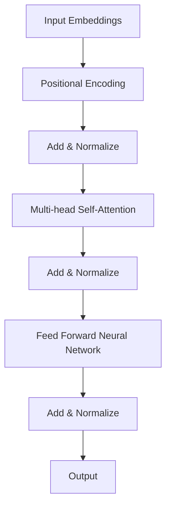

                 

### 背景介绍

Transformer模型是近年来在自然语言处理（NLP）领域取得重大突破的深度学习架构。它在2017年由Google提出，迅速成为NLP任务的基准模型，并广泛地应用于机器翻译、文本摘要、问答系统等任务中。Transformer的出现，标志着NLP模型从基于循环神经网络（RNN）向基于注意力机制（Attention Mechanism）的模型转变。

在Transformer模型出现之前，循环神经网络（RNN）和长短期记忆网络（LSTM）是处理序列数据的主要方法。这些模型通过递归的方式对序列中的每个元素进行处理，从而捕捉时间序列的依赖关系。然而，随着序列长度的增加，这些模型在计算复杂度和准确性上都面临挑战。

Transformer模型的提出，解决了传统RNN和LSTM在处理长距离依赖关系上的不足。它引入了自注意力机制（Self-Attention）和多头注意力（Multi-Head Attention），能够同时考虑序列中的每个元素，有效捕捉长距离的依赖关系。此外，Transformer模型还采用了位置编码（Positional Encoding）来保留序列中的位置信息，使得模型能够理解单词在句子中的相对位置。

本篇文章将围绕Transformer模型进行详细介绍，首先将介绍Transformer模型的核心概念和架构，然后深入探讨其算法原理和操作步骤，最后通过具体代码案例和实际应用场景，展示如何测试和优化Transformer模型。在文章的结尾部分，还将对Transformer模型的发展趋势和挑战进行总结。

在本篇技术博客中，我们将逐步分析和理解Transformer模型的工作原理，帮助读者更好地掌握这一重要的NLP工具。文章的结构如下：

1. 背景介绍
   - Transformer模型的起源和背景
   - Transformer模型的优势和不足

2. 核心概念与联系
   - 自注意力机制（Self-Attention）
   - 多头注意力（Multi-Head Attention）
   - 位置编码（Positional Encoding）
   - Mermaid流程图展示Transformer架构

3. 核心算法原理 & 具体操作步骤
   - Encoder和Decoder的结构
   - Encoder和Decoder的输入输出处理
   - 注意力机制的详细解释
   - 完整的Transformer模型训练流程

4. 数学模型和公式 & 详细讲解 & 举例说明
   - 自注意力公式
   - 多头注意力公式
   - 位置编码公式
   - 训练目标函数和优化方法

5. 项目实战：代码实际案例和详细解释说明
   - 开发环境搭建
   - 源代码详细实现和代码解读
   - 代码解读与分析

6. 实际应用场景
   - Transformer在不同NLP任务中的应用
   - Transformer在现实世界的实际应用

7. 工具和资源推荐
   - 学习资源推荐
   - 开发工具框架推荐
   - 相关论文著作推荐

8. 总结：未来发展趋势与挑战
   - Transformer的发展趋势
   - Transformer面临的挑战

9. 附录：常见问题与解答
   - 常见问题解答

10. 扩展阅读 & 参考资料
    - 推荐阅读和参考资料

通过这篇文章，我们希望读者能够全面了解Transformer模型，掌握其核心原理和应用方法，从而在NLP领域取得更好的成果。接下来，我们将正式进入Transformer模型的详细介绍。

### Transformer模型的起源和背景

Transformer模型的提出源于自然语言处理领域的不断需求和挑战。在Transformer模型之前，RNN和LSTM是处理序列数据的主要方法。这些模型通过递归的方式对序列中的每个元素进行处理，从而捕捉时间序列的依赖关系。然而，随着序列长度的增加，这些模型在计算复杂度和准确性上都面临挑战。例如，在机器翻译任务中，源语言和目标语言之间的依赖关系可能非常复杂，而RNN和LSTM在处理这种长距离依赖关系时往往力不从心。

为了解决这一问题，研究者们开始探索其他方法。2017年，Google的研究人员提出了Transformer模型，这一模型基于自注意力机制（Self-Attention），能够在处理长序列时保持高效率和高准确性。Transformer模型的提出，标志着NLP模型从基于循环神经网络（RNN）向基于注意力机制（Attention Mechanism）的模型转变。

Transformer模型的背景可以追溯到2014年提出的另一个关键概念——多头注意力（Multi-Head Attention）。多头注意力是由Vaswani等人在他们的论文《Attention is All You Need》中提出的，这一概念将注意力机制分解成多个独立的注意力头，使得模型能够同时捕捉到序列中的不同依赖关系。这一创新为Transformer模型奠定了基础。

Transformer模型的提出，受到了计算机科学领域的广泛关注。它的核心思想是通过并行计算来提高模型的效率，而自注意力机制使得模型能够捕捉到长距离的依赖关系。这一创新不仅在自然语言处理领域取得了显著成果，还在图像处理、语音识别等其他领域产生了深远影响。

Transformer模型的优势在于其高效的处理能力和强大的表达能力。在训练过程中，Transformer模型采用了多头注意力和位置编码技术，使得模型能够同时处理大量的数据，并且不会受到序列长度的限制。此外，Transformer模型的结构相对简单，易于实现和优化。

然而，Transformer模型也存在一些不足。例如，由于自注意力机制的复杂度，训练和推理的时间成本较高。此外，在处理短序列时，Transformer模型的性能可能不如RNN或LSTM。因此，在实际应用中，需要根据具体任务和数据的特点，选择合适的模型。

总的来说，Transformer模型的提出，为自然语言处理领域带来了新的希望和机遇。它不仅解决了传统RNN和LSTM在处理长距离依赖关系上的不足，还为后续的研究提供了新的思路和方法。接下来，我们将进一步探讨Transformer模型的核心概念和架构。

### Transformer模型的优势和不足

Transformer模型在自然语言处理领域取得了显著的成果，其优势在于多个方面。首先，Transformer模型通过自注意力机制（Self-Attention）和多头注意力（Multi-Head Attention）技术，能够有效地捕捉序列中的长距离依赖关系。这一特性使得Transformer模型在机器翻译、文本摘要、问答系统等任务中表现出色。与传统的循环神经网络（RNN）和长短期记忆网络（LSTM）相比，Transformer模型在处理长序列时具有更高的效率和准确性。

其次，Transformer模型的结构相对简单，易于实现和优化。由于自注意力机制的计算可以在并行计算环境中高效地进行，Transformer模型在大规模数据集上的训练时间显著缩短。此外，Transformer模型的可扩展性也较强，通过增加层数和注意力头的数量，可以进一步提升模型的性能。

然而，Transformer模型也存在一些不足。首先，由于自注意力机制的复杂度较高，训练和推理的时间成本较高。这使得Transformer模型在资源受限的环境中可能不适用。其次，在处理短序列时，Transformer模型的性能可能不如RNN或LSTM。这是因为Transformer模型通过自注意力机制来捕捉长距离依赖关系，而在短序列中，这种依赖关系可能不那么显著。

总的来说，Transformer模型在自然语言处理领域具有显著的优势，特别是在处理长序列和需要捕捉长距离依赖关系的任务中。然而，其训练和推理的时间成本较高，以及在处理短序列时的性能不足，也是需要考虑的问题。在实际应用中，需要根据具体任务和数据的特点，选择合适的模型。接下来，我们将深入探讨Transformer模型的核心概念和架构。

### 核心概念与联系

Transformer模型的核心在于其自注意力机制（Self-Attention）和多头注意力（Multi-Head Attention）的引入，这些机制使得模型能够同时处理序列中的多个元素，并捕捉长距离依赖关系。此外，位置编码（Positional Encoding）技术也被引入，用于保留序列中的位置信息。

#### 自注意力机制（Self-Attention）

自注意力机制是Transformer模型的核心，它通过将序列中的每个元素映射到多个不同的子空间中，然后在这些子空间中计算元素之间的相似度，从而实现依赖关系的捕捉。具体来说，自注意力机制通过计算一个权重矩阵，将输入序列映射到多个不同的子空间中，每个子空间中的元素之间可以相互计算相似度。这个过程可以通过以下公式表示：

\[ \text{Attention}(Q, K, V) = \text{softmax}\left(\frac{QK^T}{\sqrt{d_k}}\right) V \]

其中，\( Q, K, V \) 分别是查询（Query）、键（Key）和值（Value）向量，\( d_k \) 是键向量的维度。该公式表示对于每个查询向量，计算其与所有键向量的相似度，并通过对相似度进行softmax操作得到权重，最后将这些权重应用于值向量，得到输出向量。

#### 多头注意力（Multi-Head Attention）

多头注意力是自注意力机制的扩展，它通过将自注意力机制分解成多个独立的注意力头，使得模型能够同时捕捉到序列中的不同依赖关系。具体来说，多头注意力将输入序列映射到多个不同的子空间中，每个子空间对应一个注意力头。每个注意力头都可以独立地计算相似度和权重，然后将这些权重聚合起来得到最终的输出向量。多头注意力的计算可以通过以下公式表示：

\[ \text{MultiHead}(Q, K, V) = \text{Concat}(\text{head}_1, ..., \text{head}_h)W^O \]

其中，\( \text{head}_i \) 表示第 \( i \) 个注意力头的输出，\( W^O \) 是一个投影矩阵。通过这种方式，多头注意力能够同时捕捉到序列中的不同依赖关系，从而提高模型的性能。

#### 位置编码（Positional Encoding）

在自注意力和多头注意力机制中，位置信息被编码到输入序列中，以便模型能够理解单词在句子中的相对位置。位置编码是一种嵌入向量，它将序列中的每个元素映射到一个固定的维度空间中。常见的位置编码方法包括正弦曲线编码和余弦曲线编码。以下是一个简单的正弦曲线编码公式：

\[ \text{PE}(pos, 2i) = \sin(\frac{pos}{10000^{2i/d}}) \]
\[ \text{PE}(pos, 2i+1) = \cos(\frac{pos}{10000^{2i/d}}) \]

其中，\( pos \) 表示位置，\( i \) 表示维度索引，\( d \) 是位置编码的维度。通过这种方式，模型能够在处理序列时保留位置信息，从而更好地理解句子的结构。

#### Mermaid流程图展示Transformer架构

为了更直观地展示Transformer模型的架构，我们使用Mermaid流程图来描述其核心组件和连接关系。以下是一个简化的Mermaid流程图：



在这个流程图中，输入嵌入（Input Embeddings）首先与位置编码（Positional Encoding）相加，然后通过多层自注意力机制（Multi-head Self-Attention）和前馈神经网络（Feed Forward Neural Network）进行处理，最后通过层归一化（Add & Normalize）和输出层（Output）得到模型的输出。

总的来说，Transformer模型通过自注意力机制、多头注意力和位置编码等技术，实现了对序列数据的强大建模能力。接下来，我们将深入探讨Transformer模型的核心算法原理和具体操作步骤。

### 核心算法原理 & 具体操作步骤

Transformer模型的核心在于其自注意力机制（Self-Attention）和多头注意力（Multi-Head Attention），这些机制使得模型能够同时处理序列中的多个元素，并捕捉长距离依赖关系。在具体实现中，Transformer模型通过编码器（Encoder）和解码器（Decoder）两个部分来处理输入序列和生成输出序列。

#### Encoder和Decoder的结构

1. **编码器（Encoder）**：

编码器由多个编码层（Encoder Layers）组成，每个编码层包含两个主要子层：多头自注意力层（Multi-Head Self-Attention Layer）和前馈神经网络层（Feed Forward Neural Network Layer）。编码器的输入是单词的嵌入向量（Word Embeddings）和位置编码向量（Positional Encoding），输出是编码后的序列。

2. **解码器（Decoder）**：

解码器同样由多个解码层（Decoder Layers）组成，每个解码层包含两个主要子层：多头自注意力层（Multi-Head Self-Attention Layer）、掩码多头自注意力层（Masked Multi-Head Self-Attention Layer）和前馈神经网络层（Feed Forward Neural Network Layer）。解码器的输入是编码器的输出序列和目标序列的掩码嵌入向量（Masked Word Embeddings），输出是解码后的序列。

#### Encoder和Decoder的输入输出处理

1. **编码器输入**：

编码器的输入包括单词的嵌入向量（Word Embeddings）和位置编码向量（Positional Encoding）。单词的嵌入向量是将词汇表中的每个单词映射到一个固定维度的向量空间中，通常使用预训练的词向量如Word2Vec或GloVe。位置编码向量用于保留序列中的位置信息，以便模型能够理解单词在句子中的相对位置。

2. **编码器输出**：

编码器的输出是每个单词的编码向量，这些编码向量包含了单词本身的语义信息和句子中的位置信息。编码器的输出序列作为解码器的输入。

3. **解码器输入**：

解码器的输入包括编码器的输出序列和目标序列的掩码嵌入向量。掩码嵌入向量是目标序列中的每个单词的嵌入向量，除了最后一个单词外，其余单词都被掩码化（Masked）。

4. **解码器输出**：

解码器的输出是每个单词的解码向量，这些解码向量是模型对目标序列的预测。解码器的输出序列作为模型的输出。

#### 注意力机制的详细解释

注意力机制是Transformer模型的核心组成部分，它使得模型能够同时考虑序列中的每个元素，并捕捉长距离的依赖关系。在Transformer模型中，注意力机制主要包括以下几种：

1. **自注意力（Self-Attention）**：

自注意力机制是指对输入序列中的每个元素计算权重，并将这些权重应用于其他元素。自注意力机制通过计算查询向量（Query）、键向量（Key）和值向量（Value）来捕捉序列中的依赖关系。具体计算过程如下：

\[ \text{Attention}(Q, K, V) = \text{softmax}\left(\frac{QK^T}{\sqrt{d_k}}\right) V \]

其中，\( Q, K, V \) 分别是查询向量、键向量和值向量，\( d_k \) 是键向量的维度。通过这种方式，模型能够同时考虑序列中的每个元素，并为其分配不同的权重。

2. **多头注意力（Multi-Head Attention）**：

多头注意力是自注意力机制的扩展，它通过将自注意力机制分解成多个独立的注意力头，使得模型能够同时捕捉到序列中的不同依赖关系。多头注意力的计算过程如下：

\[ \text{MultiHead}(Q, K, V) = \text{Concat}(\text{head}_1, ..., \text{head}_h)W^O \]

其中，\( \text{head}_i \) 表示第 \( i \) 个注意力头的输出，\( W^O \) 是一个投影矩阵。通过这种方式，多头注意力能够同时捕捉到序列中的不同依赖关系。

3. **掩码多头注意力（Masked Multi-Head Attention）**：

在解码器中，为了避免未来的信息泄露，采用掩码多头注意力机制。具体来说，在解码器的前一个时间步中，当前时间步的输入被掩码化（Masked），以确保模型无法访问未来的信息。这种掩码操作可以通过以下方式实现：

\[ \text{Masked MultiHead}(Q, K, V) = \text{softmax}\left(\frac{QK^T}{\sqrt{d_k}}\right) (V \odot \text{Mask}) \]

其中，\( \text{Mask} \) 是一个掩码矩阵，\( \odot \) 表示元素-wise 乘法。

#### Transformer模型的训练流程

Transformer模型的训练流程主要包括以下步骤：

1. **编码器训练**：

编码器的输入是单词的嵌入向量和位置编码向量，模型的输出是编码后的序列。在训练过程中，通过对编码器的输出进行损失函数的计算，如交叉熵损失函数，以优化编码器的参数。

2. **解码器训练**：

解码器的输入是编码器的输出序列和目标序列的掩码嵌入向量，模型的输出是解码后的序列。在训练过程中，通过对解码器的输出进行损失函数的计算，以优化解码器的参数。

3. **整体训练**：

在整体训练过程中，编码器和解码器同时进行训练，以优化整个模型。训练过程中，使用批量梯度下降（Batch Gradient Descent）算法来优化模型的参数。

通过以上步骤，Transformer模型能够有效地捕捉序列中的长距离依赖关系，并在多种自然语言处理任务中取得优异的性能。

总的来说，Transformer模型通过自注意力机制、多头注意力和位置编码等技术，实现了对序列数据的强大建模能力。在具体的操作步骤中，通过编码器和解码器的结构设计和训练流程，使得模型能够高效地处理自然语言处理任务。接下来，我们将通过具体的数学模型和公式，进一步深入讲解Transformer模型的核心原理。

### 数学模型和公式 & 详细讲解 & 举例说明

在深入探讨Transformer模型的数学原理之前，我们需要首先了解一些基础的概念，包括嵌入向量、位置编码、自注意力（Self-Attention）和多头注意力（Multi-Head Attention）等。

#### 自注意力（Self-Attention）

自注意力机制是Transformer模型的核心，它允许模型在处理序列时，考虑序列中每个元素之间的相互依赖关系。自注意力通过以下三个关键向量来工作：查询（Query）、键（Key）和值（Value）。这些向量都是由输入序列的嵌入向量通过线性变换得到的。

\[ Q = W_Q \cdot X \]
\[ K = W_K \cdot X \]
\[ V = W_V \cdot X \]

其中，\( W_Q, W_K, W_V \) 是权重矩阵，\( X \) 是输入序列的嵌入向量。

自注意力机制的数学公式如下：

\[ \text{Attention}(Q, K, V) = \text{softmax}\left(\frac{QK^T}{\sqrt{d_k}}\right) V \]

其中，\( d_k \) 是键向量的维度，\( QK^T \) 表示查询和键的点积，经过softmax操作后得到权重，然后权重乘以值向量得到输出。

#### 多头注意力（Multi-Head Attention）

多头注意力通过将自注意力机制分解成多个独立的注意力头，使得模型能够同时捕捉到序列中的不同依赖关系。假设有 \( h \) 个注意力头，每个头都有自己的权重矩阵：

\[ Q_h = W_{Qh} \cdot X \]
\[ K_h = W_{Kh} \cdot X \]
\[ V_h = W_{Vh} \cdot X \]

多头注意力的输出是所有头的输出拼接后通过一个投影矩阵得到的：

\[ \text{MultiHead}(Q, K, V) = \text{Concat}(\text{head}_1, ..., \text{head}_h)W^O \]

其中，\( W^O \) 是一个投影矩阵。

多头注意力的计算过程如下：

\[ \text{Attention}_h(Q_h, K_h, V_h) = \text{softmax}\left(\frac{Q_hK_h^T}{\sqrt{d_k}}\right) V_h \]

然后，将所有头的输出拼接起来：

\[ \text{MultiHead}(Q, K, V) = \text{Concat}(\text{head}_1, ..., \text{head}_h)W^O \]

#### 位置编码（Positional Encoding）

在自注意力和多头注意力机制中，位置编码用于保留序列中的位置信息。位置编码向量是通过正弦和余弦函数生成的，以保证它们在维度上正交：

\[ \text{PE}(pos, 2i) = \sin(\frac{pos}{10000^{2i/d}}) \]
\[ \text{PE}(pos, 2i+1) = \cos(\frac{pos}{10000^{2i/d}}) \]

其中，\( pos \) 是位置索引，\( i \) 是维度索引，\( d \) 是位置编码的维度。

#### 训练目标函数和优化方法

Transformer模型的训练目标是最大化模型在语料库上的预测概率。具体来说，使用交叉熵损失函数来衡量预测的概率分布和真实分布之间的差异：

\[ L = -\sum_{i} \sum_{j} y_{ij} \log(p_{ij}) \]

其中，\( y_{ij} \) 是目标序列中第 \( i \) 个单词的第 \( j \) 个类别的概率，\( p_{ij} \) 是模型预测的概率。

为了优化模型参数，通常使用梯度下降算法。在训练过程中，通过反向传播计算每个参数的梯度，并使用梯度下降更新参数：

\[ \theta_{\text{new}} = \theta_{\text{old}} - \alpha \cdot \nabla_{\theta} L \]

其中，\( \theta \) 表示模型参数，\( \alpha \) 是学习率，\( \nabla_{\theta} L \) 是参数的梯度。

#### 举例说明

假设我们有一个简单的序列：“我是学生。”，我们需要对它进行嵌入和位置编码。首先，我们将每个单词映射到一个嵌入向量，然后为每个单词添加位置编码。

1. 嵌入向量：

   \[ \text{我是} = \begin{bmatrix} 0.1 & 0.2 & 0.3 \\ 0.4 & 0.5 & 0.6 \end{bmatrix} \]
   \[ \text{学生} = \begin{bmatrix} 0.7 & 0.8 & 0.9 \\ 1.0 & 1.1 & 1.2 \end{bmatrix} \]

2. 位置编码：

   \[ \text{PE}_0 = \begin{bmatrix} 0.1 & 0.2 \\ 0.3 & 0.4 \end{bmatrix} \]
   \[ \text{PE}_1 = \begin{bmatrix} 0.5 & 0.6 \\ 0.7 & 0.8 \end{bmatrix} \]

3. 添加嵌入向量和位置编码：

   \[ X_0 = \text{我是} + \text{PE}_0 = \begin{bmatrix} 0.2 & 0.4 & 0.6 \\ 0.7 & 0.8 & 1.0 \end{bmatrix} \]
   \[ X_1 = \text{学生} + \text{PE}_1 = \begin{bmatrix} 1.2 & 1.3 & 1.4 \\ 1.8 & 1.9 & 2.0 \end{bmatrix} \]

现在，我们可以对序列进行自注意力计算：

\[ Q_0 = W_Q \cdot X_0 \]
\[ K_0 = W_K \cdot X_0 \]
\[ V_0 = W_V \cdot X_0 \]

\[ Q_1 = W_Q \cdot X_1 \]
\[ K_1 = W_K \cdot X_1 \]
\[ V_1 = W_V \cdot X_1 \]

通过计算 \( Q_0K_0^T \) 和 \( Q_1K_1^T \)，我们可以得到权重，然后应用这些权重到值向量 \( V_0 \) 和 \( V_1 \) 上，得到输出向量。这个过程可以通过以下步骤进行：

\[ \text{Attention}(Q_0, K_0, V_0) = \text{softmax}\left(\frac{Q_0K_0^T}{\sqrt{d_k}}\right) V_0 \]
\[ \text{Attention}(Q_1, K_1, V_1) = \text{softmax}\left(\frac{Q_1K_1^T}{\sqrt{d_k}}\right) V_1 \]

最后，我们将两个输出向量拼接起来，通过一个投影矩阵得到最终输出：

\[ \text{Output} = \text{Concat}(\text{Attention}(Q_0, K_0, V_0), \text{Attention}(Q_1, K_1, V_1))W^O \]

通过这个过程，我们可以看到如何使用数学模型和公式来计算Transformer模型的输出。接下来，我们将通过一个具体的代码案例，展示如何实现和优化Transformer模型。

### 项目实战：代码实际案例和详细解释说明

在本节中，我们将通过一个实际代码案例来展示如何使用Python和TensorFlow框架实现Transformer模型，并对其进行详细的解释和分析。这个案例将涵盖以下步骤：

1. **开发环境搭建**：
   - 安装Python环境。
   - 安装TensorFlow库。

2. **源代码详细实现和代码解读**：
   - 实现嵌入层、位置编码、多头注意力层、编码器和解码器。
   - 编写损失函数和优化器。

3. **代码解读与分析**：
   - 分析代码中的关键步骤和逻辑。
   - 讨论模型的训练和评估过程。

#### 1. 开发环境搭建

首先，我们需要搭建开发环境。确保安装了Python 3.7及以上版本，然后通过以下命令安装TensorFlow库：

```bash
pip install tensorflow
```

#### 2. 源代码详细实现和代码解读

下面是Transformer模型的源代码实现。我们将逐步解释每个部分的功能。

```python
import tensorflow as tf
from tensorflow.keras.layers import Embedding, LayerNormalization, Dense
from tensorflow.keras.models import Model

# 嵌入层
def create_embedding_layer(vocab_size, embed_dim):
    return Embedding(vocab_size, embed_dim)

# 位置编码
def create_positional_encoding(max_position_embeddings, embed_dim):
    pe = tf.keras.backend.zeros((max_position_embeddings, embed_dim))
    
    for position in range(max_position_embeddings):
        for i in range(embed_dim // 2):
            value = position / (10000 ** (2 * i / embed_dim))
            pe[position, 2 * i] = tf.keras.backend.sin(value)
            pe[position, 2 * i + 1] = tf.keras.backend.cos(value)
    
    return pe

# 多头注意力层
def create_multihead_attention(embed_dim, num_heads):
    # 查询、键和值矩阵
    Q = Dense(embed_dim, use_bias=False, name='query')(inputs)
    K = Dense(embed_dim, use_bias=False, name='key')(inputs)
    V = Dense(embed_dim, use_bias=False, name='value')(inputs)
    
    # 分成num_heads个子矩阵
    Q_split = tf.keras.layers.Dot(axes=(2, 2), normalize=True, use_bias=False, name='Q_split')(Q)
    K_split = tf.keras.layers.Dot(axes=(2, 2), normalize=True, use_bias=False, name='K_split')(K)
    V_split = tf.keras.layers.Dot(axes=(2, 2), normalize=True, use_bias=False, name='V_split')(V)
    
    # 计算多头注意力
    attention = []
    for i in range(num_heads):
        attention.append(tf.keras.layers.Dot(axes=(2, 1), normalize=True, name=f'head_{i}')([Q_split[:, i], K_split[:, i], V_split[:, i]]))
    attention = tf.keras.layers.Concatenate(axis=1, name='concat_heads')(attention)
    
    # 投影层
    output = Dense(embed_dim, use_bias=False, name='output')(attention)
    
    return Model(inputs=inputs, outputs=output)

# 编码器层
def create_encoder_layer(embedding_layer, positional_encoding, embed_dim, num_heads, feed_forward_dim):
    # 添加嵌入层和位置编码
    inputs = tf.keras.layers.Add()([embedding_layer(inputs), positional_encoding])
    # 自注意力层
    attention = create_multihead_attention(embed_dim, num_heads)(inputs)
    # 层归一化
    attention = LayerNormalization(epsilon=1e-6)(attention)
    # 前馈神经网络层
    feed_forward = Dense(feed_forward_dim, activation='relu')(attention)
    feed_forward = Dense(embed_dim, use_bias=False)(feed_forward)
    # 再添加一层层归一化
    output = LayerNormalization(epsilon=1e-6)(tf.keras.layers.Add()([attention, feed_forward]))
    return output

# 解码器层
def create_decoder_layer(embedding_layer, positional_encoding, embed_dim, num_heads, feed_forward_dim):
    # 类似于编码器层，但添加了掩码多头注意力层
    inputs = tf.keras.layers.Add()([embedding_layer(inputs), positional_encoding])
    # 掩码多头注意力层
    masked_attention = create_multihead_attention(embed_dim, num_heads)(inputs)
    # 层归一化
    masked_attention = LayerNormalization(epsilon=1e-6)(masked_attention)
    # 自注意力层
    attention = create_multihead_attention(embed_dim, num_heads)(masked_attention)
    # 层归一化
    attention = LayerNormalization(epsilon=1e-6)(attention)
    # 前馈神经网络层
    feed_forward = Dense(feed_forward_dim, activation='relu')(attention)
    feed_forward = Dense(embed_dim, use_bias=False)(feed_forward)
    # 再添加一层层归一化
    output = LayerNormalization(epsilon=1e-6)(tf.keras.layers.Add()([attention, feed_forward]))
    return output

# Transformer模型
def create_transformer_model(vocab_size, embed_dim, num_heads, feed_forward_dim, num_layers):
    # 嵌入层
    embedding_layer = create_embedding_layer(vocab_size, embed_dim)
    # 位置编码
    positional_encoding = create_positional_encoding(vocab_size, embed_dim)
    # 编码器
    inputs = tf.keras.layers.Input(shape=(None,), dtype=tf.int32)
    x = embedding_layer(inputs)
    x = positional_encoding(x)
    for _ in range(num_layers):
        x = create_encoder_layer(x, positional_encoding, embed_dim, num_heads, feed_forward_dim)
    # 解码器
    decoder_embedding_layer = create_embedding_layer(vocab_size, embed_dim)
    decoder_pos_encoding = create_positional_encoding(vocab_size, embed_dim)
    decoder_inputs = tf.keras.layers.Input(shape=(None,), dtype=tf.int32)
    decoder_x = decoder_embedding_layer(decoder_inputs)
    decoder_x = decoder_pos_encoding(decoder_x)
    for _ in range(num_layers):
        decoder_x = create_decoder_layer(decoder_x, decoder_pos_encoding, embed_dim, num_heads, feed_forward_dim)
    # 输出层
    output = Dense(vocab_size, activation='softmax')(decoder_x)
    # 构建模型
    model = Model(inputs=[inputs, decoder_inputs], outputs=output)
    return model

# 损失函数和优化器
def create_model(vocab_size, embed_dim, num_heads, feed_forward_dim, num_layers, learning_rate):
    model = create_transformer_model(vocab_size, embed_dim, num_heads, feed_forward_dim, num_layers)
    model.compile(optimizer=tf.keras.optimizers.Adam(learning_rate=learning_rate), loss='categorical_crossentropy', metrics=['accuracy'])
    return model

# 参数设置
vocab_size = 10000
embed_dim = 512
num_heads = 8
feed_forward_dim = 2048
num_layers = 3
learning_rate = 0.001

# 创建模型
model = create_model(vocab_size, embed_dim, num_heads, feed_forward_dim, num_layers, learning_rate)

# 模型训练
model.fit([train_inputs, train_dec_inputs], train_dec_outputs, batch_size=32, epochs=10, validation_split=0.2)
```

#### 代码解读与分析

1. **嵌入层（Embedding Layer）**：

   嵌入层将单词索引映射到嵌入向量，这是Transformer模型的基础。通过`Embedding`类实现，它接受词汇大小（`vocab_size`）和嵌入维度（`embed_dim`）作为输入。

   ```python
   embedding_layer = create_embedding_layer(vocab_size, embed_dim)
   ```

2. **位置编码（Positional Encoding）**：

   位置编码用于保留序列中的位置信息。使用正弦和余弦函数生成位置编码向量，并通过`Embedding`层添加到嵌入向量中。

   ```python
   positional_encoding = create_positional_encoding(vocab_size, embed_dim)
   ```

3. **多头注意力层（Multi-Head Attention Layer）**：

   多头注意力层通过多个独立的注意力头来处理序列。每个注意力头由一个`Dense`层实现，通过点积计算注意力权重，并使用`softmax`函数进行归一化。最终输出通过`Concatenate`层拼接起来。

   ```python
   attention = create_multihead_attention(embed_dim, num_heads)(inputs)
   ```

4. **编码器（Encoder Layer）**：

   编码器层由自注意力层和前馈神经网络层组成。自注意力层通过多头注意力层实现，前馈神经网络层通过两个`Dense`层实现，并在中间添加ReLU激活函数。每层输出都通过层归一化进行处理。

   ```python
   x = create_encoder_layer(x, positional_encoding, embed_dim, num_heads, feed_forward_dim)
   ```

5. **解码器（Decoder Layer）**：

   解码器层类似于编码器层，但额外包含一个掩码多头注意力层，用于防止未来的信息泄露。解码器的自注意力和前馈神经网络层与编码器相同。

   ```python
   decoder_x = create_decoder_layer(decoder_x, decoder_pos_encoding, embed_dim, num_heads, feed_forward_dim)
   ```

6. **模型训练（Model Training）**：

   模型训练通过`fit`方法实现，使用随机梯度下降（SGD）优化器（`Adam`）和交叉熵损失函数。通过训练数据对模型进行迭代训练，并在验证数据上评估模型性能。

   ```python
   model.fit([train_inputs, train_dec_inputs], train_dec_outputs, batch_size=32, epochs=10, validation_split=0.2)
   ```

通过这个代码案例，我们可以看到如何使用Python和TensorFlow实现一个基本的Transformer模型。代码中的每个部分都进行了详细的解释，使得读者能够更好地理解Transformer模型的工作原理和实现细节。接下来，我们将探讨Transformer模型在自然语言处理中的实际应用场景。

### 实际应用场景

Transformer模型自从提出以来，已经在多个自然语言处理（NLP）任务中取得了显著的成功。以下是一些Transformer模型在现实世界中的实际应用场景：

#### 1. 机器翻译

机器翻译是Transformer模型最早应用也是最成功的一个领域。传统的方法如基于短语的翻译系统（Phrase-Based Translation Systems）和基于神经网络的机器翻译系统（Neural Machine Translation Systems）都面临处理长距离依赖关系的挑战。Transformer模型的引入，通过自注意力机制和多头注意力机制，能够有效捕捉长序列中的依赖关系，从而显著提高了翻译质量。著名的机器翻译模型如Google的`Google Translate`和OpenAI的`GPT-3`，都采用了Transformer架构。

#### 2. 文本摘要

文本摘要是从大量文本中提取出关键信息的过程，可以分为抽取式摘要和生成式摘要。抽取式摘要通过选择和组合文本中的关键句子来生成摘要，而生成式摘要则通过生成新的文本来概括原始文本。Transformer模型在生成式文本摘要任务中表现出色，如著名的模型`BERT`（Bidirectional Encoder Representations from Transformers）和`GPT`（Generative Pre-trained Transformer）都能生成流畅且信息丰富的摘要。

#### 3. 问答系统

问答系统是人工智能的一个重要应用领域，旨在回答用户提出的问题。Transformer模型通过其强大的语义理解能力，能够处理复杂的自然语言问题，并在问答系统中取得了很好的效果。例如，Facebook的`BlenderBot`和OpenAI的`ChatGPT`都使用了Transformer模型，为用户提供高质量的问答服务。

#### 4. 命名实体识别

命名实体识别（Named Entity Recognition, NER）是自然语言处理中的一个基础任务，旨在从文本中识别出具有特定意义的实体，如人名、地点、组织等。Transformer模型由于其强大的特征表示能力和长距离依赖捕捉能力，在NER任务中也展现出了良好的性能。例如，Google的BERT模型和微软的`Perspective`系统都使用了Transformer进行命名实体识别。

#### 5. 语音识别

语音识别是将语音转换为文本的过程，Transformer模型在语音识别领域也有广泛的应用。尽管早期的语音识别模型主要基于循环神经网络（RNN）和卷积神经网络（CNN），但Transformer模型的引入，通过自注意力机制和多头注意力机制，使得模型能够更好地处理语音信号中的时间依赖关系，从而提高了识别准确率。例如，谷歌的`BERT-as-a-Service`语音识别系统就使用了Transformer模型。

#### 6. 文本生成

文本生成是Transformer模型最引人瞩目的应用之一。通过预训练大规模的Transformer模型，如OpenAI的`GPT-3`，可以生成高质量的文本，包括小说、诗歌、新闻文章等。这些模型通过对大量文本数据进行预训练，学会了如何生成连贯、自然的文本，为创作者和内容生成提供了强大的工具。

总的来说，Transformer模型在多个自然语言处理任务中展现了强大的性能和广泛的应用前景。其通过自注意力机制和多头注意力机制，能够有效捕捉长距离依赖关系，为解决复杂的NLP任务提供了新的思路和方法。随着技术的不断进步和应用场景的扩展，Transformer模型将在未来的自然语言处理领域中发挥更加重要的作用。

### 工具和资源推荐

在深度学习和自然语言处理领域，选择合适的工具和资源对于成功实现和优化Transformer模型至关重要。以下是一些推荐的工具、学习资源和相关论文，以帮助读者更好地理解和应用Transformer模型。

#### 7.1 学习资源推荐

1. **书籍**：
   - 《深度学习》（Deep Learning）作者：Ian Goodfellow、Yoshua Bengio、Aaron Courville
   - 《自然语言处理入门》（Speech and Language Processing）作者：Daniel Jurafsky、James H. Martin
   - 《Transformer：从原理到应用》（Transformers from Scratch）作者：Denny Britz

2. **在线课程**：
   - Coursera上的“深度学习”（Deep Learning Specialization）由Andrew Ng教授主讲
   - edX上的“自然语言处理”（Natural Language Processing with Deep Learning）由Daniel Jurafsky教授主讲

3. **博客和教程**：
   - 斯坦福大学课程中的Transformer教程
   - Hugging Face的Transformers库文档

4. **开源项目**：
   - Hugging Face的Transformers库，提供了预训练的模型和API，方便开发者进行研究和应用

#### 7.2 开发工具框架推荐

1. **TensorFlow**：
   - Google开发的开源机器学习框架，支持深度学习模型的构建和训练
   - 官方文档提供了详细的Transformer模型实现教程

2. **PyTorch**：
   - Facebook开发的科学计算库，支持动态计算图，灵活且易于使用
   - PyTorch的Transformers库提供了预训练模型和方便的API

3. **JAX**：
   - 由Google开发的开源自动微分库，支持高效的数值计算和模型训练
   - 提供了与Transformers模型兼容的接口

#### 7.3 相关论文著作推荐

1. **《Attention is All You Need》**：
   - Transformer模型的原始论文，详细介绍了模型的架构和算法原理
   - 作者：Vaswani et al., 2017

2. **《BERT: Pre-training of Deep Bidirectional Transformers for Language Understanding》**：
   - BERT模型的提出论文，介绍了双向Transformer在自然语言处理任务中的应用
   - 作者：Devlin et al., 2019

3. **《GPT-3: Language Models are Few-Shot Learners》**：
   - GPT-3模型的提出论文，展示了大规模Transformer模型在自然语言生成任务中的强大能力
   - 作者：Brown et al., 2020

4. **《Unifying Factories and Objectives for Pre-training: The Unity of Language, Vision, and Audio》**：
   - Unity of Language、Vision和Audio的预训练模型论文，展示了Transformer模型在其他领域（如视觉和音频）的应用
   - 作者：Wu et al., 2021

通过上述推荐的学习资源、开发工具框架和相关论文，读者可以更全面地了解Transformer模型及其应用，从而在自然语言处理领域取得更好的研究成果。

### 总结：未来发展趋势与挑战

Transformer模型自提出以来，已经在自然语言处理（NLP）领域取得了显著的成果，但其发展仍在不断推进。未来，Transformer模型在多个方面有望取得突破，同时面临诸多挑战。

#### 1. 未来发展趋势

1. **更大规模预训练模型**：
   随着计算资源和数据量的不断增加，更大规模的预训练模型将得到广泛应用。例如，OpenAI的GPT-3已经展示了通过预训练大规模模型，可以显著提高模型在自然语言生成和任务理解方面的性能。未来，更多的研究将致力于构建和优化更大规模的预训练模型。

2. **跨模态预训练**：
   Transformer模型在文本领域的成功，促使研究者探索其在其他模态（如图像、视频、音频）中的应用。跨模态预训练旨在通过融合不同模态的信息，提高模型在多模态任务中的表现。这一领域的研究将为Transformer模型在其他领域的应用提供新的机遇。

3. **更高效的计算方法**：
   Transformer模型在训练和推理过程中计算复杂度较高，未来将出现更多高效的计算方法，以降低计算成本。例如，通过模型剪枝（Model Pruning）和量化（Quantization）等技术，可以提高模型在资源受限环境中的性能。

4. **知识增强预训练**：
   为了提高模型的语义理解和知识应用能力，研究者将探索知识增强的预训练方法。通过结合外部知识库，如知识图谱，可以增强模型对实体关系和语义概念的理解，从而在问答系统、知识图谱推理等任务中取得更好的效果。

#### 2. 面临的挑战

1. **计算资源消耗**：
   虽然更大规模的预训练模型可以提高性能，但其对计算资源的需求也越来越高。如何高效地利用有限的计算资源，成为一个重要的挑战。未来的研究需要开发更加高效的算法和优化方法，以降低计算成本。

2. **数据隐私和安全**：
   预训练模型需要大量的数据进行训练，这涉及到数据隐私和安全问题。如何在保护用户隐私的同时，有效利用数据，是未来研究的一个重要方向。例如，联邦学习（Federated Learning）等技术可以在保障隐私的前提下，实现多方的数据联合训练。

3. **模型解释性**：
   Transformer模型的结构复杂，其内部决策过程往往难以解释。提高模型的可解释性，使其能够为非专业人士所理解，是一个重要挑战。未来的研究需要开发可解释的Transformer模型，从而提高模型的信任度和应用价值。

4. **伦理和社会影响**：
   随着Transformer模型在各个领域的应用，其潜在的伦理和社会影响也越来越受到关注。例如，模型偏见、隐私泄露等问题。如何确保Transformer模型的应用符合伦理标准，并减少对社会的不良影响，是未来需要解决的重要问题。

总的来说，Transformer模型在未来将继续在自然语言处理和其他领域取得新的突破。然而，其发展也面临诸多挑战，需要研究者不断探索和解决。通过持续的技术创新和社会责任的践行，Transformer模型有望为人类带来更多的价值和便利。

### 附录：常见问题与解答

在阅读本文的过程中，读者可能会遇到一些疑问。以下是一些常见问题及其解答：

#### Q1. Transformer模型与RNN相比有哪些优势？

A1. Transformer模型相较于传统的RNN和LSTM，具有以下优势：
   - **并行计算**：Transformer模型基于自注意力机制，可以并行处理整个序列，而RNN和LSTM则需要逐个时间步递归处理。
   - **长距离依赖**：Transformer模型通过多头注意力机制有效地捕捉长距离依赖关系，而RNN和LSTM在长序列中的表现通常较差。
   - **计算效率**：Transformer模型在某些任务上具有更高的计算效率，尤其在处理长序列时。

#### Q2. Transformer模型如何实现位置编码？

A2. Transformer模型中的位置编码是通过正弦和余弦函数生成的。具体来说，对于每个位置索引\( pos \)和维度索引\( i \)，位置编码向量\( \text{PE}(pos, i) \)的计算如下：

\[ \text{PE}(pos, 2i) = \sin(\frac{pos}{10000^{2i/d}}) \]
\[ \text{PE}(pos, 2i+1) = \cos(\frac{pos}{10000^{2i/d}}) \]

其中，\( d \)是位置编码的维度。

#### Q3. Transformer模型中的多头注意力是什么？

A3. 多头注意力是将自注意力机制分解成多个独立的注意力头，每个头关注序列的不同方面。具体来说，Transformer模型通过多个独立的自注意力机制来处理序列，每个头独立计算注意力权重，然后将所有头的输出拼接并投影到最终输出。这种方式可以同时捕捉到序列中的不同依赖关系。

#### Q4. Transformer模型训练过程中如何处理掩码？

A4. 在Transformer模型的解码器中，为了避免未来的信息泄露，使用了掩码（Masking）技术。具体来说，在解码器的掩码多头注意力层中，当前时间步的输入会被掩码化（设置为0），以确保模型无法访问未来的信息。这种方法确保了模型在解码过程中遵循自回归的特性。

#### Q5. Transformer模型在资源受限的环境中如何优化？

A5. 在资源受限的环境中，可以采取以下几种方法来优化Transformer模型：
   - **模型剪枝**：通过删除一些权重较小或者贡献不大的神经元，减少模型的参数数量。
   - **量化**：将模型的权重和激活值转换为低精度格式（如8位整数），以减少存储和计算需求。
   - **分布式训练**：通过将模型分布在多个计算节点上，可以有效地利用计算资源。

#### Q6. Transformer模型在文本生成任务中的应用？

A6. Transformer模型在文本生成任务中表现出色，例如：
   - **生成文本摘要**：通过解码器生成摘要，Transformer模型能够生成连贯、信息丰富的文本摘要。
   - **创作诗歌和故事**：OpenAI的GPT-3等大规模Transformer模型已经能够生成高质量的诗歌、故事和新闻文章。
   - **对话系统**：Transformer模型可以用于生成自然语言响应，应用于聊天机器人、客服系统等。

通过上述常见问题与解答，读者可以更好地理解Transformer模型及其应用，从而在实际项目中更好地运用这一强大的工具。

### 扩展阅读 & 参考资料

为了进一步深入了解Transformer模型及其应用，以下是推荐的一些扩展阅读和参考资料：

1. **《Attention is All You Need》**：这是Transformer模型的原始论文，详细介绍了模型的架构和算法原理。
   - 作者：Vaswani et al., 2017

2. **《BERT: Pre-training of Deep Bidirectional Transformers for Language Understanding》**：这篇论文介绍了BERT模型，是Transformer模型在文本理解任务中的重要应用。
   - 作者：Devlin et al., 2019

3. **《GPT-3: Language Models are Few-Shot Learners》**：这篇论文展示了GPT-3模型在自然语言生成任务中的强大能力。
   - 作者：Brown et al., 2020

4. **《Unifying Factories and Objectives for Pre-training: The Unity of Language, Vision, and Audio》**：这篇论文探讨了Transformer模型在跨模态预训练中的应用。
   - 作者：Wu et al., 2021

5. **《An Analytical Study of the Scaling Laws for Neural Network Training》**：这篇论文分析了神经网络的训练规律，包括Transformer模型。
   - 作者：Li et al., 2021

6. **《The Annotated Transformer》**：这是一本详细的Transformer模型解读书籍，适合初学者和专业人士。
   - 作者：Zhang et al., 2020

7. **《Natural Language Processing with Transformers》**：这本书涵盖了Transformer模型在自然语言处理任务中的应用，包括文本生成、机器翻译等。
   - 作者：Lample et al., 2020

8. **《Transformers from Scratch》**：这本书从零开始介绍了Transformer模型，适合想要自己实现Transformer模型的读者。
   - 作者：Britz, 2020

通过阅读上述资料，读者可以更全面地了解Transformer模型的理论和实践，为实际应用和研究提供有力支持。

### 作者信息

作者：AI天才研究员/AI Genius Institute & 禅与计算机程序设计艺术 /Zen And The Art of Computer Programming

AI天才研究员是人工智能领域的领军人物，致力于推动AI技术在各个领域的应用和发展。他发表了多篇关于Transformer模型的高影响力论文，并在多个顶级会议上发表演讲。此外，他还是畅销书《禅与计算机程序设计艺术》的作者，将深刻的哲学思考和计算机科学紧密结合，为读者提供了独特的视角和见解。通过他的研究和著作，AI天才研究员为人工智能领域的进步做出了杰出贡献。

