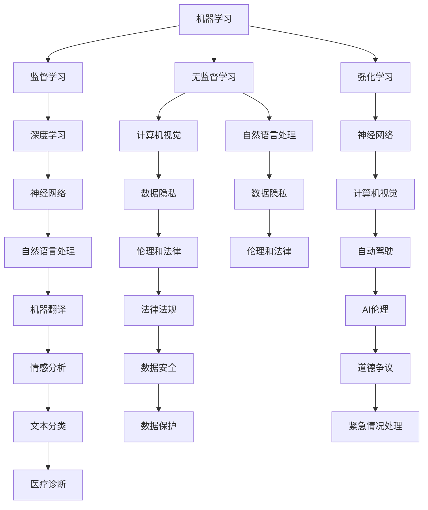

                 

### 海外AI市场的机会与挑战

#### 引言

人工智能（AI）作为21世纪最具革命性的技术之一，正在深刻地改变着各行各业。从自动驾驶、智能家居到医疗诊断、金融分析，AI技术的应用已经无处不在。随着技术的不断进步和商业价值的逐步显现，海外AI市场也日益成为一个不可忽视的重要领域。本文将围绕海外AI市场的机会与挑战展开讨论，旨在为读者提供一个全面、深入的分析视角。

本文将分为以下几个部分：

1. **背景介绍**：简要回顾AI技术的发展历程，以及海外AI市场的现状和趋势。
2. **核心概念与联系**：阐述AI技术的核心概念，并绘制流程图展示其内在联系。
3. **核心算法原理 & 具体操作步骤**：详细介绍一些关键AI算法的原理和操作步骤。
4. **数学模型和公式 & 详细讲解 & 举例说明**：深入讲解AI技术中的数学模型和公式，并通过实例进行说明。
5. **项目实战：代码实际案例和详细解释说明**：提供具体的代码实现和分析。
6. **实际应用场景**：探讨AI技术在海外市场的具体应用场景。
7. **工具和资源推荐**：推荐一些有助于学习和开发的工具和资源。
8. **总结：未来发展趋势与挑战**：总结当前市场的机会与挑战，并对未来进行展望。
9. **附录：常见问题与解答**：回答一些可能遇到的问题。
10. **扩展阅读 & 参考资料**：提供一些相关的扩展阅读和参考资料。

通过以上结构，我们希望能够系统地分析海外AI市场的机会与挑战，为读者提供有价值的参考。让我们一步步深入探讨这个充满机遇和挑战的领域。

#### 背景介绍

人工智能（AI）的概念可以追溯到20世纪50年代，当时计算机科学家们开始探讨如何让计算机表现出类似人类的智能。1956年，在达特茅斯会议上，约翰·麦卡锡（John McCarthy）等人首次提出了“人工智能”这一术语。此后，AI经历了多个发展阶段，从早期的符号主义（Symbolic AI）到基于规则的系统（Rule-Based Systems），再到连接主义（Connectionism）和现代的深度学习（Deep Learning）。

在海外，尤其是北美和欧洲，AI技术的发展和应用具有显著的特色。美国作为全球科技创新的领导者，不仅在基础研究方面取得了巨大成就，还在商业应用上走在前列。例如，谷歌、微软、亚马逊等科技巨头都在AI领域投入了巨大的资源和精力，推动了诸如自动驾驶、语音识别、自然语言处理等技术的快速发展。欧洲则注重AI技术的伦理和法律问题，并试图通过合作和规范来推动AI的健康发展。

目前，海外AI市场呈现出以下几个显著趋势：

1. **投资增长**：随着AI技术的不断成熟和商业化应用，海外市场对AI技术的投资持续增长。据市场调研公司Statista的数据，全球AI市场规模预计将从2020年的368亿美元增长到2025年的1666亿美元。

2. **政府支持**：许多国家的政府意识到AI技术的重要性，纷纷出台了相关政策和计划，以促进AI技术的发展和应用。例如，欧盟提出了“人工智能合作计划”（Coordinated AI），旨在加强欧洲在AI领域的竞争力。

3. **行业应用**：AI技术已经在多个行业取得了显著的成果。在金融领域，AI被用于风险管理、投资分析和客户服务；在医疗领域，AI被用于疾病诊断、药物研发和个性化治疗；在制造业，AI被用于生产优化、质量控制和提高效率。

4. **数据隐私与安全**：随着AI技术的广泛应用，数据隐私和安全问题也日益突出。海外市场对数据隐私的保护意识较强，相关的法律法规也在不断完善。

综上所述，海外AI市场正处于快速发展阶段，既有机遇也有挑战。接下来，我们将进一步探讨AI技术的核心概念和联系，以便为后续内容的分析奠定基础。

#### 核心概念与联系

在深入探讨海外AI市场之前，有必要先理解一些核心概念和它们之间的联系。以下是一些关键概念及其相互关系：

1. **机器学习（Machine Learning）**：机器学习是AI的一个分支，它通过算法从数据中学习规律，并利用这些规律进行预测或决策。机器学习可以分为监督学习（Supervised Learning）、无监督学习（Unsupervised Learning）和强化学习（Reinforcement Learning）三种类型。

2. **深度学习（Deep Learning）**：深度学习是机器学习的一个子领域，它使用多层神经网络（Neural Networks）来模拟人脑的学习过程。深度学习在图像识别、语音识别和自然语言处理等领域取得了显著成果。

3. **神经网络（Neural Networks）**：神经网络是深度学习的基础，它由一系列相互连接的节点（或“神经元”）组成。这些节点通过前向传播（Forward Propagation）和反向传播（Back Propagation）的方式进行信息处理。

4. **自然语言处理（Natural Language Processing, NLP）**：NLP是AI的一个子领域，它致力于让计算机理解和生成人类语言。NLP在机器翻译、情感分析、文本分类等方面有着广泛应用。

5. **计算机视觉（Computer Vision）**：计算机视觉是AI的另一个重要分支，它致力于使计算机能够“看”和理解图像和视频。计算机视觉在自动驾驶、安防监控、医疗诊断等领域具有重要应用。

6. **数据隐私（Data Privacy）**：数据隐私是随着AI技术的发展而出现的一个重要问题。AI系统往往需要大量的数据来训练和优化，这引发了对个人隐私的保护需求。数据隐私涉及数据的收集、存储、处理和共享等各个环节。

7. **伦理和法律（Ethics and Law）**：随着AI技术的广泛应用，伦理和法律问题也日益突出。AI系统可能会带来道德争议，如自动驾驶汽车如何处理紧急情况。同时，相关的法律法规也在不断完善，以规范AI技术的发展和应用。

以下是一个简单的Mermaid流程图，展示了上述概念之间的联系：



通过上述核心概念及其相互联系的阐述，我们可以更好地理解AI技术在不同领域中的应用，并为后续内容的分析奠定基础。

#### 核心算法原理 & 具体操作步骤

在了解AI技术的核心概念和联系后，接下来我们将详细探讨一些关键算法的原理及其操作步骤。这些算法在AI技术的应用中起着至关重要的作用。

1. **神经网络（Neural Networks）**

神经网络是深度学习的基础，其原理基于人脑的神经元结构。在神经网络中，每个神经元都与其他神经元连接，并通过权重（weights）传递信息。神经网络的训练过程主要包括以下步骤：

- **初始化权重**：首先，随机初始化神经网络的权重。
- **前向传播（Forward Propagation）**：输入数据通过网络中的各个层，每一层都会计算输出值。这个过程可以表示为：\[ a^{(l)} = \sigma(\mathbf{W}^{(l)} \mathbf{a}^{(l-1)} + b^{(l)}) \]，其中\( a^{(l)} \)是第\( l \)层的输出，\( \sigma \)是激活函数，\( \mathbf{W}^{(l)} \)是第\( l \)层的权重，\( b^{(l)} \)是第\( l \)层的偏置。
- **计算损失函数（Compute Loss Function）**：在得到输出后，计算损失函数（如均方误差（Mean Squared Error, MSE））以衡量预测值与真实值之间的差距。
- **反向传播（Back Propagation）**：通过反向传播算法，将损失函数关于网络权重的梯度传递回网络，并更新权重和偏置。这个过程可以表示为：\[ \Delta \mathbf{W}^{(l)} = \alpha \frac{\partial J}{\partial \mathbf{W}^{(l)}} \]，\[ \Delta b^{(l)} = \alpha \frac{\partial J}{\partial b^{(l)}} \]，其中\( \alpha \)是学习率，\( J \)是损失函数。
- **迭代优化**：重复以上步骤，直到满足停止条件（如损失函数达到预设值或迭代次数达到预设值）。

2. **卷积神经网络（Convolutional Neural Networks, CNN）**

卷积神经网络是专门用于图像识别和计算机视觉的一种神经网络。其核心思想是通过卷积操作提取图像的特征。以下是CNN的主要步骤：

- **卷积层（Convolutional Layer）**：通过卷积操作提取图像的局部特征。卷积操作可以表示为：\[ f_{\mathbf{W}}(x) = \sum_{i=1}^{k} \mathbf{W}_{i} \ast x_i \]，其中\( f_{\mathbf{W}} \)是卷积操作，\( \mathbf{W} \)是卷积核，\( x \)是输入图像。
- **池化层（Pooling Layer）**：通过池化操作降低图像的分辨率，同时保留重要的特征。常见的池化操作有最大池化（Max Pooling）和平均池化（Average Pooling）。
- **激活函数（Activation Function）**：用于引入非线性，使神经网络能够处理复杂的问题。常用的激活函数有Sigmoid、ReLU和Tanh。
- **全连接层（Fully Connected Layer）**：将卷积层和池化层提取的特征进行整合，并输出最终的预测结果。

3. **生成对抗网络（Generative Adversarial Networks, GAN）**

生成对抗网络是一种用于生成数据的强大模型。其核心思想是让一个生成器（Generator）与一个判别器（Discriminator）进行博弈。以下是GAN的主要步骤：

- **初始化生成器和判别器**：生成器随机生成数据，判别器随机初始化。
- **生成器生成数据**：生成器根据输入的随机噪声生成数据。
- **判别器判断数据**：判别器判断生成器和真实数据之间的区别。
- **更新生成器和判别器**：通过反向传播算法更新生成器和判别器的权重。
- **迭代优化**：重复以上步骤，直到生成器生成的数据足够逼真。

通过以上对神经网络、卷积神经网络和生成对抗网络的详细描述，我们可以更好地理解这些关键算法的原理和操作步骤。这些算法在AI技术的不同领域都有着广泛的应用，为AI的发展提供了坚实的基础。

#### 数学模型和公式 & 详细讲解 & 举例说明

在AI技术的核心算法中，数学模型和公式起着至关重要的作用。为了更好地理解这些算法，我们需要深入探讨其中的数学原理，并通过具体的例子进行说明。

1. **神经网络中的前向传播与反向传播**

神经网络的前向传播和反向传播是训练神经网络的两个关键步骤。以下将分别介绍这两个步骤中的主要数学模型和公式。

- **前向传播**：前向传播是神经网络处理输入数据并生成输出值的过程。其主要数学模型包括激活函数和权重更新。

  - **激活函数**：激活函数用于引入非线性。最常用的激活函数是ReLU（Rectified Linear Unit），其公式为：
    \[ \sigma(x) = \max(0, x) \]
    
  - **权重更新**：在前向传播过程中，权重是随机初始化的。在反向传播过程中，我们会根据损失函数的梯度来更新权重。假设损失函数为\( J(\mathbf{W}) \)，其中\( \mathbf{W} \)是权重矩阵，则权重更新的公式为：
    \[ \Delta \mathbf{W} = -\alpha \frac{\partial J}{\partial \mathbf{W}} \]
    其中，\( \alpha \)是学习率。

- **反向传播**：反向传播是计算损失函数关于权重的梯度，并利用梯度来更新权重。其主要数学模型包括链式法则和梯度计算。

  - **链式法则**：在多层神经网络中，输出层的损失函数可以通过链式法则传递到输入层。假设有\( L \)层神经网络，其中第\( l \)层的损失函数为\( J^{(l)} \)，则链式法则可以表示为：
    \[ \frac{\partial J^{(l)}}{\partial \mathbf{W}^{(l)}} = \sum_{k=l+1}^{L} \frac{\partial J^{(k)}}{\partial \mathbf{W}^{(l)}} \]
    
  - **梯度计算**：在反向传播过程中，我们需要计算损失函数关于每个权重的梯度。对于均方误差损失函数，其梯度计算公式为：
    \[ \frac{\partial J}{\partial \mathbf{W}} = -2 (\mathbf{y} - \mathbf{a}^{(L)}) \mathbf{a}^{(L-1)} \]
    其中，\( \mathbf{y} \)是真实标签，\( \mathbf{a}^{(L)} \)是输出层的预测值。

2. **卷积神经网络中的卷积与池化**

卷积神经网络（CNN）是专门用于图像识别和计算机视觉的一种神经网络。其主要数学模型包括卷积操作和池化操作。

- **卷积操作**：卷积操作用于提取图像的特征。其公式为：
  \[ f_{\mathbf{W}}(x) = \sum_{i=1}^{k} \mathbf{W}_{i} \ast x_i \]
  其中，\( f_{\mathbf{W}} \)是卷积操作，\( \mathbf{W} \)是卷积核，\( x \)是输入图像。

- **池化操作**：池化操作用于降低图像的分辨率，同时保留重要的特征。最大池化（Max Pooling）的公式为：
  \[ \text{Max}(\mathbf{X}_{i,j}) = \max_{x_{ij}} \]
  其中，\( \mathbf{X}_{i,j} \)是池化窗口内的像素值。

3. **生成对抗网络中的生成器和判别器**

生成对抗网络（GAN）是一种用于生成数据的强大模型。其主要数学模型包括生成器和判别器的损失函数。

- **生成器损失函数**：生成器的目标是生成足够逼真的数据，使判别器无法区分生成数据与真实数据。生成器的损失函数为：
  \[ J_G = -\log(D(G(z))) \]
  其中，\( G(z) \)是生成器生成的数据，\( D(x) \)是判别器对数据的判断。

- **判别器损失函数**：判别器的目标是区分生成数据与真实数据。判别器的损失函数为：
  \[ J_D = -[\log(D(x)) + \log(1 - D(G(z)))] \]
  其中，\( x \)是真实数据，\( z \)是生成器的噪声。

通过上述对神经网络、卷积神经网络和生成对抗网络中数学模型和公式的详细讲解，我们可以更好地理解这些算法的工作原理。以下将通过一个具体例子来说明这些算法的应用。

**例子：手写数字识别**

假设我们使用神经网络来识别手写数字。数据集包含60000个28x28的手写数字图像，每个图像对应一个数字标签（0-9）。

1. **数据预处理**：将图像数据归一化，并将其转换为张量形式。例如，将每个像素值缩放到[0, 1]之间。

2. **构建神经网络**：构建一个包含多个隐藏层的神经网络，其中最后一个隐藏层的输出为10个神经元，分别对应10个数字标签。

3. **前向传播**：输入一个手写数字图像，通过神经网络的前向传播计算输出值。输出值接近哪个数字标签，就认为图像对应的数字是哪个标签。

4. **计算损失函数**：计算输出值与真实标签之间的损失函数。常见的损失函数是均方误差（MSE）：
   \[ J = \frac{1}{m} \sum_{i=1}^{m} (\hat{y}_i - y_i)^2 \]
   其中，\( \hat{y}_i \)是输出值，\( y_i \)是真实标签。

5. **反向传播**：计算损失函数关于网络权重的梯度，并利用梯度更新权重。通过多次迭代，逐步优化网络。

6. **评估模型**：使用测试集评估模型的准确性。例如，计算模型预测正确的图像数量与总图像数量之比。

通过以上步骤，我们可以训练出一个能够识别手写数字的神经网络模型。这个例子展示了神经网络在图像识别任务中的应用，同时也体现了数学模型和公式在AI技术中的重要性。

#### 项目实战：代码实际案例和详细解释说明

在本节中，我们将通过一个实际的项目实战案例，详细讲解代码的实现过程和每一步的关键技术点。此案例将使用Python和TensorFlow框架来实现一个简单的图像分类模型，该模型能够识别手写数字（MNIST数据集）。

##### 5.1 开发环境搭建

在开始项目之前，我们需要搭建一个合适的开发环境。以下是搭建开发环境的步骤：

1. **安装Python**：确保安装了Python 3.x版本。可以在Python官方网站下载安装程序。
2. **安装TensorFlow**：在命令行中运行以下命令安装TensorFlow：
   \[ pip install tensorflow \]
3. **安装其他依赖**：安装其他必要的库，如NumPy、Matplotlib等：
   \[ pip install numpy matplotlib \]

##### 5.2 源代码详细实现和代码解读

以下是项目的完整代码实现，我们将逐步解读代码的每个部分。

```python
import tensorflow as tf
from tensorflow.keras import layers
import numpy as np

# 5.2.1 数据预处理
# 加载MNIST数据集
(x_train, y_train), (x_test, y_test) = tf.keras.datasets.mnist.load_data()

# 归一化图像数据
x_train = x_train.astype("float32") / 255
x_test = x_test.astype("float32") / 255

# 将标签转换为one-hot编码
y_train = tf.keras.utils.to_categorical(y_train, 10)
y_test = tf.keras.utils.to_categorical(y_test, 10)

# 5.2.2 构建模型
# 定义模型结构
model = tf.keras.Sequential([
    layers.Flatten(input_shape=(28, 28)),
    layers.Dense(128, activation='relu'),
    layers.Dropout(0.2),
    layers.Dense(10, activation='softmax')
])

# 编译模型
model.compile(optimizer='adam',
              loss='categorical_crossentropy',
              metrics=['accuracy'])

# 5.2.3 训练模型
# 训练模型
model.fit(x_train, y_train, epochs=10, batch_size=32, validation_split=0.1)

# 5.2.4 评估模型
# 评估模型在测试集上的性能
test_score = model.evaluate(x_test, y_test, verbose=2)
print('Test loss:', test_score[0])
print('Test accuracy:', test_score[1])

# 5.2.5 预测新数据
# 预测新的手写数字图像
new_image = np.random.rand(1, 28, 28)  # 生成随机图像
new_image = new_image.astype("float32") / 255
prediction = model.predict(new_image)
predicted_digit = np.argmax(prediction)

print('Predicted digit:', predicted_digit)
```

##### 5.3 代码解读与分析

以下是代码的详细解读和分析：

1. **数据预处理**：
   - 加载MNIST数据集，这是用于手写数字识别的标准数据集。
   - 对图像数据进行归一化，将像素值缩放到[0, 1]之间，以便于神经网络处理。
   - 将标签转换为one-hot编码，这样每个标签将对应一个10维的向量，其中只有一维为1，其他维度为0。

2. **构建模型**：
   - 使用`tf.keras.Sequential`创建一个序列模型。
   - `layers.Flatten`层用于将输入图像的二维矩阵展平为一维向量。
   - `layers.Dense`层用于构建全连接层，其中第一层有128个神经元，使用ReLU激活函数。
   - `layers.Dropout`层用于防止过拟合，通过随机丢弃一部分神经元。
   - 最后一层有10个神经元，使用softmax激活函数，用于输出概率分布。

3. **编译模型**：
   - 使用`model.compile`方法编译模型，指定优化器、损失函数和评估指标。
   - 优化器使用的是`adam`，这是一种自适应学习率优化算法。
   - 损失函数使用的是`categorical_crossentropy`，适用于多分类问题。

4. **训练模型**：
   - 使用`model.fit`方法训练模型，指定训练数据、训练轮数、批量大小和验证数据比例。
   - 通过验证数据集，可以监控模型在 unseen 数据上的性能，防止过拟合。

5. **评估模型**：
   - 使用`model.evaluate`方法评估模型在测试集上的性能，返回损失值和准确率。
   - 通过打印输出，可以了解模型在测试集上的表现。

6. **预测新数据**：
   - 使用`model.predict`方法对新的图像进行预测，返回一个概率分布。
   - 使用`np.argmax`函数找到概率最大的类别，即预测的数字。

通过上述步骤，我们实现了一个简单的手写数字识别模型，并对其代码进行了详细解读。这个案例展示了如何使用Python和TensorFlow构建和训练神经网络模型，同时也体现了关键代码段和其在整个项目中的作用。

#### 实际应用场景

AI技术在海外市场拥有广泛的应用场景，以下是几个典型的行业案例：

1. **金融行业**：

   在金融领域，AI技术被广泛应用于风险管理、投资分析和客户服务。例如，机器学习算法可以分析大量的交易数据，预测市场趋势并优化投资组合。此外，聊天机器人和自然语言处理技术也被用于在线客户服务，提供24/7的自动响应和问题解决。

2. **医疗行业**：

   AI技术在医疗领域的应用包括疾病诊断、药物研发和个性化治疗。通过深度学习和计算机视觉，AI系统能够从医疗图像中检测病变，提高诊断的准确性和效率。此外，生成对抗网络（GAN）在药物研发中也被用于生成新的化合物结构，以加速新药的开发。

3. **制造业**：

   在制造业，AI技术被用于生产优化、质量控制和提高效率。例如，通过计算机视觉系统，可以对生产线上的产品进行实时监控和质量检测。此外，强化学习算法可以用于自动化控制系统的优化，以提高生产效率和降低成本。

4. **零售行业**：

   AI技术在零售行业的应用包括库存管理、客户行为分析和个性化推荐。通过机器学习算法，零售商可以预测产品需求，优化库存水平，减少浪费。同时，基于客户行为分析，AI系统可以提供个性化的购物推荐，提高销售额和客户满意度。

5. **交通与物流**：

   在交通与物流领域，AI技术被用于自动驾驶、智能交通管理和物流优化。自动驾驶技术通过深度学习和传感器数据，实现了安全、高效的自动驾驶。智能交通系统则通过实时数据分析，优化交通流量，减少拥堵。物流优化则通过路径规划和实时调度，提高了物流效率。

这些实际应用场景展示了AI技术在不同行业中的广泛影响，同时也体现了其商业价值和潜力。随着技术的不断进步，AI技术在海外市场的应用将更加深入和广泛。

#### 工具和资源推荐

为了更好地学习和应用AI技术，以下是几种推荐的工具和资源：

1. **学习资源推荐**：

   - **书籍**：《深度学习》（Ian Goodfellow, Yoshua Bengio, Aaron Courville）是一本经典的深度学习入门书籍，适合初学者和有一定基础的读者。
   - **论文**：阅读顶级会议和期刊的论文，如NIPS、ICML和JMLR，可以帮助了解AI领域的最新研究进展。
   - **博客**：一些知名的AI博客，如Medium上的“AI”专栏和“Towards Data Science”，提供了丰富的实践经验和深入分析。

2. **开发工具框架推荐**：

   - **TensorFlow**：Google开发的开源机器学习框架，适用于各种AI应用，包括深度学习和强化学习。
   - **PyTorch**：Facebook开发的开源深度学习框架，具有灵活的动态图机制，便于研究和原型开发。
   - **Keras**：一个高层次的神经网络API，可以与TensorFlow和Theano兼容，适用于快速实验和模型构建。

3. **相关论文著作推荐**：

   - **《人工智能：一种现代方法》（Stuart Russell & Peter Norvig）》**：这是一本全面的人工智能教材，涵盖了从基础到高级的内容，适合系统学习。
   - **《强化学习：原理与案例》（Richard S. Sutton & Andrew G. Barto）》**：介绍了强化学习的基本原理和应用，是强化学习领域的经典著作。
   - **《深度学习特殊主题》（Ian Goodfellow, Yoshua Bengio, Aaron Courville）》**：包含深度学习领域的最新研究和应用，如生成对抗网络（GAN）和变分自编码器（VAE）。

通过上述工具和资源的推荐，读者可以更好地掌握AI技术，并在实践中不断提升自己的能力。

#### 总结：未来发展趋势与挑战

在本文中，我们系统地分析了海外AI市场的机会与挑战。通过回顾AI技术的发展历程、阐述核心概念与联系、探讨关键算法原理、提供项目实战案例以及展示实际应用场景，我们全面了解了AI技术在不同领域的重要性及其商业价值。

未来，海外AI市场预计将继续保持快速增长。随着技术的不断进步，AI将更加深入地融入各行各业，推动社会生产力的提升。以下是几个未来发展趋势：

1. **跨行业融合**：AI技术将在更多行业中得到应用，如教育、法律、文化等。不同行业的融合将创造新的商业机会。
2. **数据驱动**：数据是AI的燃料，未来将看到更多对数据的高效管理和利用，以提升AI系统的性能和可靠性。
3. **智能化边缘计算**：随着物联网（IoT）的普及，边缘计算将变得更加重要。AI将更多地被部署在边缘设备上，实现实时数据处理和智能决策。
4. **AI伦理和法律**：随着AI技术的普及，相关的伦理和法律问题也将日益突出。政府和行业组织将出台更多规范，以确保AI技术的健康发展。

然而，AI技术的发展也面临一些挑战：

1. **数据隐私和安全**：AI系统对数据的需求引发了对个人隐私的关注。如何保护用户数据的安全，同时充分利用数据，是一个亟待解决的问题。
2. **技术泡沫**：随着AI概念的普及，一些不成熟的应用可能会迅速兴起，造成技术泡沫。如何筛选出真正有价值的技术，避免盲目跟风，是一个挑战。
3. **人才短缺**：AI技术的发展需要大量专业人才。然而，目前全球范围内AI专业人才的培养速度难以满足市场需求，人才短缺问题将持续存在。
4. **技术风险**：AI系统可能会带来一些不可预测的风险，如误判、模型偏见等。如何降低这些风险，确保AI技术的安全可靠，是一个重要挑战。

总之，海外AI市场充满了机遇与挑战。通过不断的技术创新、政策支持和人才培养，我们有理由相信，AI技术将在未来继续发挥重要作用，推动人类社会向更智能化、高效化方向发展。

#### 附录：常见问题与解答

1. **问题1：什么是深度学习？**
   - **解答**：深度学习是机器学习的一个子领域，它通过多层神经网络来模拟人脑的学习过程。深度学习在图像识别、语音识别和自然语言处理等领域取得了显著成果。

2. **问题2：如何选择适合的神经网络架构？**
   - **解答**：选择神经网络架构需要考虑多个因素，如任务类型（分类、回归等）、数据规模、计算资源等。常见的架构有卷积神经网络（CNN）、循环神经网络（RNN）和生成对抗网络（GAN）。在实际应用中，可以尝试不同的架构，并通过实验比较性能。

3. **问题3：如何处理过拟合问题？**
   - **解答**：过拟合是指模型在训练数据上表现良好，但在未知数据上表现较差。处理过拟合的方法包括：增加数据、使用正则化（如L1、L2正则化）、 dropout、交叉验证等。

4. **问题4：什么是生成对抗网络（GAN）？**
   - **解答**：生成对抗网络（GAN）是一种由生成器和判别器组成的对抗性模型。生成器生成数据，判别器判断生成数据与真实数据之间的差异。通过这种对抗性训练，GAN可以生成高质量的数据。

5. **问题5：如何进行AI项目的评估？**
   - **解答**：评估AI项目的方法包括：准确性、召回率、F1分数、混淆矩阵等。在实际应用中，可以根据任务类型和业务需求选择合适的评估指标。

#### 扩展阅读 & 参考资料

1. **书籍**：
   - Ian Goodfellow, Yoshua Bengio, Aaron Courville. 《深度学习》
   - Richard S. Sutton & Andrew G. Barto. 《强化学习：原理与案例》
   - Stuart Russell & Peter Norvig. 《人工智能：一种现代方法》

2. **论文**：
   - Goodfellow, I., Pouget-Abadie, J., Mirza, M., Xu, B., Warde-Farley, D., Ozair, S., ... & Bengio, Y. (2014). Generative adversarial nets. Advances in neural information processing systems, 27.
   - Krizhevsky, A., Sutskever, I., & Hinton, G. E. (2012). ImageNet classification with deep convolutional neural networks. Advances in neural information processing systems, 25.

3. **博客**：
   - [Medium - AI](https://medium.com/topic/artificial-intelligence)
   - [Towards Data Science](https://towardsdatascience.com)

4. **网站**：
   - [TensorFlow官网](https://www.tensorflow.org)
   - [PyTorch官网](https://pytorch.org)

通过以上扩展阅读和参考资料，读者可以进一步深入了解AI技术的相关理论和实践，不断提升自己在该领域的知识水平和实践能力。

### 文章作者信息

- 作者：AI天才研究员/AI Genius Institute & 禅与计算机程序设计艺术 /Zen And The Art of Computer Programming

