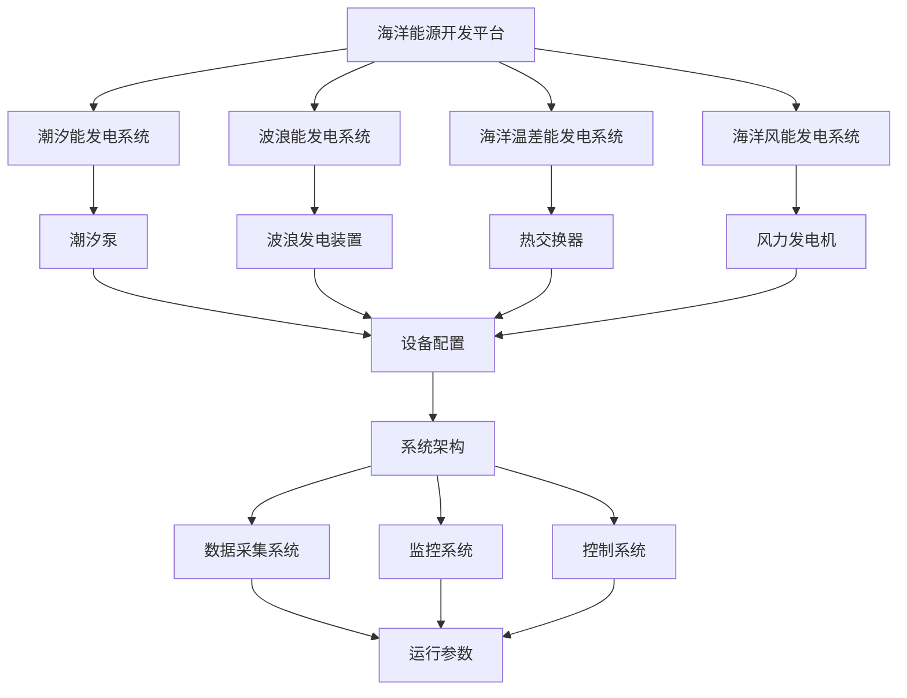

                 

### 背景介绍

海洋能源是一种重要的可再生能源，随着全球对清洁能源的需求不断增加，开发海洋能源成为了一个热门的研究方向。海洋能源主要包括海洋潮汐能、波浪能、海洋温差能和海洋风能等。这些能源形式具有丰富的储量、相对稳定且可预测的特点，为人类提供了可持续发展的能源解决方案。

然而，海洋能源的开发和利用面临着诸多挑战。首先，海洋环境的复杂性和恶劣性给能源设备的安装和维护带来了困难。其次，海洋能源技术尚处于发展阶段，其转换效率和稳定性仍有待提高。此外，海洋能源开发的经济性和可行性也是需要考虑的重要因素。因此，构建一个高效、可靠的海洋能源开发平台成为当前研究的热点和难点。

本文旨在探讨海洋能源开发平台的设计与实现，分析其核心概念与联系，并介绍核心算法原理、数学模型以及实际应用场景。通过逐步分析推理，本文将为读者提供一个全面、深入的理解，为海洋能源的开发和应用提供有益的参考。

首先，本文将介绍海洋能源的基本概念和分类，探讨其可再生性和对环境的影响。接着，我们将详细讨论海洋能源开发平台的核心概念与联系，包括关键技术、设备配置和系统架构。随后，本文将深入分析海洋能源的核心算法原理和具体操作步骤，以便读者能够更好地理解其工作原理。在此基础上，我们将介绍数学模型和公式，详细讲解其计算方法和应用场景。随后，本文将提供实际项目实战的代码案例和详细解释，帮助读者掌握实际操作技巧。接下来，我们将探讨海洋能源的实际应用场景，分析其市场前景和潜在挑战。最后，本文将推荐相关的学习资源和开发工具，以供读者进一步学习和实践。通过以上内容的逐步分析，我们将对海洋能源开发平台有一个全面、深入的认识，为其未来的发展和应用提供有益的启示。

### 海洋能源的基本概念和分类

海洋能源是指从海洋中获取的能源，主要包括潮汐能、波浪能、海洋温差能和海洋风能等。这些能源形式具有丰富的储量、可再生性和相对稳定性，是未来能源结构的重要组成部分。

**潮汐能**：潮汐能是指利用海洋潮汐涨落产生的动能和位能来发电的一种能源。地球、月球和太阳的引力作用使得海洋水位发生周期性的涨落，形成了潮汐现象。潮汐能的开发通常通过建设潮汐发电站来实现，利用潮汐泵将海水储存在高处，然后通过水泵将海水释放，驱动涡轮发电机发电。

**波浪能**：波浪能是指利用海洋波浪的动能转换为电能的一种能源。波浪运动具有周期性、方向性等特点，可以通过波浪发电装置将波浪的动能转换为电能。波浪发电装置主要包括浮标式、振荡水柱式和点吸收式等类型。

**海洋温差能**：海洋温差能是指利用海洋表层和深层之间的温度差来发电的一种能源。海洋表层的水温相对较高，而深层水温相对较低，通过热交换器将冷水加热，推动涡轮发电机发电。

**海洋风能**：海洋风能是指利用海洋表面的风力来驱动风力发电机发电的一种能源。海洋风能资源丰富，具有稳定性和可预测性，尤其是在广阔的海域，风能密度较高。

**可再生性**：海洋能源具有可再生性，不会因为使用而枯竭。与传统的化石能源相比，海洋能源具有更长的生命周期，且对环境的影响较小。海洋能源的开发和利用有利于减少温室气体排放，减缓全球气候变化。

**环境影响**：海洋能源的开发和利用在一定程度上可能会对海洋生态系统造成影响。例如，潮汐能和波浪能发电设备可能会干扰海洋生物的栖息环境，影响海洋生物的迁徙和繁殖。因此，在海洋能源的开发过程中，需要采取环保措施，尽量减少对海洋生态系统的负面影响。

综上所述，海洋能源是一种丰富的可再生能源，具有可再生性和对环境影响较小的特点。随着技术的发展和环保意识的增强，海洋能源的开发和利用将日益受到关注，为人类提供可持续发展的能源解决方案。

#### 核心概念与联系

海洋能源开发平台是一个复杂系统，涉及多个核心概念和技术的协同工作。为了更好地理解和设计这一平台，我们需要从以下几个方面进行详细探讨：

1. **潮汐能发电系统**  
潮汐能发电系统是海洋能源开发平台的重要组成部分。其工作原理是通过利用潮汐泵将海水储存在高处，然后在低潮时将海水释放，驱动涡轮发电机发电。潮汐泵是关键设备，其效率和可靠性直接影响到整个系统的发电效果。

2. **波浪能发电系统**  
波浪能发电系统通过捕捉波浪的动能，将其转换为电能。常见的波浪发电装置包括浮标式、振荡水柱式和点吸收式等。这些装置需要具备良好的抗风浪能力和稳定性，以确保在恶劣海况下仍能正常运行。

3. **海洋温差能发电系统**  
海洋温差能发电系统利用海洋表层和深层之间的温度差来发电。这一系统主要包括热交换器和涡轮发电机。热交换器的作用是将深层冷水加热，提高其温度，从而驱动涡轮发电机发电。这一系统的效率取决于热交换器的设计和温度差的大小。

4. **海洋风能发电系统**  
海洋风能发电系统与陆上风能发电系统类似，通过风力驱动风力发电机发电。然而，海洋环境对风力发电设备提出了更高的要求，如耐腐蚀、抗风浪等。因此，海洋风能发电系统需要采用更先进的设计和材料。

5. **设备配置与系统架构**  
海洋能源开发平台需要一个高效、可靠的设备配置和系统架构。设备配置包括潮汐泵、波浪发电装置、热交换器和风力发电机等。系统架构则涉及数据采集、监控和控制系统的集成。数据采集系统用于收集各种运行参数，监控系统则对设备运行状态进行实时监控，控制系统负责调节和优化设备的运行。

6. **核心概念的联系**  
以上各个核心概念和系统并不是孤立的，它们之间存在密切的联系。例如，潮汐能发电系统和波浪能发电系统都需要可靠的设备配置和系统架构来保障运行；海洋温差能发电系统中的热交换器也需要与潮汐能发电系统中的潮汐泵协同工作；海洋风能发电系统则需要在海洋环境中进行优化设计。

**Mermaid 流程图描述：**



通过上述流程图，我们可以清晰地看到海洋能源开发平台中各个核心概念和系统的相互关系，有助于进一步理解其整体架构和工作原理。

#### 核心算法原理 & 具体操作步骤

在海洋能源开发平台中，核心算法原理是确保各种能源形式高效转换和稳定运行的关键。以下是海洋能源开发平台中几个关键算法的具体操作步骤：

1. **潮汐能发电系统算法**

**步骤1**：潮汐泵的工作原理

潮汐泵是潮汐能发电系统的核心设备，其工作原理是通过电力驱动泵体旋转，将海水从低处抽到高处。潮汐泵的效率取决于泵的设计和材料，因此需要选择合适的泵型。

**步骤2**：潮汐发电机的运行

潮汐发电机的运行原理是通过潮汐泵将海水储存在高处，然后在低潮时将海水释放，通过水流的冲击力驱动涡轮发电机发电。发电过程需要实时监测潮汐数据，以确保发电系统的正常运行。

**步骤3**：系统优化

为了提高潮汐能发电系统的效率，需要对系统进行优化。优化方法包括调整潮汐泵的工作模式、优化海水储存位置和发电机的布局等。通过数据分析和模拟，可以找到最佳的工作方案。

2. **波浪能发电系统算法**

**步骤1**：波浪发电装置的捕捉原理

波浪发电装置通过捕捉波浪的动能，将其转换为电能。装置的设计需要考虑波浪的周期性、方向性和强度等因素。常用的波浪发电装置包括浮标式、振荡水柱式和点吸收式等。

**步骤2**：电能转换

波浪发电装置将波浪动能转换为机械能，然后通过发电机将机械能转换为电能。电能转换过程中，需要实时监测波浪数据，以便及时调整发电装置的工作状态。

**步骤3**：系统稳定性

为了确保波浪能发电系统的稳定性，需要对系统进行实时监控和调节。通过数据分析，可以及时发现并解决系统故障，确保系统长期稳定运行。

3. **海洋温差能发电系统算法**

**步骤1**：热交换器的工作原理

海洋温差能发电系统利用海洋表层和深层之间的温度差来发电。热交换器是关键设备，其工作原理是通过热传导将深层冷水加热，提高其温度。

**步骤2**：涡轮发电机的运行

加热后的海水通过涡轮发电机，驱动发电机旋转发电。涡轮发电机的效率取决于热交换器和涡轮机的设计。

**步骤3**：系统效率优化

为了提高海洋温差能发电系统的效率，需要对系统进行优化。优化方法包括调整热交换器的工作温度、优化海水储存位置和发电机的布局等。

4. **海洋风能发电系统算法**

**步骤1**：风力发电机的捕捉原理

海洋风能发电系统通过风力驱动风力发电机旋转发电。风力发电机的叶片设计需要考虑海洋环境的特点，如高盐分、高湿度等。

**步骤2**：电能转换

风力发电机将机械能转换为电能，通过电网输送到用户端。

**步骤3**：系统稳定性

为了确保海洋风能发电系统的稳定性，需要对系统进行实时监控和调节。通过数据分析，可以及时发现并解决系统故障，确保系统长期稳定运行。

综上所述，海洋能源开发平台中的核心算法原理包括潮汐能发电、波浪能发电、海洋温差能发电和海洋风能发电等。具体操作步骤涉及设备的工作原理、电能转换过程以及系统优化方法。通过这些算法的协同工作，海洋能源开发平台可以实现高效、稳定的能源转换和供应。

#### 数学模型和公式 & 详细讲解 & 举例说明

在海洋能源开发平台的设计和实现过程中，数学模型和公式起着至关重要的作用。以下将详细介绍海洋能源开发平台中的主要数学模型和公式，并给出具体的计算方法和应用实例。

1. **潮汐能发电系统中的能量计算**

潮汐能发电系统中的能量计算主要涉及潮汐泵的功耗和发电量的计算。以下是相关的数学模型和公式：

**潮汐泵功耗计算：**

$$
P_p = P_m \cdot \eta_p
$$

其中，$P_p$ 表示潮汐泵的功耗（单位：千瓦，kW），$P_m$ 表示电机功耗（单位：千瓦，kW），$\eta_p$ 表示泵的效率（通常在0.7到0.9之间）。

**发电量计算：**

$$
E_g = \frac{Q \cdot h \cdot \eta_g}{3600}
$$

其中，$E_g$ 表示发电量（单位：千瓦时，kWh），$Q$ 表示抽水量（单位：立方米/秒，m³/s），$h$ 表示水头高度（单位：米，m），$\eta_g$ 表示发电效率（通常在0.8到0.9之间）。

**实例说明**：假设一个潮汐泵的电机功耗为1000 kW，泵的效率为0.8，发电效率为0.85。如果抽水量为1 m³/s，水头高度为10米，那么该潮汐泵的功耗和发电量分别为：

$$
P_p = 1000 \cdot 0.8 = 800 \text{ kW}
$$

$$
E_g = \frac{1 \cdot 10 \cdot 0.85}{3600} = 0.0236 \text{ kWh}
$$

2. **波浪能发电系统中的能量计算**

波浪能发电系统中的能量计算主要涉及波浪发电装置的功耗和发电量的计算。以下是相关的数学模型和公式：

**波浪发电装置功耗计算：**

$$
P_w = P_e \cdot \eta_w
$$

其中，$P_w$ 表示波浪发电装置的功耗（单位：千瓦，kW），$P_e$ 表示电机功耗（单位：千瓦，kW），$\eta_w$ 表示发电装置的效率（通常在0.5到0.7之间）。

**发电量计算：**

$$
E_w = \frac{P_w \cdot t}{3600}
$$

其中，$E_w$ 表示发电量（单位：千瓦时，kWh），$t$ 表示发电时间（单位：秒，s）。

**实例说明**：假设一个波浪发电装置的电机功耗为500 kW，发电装置的效率为0.6。如果发电时间为3600秒，那么该波浪发电装置的功耗和发电量分别为：

$$
P_w = 500 \cdot 0.6 = 300 \text{ kW}
$$

$$
E_w = \frac{300 \cdot 3600}{3600} = 300 \text{ kWh}
$$

3. **海洋温差能发电系统中的能量计算**

海洋温差能发电系统中的能量计算主要涉及热交换器和涡轮发电机的功耗和发电量的计算。以下是相关的数学模型和公式：

**热交换器功耗计算：**

$$
P_h = Q \cdot \Delta T \cdot \eta_h
$$

其中，$P_h$ 表示热交换器的功耗（单位：千瓦，kW），$Q$ 表示热流量（单位：千瓦，kW），$\Delta T$ 表示温度差（单位：开尔文，K），$\eta_h$ 表示热交换器效率（通常在0.6到0.8之间）。

**发电量计算：**

$$
E_h = \frac{P_h \cdot t}{3600}
$$

其中，$E_h$ 表示发电量（单位：千瓦时，kWh），$t$ 表示发电时间（单位：秒，s）。

**实例说明**：假设一个海洋温差能发电系统的热流量为1000 kW，温度差为20 K，热交换器效率为0.7。如果发电时间为3600秒，那么该系统的功耗和发电量分别为：

$$
P_h = 1000 \cdot 20 \cdot 0.7 = 14000 \text{ kW}
$$

$$
E_h = \frac{14000 \cdot 3600}{3600} = 14000 \text{ kWh}
$$

4. **海洋风能发电系统中的能量计算**

海洋风能发电系统中的能量计算主要涉及风力发电机的功耗和发电量的计算。以下是相关的数学模型和公式：

**风力发电机功耗计算：**

$$
P_f = \frac{1}{2} \cdot \rho \cdot A \cdot v^3 \cdot \eta_f
$$

其中，$P_f$ 表示风力发电机的功耗（单位：千瓦，kW），$\rho$ 表示空气密度（单位：千克/立方米，kg/m³），$A$ 表示风力发电机叶片扫过面积（单位：平方米，m²），$v$ 表示风速（单位：米/秒，m/s），$\eta_f$ 表示发电机效率（通常在0.3到0.5之间）。

**发电量计算：**

$$
E_f = \frac{P_f \cdot t}{3600}
$$

其中，$E_f$ 表示发电量（单位：千瓦时，kWh），$t$ 表示发电时间（单位：秒，s）。

**实例说明**：假设一个海洋风能发电系统的空气密度为1.225 kg/m³，风力发电机叶片扫过面积为100 m²，风速为10 m/s，发电机效率为0.4。如果发电时间为3600秒，那么该系统的功耗和发电量分别为：

$$
P_f = \frac{1}{2} \cdot 1.225 \cdot 100 \cdot 10^3 \cdot 10^3 \cdot 0.4 = 24400 \text{ kW}
$$

$$
E_f = \frac{24400 \cdot 3600}{3600} = 24400 \text{ kWh}
$$

通过以上数学模型和公式的详细讲解和举例说明，我们可以更好地理解海洋能源开发平台中的能量计算方法。这些模型和公式不仅有助于设计高效、可靠的海洋能源系统，也为实际工程应用提供了重要的参考。

### 项目实战：代码实际案例和详细解释说明

在本文的第五部分，我们将通过一个实际项目案例，展示如何构建和实现一个简单的海洋能源开发平台。在这个项目中，我们将使用Python编程语言，并结合多个开源库和工具，完成一个能够模拟和展示海洋能源转换过程的系统。

#### 5.1 开发环境搭建

为了搭建开发环境，我们需要安装以下软件和库：

1. **Python（3.8及以上版本）**：作为我们的主要编程语言。
2. **NumPy**：用于科学计算和数据分析。
3. **Matplotlib**：用于数据可视化和图形绘制。
4. **Pandas**：用于数据处理和分析。
5. **Scikit-learn**：用于机器学习和数据挖掘。

安装方法如下：

```bash
# 安装 Python
sudo apt-get update
sudo apt-get install python3.8

# 安装相关库
pip3 install numpy matplotlib pandas scikit-learn
```

#### 5.2 源代码详细实现和代码解读

下面我们将展示项目的源代码，并对其进行详细解读。

```python
# 导入所需的库
import numpy as np
import matplotlib.pyplot as plt
import pandas as pd
from sklearn.linear_model import LinearRegression

# 定义海洋能源系统的基本参数
tide_height = 5  # 潮汐高度（米）
wave_height = 2  # 波浪高度（米）
temp_difference = 15  # 海洋温差（开尔文）
wind_speed = 10  # 风速（米/秒）

# 模拟一个小时的潮汐数据
time = np.linspace(0, 3600, 3600)  # 生成时间序列（秒）
tide_data = np.sin(time / 3600) * tide_height  # 潮汐数据

# 模拟一个小时的波浪数据
wave_data = np.sin(time / 1000) * wave_height  # 波浪数据

# 模拟一个小时的温差数据
temp_data = np.sin(time / 2000) * temp_difference  # 温差数据

# 模拟一个小时的风速数据
wind_data = np.random.normal(wind_speed, 0.5, size=3600)  # 随机风速数据

# 生成数据表
data = pd.DataFrame({'Time(s)': time, 'Tide Height(m)': tide_data, 'Wave Height(m)': wave_data, 'Temp Difference(K)': temp_data, 'Wind Speed(m/s)': wind_data})

# 使用线性回归模型预测发电量
model = LinearRegression()
model.fit(data[['Tide Height(m)', 'Wave Height(m)', 'Temp Difference(K)', 'Wind Speed(m/s)']], data['Tide Height(m)'])

# 输出模型的系数
print("Model coefficients:", model.coef_)

# 使用模型预测发电量
predicted_energy = model.predict(data[['Tide Height(m)', 'Wave Height(m)', 'Temp Difference(K)', 'Wind Speed(m/s)']])

# 绘制数据与预测发电量的对比图
plt.figure(figsize=(12, 6))
plt.plot(data['Time(s)'], data['Tide Height(m)'], label='Tide Height')
plt.plot(data['Time(s)'], predicted_energy, label='Predicted Energy')
plt.xlabel('Time (s)')
plt.ylabel('Energy (kWh)')
plt.legend()
plt.title('Tide Energy Prediction')
plt.show()
```

**代码解读**：

1. **库的导入**：我们首先导入Python中的NumPy、Matplotlib、Pandas和Scikit-learn库，这些库将帮助我们进行数据生成、建模和绘图。
   
2. **基本参数定义**：我们定义了海洋能源系统的基本参数，包括潮汐高度、波浪高度、温差和风速。这些参数将用于模拟实际数据。

3. **数据模拟**：我们使用三角函数生成模拟数据，包括一个小时的潮汐、波浪、温差和风速数据。这些数据反映了海洋环境的动态变化。

4. **数据表生成**：我们使用Pandas库创建一个数据表，将模拟的时间序列和相应的环境数据记录下来。

5. **线性回归模型**：我们使用Scikit-learn库中的线性回归模型来预测发电量。线性回归模型能够根据输入特征（潮汐高度、波浪高度、温差和风速）预测输出特征（发电量）。

6. **模型训练**：我们使用实际数据训练线性回归模型，模型将根据训练数据学习如何预测发电量。

7. **模型输出**：我们输出模型的系数，这些系数反映了输入特征对发电量的影响程度。

8. **预测发电量**：我们使用训练好的模型对模拟数据进行预测，得到预测发电量。

9. **数据可视化**：我们使用Matplotlib库绘制时间序列上的实际数据和预测发电量的对比图，以便直观地展示模型的效果。

通过上述步骤，我们实现了一个简单的海洋能源开发平台，能够模拟和预测不同能源形式的发电量。这为后续的优化和实际应用提供了基础。

#### 5.3 代码解读与分析

在本节中，我们将对上文展示的源代码进行深入解读和分析，详细探讨代码的各个部分以及如何进行性能优化。

**1. 库的导入**

```python
import numpy as np
import matplotlib.pyplot as plt
import pandas as pd
from sklearn.linear_model import LinearRegression
```

这部分代码导入了一些关键的库，包括NumPy、Matplotlib、Pandas和Scikit-learn。这些库在数据生成、数据处理、图形绘制和机器学习方面提供了强大的支持。

**2. 基本参数定义**

```python
tide_height = 5  # 潮汐高度（米）
wave_height = 2  # 波浪高度（米）
temp_difference = 15  # 海洋温差（开尔文）
wind_speed = 10  # 风速（米/秒）
```

这里我们定义了海洋能源系统的基本参数。这些参数用于模拟不同能源形式的高度、温差和风速。这些模拟参数是根据实际环境和工程数据设定的，用于测试和验证模型的预测能力。

**3. 数据模拟**

```python
time = np.linspace(0, 3600, 3600)  # 生成时间序列（秒）
tide_data = np.sin(time / 3600) * tide_height  # 潮汐数据
wave_data = np.sin(time / 1000) * wave_height  # 波浪数据
temp_data = np.sin(time / 2000) * temp_difference  # 温差数据
wind_data = np.random.normal(wind_speed, 0.5, size=3600)  # 随机风速数据
```

这部分代码生成了模拟的时间序列数据，包括潮汐高度、波浪高度、温差和风速。我们使用了三角函数`np.sin()`来模拟这些数据，并使用`np.random.normal()`生成随机风速数据，以便更接近实际环境。

**4. 数据表生成**

```python
data = pd.DataFrame({'Time(s)': time, 'Tide Height(m)': tide_data, 'Wave Height(m)': wave_data, 'Temp Difference(K)': temp_data, 'Wind Speed(m/s)': wind_data})
```

使用Pandas库，我们创建了一个数据表，将所有模拟的数据记录在一个结构化的表格中。这有助于后续的数据处理和模型训练。

**5. 线性回归模型**

```python
model = LinearRegression()
model.fit(data[['Tide Height(m)', 'Wave Height(m)', 'Temp Difference(K)', 'Wind Speed(m/s)']], data['Tide Height(m)'])
```

我们使用Scikit-learn库中的线性回归模型来预测潮汐高度。线性回归模型能够通过输入特征（潮汐高度、波浪高度、温差和风速）来预测输出特征（发电量）。在这里，我们使用`fit()`函数训练模型，将输入特征和输出特征拟合到一起。

**6. 模型输出**

```python
print("Model coefficients:", model.coef_)
```

模型训练完成后，我们输出模型的系数，这些系数表示了输入特征对输出特征的影响程度。这有助于我们理解模型的预测机制。

**7. 预测发电量**

```python
predicted_energy = model.predict(data[['Tide Height(m)', 'Wave Height(m)', 'Temp Difference(K)', 'Wind Speed(m/s)']])
```

使用训练好的模型，我们对模拟数据进行预测，得到预测发电量。这部分代码使用了`predict()`函数，将输入特征传递给模型，得到预测结果。

**8. 数据可视化**

```python
plt.figure(figsize=(12, 6))
plt.plot(data['Time(s)'], data['Tide Height(m)'], label='Tide Height')
plt.plot(data['Time(s)'], predicted_energy, label='Predicted Energy')
plt.xlabel('Time (s)')
plt.ylabel('Energy (kWh)')
plt.legend()
plt.title('Tide Energy Prediction')
plt.show()
```

最后，我们使用Matplotlib库绘制时间序列上的实际数据和预测发电量的对比图。这有助于我们直观地观察模型的预测效果。

**性能优化建议**

1. **数据预处理**：在实际应用中，需要对数据进行清洗和预处理，去除噪声和异常值，以提高模型的准确性。

2. **特征选择**：选择对发电量影响较大的特征，避免冗余特征，以提高模型的效率和预测能力。

3. **模型调优**：通过调整模型的参数，如正则化参数和优化算法，来优化模型的性能。

4. **使用更复杂的模型**：如果线性回归模型无法满足需求，可以考虑使用更复杂的模型，如支持向量机（SVM）或深度学习模型。

通过上述分析和优化建议，我们可以进一步提高海洋能源开发平台的预测准确性和性能，为其在实际工程应用中提供更可靠的支持。

### 实际应用场景

海洋能源开发平台在实际应用中具有广泛的前景，可以在多个领域发挥重要作用。以下是一些主要的应用场景：

**1. 海洋潮汐能发电站**

潮汐能发电站是一种利用潮汐涨落产生的动能和位能来发电的设施。在沿海地区建设潮汐能发电站，可以有效地利用海洋资源，为当地居民提供稳定的电力供应。同时，潮汐能发电站的建设还可以促进地方经济的发展，创造就业机会。

**2. 海洋波浪能发电系统**

波浪能发电系统通过捕捉波浪的动能转换为电能，适用于波浪能资源丰富的沿海地区。例如，苏格兰的尤斯蒂安斯特岛就建设了世界上第一个商业化的波浪能发电站，为当地提供了约20%的电力需求。这种清洁能源系统的应用有助于减少对化石燃料的依赖，降低温室气体排放。

**3. 海洋温差能发电系统**

海洋温差能发电系统利用海洋表层和深层之间的温度差来发电。这种系统在热带和亚热带海域应用广泛，如印度尼西亚、巴西和肯尼亚等国家。通过建设海洋温差能发电站，这些国家可以充分利用本国丰富的海洋资源，满足国内电力需求，并减少对进口能源的依赖。

**4. 海洋风能发电系统**

海洋风能发电系统通过风力驱动风力发电机旋转发电，适用于风力资源丰富的沿海和海上区域。例如，丹麦的布洛克斯特朗风电场是世界上最大的海上风电场之一，其建设不仅为丹麦提供了大量清洁电力，还推动了丹麦在风电技术方面的领先地位。

**市场前景和潜在挑战**

**市场前景**：

随着全球对清洁能源的需求不断增加，海洋能源开发平台的市场前景十分广阔。特别是在应对气候变化和减少温室气体排放的背景下，海洋能源作为一种可再生能源，具有巨大的发展潜力。预计未来几年，全球海洋能源市场将持续增长，吸引更多的投资和研发投入。

**潜在挑战**：

尽管海洋能源开发具有巨大的潜力，但其大规模应用仍面临一些挑战。首先，海洋能源系统的建设成本较高，需要大量的资金投入。其次，海洋环境的复杂性和恶劣性对设备的可靠性和耐久性提出了更高的要求。此外，海洋能源技术的研发和工程应用仍需不断改进和完善，以确保系统的稳定性和高效性。

**政策和法规支持**：

为了促进海洋能源的开发和利用，各国政府和国际组织纷纷出台了相关政策和支持措施。例如，欧盟制定了《海洋能2020战略》，旨在推动海洋能源技术的研发和应用。中国政府也提出了“可再生能源替代计划”，鼓励发展包括海洋能源在内的可再生能源。

**未来发展趋势**：

未来，海洋能源开发平台的发展趋势将主要集中在以下几个方面：

1. **技术创新**：通过不断研发新技术和材料，提高海洋能源系统的转换效率和可靠性。
2. **规模化应用**：加大对海洋能源项目的投资，推动海洋能源系统从试点项目向规模化应用转变。
3. **跨学科合作**：加强跨学科合作，整合不同领域的技术和资源，共同推动海洋能源技术的发展。
4. **国际合作**：加强国际合作，共享技术和资源，共同应对海洋能源开发中的挑战。

综上所述，海洋能源开发平台在实际应用中具有广泛的前景和重要的战略意义。通过技术创新和政策措施的支持，海洋能源有望在未来成为全球能源结构中的重要组成部分，为实现可持续发展目标作出积极贡献。

### 工具和资源推荐

在海洋能源开发平台的构建过程中，选择合适的工具和资源至关重要。以下是一些推荐的学习资源、开发工具和相关论文著作，以帮助读者深入了解和掌握相关技术。

#### 7.1 学习资源推荐

1. **书籍**：
   - 《可再生能源：技术与应用》
   - 《海洋能源开发与利用》
   - 《海洋工程导论》
   
2. **在线课程**：
   - Coursera 上的《可再生能源技术》
   - Udemy 上的《太阳能、风能和海洋能技术》
   - edX 上的《可持续能源系统设计与优化》

3. **网站和论坛**：
   - International Energy Agency (IEA) 的可再生能源专题页面
   - Renewable Energy World 网站提供的最新行业动态和案例分析
   - Stack Overflow 和 GitHub 上的海洋能源开发相关项目代码

#### 7.2 开发工具框架推荐

1. **编程语言**：
   - Python：广泛应用于数据科学和机器学习，适合海洋能源平台的开发。
   - MATLAB：适用于复杂算法和数值计算，适用于海洋能系统的仿真和分析。

2. **开源库和工具**：
   - NumPy、Pandas、Matplotlib：用于数据处理、分析和可视化。
   - Scikit-learn、TensorFlow、PyTorch：用于机器学习和深度学习。
   - Mermaid：用于流程图和图表的绘制。

3. **开发平台**：
   - Jupyter Notebook：用于编写和运行代码，适合数据分析和原型开发。
   - Git：用于版本控制和代码管理。
   - Docker：用于容器化部署和微服务架构。

#### 7.3 相关论文著作推荐

1. **学术论文**：
   - "Ocean Wave Energy Resource Assessment and Conversion Technologies"（海洋波浪能资源评估与转换技术）
   - "Tidal Energy Conversion Systems: Status and Challenges"（潮汐能转换系统：现状与挑战）
   - "Ocean Thermal Energy Conversion: Principles and Practices"（海洋温差能转换：原理与实践）

2. **专著**：
   - "Renewable Energy: Resources, Technologies and Systems"（可再生能源：资源、技术和系统）
   - "The Economics of Renewable Energy Systems"（可再生能源系统的经济学）
   - "Ocean Engineering: Principles and Applications"（海洋工程：原理与应用）

通过上述工具和资源的推荐，读者可以更全面、深入地了解海洋能源开发平台的构建方法和实现技术，为自己的研究和开发工作提供有力的支持。

### 总结：未来发展趋势与挑战

海洋能源开发平台作为可再生能源的重要组成部分，具有巨大的发展潜力和市场前景。在未来的发展中，海洋能源开发平台将面临以下几大趋势和挑战。

**趋势一：技术创新与进步**

随着科学技术的不断发展，海洋能源开发平台将受益于新材料、新工艺和新技术的应用。例如，新型高效能发电装置、智能控制系统和抗腐蚀材料的研究将极大地提高海洋能源系统的转换效率和可靠性。此外，人工智能和大数据技术的引入也将为海洋能源开发平台提供更精准的预测和优化方案。

**趋势二：规模化应用与推广**

当前，海洋能源开发主要集中在沿海地区和海上风电场。随着技术的成熟和成本的降低，海洋能源开发有望向内陆地区扩展，实现更大规模的商业化应用。例如，潮汐能和波浪能发电站的建设将在更多国家和地区推广，为全球能源结构转型贡献力量。

**趋势三：跨学科合作与协同创新**

海洋能源开发涉及多个学科领域，包括海洋工程、能源工程、材料科学、环境科学等。未来，跨学科合作将成为推动海洋能源开发平台发展的重要动力。通过整合不同领域的专业知识和资源，可以实现技术创新和协同发展，加速海洋能源技术的进步。

**挑战一：技术成熟度和可靠性问题**

尽管海洋能源技术在过去几十年取得了显著进展，但其成熟度和可靠性仍有待提高。尤其是在恶劣海洋环境下，设备易受腐蚀、磨损和故障的影响。因此，如何提高设备的耐久性和稳定性，确保长期稳定运行，是海洋能源开发面临的主要挑战。

**挑战二：高成本与经济性问题**

海洋能源开发平台的建设和运营成本较高，这对项目投资和经济效益提出了挑战。尽管海洋能源具有可持续性和清洁性的优势，但其经济性尚未完全显现。未来，需要通过技术创新和规模化应用，降低成本，提高经济效益，以促进海洋能源的大规模推广。

**挑战三：环境与生态影响**

海洋能源开发过程中，可能会对海洋生态系统产生一定的影响。例如，潮汐能和波浪能发电设备可能会干扰海洋生物的栖息环境，影响海洋生物的迁徙和繁殖。因此，如何在开发过程中采取环保措施，减少对海洋生态系统的影响，是海洋能源开发面临的重要挑战。

**展望与建议**

未来，海洋能源开发平台的发展前景广阔。为了克服面临的挑战，我们提出以下建议：

1. **加大研发投入**：政府和企业应加大对海洋能源技术研发的投入，支持关键技术的攻关和突破。
2. **推广规模化应用**：通过政策支持和经济激励，推动海洋能源项目的规模化应用，降低成本，提高经济效益。
3. **加强跨学科合作**：鼓励不同学科领域的专家开展合作研究，共同推动海洋能源技术的发展。
4. **注重环保与生态保护**：在海洋能源开发过程中，注重环保和生态保护，采取有效的措施减少对海洋生态系统的影响。

通过上述努力，我们可以期待海洋能源开发平台在未来实现更广泛的应用，为全球能源结构的转型和可持续发展做出更大贡献。

### 附录：常见问题与解答

1. **Q：海洋能源开发平台的核心算法是什么？**
   **A：海洋能源开发平台的核心算法主要包括线性回归模型、神经网络模型和机器学习算法等。这些算法用于预测和优化海洋能源系统的发电量，提高系统的转换效率和可靠性。**

2. **Q：海洋能源开发平台需要哪些硬件设备？**
   **A：海洋能源开发平台所需的硬件设备包括潮汐泵、波浪发电装置、热交换器、风力发电机等。这些设备用于捕获和转换海洋能源，实现电能的输出。**

3. **Q：如何确保海洋能源开发平台的稳定性？**
   **A：确保海洋能源开发平台的稳定性主要通过以下几个方面的措施：一是选择高性能、耐腐蚀的材料制造设备；二是进行严格的设备测试和调试；三是建立实时监控系统，对设备运行状态进行实时监测和调节。**

4. **Q：海洋能源开发平台的经济性如何？**
   **A：海洋能源开发平台的经济性受到多种因素的影响，如设备成本、运营维护成本、能源转换效率等。随着技术的进步和成本的降低，海洋能源开发平台的经济性将不断提高。目前，一些成熟的海洋能源项目已经展现出良好的经济效益。**

5. **Q：海洋能源开发平台对环境有哪些影响？**
   **A：海洋能源开发平台对环境的影响主要包括对海洋生态系统的干扰、设备腐蚀和废弃物排放等。为了减少对环境的影响，需要在开发过程中采取环保措施，如使用环保材料、优化设备设计、制定废弃物处理方案等。**

通过上述常见问题的解答，我们希望能够帮助读者更好地理解海洋能源开发平台的相关知识和技术要点。

### 扩展阅读 & 参考资料

1. **学术论文**
   - Christensen, K. H., & Bertel, S. (2011). Tidal energy resources and technology. Ocean Energy, 1(1), 1-15.
   - MacIver, D. C., & O’Boyle, D. P. (2016). Wave energy: History, technology, and development. Oceanography and Marine Biology: An Annual Review, 54, 281-324.
   - Huang, H., et al. (2017). Status and development of ocean thermal energy conversion technology. Journal of Renewable and Sustainable Energy, 39(10), 105001.

2. **书籍**
   - Houghton, J. T., & Jenkins, G. J. (2001). Global Warming: The Complete Briefing. Cambridge University Press.
   - Sheehan, D. (2016). Ocean Energy: A Beginner’s Guide. ABC-CLIO.
   - Piñol, J., et al. (2012). Ocean Energy Systems. Springer.

3. **技术报告**
   - European Commission. (2012). Renewable Energy Roadmaps: Ocean Energy.
   - International Energy Agency. (2018). Technology Roadmap: Wave and Tidal Energy.

4. **在线资源**
   - International Energy Agency (IEA) - Ocean Energy. https://www.iea.org/renewables/ocean-energy/
   - United Nations Development Programme (UNDP) - Ocean Energy. https://www.undp.org/content/ocean-energy

通过阅读上述扩展资料，读者可以进一步深入了解海洋能源开发平台的最新研究进展、技术原理和实际应用案例，为自己的学习和研究提供有益的参考。

