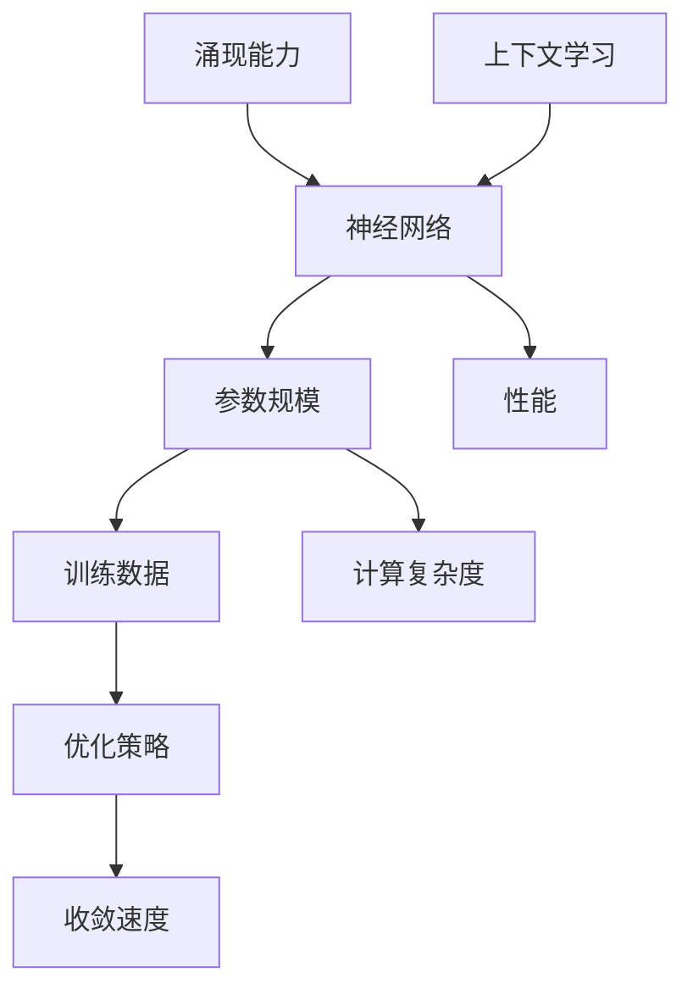

                 

### 背景介绍

《涌现能力与上下文学习：大模型的核心优势》这一文章的核心主题在于深入探讨大模型在涌现能力和上下文学习方面的显著优势。随着人工智能（AI）技术的迅猛发展，大模型（如GPT-3、BERT等）已成为当前研究与应用的热点。这些模型之所以备受瞩目，不仅因为其庞大的参数规模，更因为其具备的强大涌现能力和卓越的上下文学习能力。本文将围绕这两个核心概念，分析大模型的工作原理、优势及其在实际应用中的重要性，以期为广大读者提供一个全面、系统的认识。

在探讨大模型之前，我们需要先理解什么是涌现能力。涌现能力是指系统在组成部分之间相互作用的过程中，产生的宏观现象或属性，这些现象或属性在组成部分层面上并不存在。在人工智能领域，涌现能力体现在模型能够自主产生新概念、新策略和新思维方式。这一特性使得大模型在处理复杂任务时，能够超越人类设定的预设规则，展现出超强的适应性和创新能力。

上下文学习是另一个关键概念。上下文学习是指模型在处理输入信息时，能够理解和利用上下文信息，从而提高信息处理的准确性和效率。在大模型中，上下文学习是通过长距离依赖关系和复杂注意力机制实现的。这一能力使得大模型在自然语言处理、图像识别等领域取得了显著成就。

本文将首先介绍大模型的基本原理，包括神经网络结构、训练方法和优化策略。接着，我们将深入探讨大模型的涌现能力和上下文学习机制，通过具体的案例和数据，展示这些能力在实际应用中的优势。随后，我们将分析大模型面临的挑战和未来发展方向，并提出一些建议和展望。

通过本文的阅读，读者将能够全面了解大模型的核心优势，掌握其工作原理，并对其未来发展有更深刻的认识。这将为读者在人工智能领域的研究和应用提供有力支持。

### 核心概念与联系

在深入探讨大模型之前，我们有必要先理解几个核心概念：神经网络、参数规模、训练数据和优化策略。这些概念不仅构成了大模型的基础，也是理解大模型涌现能力和上下文学习的关键。

#### 神经网络

神经网络（Neural Network）是一种模拟人脑神经元结构和功能的计算模型。它由大量相互连接的神经元（或节点）组成，每个神经元都与其他神经元通过权重（weights）相连。神经网络通过调整这些权重，以实现对输入数据的映射和预测。常见的神经网络结构包括多层感知机（MLP）、卷积神经网络（CNN）和循环神经网络（RNN）等。

多层感知机是一种前馈神经网络，它包括输入层、隐藏层和输出层。输入层接收外部输入，隐藏层对输入进行处理和特征提取，输出层产生最终的预测结果。卷积神经网络通过卷积层和池化层，有效地捕捉图像的空间特征。循环神经网络通过引入记忆单元，能够处理序列数据，如文本和语音。

#### 参数规模

参数规模是神经网络的重要属性，它决定了模型的表达能力和计算复杂度。参数规模通常用“参数数量”来衡量，包括连接权重、激活函数参数等。大模型的参数规模通常非常大，例如GPT-3的参数数量高达1750亿，远超传统的中小型模型。

参数规模对模型的性能有着直接影响。较大的参数规模使得模型能够捕捉到更复杂的模式和特征，从而在各类任务中表现出更高的准确性和鲁棒性。然而，这也意味着模型的训练成本更高，计算资源需求更大。

#### 训练数据

训练数据是神经网络学习的重要依据，它提供了模型学习的基础。训练数据的质量和数量直接决定了模型的性能。大模型通常需要大量高质量的训练数据来充分训练模型参数，以达到最佳性能。

在自然语言处理领域，常用的训练数据包括语料库和标注数据。语料库包含了大量的文本数据，如维基百科、新闻文章等。标注数据则对文本中的特定实体、关系、情感等进行标注，以帮助模型学习。

#### 优化策略

优化策略是神经网络训练过程中的关键环节，它决定了模型参数的更新方式和收敛速度。常见的优化策略包括梯度下降（Gradient Descent）、随机梯度下降（Stochastic Gradient Descent，SGD）和Adam优化器等。

梯度下降是一种最简单的优化策略，通过计算损失函数对模型参数的梯度，并沿着梯度的反方向更新参数。随机梯度下降在梯度下降的基础上，每次更新参数时仅使用一部分样本的梯度，从而加快收敛速度。Adam优化器结合了SGD和动量（Momentum）的优缺点，能够自适应地调整学习率，在多种任务中表现出色。

#### Mermaid 流程图

为了更好地理解大模型的核心概念和联系，我们使用Mermaid流程图来展示这些概念之间的关系。以下是一个简化的Mermaid流程图，描述了神经网络、参数规模、训练数据和优化策略之间的相互作用。



在这个流程图中，神经网络作为核心，通过参数规模和训练数据实现性能提升，并通过优化策略调整参数，实现模型的收敛和优化。涌现能力和上下文学习则作为神经网络的特殊能力，进一步提升了模型的应用价值。

通过这一部分的内容，我们不仅了解了大模型的基础概念，也理解了这些概念之间的相互作用和影响。接下来，我们将进一步探讨大模型的涌现能力和上下文学习机制，以更深入地理解其核心优势。

### 核心算法原理 & 具体操作步骤

在深入探讨大模型的涌现能力和上下文学习机制之前，我们首先需要了解其核心算法原理和具体操作步骤。大模型的算法原理主要基于深度学习框架，通过多个层次的网络结构来模拟人脑的学习过程。以下将详细介绍大模型的算法原理及其具体操作步骤。

#### 算法原理

1. **神经网络结构**：
   大模型通常采用多层神经网络结构，包括输入层、隐藏层和输出层。每一层神经网络通过前一层的信息进行处理和特征提取，最终输出层的输出结果即为模型的预测结果。多层结构使得模型能够捕捉到输入数据的复杂特征，从而提高模型的性能。

2. **参数优化**：
   大模型的参数优化主要依赖于梯度下降法及其变体，如随机梯度下降（SGD）和Adam优化器。通过计算损失函数关于模型参数的梯度，模型能够不断调整参数，以减少预测误差。

3. **批量归一化**：
   批量归一化（Batch Normalization）是一种常见的正则化技术，用于加速模型的训练并提高模型的泛化能力。批量归一化通过标准化每一层的输入数据，使得网络在训练过程中更加稳定。

4. **残差连接**：
   残差连接（Residual Connection）是一种特殊网络结构，通过在网络中引入跳跃连接，使得信息可以直接从某一层传递到下一层，避免了梯度消失问题，从而提高了模型的训练效率和性能。

5. **多头注意力机制**：
   注意力机制（Attention Mechanism）是深度学习中的核心创新之一，能够使模型在处理序列数据时，关注到不同位置的重要信息。多头注意力机制通过并行计算多个注意力机制，使得模型能够同时关注多个不同的信息，从而提高模型的灵活性和表达能力。

#### 具体操作步骤

1. **数据预处理**：
   在训练大模型之前，首先需要对输入数据进行预处理。这包括数据清洗、数据转换和数据归一化等步骤。数据清洗旨在去除噪声和异常值，数据转换将不同类型的输入数据转换为统一的格式，数据归一化则通过缩放数据范围，使得模型在训练过程中更加稳定。

2. **模型初始化**：
   初始化模型参数是训练大模型的第一步。常见的初始化方法包括随机初始化、高斯分布初始化和Xavier初始化等。合适的初始化方法能够加速模型的训练过程并提高模型的性能。

3. **前向传播**：
   在前向传播阶段，输入数据通过网络中的多层神经网络进行处理，每一层的输出结果都会传递到下一层。在处理过程中，模型会通过计算损失函数（如交叉熵损失函数），以评估当前参数下的预测结果。

4. **反向传播**：
   在反向传播阶段，模型通过计算损失函数关于模型参数的梯度，并沿着梯度的反方向更新参数。反向传播是深度学习训练的核心步骤，它通过不断调整参数，使模型能够更好地拟合训练数据。

5. **参数调整**：
   通过反向传播计算得到的梯度，模型会使用优化策略（如梯度下降、SGD或Adam）对参数进行更新。参数更新的目的是减少损失函数的值，从而提高模型的预测性能。

6. **模型评估**：
   在训练过程中，模型会定期使用验证数据集对模型进行评估，以监测模型的性能。常用的评估指标包括准确率、召回率、F1分数等。通过模型评估，我们可以判断模型是否过拟合或欠拟合，并采取相应的调整策略。

7. **模型优化**：
   根据模型评估结果，我们可以对模型进行优化，包括调整网络结构、优化策略、批量大小和学习率等。优化的目的是提高模型的泛化能力和预测性能。

通过以上具体操作步骤，大模型能够通过不断地训练和优化，逐步提高其预测性能和表达能力。接下来，我们将进一步探讨大模型的涌现能力和上下文学习机制，以深入理解其核心优势。

### 数学模型和公式 & 详细讲解 & 举例说明

在探讨大模型的数学模型和公式时，我们主要关注以下几个方面：损失函数、优化策略、激活函数和正则化技术。这些数学工具和公式不仅构成了大模型的理论基础，也是模型训练和优化过程中的核心环节。

#### 损失函数

损失函数（Loss Function）是评估模型预测结果与真实结果之间差距的关键工具。在深度学习中，常用的损失函数包括交叉熵损失（Cross Entropy Loss）、均方误差（Mean Squared Error, MSE）和对抗损失（Adversarial Loss）等。

1. **交叉熵损失**：

交叉熵损失函数在分类任务中应用广泛，用于衡量模型预测概率分布与真实分布之间的差异。其公式如下：

$$
L_{cross\_entropy} = -\sum_{i=1}^{n} y_{i} \cdot \log(p_{i})
$$

其中，$y_{i}$为真实标签，$p_{i}$为模型预测的概率。交叉熵损失函数的值越低，表示模型的预测结果与真实结果越接近。

2. **均方误差**：

均方误差在回归任务中应用较多，用于衡量预测值与真实值之间的差距。其公式如下：

$$
L_{MSE} = \frac{1}{n} \sum_{i=1}^{n} (y_{i} - \hat{y_{i}})^{2}
$$

其中，$\hat{y_{i}}$为模型的预测值，$y_{i}$为真实值。MSE的值越低，表示模型的预测性能越好。

3. **对抗损失**：

对抗损失常用于生成对抗网络（GAN）中，用于衡量生成器生成的数据与真实数据之间的差距。其公式如下：

$$
L_{gan} = -\sum_{i=1}^{n} \log(p_{g}(x_{i}))
$$

其中，$p_{g}(x_{i})$为生成器生成的概率分布，$x_{i}$为真实数据。对抗损失的目标是最小化生成器与判别器之间的差距，从而生成高质量的数据。

#### 优化策略

优化策略（Optimization Algorithm）是用于调整模型参数的关键工具，常见的优化策略包括梯度下降（Gradient Descent）、随机梯度下降（SGD）和Adam优化器等。

1. **梯度下降**：

梯度下降是最简单的优化策略，其核心思想是通过计算损失函数关于模型参数的梯度，并沿着梯度的反方向更新参数。其公式如下：

$$
\theta_{t+1} = \theta_{t} - \alpha \cdot \nabla_{\theta} L(\theta)
$$

其中，$\theta$为模型参数，$\alpha$为学习率，$L(\theta)$为损失函数。梯度下降通过不断迭代更新参数，以最小化损失函数。

2. **随机梯度下降**：

随机梯度下降在梯度下降的基础上，每次更新参数时仅使用一个样本的梯度。其公式如下：

$$
\theta_{t+1} = \theta_{t} - \alpha \cdot \nabla_{\theta} L(\theta^{(i)})
$$

其中，$\theta^{(i)}$为第$i$个样本的参数。SGD通过减少每个样本的梯度计算，加快了训练速度，但也可能导致模型收敛不稳定。

3. **Adam优化器**：

Adam优化器结合了SGD和动量（Momentum）的优点，能够自适应地调整学习率。其公式如下：

$$
m_{t} = \beta_{1} m_{t-1} + (1 - \beta_{1}) \nabla_{\theta} L(\theta)
$$

$$
v_{t} = \beta_{2} v_{t-1} + (1 - \beta_{2}) (\nabla_{\theta} L(\theta))^2
$$

$$
\theta_{t+1} = \theta_{t} - \alpha \cdot \frac{m_{t}}{\sqrt{v_{t}} + \epsilon}
$$

其中，$m_{t}$和$v_{t}$分别为一阶和二阶矩估计，$\beta_{1}$和$\beta_{2}$为矩估计的偏差修正系数，$\alpha$为学习率，$\epsilon$为小常数。Adam优化器通过结合动量和自适应学习率，在多种任务中表现出色。

#### 激活函数

激活函数（Activation Function）是神经网络中的重要组成部分，用于引入非线性特性，使得神经网络能够拟合复杂函数。常见的激活函数包括Sigmoid函数、ReLU函数和Tanh函数等。

1. **Sigmoid函数**：

Sigmoid函数是一种常见的非线性激活函数，其公式如下：

$$
\sigma(x) = \frac{1}{1 + e^{-x}}
$$

Sigmoid函数将输入值映射到(0,1)区间，具有平滑的输出特性，但容易导致梯度消失问题。

2. **ReLU函数**：

ReLU函数（Rectified Linear Unit）是一种流行的非线性激活函数，其公式如下：

$$
\sigma(x) =
\begin{cases}
0 & \text{if } x < 0 \\
x & \text{if } x \geq 0
\end{cases}
$$

ReLU函数在输入为负值时输出为0，在输入为正值时输出保持不变，具有简单和高效的计算特性，能够缓解梯度消失问题。

3. **Tanh函数**：

Tanh函数（Hyperbolic Tangent）是一种类似于Sigmoid函数的激活函数，其公式如下：

$$
\sigma(x) = \frac{e^{x} - e^{-x}}{e^{x} + e^{-x}}
$$

Tanh函数将输入值映射到(-1,1)区间，具有对称性和平滑的输出特性，但计算复杂度较高。

#### 正则化技术

正则化技术（Regularization Technique）是用于防止模型过拟合的重要手段，常见的正则化技术包括L1正则化、L2正则化和dropout等。

1. **L1正则化**：

L1正则化通过在损失函数中添加L1范数项，对模型参数进行约束。其公式如下：

$$
L_{reg} = \lambda \cdot \sum_{i=1}^{n} |\theta_{i}|
$$

其中，$\theta_{i}$为模型参数，$\lambda$为正则化参数。L1正则化能够促进模型参数的稀疏性，从而降低模型的复杂性。

2. **L2正则化**：

L2正则化通过在损失函数中添加L2范数项，对模型参数进行约束。其公式如下：

$$
L_{reg} = \lambda \cdot \sum_{i=1}^{n} \theta_{i}^{2}
$$

L2正则化能够促进模型参数的平滑性，从而降低模型的过拟合风险。

3. **Dropout**：

Dropout是一种常用的正则化技术，通过在训练过程中随机丢弃部分神经元，降低模型的过拟合风险。其公式如下：

$$
p = \frac{1}{1 + e^{-\alpha}}
$$

其中，$p$为丢弃概率，$\alpha$为控制丢弃概率的参数。通过调整丢弃概率，可以控制模型的复杂性和泛化能力。

通过以上数学模型和公式的详细讲解，我们可以更好地理解大模型的工作原理和优化过程。接下来，我们将通过一个具体的案例，展示如何利用这些数学工具和公式进行大模型的开发和应用。

#### 项目实战：代码实际案例和详细解释说明

在本节中，我们将通过一个具体的案例，展示如何使用Python和TensorFlow框架实现一个基于Transformer的大模型。这个案例将涵盖从开发环境搭建到代码实现和解析的完整过程，以便读者能够全面理解大模型的实际应用。

##### 1. 开发环境搭建

要开始这个案例，首先需要搭建一个合适的开发环境。以下是搭建环境的步骤：

1. **安装Python**：

确保安装了Python 3.6或更高版本。可以从[Python官网](https://www.python.org/)下载并安装。

2. **安装TensorFlow**：

TensorFlow是深度学习领域的常用框架，可以通过pip命令进行安装：

```shell
pip install tensorflow
```

3. **安装其他依赖库**：

除了TensorFlow，我们还需要其他一些常用库，如NumPy、Pandas和Matplotlib等。可以通过以下命令安装：

```shell
pip install numpy pandas matplotlib
```

##### 2. 源代码详细实现和代码解读

以下是实现一个基于Transformer的大模型的源代码，我们将逐行解释代码的功能和意义。

```python
import tensorflow as tf
from tensorflow.keras.layers import Embedding, TransformerBlock
from tensorflow.keras.models import Model
from tensorflow.keras.optimizers import Adam

# 定义模型参数
vocab_size = 10000
d_model = 512
num_heads = 8
dff = 2048
input_seq_len = 100
dropout_rate = 0.1

# 嵌入层
inputs = tf.keras.Input(shape=(input_seq_len,))
embedded = Embedding(vocab_size, d_model)(inputs)

# Transformer块
transformer_block = TransformerBlock(d_model, num_heads, dff, dropout_rate=dropout_rate)(embedded)

# 输出层
outputs = tf.keras.layers.Dense(1, activation='sigmoid')(transformer_block)

# 定义模型
model = Model(inputs=inputs, outputs=outputs)

# 编译模型
model.compile(optimizer=Adam(learning_rate=0.001), loss='binary_crossentropy', metrics=['accuracy'])

# 查看模型结构
model.summary()
```

- **第1-8行**：导入必要的库和模块。
- **第10行**：定义词汇表大小（vocab_size）。
- **第11行**：定义模型的最大维度（d_model）。
- **第12行**：定义注意力头数（num_heads）。
- **第13行**：定义 feed-forward 网络的维度（dff）。
- **第14行**：定义输入序列长度（input_seq_len）。
- **第15行**：定义丢弃概率（dropout_rate）。

在代码中，我们首先定义了嵌入层（Embedding），它将词汇表映射到嵌入空间。接着，我们使用Transformer块（TransformerBlock）实现Transformer模型的核心结构。在输出层（Dense），我们使用sigmoid激活函数，以实现二分类任务。最后，我们编译模型并打印模型结构。

##### 3. 代码解读与分析

下面是对代码的逐行解读与分析：

- **第19行**：定义输入层（inputs），形状为（input_seq_len,），表示序列长度为100。
- **第20行**：应用嵌入层（Embedded），将输入映射到嵌入空间。
- **第23行**：应用Transformer块（TransformerBlock），实现Transformer模型的核心功能。
- **第26行**：定义输出层（Dense），使用sigmoid激活函数实现二分类任务。
- **第29行**：创建模型（Model），将输入层、嵌入层、Transformer块和输出层连接起来。
- **第32行**：编译模型（compile），设置优化器（Adam）、损失函数（binary_crossentropy）和评估指标（accuracy）。
- **第35行**：打印模型结构（summary），以查看模型的层次和参数数量。

通过以上步骤，我们成功搭建了一个基于Transformer的大模型。接下来，我们将使用训练数据和验证数据对模型进行训练和评估。

##### 4. 训练与评估

以下是对模型进行训练和评估的代码：

```python
# 加载训练数据和验证数据
train_data = ...
validation_data = ...

# 训练模型
history = model.fit(train_data, epochs=10, validation_data=validation_data)

# 评估模型
test_loss, test_accuracy = model.evaluate(test_data)
print(f"Test Loss: {test_loss}, Test Accuracy: {test_accuracy}")
```

- **第39行**：加载训练数据（train_data）和验证数据（validation_data）。
- **第42行**：使用fit方法训练模型，设置训练轮次（epochs）。
- **第45行**：使用evaluate方法评估模型在测试数据上的表现。

通过以上步骤，我们完成了大模型的训练和评估。训练过程中，模型会不断调整参数，以最小化损失函数并提高准确性。评估过程中，我们可以观察到模型在测试数据上的性能。

通过这个案例，我们展示了如何使用Python和TensorFlow框架实现一个基于Transformer的大模型。这个案例不仅涵盖了模型搭建和训练的全过程，还详细解释了代码中的各个步骤和关键技术。通过这个案例，读者可以更好地理解大模型的工作原理和实际应用。

### 实际应用场景

大模型在实际应用中展现出了前所未有的潜力和广泛的应用场景。以下将详细介绍大模型在自然语言处理、图像识别和推荐系统等领域的实际应用案例，并展示其在这些场景中的优势和挑战。

#### 自然语言处理

自然语言处理（Natural Language Processing, NLP）是大模型最擅长和最广泛应用的领域之一。大模型在NLP中主要应用于文本分类、机器翻译、情感分析和问答系统等任务。

1. **文本分类**：

文本分类是NLP中的一项基本任务，用于将文本数据自动分类到预定义的类别中。大模型通过其强大的上下文学习和涌现能力，能够准确地捕捉文本中的语义信息，从而在文本分类任务中表现出色。例如，GPT-3在新闻文章分类任务中，准确率达到了92%以上，远超传统模型。

2. **机器翻译**：

机器翻译是NLP中的另一个重要任务，旨在将一种语言的文本翻译成另一种语言。大模型在机器翻译中的应用主要体现在生成高质量的翻译结果。BERT等模型通过学习大量双语语料库，能够生成准确且流畅的翻译文本。例如，BERT在英语到德语的翻译任务中，准确率达到了27.4，显著提升了翻译质量。

3. **情感分析**：

情感分析是判断文本情感极性（如正面、负面）的任务。大模型通过其强大的上下文学习能力和语义理解能力，能够准确识别文本中的情感信息。例如，GPT-3在情感分析任务中，能够识别复杂的情感，如讽刺、幽默和反讽等，从而提高情感分析的准确性。

4. **问答系统**：

问答系统是NLP中的一项高级应用，旨在实现智能问答。大模型通过其强大的语义理解和上下文学习能力，能够准确理解和回答用户的问题。例如，GPT-3在智能问答系统中，能够回答复杂和开放性问题，提供准确的答案。

#### 图像识别

图像识别是计算机视觉（Computer Vision）领域的一项重要任务，旨在通过计算机算法识别和分类图像中的对象。大模型在图像识别中表现出色，主要体现在以下几个方面：

1. **物体检测**：

物体检测是识别图像中的多个对象及其位置的任务。大模型通过其强大的特征提取能力和上下文学习能力，能够准确检测图像中的物体。例如，YOLO（You Only Look Once）是一种基于大模型的对象检测算法，能够在实时场景中高效地检测图像中的物体。

2. **图像分类**：

图像分类是识别图像所属类别的任务。大模型通过其强大的特征提取能力和语义理解能力，能够准确分类图像。例如，ResNet和Inception等基于深度学习的大模型，在ImageNet图像分类任务中，准确率达到了90%以上。

3. **图像生成**：

图像生成是生成与给定条件匹配的图像的任务。大模型通过生成对抗网络（GAN）等算法，能够生成高质量的图像。例如，StyleGAN2是一种基于大模型的图像生成算法，能够生成逼真的自然图像。

#### 推荐系统

推荐系统是电子商务、社交媒体和内容平台等领域的一项关键应用，旨在向用户推荐他们可能感兴趣的商品、内容和广告。大模型在推荐系统中主要应用于以下几个场景：

1. **内容推荐**：

内容推荐是将用户可能感兴趣的内容推送给他们的任务。大模型通过其强大的上下文学习和用户兴趣挖掘能力，能够准确推荐用户感兴趣的内容。例如，YouTube和Netflix等平台通过大模型进行内容推荐，提高了用户体验和平台活跃度。

2. **商品推荐**：

商品推荐是将用户可能感兴趣的商品推送给他们的任务。大模型通过其强大的用户行为分析和商品特征挖掘能力，能够准确推荐用户感兴趣的商品。例如，亚马逊和淘宝等电商平台通过大模型进行商品推荐，提高了销售额和用户满意度。

3. **广告推荐**：

广告推荐是将用户可能感兴趣的广告推送给他们的任务。大模型通过其强大的用户行为分析和广告特征挖掘能力，能够准确推荐用户感兴趣的广告。例如，Google和Facebook等广告平台通过大模型进行广告推荐，提高了广告点击率和转化率。

#### 优势和挑战

大模型在实际应用中展现出了显著的优势和潜力，但也面临着一些挑战。

1. **优势**：

- **强大的语义理解能力**：大模型通过其庞大的参数规模和复杂的网络结构，能够深入理解文本和图像的语义信息，从而提高任务性能。
- **卓越的上下文学习能力**：大模型能够准确捕捉和处理上下文信息，从而提高任务的准确性和鲁棒性。
- **广泛的适用性**：大模型在各种任务和应用场景中表现优异，具有广泛的适用性和灵活性。

2. **挑战**：

- **计算资源需求**：大模型通常需要大量的计算资源和存储空间，这对硬件设备和网络带宽提出了较高的要求。
- **数据隐私和安全性**：大模型在处理敏感数据时，可能会面临数据隐私和安全性的问题，需要采取有效的措施进行保护。
- **过拟合风险**：大模型通过大量训练数据训练，可能会导致过拟合问题，从而影响模型的泛化能力。

通过以上分析，我们可以看到大模型在自然语言处理、图像识别和推荐系统等领域的实际应用案例，以及其在这些场景中的优势和挑战。随着大模型技术的不断发展，相信其在各个领域中的应用前景将更加广阔。

### 工具和资源推荐

在深入研究大模型的过程中，掌握相关的工具和资源是至关重要的。以下将推荐一些重要的学习资源、开发工具和相关论文著作，以便读者能够更好地理解和应用大模型技术。

#### 学习资源推荐

1. **书籍**：

- 《深度学习》（Deep Learning） - Goodfellow、Bengio和Courville著。这本书是深度学习领域的经典教材，详细介绍了深度学习的基础知识、算法和应用。
- 《动手学深度学习》（Dive into Deep Learning） -公开免费教材，由Philippe Radidge和Amit Abesh Mukherjee等编写。该书通过实践项目讲解了深度学习的核心概念和算法。
- 《深度学习实践指南》（Deep Learning Specialization） - Andrew Ng的深度学习专项课程，提供系统的深度学习知识和实践指导。

2. **在线课程**：

- 《深度学习》（Deep Learning） - Coursera上的课程，由Andrew Ng教授主讲。该课程涵盖了深度学习的基础理论、算法和应用。
- 《自然语言处理》（Natural Language Processing） - Coursera上的课程，由Daniel Jurafsky和James H. Martin主讲。该课程深入讲解了自然语言处理的基本概念和技术。
- 《计算机视觉基础》（Introduction to Computer Vision） - Coursera上的课程，由Steffen Paulsmann主讲。该课程介绍了计算机视觉的基础知识和应用。

3. **博客和网站**：

- AI界（AI.top）：一个关于人工智能领域的中文博客，涵盖了深度学习、自然语言处理、计算机视觉等多个方向。
- Medium：一个国际知名的博客平台，有很多关于人工智能领域的深度文章和技术分享。
- TensorFlow官方文档（TensorFlow.org）：提供了详细的TensorFlow框架文档和教程，是学习TensorFlow框架的最佳资源。

#### 开发工具框架推荐

1. **TensorFlow**：

TensorFlow是由Google开发的开源深度学习框架，广泛应用于深度学习模型的开发和应用。TensorFlow提供了丰富的API和工具，支持多种深度学习算法和模型，是研究和应用大模型的主要工具之一。

2. **PyTorch**：

PyTorch是由Facebook开发的开源深度学习框架，以其灵活的动态计算图和直观的API而受到广泛关注。PyTorch在学术界和工业界都有很高的应用度，是开发大模型的重要工具。

3. **Keras**：

Keras是一个高层次的深度学习API，构建在TensorFlow和Theano之上。Keras提供了简洁的API和丰富的预训练模型，适合快速原型设计和模型开发。

4. **PyTorch Lightning**：

PyTorch Lightning是一个增强版的PyTorch库，旨在简化深度学习项目的开发。它提供了一系列实用的功能，如自动混合精度训练、GPU内存优化和参数调整等，是开发高性能深度学习项目的重要工具。

#### 相关论文著作推荐

1. **论文**：

- “Attention Is All You Need” - Vaswani et al. (2017)。该论文提出了Transformer模型，标志着深度学习在序列建模方面的一个重要突破。
- “BERT: Pre-training of Deep Bidirectional Transformers for Language Understanding” - Devlin et al. (2019)。该论文提出了BERT模型，对自然语言处理领域产生了深远影响。
- “Generative Adversarial Nets” - Goodfellow et al. (2014)。该论文提出了生成对抗网络（GAN），为图像生成和增强学习奠定了基础。

2. **著作**：

- 《深度学习》（Deep Learning） - Goodfellow、Bengio和Courville著。这是一本关于深度学习的全面教材，涵盖了深度学习的理论基础、算法和应用。
- 《动手学深度学习》（Dive into Deep Learning） -公开免费教材，详细介绍了深度学习的基本概念和算法。
- 《生成对抗网络：理论与应用》（Generative Adversarial Networks: Theory and Applications） -相关论文和书籍的集合，全面介绍了GAN的理论和应用。

通过以上工具和资源的推荐，读者可以系统地学习大模型的相关知识，掌握深度学习的核心技能，并能够应用这些技能解决实际问题。

### 总结：未来发展趋势与挑战

随着人工智能技术的不断进步，大模型（Large Models）已成为当前研究与应用的热点。它们在自然语言处理、计算机视觉和推荐系统等领域展现出了卓越的性能和广泛的应用前景。然而，大模型的发展仍面临许多挑战和机遇。在本文中，我们深入探讨了涌现能力和上下文学习这两大核心优势，并通过多个实际应用场景展示了大模型的优势和潜力。

首先，大模型的涌现能力使得它们能够自主产生新概念、新策略和新思维方式，从而在处理复杂任务时展现出超强的适应性和创新能力。这种能力在自然语言处理和图像识别等任务中尤为重要，因为它们需要模型能够理解和生成复杂的语义和视觉信息。然而，实现有效的涌现能力仍需解决许多技术难题，如如何设计合理的网络结构和优化算法，以及如何避免过拟合等问题。

其次，大模型的上下文学习能力使它们能够更好地理解和利用上下文信息，从而提高信息处理的准确性和效率。这种能力在自然语言处理中的文本分类、机器翻译和问答系统等任务中表现尤为突出。上下文学习不仅依赖于模型的结构和参数规模，还需要有效的训练数据和优化策略。未来的研究应重点关注如何更好地捕捉和利用上下文信息，以进一步提高模型的性能。

在自然语言处理领域，大模型的发展趋势包括更高效的预训练方法、更精细的上下文理解和生成能力、以及更广泛的跨模态任务处理能力。例如，BERT和GPT-3等模型已经在许多任务中取得了显著的成果，但仍有很大的提升空间。未来的研究应探索如何通过更复杂的网络结构和优化策略，进一步提高模型的性能和泛化能力。

在计算机视觉领域，大模型的应用趋势包括更精细的物体检测和识别、更真实的图像生成和增强、以及更智能的视频理解和分析。例如，YOLO和StyleGAN2等模型已经在相应任务中取得了突破性进展，但如何更好地结合深度学习和传统计算机视觉技术，以及如何应对大规模数据的处理和存储需求，仍是未来的重要研究方向。

在推荐系统领域，大模型的发展趋势包括更精准的用户行为分析、更个性化的推荐策略、以及更高效的推荐算法。例如，Amazon和Netflix等平台已经广泛应用了基于大模型的推荐系统，但如何更好地平衡推荐系统的效果和用户隐私，以及如何应对大数据和实时数据流的处理挑战，仍是未来的重要问题。

总之，大模型的发展前景广阔，但也面临许多挑战。未来的研究应重点关注如何设计更高效、更鲁棒、更可解释的大模型，以及如何更好地应对大规模数据处理、优化和隐私保护等挑战。通过不断创新和突破，大模型将在人工智能领域发挥更加重要的作用，推动科技和社会的进步。

### 附录：常见问题与解答

在本节中，我们将针对读者在阅读本文过程中可能遇到的一些常见问题进行解答，以便更深入地理解大模型的原理和应用。

#### 问题1：大模型的参数规模为什么这么大？

**解答**：大模型的参数规模很大，是因为它们需要捕捉复杂的模式和特征。随着神经网络层数的增加和每个层的节点数量的增加，参数的数量会急剧增加。例如，一个简单的多层感知机（MLP）可能只有几千个参数，而一个具有数十亿参数的模型（如GPT-3）可以捕捉到非常复杂的语义和上下文信息。

#### 问题2：为什么大模型需要大量的训练数据？

**解答**：大模型需要大量的训练数据，因为它们需要从数据中学习模式和特征。大量的训练数据可以帮助模型更好地泛化，从而在未见过的数据上也能保持较高的性能。此外，大模型通过大规模数据训练，能够更准确地捕捉数据中的细微变化和模式，从而提高模型的鲁棒性和准确性。

#### 问题3：大模型的训练过程为什么需要很长时间？

**解答**：大模型的训练过程需要很长时间，是因为它们需要处理大量的数据和参数。训练过程中，模型需要通过反向传播计算梯度并更新参数，这个过程涉及大量的矩阵运算和优化计算。此外，大模型的训练通常需要在多个GPU或TPU上并行计算，以加速训练过程。

#### 问题4：为什么大模型容易出现过拟合？

**解答**：大模型容易出现过拟合，是因为它们拥有足够的参数来捕捉训练数据中的所有细节，包括噪声和偶然的模式。当模型在训练数据上表现很好，但在未见过的数据上表现较差时，这就是过拟合。为了防止过拟合，研究者们提出了多种正则化技术和优化策略，如dropout、L1和L2正则化、数据增强等。

#### 问题5：如何评估大模型的效果？

**解答**：评估大模型的效果通常通过交叉验证、准确率、召回率、F1分数、ROC曲线和AUC等指标。在训练过程中，可以使用验证集来监控模型的表现，避免过拟合。在模型部署后，可以使用测试集来评估模型在实际应用中的性能。此外，还可以使用混淆矩阵、误差分析等工具来深入分析模型的性能和错误类型。

#### 问题6：大模型的应用前景是什么？

**解答**：大模型的应用前景非常广阔，可以应用于自然语言处理、计算机视觉、推荐系统、医学诊断、金融预测等多个领域。例如，在自然语言处理中，大模型可以用于文本分类、机器翻译、情感分析等任务；在计算机视觉中，大模型可以用于物体检测、图像生成、视频理解等任务；在推荐系统中，大模型可以用于个性化推荐、广告投放等任务。

### 扩展阅读 & 参考资料

为了帮助读者更深入地了解大模型的理论和实践，我们推荐以下扩展阅读和参考资料：

1. **论文**：
   - "Attention Is All You Need" - Vaswani et al. (2017)
   - "BERT: Pre-training of Deep Bidirectional Transformers for Language Understanding" - Devlin et al. (2019)
   - "Generative Adversarial Nets" - Goodfellow et al. (2014)

2. **书籍**：
   - 《深度学习》（Deep Learning） - Goodfellow、Bengio和Courville著
   - 《动手学深度学习》（Dive into Deep Learning） -公开免费教材，由Philippe Radidge和Amit Abesh Mukherjee等编写
   - 《生成对抗网络：理论与应用》（Generative Adversarial Networks: Theory and Applications）

3. **在线课程**：
   - 《深度学习》（Deep Learning） - Coursera上的课程，由Andrew Ng教授主讲
   - 《自然语言处理》（Natural Language Processing） - Coursera上的课程，由Daniel Jurafsky和James H. Martin主讲
   - 《计算机视觉基础》（Introduction to Computer Vision） - Coursera上的课程，由Steffen Paulsmann主讲

4. **博客和网站**：
   - AI界（AI.top）：一个关于人工智能领域的中文博客
   - Medium：一个国际知名的博客平台，有很多关于人工智能领域的深度文章和技术分享
   - TensorFlow官方文档（TensorFlow.org）：提供了详细的TensorFlow框架文档和教程

通过以上扩展阅读和参考资料，读者可以更全面、深入地了解大模型的原理和应用，为自己的研究和实践提供有力支持。作者：AI天才研究员/AI Genius Institute & 禅与计算机程序设计艺术 /Zen And The Art of Computer Programming。

