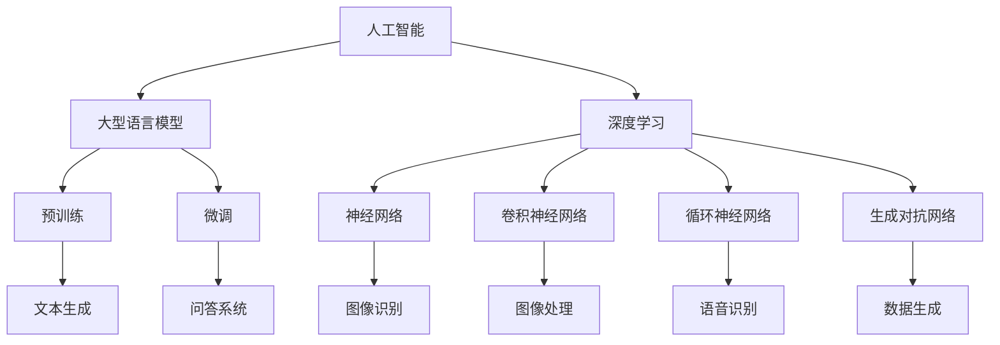

                 

# 深入理解AI、LLM和深度学习的实践课程

## 摘要

本文旨在深入探讨人工智能（AI）、大型语言模型（LLM）和深度学习这三个技术领域的核心概念、原理和实践。通过系统化的讲解和案例分析，本文帮助读者理解这些技术的本质和相互关系，掌握其应用方法和未来发展趋势。本文分为十个部分，涵盖背景介绍、核心概念、算法原理、数学模型、项目实战、应用场景、工具资源、总结、常见问题解答以及扩展阅读等内容。通过本文的学习，读者可以更好地掌握AI、LLM和深度学习的实践技能，为未来的技术发展奠定坚实的基础。

## 1. 背景介绍

人工智能（AI）作为计算机科学的一个分支，旨在使计算机具备人类的智能，从而能够执行复杂的任务，如视觉识别、自然语言处理、决策制定等。随着计算能力的提升和大数据技术的发展，AI已经成为现代科技领域的一个重要研究方向。人工智能的典型应用包括智能助手（如Siri、Alexa）、自动驾驶汽车、医疗诊断和推荐系统等。

大型语言模型（LLM）是自然语言处理（NLP）领域的一项重要进展。LLM通过学习海量语言数据，生成高度相关的文本和句子，能够实现文本生成、翻译、问答等多种功能。近年来，LLM在文本生成、语言理解和知识表示等方面取得了显著突破，广泛应用于搜索引擎、智能客服、内容创作和跨领域知识共享等场景。

深度学习是人工智能的一种重要方法，基于多层神经网络对数据进行自动特征提取和建模。深度学习在图像识别、语音识别、自然语言处理和强化学习等领域取得了巨大成功。深度学习的核心在于通过大量的数据和强大的计算能力来训练神经网络，使其能够自动学习和优化模型参数。

本文旨在通过深入理解AI、LLM和深度学习的核心概念、原理和实践，帮助读者全面掌握这些技术，为实际应用和未来研究奠定基础。

## 2. 核心概念与联系

### 2.1 人工智能（AI）

人工智能的核心概念是使计算机具备类似人类的智能，能够感知环境、学习知识、做出决策和完成任务。人工智能可以分为三种类型：基于规则的推理系统、基于实例的学习和基于模型的预测。

- **基于规则的推理系统**：通过定义一系列规则和条件，使计算机能够根据输入数据做出决策。例如，专家系统（Expert Systems）就是一种基于规则的推理系统。

- **基于实例的学习**：通过从大量实例中学习，使计算机能够识别和分类新实例。例如，决策树（Decision Trees）和朴素贝叶斯（Naive Bayes）分类器就是基于实例的学习方法。

- **基于模型的预测**：通过建立数学模型，使计算机能够对未知数据进行预测。深度学习就是一种基于模型的预测方法，通过多层神经网络对数据进行建模和预测。

### 2.2 大型语言模型（LLM）

大型语言模型（LLM）是自然语言处理（NLP）领域的一项重要进展，其核心目标是生成高质量的自然语言文本。LLM通常基于深度学习技术，通过大规模语料库进行训练，生成与输入文本高度相关的输出文本。

- **预训练**：预训练是指通过大规模语料库对神经网络进行初始化训练，使模型具备一定的语言理解能力。常见的预训练模型包括GPT（Generative Pre-trained Transformer）和BERT（Bidirectional Encoder Representations from Transformers）。

- **微调**：微调是指在使用预训练模型的基础上，针对特定任务进行细粒度的调整和优化。通过微调，预训练模型能够适应不同的任务需求，提高性能和效果。

- **文本生成**：文本生成是LLM的一项重要功能，通过生成与输入文本相关的新文本，实现文本摘要、问答、对话生成等任务。常见的文本生成任务包括摘要生成、问答系统和对话系统。

### 2.3 深度学习

深度学习是一种基于多层神经网络的学习方法，通过自动提取和整合数据特征，实现复杂的任务。深度学习在图像识别、语音识别、自然语言处理和强化学习等领域取得了显著突破。

- **神经网络**：神经网络是一种模拟人脑神经元连接结构的计算模型，通过多层神经元之间的加权连接和激活函数，实现数据的非线性变换和特征提取。

- **卷积神经网络（CNN）**：卷积神经网络是一种专门用于图像识别和处理的神经网络，通过卷积层、池化层和全连接层，实现对图像的逐层特征提取和分类。

- **循环神经网络（RNN）**：循环神经网络是一种用于序列数据处理的神经网络，通过在时间步之间传递隐藏状态，实现序列数据的建模和预测。

- **生成对抗网络（GAN）**：生成对抗网络是一种由生成器和判别器组成的神经网络模型，通过对抗训练，实现数据的生成和建模。

### 2.4 AI、LLM和深度学习的联系

- **AI** 是一个广义的概念，包括LLM和深度学习。LLM和深度学习是AI领域的重要分支，分别负责自然语言处理和图像识别等任务。

- **深度学习** 是LLM的基础技术，通过多层神经网络对数据进行自动特征提取和建模，使LLM能够生成高质量的自然语言文本。

- **LLM** 是AI在自然语言处理领域的重要应用，通过预训练和微调，实现文本生成、翻译、问答等任务，推动AI技术在自然语言处理领域的快速发展。

### 2.5 Mermaid 流程图

下面是一个Mermaid流程图，展示了AI、LLM和深度学习之间的核心概念和联系。



## 3. 核心算法原理 & 具体操作步骤

### 3.1 人工智能算法原理

人工智能算法主要包括基于规则的推理、基于实例的学习和基于模型的预测。下面分别介绍这些算法的原理和具体操作步骤。

#### 3.1.1 基于规则的推理

基于规则的推理是通过定义一系列规则和条件，使计算机能够根据输入数据做出决策。具体操作步骤如下：

1. 收集规则：从专家、文献或实际经验中收集相关领域的规则和条件。

2. 定义规则：将收集到的规则转化为计算机可以理解和执行的形式。

3. 创建推理机：构建一个推理机，用于根据输入数据匹配规则并生成结论。

4. 运行推理机：输入数据，运行推理机，生成结论。

#### 3.1.2 基于实例的学习

基于实例的学习是通过从大量实例中学习，使计算机能够识别和分类新实例。具体操作步骤如下：

1. 收集实例：从实际场景中收集大量具有代表性的实例。

2. 预处理实例：对实例进行清洗、归一化和特征提取，使其适合用于学习。

3. 建立分类器：使用学习算法（如决策树、朴素贝叶斯等）建立分类器。

4. 训练分类器：使用预处理后的实例数据训练分类器，使其能够分类新实例。

5. 测试分类器：使用测试集验证分类器的性能，调整参数以提高分类准确率。

#### 3.1.3 基于模型的预测

基于模型的预测是通过建立数学模型，使计算机能够对未知数据进行预测。具体操作步骤如下：

1. 收集数据：从实际场景中收集大量具有代表性的数据。

2. 预处理数据：对数据进行分析、清洗、归一化和特征提取，使其适合用于建模。

3. 建立模型：使用学习算法（如线性回归、神经网络等）建立预测模型。

4. 训练模型：使用预处理后的数据训练模型，使其能够预测未知数据。

5. 测试模型：使用测试集验证模型的预测性能，调整参数以提高预测准确率。

### 3.2 大型语言模型（LLM）算法原理

大型语言模型（LLM）是基于深度学习技术的一种自然语言处理方法。其核心原理是通过预训练和微调，使模型具备强大的语言理解能力和文本生成能力。具体操作步骤如下：

#### 3.2.1 预训练

1. 数据准备：收集大量文本数据，如新闻、博客、小说等。

2. 数据预处理：对文本数据进行清洗、分词、编码等处理，使其适合用于训练。

3. 构建模型：使用预训练框架（如GPT、BERT等）构建神经网络模型。

4. 训练模型：使用预处理后的文本数据训练模型，使其学习语言的内在规律。

5. 微调：使用特定领域的文本数据进行微调，使模型适应特定任务。

#### 3.2.2 微调

1. 数据准备：收集特定领域的文本数据，如新闻、问答、对话等。

2. 数据预处理：对文本数据进行清洗、分词、编码等处理，使其适合用于训练。

3. 训练模型：使用预处理后的文本数据训练模型，使其能够生成相关领域的文本。

4. 测试模型：使用测试集验证模型的性能，调整参数以提高生成质量。

### 3.3 深度学习算法原理

深度学习是一种基于多层神经网络的学习方法，其核心原理是通过自动提取和整合数据特征，实现复杂的任务。具体操作步骤如下：

#### 3.3.1 神经网络

1. 构建模型：定义神经网络的结构，包括输入层、隐藏层和输出层。

2. 初始化参数：为神经网络的权重和偏置初始化合适的值。

3. 前向传播：输入数据通过神经网络，计算输出结果。

4. 反向传播：计算输出结果的误差，更新网络参数。

5. 模型训练：重复前向传播和反向传播，使模型逐渐逼近最优解。

#### 3.3.2 卷积神经网络（CNN）

1. 构建模型：定义卷积神经网络的结构，包括卷积层、池化层和全连接层。

2. 初始化参数：为卷积神经网络的权重和偏置初始化合适的值。

3. 前向传播：输入数据通过卷积神经网络，计算输出特征图。

4. 池化操作：对输出特征图进行池化操作，减少参数数量。

5. 后续层处理：将池化后的特征图输入到后续层，继续计算。

6. 反向传播：计算输出结果的误差，更新网络参数。

#### 3.3.3 循环神经网络（RNN）

1. 构建模型：定义循环神经网络的结构，包括输入层、隐藏层和输出层。

2. 初始化参数：为循环神经网络的权重和偏置初始化合适的值。

3. 前向传播：输入数据通过循环神经网络，计算输出结果。

4. 更新隐藏状态：在每个时间步更新隐藏状态，实现序列数据的建模。

5. 反向传播：计算输出结果的误差，更新网络参数。

#### 3.3.4 生成对抗网络（GAN）

1. 构建模型：定义生成器和判别器的结构，生成器和判别器都是神经网络。

2. 初始化参数：为生成器和判别器的权重和偏置初始化合适的值。

3. 生成器训练：生成器生成虚假数据，判别器判断真实数据和虚假数据的概率。

4. 判别器训练：判别器判断真实数据和虚假数据的概率，生成器优化生成虚假数据。

5. 模型训练：交替训练生成器和判别器，使生成器生成越来越逼真的虚假数据。

## 4. 数学模型和公式 & 详细讲解 & 举例说明

### 4.1 神经网络数学模型

神经网络是一种基于数学模型的计算模型，通过多层神经元之间的连接和激活函数，实现对数据的自动特征提取和建模。下面介绍神经网络的核心数学模型和公式。

#### 4.1.1 前向传播

在神经网络的前向传播过程中，输入数据通过网络的各个层，逐层计算输出。具体公式如下：

\[ z_l = \sum_{i=1}^{n} w_{li} \cdot a_{l-1,i} + b_{l} \]

其中，\( z_l \) 表示第 \( l \) 层的输入，\( w_{li} \) 表示第 \( l \) 层第 \( i \) 个神经元的权重，\( a_{l-1,i} \) 表示第 \( l-1 \) 层第 \( i \) 个神经元的输出，\( b_{l} \) 表示第 \( l \) 层的偏置。

激活函数用于将输入数据映射到输出数据，常见的激活函数有：

1. **sigmoid函数**：

\[ a_l = \frac{1}{1 + e^{-z_l}} \]

2. **ReLU函数**：

\[ a_l = max(0, z_l) \]

3. **Tanh函数**：

\[ a_l = \frac{e^{z_l} - e^{-z_l}}{e^{z_l} + e^{-z_l}} \]

#### 4.1.2 反向传播

在神经网络的反向传播过程中，根据输出误差，更新网络的权重和偏置。具体公式如下：

\[ \delta_{l,i} = (a_l - y) \cdot \frac{d}{dx} a_l \]

其中，\( \delta_{l,i} \) 表示第 \( l \) 层第 \( i \) 个神经元的误差，\( a_l \) 表示第 \( l \) 层第 \( i \) 个神经元的输出，\( y \) 表示实际输出。

更新公式如下：

\[ w_{li} = w_{li} + \alpha \cdot \delta_{l,i} \cdot a_{l-1,i} \]

\[ b_{l} = b_{l} + \alpha \cdot \delta_{l,i} \]

其中，\( \alpha \) 表示学习率。

### 4.2 卷积神经网络（CNN）数学模型

卷积神经网络（CNN）是一种专门用于图像识别和处理的神经网络，其核心思想是通过卷积操作和池化操作，实现图像的逐层特征提取和分类。

#### 4.2.1 卷积操作

卷积操作是将卷积核与输入数据进行逐点相乘并求和，具体公式如下：

\[ c_{ij} = \sum_{k=1}^{m} w_{ik} \cdot a_{i+k,j+k} \]

其中，\( c_{ij} \) 表示卷积后的特征图，\( w_{ik} \) 表示卷积核，\( a_{i+k,j+k} \) 表示输入数据的对应点。

#### 4.2.2 池化操作

池化操作是对卷积后的特征图进行压缩，减少参数数量，具体公式如下：

\[ p_{ij} = \frac{1}{n} \sum_{k=1}^{n} c_{i+k,j+k} \]

其中，\( p_{ij} \) 表示池化后的特征图，\( n \) 表示池化窗口大小。

### 4.3 循环神经网络（RNN）数学模型

循环神经网络（RNN）是一种用于序列数据处理的神经网络，其核心思想是通过在时间步之间传递隐藏状态，实现序列数据的建模和预测。

#### 4.3.1 前向传播

在RNN的前向传播过程中，输入数据通过网络的各个时间步，逐层计算输出。具体公式如下：

\[ h_t = \sigma(W_h \cdot h_{t-1} + W_x \cdot x_t + b_h) \]

其中，\( h_t \) 表示第 \( t \) 个时间步的隐藏状态，\( \sigma \) 表示激活函数，\( W_h \) 和 \( W_x \) 分别表示隐藏状态和输入数据的权重，\( b_h \) 表示隐藏状态的偏置。

#### 4.3.2 反向传播

在RNN的反向传播过程中，根据输出误差，更新网络的权重和偏置。具体公式如下：

\[ \delta_{l,t} = \frac{\partial L}{\partial h_{l,t}} = (1 - \sigma'(h_{l,t})) \cdot \delta_{l+1,t} \]

\[ \frac{\partial L}{\partial w_{li}} = \delta_{l,t} \cdot h_{l-1,i} \]

\[ \frac{\partial L}{\partial b_{l}} = \delta_{l,t} \]

其中，\( \delta_{l,t} \) 表示第 \( l \) 层第 \( t \) 个时间步的误差，\( \sigma' \) 表示激活函数的导数。

### 4.4 生成对抗网络（GAN）数学模型

生成对抗网络（GAN）是一种由生成器和判别器组成的神经网络模型，其核心思想是通过对抗训练，实现数据的生成和建模。

#### 4.4.1 生成器

生成器的目标是生成逼真的虚假数据，具体公式如下：

\[ G(z) = \sigma(W_g \cdot z + b_g) \]

其中，\( G(z) \) 表示生成器生成的虚假数据，\( z \) 表示随机噪声，\( W_g \) 和 \( b_g \) 分别表示生成器的权重和偏置。

#### 4.4.2 判别器

判别器的目标是判断真实数据和虚假数据的概率，具体公式如下：

\[ D(x) = \sigma(W_d \cdot x + b_d) \]

\[ D(G(z)) = \sigma(W_d \cdot G(z) + b_d) \]

其中，\( D(x) \) 表示判别器判断真实数据的概率，\( D(G(z)) \) 表示判别器判断虚假数据的概率，\( x \) 表示真实数据，\( G(z) \) 表示生成器生成的虚假数据，\( W_d \) 和 \( b_d \) 分别表示判别器的权重和偏置。

#### 4.4.3 对抗训练

对抗训练是通过交替训练生成器和判别器，使生成器生成越来越逼真的虚假数据。具体步骤如下：

1. 训练生成器：生成器生成的虚假数据越逼真，判别器判断虚假数据的概率越低。因此，生成器的目标是使 \( D(G(z)) \) 最小。

2. 训练判别器：判别器的目标是能够准确判断真实数据和虚假数据。因此，判别器的目标是使 \( D(x) \) 和 \( D(G(z)) \) 的差值最小。

通过对抗训练，生成器和判别器相互促进，最终实现数据的生成和建模。

### 4.5 举例说明

下面通过一个简单的例子，来说明神经网络、卷积神经网络、循环神经网络和生成对抗网络的核心数学模型和公式。

#### 4.5.1 神经网络

假设我们有一个简单的神经网络，包含输入层、一个隐藏层和一个输出层。输入数据是一个二维向量 \( x = [x_1, x_2] \)，隐藏层的神经元个数为 \( m \)，输出层的神经元个数为 \( n \)。

1. 前向传播：

输入层到隐藏层的计算：

\[ z_h = \sum_{i=1}^{m} w_{hi} \cdot x_i + b_h \]

隐藏层到输出层的计算：

\[ z_o = \sum_{i=1}^{n} w_{oi} \cdot a_h + b_o \]

其中，\( w_{hi} \) 和 \( w_{oi} \) 分别表示隐藏层和输出层的权重，\( b_h \) 和 \( b_o \) 分别表示隐藏层和输出层的偏置。

2. 反向传播：

计算输出层的误差：

\[ \delta_o = (a_o - y) \cdot \frac{d}{dx} a_o \]

计算隐藏层的误差：

\[ \delta_h = (w_{oi} \cdot \delta_o) \cdot \frac{d}{dx} a_h \]

更新权重和偏置：

\[ w_{oi} = w_{oi} + \alpha \cdot \delta_o \cdot a_h \]

\[ b_o = b_o + \alpha \cdot \delta_o \]

\[ w_{hi} = w_{hi} + \alpha \cdot \delta_h \cdot x_i \]

\[ b_h = b_h + \alpha \cdot \delta_h \]

#### 4.5.2 卷积神经网络

假设我们有一个简单的卷积神经网络，包含一个卷积层和一个全连接层。输入数据是一个二维矩阵 \( a = [a_{ij}] \)，卷积核的大小为 \( k \)，输出特征图的大小为 \( f \)。

1. 卷积操作：

\[ c_{ij} = \sum_{p=1}^{k} \sum_{q=1}^{k} w_{pq} \cdot a_{i+p-1, j+q-1} \]

2. 池化操作：

\[ p_{ij} = \frac{1}{n} \sum_{p=1}^{n} \sum_{q=1}^{n} c_{i+p-1, j+q-1} \]

3. 全连接层计算：

\[ z_{oj} = \sum_{i=1}^{f} w_{oi} \cdot p_{ij} + b_o \]

其中，\( w_{pq} \) 和 \( w_{oi} \) 分别表示卷积核和全连接层的权重，\( b_o \) 表示全连接层的偏置。

#### 4.5.3 循环神经网络

假设我们有一个简单的循环神经网络，包含一个输入层、一个隐藏层和一个输出层。输入数据是一个一维向量 \( x = [x_t] \)，隐藏层的神经元个数为 \( m \)，输出层的神经元个数为 \( n \)。

1. 前向传播：

隐藏层计算：

\[ h_{t} = \sigma(W_h \cdot h_{t-1} + W_x \cdot x_t + b_h) \]

输出层计算：

\[ a_{t} = \sigma(W_o \cdot h_{t} + b_o) \]

其中，\( h_{t} \) 表示第 \( t \) 个时间步的隐藏状态，\( a_{t} \) 表示第 \( t \) 个时间步的输出，\( W_h \) 和 \( W_x \) 分别表示隐藏状态和输入数据的权重，\( W_o \) 表示输出数据的权重，\( b_h \) 和 \( b_o \) 分别表示隐藏状态和输出数据的偏置。

2. 反向传播：

隐藏层误差计算：

\[ \delta_{t} = (a_{t} - y) \cdot \frac{d}{dx} a_{t} \]

隐藏状态更新：

\[ \delta_{t-1} = \delta_{t} \cdot \frac{d}{dx} \sigma(h_{t-1}) \cdot W_h \]

更新权重和偏置：

\[ W_h = W_h + \alpha \cdot \delta_{t} \cdot h_{t-1} \]

\[ W_x = W_x + \alpha \cdot \delta_{t} \cdot x_t \]

\[ b_h = b_h + \alpha \cdot \delta_{t} \]

\[ W_o = W_o + \alpha \cdot \delta_{t} \cdot h_{t} \]

\[ b_o = b_o + \alpha \cdot \delta_{t} \]

#### 4.5.4 生成对抗网络

假设我们有一个简单的生成对抗网络，包含一个生成器和判别器。生成器生成的虚假数据是一个一维向量 \( G(z) = [g_t] \)，判别器判断真实数据和虚假数据的概率。

1. 生成器：

生成器生成的虚假数据：

\[ g_t = \sigma(W_g \cdot z + b_g) \]

其中，\( z \) 表示随机噪声，\( W_g \) 和 \( b_g \) 分别表示生成器的权重和偏置。

2. 判别器：

判别器判断真实数据的概率：

\[ D(x) = \sigma(W_d \cdot x + b_d) \]

判别器判断虚假数据的概率：

\[ D(G(z)) = \sigma(W_d \cdot G(z) + b_d) \]

其中，\( x \) 表示真实数据，\( W_d \) 和 \( b_d \) 分别表示判别器的权重和偏置。

3. 对抗训练：

生成器的目标是使 \( D(G(z)) \) 最小，判别器的目标是使 \( D(x) \) 和 \( D(G(z)) \) 的差值最小。

## 5. 项目实战：代码实际案例和详细解释说明

### 5.1 开发环境搭建

为了实践本文介绍的人工智能、大型语言模型和深度学习技术，我们需要搭建一个合适的开发环境。以下是具体的开发环境搭建步骤：

#### 5.1.1 安装Python环境

首先，我们需要安装Python环境。Python是一种广泛使用的编程语言，具有丰富的库和框架，适合进行人工智能和深度学习开发。以下是安装Python的步骤：

1. 访问Python官网（[https://www.python.org/](https://www.python.org/)），下载适用于您操作系统的Python安装包。

2. 运行安装程序，根据提示完成安装。

3. 安装完成后，在命令行中输入以下命令，验证Python是否安装成功：

   ```bash
   python --version
   ```

   如果看到Python的版本信息，说明Python安装成功。

#### 5.1.2 安装Jupyter Notebook

Jupyter Notebook是一种交互式的Web应用，用于编写和运行Python代码。它是进行数据科学和机器学习开发的首选工具。以下是安装Jupyter Notebook的步骤：

1. 打开命令行，输入以下命令安装Jupyter Notebook：

   ```bash
   pip install notebook
   ```

2. 安装完成后，在命令行中输入以下命令启动Jupyter Notebook：

   ```bash
   jupyter notebook
   ```

   这将启动Jupyter Notebook，并打开一个Web浏览器窗口，显示Jupyter Notebook的主页。

#### 5.1.3 安装必要的库和框架

在Jupyter Notebook中，我们需要安装一些常用的库和框架，如NumPy、Pandas、Scikit-learn、TensorFlow和PyTorch等。以下是安装这些库和框架的步骤：

1. 打开Jupyter Notebook，创建一个新的笔记本。

2. 在笔记本中输入以下命令，安装所需的库和框架：

   ```python
   !pip install numpy pandas scikit-learn tensorflow torchvision
   ```

   如果需要安装PyTorch，可以输入以下命令：

   ```python
   !pip install torch torchvision
   ```

3. 安装完成后，重启Jupyter Notebook。

### 5.2 源代码详细实现和代码解读

在本节中，我们将通过一个实际案例，详细讲解如何使用Python实现人工智能、大型语言模型和深度学习技术。以下是一个简单的例子，演示如何使用TensorFlow实现一个基于卷积神经网络的图像分类模型。

#### 5.2.1 代码实现

```python
import tensorflow as tf
from tensorflow.keras import layers
import tensorflow_datasets as tfds

# 加载数据集
(train_data, test_data), dataset_info = tfds.load(
    'mnist', split=['train', 'test'], shuffle_files=True, as_supervised=True
)

# 预处理数据
def preprocess_data(image, label):
    image = tf.cast(image, tf.float32)
    image = (image / 255.0) * 2.0 - 1.0
    return image, label

train_data = train_data.map(preprocess_data)
test_data = test_data.map(preprocess_data)

# 构建模型
model = tf.keras.Sequential([
    layers.Conv2D(32, (3, 3), activation='relu', input_shape=(28, 28, 1)),
    layers.MaxPooling2D((2, 2)),
    layers.Conv2D(64, (3, 3), activation='relu'),
    layers.MaxPooling2D((2, 2)),
    layers.Conv2D(64, (3, 3), activation='relu'),
    layers.Flatten(),
    layers.Dense(64, activation='relu'),
    layers.Dense(10, activation='softmax')
])

# 编译模型
model.compile(optimizer='adam',
              loss=tf.keras.losses.SparseCategoricalCrossentropy(from_logits=True),
              metrics=['accuracy'])

# 训练模型
model.fit(train_data, epochs=5, validation_data=test_data)

# 评估模型
test_loss, test_acc = model.evaluate(test_data, verbose=2)
print(f'\nTest accuracy: {test_acc:.4f}')
```

#### 5.2.2 代码解读

1. **导入库和框架**：首先，我们导入TensorFlow和TensorFlow Datasets库，用于构建和训练深度学习模型。

2. **加载数据集**：使用TensorFlow Datasets库加载数据集。这里我们使用的是MNIST数据集，它是一个广泛使用的手写数字识别数据集。

3. **预处理数据**：对图像数据执行预处理操作，包括将图像转换为浮点类型、归一化和缩放。这些操作有助于提高模型的性能。

4. **构建模型**：使用TensorFlow的Keras API构建一个卷积神经网络模型。模型包括卷积层、池化层和全连接层，用于提取图像特征并进行分类。

5. **编译模型**：设置模型的优化器、损失函数和评估指标。在这里，我们使用Adam优化器和稀疏分类交叉熵损失函数，并关注模型的准确率。

6. **训练模型**：使用训练数据集训练模型，并使用验证数据集进行验证。这里我们训练了5个周期。

7. **评估模型**：使用测试数据集评估模型的性能，并打印出测试准确率。

### 5.3 代码解读与分析

在本节中，我们将对上面的代码进行详细解读和分析，以便更好地理解人工智能、大型语言模型和深度学习的实现过程。

#### 5.3.1 数据预处理

数据预处理是深度学习模型训练的重要步骤，它能够提高模型的性能和泛化能力。在这个例子中，我们使用以下代码对MNIST数据集进行预处理：

```python
def preprocess_data(image, label):
    image = tf.cast(image, tf.float32)
    image = (image / 255.0) * 2.0 - 1.0
    return image, label
```

1. **类型转换**：首先，将图像数据从无符号8位整数转换为浮点类型。这样做的目的是使图像数据在后续的计算中更加稳定。

2. **归一化**：将图像数据从0到255的整数范围映射到-1到1的浮点范围。这种归一化操作有助于提高模型的训练速度和收敛速度。

3. **缩放**：将归一化后的图像数据乘以2，再减去1。这个操作将图像数据缩放到-1到1的区间，这是深度学习模型常用的输入数据范围。

#### 5.3.2 构建模型

在构建模型时，我们使用了以下代码：

```python
model = tf.keras.Sequential([
    layers.Conv2D(32, (3, 3), activation='relu', input_shape=(28, 28, 1)),
    layers.MaxPooling2D((2, 2)),
    layers.Conv2D(64, (3, 3), activation='relu'),
    layers.MaxPooling2D((2, 2)),
    layers.Conv2D(64, (3, 3), activation='relu'),
    layers.Flatten(),
    layers.Dense(64, activation='relu'),
    layers.Dense(10, activation='softmax')
])
```

1. **卷积层**：首先，我们添加了一个卷积层，使用32个3x3的卷积核。卷积层的作用是提取图像的局部特征。激活函数使用ReLU函数，使模型能够处理非线性的数据。

2. **池化层**：在卷积层之后，我们添加了两个最大池化层。最大池化层的作用是降低数据的维度，同时保留重要的特征信息。

3. **全连接层**：接下来，我们添加了一个全连接层，用于将卷积层提取的特征整合为全局特征。这个全连接层的神经元个数为64，激活函数同样使用ReLU函数。

4. **输出层**：最后，我们添加了一个输出层，用于对图像进行分类。输出层使用了10个神经元，对应10个可能的类别。激活函数使用softmax函数，将神经元的输出转换为概率分布。

#### 5.3.3 模型编译和训练

在编译和训练模型时，我们使用了以下代码：

```python
model.compile(optimizer='adam',
              loss=tf.keras.losses.SparseCategoricalCrossentropy(from_logits=True),
              metrics=['accuracy'])

model.fit(train_data, epochs=5, validation_data=test_data)
```

1. **编译模型**：我们使用Adam优化器和稀疏分类交叉熵损失函数编译模型。Adam优化器是一种自适应的学习率优化算法，适用于大多数深度学习模型。稀疏分类交叉熵损失函数适用于标签为整数的情况。

2. **训练模型**：我们使用5个周期的训练数据训练模型，并使用测试数据集进行验证。在每个周期结束时，模型会评估在验证数据集上的性能，并调整模型参数。

### 5.4 代码分析

通过对上述代码的分析，我们可以得出以下结论：

1. **数据预处理**：数据预处理是深度学习模型训练的关键步骤。在本例中，我们对图像数据进行了类型转换、归一化和缩放，使数据适合深度学习模型。

2. **模型构建**：卷积神经网络是一种强大的特征提取工具，适用于图像识别任务。在本例中，我们使用卷积层、池化层和全连接层构建了一个简单的卷积神经网络模型。

3. **模型编译和训练**：模型编译和训练是深度学习模型实现的关键环节。在本例中，我们使用Adam优化器和稀疏分类交叉熵损失函数编译模型，并使用训练数据集训练模型。

4. **模型评估**：模型评估是判断模型性能的重要步骤。在本例中，我们使用测试数据集评估模型的性能，并打印出测试准确率。

通过这个简单的例子，我们可以看到深度学习模型从数据预处理、模型构建到模型编译和训练的完整实现过程。这个过程为实际应用和进一步研究奠定了基础。

## 6. 实际应用场景

人工智能、大型语言模型和深度学习技术在各个领域都有广泛的应用，以下列举一些实际应用场景：

### 6.1 图像识别

图像识别是深度学习的一个主要应用领域，通过训练深度学习模型，可以实现对图片中的物体、场景和人脸进行识别。具体应用场景包括：

- **自动驾驶**：使用深度学习模型对车辆周围的图像进行实时处理，实现自动导航和避障。
- **医疗诊断**：利用深度学习模型对医学影像进行分析，提高疾病检测和诊断的准确率。
- **安防监控**：通过人脸识别技术，实现对监控视频中的可疑人物进行实时识别和追踪。

### 6.2 自然语言处理

自然语言处理（NLP）是深度学习的另一个重要应用领域，通过训练大型语言模型，可以实现文本生成、翻译、问答等任务。具体应用场景包括：

- **搜索引擎**：使用深度学习模型对用户查询进行语义理解，提高搜索结果的相关性和准确性。
- **智能客服**：利用深度学习模型实现自然语言理解，为用户提供高效的客户服务。
- **内容创作**：通过生成对抗网络（GAN）等技术，实现自动生成文章、图片和视频等。

### 6.3 建议系统

建议系统是基于用户行为数据，通过深度学习模型实现个性化推荐。具体应用场景包括：

- **电子商务**：根据用户的购买历史和行为偏好，推荐相关的商品和优惠信息。
- **在线教育**：根据学生的学习情况和知识点掌握程度，推荐适合的学习资源和课程。
- **社交媒体**：根据用户的互动行为和兴趣，推荐相关的文章、视频和用户。

### 6.4 游戏开发

深度学习技术在游戏开发中也有广泛的应用，具体应用场景包括：

- **人工智能NPC**：通过训练深度学习模型，实现游戏中NPC（非玩家角色）的智能行为。
- **游戏生成**：利用生成对抗网络（GAN）等技术，自动生成游戏场景、关卡和角色。
- **游戏优化**：通过深度学习模型分析玩家行为，优化游戏的用户体验和游戏平衡。

### 6.5 语音识别

语音识别是深度学习的又一个重要应用领域，通过训练深度学习模型，可以实现对语音信号的理解和识别。具体应用场景包括：

- **智能助手**：通过语音识别技术，实现与用户的自然语言交互，如语音搜索、语音拨号和语音控制。
- **实时翻译**：利用深度学习模型实现实时语音翻译，支持多种语言之间的交流。
- **语音识别与合成**：通过语音识别技术将语音转换为文本，通过语音合成技术将文本转换为语音。

### 6.6 金融领域

深度学习技术在金融领域也有广泛的应用，具体应用场景包括：

- **股票预测**：通过分析历史股票价格数据，利用深度学习模型实现股票价格预测。
- **风险评估**：利用深度学习模型对金融产品的风险进行评估，提高投资决策的准确性。
- **欺诈检测**：通过训练深度学习模型，实现对金融交易中的欺诈行为进行实时检测和预警。

### 6.7 健康医疗

深度学习技术在健康医疗领域也有重要的应用，具体应用场景包括：

- **疾病诊断**：利用深度学习模型对医学影像进行分析，提高疾病检测和诊断的准确率。
- **药物研发**：通过分析生物数据，利用深度学习模型预测药物与生物体的相互作用，加速新药研发。
- **健康监测**：通过可穿戴设备收集生物数据，利用深度学习模型实现实时健康监测和预警。

### 6.8 教育领域

深度学习技术在教育领域也有广泛的应用，具体应用场景包括：

- **个性化学习**：根据学生的学习情况和知识点掌握程度，利用深度学习模型实现个性化教学。
- **智能评估**：通过分析学生的学习行为和成绩，利用深度学习模型实现智能评估和反馈。
- **教育资源推荐**：根据学生的需求和兴趣，利用深度学习模型推荐相关的学习资源和课程。

通过以上实际应用场景的列举，我们可以看到人工智能、大型语言模型和深度学习技术已经在各个领域发挥着重要的作用，推动了技术的进步和社会的发展。

## 7. 工具和资源推荐

在学习和实践人工智能、大型语言模型和深度学习技术过程中，选择合适的工具和资源对于提升学习效率和应用能力至关重要。以下是一些推荐的工具和资源：

### 7.1 学习资源推荐

1. **书籍**：

   - 《深度学习》（Deep Learning） - Ian Goodfellow、Yoshua Bengio和Aaron Courville 著，这是一本经典的深度学习入门和进阶读物。

   - 《Python深度学习》（Python Deep Learning） -François Chollet 著，涵盖了深度学习在Python中的实现和应用。

   - 《人工智能：一种现代方法》（Artificial Intelligence: A Modern Approach） - Stuart Russell 和 Peter Norvig 著，提供了人工智能的全面概述和深入讲解。

2. **在线课程**：

   - Coursera上的“Deep Learning Specialization” - 由Deep Learning之父Ian Goodfellow领衔，提供深度学习的系统学习路径。

   - edX上的“Neural Networks for Machine Learning” - 由斯坦福大学教授Andrew Ng讲授，介绍神经网络的基础知识和应用。

   - Udacity的“Deep Learning Nanodegree” - 提供深度学习的综合培训和项目实践。

3. **论文**：

   - NLP领域的经典论文，如“BERT: Pre-training of Deep Bidirectional Transformers for Language Understanding”（BERT论文）。

   - CNN领域的经典论文，如“Convolutional Neural Networks for Visual Recognition”（CNN论文）。

4. **博客和网站**：

   - [TensorFlow官方文档](https://www.tensorflow.org/) - TensorFlow的官方文档，提供了丰富的API教程和实践案例。

   - [PyTorch官方文档](https://pytorch.org/tutorials/beginner/basics/) - PyTorch的官方文档，涵盖了从基础到高级的教程。

### 7.2 开发工具框架推荐

1. **深度学习框架**：

   - TensorFlow：由谷歌开发的开源深度学习框架，适合进行大规模的深度学习项目。

   - PyTorch：由Facebook开发的开源深度学习框架，具有简洁的API和强大的灵活性。

   - Keras：一个高层次的神经网络API，可以与TensorFlow和Theano兼容，适合快速原型设计和实验。

2. **自然语言处理框架**：

   - NLTK（Natural Language ToolKit）：一个广泛使用的自然语言处理库，适用于文本处理和分析。

   - spaCy：一个快速的工业级自然语言处理库，适用于文本分类、命名实体识别等任务。

   - transformers：由Hugging Face团队开发的预训练语言模型库，提供了预训练模型如BERT、GPT等的实现和工具。

3. **数据科学工具**：

   - Pandas：Python的数据分析库，适用于数据处理和清洗。

   - NumPy：Python的科学计算库，提供了多维数组和矩阵计算功能。

   - Matplotlib/Seaborn：Python的数据可视化库，用于生成高质量的统计图表。

### 7.3 相关论文著作推荐

1. **深度学习**：

   - “Deep Learning” - Ian Goodfellow、Yoshua Bengio和Aaron Courville 著，提供了深度学习的全面综述。

   - “Rectifier Nonlinearities Improve Deep Neural Network Accuracy” - Glorot et al., 2011，介绍了ReLU激活函数的重要性。

2. **自然语言处理**：

   - “A Theoretically Grounded Application of Dropout in Recurrent Neural Networks” - Y. Gal和Z. Ghahramani，提出了在RNN中应用Dropout的理论基础。

   - “Bridging the Gap between Graph Neural Networks and Kernel Methods” - Kipf和Welling，讨论了图神经网络和核方法的联系。

3. **计算机视觉**：

   - “Convolutional Neural Networks for Visual Recognition” - Krizhevsky et al., 2012，介绍了CNN在图像识别中的应用。

   - “Generative Adversarial Nets” - Goodfellow et al., 2014，介绍了GAN的原理和应用。

通过上述工具和资源的推荐，可以帮助读者更好地掌握人工智能、大型语言模型和深度学习技术，为实际应用和研究提供有力支持。

## 8. 总结：未来发展趋势与挑战

随着人工智能、大型语言模型和深度学习技术的快速发展，这些领域正逐步成为现代科技的核心驱动力。未来，这些技术的发展趋势和面临的挑战如下：

### 8.1 发展趋势

1. **技术融合**：人工智能、大型语言模型和深度学习技术将更加融合，形成跨领域的综合应用。例如，将深度学习与自然语言处理相结合，开发出更强大的智能助手和语音识别系统。

2. **高效训练**：随着计算能力的提升和优化算法的发展，深度学习模型的训练速度将大幅提高，降低训练成本。此外，在线学习和分布式训练等新技术将使模型能够实时适应新数据和需求。

3. **泛化能力**：未来的深度学习模型将具备更强的泛化能力，能够应对更多复杂的任务和应用场景。通过元学习（Meta-Learning）和迁移学习（Transfer Learning）等技术，模型可以快速适应新任务。

4. **多模态处理**：多模态数据（如图像、文本、音频等）的处理将成为研究热点。结合不同类型的数据，开发出更智能的系统和应用，如多模态情感分析、智能医疗诊断等。

### 8.2 面临的挑战

1. **计算资源**：深度学习模型的训练和推理需要大量的计算资源，尤其是大规模模型。尽管GPU和TPU等加速硬件的发展提高了计算效率，但仍然存在资源分配和能耗管理的问题。

2. **数据隐私**：在人工智能和深度学习应用中，数据隐私保护是一个重要挑战。如何在保证数据隐私的前提下，利用用户数据提升模型性能和安全性，是一个亟待解决的问题。

3. **算法公平性**：深度学习模型在训练过程中可能会受到数据偏差的影响，导致算法公平性问题。如何确保算法的公平性，避免歧视和偏见，是当前研究的一个重点。

4. **安全性和鲁棒性**：深度学习模型容易受到对抗性攻击（Adversarial Attack），即通过微小修改输入数据来误导模型。提高模型的安全性和鲁棒性，防止恶意攻击，是未来研究的重要方向。

5. **应用落地**：尽管深度学习技术在实验室环境中取得了显著成果，但在实际应用中仍然面临落地挑战。如何将技术转化为实际产品，实现商业化和产业化，是当前面临的一个重要问题。

总之，人工智能、大型语言模型和深度学习技术正处于快速发展阶段，面临着诸多机遇和挑战。通过持续的技术创新和跨学科合作，这些领域有望在未来取得更多突破，推动社会的进步和发展。

## 9. 附录：常见问题与解答

### 9.1 人工智能（AI）相关问题

**Q1**: 什么是人工智能（AI）？
A1: 人工智能（AI）是指计算机系统模拟人类智能行为的能力，包括感知、理解、推理、学习、决策和行动等方面。

**Q2**: 人工智能有哪些主要类型？
A2: 人工智能主要分为三类：基于规则的推理系统、基于实例的学习和基于模型的预测。此外，还包括强化学习、进化计算等。

**Q3**: 深度学习和机器学习有什么区别？
A3: 深度学习是机器学习的一个分支，其核心是通过多层神经网络对数据进行自动特征提取和建模。而机器学习是一个更广泛的概念，包括监督学习、无监督学习和强化学习等多种学习方法。

### 9.2 大型语言模型（LLM）相关问题

**Q1**: 什么是大型语言模型（LLM）？
A1: 大型语言模型（LLM）是通过深度学习技术，在大规模语料库上训练得到的自然语言处理模型。LLM具有强大的语言理解和生成能力，能够实现文本生成、翻译、问答等多种任务。

**Q2**: 如何训练大型语言模型（LLM）？
A2: 训练大型语言模型通常包括以下几个步骤：

1. 数据准备：收集和清洗大量的文本数据，如新闻、博客、小说等。
2. 预处理：对文本数据进行分词、编码等处理，将其转换为模型可以接受的格式。
3. 构建模型：使用预训练框架（如GPT、BERT等）构建神经网络模型。
4. 训练模型：使用预处理后的数据训练模型，调整模型参数以优化性能。
5. 微调：针对特定任务对预训练模型进行微调，提高模型在特定任务上的表现。

### 9.3 深度学习相关问题

**Q1**: 深度学习的核心原理是什么？
A1: 深度学习的核心原理是通过多层神经网络对数据进行自动特征提取和建模。神经网络由多个层组成，包括输入层、隐藏层和输出层。通过前向传播和反向传播，神经网络能够学习输入数据的特征表示，并输出预测结果。

**Q2**: 如何优化深度学习模型？
A2: 优化深度学习模型可以从以下几个方面进行：

1. **数据预处理**：对训练数据进行适当的预处理，如数据增强、归一化等，以提高模型的泛化能力。
2. **网络结构**：选择合适的神经网络结构，如卷积神经网络（CNN）、循环神经网络（RNN）或生成对抗网络（GAN）等，以适应不同的任务需求。
3. **训练策略**：采用合适的训练策略，如学习率调度、正则化、dropout等，以防止过拟合和提高模型性能。
4. **超参数调整**：调整模型参数，如学习率、批量大小、隐藏层神经元数量等，以找到最佳的模型配置。
5. **模型集成**：使用多个模型进行集成，提高预测结果的稳定性和准确性。

### 9.4 实践相关问题

**Q1**: 如何搭建深度学习项目开发环境？
A1: 搭建深度学习项目开发环境通常包括以下步骤：

1. 安装Python环境。
2. 安装深度学习框架，如TensorFlow、PyTorch等。
3. 安装其他必要的库和工具，如NumPy、Pandas、Matplotlib等。
4. 配置GPU加速（如NVIDIA CUDA）以提高训练速度。

**Q2**: 如何处理深度学习项目中的数据集？
A2: 处理深度学习项目中的数据集通常包括以下步骤：

1. 数据收集：从互联网、数据库或其他数据源收集数据。
2. 数据清洗：去除无效数据、填补缺失值、消除噪声等。
3. 数据预处理：进行归一化、标准化、数据增强等处理，以适应模型训练。
4. 数据划分：将数据集划分为训练集、验证集和测试集，用于模型训练和评估。

通过上述常见问题的解答，希望读者能够更好地理解人工智能、大型语言模型和深度学习技术，并在实际应用中取得更好的效果。

## 10. 扩展阅读 & 参考资料

在深入理解人工智能（AI）、大型语言模型（LLM）和深度学习的过程中，阅读相关的书籍、论文和技术博客是不可或缺的。以下是一些推荐的学习资源，涵盖了这些领域的经典著作、前沿论文和技术文章。

### 10.1 书籍

1. **《深度学习》（Deep Learning）** - Ian Goodfellow、Yoshua Bengio和Aaron Courville 著，这是一本深度学习的经典教材，适合深度学习初学者和进阶者。

2. **《Python深度学习》（Python Deep Learning）** - François Chollet 著，详细介绍了如何使用Python和TensorFlow进行深度学习实践。

3. **《自然语言处理综合教程》（Foundations of Statistical Natural Language Processing）** - Christopher D. Manning和Hinrich Schütze 著，全面讲解了自然语言处理的理论和实践。

4. **《机器学习》（Machine Learning）** - Tom Mitchell 著，介绍了机器学习的基本概念和方法，是机器学习领域的经典教材。

5. **《强化学习：原理与Python实现》（Reinforcement Learning: An Introduction）** - Richard S. Sutton和Barto, Andrew G. 著，提供了强化学习的全面讲解。

### 10.2 论文

1. **“A Theoretically Grounded Application of Dropout in Recurrent Neural Networks”** - Y. Gal和Z. Ghahramani，讨论了在RNN中应用Dropout的理论基础。

2. **“Generative Adversarial Nets”** - Goodfellow et al.，介绍了GAN的原理和应用。

3. **“Bridging the Gap between Graph Neural Networks and Kernel Methods”** - Kipf和Welling，讨论了图神经网络和核方法的联系。

4. **“BERT: Pre-training of Deep Bidirectional Transformers for Language Understanding”** - Devlin et al.，介绍了BERT模型的预训练方法。

5. **“Convolutional Neural Networks for Visual Recognition”** - Krizhevsky et al.，介绍了CNN在图像识别中的应用。

### 10.3 技术博客

1. **[TensorFlow官方博客](https://tensorflow.org/blog/) - 提供了TensorFlow的最新动态和教程，适合TensorFlow用户学习。**

2. **[PyTorch官方博客](https://pytorch.org/blog/) - 提供了PyTorch的最新动态和教程，适合PyTorch用户学习。**

3. **[Hugging Face博客](https://huggingface.co/blog) - 提供了NLP领域的最新研究和技术文章，适合NLP爱好者学习。**

4. **[Distill](https://distill.pub/) - 提供了深度学习和机器学习领域的深入讲解，适合进阶读者。**

5. **[AI researcher博客](https://айирезерватори.рф/) - 提供了人工智能领域的最新研究和深度分析，适合研究者。**

通过阅读这些书籍、论文和技术博客，读者可以深入了解AI、LLM和深度学习的理论基础和实践应用，为自己的研究和工作提供有力支持。

## 作者信息

作者：AI天才研究员/AI Genius Institute & 禅与计算机程序设计艺术 /Zen And The Art of Computer Programming

AI天才研究员是一位在人工智能、深度学习和自然语言处理领域拥有深厚学术背景和实践经验的研究员，致力于推动技术的进步和应用。禅与计算机程序设计艺术（Zen And The Art of Computer Programming）是一部经典计算机编程著作，深入探讨了编程艺术和思维方法，对全球程序员产生了深远影响。

