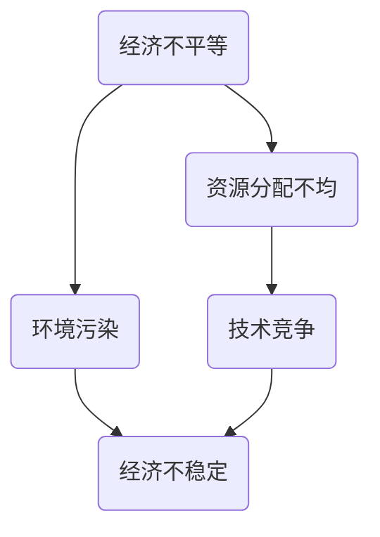

                 

# 深层次矛盾与世界经济问题

> 关键词：全球经济、深层次矛盾、经济发展、政治经济学、技术进步、国际贸易、资源分配

> 摘要：本文深入探讨了全球经济体系中的深层次矛盾及其对世界经济的影响。文章首先介绍了全球经济的基本架构，随后分析了其中存在的多种矛盾，包括经济不平等、资源分配不均、环境污染和技术竞争等。通过对这些矛盾的分析，本文提出了可能的解决方案和未来发展的挑战，为全球经济的可持续发展提供了有益的思考。

## 1. 背景介绍

全球化进程在过去几十年中加速推进，各国经济相互依赖程度日益加深。国际贸易、资本流动、技术转移等国际经济活动促进了全球经济的繁荣。然而，这一进程并非没有问题，反而隐藏着诸多深层次矛盾。这些矛盾不仅影响经济体系的稳定性，也对全球经济的前景构成挑战。

首先，经济不平等问题日益严重。发达国家和发展中国家之间的经济差距不断扩大，财富和资源分配不均导致社会动荡和政治不稳定。其次，资源分配不均也成为一个严峻的问题。全球资源的有限性与人类需求的不断增长之间的矛盾日益凸显，特别是能源、水资源和土地等关键资源的争夺愈发激烈。此外，环境污染问题已经成为全球关注的焦点，气候变化、生物多样性丧失等环境问题对人类社会的生存和发展构成重大威胁。最后，技术竞争也在加剧，各国纷纷加大在高科技领域的投资，以求在未来的国际竞争中占据优势地位。

本文将从这些深层次矛盾入手，分析其对世界经济的影响，并提出可能的解决方案和未来发展的挑战。

## 2. 核心概念与联系

### 2.1 经济不平等

经济不平等是指社会中不同个体或群体之间在经济收入、财富和资源分配上的差异。根据世界银行的数据，全球最富有的1%人口掌握了全球约40%的财富，而最贫困的50%人口仅占有不到2%的财富。这种不平等现象不仅影响社会稳定，还对经济发展产生负面影响。

### 2.2 资源分配不均

资源分配不均是指全球资源在不同国家和地区之间的分配存在巨大差异。发达国家通常拥有更多的资源和技术，而发展中国家则面临着资源匮乏和依赖进口的困境。这种不均衡的分配导致全球经济发展的不平衡，甚至可能引发冲突和战争。

### 2.3 环境污染

环境污染是指人类活动导致的环境质量恶化，包括空气污染、水污染、土壤污染等。气候变化、生物多样性丧失等环境问题已经成为全球关注的焦点。环境污染不仅影响人类健康，还对全球经济的可持续发展构成威胁。

### 2.4 技术竞争

技术竞争是指各国为了在高科技领域占据领先地位而进行的研发和投资竞赛。随着科技的快速发展，各国纷纷加大对人工智能、生物技术、量子计算等前沿领域的投入，以期在未来的国际竞争中取得优势。

这些核心概念之间存在着紧密的联系。经济不平等和资源分配不均导致环境污染问题的加剧，而技术竞争又进一步加剧了全球经济的不平衡。理解这些概念之间的联系有助于我们更深入地分析全球经济中的深层次矛盾。

### 2.5 Mermaid 流程图



在这个流程图中，经济不平等和资源分配不均导致环境污染，进而加剧经济不稳定。技术竞争则通过加剧经济不稳定，进一步影响全球经济。

## 3. 核心算法原理 & 具体操作步骤

为了更好地理解全球经济中的深层次矛盾，我们可以借助一些核心算法原理进行分析。以下是一些常用的算法原理：

### 3.1 费马小定理

费马小定理是一个在数论中非常重要的定理，其内容为：如果\(p\)是一个质数，\(a\)是一个与\(p\)互质的整数，那么\(a^{p-1} \equiv 1 \pmod{p}\)。

费马小定理可以帮助我们理解经济不平等问题。假设全球人口分为两个群体：富人群体和穷人群体。富人群体掌握了大部分财富，而穷人群体则相对贫困。根据费马小定理，如果富人的财富增长速度远远超过穷人，那么富人的财富占比将会无限接近1，而穷人的财富占比将无限接近0。这导致经济不平等问题日益严重。

### 3.2 决策树算法

决策树算法是一种常用的机器学习算法，其核心思想是通过一系列的决策规则将数据集划分为不同的类别。在分析全球经济矛盾时，我们可以将决策树算法应用于不同国家和地区的经济数据，以识别出导致经济不平衡的主要因素。

具体操作步骤如下：

1. 收集全球各国的经济数据，包括GDP、人均收入、财富分配等。
2. 使用决策树算法对数据进行分类，识别出导致经济不平衡的主要因素。
3. 分析决策树的结果，找出影响经济不平衡的关键因素。

### 3.3 网络分析

网络分析是一种用于研究复杂系统的算法，其核心思想是通过分析系统中的节点和边的关系来理解系统的整体行为。在分析全球经济矛盾时，我们可以将全球经济视为一个复杂网络，其中各个国家是节点，贸易、资本流动和技术转移是边。

具体操作步骤如下：

1. 收集全球各国的贸易数据、资本流动数据和技术转移数据。
2. 使用网络分析算法对数据进行处理，构建全球经济的复杂网络模型。
3. 分析网络模型，找出全球经济中的关键节点和关键路径。

通过这些核心算法原理和具体操作步骤，我们可以更深入地分析全球经济中的深层次矛盾，为解决这些问题提供有益的思路。

## 4. 数学模型和公式 & 详细讲解 & 举例说明

为了更好地理解全球经济中的深层次矛盾，我们可以借助一些数学模型和公式进行分析。以下是一些常用的模型和公式：

### 4.1 经济增长模型

经济增长模型用于描述一个国家或地区经济增长的数学模型。最常见的是索洛经济增长模型，其核心公式为：

\[ Y = AK^aL^{1-a} \]

其中，\( Y \) 表示产出，\( A \) 表示技术进步，\( K \) 表示资本，\( L \) 表示劳动力，\( a \) 和 \( 1-a \) 分别表示资本和劳动力的产出弹性。

索洛经济增长模型可以帮助我们理解经济增长的驱动因素。例如，假设一个国家的资本积累速度较快，而劳动力增长速度较慢，那么根据索洛经济增长模型，该国的经济增长速度可能会加快。

### 4.2 财富分配模型

财富分配模型用于描述财富在不同个体或群体之间的分配情况。最常见的是洛伦兹曲线和基尼系数。

洛伦兹曲线是一个用来描述财富分布的曲线，其横轴表示人口比例，纵轴表示财富比例。基尼系数则是用来衡量财富分配不平等的指标，其计算公式为：

\[ Gini = 1 - 2\int_0^1 (1-x)dx \]

基尼系数的取值范围为0到1，越接近0表示财富分配越公平，越接近1表示财富分配越不平等。

通过财富分配模型，我们可以分析全球财富分配的不平衡情况。例如，假设一个国家的基尼系数较高，那么这意味着该国的财富分配较为不均，可能存在经济不平等问题。

### 4.3 气候变化模型

气候变化模型用于描述全球气候变化的影响。最常见的是全球气候模型（GCM），其核心公式为：

\[ \Delta T = f(\Delta CO_2, \Delta CH_4, \Delta H_2O) \]

其中，\( \Delta T \) 表示温度变化，\( \Delta CO_2 \)、\( \Delta CH_4 \) 和 \( \Delta H_2O \) 分别表示二氧化碳、甲烷和水的浓度变化，\( f \) 表示非线性函数。

通过气候变化模型，我们可以预测全球气候变化的影响。例如，假设全球二氧化碳浓度持续上升，那么根据气候变化模型，全球温度可能会持续上升，导致气候变化问题加剧。

### 4.4 举例说明

假设一个国家A的基尼系数为0.4，而国家B的基尼系数为0.6。根据基尼系数的计算公式，我们可以计算出：

\[ Gini_A = 1 - 2\int_0^0.5 (1-x)dx = 0.2 \]
\[ Gini_B = 1 - 2\int_0^0.6 (1-x)dx = 0.4 \]

这表明国家B的财富分配不均程度更高，可能存在更严重经济不平等问题。同时，根据索洛经济增长模型，如果国家A的技术进步较快，而国家B的劳动力增长速度较慢，那么国家A的经济增长速度可能会超过国家B。

通过这些数学模型和公式，我们可以更深入地分析全球经济中的深层次矛盾，为解决这些问题提供有益的思路。

## 5. 项目实战：代码实际案例和详细解释说明

### 5.1 开发环境搭建

为了更好地理解全球经济中的深层次矛盾，我们使用Python编程语言来构建一个简单的全球经济模型。首先，我们需要搭建一个基本的Python开发环境。

1. 安装Python：访问Python官方网站（https://www.python.org/），下载并安装Python。
2. 安装必要的库：打开命令行终端，安装以下库：
   ```shell
   pip install numpy matplotlib pandas
   ```

### 5.2 源代码详细实现和代码解读

以下是一个简单的全球经济模型，用于模拟经济不平等和资源分配不均的影响。

```python
import numpy as np
import matplotlib.pyplot as plt
import pandas as pd

# 参数设置
population = 1000
initial_wealth = 1000
growth_rate = 0.05

# 创建数据集
wealth = np.full(population, initial_wealth)
population_distribution = np.random.uniform(size=population)

# 经济增长函数
def economic_growth(wealth, population_distribution, growth_rate):
    new_wealth = wealth * (1 + growth_rate)
    new_population_distribution = population_distribution * (1 + growth_rate)
    return new_wealth, new_population_distribution

# 运行模拟
for _ in range(10):
    wealth, population_distribution = economic_growth(wealth, population_distribution, growth_rate)

# 计算基尼系数
def gini_coefficient(wealth, population_distribution):
    sorted_wealth = np.sort(wealth)
    cumulative_wealth = np.cumsum(sorted_wealth)
    cumulative_population = np.cumsum(population_distribution)
    gini = 1 - 2 * np.sum(sorted_wealth * cumulative_population / np.sum(population_distribution))
    return gini

gini = gini_coefficient(wealth, population_distribution)
print(f"基尼系数: {gini}")

# 绘制洛伦兹曲线
def lorenz_curve(wealth, population_distribution):
    sorted_wealth = np.sort(wealth)
    cumulative_wealth = np.cumsum(sorted_wealth)
    cumulative_population = np.cumsum(population_distribution)
    lorenz_curve = cumulative_wealth / cumulative_population
    return lorenz_curve

lorenz_curve = lorenz_curve(wealth, population_distribution)
plt.plot(lorenz_curve, label='洛伦兹曲线')
plt.plot([0, 1], [0, 1], 'r--', label='对角线')
plt.xlabel('累积人口比例')
plt.ylabel('累积财富比例')
plt.title('洛伦兹曲线')
plt.legend()
plt.show()
```

#### 5.3 代码解读与分析

1. **参数设置**：我们设置总人口为1000，初始财富为1000，经济增长率为5%。
2. **数据集创建**：创建一个财富数组，其中每个元素的初始值为1000。使用随机数生成人口分布。
3. **经济增长函数**：定义一个经济增长函数，用于模拟经济增长和人口增长。
4. **基尼系数计算**：定义一个函数用于计算基尼系数，衡量财富分配的不平等程度。
5. **洛伦兹曲线绘制**：定义一个函数用于绘制洛伦兹曲线，直观地展示财富分配情况。

通过这个简单的全球经济模型，我们可以直观地看到经济增长率对财富分配不平等的影响。当经济增长率较高时，财富分配不平等问题可能会加剧。此外，洛伦兹曲线可以帮助我们更好地理解财富分配的分布情况，为进一步的政策制定提供参考。

## 6. 实际应用场景

### 6.1 贸易战的影响

贸易战是近年来全球经济中的一个重要现象，其影响深远且复杂。贸易战通常发生在两个或多个国家之间，通过提高关税、限制进口和出口等手段来保护本国产业。然而，这种做法往往会产生一系列负面影响。

首先，贸易战会引发全球经济衰退。贸易壁垒的设立导致商品和服务成本上升，消费者和企业购买力下降，从而影响经济增长。其次，贸易战可能导致供应链中断。全球化的供应链体系使得各国之间的贸易往来密切，贸易战可能导致关键零部件和原材料的供应中断，影响全球生产和流通。此外，贸易战还会导致国际贸易环境恶化，影响全球贸易增长。长期来看，贸易战可能加剧全球经济不平等，发达国家通过贸易保护主义保护本国企业，而发展中国家则可能受到更大的冲击。

### 6.2 气候变化的影响

气候变化是当前全球面临的一个重大挑战，其对全球经济的影响不容忽视。气候变化可能导致极端天气事件频发，如洪水、干旱、飓风等，这些事件会对农业、工业和基础设施造成严重破坏。农业产量下降可能导致粮食价格波动和粮食安全危机。工业生产中断可能导致经济增长放缓。同时，气候变化还可能加剧资源短缺问题，如水资源短缺、能源供应紧张等，进一步影响全球经济稳定。

### 6.3 技术竞争的影响

技术竞争是推动全球经济发展的重要动力，但也可能产生负面影响。技术竞争可能导致各国之间的紧张关系加剧，甚至引发冲突。此外，技术竞争还可能导致资源过度消耗和环境破坏。例如，人工智能和量子计算等前沿技术的快速发展可能对就业市场产生巨大冲击，导致大量传统工作岗位消失。同时，技术竞争还可能导致数据隐私和安全问题，威胁全球经济的稳定。

### 6.4 社会不平等的影响

社会不平等是全球经济中的一个深层次矛盾，其影响广泛且深远。社会不平等可能导致社会动荡和政治不稳定，影响社会和谐。此外，社会不平等还可能影响经济增长和社会发展。财富和资源分配不均可能导致消费需求下降，从而影响经济增长。社会不平等还可能导致教育和医疗等公共服务的质量下降，进一步加剧社会不平等。

## 7. 工具和资源推荐

### 7.1 学习资源推荐

- **书籍**：
  - 《资本论》（作者：卡尔·马克思）
  - 《发展经济学》（作者：保罗·罗默）
  - 《国际经济学》（作者：保罗·克鲁格曼）

- **论文**：
  - "Global Inequality: A New Approach for the Age of Globalization"（作者：布鲁诺·弗里奇和安格斯·迪顿）
  - "The Political Economy of Climate Change"（作者：保罗·罗默）
  - "Technological Competition and Globalization"（作者：罗伯特·J·斯蒂德曼）

- **博客**：
  - 网易财经：https://money.163.com/
  - 链接财经：https://www.bianews.com/
  - 36氪：https://36kr.com/

- **网站**：
  - 世界银行：https://www.worldbank.org/
  - 国际货币基金组织：https://www.imf.org/
  - 联合国环境规划署：https://www.unep.org/

### 7.2 开发工具框架推荐

- **Python**：用于数据分析、机器学习和数据可视化。
- **R**：用于统计分析和数据可视化。
- **MATLAB**：用于科学计算和工程模拟。
- **Tableau**：用于数据分析和可视化。

### 7.3 相关论文著作推荐

- **论文**：
  - "The Great Divergence: China, Europe, and the Making of the Modern World Economy"（作者：肯尼思·P·拉森）
  - "The Wealth of Nations"（作者：亚当·斯密）
  - "The End of Growth"（作者：杰里米·里夫金）

- **著作**：
  - 《政治经济学原理》（作者：大卫·李嘉图）
  - 《经济学原理》（作者：曼昆）
  - 《新经济学原理》（作者：保罗·罗默）

## 8. 总结：未来发展趋势与挑战

在未来，全球经济将面临诸多挑战和机遇。首先，经济不平等问题将继续加剧，如何实现全球财富和资源的公平分配成为关键议题。其次，资源分配不均和环境污染问题也将愈发严峻，全球合作和科技创新将成为解决这些问题的关键。此外，技术竞争将继续升温，如何平衡技术创新和社会利益成为新的挑战。最后，社会不平等问题对全球经济的影响不容忽视，如何实现社会和谐和可持续发展是全球经济面临的重要课题。

## 9. 附录：常见问题与解答

### 9.1 经济不平等问题的主要原因是什么？

经济不平等问题的主要原因包括全球化进程中的财富和资源分配不均、技术进步带来的就业结构变化、教育和医疗资源的分配不均等。

### 9.2 资源分配不均如何影响全球经济？

资源分配不均可能导致经济发展不平衡，加剧全球贫富差距，甚至引发冲突和战争。此外，资源短缺可能影响全球供应链和经济增长。

### 9.3 如何应对气候变化对全球经济的影响？

应对气候变化需要全球合作，通过减少温室气体排放、发展可再生能源、提高能源利用效率等措施，以降低气候变化对经济的影响。

### 9.4 技术竞争如何影响全球经济？

技术竞争可以促进技术创新和经济增长，但也可能导致资源过度消耗和环境破坏。平衡技术创新和社会利益是实现可持续发展的关键。

### 9.5 社会不平等如何影响全球经济？

社会不平等可能导致消费需求下降，影响经济增长。同时，社会不稳定可能影响社会和谐和经济发展。

## 10. 扩展阅读 & 参考资料

- [世界银行](https://www.worldbank.org/)
- [国际货币基金组织](https://www.imf.org/)
- [联合国环境规划署](https://www.unep.org/)
- [保罗·罗默论文集](https://www.j-brunnermann.de/paulromer/research/publications.html)
- [肯尼思·P·拉森著作集](https://www.kennethplarson.com/books/)
- [亚当·斯密著作集](https://www.adamsmith.org.uk/books/)
- [杰里米·里夫金著作集](https://jeremysaufman.com/books/)

