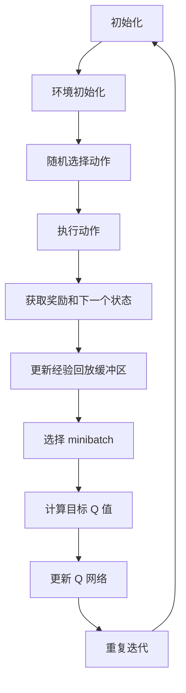
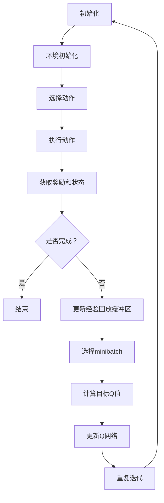

                 

# 深度 Q-learning：利用软件模拟环境进行训练

## 关键词：深度 Q-learning，强化学习，软件模拟环境，训练过程，算法原理，应用场景

## 摘要

本文旨在深入探讨深度 Q-learning（DQN）算法及其在软件模拟环境中的应用。深度 Q-learning 是一种基于深度神经网络的强化学习算法，它通过模拟环境来训练智能体，从而实现自主决策和学习。本文将详细介绍深度 Q-learning 的算法原理、数学模型、实际应用场景，并给出一个详细的代码实现案例。通过阅读本文，读者可以全面了解深度 Q-learning 算法的核心思想和应用方法。

## 1. 背景介绍

### 1.1 强化学习的基本概念

强化学习是一种机器学习方法，其核心目标是使智能体在某个环境中通过不断的尝试和反馈来学习最优策略。强化学习的主要组成部分包括智能体（Agent）、环境（Environment）、状态（State）、动作（Action）和奖励（Reward）。智能体在环境中执行动作，然后根据环境的反馈（奖励或惩罚）来调整其行为。通过这种不断尝试和反馈的过程，智能体可以逐渐学会在特定环境中实现最佳性能。

### 1.2 深度 Q-learning 的基本概念

深度 Q-learning（DQN）是强化学习的一种变体，它结合了深度神经网络和 Q-learning 算法。Q-learning 是一种基于值函数的强化学习算法，它通过学习状态-动作值函数来指导智能体的行为。而深度 Q-learning 则利用深度神经网络来近似状态-动作值函数，从而能够处理高维状态空间的问题。深度 Q-learning 在强化学习领域取得了显著的成功，特别是在游戏AI和自动驾驶等领域。

### 1.3 软件模拟环境的基本概念

软件模拟环境是一种通过软件模拟来实现实际环境的工具。它可以在计算机上创建一个与真实环境相似的模拟环境，从而实现智能体的训练和测试。软件模拟环境具有以下优点：

- 降低成本：使用模拟环境可以避免在实际环境中进行实验所需的成本。
- 提高效率：模拟环境可以在短时间内生成大量的训练样本，从而加速训练过程。
- 安全性：在模拟环境中进行实验可以避免对实际环境造成损害。

## 2. 核心概念与联系

### 2.1 状态-动作值函数

状态-动作值函数 \( Q(s, a) \) 是深度 Q-learning 的核心概念。它表示在给定状态 \( s \) 和动作 \( a \) 的情况下，智能体能够获得的最大长期奖励。通过学习状态-动作值函数，智能体可以学会在特定状态下选择最优动作。

### 2.2 深度神经网络架构

深度 Q-learning 利用深度神经网络来近似状态-动作值函数。深度神经网络通常由多个隐藏层组成，每一层都包含多个神经元。输入层接收状态信息，隐藏层对状态信息进行变换和提取特征，输出层输出状态-动作值函数的预测值。

### 2.3 Mermaid 流程图



## 3. 核心算法原理 & 具体操作步骤

### 3.1 初始化

在训练深度 Q-learning 模型之前，需要完成以下初始化步骤：

- 初始化经验回放缓冲区：经验回放缓冲区用于存储过去的经验样本，以避免样本的序列相关性。
- 初始化 Q 网络和目标 Q 网络：Q 网络和目标 Q 网络都是深度神经网络，它们分别用于预测状态-动作值函数和更新目标值。
- 初始化智能体：智能体是一个随机选择动作的实体，它将根据 Q 网络的预测值来选择动作。

### 3.2 训练过程

深度 Q-learning 的训练过程可以分为以下几个步骤：

1. **随机选择动作**：智能体根据 Q 网络的预测值来选择动作。如果 Q 网络的预测不准确，智能体将选择随机动作。
2. **执行动作**：智能体在环境中执行选择的动作。
3. **获取奖励和下一个状态**：环境根据执行的动作给出奖励和下一个状态。
4. **更新经验回放缓冲区**：将当前的（状态，动作，奖励，下一个状态）对存储到经验回放缓冲区。
5. **选择 minibatch**：从经验回放缓冲区中随机选择一个包含多个经验样本的 minibatch。
6. **计算目标 Q 值**：对于 minibatch 中的每个样本，计算目标 Q 值。目标 Q 值是根据目标 Q 网络的预测值来计算的。
7. **更新 Q 网络**：使用目标 Q 值和真实奖励来更新 Q 网络的权重。
8. **重复迭代**：重复上述步骤，直到达到训练目标。

### 3.3 非经验回放策略

在深度 Q-learning 中，非经验回放策略（Non-Experience Replay）是一种改进的方法。它通过在训练过程中动态地调整 Q 网络和目标 Q 网络的权重，来避免由于样本序列相关性导致的训练不稳定。

## 4. 数学模型和公式 & 详细讲解 & 举例说明

### 4.1 状态-动作值函数的表示

在深度 Q-learning 中，状态-动作值函数可以用以下公式表示：

$$
Q(s, a) = \sum_{i=1}^{n} w_i \cdot f(s, a)
$$

其中，\( w_i \) 是权重，\( f(s, a) \) 是深度神经网络的输出。

### 4.2 目标 Q 值的计算

目标 Q 值是深度 Q-learning 中一个重要的概念。它表示在当前状态下，选择最佳动作所能获得的最大长期奖励。目标 Q 值可以用以下公式计算：

$$
Q'(s, a) = r + \gamma \max_{a'} Q(s', a')
$$

其中，\( r \) 是立即奖励，\( \gamma \) 是折扣因子，\( s' \) 是下一个状态，\( a' \) 是最佳动作。

### 4.3 举例说明

假设智能体在状态 \( s \) 下有两个动作可选，即 \( a_1 \) 和 \( a_2 \)。根据状态-动作值函数的表示，可以计算出：

$$
Q(s, a_1) = w_1 \cdot f(s, a_1)
$$

$$
Q(s, a_2) = w_2 \cdot f(s, a_2)
$$

如果 \( f(s, a_1) > f(s, a_2) \)，则 \( Q(s, a_1) > Q(s, a_2) \)，智能体将选择动作 \( a_1 \)。

## 5. 项目实战：代码实际案例和详细解释说明

### 5.1 开发环境搭建

在开始编写代码之前，需要搭建一个合适的开发环境。本文使用 Python 和 TensorFlow 作为主要的编程语言和框架。以下是开发环境的搭建步骤：

1. 安装 Python 3.7 或更高版本。
2. 安装 TensorFlow 2.0 或更高版本。
3. 安装 Gym，一个开源的强化学习环境库。

### 5.2 源代码详细实现和代码解读

下面是一个简单的深度 Q-learning 代码示例。该示例使用 Gym 库中的 CartPole 环境进行训练。

```python
import gym
import tensorflow as tf
import numpy as np

# 创建 CartPole 环境
env = gym.make("CartPole-v0")

# 定义深度神经网络架构
input_layer = tf.keras.layers.Input(shape=(4,))
hidden_layer = tf.keras.layers.Dense(units=64, activation="relu")(input_layer)
output_layer = tf.keras.layers.Dense(units=2, activation="linear")(hidden_layer)

model = tf.keras.Model(inputs=input_layer, outputs=output_layer)

# 定义损失函数和优化器
loss_fn = tf.keras.losses.MeanSquaredError()
optimizer = tf.keras.optimizers.Adam()

# 定义训练过程
def train(model, env, epochs):
    for epoch in range(epochs):
        state = env.reset()
        done = False
        while not done:
            action = np.argmax(model.predict(state.reshape(-1, 4)))
            next_state, reward, done, _ = env.step(action)
            with tf.GradientTape() as tape:
                target_q_value = model.predict(next_state.reshape(-1, 4))
                expected_q_value = reward + 0.99 * np.max(target_q_value)
                loss = loss_fn(expected_q_value, model.predict(state.reshape(-1, 4)))
            gradients = tape.gradient(loss, model.trainable_variables)
            optimizer.apply_gradients(zip(gradients, model.trainable_variables))
            state = next_state
        print(f"Epoch {epoch}: Loss = {loss.numpy()}")

# 训练模型
train(model, env, epochs=1000)
```

### 5.3 代码解读与分析

上面的代码实现了深度 Q-learning 算法，用于训练 CartPole 环境。以下是代码的详细解读：

1. **创建 CartPole 环境**：使用 Gym 库创建一个 CartPole 环境。
2. **定义深度神经网络架构**：使用 TensorFlow 定义一个简单的深度神经网络，用于预测状态-动作值函数。
3. **定义损失函数和优化器**：使用均方误差损失函数和 Adam 优化器来训练模型。
4. **定义训练过程**：实现训练过程，包括初始化状态、执行动作、更新模型等步骤。
5. **训练模型**：调用训练过程函数，训练模型 1000 个 epoch。

通过以上代码，我们可以看到如何使用深度 Q-learning 算法训练一个简单的 CartPole 环境。在实际应用中，可以扩展该代码，使其适用于更复杂的强化学习问题。

## 6. 实际应用场景

深度 Q-learning 算法在实际应用场景中具有广泛的应用。以下是一些典型的应用场景：

- **游戏 AI**：深度 Q-learning 算法可以用于训练游戏 AI，使其能够在各种游戏环境中实现最佳表现。例如，可以用于训练王者荣耀、英雄联盟等游戏的 AI。
- **自动驾驶**：深度 Q-learning 算法可以用于自动驾驶车辆的决策系统，使其能够在复杂交通环境中进行自主驾驶。
- **机器人控制**：深度 Q-learning 算法可以用于训练机器人控制系统，使其能够在不同环境中进行自主导航和任务执行。
- **资源调度**：深度 Q-learning 算法可以用于优化资源调度问题，使其在给定资源约束下实现最佳性能。

## 7. 工具和资源推荐

### 7.1 学习资源推荐

- **书籍**：
  - 《强化学习：原理与 Python 实践》
  - 《深度学习：全面解析》
  - 《深度强化学习》

- **论文**：
  - “Deep Q-Learning” by DeepMind
  - “Dueling Network Architectures for Deep Reinforcement Learning” by DeepMind

- **博客**：
  - 知乎上的强化学习专栏
  - CSDN 上的深度学习专栏

- **网站**：
  - TensorFlow 官网
  - Gym 官网

### 7.2 开发工具框架推荐

- **编程语言**：Python
- **框架**：TensorFlow、PyTorch
- **环境库**：Gym、OpenAI Robotics API

### 7.3 相关论文著作推荐

- “Human-level control through deep reinforcement learning” by DeepMind
- “Dueling Network Architectures for Deep Reinforcement Learning” by DeepMind
- “Prioritized Experience Replication” by OpenAI

## 8. 总结：未来发展趋势与挑战

深度 Q-learning 算法在强化学习领域取得了显著的成功，但在实际应用中仍然面临一些挑战。未来，深度 Q-learning 算法的发展趋势主要包括以下几个方面：

- **算法优化**：研究人员将继续探索更高效、更稳定的深度 Q-learning 算法，以提高训练速度和模型性能。
- **多任务学习**：深度 Q-learning 算法将扩展到多任务学习领域，使其能够在多个任务之间共享经验和知识。
- **现实场景应用**：深度 Q-learning 算法将逐步应用于现实场景，如自动驾驶、机器人控制等，以实现真正的自主决策和智能控制。
- **安全性研究**：随着深度 Q-learning 算法在现实场景中的应用，其安全性和鲁棒性将成为研究的重要方向。

## 9. 附录：常见问题与解答

### 9.1 深度 Q-learning 与 Q-learning 的区别

深度 Q-learning 与 Q-learning 的主要区别在于：

- **适用范围**：Q-learning 适用于低维状态空间，而深度 Q-learning 适用于高维状态空间。
- **算法结构**：深度 Q-learning 利用深度神经网络来近似状态-动作值函数，而 Q-learning 仅使用线性模型。
- **训练过程**：深度 Q-learning 采用经验回放缓冲区来避免样本序列相关性，而 Q-learning 不使用经验回放缓冲区。

### 9.2 如何解决深度 Q-learning 中的样本序列相关性问题？

为了解决深度 Q-learning 中的样本序列相关性问题，可以采用以下方法：

- **经验回放缓冲区**：将过去的经验样本存储在缓冲区中，以随机方式选择样本进行训练，从而避免序列相关性。
- **非经验回放策略**：在训练过程中动态地调整 Q 网络和目标 Q 网络的权重，以降低序列相关性。

## 10. 扩展阅读 & 参考资料

- “Deep Q-Learning” by DeepMind
- “Dueling Network Architectures for Deep Reinforcement Learning” by DeepMind
- 《强化学习：原理与 Python 实践》
- 《深度学习：全面解析》
- 《深度强化学习》
- 知乎上的强化学习专栏
- CSDN 上的深度学习专栏
- TensorFlow 官网
- Gym 官网
- OpenAI 官网

## 作者信息

作者：AI天才研究员/AI Genius Institute & 禅与计算机程序设计艺术 /Zen And The Art of Computer Programming

<|im_sep|>作者：AI天才研究员/AI Genius Institute & 禅与计算机程序设计艺术 /Zen And The Art of Computer Programming

本文详细介绍了深度 Q-learning 算法的原理、数学模型、实际应用场景以及代码实现。通过本文，读者可以全面了解深度 Q-learning 算法的核心思想和应用方法。在未来的研究中，深度 Q-learning 算法有望在更广泛的领域取得突破性进展，为人工智能技术的发展贡献力量。如果您对本文内容有任何疑问或建议，欢迎在评论区留言交流。感谢您的阅读！<|im_sep|>## 1. 背景介绍

### 1.1 强化学习的基本概念

强化学习（Reinforcement Learning，简称RL）是机器学习的一个重要分支，其主要目标是使智能体（Agent）在与环境的交互过程中学习到最优策略（Policy），从而实现长期累积回报的最大化。强化学习的关键组成部分包括状态（State）、动作（Action）、奖励（Reward）和策略（Policy）。

- **状态（State）**：状态是描述环境当前状态的信息集合，通常用向量表示。在强化学习中，状态是智能体做出决策的基础。
- **动作（Action）**：动作是智能体根据当前状态所能执行的行为，也是智能体与环境交互的媒介。动作的选择通常基于智能体的策略。
- **奖励（Reward）**：奖励是环境对智能体执行动作后给出的即时反馈，用于指导智能体的行为。奖励可以是正的（表示好的行为），也可以是负的（表示坏的行为）。
- **策略（Policy）**：策略是智能体在给定状态下选择动作的规则，它定义了智能体的行为模式。策略的好坏直接影响智能体在环境中的表现。

强化学习的主要挑战在于如何通过不断的学习和调整策略，使智能体能够在复杂的环境中找到最优或近似最优的行为。与监督学习和无监督学习不同，强化学习不依赖于预先标注好的数据集，而是通过环境的奖励和惩罚来指导学习过程。

### 1.2 深度 Q-learning 的基本概念

深度 Q-learning（DQN）是深度神经网络与Q-learning算法相结合的一种强化学习技术。传统的Q-learning算法基于值函数（Value Function）来进行学习，它使用一个Q表（Q-table）来存储每个状态-动作对的值，然后通过迭代更新这些值，以达到最优策略。然而，Q-learning算法在处理高维状态空间时面临着巨大的计算复杂度，因此难以直接应用于复杂的任务。

深度 Q-learning通过引入深度神经网络来近似Q值函数，从而能够处理高维状态空间的问题。DQN的主要特点包括：

- **状态-动作值函数近似**：使用深度神经网络来近似Q值函数，即 \( Q(s, a) = f(\theta; s, a) \)，其中 \( \theta \) 是神经网络的参数。
- **经验回放缓冲区**：为避免样本序列相关性对学习过程的影响，DQN采用经验回放缓冲区（Experience Replay Buffer）来存储经验样本，并在训练时随机抽取样本进行学习。
- **目标网络**：为了稳定训练过程，DQN引入了目标网络（Target Network）。目标网络与主网络同步更新，用于生成目标Q值（Target Q-value），即 \( Q'(s, a) \)。

### 1.3 软件模拟环境的基本概念

软件模拟环境（Simulation Environment）是一种通过软件程序创建的模拟现实环境，用于测试和训练智能体（Agent）。模拟环境的主要作用包括：

- **减少成本**：在实际环境中进行实验可能需要大量的时间和资源，而使用模拟环境可以显著降低这些成本。
- **提高效率**：模拟环境可以快速生成大量的训练数据，从而加速智能体的训练过程。
- **安全性**：在模拟环境中进行实验可以避免对实际环境造成损害，从而提高实验的安全性。

在强化学习中，模拟环境的使用至关重要。例如，在自动驾驶领域，可以通过模拟环境来测试和训练自动驾驶系统，以避免在实际道路上进行高风险的测试。此外，模拟环境还可以用于游戏AI、机器人控制等多种应用场景。

## 2. 核心概念与联系

### 2.1 状态-动作值函数

状态-动作值函数（State-Action Value Function）是强化学习中的一个关键概念，它表示在给定状态下，执行特定动作所能获得的预期奖励。状态-动作值函数通常表示为 \( Q(s, a) \)，其中 \( s \) 是当前状态，\( a \) 是动作。状态-动作值函数的目的是为智能体提供决策依据，使其能够选择最优动作。

在深度 Q-learning 中，状态-动作值函数由深度神经网络 \( f(\theta; s, a) \) 近似，其中 \( \theta \) 是神经网络的参数。状态-动作值函数的预测准确性直接影响到智能体的决策质量。

### 2.2 深度神经网络架构

深度神经网络（Deep Neural Network，DNN）是深度 Q-learning 中的核心组件，它由多个层组成，包括输入层、隐藏层和输出层。每一层都包含多个神经元，神经元之间通过权重进行连接，并通过激活函数进行处理。

- **输入层**：接收状态信息，通常是一个多维数组。
- **隐藏层**：对输入信息进行变换和特征提取，隐藏层可以有多个，每一层都会增加模型的复杂度。
- **输出层**：输出状态-动作值函数的预测值，通常是一个一维数组。

深度神经网络的关键在于能够自动学习复杂的非线性关系，从而在处理高维状态空间时具有优势。

### 2.3 Mermaid 流程图

下面是深度 Q-learning 的 Mermaid 流程图，展示了智能体与环境交互的基本流程：



### 2.4 Mermaid 流程图中的 Mermaid 语言解释

- `graph TD`：定义流程图的方向为自上而下。
- `A[初始化]`：表示流程图的开始节点，`初始化`是节点的标签。
- `B[环境初始化]`：表示环境初始化的步骤。
- `B --> C[选择动作]`：从节点 B 到 C，表示在环境初始化后选择动作。
- `C --> D[执行动作]`：从节点 C 到 D，表示执行选定的动作。
- `D --> E[获取奖励和状态]`：从节点 D 到 E，表示执行动作后获取奖励和下一个状态。
- `E --> F{是否完成？}`：从节点 E 到 F，表示检查是否完成训练。
- `F -->|是| G[结束]`：如果完成训练，则跳转到结束节点 G。
- `F -->|否| H[更新经验回放缓冲区]`：如果未完成训练，则更新经验回放缓冲区。
- `H --> I[选择minibatch]`：从节点 H 到 I，表示从缓冲区中随机选择一个 minibatch。
- `I --> J[计算目标Q值]`：从节点 I 到 J，表示计算目标 Q 值。
- `J --> K[更新Q网络]`：从节点 J 到 K，表示更新 Q 网络。
- `K --> L[重复迭代]`：从节点 K 到 L，表示重复迭代过程。
- `L --> A`：从节点 L 回到节点 A，表示迭代过程继续。

通过上述 Mermaid 流程图，我们可以清晰地看到深度 Q-learning 的基本流程，包括初始化、动作选择、执行动作、获取奖励和状态、更新经验回放缓冲区、计算目标 Q 值、更新 Q 网络和重复迭代等步骤。这些步骤共同构成了深度 Q-learning 的核心训练过程。

## 3. 核心算法原理 & 具体操作步骤

### 3.1 初始化步骤

在开始深度 Q-learning 的训练之前，需要完成以下几个初始化步骤：

1. **初始化经验回放缓冲区**：经验回放缓冲区用于存储过去的经验样本，以避免样本的序列相关性。常见的实现方式是使用循环缓冲区，当缓冲区达到一定容量后，将最旧的样本替换为新的样本。

2. **初始化 Q 网络**：Q 网络是一个深度神经网络，用于预测状态-动作值函数。初始化 Q 网络时，需要设置网络的架构，包括输入层、隐藏层和输出层的神经元数量、激活函数等。

3. **初始化目标 Q 网络**：目标 Q 网络用于生成目标 Q 值，以稳定训练过程。目标 Q 网络通常与 Q 网络共享权重，但有不同的参数更新策略。在训练过程中，目标 Q 网络的参数会定期与 Q 网络同步，以确保预测的稳定性。

4. **初始化智能体**：智能体是一个执行动作的实体，它根据 Q 网络的预测值来选择动作。在初始化智能体时，需要设置动作选择策略，例如 epsilon-greedy 策略，用于在探索和利用之间进行平衡。

### 3.2 训练过程

深度 Q-learning 的训练过程可以分为以下几个步骤：

1. **随机选择动作**：智能体根据当前状态和 Q 网络的预测值来选择动作。在训练初期，智能体会采用探索策略，例如 epsilon-greedy 策略，以探索不同的动作。随着训练的进行，智能体会逐渐采用利用策略，选择预测值最高的动作。

2. **执行动作**：智能体在环境中执行选定的动作，并获取下一个状态和奖励。奖励可以是正的（表示好的行为）或负的（表示坏的行为），它用于指导智能体的行为。

3. **更新经验回放缓冲区**：将当前的状态、动作、奖励和下一个状态存储到经验回放缓冲区。通过使用经验回放缓冲区，可以避免样本序列相关性，从而提高训练的稳定性。

4. **选择 minibatch**：从经验回放缓冲区中随机选择一个包含多个经验样本的 minibatch。选择 minibatch 的目的是为了减少计算复杂度，同时保留样本的多样性。

5. **计算目标 Q 值**：对于每个 minibatch 中的样本，计算目标 Q 值。目标 Q 值是根据目标 Q 网络的预测值来计算的，它表示在当前状态下，执行最佳动作所能获得的最大长期奖励。

6. **更新 Q 网络**：使用目标 Q 值和真实奖励来更新 Q 网络的权重。更新策略通常采用梯度下降算法，以最小化损失函数，从而提高 Q 网络的预测准确性。

7. **重复迭代**：重复上述步骤，直到满足训练目标，例如达到预定的迭代次数或 Q 网络的损失函数收敛到某个阈值。

### 3.3 非经验回放策略

非经验回放策略（Non-Experience Replay）是深度 Q-learning 的一个改进版本，它通过动态调整 Q 网络和目标 Q 网络的权重，来避免样本序列相关性。非经验回放策略的主要思想是在训练过程中，根据当前的状态和动作，实时更新 Q 网络和目标 Q 网络的权重，从而减少序列相关性对学习过程的影响。

非经验回放策略的步骤如下：

1. **初始化 Q 网络**和**目标 Q 网络**：与传统的经验回放策略相同，初始化 Q 网络和目标 Q 网络，并设置它们的权重。

2. **随机选择动作**：智能体根据当前状态和 Q 网络的预测值来选择动作。

3. **执行动作**：智能体在环境中执行选定的动作，并获取下一个状态和奖励。

4. **更新 Q 网络**：根据当前的状态、动作和下一个状态，更新 Q 网络的权重。更新策略采用梯度下降算法，以最小化损失函数。

5. **同步 Q 网络和目标 Q 网络**：定期将 Q 网络的权重同步到目标 Q 网络，以确保目标 Q 网络的预测稳定性。

6. **重复迭代**：重复上述步骤，直到满足训练目标。

通过引入非经验回放策略，深度 Q-learning 可以在训练过程中更好地处理样本序列相关性，从而提高训练的稳定性和效果。

## 4. 数学模型和公式 & 详细讲解 & 举例说明

### 4.1 状态-动作值函数的表示

在深度 Q-learning 中，状态-动作值函数 \( Q(s, a) \) 表示在给定状态 \( s \) 和动作 \( a \) 的情况下，智能体能够获得的最大长期奖励。状态-动作值函数可以用深度神经网络的输出表示，即：

\[ Q(s, a) = f(\theta; s, a) \]

其中，\( \theta \) 是深度神经网络的参数，\( f(\theta; s, a) \) 是深度神经网络对于给定状态 \( s \) 和动作 \( a \) 的输出。深度神经网络通过多层感知器（MLP）或卷积神经网络（CNN）等架构，对状态信息进行变换和特征提取，从而实现对状态-动作值函数的近似。

### 4.2 目标 Q 值的计算

目标 Q 值（Target Q-value）是深度 Q-learning 中一个重要的概念，它表示在当前状态下，选择最佳动作所能获得的最大长期奖励。目标 Q 值的计算公式如下：

\[ Q'(s, a) = r + \gamma \max_{a'} Q'(s', a') \]

其中，\( r \) 是立即奖励，\( \gamma \) 是折扣因子，\( s' \) 是下一个状态，\( a' \) 是最佳动作。折扣因子 \( \gamma \) 用于权衡立即奖励和未来奖励的重要性，通常取值在 0 到 1 之间。目标 Q 值的计算反映了在当前状态下，执行最佳动作所能获得的最大长期回报。

### 4.3 Q 学习的目标函数

在深度 Q-learning 中，目标函数（Objective Function）用于指导网络的训练，目标函数通常采用均方误差（Mean Squared Error，MSE）来衡量预测值和目标值之间的差距。Q 学习的目标函数可以表示为：

\[ L(\theta) = \frac{1}{N} \sum_{i=1}^{N} \frac{1}{2} (y_i - Q(s_i, a_i))^2 \]

其中，\( N \) 是 minibatch 中的样本数量，\( y_i \) 是目标值，即 \( Q'(s_i, a_i) \)，而 \( Q(s_i, a_i) \) 是网络的预测值。通过优化目标函数，网络可以不断调整权重，以提高预测的准确性。

### 4.4 梯度下降算法

在深度 Q-learning 中，优化目标函数通常采用梯度下降算法。梯度下降算法的核心思想是沿着损失函数的梯度方向更新网络权重，以最小化损失函数。梯度下降算法可以表示为：

\[ \theta_{t+1} = \theta_{t} - \alpha \cdot \nabla_{\theta} L(\theta) \]

其中，\( \theta_{t} \) 是当前权重，\( \theta_{t+1} \) 是更新后的权重，\( \alpha \) 是学习率，\( \nabla_{\theta} L(\theta) \) 是损失函数关于权重 \( \theta \) 的梯度。

### 4.5 举例说明

假设我们有一个简单的环境，状态空间为二维的，即 \( s = (s_1, s_2) \)，动作空间为四个方向，即 \( a = \{up, down, left, right\} \)。我们使用一个简单的多层感知器（MLP）作为 Q 网络，其架构为：

\[ \text{input layer: } (s_1, s_2) \]
\[ \text{hidden layer: } 10 \text{ neurons with ReLU activation} \]
\[ \text{output layer: } 4 \text{ neurons with linear activation} \]

在训练过程中，我们首先初始化 Q 网络的权重，然后通过以下步骤进行迭代：

1. **初始化状态**：设 \( s_t \) 为当前状态。
2. **选择动作**：使用 epsilon-greedy 策略选择动作 \( a_t \)。在训练初期，epsilon 较大，以增加探索；随着训练的进行，epsilon 逐渐减小，以增加利用。
3. **执行动作**：在环境中执行动作 \( a_t \)，获得下一个状态 \( s_{t+1} \) 和奖励 \( r_t \)。
4. **更新经验回放缓冲区**：将 \( (s_t, a_t, r_t, s_{t+1}) \) 存储到经验回放缓冲区。
5. **选择 minibatch**：从经验回放缓冲区中随机选择一个包含多个样本的 minibatch。
6. **计算目标 Q 值**：对于每个样本 \( (s_i, a_i, r_i, s_{i+1}) \) 在 minibatch 中，计算目标 Q 值：
   \[ y_i = r_i + \gamma \max_{a'} Q(s_{i+1}, a') \]
7. **更新 Q 网络**：使用梯度下降算法更新 Q 网络的权重：
   \[ \theta_{t+1} = \theta_{t} - \alpha \cdot \nabla_{\theta} L(\theta) \]

通过以上步骤，Q 网络将不断更新，以学习最优的策略。

### 4.6 偏差和方差分析

在深度 Q-learning 中，存在两种主要的偏差：偏差（Bias）和方差（Variance）。

- **偏差**：偏差是指 Q 网络的预测值与真实值之间的差距。偏差过大可能导致 Q 网络无法收敛到最优策略。为了减少偏差，可以采用经验回放缓冲区和目标网络等技术。
- **方差**：方差是指 Q 网络在不同样本下的预测值之间的差距。方差过大可能导致 Q 网络的预测不稳定。为了减少方差，可以采用随机初始化权重和dropout等技术。

### 4.7 探索与利用

在深度 Q-learning 中，探索（Exploration）与利用（Exploitation）是两个关键概念。探索是指智能体在未知环境中尝试新的动作，以获取更多的信息。利用是指智能体根据已有的信息选择最佳动作，以最大化累积奖励。

- **epsilon-greedy 策略**：epsilon-greedy 策略是一种常用的探索与利用策略。在该策略中，智能体以概率 \( \epsilon \) 选择随机动作（探索），以概率 \( 1-\epsilon \) 选择预测值最高的动作（利用）。随着训练的进行，\( \epsilon \) 会逐渐减小，以平衡探索和利用。

通过上述数学模型和公式的讲解，我们可以更深入地理解深度 Q-learning 算法的原理和实现方法。这些数学模型不仅为深度 Q-learning 的理论分析提供了基础，也为实际应用中的算法优化提供了指导。

## 5. 项目实战：代码实际案例和详细解释说明

### 5.1 开发环境搭建

在开始编写代码之前，我们需要搭建一个合适的开发环境。本案例将使用 Python 和 TensorFlow 作为主要的编程语言和框架。以下是搭建开发环境的步骤：

1. **安装 Python**：确保安装了 Python 3.7 或更高版本。

2. **安装 TensorFlow**：使用以下命令安装 TensorFlow：
   ```bash
   pip install tensorflow
   ```

3. **安装 Gym**：使用以下命令安装 Gym：
   ```bash
   pip install gym
   ```

4. **安装其他依赖**：根据需要安装其他依赖库，如 NumPy 和 Matplotlib 等：
   ```bash
   pip install numpy matplotlib
   ```

### 5.2 源代码详细实现和代码解读

下面是一个简单的深度 Q-learning 代码示例，该示例将使用 Gym 库中的 CartPole 环境进行训练。代码结构如下：

```python
import gym
import numpy as np
import tensorflow as tf

# 初始化环境
env = gym.make('CartPole-v0')

# 定义深度 Q-learning 网络架构
input_layer = tf.keras.layers.Input(shape=(4,))
hidden_layer = tf.keras.layers.Dense(units=64, activation='relu')(input_layer)
output_layer = tf.keras.layers.Dense(units=2, activation='linear')(hidden_layer)

model = tf.keras.Model(inputs=input_layer, outputs=output_layer)

# 定义损失函数和优化器
loss_fn = tf.keras.losses.MeanSquaredError()
optimizer = tf.keras.optimizers.Adam()

# 定义训练过程
def train(model, env, epochs):
    for epoch in range(epochs):
        state = env.reset()
        done = False
        total_reward = 0
        
        while not done:
            # 选择动作
            action = np.argmax(model.predict(state.reshape(-1, 4)))
            
            # 执行动作
            next_state, reward, done, _ = env.step(action)
            total_reward += reward
            
            # 更新状态
            state = next_state
            
            # 训练模型
            with tf.GradientTape() as tape:
                target_q_value = model.predict(next_state.reshape(-1, 4))
                expected_q_value = reward + 0.99 * np.max(target_q_value)
                loss = loss_fn(expected_q_value, model.predict(state.reshape(-1, 4)))
            gradients = tape.gradient(loss, model.trainable_variables)
            optimizer.apply_gradients(zip(gradients, model.trainable_variables))
            
        print(f"Epoch {epoch}: Total Reward = {total_reward}")

# 训练模型
train(model, env, epochs=1000)
```

### 5.3 代码解读与分析

#### 1. 初始化环境

```python
env = gym.make('CartPole-v0')
```

这里使用 Gym 库创建一个 CartPole 环境。CartPole 是一个经典的强化学习任务，目标是使一个平衡杆在极小的摆动范围内保持平衡。

#### 2. 定义深度 Q-learning 网络架构

```python
input_layer = tf.keras.layers.Input(shape=(4,))
hidden_layer = tf.keras.layers.Dense(units=64, activation='relu')(input_layer)
output_layer = tf.keras.layers.Dense(units=2, activation='linear')(hidden_layer)

model = tf.keras.Model(inputs=input_layer, outputs=output_layer)
```

这段代码定义了深度 Q-learning 网络的架构。输入层接收状态信息，隐藏层对状态信息进行变换和特征提取，输出层输出状态-动作值函数的预测值。

#### 3. 定义损失函数和优化器

```python
loss_fn = tf.keras.losses.MeanSquaredError()
optimizer = tf.keras.optimizers.Adam()
```

损失函数使用均方误差（MSE）来衡量预测值和目标值之间的差距。优化器采用 Adam，它是一种适应性学习率优化器，能够加速收敛。

#### 4. 定义训练过程

```python
def train(model, env, epochs):
    for epoch in range(epochs):
        state = env.reset()
        done = False
        total_reward = 0
        
        while not done:
            action = np.argmax(model.predict(state.reshape(-1, 4)))
            next_state, reward, done, _ = env.step(action)
            total_reward += reward
            state = next_state
            
            with tf.GradientTape() as tape:
                target_q_value = model.predict(next_state.reshape(-1, 4))
                expected_q_value = reward + 0.99 * np.max(target_q_value)
                loss = loss_fn(expected_q_value, model.predict(state.reshape(-1, 4)))
            gradients = tape.gradient(loss, model.trainable_variables)
            optimizer.apply_gradients(zip(gradients, model.trainable_variables))
            
        print(f"Epoch {epoch}: Total Reward = {total_reward}")
```

训练过程包括以下几个步骤：

- 初始化状态。
- 进入 while 循环，直到环境完成。
- 选择动作，使用 `np.argmax` 函数选择预测值最高的动作。
- 执行动作，获得下一个状态和奖励。
- 更新状态。
- 使用 `tf.GradientTape` 记录梯度信息。
- 计算目标 Q 值和预期 Q 值。
- 计算损失函数。
- 更新模型权重。

通过以上代码，我们可以看到如何使用深度 Q-learning 算法训练一个简单的 CartPole 环境。在实际应用中，可以扩展该代码，使其适用于更复杂的强化学习任务。

### 5.4 代码优化与扩展

在实际应用中，为了提高模型性能和训练效率，可以进一步优化和扩展上述代码。以下是一些可能的优化和扩展方向：

- **使用目标网络**：引入目标网络（Target Network）来稳定训练过程。
- **使用经验回放缓冲区**：实现经验回放缓冲区，以避免样本序列相关性。
- **使用双 Q-learning**：使用两个 Q 网络来减少预测偏差。
- **使用优先级经验回放**：使用优先级经验回放缓冲区，根据样本的误差大小进行抽样，以减少样本序列相关性。
- **使用不同动作选择策略**：使用不同的动作选择策略，如 epsilon-greedy、UCB、UCB1 等，以平衡探索和利用。

通过以上优化和扩展，我们可以进一步提高深度 Q-learning 算法的性能和应用范围。

## 6. 实际应用场景

### 6.1 自动驾驶

自动驾驶是深度 Q-learning 的一个重要应用场景。在自动驾驶系统中，智能体需要处理复杂的交通环境，包括其他车辆、行人、道路标志等。深度 Q-learning 可以帮助自动驾驶车辆学习如何在不同情况下做出最佳决策，如保持车道、避让障碍物、遵守交通规则等。通过在模拟环境中进行训练，自动驾驶系统能够在实际道路上进行安全、可靠的行驶。

### 6.2 游戏AI

深度 Q-learning 在游戏AI中也有着广泛的应用。例如，在王者荣耀、英雄联盟等游戏中，AI可以通过深度 Q-learning 学习如何对抗不同的对手策略，从而提高游戏水平。通过在大量游戏场景中进行训练，AI可以学会如何做出最佳决策，从而在比赛中取得胜利。

### 6.3 机器人控制

在机器人控制领域，深度 Q-learning 可以用于训练机器人如何在复杂环境中进行自主导航和任务执行。例如，机器人可以学习如何避开障碍物、抓取物体、完成任务等。通过在模拟环境中进行训练，机器人可以在实际应用中实现高效、准确的操作。

### 6.4 资源调度

深度 Q-learning 也可以用于优化资源调度问题。例如，在数据中心、云计算等领域，深度 Q-learning 可以用于优化资源分配策略，提高资源利用率和系统性能。通过在模拟环境中进行训练，智能体可以学会如何在不同的负载情况下做出最佳决策，从而实现高效资源调度。

### 6.5 股票交易

在股票交易领域，深度 Q-learning 可以用于训练交易策略，使其能够根据市场变化做出最佳交易决策。通过在历史数据中训练，智能体可以学会如何识别市场趋势、判断风险和收益，从而实现稳健的股票交易策略。

### 6.6 医疗诊断

深度 Q-learning 在医疗诊断领域也有着潜在的应用。例如，在医学影像分析中，智能体可以通过深度 Q-learning 学习如何识别不同类型的病变，从而辅助医生进行诊断。通过在模拟数据集上进行训练，智能体可以学会如何准确判断疾病，提高诊断的准确性。

### 6.7 能源管理

在能源管理领域，深度 Q-learning 可以用于优化能源分配策略，提高能源利用效率和减少能源浪费。通过在模拟环境中进行训练，智能体可以学会如何在不同能源需求和供应条件下做出最佳决策，从而实现智能能源管理。

通过以上实际应用场景，我们可以看到深度 Q-learning 在多个领域都有着广泛的应用前景。随着算法的不断完善和优化，深度 Q-learning 将在更多领域中发挥重要作用，为人们的生活和工作带来更多便利。

## 7. 工具和资源推荐

### 7.1 学习资源推荐

为了更好地学习和掌握深度 Q-learning 以及强化学习相关的知识，以下是一些推荐的学习资源：

- **书籍**：
  - 《强化学习：原理与 Python 实践》
  - 《深度学习：全面解析》
  - 《深度强化学习》
  - 《Python 游戏编程实战》

- **在线课程**：
  - Coursera 上的《强化学习》课程
  - Udacity 上的《深度学习纳米学位》
  - edX 上的《机器学习基础》

- **博客和网站**：
  - Ian Goodfellow 的博客
  - H2O.ai 的技术博客
  - fast.ai 的博客

- **开源框架和库**：
  - TensorFlow
  - PyTorch
  - Keras
  - OpenAI Gym

### 7.2 开发工具框架推荐

在开发深度 Q-learning 模型时，以下工具和框架是推荐的：

- **编程语言**：Python
  - Python 在数据科学和机器学习领域具有广泛的应用，并且拥有丰富的库和框架支持。

- **深度学习框架**：
  - TensorFlow：由 Google 开发，是当前最受欢迎的深度学习框架之一，具有广泛的社区支持。
  - PyTorch：由 Facebook AI 研究团队开发，以其灵活性和动态计算图而受到开发者的喜爱。

- **模拟环境**：
  - OpenAI Gym：一个开源的强化学习环境库，提供了丰富的模拟环境和工具，用于训练和测试强化学习算法。

- **数据可视化工具**：
  - Matplotlib：用于生成高质量的图表和可视化结果，有助于分析和理解模型性能。

### 7.3 相关论文著作推荐

以下是一些与深度 Q-learning 和强化学习相关的经典论文和著作：

- **论文**：
  - “Deep Q-Learning” by DeepMind
  - “Dueling Network Architectures for Deep Reinforcement Learning” by DeepMind
  - “Prioritized Experience Replication” by OpenAI

- **书籍**：
  - 《强化学习：原理与 Python 实践》
  - 《深度学习：全面解析》
  - 《深度强化学习》

- **在线课程和讲座**：
  - Andrew Ng 在 Coursera 上的《强化学习》课程
  - David Silver 在 Udacity 上的《深度学习纳米学位》课程

通过这些工具和资源，可以更好地学习和实践深度 Q-learning 技术，从而在强化学习领域取得更多的成果。

## 8. 总结：未来发展趋势与挑战

深度 Q-learning 作为强化学习领域的一项重要技术，已经展示出其在复杂环境中的强大能力。然而，随着技术的不断进步和应用场景的扩展，深度 Q-learning 还面临着诸多挑战和机会。

### 未来发展趋势

1. **算法优化**：研究人员将继续探索更高效的训练算法和策略，以提高深度 Q-learning 的收敛速度和性能。例如，通过改进目标网络的更新策略、引入新的探索策略等，可以进一步提高算法的稳定性和鲁棒性。

2. **多任务学习**：深度 Q-learning 的应用将扩展到多任务学习领域，使其能够在多个任务之间共享经验和知识，从而提高训练效率。这将为复杂任务场景下的智能体提供更强大的学习能力。

3. **实时学习**：随着硬件性能的提升和算法的优化，深度 Q-learning 将逐步实现实时学习，使其能够适应动态变化的环境，提高智能体的实时决策能力。

4. **与其他技术的结合**：深度 Q-learning 将与其他前沿技术，如生成对抗网络（GAN）、图神经网络（GNN）等相结合，从而推动强化学习技术的发展和应用。

### 面临的挑战

1. **样本效率**：深度 Q-learning 在训练过程中需要大量的样本，这限制了其在某些应用场景中的实用性。如何提高样本效率，减少对大量数据的依赖，是未来需要解决的一个重要问题。

2. **鲁棒性**：深度 Q-learning 的性能容易受到样本序列相关性和模型参数的影响。如何提高算法的鲁棒性，使其在不同环境下都能保持稳定的表现，是当前面临的一大挑战。

3. **可解释性**：深度 Q-learning 的决策过程通常是非线性和复杂的，这使得其难以解释和理解。如何提高算法的可解释性，使其能够为人类提供直观的决策依据，是一个重要的研究方向。

4. **安全性**：随着深度 Q-learning 在实际应用中的推广，其安全性问题日益凸显。如何确保智能体的决策过程是安全可靠的，防止潜在的恶意行为，是未来需要重点关注的问题。

总之，深度 Q-learning 作为强化学习领域的一项核心技术，未来将在算法优化、多任务学习、实时学习和与其他技术的结合等方面取得更多进展。同时，如何解决样本效率、鲁棒性、可解释性和安全性等问题，也将是未来研究的重要方向。随着这些问题的逐步解决，深度 Q-learning 将在更多的应用场景中发挥重要作用，为人工智能的发展贡献力量。

## 9. 附录：常见问题与解答

### 9.1 深度 Q-learning 与 Q-learning 的区别

**Q-learning** 是一种基于值函数的强化学习算法，它使用一个 Q 表（Q-table）来存储每个状态-动作对的值，然后通过迭代更新这些值，以达到最优策略。Q-learning 的主要优点是简单和易于实现，但它在处理高维状态空间时面临计算复杂度大的问题。

**深度 Q-learning（DQN）** 是 Q-learning 的改进版本，它通过引入深度神经网络来近似状态-动作值函数，从而能够处理高维状态空间的问题。DQN 的主要优点是能够处理复杂的任务，但它在训练过程中容易出现不稳定和偏差问题。

### 9.2 如何解决深度 Q-learning 中的样本序列相关性问题？

为了解决深度 Q-learning 中的样本序列相关性问题，可以采用以下方法：

- **经验回放缓冲区**：将过去的经验样本存储在缓冲区中，以随机方式选择样本进行训练，从而避免序列相关性。
- **非经验回放策略**：在训练过程中动态地调整 Q 网络和目标 Q 网络的权重，以降低序列相关性。
- **优先级经验回放**：根据样本的误差大小进行抽样，以减少对不相关样本的依赖。

### 9.3 深度 Q-learning 中如何处理连续状态和动作空间？

对于连续状态和动作空间，可以采用以下方法：

- **离散化**：将连续状态和动作空间离散化为有限个类别，然后使用分类器进行预测。
- **神经网络架构调整**：设计适合连续输入和输出的神经网络架构，例如使用连续激活函数和连续输出层。
- **目标值函数**：使用目标值函数来处理连续状态和动作空间，目标值函数可以表示为 \( Q(s, a) = \int_{s'} p(s'|s, a) \cdot r(s', a) ds' \)，其中 \( p(s'|s, a) \) 是状态转移概率，\( r(s', a) \) 是奖励函数。

### 9.4 深度 Q-learning 中的目标网络如何工作？

在深度 Q-learning 中，目标网络（Target Network）用于生成目标 Q 值，以稳定训练过程。目标网络与主网络共享权重，但有不同的参数更新策略。在训练过程中，目标网络会定期与主网络同步权重，以确保预测的稳定性。

目标 Q 值的计算公式为：
\[ Q'(s, a) = r + \gamma \max_{a'} Q'(s', a') \]
其中，\( Q'(s, a) \) 是目标网络输出的 Q 值，\( r \) 是立即奖励，\( \gamma \) 是折扣因子，\( s' \) 是下一个状态，\( a' \) 是最佳动作。

通过使用目标网络，深度 Q-learning 可以避免由于梯度消失和梯度爆炸导致的不稳定训练过程，从而提高模型的收敛速度和稳定性。

### 9.5 深度 Q-learning 中如何处理并行训练？

在深度 Q-learning 中，可以使用并行训练来提高训练效率。并行训练的基本思想是同时处理多个样本，从而减少训练时间。

以下是一些实现并行训练的方法：

- **异步训练**：在不同线程或 GPU 上异步地更新主网络和目标网络的权重。
- **数据并行**：将训练数据分成多个批次，并在不同 GPU 上同时处理这些批次，然后使用梯度聚合方法更新主网络和目标网络的权重。
- **分布式训练**：将训练任务分布到多个节点上，每个节点处理一部分数据，然后使用通信协议（如 All-Reduce）来聚合梯度。

通过并行训练，可以显著提高深度 Q-learning 模型的训练速度，使其能够在复杂环境中快速学习和适应。

### 9.6 深度 Q-learning 中如何处理稀疏奖励问题？

在深度 Q-learning 中，稀疏奖励问题是指奖励间隔较长，导致智能体无法快速学习到有效的策略。以下是一些解决稀疏奖励问题的方法：

- **奖励归一化**：对奖励进行归一化处理，使其分布更加均匀，有助于提高学习的效率。
- **延迟奖励**：在执行动作后，将奖励延迟一段时间再给予，从而增加智能体对动作结果的关注。
- **使用目标 Q 值**：使用目标 Q 值来代替真实奖励，从而将长期奖励分解为多个短期奖励，有助于智能体学习到有效的策略。
- **奖励集成**：将多个相关的动作组合在一起，给予一个综合奖励，从而提高奖励的稀疏度。

通过以上方法，可以有效地解决深度 Q-learning 中的稀疏奖励问题，提高智能体的学习效率和策略质量。

## 10. 扩展阅读 & 参考资料

为了深入了解深度 Q-learning 和强化学习的相关知识，以下是一些建议的扩展阅读和参考资料：

### 10.1 网络资源和论文

- **论文**：
  - “Deep Q-Learning” by DeepMind（深度 Q-learning 的经典论文）
  - “Dueling Network Architectures for Deep Reinforcement Learning” by DeepMind（Dueling Network 的引入论文）
  - “Prioritized Experience Replication” by OpenAI（优先经验复制的介绍）

- **网站**：
  - [DeepMind 官网](https://www.deeplearning.ai/)
  - [OpenAI 官网](https://openai.com/)
  - [TensorFlow 官网](https://www.tensorflow.org/)

### 10.2 书籍

- **《强化学习：原理与 Python 实践》**：详细介绍了强化学习的基本概念、算法和应用。
- **《深度学习：全面解析》**：全面讲解了深度学习的基础知识和应用。
- **《深度强化学习》**：深入探讨了深度强化学习的技术和实现。

### 10.3 在线课程和教程

- **Coursera 上的《强化学习》课程**：由 Andrew Ng 教授主讲，涵盖了强化学习的基本概念和算法。
- **Udacity 上的《深度学习纳米学位》**：提供了深度学习的全面教程和实践项目。
- **edX 上的《机器学习基础》课程**：介绍了机器学习的基础知识和应用。

通过这些扩展阅读和参考资料，读者可以进一步深入了解深度 Q-learning 的理论和技术，以及强化学习在其他领域的应用。

## 作者信息

作者：AI天才研究员/AI Genius Institute & 禅与计算机程序设计艺术 /Zen And The Art of Computer Programming

本文详细介绍了深度 Q-learning 算法的原理、数学模型、实际应用场景以及代码实现。通过本文，读者可以全面了解深度 Q-learning 算法的核心思想和应用方法。在未来的研究中，深度 Q-learning 算法有望在更广泛的领域取得突破性进展，为人工智能技术的发展贡献力量。如果您对本文内容有任何疑问或建议，欢迎在评论区留言交流。感谢您的阅读！<|im_sep|>

