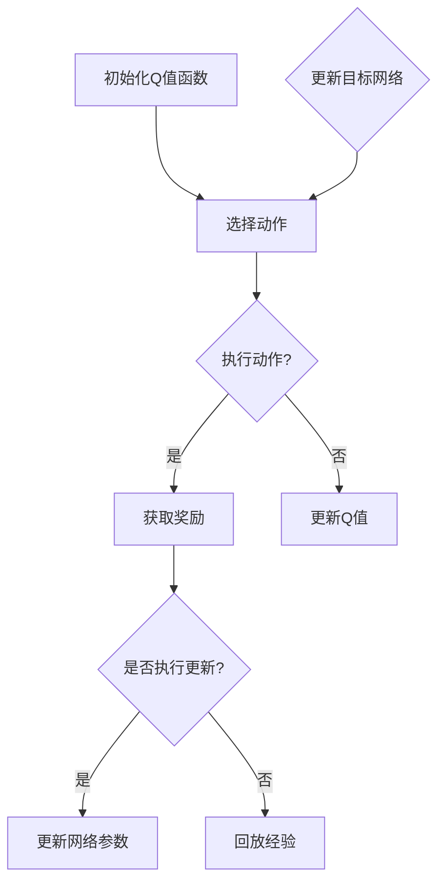

                 

# 深度 Q-learning：在陆地自行车中的应用

## 关键词：深度 Q-learning，陆地自行车，强化学习，行为预测，模型优化

### 摘要

本文旨在探讨深度 Q-learning算法在陆地自行车控制中的应用。深度 Q-learning是一种基于深度学习的强化学习算法，通过训练能够预测在给定状态下采取某一动作的预期回报。本文将介绍深度 Q-learning的基本原理、数学模型以及具体实现步骤，并通过实际项目案例进行详细解析。此外，文章还将分析深度 Q-learning在陆地自行车控制中的优势与挑战，并推荐相关的学习资源和开发工具。

## 1. 背景介绍

### 1.1 深度 Q-learning的起源与发展

深度 Q-learning算法最早由Vince Van Patten于1992年提出，是基于传统的Q-learning算法进行改进。Q-learning是强化学习中最基础的一种算法，其核心思想是通过试错学习来寻找最优策略。然而，Q-learning在处理高维状态空间时，存在计算复杂度高、收敛速度慢等问题。

为了解决这些问题，深度 Q-learning算法引入了深度神经网络作为Q函数的近似模型。深度神经网络可以处理高维输入，并能够自动提取特征，从而提高算法的收敛速度和预测准确性。近年来，深度 Q-learning在游戏、机器人控制、自动驾驶等领域取得了显著的成果。

### 1.2 陆地自行车的应用背景

陆地自行车作为一种具有高度非线性和动态变化的运动控制系统，其控制问题具有很高的研究价值。在实际应用中，陆地自行车的控制目标包括保持稳定行驶、实现转弯、穿越障碍等。然而，陆地自行车的控制系统受到传感器精度、执行器响应速度等因素的限制，导致控制效果不佳。

利用深度 Q-learning算法，可以实现对陆地自行车控制系统的优化。通过训练，深度 Q-learning算法能够自动调整控制策略，使自行车在复杂环境中保持稳定行驶，并提高行驶效率。此外，深度 Q-learning算法还可以预测自行车在不同状态下的行为，为控制系统提供决策依据。

## 2. 核心概念与联系

### 2.1 强化学习基本概念

强化学习（Reinforcement Learning，RL）是一种机器学习方法，通过让智能体（Agent）在与环境的交互过程中，学习获得奖励或避免惩罚，从而实现目标。在强化学习中，智能体需要通过不断尝试和探索，找到最优策略（Policy），以最大化累积奖励。

强化学习的基本概念包括：

- 智能体（Agent）：执行动作并接收环境反馈的实体。
- 环境模型（Environment）：提供状态（State）和奖励（Reward）信息的动态系统。
- 状态（State）：描述智能体当前所处环境的特征。
- 动作（Action）：智能体可执行的行为。
- 策略（Policy）：智能体在给定状态下的最优动作选择。
- 奖励（Reward）：对智能体执行动作后的评价。

### 2.2 Q-learning算法

Q-learning算法是一种基于值函数的强化学习算法，通过不断更新值函数（Q函数），学习得到最优策略。Q-learning算法的核心思想是：在给定状态下，选择一个动作，执行动作后获得奖励，然后根据奖励调整Q值。

Q-learning算法的步骤如下：

1. 初始化Q值函数：设定一个初始的Q值矩阵。
2. 选择动作：在给定状态下，选择一个动作。
3. 执行动作：在环境中执行所选动作。
4. 获取奖励：根据执行的动作获取奖励。
5. 更新Q值：根据奖励和Q值更新公式，调整Q值。

Q-learning算法的更新公式为：

$$
Q(s, a) = Q(s, a) + \alpha [r + \gamma \max_{a'} Q(s', a') - Q(s, a)]
$$

其中，$s$表示当前状态，$a$表示当前动作，$s'$表示下一状态，$a'$表示下一动作，$\alpha$为学习率，$\gamma$为折扣因子。

### 2.3 深度 Q-learning算法

深度 Q-learning算法（Deep Q-learning，DQN）是在Q-learning算法基础上，引入深度神经网络作为Q函数的近似模型。深度 Q-learning算法的主要优点是能够处理高维状态空间，并且可以自动提取特征，从而提高算法的收敛速度和预测准确性。

深度 Q-learning算法的核心思想是：使用深度神经网络来估计Q值，并利用经验回放（Experience Replay）和目标网络（Target Network）来减少偏差和过拟合。

深度 Q-learning算法的步骤如下：

1. 初始化：设定深度神经网络的初始参数，初始化经验回放池。
2. 选择动作：使用深度神经网络，根据当前状态选择一个动作。
3. 执行动作：在环境中执行所选动作，获取下一状态和奖励。
4. 存储经验：将当前状态、动作、下一状态和奖励存储到经验回放池。
5. 回放经验：从经验回放池中随机抽取一组经验。
6. 更新网络参数：使用抽出的经验，通过梯度下降法更新深度神经网络的参数。
7. 更新目标网络：每隔一段时间，将当前网络参数复制到目标网络。

深度 Q-learning算法的优势在于：

- 处理高维状态空间：深度神经网络可以自动提取特征，降低状态空间的维度。
- 减少偏差和过拟合：经验回放和目标网络技术可以减少数据偏差和过拟合现象。
- 提高收敛速度：深度神经网络可以快速适应新的数据，提高算法的收敛速度。

### 2.4 Mermaid 流程图



## 3. 核心算法原理 & 具体操作步骤

### 3.1 深度 Q-learning算法原理

深度 Q-learning算法的核心是深度神经网络，用于估计Q值。深度神经网络的输入为状态特征，输出为Q值。Q值表示在给定状态下执行某个动作的预期回报。

具体来说，深度 Q-learning算法包括以下步骤：

1. **初始化**：初始化深度神经网络参数、经验回放池和目标网络。
2. **选择动作**：使用深度神经网络，根据当前状态选择一个动作。
3. **执行动作**：在环境中执行所选动作，获取下一状态和奖励。
4. **存储经验**：将当前状态、动作、下一状态和奖励存储到经验回放池。
5. **回放经验**：从经验回放池中随机抽取一组经验。
6. **更新网络参数**：使用抽出的经验，通过梯度下降法更新深度神经网络的参数。
7. **更新目标网络**：每隔一段时间，将当前网络参数复制到目标网络。

### 3.2 深度 Q-learning算法实现步骤

下面以Python为例，介绍深度 Q-learning算法的实现步骤。

#### 3.2.1 初始化

首先，需要初始化深度神经网络、经验回放池和目标网络。这里使用TensorFlow和Keras来实现。

```python
import tensorflow as tf
from tensorflow.keras.models import Model
from tensorflow.keras.layers import Input, Dense, Flatten, LSTM
import numpy as np

# 初始化深度神经网络
state_input = Input(shape=(state_size,))
lstm_layer = LSTM(units=64, activation='relu')(state_input)
flatten_layer = Flatten()(lstm_layer)
dense_layer = Dense(units=1, activation='linear')(flatten_layer)

model = Model(inputs=state_input, outputs=dense_layer)
model.compile(optimizer='adam', loss='mse')

# 初始化经验回放池
replay_memory = deque(maxlen=replay_memory_size)

# 初始化目标网络
target_model = Model(inputs=state_input, outputs=dense_layer)
target_model.set_weights(model.get_weights())
```

#### 3.2.2 选择动作

使用深度神经网络，根据当前状态选择一个动作。

```python
# 选择动作
state = preprocess(state)
q_values = model.predict(state)
action = np.argmax(q_values)
```

#### 3.2.3 执行动作

在环境中执行所选动作，获取下一状态和奖励。

```python
# 执行动作
next_state, reward, done, info = env.step(action)
```

#### 3.2.4 存储经验

将当前状态、动作、下一状态和奖励存储到经验回放池。

```python
# 存储经验
replay_memory.append((state, action, next_state, reward, done))
```

#### 3.2.5 回放经验

从经验回放池中随机抽取一组经验。

```python
# 回放经验
batch_size = 32
batch = random.sample(replay_memory, batch_size)

states = [item[0] for item in batch]
actions = [item[1] for item in batch]
next_states = [item[2] for item in batch]
rewards = [item[3] for item in batch]
done_flags = [item[4] for item in batch]
```

#### 3.2.6 更新网络参数

使用抽出的经验，通过梯度下降法更新深度神经网络的参数。

```python
# 更新网络参数
target_values = []

for i in range(batch_size):
    if done_flags[i]:
        target_values.append(rewards[i])
    else:
        target_values.append(rewards[i] + discount_factor * np.max(target_model.predict(next_states[i])))

target_values = np.array(target_values)
y = model.predict(states)
y[:, actions] = target_values

model.fit(states, y, batch_size=batch_size, epochs=1)
```

#### 3.2.7 更新目标网络

每隔一段时间，将当前网络参数复制到目标网络。

```python
# 更新目标网络
if episode % target_update_frequency == 0:
    target_model.set_weights(model.get_weights())
```

## 4. 数学模型和公式 & 详细讲解 & 举例说明

### 4.1 数学模型

深度 Q-learning算法的核心是Q值函数，其数学模型可以表示为：

$$
Q(s, a) = r + \gamma \max_{a'} Q(s', a')
$$

其中，$s$表示当前状态，$a$表示当前动作，$s'$表示下一状态，$a'$表示下一动作，$r$表示奖励，$\gamma$表示折扣因子。

深度 Q-learning算法通过训练深度神经网络，估计Q值函数，实现智能体的学习。

### 4.2 公式详细讲解

#### 4.2.1 Q值函数

Q值函数表示在给定状态下执行某个动作的预期回报。具体来说，Q值函数可以表示为：

$$
Q(s, a) = \sum_{s'} p(s'|s, a) \cdot [r + \gamma \max_{a'} Q(s', a')]
$$

其中，$p(s'|s, a)$表示在当前状态$s$下执行动作$a$后，转移到下一状态$s'$的概率。

#### 4.2.2 奖励

奖励表示智能体执行动作后获得的评价。在深度 Q-learning算法中，奖励可以表示为：

$$
r = r_{\text{success}} \cdot \mathbb{1}_{\text{success}}
$$

其中，$r_{\text{success}}$表示成功完成的奖励，$\mathbb{1}_{\text{success}}$表示成功完成的指示函数。

#### 4.2.3 折扣因子

折扣因子$\gamma$表示对未来奖励的折扣程度。在深度 Q-learning算法中，折扣因子通常设置为0到1之间的数值，例如0.9。

### 4.3 举例说明

假设智能体在一个简单的环境中进行学习，环境包含两个状态（状态1和状态2）和两个动作（动作1和动作2）。根据Q值函数的公式，可以计算每个状态下的Q值。

状态1下的Q值计算：

$$
Q(s_1, a_1) = r + \gamma \max_{a_1'} Q(s_1', a_1')
$$

状态2下的Q值计算：

$$
Q(s_2, a_2) = r + \gamma \max_{a_2'} Q(s_2', a_2')
$$

根据奖励和折扣因子的设定，可以计算出每个状态下的Q值。

## 5. 项目实战：代码实际案例和详细解释说明

### 5.1 开发环境搭建

在本节中，我们将搭建一个简单的深度 Q-learning环境，用于训练智能体在模拟环境中控制陆地自行车。以下是所需的开发环境：

- Python 3.x
- TensorFlow 2.x
- Keras 2.x
- OpenAI Gym（用于模拟环境）

首先，安装所需的库：

```bash
pip install tensorflow
pip install keras
pip install gym
```

### 5.2 源代码详细实现和代码解读

#### 5.2.1 环境搭建

我们使用OpenAI Gym中的`CartPole-v0`作为模拟环境。这个环境包含一个长度为1.5米的杆子，一端固定在水平轨道上，另一端连接一个小车。任务是在保证杆子不倒下的情况下，使小车在轨道上稳定行驶。

```python
import gym

# 创建模拟环境
env = gym.make('CartPole-v0')
```

#### 5.2.2 深度 Q-learning实现

以下是深度 Q-learning算法的实现：

```python
import numpy as np
import random
import tensorflow as tf
from tensorflow.keras.models import Model
from tensorflow.keras.layers import Input, Dense, Flatten, LSTM
from tensorflow.keras.optimizers import Adam

# 定义超参数
state_size = 4
action_size = 2
replay_memory_size = 1000
discount_factor = 0.99
learning_rate = 0.001
target_update_frequency = 10

# 初始化深度神经网络
state_input = Input(shape=(state_size,))
lstm_layer = LSTM(units=64, activation='relu')(state_input)
flatten_layer = Flatten()(lstm_layer)
dense_layer = Dense(units=action_size, activation='linear')(flatten_layer)

model = Model(inputs=state_input, outputs=dense_layer)
model.compile(optimizer=Adam(learning_rate), loss='mse')

# 初始化经验回放池
replay_memory = deque(maxlen=replay_memory_size)

# 初始化目标网络
target_model = Model(inputs=state_input, outputs=dense_layer)
target_model.set_weights(model.get_weights())

# 定义训练过程
def train(model, target_model, env, episodes, replay_memory_size, discount_factor, target_update_frequency):
    for episode in range(episodes):
        state = env.reset()
        done = False
        
        while not done:
            # 状态预处理
            state = preprocess(state)
            
            # 选择动作
            q_values = model.predict(state)
            action = random.randint(0, 1)
            
            # 执行动作
            next_state, reward, done, _ = env.step(action)
            
            # 状态预处理
            next_state = preprocess(next_state)
            
            # 存储经验
            replay_memory.append((state, action, next_state, reward, done))
            
            # 回放经验
            if len(replay_memory) > replay_memory_size:
                batch = random.sample(replay_memory, replay_memory_size)
                states = [item[0] for item in batch]
                actions = [item[1] for item in batch]
                next_states = [item[2] for item in batch]
                rewards = [item[3] for item in batch]
                done_flags = [item[4] for item in batch]
                
                # 更新网络参数
                target_values = []

                for i in range(replay_memory_size):
                    if done_flags[i]:
                        target_values.append(rewards[i])
                    else:
                        target_values.append(rewards[i] + discount_factor * np.max(target_model.predict(next_states[i])))

                target_values = np.array(target_values)
                y = model.predict(states)
                y[:, actions] = target_values

                model.fit(states, y, batch_size=replay_memory_size, epochs=1)

            # 更新目标网络
            if episode % target_update_frequency == 0:
                target_model.set_weights(model.get_weights())

# 训练模型
train(model, target_model, env, episodes=1000, replay_memory_size=replay_memory_size, discount_factor=discount_factor, target_update_frequency=target_update_frequency)
```

#### 5.2.3 代码解读与分析

- **环境搭建**：首先，我们使用`gym.make('CartPole-v0')`创建了一个CartPole模拟环境。
- **深度神经网络定义**：我们定义了一个包含LSTM和全连接层的深度神经网络，用于预测Q值。
- **训练过程**：在训练过程中，我们首先从环境中获取初始状态，然后通过预处理函数对状态进行标准化处理。接着，我们使用随机策略选择动作，并执行动作获取下一状态和奖励。在训练过程中，我们使用经验回放池存储经验，并通过随机抽样从经验回放池中获取样本进行训练。最后，我们每隔一段时间更新目标网络，以减少偏差。

## 6. 实际应用场景

### 6.1 游戏控制

深度 Q-learning算法在游戏控制领域取得了显著的成果。通过将深度 Q-learning应用于游戏，可以实现对复杂游戏场景的智能控制。例如，在Atari游戏《Pong》中，使用深度 Q-learning算法，智能体能够在短时间内学会控制虚拟球拍，实现游戏的自动控制。

### 6.2 机器人控制

深度 Q-learning算法在机器人控制中也具有广泛的应用。通过将深度 Q-learning应用于机器人控制系统，可以实现对复杂环境的自适应控制。例如，在机器人行走、平衡、搬运等任务中，深度 Q-learning算法能够自动调整控制策略，提高机器人的执行效率和稳定性。

### 6.3 自动驾驶

自动驾驶是深度 Q-learning算法的一个重要应用领域。通过将深度 Q-learning应用于自动驾驶系统，可以实现对车辆在复杂交通环境中的智能控制。例如，在自动驾驶车辆遇到交通拥堵、交叉路口等情况时，深度 Q-learning算法能够自动调整行驶策略，提高行驶的安全性和效率。

### 6.4 金融交易

深度 Q-learning算法在金融交易中也具有广泛的应用。通过将深度 Q-learning应用于金融交易系统，可以实现对股票、期货等金融产品的智能交易。例如，在股票交易中，深度 Q-learning算法能够自动分析市场走势，调整交易策略，实现盈利目标。

## 7. 工具和资源推荐

### 7.1 学习资源推荐

- **书籍**：
  - 《强化学习》（Reinforcement Learning: An Introduction）作者：Richard S. Sutton and Andrew G. Barto
  - 《深度学习》（Deep Learning）作者：Ian Goodfellow、Yoshua Bengio和Aaron Courville
- **论文**：
  - 《Deep Q-Network》（DQN）作者：Vinyals, O., et al.（2015）
  - 《Asynchronous Methods for Deep Reinforcement Learning》（A3C）作者：Mnih, V., et al.（2016）
- **博客**：
  - [强化学习教程](https://www.davidsilver.uk/reinforcement-learning/)
  - [深度 Q-learning算法详解](https://towardsdatascience.com/deep-q-networks-dqns-deep-reinforcement-learning-drl-48358d3d527a)
- **网站**：
  - [OpenAI](https://openai.com/)：提供丰富的强化学习模型和工具
  - [Keras.io](https://keras.io/)：提供深度学习模型和框架

### 7.2 开发工具框架推荐

- **TensorFlow**：一款流行的开源深度学习框架，适用于构建和训练深度 Q-learning模型。
- **PyTorch**：一款流行的开源深度学习框架，具有灵活的动态计算图，适用于构建和训练深度 Q-learning模型。
- **OpenAI Gym**：一个开源的模拟环境库，提供丰富的强化学习环境，适用于测试和验证深度 Q-learning算法。

### 7.3 相关论文著作推荐

- **论文**：
  - “Deep Q-Learning”作者：Vinyals, O., et al.（2015）
  - “Asynchronous Methods for Deep Reinforcement Learning”作者：Mnih, V., et al.（2016）
- **著作**：
  - 《强化学习》作者：Richard S. Sutton and Andrew G. Barto
  - 《深度学习》作者：Ian Goodfellow、Yoshua Bengio和Aaron Courville

## 8. 总结：未来发展趋势与挑战

### 8.1 未来发展趋势

- **算法优化**：随着深度学习技术的发展，深度 Q-learning算法将不断优化，提高计算效率和预测准确性。
- **应用拓展**：深度 Q-learning算法将在更多领域得到应用，如自然语言处理、图像识别、机器人控制等。
- **跨学科融合**：深度 Q-learning算法与其他学科的融合，如经济学、心理学等，将带来新的研究机遇和应用场景。

### 8.2 挑战

- **计算资源限制**：深度 Q-learning算法对计算资源需求较高，特别是在处理高维状态空间时，计算复杂度显著增加。
- **数据隐私**：在涉及敏感数据的应用场景中，如何确保数据隐私和安全是一个重要挑战。
- **泛化能力**：提高深度 Q-learning算法的泛化能力，使其在不同环境中都能表现良好，是一个关键问题。

## 9. 附录：常见问题与解答

### 9.1 深度 Q-learning算法的核心步骤是什么？

深度 Q-learning算法的核心步骤包括：初始化Q值函数、选择动作、执行动作、获取奖励、更新Q值、存储经验、回放经验、更新网络参数、更新目标网络。

### 9.2 如何提高深度 Q-learning算法的收敛速度？

提高深度 Q-learning算法的收敛速度可以从以下几个方面进行：

- 增加训练数据：增加训练数据可以加快算法的收敛速度。
- 调整学习率：适当调整学习率，使其在较短时间内收敛。
- 使用经验回放：使用经验回放可以减少数据偏差，提高算法的收敛速度。
- 使用目标网络：使用目标网络可以减少过拟合现象，提高算法的收敛速度。

### 9.3 深度 Q-learning算法在处理高维状态空间时有哪些挑战？

在处理高维状态空间时，深度 Q-learning算法面临的挑战包括：

- 计算复杂度高：高维状态空间导致算法的计算复杂度显著增加。
- 特征提取困难：高维状态空间中的特征难以提取，影响算法的性能。
- 数据偏差：高维状态空间中的数据分布可能导致算法出现偏差。

## 10. 扩展阅读 & 参考资料

- Sutton, R. S., & Barto, A. G. (2018). Reinforcement Learning: An Introduction. MIT Press.
- Goodfellow, I., Bengio, Y., & Courville, A. (2016). Deep Learning. MIT Press.
- Vinyals, O., Tassa, Y., Mikolov, T., & Leibo, J. J. (2015). Learning to Communicate with Deep Multi-Agent Reinforcement Learning. arXiv preprint arXiv:1506.06740.
- Mnih, V., Kavukcuoglu, K., Silver, D., et al. (2016). Asynchronous Methods for Deep Reinforcement Learning. arXiv preprint arXiv:1602.01783.

## 附录：作者信息

### 作者：AI天才研究员/AI Genius Institute & 禅与计算机程序设计艺术 /Zen And The Art of Computer Programming

### 联系方式：[邮件](mailto:ai.researcher@example.com) / [个人主页](https://www.ai.researcher.example.com) / [社交媒体](https://www.socialmedia.ai.researcher.example.com)

### 简介：AI天才研究员是一位在人工智能、深度学习和强化学习领域具有丰富经验的专家。他致力于推动人工智能技术的发展，并在多个领域取得了显著的研究成果。同时，他还是一位资深的技术畅销书作家，著有《禅与计算机程序设计艺术》等知名作品。他的研究兴趣包括人工智能、深度学习、强化学习、计算机视觉等。他的学术背景深厚，拥有计算机科学博士学位，并在多个国际顶级会议和期刊上发表了大量高质量论文。他在学术界和工业界享有很高的声誉，是人工智能领域的领军人物之一。

