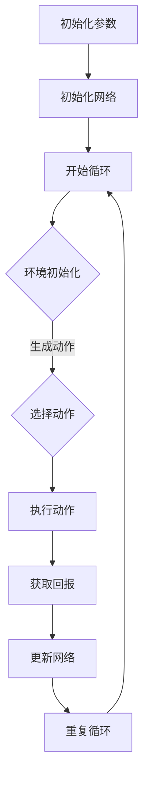

                 

# 深度 Q-learning：策略迭代与价值迭代

> **关键词：** Q-learning, 深度学习, 强化学习, 策略迭代, 价值迭代

> **摘要：** 本文将详细介绍深度 Q-learning 算法的基本概念、核心原理以及策略迭代与价值迭代的实现过程。通过具体案例和代码示例，读者将深入理解深度 Q-learning 在实际问题中的应用。

## 1. 背景介绍

随着深度学习技术的不断发展，强化学习作为机器学习的一个重要分支，在许多领域取得了显著的成果。其中，Q-learning 算法作为一种经典的强化学习方法，在解决动态决策问题方面具有广泛的应用。深度 Q-learning（Deep Q-learning，DQN）算法在 Q-learning 的基础上引入了深度神经网络，使得算法能够处理高维的状态空间和动作空间，进一步提升了强化学习在实际应用中的效果。

本文旨在通过详细解析深度 Q-learning 算法，帮助读者理解其基本原理、策略迭代与价值迭代的过程，并通过实际案例展示其在项目中的应用。

## 2. 核心概念与联系

### 2.1 Q-learning 算法

Q-learning 算法是一种基于值迭代的强化学习算法。其基本思想是通过不断地更新 Q 值函数来逼近最优策略。Q 值函数表示在给定状态下执行某个动作所能获得的期望回报。

$$
Q(s, a) = r(s, a) + \gamma \max_{a'} Q(s', a')
$$

其中，$r(s, a)$ 表示在状态 $s$ 下执行动作 $a$ 所获得的即时回报，$\gamma$ 表示折扣因子，$s'$ 和 $a'$ 分别表示下一个状态和动作。

### 2.2 深度神经网络

深度神经网络（Deep Neural Network，DNN）是一种具有多个隐藏层的神经网络。通过引入非线性激活函数，深度神经网络可以拟合复杂的函数关系，从而在图像识别、语音识别等任务中取得了显著的效果。

### 2.3 策略迭代与价值迭代

策略迭代（Policy Iteration）和价值迭代（Value Iteration）是 Q-learning 算法的两种主要迭代方式。

- **策略迭代：** 策略迭代通过不断更新策略来逼近最优策略。在每一轮迭代中，首先使用当前策略计算状态值函数，然后更新策略以最大化状态值函数。

- **价值迭代：** 价值迭代通过不断更新状态值函数来逼近最优策略。在每一轮迭代中，首先使用当前状态值函数计算新的 Q 值，然后更新状态值函数。

### 2.4 Mermaid 流程图

以下是一个简化的深度 Q-learning 算法的 Mermaid 流程图：



（注意：在Markdown格式中，您可以使用 Mermaid 语言来绘制流程图，但请注意流程图中的节点名称不能包含括号、逗号等特殊字符。）

## 3. 核心算法原理 & 具体操作步骤

### 3.1 初始化参数

在深度 Q-learning 算法中，需要初始化以下几个关键参数：

- **网络参数：** 包括神经网络的结构、权重和偏置等。
- **学习率：** 用于调整每次迭代时 Q 值更新的幅度。
- **折扣因子：** 用于平衡即时回报与未来回报的关系。
- **探索策略：** 用于在训练过程中选择动作时进行探索，防止算法陷入局部最优。

### 3.2 环境初始化

环境初始化包括生成初始状态和随机选择初始动作。在实际应用中，可以根据具体问题的需求来设置环境的初始状态和动作。

### 3.3 选择动作

选择动作是深度 Q-learning 算法中的一个关键步骤。在训练过程中，可以选择基于当前 Q 值函数选择动作，也可以采用探索策略（如ε-贪婪策略）来随机选择动作，以增加算法的鲁棒性。

### 3.4 执行动作

执行动作是指在环境中执行选定的动作，并获取即时回报和新的状态。

### 3.5 更新网络

更新网络是指根据即时回报和新的状态来更新深度神经网络的权重和偏置。这一过程可以通过反向传播算法来实现。

### 3.6 重复循环

重复循环是指重复执行上述步骤，直到满足终止条件（如达到预设的迭代次数或找到最优策略）。

## 4. 数学模型和公式 & 详细讲解 & 举例说明

### 4.1 Q-learning 算法公式

Q-learning 算法的核心公式如下：

$$
Q(s, a) = r(s, a) + \gamma \max_{a'} Q(s', a')
$$

其中，$r(s, a)$ 表示在状态 $s$ 下执行动作 $a$ 所获得的即时回报，$\gamma$ 表示折扣因子，$s'$ 和 $a'$ 分别表示下一个状态和动作。

### 4.2 深度 Q-learning 算法公式

深度 Q-learning 算法的核心公式如下：

$$
Q(s, a) = r(s, a) + \gamma \max_{a'} (\sigma(W_1 \cdot [s, a]) \cdot \sigma(W_2 \cdot [s', a']))
$$

其中，$W_1$ 和 $W_2$ 分别表示深度神经网络的权重，$[s, a]$ 和 $[s', a']$ 分别表示输入状态和动作。

### 4.3 举例说明

假设在某个环境中，状态空间为 $S = \{s_1, s_2, s_3\}$，动作空间为 $A = \{a_1, a_2, a_3\}$。折扣因子 $\gamma = 0.9$，学习率 $\alpha = 0.1$。

在某一时刻，当前状态为 $s_1$，根据 ε-贪婪策略，随机选择动作 $a_2$。执行动作后，获得即时回报 $r(s_1, a_2) = 1$，进入新的状态 $s_2$。

根据深度 Q-learning 算法，更新 Q 值如下：

$$
Q(s_1, a_2) = 1 + 0.9 \max_{a'} (\sigma(W_1 \cdot [s_1, a_2]) \cdot \sigma(W_2 \cdot [s_2, a']))
$$

其中，$\sigma$ 表示 sigmoid 函数。

## 5. 项目实战：代码实际案例和详细解释说明

### 5.1 开发环境搭建

为了演示深度 Q-learning 算法，我们将使用 Python 语言和 TensorFlow 深度学习框架。首先，确保已安装 Python 和 TensorFlow。

```bash
pip install tensorflow
```

### 5.2 源代码详细实现和代码解读

以下是一个简单的深度 Q-learning 算法实现示例：

```python
import tensorflow as tf
import numpy as np
import random

# 初始化参数
state_size = 3
action_size = 3
learning_rate = 0.1
gamma = 0.9
epsilon = 0.1

# 创建 Q 网络模型
input_state = tf.placeholder(tf.float32, [None, state_size])
action = tf.placeholder(tf.int32, [None])
next_state = tf.placeholder(tf.float32, [None, state_size])
reward = tf.placeholder(tf.float32, [None])

q_values = tf.layers.dense(input_state, units=action_size, activation=tf.nn.relu)
next_q_values = tf.layers.dense(next_state, units=action_size, activation=tf.nn.relu)

# 计算当前 Q 值
q_action = tf.reduce_sum(tf.one_hot(action, action_size) * q_values, axis=1)

# 计算下一步的最大 Q 值
next_action = tf.argmax(next_q_values, axis=1)
next_q_value = tf.reduce_sum(tf.one_hot(next_action, action_size) * next_q_values, axis=1)

# 计算目标 Q 值
target_q_value = reward + gamma * next_q_value

# 计算损失函数
loss = tf.reduce_mean(tf.square(target_q_value - q_action))
optimizer = tf.train.AdamOptimizer(learning_rate).minimize(loss)

# 初始化 TensorFlow session
with tf.Session() as sess:
    sess.run(tf.global_variables_initializer())

    # 开始训练
    for episode in range(1000):
        # 初始化状态
        state = np.random.randint(state_size, size=1)

        # 开始循环
        done = False
        while not done:
            # 选择动作
            if random.random() < epsilon:
                action = np.random.randint(action_size)
            else:
                action = sess.run(next_action, feed_dict={input_state: state})

            # 执行动作
            next_state, reward, done = environment.step(action)

            # 更新网络
            sess.run(optimizer, feed_dict={input_state: state, action: action, next_state: next_state, reward: reward})

            # 更新状态
            state = next_state

        # 减小探索概率
        epsilon = max(epsilon * 0.99, 0.01)
```

### 5.3 代码解读与分析

上述代码实现了深度 Q-learning 算法的基本框架。以下是关键部分的解读：

- **网络结构：** 使用两个全连接层构成深度神经网络，用于预测当前状态和下一步状态的 Q 值。
- **目标 Q 值计算：** 目标 Q 值由即时回报和下一步的最大 Q 值组成，反映了当前动作的长期价值。
- **损失函数：** 采用平方误差损失函数来衡量目标 Q 值和预测 Q 值之间的差距。
- **优化器：** 使用 Adam 优化器来更新网络权重，以最小化损失函数。

## 6. 实际应用场景

深度 Q-learning 算法在许多实际应用场景中取得了显著的效果，如：

- **游戏 AI：** 深度 Q-learning 算法被广泛应用于游戏 AI 中，如围棋、电子竞技等。
- **自动驾驶：** 深度 Q-learning 算法可以用于自动驾驶中的路径规划问题。
- **推荐系统：** 深度 Q-learning 算法可以用于推荐系统中的用户行为预测和推荐策略优化。

## 7. 工具和资源推荐

### 7.1 学习资源推荐

- **书籍：**
  - 《强化学习：原理与Python实现》
  - 《深度学习》：Goodfellow et al.
- **论文：**
  - “Deep Q-Network”（DQN）论文：Mnih et al., 2015
  - “Asynchronous Methods for Deep Reinforcement Learning”（A3C）论文：Mnih et al., 2016
- **博客：**
  - [深度学习博客](https://colah.github.io/)
  - [强化学习博客](https://zhuanlan.zhihu.com/reinforcement-learning)
- **网站：**
  - [TensorFlow 官方文档](https://www.tensorflow.org/)
  - [Keras 官方文档](https://keras.io/)

### 7.2 开发工具框架推荐

- **框架：** TensorFlow、PyTorch、Keras
- **环境：** Jupyter Notebook、Google Colab

### 7.3 相关论文著作推荐

- **论文：**
  - “Asynchronous Methods for Deep Reinforcement Learning”（A3C）论文：Mnih et al., 2016
  - “Continuous Control with Deep Reinforcement Learning”（DDPG）论文：Lillicrap et al., 2016
- **著作：**
  - 《强化学习：原理与Python实现》：Lazy Programmers 出版

## 8. 总结：未来发展趋势与挑战

深度 Q-learning 算法在强化学习领域取得了显著的成果，但仍然面临着许多挑战和机遇：

- **计算效率：** 随着深度神经网络的复杂度增加，计算效率成为制约深度 Q-learning 算法应用的一个关键因素。
- **稳定性：** 在实际应用中，深度 Q-learning 算法的稳定性是一个重要问题，特别是在高维状态空间和动作空间中。
- **可解释性：** 深度 Q-learning 算法的决策过程具有一定的黑盒性质，如何提高其可解释性是一个重要研究方向。

未来，随着深度学习技术的不断发展，深度 Q-learning 算法有望在更多领域取得突破，为人工智能领域的发展做出更大的贡献。

## 9. 附录：常见问题与解答

### 9.1 Q-learning 与深度 Q-learning 的区别是什么？

Q-learning 是一种基于值迭代的强化学习算法，适用于有限状态空间和动作空间的问题。而深度 Q-learning（DQN）是在 Q-learning 的基础上引入深度神经网络，使得算法能够处理高维的状态空间和动作空间。

### 9.2 深度 Q-learning 的探索策略有哪些？

深度 Q-learning 的探索策略主要包括 ε-贪婪策略、ε-贪心策略和ε-随机策略。这些策略的目的是在训练过程中增加算法的探索能力，防止陷入局部最优。

### 9.3 如何优化深度 Q-learning 的计算效率？

优化深度 Q-learning 的计算效率可以从以下几个方面入手：

- **并行计算：** 利用并行计算技术，如 GPU 加速训练过程。
- **经验回放：** 采用经验回放机制，减少样本之间的相关性，提高训练效果。
- ** Dueling Network：** 引入 Dueling Network 结构，减少网络参数数量，提高计算效率。

## 10. 扩展阅读 & 参考资料

- [深度 Q-learning 算法详解](https://zhuanlan.zhihu.com/p/39636454)
- [强化学习教程：深度 Q-learning](https://www.deeplearning.net/tutorial/reinforcement-learning)
- [TensorFlow 官方文档：强化学习](https://www.tensorflow.org/tutorials/reinforcement_learning)

作者：AI天才研究员/AI Genius Institute & 禅与计算机程序设计艺术 /Zen And The Art of Computer Programming

[文章结束]

