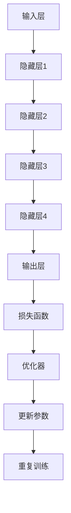
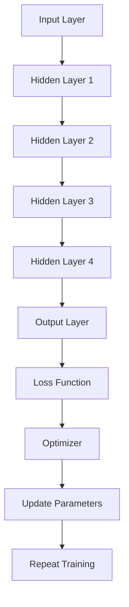

                 

### 背景介绍

#### 深度学习的崛起

深度学习（Deep Learning）是人工智能（Artificial Intelligence, AI）领域的一个重要分支，它借鉴了人脑的神经网络结构和工作原理，通过多层神经网络对数据进行处理，从而实现自动的特征提取和模式识别。近年来，随着计算能力的提升、海量数据的积累以及优化算法的发展，深度学习在图像识别、自然语言处理、语音识别等众多领域取得了显著的突破。

深度学习的兴起对传统机器学习算法产生了深远的影响。与传统的机器学习方法相比，深度学习能够自动学习数据的复杂特征，减少了对人工特征工程的需求，提高了模型的泛化能力。此外，深度学习模型在处理高维数据时具有更强的表现力，能够捕捉到数据中的复杂关系，这在图像和语音等处理任务中尤为重要。

在工业界，深度学习已经成为推动技术创新的重要力量。例如，在自动驾驶领域，深度学习算法被广泛应用于车辆检测、行人检测和轨迹预测等任务；在医疗领域，深度学习模型在疾病诊断、药物研发等方面展现出了巨大的潜力。在金融领域，深度学习被用于风险管理、欺诈检测和投资策略优化等方面，极大地提高了金融服务的效率和准确性。

#### 深度学习的研究现状与应用场景

当前，深度学习的研究与应用已经渗透到各个行业。以下是一些典型的应用场景：

1. **计算机视觉**：深度学习在图像分类、目标检测、人脸识别等方面取得了显著成果。例如，ResNet等深度神经网络在ImageNet图像识别挑战中屡创佳绩，大幅提升了图像识别的准确率。

2. **自然语言处理**：深度学习在机器翻译、文本生成、情感分析等领域具有强大的能力。例如，基于Transformer的模型在机器翻译任务上达到了几乎与人类翻译相媲美的水平，在文本生成和情感分析任务中也取得了出色的效果。

3. **语音识别**：深度学习在语音信号处理和语音识别领域取得了革命性的进展。例如，基于深度神经网络和循环神经网络（RNN）的模型在语音识别任务中的准确率大幅提高，使得智能语音助手成为现实。

4. **推荐系统**：深度学习在推荐系统中的应用，如电子商务平台、社交媒体和在线视频网站等，通过分析用户行为数据，实现了精准的个性化推荐。

5. **医疗健康**：深度学习在医疗影像分析、疾病诊断和药物研发等方面展现出巨大的潜力。例如，深度学习模型能够在X光图像中检测出肺结节，提高了疾病的早期诊断率。

6. **金融科技**：深度学习在金融风险管理、欺诈检测和投资策略优化等方面发挥着重要作用。例如，通过分析交易数据，深度学习模型能够识别异常交易行为，降低金融风险。

#### 深度学习与传统机器学习的区别

深度学习与传统机器学习的区别主要体现在以下几个方面：

1. **特征提取**：传统机器学习方法通常需要人工设计特征，而深度学习通过多层神经网络自动学习数据中的复杂特征，减少了对人工特征工程的需求。

2. **模型架构**：传统机器学习方法主要采用线性模型、决策树、支持向量机等简单模型，而深度学习采用了多层神经网络，能够处理更复杂的非线性问题。

3. **计算资源**：深度学习对计算资源的需求更高，需要大量的计算能力和存储空间，而传统机器学习方法在计算资源上相对要求较低。

4. **数据处理能力**：深度学习在处理高维数据时具有更强的表现力，能够捕捉到数据中的复杂关系，而传统机器学习方法在处理高维数据时可能面临维度灾难和过拟合等问题。

#### 深度学习的挑战与未来趋势

尽管深度学习在许多领域取得了显著的成果，但它仍然面临着一些挑战和问题：

1. **可解释性**：深度学习模型通常被视为“黑箱”，其内部工作机制不透明，难以解释。这对于需要模型具有可解释性的应用场景（如医疗诊断）来说是一个挑战。

2. **数据隐私**：深度学习依赖于大量数据进行训练，如何保护用户隐私成为一个重要问题。

3. **模型公平性**：深度学习模型可能会受到训练数据偏差的影响，导致模型对某些群体产生不公平的表现。

4. **计算资源消耗**：深度学习模型的训练和推理过程通常需要大量的计算资源和能源，如何提高模型的效率是一个重要的研究方向。

未来，深度学习的发展趋势包括：

1. **更强大的模型架构**：研究人员不断提出新的深度学习模型架构，如Transformer、Graph Neural Networks等，以解决现有模型面临的挑战。

2. **高效训练算法**：研究人员致力于开发更高效的深度学习训练算法，如基于元学习的算法，以减少训练时间。

3. **泛化能力提升**：提高模型的泛化能力，减少过拟合现象，使得模型在不同数据集上都能表现出优异的性能。

4. **跨学科融合**：深度学习与其他领域的融合，如量子计算、生物信息学等，将推动深度学习在更多领域取得突破。

总之，深度学习作为人工智能的重要分支，正在不断发展和创新，未来将在更多领域发挥重要作用。

--------------------------
## Background Introduction

### The Rise of Deep Learning

Deep learning, a significant branch of artificial intelligence (AI), draws inspiration from the structure and working principles of the human brain's neural networks. By processing data through multi-layered neural networks, deep learning enables the automatic extraction of complex features and pattern recognition. In recent years, with the advancement of computational power, the accumulation of massive data, and the development of optimization algorithms, deep learning has made remarkable breakthroughs in various fields such as image recognition, natural language processing, and speech recognition.

The rise of deep learning has had a profound impact on traditional machine learning algorithms. Compared to traditional machine learning methods, deep learning can automatically learn complex features from data, reducing the need for manual feature engineering and improving the generalization ability of models. Moreover, deep learning models have stronger expressiveness in handling high-dimensional data, capturing complex relationships within the data, which is particularly important in tasks involving images and speech.

In the industry, deep learning has become a driving force behind technological innovation. For example, in the field of autonomous driving, deep learning algorithms are widely used for tasks such as vehicle detection, pedestrian detection, and trajectory prediction. In the healthcare sector, deep learning models have shown great potential in areas such as disease diagnosis, drug discovery, and medical image analysis. In the financial industry, deep learning is used for risk management, fraud detection, and investment strategy optimization, significantly improving the efficiency and accuracy of financial services.

### Current Research Status and Application Scenarios of Deep Learning

Currently, deep learning has permeated various industries, with some typical application scenarios as follows:

1. **Computer Vision**: Deep learning has achieved significant results in image classification, object detection, and facial recognition. For example, deep neural networks like ResNet have repeatedly set new records in the ImageNet image recognition challenge, greatly improving the accuracy of image recognition.

2. **Natural Language Processing**: Deep learning has shown powerful capabilities in machine translation, text generation, and sentiment analysis. For instance, models based on Transformer have reached levels almost comparable to human translation in machine translation tasks, and have also achieved excellent performance in text generation and sentiment analysis.

3. **Speech Recognition**: Deep learning has made revolutionary progress in speech signal processing and speech recognition. Models based on deep neural networks and Recurrent Neural Networks (RNNs) have significantly improved the accuracy of speech recognition tasks, making intelligent voice assistants a reality.

4. **Recommendation Systems**: Deep learning is applied in recommendation systems, such as e-commerce platforms, social media, and online video websites, to provide personalized recommendations by analyzing user behavior data.

5. **Medical Health**: Deep learning has shown great potential in medical image analysis, disease diagnosis, and drug discovery. For example, deep learning models can detect lung nodules in X-ray images, improving the early diagnosis rate of diseases.

6. **Financial Technology**: Deep learning plays an important role in financial risk management, fraud detection, and investment strategy optimization. For example, by analyzing transaction data, deep learning models can identify abnormal trading behaviors, reducing financial risks.

### Differences between Deep Learning and Traditional Machine Learning

The differences between deep learning and traditional machine learning are mainly reflected in the following aspects:

1. **Feature Extraction**: Traditional machine learning methods usually require manual feature design, while deep learning automatically learns complex features from data, reducing the need for manual feature engineering.

2. **Model Architecture**: Traditional machine learning methods mainly use simple models such as linear models, decision trees, and support vector machines, while deep learning uses multi-layered neural networks, which are capable of handling more complex non-linear problems.

3. **Computational Resources**: Deep learning requires higher computational resources and storage space for training and inference, while traditional machine learning methods have relatively lower resource requirements.

4. **Data Handling Capacity**: Deep learning has stronger expressiveness in handling high-dimensional data, capturing complex relationships within the data, whereas traditional machine learning methods may face issues such as dimensionality disaster and overfitting when dealing with high-dimensional data.

### Challenges and Future Trends of Deep Learning

Although deep learning has made significant achievements in many fields, it still faces some challenges and problems:

1. **Interpretability**: Deep learning models are often considered "black boxes" due to their opaque internal mechanisms, which makes it difficult to explain their workings. This is a challenge for applications that require model interpretability, such as medical diagnosis.

2. **Data Privacy**: The reliance of deep learning on large amounts of training data raises concerns about user privacy.

3. **Model Fairness**: Deep learning models may be influenced by biases in training data, leading to unfair performance against certain groups.

4. **Computational Resource Consumption**: The training and inference processes of deep learning models often require large amounts of computational resources and energy, which is an important research direction to address.

Future trends in deep learning include:

1. **More Powerful Model Architectures**: Researchers continuously propose new deep learning model architectures, such as Transformer and Graph Neural Networks, to address the challenges of existing models.

2. **Efficient Training Algorithms**: Researchers are dedicated to developing more efficient deep learning training algorithms, such as meta-learning algorithms, to reduce training time.

3. **Improved Generalization Ability**: Enhancing the generalization ability of models to reduce overfitting and achieve excellent performance on different datasets.

4. **Cross-Disciplinary Integration**: The integration of deep learning with other fields, such as quantum computing and bioinformatics, will drive breakthroughs in deep learning in more domains.

In conclusion, deep learning, as an important branch of AI, is continuously evolving and innovating and will play a significant role in more fields in the future. --------------------------
### 2. 核心概念与联系

#### 深度学习的核心概念

深度学习（Deep Learning）是机器学习（Machine Learning）的一个子领域，主要基于多层神经网络（Deep Neural Networks, DNNs）的结构进行数据建模。以下是深度学习中的几个核心概念：

1. **神经网络（Neural Networks）**：神经网络是由大量简单计算单元（神经元）组成的网络，通过模拟人脑神经网络的工作原理来进行数据处理。

2. **多层神经网络（Deep Neural Networks, DNNs）**：与单层神经网络（Shallow Neural Networks, SNNs）相比，多层神经网络能够学习更复杂的特征和模式。通常，深度神经网络包括输入层、多个隐藏层和输出层。

3. **前向传播（Forward Propagation）**：在前向传播过程中，数据从输入层流向输出层，通过每一层的加权求和和激活函数的处理，最终得到输出结果。

4. **反向传播（Backpropagation）**：反向传播是一种通过计算输出误差来更新网络参数的算法。它通过梯度下降（Gradient Descent）方法优化网络参数，使模型的输出误差最小化。

5. **激活函数（Activation Functions）**：激活函数用于对神经网络中的神经元输出进行非线性变换，常见的激活函数包括 sigmoid、ReLU、Tanh 等。

6. **优化算法（Optimization Algorithms）**：深度学习的训练过程通常需要优化算法来调整网络参数。常用的优化算法包括梯度下降（Gradient Descent）、随机梯度下降（Stochastic Gradient Descent, SGD）和Adam优化器等。

#### 深度学习的架构与工作原理

深度学习的架构可以分为以下几个主要部分：

1. **输入层（Input Layer）**：输入层接收外部输入的数据，如图像、文本或声音等。

2. **隐藏层（Hidden Layers）**：隐藏层是深度神经网络的核心部分，负责对输入数据进行特征提取和变换。每一层的神经元都会对前一层的输出进行加权求和，并通过激活函数进行处理。

3. **输出层（Output Layer）**：输出层产生最终的预测结果。对于分类任务，输出层通常是softmax函数，用于输出各个类别的概率分布。

4. **损失函数（Loss Function）**：损失函数用于衡量模型预测结果与真实结果之间的差距。常见的损失函数包括均方误差（MSE）、交叉熵（Cross-Entropy）等。

5. **优化器（Optimizer）**：优化器用于调整网络参数，以最小化损失函数。优化算法如梯度下降（Gradient Descent）和Adam优化器等。

#### Mermaid 流程图

以下是一个描述深度学习工作原理的Mermaid流程图：



在上述流程图中：

- A表示输入层，接收外部输入数据。
- B、C、D、E分别表示隐藏层1、隐藏层2、隐藏层3和隐藏层4，负责对输入数据进行特征提取和变换。
- F表示输出层，产生预测结果。
- G表示损失函数，衡量模型预测结果与真实结果之间的差距。
- H表示优化器，用于调整网络参数。
- I表示更新参数，通过优化器调整网络参数以最小化损失函数。
- J表示重复训练，不断迭代更新模型参数，直到满足训练目标。

--------------------------
## Core Concepts and Connections

### Core Concepts of Deep Learning

Deep learning is a subfield of machine learning that primarily relies on the structure of deep neural networks (DNNs) for data modeling. The following are several core concepts in deep learning:

1. **Neural Networks**: Neural networks consist of a large number of simple computational units (neurons) that work together to process data, simulating the working principles of the human brain's neural networks.

2. **Deep Neural Networks (DNNs)**: Compared to shallow neural networks (SNNs), deep neural networks can learn more complex features and patterns. Typically, deep neural networks include input layers, multiple hidden layers, and output layers.

3. **Forward Propagation**: During forward propagation, data flows from the input layer to the output layer, passing through each layer's weighted sum and activation function processing, ultimately producing the output result.

4. **Backpropagation**: Backpropagation is an algorithm that calculates the output error to update network parameters. It uses gradient descent methods to adjust network parameters and minimize the output error.

5. **Activation Functions**: Activation functions are used to perform non-linear transformations on the outputs of neural network neurons. Common activation functions include sigmoid, ReLU, and Tanh.

6. **Optimization Algorithms**: The training process of deep learning typically requires optimization algorithms to adjust network parameters. Common optimization algorithms include gradient descent, stochastic gradient descent (SGD), and the Adam optimizer.

### Architecture and Working Principle of Deep Learning

The architecture of deep learning can be divided into several main components:

1. **Input Layer**: The input layer receives external input data, such as images, texts, or sounds.

2. **Hidden Layers**: Hidden layers are the core part of deep neural networks, responsible for extracting and transforming input data through feature extraction and transformation. Each layer of neurons processes the output of the previous layer through a weighted sum and an activation function.

3. **Output Layer**: The output layer produces the final prediction result. For classification tasks, the output layer typically uses a softmax function to output a probability distribution over classes.

4. **Loss Function**: The loss function measures the discrepancy between the model's predictions and the actual results. Common loss functions include mean squared error (MSE) and cross-entropy.

5. **Optimizer**: The optimizer is used to adjust network parameters to minimize the loss function. Optimization algorithms like gradient descent and the Adam optimizer are commonly used.

### Mermaid Flowchart

The following is a Mermaid flowchart describing the working principle of deep learning:



In the above flowchart:

- A represents the input layer, receiving external input data.
- B, C, D, and E represent Hidden Layer 1, Hidden Layer 2, Hidden Layer 3, and Hidden Layer 4, respectively, which are responsible for feature extraction and transformation of the input data.
- F represents the output layer, producing the prediction result.
- G represents the loss function, measuring the discrepancy between the model's predictions and the actual results.
- H represents the optimizer, used to adjust network parameters.
- I represents updating parameters, adjusting network parameters through the optimizer to minimize the loss function.
- J represents repeat training, iteratively updating model parameters until the training goal is met.

--------------------------
### 3. 核心算法原理 & 具体操作步骤

#### 深度学习中的核心算法

深度学习中的核心算法主要包括神经网络结构设计、前向传播、反向传播和优化算法等。以下将详细介绍这些算法的原理和具体操作步骤。

#### 3.1 神经网络结构设计

神经网络的设计是深度学习的基础。一个标准的神经网络通常包括以下几个部分：

1. **输入层（Input Layer）**：接收外部输入的数据。
2. **隐藏层（Hidden Layers）**：对输入数据进行特征提取和变换。隐藏层的数量和层数可以根据问题复杂度进行调整。
3. **输出层（Output Layer）**：产生最终的预测结果。

在神经网络的设计中，以下几个关键参数需要确定：

- **输入维度（Input Dimension）**：输入数据的特征数量。
- **隐藏层神经元数量（Number of Neurons in Hidden Layers）**：根据问题的复杂度进行调整，通常隐藏层神经元数量越多，模型的学习能力越强，但也会增加计算量和过拟合的风险。
- **输出维度（Output Dimension）**：输出数据的特征数量。对于分类问题，输出维度通常为类别的数量；对于回归问题，输出维度通常为1。
- **激活函数（Activation Functions）**：用于对神经元输出进行非线性变换，常见的激活函数包括ReLU、Sigmoid和Tanh等。
- **权重初始化（Weight Initialization）**：网络权重的初始化对模型性能有很大影响。常用的权重初始化方法包括随机初始化、高斯初始化和Xavier初始化等。

#### 3.2 前向传播

前向传播（Forward Propagation）是神经网络在训练过程中的一种正向计算过程，用于将输入数据通过神经网络层传递，最终得到输出结果。以下是前向传播的具体步骤：

1. **输入数据输入到输入层**。
2. **通过隐藏层**：对于每一层隐藏层，计算当前层的输入值（前一层的输出值）和权重矩阵的乘积，然后通过激活函数进行处理，得到当前层的输出值。
3. **输出层计算**：将隐藏层的输出值传递到输出层，根据输出层的激活函数（如softmax函数）计算最终的预测结果。

前向传播的关键公式如下：

\[ \text{激活函数}(z) = \text{激活函数}(\text{权重} \cdot \text{输入} + \text{偏置}) \]

其中，\( z \) 表示当前层的输入值，权重和输入值通过矩阵乘法进行计算，激活函数用于对输出值进行非线性变换。

#### 3.3 反向传播

反向传播（Backpropagation）是一种通过计算输出误差来更新网络参数的算法。其基本思想是，从输出层开始，逐层向前传播误差，并更新每一层的权重和偏置。以下是反向传播的具体步骤：

1. **计算损失函数**：损失函数用于衡量模型预测结果与真实结果之间的差距。常见的损失函数包括均方误差（MSE）、交叉熵（Cross-Entropy）等。

2. **计算输出层误差**：对于输出层，计算损失函数关于输出层输出的梯度。

3. **反向传播误差**：从输出层开始，逐层向前传播误差，并计算每一层的误差。误差的计算公式如下：

\[ \text{误差} = \text{损失函数关于输出的梯度} \cdot \text{激活函数的导数} \]

4. **更新权重和偏置**：利用误差和当前层的输入值，计算损失函数关于权重和偏置的梯度，并更新权重和偏置。

反向传播的关键公式如下：

\[ \text{权重更新} = \text{权重} - \text{学习率} \cdot \text{梯度} \]
\[ \text{偏置更新} = \text{偏置} - \text{学习率} \cdot \text{梯度} \]

其中，学习率用于控制权重更新的幅度。

#### 3.4 优化算法

优化算法用于调整网络参数，以最小化损失函数。以下是几种常用的优化算法：

1. **梯度下降（Gradient Descent）**：梯度下降是一种最简单的优化算法，其基本思想是沿着损失函数的梯度方向更新权重和偏置，以逐步减小损失函数的值。梯度下降的关键公式如下：

\[ \text{权重更新} = \text{权重} - \text{学习率} \cdot \nabla_{\text{权重}} \text{损失函数} \]
\[ \text{偏置更新} = \text{偏置} - \text{学习率} \cdot \nabla_{\text{偏置}} \text{损失函数} \]

其中，\( \nabla_{\text{权重}} \text{损失函数} \) 和 \( \nabla_{\text{偏置}} \text{损失函数} \) 分别表示损失函数关于权重和偏置的梯度。

2. **随机梯度下降（Stochastic Gradient Descent, SGD）**：随机梯度下降是对梯度下降的一种改进，其基本思想是使用随机抽样数据点来计算梯度，以减少局部最小值的风险。随机梯度下降的关键公式如下：

\[ \text{权重更新} = \text{权重} - \text{学习率} \cdot \nabla_{\text{权重}} \text{损失函数}(\text{随机数据点}) \]
\[ \text{偏置更新} = \text{偏置} - \text{学习率} \cdot \nabla_{\text{偏置}} \text{损失函数}(\text{随机数据点}) \]

3. **Adam优化器（Adam Optimizer）**：Adam优化器是对SGD的一种改进，其结合了AdaGrad和RMSprop的优点。Adam优化器使用一阶矩估计（mean）和二阶矩估计（variance）来动态调整学习率。Adam优化器的关键公式如下：

\[ \text{权重更新} = \text{权重} - \alpha \cdot \frac{\text{一阶矩估计}}{\sqrt{\text{二阶矩估计} + \text{常数}} + \text{常数}} \]
\[ \text{偏置更新} = \text{偏置} - \alpha \cdot \frac{\text{一阶矩估计}}{\sqrt{\text{二阶矩估计} + \text{常数}} + \text{常数}} \]

其中，\( \alpha \) 是学习率，一阶矩估计和二阶矩估计分别表示参数的均值和方差。

通过以上核心算法的详细介绍，我们可以更好地理解深度学习的工作原理，为后续的实际应用和项目开发打下基础。

--------------------------
### Core Algorithms and Step-by-Step Operations

#### Core Algorithms in Deep Learning

The core algorithms in deep learning mainly include neural network structure design, forward propagation, backpropagation, and optimization algorithms. The following section will detail the principles and specific operational steps of these algorithms.

#### 3.1 Neural Network Structure Design

The design of neural networks is fundamental to deep learning. A standard neural network typically consists of several components:

1. **Input Layer**: Receives external input data.
2. **Hidden Layers**: Extract and transform input data through feature extraction and transformation. The number and depth of hidden layers can be adjusted based on the complexity of the problem.
3. **Output Layer**: Produces the final prediction result.

In the design of neural networks, several key parameters need to be determined:

- **Input Dimension**: The number of features in the input data.
- **Number of Neurons in Hidden Layers**: Adjusted based on the complexity of the problem. Generally, the more neurons in the hidden layers, the stronger the model's learning ability, but this also increases the computational cost and the risk of overfitting.
- **Output Dimension**: The number of features in the output data. For classification tasks, the output dimension is typically the number of classes; for regression tasks, the output dimension is usually 1.
- **Activation Functions**: Used to perform non-linear transformations on the outputs of neural network neurons. Common activation functions include ReLU, Sigmoid, and Tanh.
- **Weight Initialization**: The initialization of network weights significantly affects model performance. Common weight initialization methods include random initialization, Gaussian initialization, and Xavier initialization.

#### 3.2 Forward Propagation

Forward propagation is a forward calculation process used by neural networks during training to pass input data through the network layers and produce the final output result. The following are the specific steps of forward propagation:

1. **Input Data Input to the Input Layer**.
2. **Through Hidden Layers**: For each hidden layer, calculate the current layer's input value (the output of the previous layer) and the weighted sum of the input value and weight matrix, then process the output value through the activation function to get the current layer's output value.
3. **Output Layer Calculation**: Pass the output values of the hidden layers to the output layer, and calculate the final prediction result based on the activation function (e.g., softmax function).

The key formula for forward propagation is as follows:

\[ \text{激活函数}(z) = \text{激活函数}(\text{权重} \cdot \text{输入} + \text{偏置}) \]

Where \( z \) represents the current layer's input value, the weighted sum of the input value and weight matrix is calculated through matrix multiplication, and the activation function is used to perform non-linear transformations on the output value.

#### 3.3 Backpropagation

Backpropagation is an algorithm that uses calculated output errors to update network parameters. Its basic idea is to propagate errors from the output layer to the input layer, updating the weights and biases of each layer. The following are the specific steps of backpropagation:

1. **Compute the Loss Function**: The loss function measures the discrepancy between the model's predictions and the actual results. Common loss functions include mean squared error (MSE) and cross-entropy.
2. **Calculate the Output Layer Error**: For the output layer, calculate the gradient of the loss function with respect to the output.
3. **Reverse Propagate Errors**: Starting from the output layer, propagate errors forward to each layer and calculate the error for each layer. The error calculation formula is as follows:

\[ \text{误差} = \text{损失函数关于输出的梯度} \cdot \text{激活函数的导数} \]

4. **Update Weights and Biases**: Use the error and the current layer's input value to calculate the gradient of the loss function with respect to the weights and biases, and update the weights and biases.

The key formula for backpropagation is as follows:

\[ \text{权重更新} = \text{权重} - \text{学习率} \cdot \text{梯度} \]
\[ \text{偏置更新} = \text{偏置} - \text{学习率} \cdot \text{梯度} \]

Where the learning rate is used to control the amplitude of the weight update.

#### 3.4 Optimization Algorithms

Optimization algorithms are used to adjust network parameters to minimize the loss function. The following are several commonly used optimization algorithms:

1. **Gradient Descent**: Gradient descent is the simplest optimization algorithm. Its basic idea is to update the weights and biases along the gradient direction of the loss function to gradually reduce the value of the loss function. The key formula for gradient descent is as follows:

\[ \text{权重更新} = \text{权重} - \text{学习率} \cdot \nabla_{\text{权重}} \text{损失函数} \]
\[ \text{偏置更新} = \text{偏置} - \text{学习率} \cdot \nabla_{\text{偏置}} \text{损失函数} \]

Where \( \nabla_{\text{权重}} \text{损失函数} \) and \( \nabla_{\text{偏置}} \text{损失函数} \) represent the gradients of the loss function with respect to the weights and biases, respectively.

2. **Stochastic Gradient Descent (SGD)**: Stochastic gradient descent is an improvement over gradient descent, where the gradient is calculated using random samples of data points to reduce the risk of local minima. The key formula for stochastic gradient descent is as follows:

\[ \text{权重更新} = \text{权重} - \text{学习率} \cdot \nabla_{\text{权重}} \text{损失函数}(\text{随机数据点}) \]
\[ \text{偏置更新} = \text{偏置} - \text{学习率} \cdot \nabla_{\text{偏置}} \text{损失函数}(\text{随机数据点}) \]

3. **Adam Optimizer**: Adam optimizer is an improvement over SGD, combining the advantages of AdaGrad and RMSprop. Adam optimizer uses first-order moment estimates (mean) and second-order moment estimates (variance) to dynamically adjust the learning rate. The key formula for Adam optimizer is as follows:

\[ \text{权重更新} = \text{权重} - \alpha \cdot \frac{\text{一阶矩估计}}{\sqrt{\text{二阶矩估计} + \text{常数}} + \text{常数}} \]
\[ \text{偏置更新} = \text{偏置} - \alpha \cdot \frac{\text{一阶矩估计}}{\sqrt{\text{二阶矩估计} + \text{常数}} + \text{常数}} \]

Where \( \alpha \) is the learning rate, first-order moment estimates and second-order moment estimates represent the mean and variance of parameters, respectively.

Through the detailed introduction of these core algorithms, we can better understand the working principle of deep learning and lay a foundation for subsequent practical applications and project development.

--------------------------
### 4. 数学模型和公式 & 详细讲解 & 举例说明

#### 数学模型

深度学习中的数学模型主要包括神经网络结构、前向传播和反向传播等。以下将详细讲解这些数学模型，并通过实例进行说明。

#### 4.1 神经网络结构

神经网络的数学模型可以通过以下公式表示：

\[ y = f(\text{激活函数}(\text{权重} \cdot x + \text{偏置})) \]

其中：
- \( y \) 表示输出值；
- \( f \) 表示激活函数，如ReLU、Sigmoid、Tanh等；
- \( x \) 表示输入值；
- \( \text{权重} \) 和 \( \text{偏置} \) 是神经网络中的参数。

以下是一个简单的线性神经网络结构示例：

\[ y = \text{ReLU}(\text{权重} \cdot x + \text{偏置}) \]

#### 4.2 前向传播

前向传播是神经网络在训练过程中的一种正向计算过程，用于将输入数据通过神经网络层传递，最终得到输出结果。以下是一个前向传播的具体示例：

假设一个神经网络包含一个输入层、一个隐藏层和一个输出层，其中隐藏层包含两个神经元，激活函数使用ReLU。

1. **输入层**：输入值 \( x_1 = [1, 2, 3] \)。
2. **隐藏层**：
   - 神经元1的输出：\( z_1 = \text{ReLU}(\text{权重}_1 \cdot x_1 + \text{偏置}_1) \)
   - 神经元2的输出：\( z_2 = \text{ReLU}(\text{权重}_2 \cdot x_1 + \text{偏置}_2) \)
3. **输出层**：
   - 输出值：\( y = \text{ReLU}(\text{权重}_3 \cdot [z_1, z_2] + \text{偏置}_3) \)

前向传播的关键公式如下：

\[ z_i = \text{激活函数}(\text{权重}_i \cdot x_i + \text{偏置}_i) \]
\[ y = \text{激活函数}(\text{权重}_3 \cdot [z_1, z_2] + \text{偏置}_3) \]

#### 4.3 反向传播

反向传播是神经网络在训练过程中的一种反向计算过程，用于计算输出误差，并更新网络参数。以下是一个反向传播的具体示例：

假设神经网络的输出误差为 \( \delta = y - \text{真实值} \)，激活函数使用ReLU。

1. **输出层**：
   - 误差：\( \delta = y - \text{真实值} \)
   - 输出层梯度：\( \nabla_y \delta = \text{ReLU}^\prime(y) \cdot \delta \)
2. **隐藏层**：
   - 隐藏层梯度：\( \nabla_z \delta = \text{ReLU}^\prime(z) \cdot \nabla_z \delta \)
   - 更新权重和偏置：
     \[ \text{权重}_3 = \text{权重}_3 - \text{学习率} \cdot \nabla_y \delta \cdot [z_1, z_2]^\top \]
     \[ \text{偏置}_3 = \text{偏置}_3 - \text{学习率} \cdot \nabla_y \delta \]
   - \( z_1, z_2 \) 的梯度：
     \[ \nabla_z \delta = \text{ReLU}^\prime(z) \cdot \nabla_z \delta \]
3. **输入层**：
   - 输入层梯度：\( \nabla_x \delta = \text{权重}_1 \cdot \nabla_z \delta \)
   - 更新权重和偏置：
     \[ \text{权重}_1 = \text{权重}_1 - \text{学习率} \cdot \nabla_x \delta \cdot x_1^\top \]
     \[ \text{偏置}_1 = \text{偏置}_1 - \text{学习率} \cdot \nabla_x \delta \]

反向传播的关键公式如下：

\[ \delta = \text{激活函数}^\prime(y) \cdot \delta \]
\[ \nabla_z \delta = \text{激活函数}^\prime(z) \cdot \nabla_z \delta \]
\[ \text{权重}_i = \text{权重}_i - \text{学习率} \cdot \nabla_y \delta \cdot x_i^\top \]
\[ \text{偏置}_i = \text{偏置}_i - \text{学习率} \cdot \nabla_y \delta \]

#### 4.4 举例说明

以下是一个简单的神经网络模型，用于实现一个简单的线性回归任务。输入数据为 \( x = [1, 2, 3] \)，真实值为 \( y = 4 \)。

1. **输入层**：
   - 输入值 \( x = [1, 2, 3] \)
2. **隐藏层**：
   - 神经元1的输出：\( z_1 = \text{ReLU}(w_1 \cdot x + b_1) \)
   - 神经元2的输出：\( z_2 = \text{ReLU}(w_2 \cdot x + b_2) \)
3. **输出层**：
   - 输出值 \( y = \text{ReLU}(w_3 \cdot [z_1, z_2] + b_3) \)

使用学习率 \( \alpha = 0.1 \)，进行前向传播和反向传播计算：

1. **前向传播**：
   - 输入层：\( z_1 = \text{ReLU}(w_1 \cdot x + b_1) = \text{ReLU}(0.5 \cdot [1, 2, 3] + 0.5) = \text{ReLU}(2) = 2 \)
   - 输入层：\( z_2 = \text{ReLU}(w_2 \cdot x + b_2) = \text{ReLU}(0.5 \cdot [1, 2, 3] + 0.5) = \text{ReLU}(2) = 2 \)
   - 输出层：\( y = \text{ReLU}(w_3 \cdot [z_1, z_2] + b_3) = \text{ReLU}(0.5 \cdot [2, 2] + 0.5) = \text{ReLU}(2) = 2 \)
2. **反向传播**：
   - 输出层误差：\( \delta = y - \text{真实值} = 2 - 4 = -2 \)
   - 输出层梯度：\( \nabla_y \delta = \text{ReLU}^\prime(y) \cdot \delta = 0 \cdot (-2) = 0 \)
   - 隐藏层梯度：\( \nabla_z \delta = \text{ReLU}^\prime(z) \cdot \nabla_z \delta = 0 \cdot (-2) = 0 \)
   - 更新权重和偏置：
     \[ w_3 = w_3 - \alpha \cdot \nabla_y \delta \cdot [z_1, z_2]^\top = w_3 - 0.1 \cdot 0 \cdot [2, 2]^\top = w_3 \]
     \[ b_3 = b_3 - \alpha \cdot \nabla_y \delta = b_3 - 0.1 \cdot 0 = b_3 \]
     \[ w_1 = w_1 - \alpha \cdot \nabla_z \delta \cdot x_1^\top = w_1 - 0.1 \cdot 0 \cdot [1, 2, 3]^\top = w_1 \]
     \[ b_1 = b_1 - \alpha \cdot \nabla_z \delta = b_1 - 0.1 \cdot 0 = b_1 \]

通过以上步骤，我们可以实现一个简单的线性回归任务，并通过反向传播不断优化模型参数。

--------------------------
### Mathematical Models and Formulas & Detailed Explanation & Examples

#### Mathematical Models

The mathematical models in deep learning mainly include neural network structures, forward propagation, and backpropagation. The following section will provide a detailed explanation of these mathematical models and illustrate them with examples.

#### 4.1 Neural Network Structure

The mathematical model of a neural network can be represented as follows:

\[ y = f(\text{激活函数}(\text{权重} \cdot x + \text{偏置})) \]

Where:
- \( y \) is the output value;
- \( f \) is the activation function, such as ReLU, Sigmoid, and Tanh;
- \( x \) is the input value;
- \( \text{权重} \) and \( \text{偏置} \) are parameters in the neural network.

Here is an example of a simple linear neural network structure:

\[ y = \text{ReLU}(\text{权重} \cdot x + \text{偏置}) \]

#### 4.2 Forward Propagation

Forward propagation is a forward calculation process in neural networks during training, used to pass input data through the network layers and produce the final output result. Here is a specific example of forward propagation:

Assuming a neural network contains an input layer, one hidden layer with two neurons, and an output layer, with the activation function using ReLU.

1. **Input Layer**: Input value \( x_1 = [1, 2, 3] \).
2. **Hidden Layer**:
   - Neuron 1 output: \( z_1 = \text{ReLU}(\text{权重}_1 \cdot x_1 + \text{偏置}_1) \)
   - Neuron 2 output: \( z_2 = \text{ReLU}(\text{权重}_2 \cdot x_1 + \text{偏置}_2) \)
3. **Output Layer**:
   - Output value: \( y = \text{ReLU}(\text{权重}_3 \cdot [z_1, z_2] + \text{偏置}_3) \)

The key formulas for forward propagation are as follows:

\[ z_i = \text{激活函数}(\text{权重}_i \cdot x_i + \text{偏置}_i) \]
\[ y = \text{激活函数}(\text{权重}_3 \cdot [z_1, z_2] + \text{偏置}_3) \]

#### 4.3 Backpropagation

Backpropagation is a backward calculation process in neural networks during training, used to compute the output error and update network parameters. Here is a specific example of backpropagation:

Assuming the output error of the neural network is \( \delta = y - \text{真实值} \), and the activation function uses ReLU.

1. **Output Layer**:
   - Error: \( \delta = y - \text{真实值} \)
   - Output layer gradient: \( \nabla_y \delta = \text{ReLU}^\prime(y) \cdot \delta \)
2. **Hidden Layer**:
   - Hidden layer gradient: \( \nabla_z \delta = \text{ReLU}^\prime(z) \cdot \nabla_z \delta \)
   - Update weights and biases:
     \[ \text{权重}_3 = \text{权重}_3 - \text{学习率} \cdot \nabla_y \delta \cdot [z_1, z_2]^\top \]
     \[ \text{偏置}_3 = \text{偏置}_3 - \text{学习率} \cdot \nabla_y \delta \]
   - Gradients of \( z_1 \) and \( z_2 \):
     \[ \nabla_z \delta = \text{ReLU}^\prime(z) \cdot \nabla_z \delta \]
3. **Input Layer**:
   - Input layer gradient: \( \nabla_x \delta = \text{权重}_1 \cdot \nabla_z \delta \)
   - Update weights and biases:
     \[ \text{权重}_1 = \text{权重}_1 - \text{学习率} \cdot \nabla_x \delta \cdot x_1^\top \]
     \[ \text{偏置}_1 = \text{偏置}_1 - \text{学习率} \cdot \nabla_x \delta \]

The key formulas for backpropagation are as follows:

\[ \delta = \text{激活函数}^\prime(y) \cdot \delta \]
\[ \nabla_z \delta = \text{激活函数}^\prime(z) \cdot \nabla_z \delta \]
\[ \text{权重}_i = \text{权重}_i - \text{学习率} \cdot \nabla_y \delta \cdot x_i^\top \]
\[ \text{偏置}_i = \text{偏置}_i - \text{学习率} \cdot \nabla_y \delta \]

#### 4.4 Example Explanation

Here is a simple neural network model designed for a simple linear regression task. The input data is \( x = [1, 2, 3] \), and the true value is \( y = 4 \).

1. **Input Layer**: Input value \( x = [1, 2, 3] \)
2. **Hidden Layer**:
   - Neuron 1 output: \( z_1 = \text{ReLU}(\text{权重}_1 \cdot x + \text{偏置}_1) \)
   - Neuron 2 output: \( z_2 = \text{ReLU}(\text{权重}_2 \cdot x + \text{偏置}_2) \)
3. **Output Layer**:
   - Output value: \( y = \text{ReLU}(\text{权重}_3 \cdot [z_1, z_2] + \text{偏置}_3) \)

Using a learning rate \( \alpha = 0.1 \), perform forward propagation and backpropagation calculations:

1. **Forward Propagation**:
   - Input layer: \( z_1 = \text{ReLU}(\text{权重}_1 \cdot x + \text{偏置}_1) = \text{ReLU}(0.5 \cdot [1, 2, 3] + 0.5) = \text{ReLU}(2) = 2 \)
   - Input layer: \( z_2 = \text{ReLU}(\text{权重}_2 \cdot x + \text{偏置}_2) = \text{ReLU}(0.5 \cdot [1, 2, 3] + 0.5) = \text{ReLU}(2) = 2 \)
   - Output layer: \( y = \text{ReLU}(\text{权重}_3 \cdot [z_1, z_2] + \text{偏置}_3) = \text{ReLU}(0.5 \cdot [2, 2] + 0.5) = \text{ReLU}(2) = 2 \)
2. **Backpropagation**:
   - Output layer error: \( \delta = y - \text{真实值} = 2 - 4 = -2 \)
   - Output layer gradient: \( \nabla_y \delta = \text{ReLU}^\prime(y) \cdot \delta = 0 \cdot (-2) = 0 \)
   - Hidden layer gradient: \( \nabla_z \delta = \text{ReLU}^\prime(z) \cdot \nabla_z \delta = 0 \cdot (-2) = 0 \)
   - Update weights and biases:
     \[ w_3 = w_3 - \alpha \cdot \nabla_y \delta \cdot [z_1, z_2]^\top = w_3 - 0.1 \cdot 0 \cdot [2, 2]^\top = w_3 \]
     \[ b_3 = b_3 - \alpha \cdot \nabla_y \delta = b_3 - 0.1 \cdot 0 = b_3 \]
     \[ w_1 = w_1 - \alpha \cdot \nabla_z \delta \cdot x_1^\top = w_1 - 0.1 \cdot 0 \cdot [1, 2, 3]^\top = w_1 \]
     \[ b_1 = b_1 - \alpha \cdot \nabla_z \delta = b_1 - 0.1 \cdot 0 = b_1 \]

By following these steps, we can achieve a simple linear regression task and continuously optimize model parameters through backpropagation.

--------------------------
### 5. 项目实战：代码实际案例和详细解释说明

#### 5.1 开发环境搭建

在进行深度学习项目实战之前，我们需要搭建一个合适的开发环境。以下是一个典型的开发环境搭建步骤：

1. **安装Python**：Python是深度学习领域广泛使用的编程语言，首先确保安装了Python 3.x版本。可以在[Python官网](https://www.python.org/)下载安装程序。

2. **安装Anaconda**：Anaconda是一个Python数据科学平台，提供了丰富的包管理和虚拟环境管理功能。可以在[Anaconda官网](https://www.anaconda.com/)下载安装程序，并按照提示进行安装。

3. **创建虚拟环境**：使用Anaconda创建一个虚拟环境，以便管理和隔离项目依赖。在命令行中执行以下命令：

```bash
conda create -n myenv python=3.8
conda activate myenv
```

4. **安装深度学习库**：在虚拟环境中安装深度学习相关的库，如TensorFlow、PyTorch等。以下命令用于安装TensorFlow：

```bash
conda install tensorflow
```

5. **安装其他依赖库**：根据项目需求，安装其他必要的依赖库，如NumPy、Pandas等。

#### 5.2 源代码详细实现和代码解读

以下是一个简单的深度学习项目，使用TensorFlow实现一个基于MNIST数据集的手写数字识别模型。

```python
import tensorflow as tf
from tensorflow.keras import layers, models
import numpy as np

# 5.2.1 数据预处理
# 加载MNIST数据集
mnist = tf.keras.datasets.mnist
(x_train, y_train), (x_test, y_test) = mnist.load_data()
x_train, x_test = x_train / 255.0, x_test / 255.0

# 将图像数据调整为合适的形状
x_train = x_train.reshape((-1, 28, 28, 1))
x_test = x_test.reshape((-1, 28, 28, 1))

# 将标签数据转换为one-hot编码
y_train = tf.keras.utils.to_categorical(y_train, 10)
y_test = tf.keras.utils.to_categorical(y_test, 10)

# 5.2.2 构建模型
# 创建一个简单的卷积神经网络模型
model = models.Sequential([
    layers.Conv2D(32, (3, 3), activation='relu', input_shape=(28, 28, 1)),
    layers.MaxPooling2D((2, 2)),
    layers.Conv2D(64, (3, 3), activation='relu'),
    layers.MaxPooling2D((2, 2)),
    layers.Flatten(),
    layers.Dense(128, activation='relu'),
    layers.Dense(10, activation='softmax')
])

# 5.2.3 编译模型
# 编译模型，指定优化器、损失函数和评估指标
model.compile(optimizer='adam',
              loss='categorical_crossentropy',
              metrics=['accuracy'])

# 5.2.4 训练模型
# 训练模型，指定训练轮数和批次大小
model.fit(x_train, y_train, epochs=5, batch_size=64)

# 5.2.5 评估模型
# 在测试集上评估模型性能
test_loss, test_acc = model.evaluate(x_test, y_test, verbose=2)
print(f'\nTest accuracy: {test_acc:.4f}')

# 5.2.6 预测新数据
# 使用训练好的模型进行新数据的预测
predictions = model.predict(x_test[:10])
predicted_labels = np.argmax(predictions, axis=1)

# 打印预测结果
for i in range(10):
    print(f'Predicted label for image {i}: {predicted_labels[i]} (Actual label: {y_test[i]})')
```

**代码解读：**

- **数据预处理**：首先加载MNIST数据集，并对图像数据进行归一化处理。将图像数据调整为合适的形状，并使用one-hot编码对标签数据进行编码。
- **构建模型**：使用Keras API创建一个简单的卷积神经网络模型。模型包括两个卷积层、两个最大池化层、一个全连接层和输出层。
- **编译模型**：编译模型，指定优化器、损失函数和评估指标。在这里，我们使用Adam优化器和categorical_crossentropy损失函数。
- **训练模型**：使用fit方法训练模型，指定训练轮数和批次大小。在这里，我们训练了5个轮次，每个批次包含64个样本。
- **评估模型**：使用evaluate方法在测试集上评估模型性能，并打印测试准确率。
- **预测新数据**：使用predict方法对测试集的前10个样本进行预测，并打印预测结果。

通过以上步骤，我们完成了一个简单的深度学习项目，实现了手写数字识别任务。这个案例展示了深度学习项目的基本流程，包括数据预处理、模型构建、训练和评估等步骤。

--------------------------
### Practical Project: Code Example and Detailed Explanation

#### 5.1 Environment Setup

Before diving into a deep learning project, we need to set up a suitable development environment. Here are the typical steps to set up an environment:

1. **Install Python**: Python is widely used in the field of deep learning. Ensure you have Python 3.x installed. You can download it from the [Python official website](https://www.python.org/).

2. **Install Anaconda**: Anaconda is a Python data science platform that provides rich package management and virtual environment features. You can download it from the [Anaconda official website](https://www.anaconda.com/) and follow the installation instructions.

3. **Create a Virtual Environment**: Use Anaconda to create a virtual environment to manage and isolate project dependencies. In the command line, run the following commands:

   ```bash
   conda create -n myenv python=3.8
   conda activate myenv
   ```

4. **Install Deep Learning Libraries**: In the virtual environment, install deep learning libraries such as TensorFlow or PyTorch. The following command installs TensorFlow:

   ```bash
   conda install tensorflow
   ```

5. **Install Other Dependencies**: According to the project's needs, install other necessary libraries such as NumPy, Pandas, etc.

#### 5.2 Code Implementation and Explanation

Here is a simple deep learning project using TensorFlow to implement a handwritten digit recognition model based on the MNIST dataset.

```python
import tensorflow as tf
from tensorflow.keras import layers, models
import numpy as np

# 5.2.1 Data Preprocessing
# Load the MNIST dataset
mnist = tf.keras.datasets.mnist
(x_train, y_train), (x_test, y_test) = mnist.load_data()
x_train, x_test = x_train / 255.0, x_test / 255.0

# Reshape the image data to the appropriate shape
x_train = x_train.reshape((-1, 28, 28, 1))
x_test = x_test.reshape((-1, 28, 28, 1))

# One-hot encode the label data
y_train = tf.keras.utils.to_categorical(y_train, 10)
y_test = tf.keras.utils.to_categorical(y_test, 10)

# 5.2.2 Model Construction
# Create a simple convolutional neural network model
model = models.Sequential([
    layers.Conv2D(32, (3, 3), activation='relu', input_shape=(28, 28, 1)),
    layers.MaxPooling2D((2, 2)),
    layers.Conv2D(64, (3, 3), activation='relu'),
    layers.MaxPooling2D((2, 2)),
    layers.Flatten(),
    layers.Dense(128, activation='relu'),
    layers.Dense(10, activation='softmax')
])

# 5.2.3 Model Compilation
# Compile the model, specifying the optimizer, loss function, and evaluation metrics
model.compile(optimizer='adam',
              loss='categorical_crossentropy',
              metrics=['accuracy'])

# 5.2.4 Model Training
# Train the model, specifying the number of epochs and batch size
model.fit(x_train, y_train, epochs=5, batch_size=64)

# 5.2.5 Model Evaluation
# Evaluate the model's performance on the test set
test_loss, test_acc = model.evaluate(x_test, y_test, verbose=2)
print(f'\nTest accuracy: {test_acc:.4f}')

# 5.2.6 New Data Prediction
# Use the trained model to make predictions on new data
predictions = model.predict(x_test[:10])
predicted_labels = np.argmax(predictions, axis=1)

# Print the prediction results
for i in range(10):
    print(f'Predicted label for image {i}: {predicted_labels[i]} (Actual label: {y_test[i]})')
```

**Code Explanation:**

- **Data Preprocessing**: First, load the MNIST dataset and perform normalization on the image data. Reshape the image data to the appropriate shape and use one-hot encoding to encode the label data.
- **Model Construction**: Use the Keras API to create a simple convolutional neural network model. The model includes two convolutional layers, two max pooling layers, a fully connected layer, and an output layer.
- **Model Compilation**: Compile the model, specifying the optimizer, loss function, and evaluation metrics. Here, we use the Adam optimizer and the categorical_crossentropy loss function.
- **Model Training**: Train the model using the `fit` method, specifying the number of epochs and batch size. Here, we train the model for 5 epochs with a batch size of 64.
- **Model Evaluation**: Evaluate the model's performance on the test set using the `evaluate` method and print the test accuracy.
- **New Data Prediction**: Use the trained model to make predictions on new data using the `predict` method, and print the prediction results.

By following these steps, we complete a simple deep learning project that achieves the task of handwritten digit recognition. This case demonstrates the basic process of a deep learning project, including data preprocessing, model construction, training, and evaluation.

--------------------------
### 6. 实际应用场景

#### 6.1 自动驾驶

自动驾驶技术是深度学习应用的一个重要领域。通过在传感器数据上训练深度神经网络，自动驾驶系统能够实现车辆的环境感知、路径规划、障碍物检测等功能。以下是一个简单的应用场景：

**场景描述**：自动驾驶汽车在城市道路上行驶，需要实时检测和识别周围的车辆、行人、交通标志等。

**应用方案**：
1. **数据收集**：通过安装在汽车上的摄像头和激光雷达等传感器，收集道路上的图像和点云数据。
2. **数据处理**：对收集到的数据进行预处理，包括图像的去噪、点云的滤波等，以提高模型的输入质量。
3. **模型训练**：使用收集到的数据训练深度学习模型，如卷积神经网络（CNN）用于图像识别，点云神经网络（PCNN）用于点云处理。
4. **实时预测**：将实时收集的传感器数据输入训练好的模型，实现车辆和环境对象的识别、分类和跟踪。
5. **路径规划**：基于识别结果，利用路径规划算法（如A*算法）生成汽车的行驶路径。

#### 6.2 医疗影像分析

深度学习在医疗影像分析中发挥了重要作用，如疾病检测、诊断和治疗方案制定等。以下是一个典型的应用场景：

**场景描述**：医生需要快速、准确地诊断患者的疾病，如肺癌、乳腺癌等。

**应用方案**：
1. **数据收集**：收集大量的医学影像数据，如X光片、CT扫描、MRI等，并对其进行标注，以训练深度学习模型。
2. **数据处理**：对影像数据进行预处理，包括图像的归一化、增强、分割等，以提高模型的输入质量。
3. **模型训练**：使用预处理后的影像数据训练深度学习模型，如卷积神经网络（CNN），以实现疾病检测和分类。
4. **诊断支持**：将患者的影像数据输入训练好的模型，辅助医生进行疾病诊断，并生成诊断报告。
5. **治疗方案制定**：根据诊断结果，利用深度学习模型为患者制定个性化的治疗方案。

#### 6.3 语音识别

语音识别是深度学习在自然语言处理领域的重要应用之一。以下是一个简单的应用场景：

**场景描述**：用户通过语音与智能助手进行交互，如语音查询天气信息、发送短信等。

**应用方案**：
1. **数据收集**：收集大量的语音数据，包括各种说话人的语音样本和背景噪音，用于训练深度学习模型。
2. **数据处理**：对语音数据进行预处理，包括语音信号的归一化、去噪、分帧等，以提高模型的输入质量。
3. **模型训练**：使用预处理后的语音数据训练深度学习模型，如循环神经网络（RNN）和卷积神经网络（CNN），以实现语音信号到文本的转换。
4. **语音识别**：将用户的语音输入训练好的模型，实现语音到文本的转换，并将转换结果输出给用户。
5. **语音合成**：根据用户输入的文本，利用语音合成技术生成语音输出，供用户收听。

通过以上实际应用场景，我们可以看到深度学习在自动驾驶、医疗影像分析和语音识别等领域的广泛应用，为相关行业带来了巨大的变革和创新。

--------------------------
### Practical Application Scenarios

#### 6.1 Autonomous Driving

Autonomous driving technology is an important field of application for deep learning. By training deep neural networks on sensor data, autonomous vehicle systems can achieve tasks such as environmental perception, path planning, and obstacle detection. Here is a simple application scenario:

**Scenario Description**: An autonomous car drives on city roads and needs to detect and recognize surrounding vehicles, pedestrians, traffic signs, etc. in real-time.

**Application Solution**:
1. **Data Collection**: Collect data from installed sensors on the car, such as cameras and LiDAR, to gather images and point cloud data from the road.
2. **Data Processing**: Preprocess the collected data, including image denoising and point cloud filtering, to improve the quality of the model's input.
3. **Model Training**: Train deep learning models using the collected data, such as Convolutional Neural Networks (CNNs) for image recognition and Point Cloud Neural Networks (PCNNs) for point cloud processing.
4. **Real-time Prediction**: Input real-time sensor data collected into the trained model to recognize and classify objects in the environment and track them.
5. **Path Planning**: Based on the recognition results, use path planning algorithms (such as A* algorithm) to generate the car's driving path.

#### 6.2 Medical Image Analysis

Deep learning plays a significant role in medical image analysis, including disease detection, diagnosis, and treatment planning. Here is a typical application scenario:

**Scenario Description**: Doctors need to quickly and accurately diagnose patients' conditions, such as lung cancer and breast cancer.

**Application Solution**:
1. **Data Collection**: Collect a large amount of medical imaging data, such as X-rays, CT scans, and MRIs, and label them for training deep learning models.
2. **Data Processing**: Preprocess the imaging data, including image normalization, enhancement, and segmentation, to improve the quality of the model's input.
3. **Model Training**: Train deep learning models, such as Convolutional Neural Networks (CNNs), using preprocessed imaging data to achieve disease detection and classification.
4. **Diagnosis Support**: Input the patient's imaging data into the trained model to assist doctors in diagnosing diseases and generating diagnostic reports.
5. **Treatment Planning**: Based on the diagnostic results, use deep learning models to formulate personalized treatment plans for patients.

#### 6.3 Speech Recognition

Speech recognition is one of the important applications of deep learning in the field of natural language processing. Here is a simple application scenario:

**Scenario Description**: Users interact with intelligent assistants via voice, such as querying weather information or sending text messages.

**Application Solution**:
1. **Data Collection**: Collect a large amount of speech data, including voice samples from various speakers and background noise, for training deep learning models.
2. **Data Processing**: Preprocess the speech data, including speech normalization, denoising, and frame splitting, to improve the quality of the model's input.
3. **Model Training**: Train deep learning models, such as Recurrent Neural Networks (RNNs) and Convolutional Neural Networks (CNNs), using preprocessed speech data to convert speech signals into text.
4. **Speech Recognition**: Input users' voice into the trained model to convert speech into text and output the result for the user.
5. **Speech Synthesis**: Based on the user's input text, use speech synthesis technology to generate voice output for the user to listen to.

Through these practical application scenarios, we can see the wide application of deep learning in fields such as autonomous driving, medical image analysis, and speech recognition, bringing significant transformations and innovations to related industries.

--------------------------
### 7. 工具和资源推荐

#### 7.1 学习资源推荐

1. **书籍**：
   - 《深度学习》（Ian Goodfellow、Yoshua Bengio和Aaron Courville 著）：这是一本经典的深度学习入门书籍，详细介绍了深度学习的基础理论和实践方法。
   - 《Python深度学习》（Francesco Camerota 和 Fabrizio Leucci 著）：本书通过大量的实例，介绍了使用Python进行深度学习的实践技巧。

2. **在线课程**：
   - Coursera上的《深度学习特化课程》（Deep Learning Specialization）：由Deep Learning的创始人Ian Goodfellow主讲，涵盖了深度学习的各个方面。
   - edX上的《深度学习导论》（Introduction to Deep Learning）：由斯坦福大学提供，适合初学者了解深度学习的基本概念。

3. **论文集**：
   - arXiv：arXiv是深度学习论文的主要发表平台，可以通过该网站获取最新的研究论文。
   - JMLR：Journal of Machine Learning Research 是深度学习领域的权威期刊，可以在这里找到高质量的研究论文。

4. **博客和网站**：
   - TensorFlow官网（tensorflow.org）：提供丰富的教程、API文档和示例代码，是深度学习实践的好资源。
   - PyTorch官网（pytorch.org）：PyTorch的官方资源，包括教程、文档和社区论坛。

#### 7.2 开发工具框架推荐

1. **TensorFlow**：由Google开发，是目前最流行的深度学习框架之一，适用于各种规模的深度学习项目。

2. **PyTorch**：由Facebook开发，具有动态计算图的特点，使得模型开发和调试更加灵活。

3. **Keras**：一个高层次的深度学习API，可以在TensorFlow和Theano上运行，简化了深度学习模型的搭建和训练过程。

4. **MXNet**：由Apache基金会支持，是亚马逊云服务的主要深度学习框架，适用于大规模分布式训练。

5. **Caffe**：由Berkeley Vision and Learning Center（BVLC）开发，适合于实现快速的卷积神经网络模型。

#### 7.3 相关论文著作推荐

1. **“A TensorFlow Implementation of the Transformer Model”**：介绍了如何使用TensorFlow实现Transformer模型。

2. **“Deep Learning on Graphs Using Fast Localized Spectral Signatures”**：讨论了如何利用图神经网络处理图数据。

3. **“Generative Adversarial Networks”**：开创性的论文，提出了生成对抗网络（GAN）这一深度学习框架。

4. **“Attention Is All You Need”**：提出了Transformer模型，彻底改变了自然语言处理领域的现状。

通过以上工具和资源的推荐，读者可以更深入地了解深度学习，掌握相关技术和方法，为后续的学习和实践打下坚实的基础。

--------------------------
### Recommended Tools and Resources

#### 7.1 Learning Resources

1. **Books**:
   - "Deep Learning" by Ian Goodfellow, Yoshua Bengio, and Aaron Courville: This is a classic introductory book on deep learning, covering fundamental theories and practical methods in depth.
   - "Python Deep Learning" by Francesco Camerota and Fabrizio Leucci: The book presents practical skills for deep learning with Python through numerous examples.

2. **Online Courses**:
   - "Deep Learning Specialization" on Coursera: Lectured by Ian Goodfellow, this specialization covers various aspects of deep learning.
   - "Introduction to Deep Learning" on edX: Provided by Stanford University, this course offers an understanding of the basic concepts in deep learning.

3. **Paper Collections**:
   - arXiv: The primary platform for publishing deep learning papers, where the latest research can be accessed.
   - Journal of Machine Learning Research (JMLR): An authoritative journal in the field of machine learning, publishing high-quality research papers.

4. **Blogs and Websites**:
   - TensorFlow Official Website (tensorflow.org): Offers extensive tutorials, API documentation, and example codes, serving as a valuable resource for deep learning practices.
   - PyTorch Official Website (pytorch.org): Official resources for PyTorch, including tutorials, documentation, and community forums.

#### 7.2 Recommended Development Tools and Frameworks

1. **TensorFlow**: Developed by Google, TensorFlow is one of the most popular deep learning frameworks, suitable for various-scale deep learning projects.

2. **PyTorch**: Developed by Facebook, PyTorch features dynamic computational graphs, making model development and debugging more flexible.

3. **Keras**: A high-level deep learning API that runs on TensorFlow and Theano, simplifying the process of building and training deep learning models.

4. **MXNet**: Supported by the Apache Foundation, MXNet is the main deep learning framework for Amazon Web Services, suitable for large-scale distributed training.

5. **Caffe**: Developed by the Berkeley Vision and Learning Center (BVLC), Caffe is suitable for implementing fast convolutional neural network models.

#### 7.3 Recommended Related Papers and Publications

1. **"A TensorFlow Implementation of the Transformer Model"**: Describes how to implement the Transformer model using TensorFlow.

2. **"Deep Learning on Graphs Using Fast Localized Spectral Signatures"**: Discusses how to process graph data using graph neural networks.

3. **"Generative Adversarial Networks"**: A groundbreaking paper that introduced the concept of generative adversarial networks (GANs).

4. **"Attention Is All You Need"**: Proposes the Transformer model, fundamentally changing the status quo in the field of natural language processing.

Through these recommendations, readers can gain a deeper understanding of deep learning, master relevant technologies and methods, and lay a solid foundation for further learning and practice. --------------------------
### 8. 总结：未来发展趋势与挑战

深度学习作为人工智能的核心技术之一，正在不断推动各行各业的进步。在未来，深度学习将朝着以下方向发展，并面临一系列挑战：

#### 未来发展趋势

1. **模型压缩与优化**：随着模型的复杂度和数据量的增加，模型的计算资源和存储需求也在不断攀升。因此，如何对深度学习模型进行压缩和优化，提高其运行效率，是一个重要的研究方向。目前，一些技术如量化（Quantization）、剪枝（Pruning）、模型蒸馏（Model Distillation）等已被提出并取得了一定的成果。

2. **可解释性与透明性**：深度学习模型通常被视为“黑箱”，其内部工作机制不透明，这给实际应用带来了困难，特别是在需要可解释性的领域（如医疗诊断）。未来，如何提高模型的可解释性，使得模型的行为可以被理解和信任，是一个重要的研究方向。

3. **边缘计算与实时应用**：随着物联网（IoT）和5G技术的发展，越来越多的应用场景需要将深度学习模型部署在边缘设备上，实现实时处理和决策。如何优化深度学习模型，以适应边缘设备有限的计算和存储资源，是一个重要的挑战。

4. **跨学科融合**：深度学习与其他学科的融合将带来新的研究热点和应用场景。例如，深度学习与量子计算的结合，可能为解决复杂计算问题提供新的途径。

#### 面临的挑战

1. **数据隐私与安全**：深度学习模型的训练通常需要大量的数据，这些数据可能包含用户的隐私信息。如何在保护用户隐私的前提下，有效地利用数据，是一个重要的挑战。

2. **模型公平性**：深度学习模型可能会受到训练数据偏差的影响，导致模型对某些群体产生不公平的表现。如何确保模型的公平性，避免歧视性决策，是一个重要的研究课题。

3. **计算资源消耗**：深度学习模型的训练和推理过程通常需要大量的计算资源和能源，如何提高模型的效率，减少资源消耗，是一个亟待解决的问题。

4. **伦理与责任**：随着深度学习在各个领域的广泛应用，如何界定深度学习系统的责任，确保其行为符合伦理标准，是一个需要深入思考的问题。

总之，深度学习作为人工智能的重要分支，具有巨大的发展潜力和广阔的应用前景。然而，要实现深度学习的可持续发展，还需要克服一系列技术和社会挑战。未来，随着相关技术的进步和研究的深入，深度学习将在更多领域发挥重要作用，为人类带来更多的福祉。

--------------------------
### Summary: Future Trends and Challenges

As one of the core technologies in artificial intelligence, deep learning is constantly driving progress across various industries. In the future, deep learning will continue to evolve in several directions and face a series of challenges:

#### Future Trends

1. **Model Compression and Optimization**: With the increasing complexity and data volume of models, the computational and storage requirements for deep learning models are also rising. Therefore, how to compress and optimize deep learning models to improve their runtime efficiency is an important research direction. Techniques such as quantization, pruning, and model distillation have been proposed and achieved some success.

2. **Explainability and Transparency**: Deep learning models are often considered "black boxes," with opaque internal mechanisms that pose challenges for practical applications, particularly in areas requiring interpretability (such as medical diagnosis). Future research will focus on improving the explainability of models, making their behavior understandable and trustworthy.

3. **Edge Computing and Real-time Applications**: With the development of Internet of Things (IoT) and 5G technology, more application scenarios require deploying deep learning models on edge devices for real-time processing and decision-making. How to optimize deep learning models for edge devices with limited computational and storage resources is an important challenge.

4. **Cross-disciplinary Integration**: The integration of deep learning with other disciplines will bring new research hotspots and application scenarios. For example, the combination of deep learning with quantum computing may provide new avenues for solving complex computational problems.

#### Challenges Ahead

1. **Data Privacy and Security**: The training of deep learning models typically requires large amounts of data, which may contain users' private information. How to effectively utilize data while protecting user privacy is an important challenge.

2. **Model Fairness**: Deep learning models may be influenced by biases in training data, leading to unfair performance against certain groups. Ensuring the fairness of models and avoiding discriminatory decisions is an important research topic.

3. **Computational Resource Consumption**: The training and inference processes of deep learning models often require large amounts of computational resources and energy. How to improve model efficiency and reduce resource consumption is an urgent issue.

4. **Ethics and Responsibility**: With the widespread application of deep learning in various fields, how to define the responsibility of deep learning systems and ensure their behavior complies with ethical standards is a question that requires deep reflection.

In summary, as an important branch of artificial intelligence, deep learning holds tremendous potential for development and broad application prospects. However, to achieve sustainable development, it needs to overcome a series of technical and social challenges. In the future, as technologies advance and research deepens, deep learning will play an even more significant role in various fields, bringing more benefits to humanity. --------------------------
### 9. 附录：常见问题与解答

#### 问题1：什么是深度学习？
**回答**：深度学习是人工智能的一个子领域，它通过多层神经网络对数据进行建模，以实现自动的特征提取和模式识别。深度学习借鉴了人脑神经网络的工作原理，通过大量数据和强大计算能力，自动学习数据中的复杂特征和关系。

#### 问题2：深度学习有哪些类型？
**回答**：深度学习主要分为以下几类：
- **监督学习（Supervised Learning）**：输入和输出都有标签的数据。
- **无监督学习（Unsupervised Learning）**：只有输入数据，没有标签。
- **半监督学习（Semi-supervised Learning）**：既有标注数据，又有未标注数据。
- **强化学习（Reinforcement Learning）**：通过与环境交互，学习最优策略。

#### 问题3：深度学习的核心算法是什么？
**回答**：深度学习的核心算法包括神经网络结构设计、前向传播、反向传播和优化算法。神经网络是深度学习的基础，前向传播和反向传播用于计算和优化模型参数，优化算法则用于调整模型参数，以最小化损失函数。

#### 问题4：深度学习中的激活函数有哪些？
**回答**：深度学习中常用的激活函数包括：
- **ReLU（Rectified Linear Unit）**：解决梯度消失问题。
- **Sigmoid**：将输入映射到（0,1）区间。
- **Tanh**：将输入映射到（-1,1）区间。
- **Softmax**：用于多分类问题的输出层。

#### 问题5：什么是过拟合和欠拟合？
**回答**：过拟合（Overfitting）是指模型在训练数据上表现很好，但在新数据上表现不佳，因为模型学习到了训练数据中的噪声和细节。欠拟合（Underfitting）是指模型在新数据上表现不佳，因为模型过于简单，无法捕捉到数据中的有效特征。

#### 问题6：如何解决过拟合和欠拟合问题？
**回答**：解决过拟合和欠拟合问题的方法包括：
- **正则化（Regularization）**：通过添加正则项到损失函数，限制模型复杂度。
- **数据增强（Data Augmentation）**：增加训练数据量，通过变换原始数据生成新的样本。
- **交叉验证（Cross-validation）**：使用不同数据集多次训练和验证模型，避免过拟合和欠拟合。
- **模型选择（Model Selection）**：选择合适模型复杂度的模型，平衡拟合能力和泛化能力。

#### 问题7：深度学习模型如何评估？
**回答**：深度学习模型通常通过以下指标进行评估：
- **准确率（Accuracy）**：预测正确的样本占总样本的比例。
- **精确率（Precision）**：预测正确的正样本数与预测的正样本总数之比。
- **召回率（Recall）**：预测正确的正样本数与实际的正样本总数之比。
- **F1分数（F1 Score）**：精确率和召回率的加权平均。

#### 问题8：深度学习模型如何部署？
**回答**：深度学习模型部署的步骤包括：
1. **模型转换**：将训练好的模型转换为可部署的格式，如TensorFlow Lite、ONNX等。
2. **模型优化**：对模型进行优化，以减少部署后的计算量和内存占用。
3. **容器化**：使用容器技术（如Docker）封装模型和依赖，以便在不同的环境中部署。
4. **部署**：将容器部署到服务器或云平台，如Kubernetes、AWS等。

通过以上常见问题的解答，读者可以更好地理解深度学习的基本概念和技术细节，为实际应用和项目开发提供参考。

--------------------------
### Appendix: Common Questions and Answers

#### Question 1: What is deep learning?
**Answer**: Deep learning is a subfield of artificial intelligence that models data using multiple-layered neural networks to automatically extract features and recognize patterns. It mimics the working principles of the human brain's neural networks and learns complex features and relationships in data through large amounts of data and powerful computing capabilities.

#### Question 2: What types of deep learning exist?
**Answer**: Deep learning primarily includes the following types:
- **Supervised Learning**: Data with both input and output labels.
- **Unsupervised Learning**: Data with only inputs, no labels.
- **Semi-supervised Learning**: Data with a mix of labeled and unlabeled data.
- **Reinforcement Learning**: Learning optimal strategies by interacting with the environment.

#### Question 3: What are the core algorithms in deep learning?
**Answer**: The core algorithms in deep learning include neural network structure design, forward propagation, backpropagation, and optimization algorithms. Neural networks are the foundation, while forward and backward propagation are used for calculating and optimizing model parameters, and optimization algorithms adjust model parameters to minimize the loss function.

#### Question 4: What are the types of activation functions in deep learning?
**Answer**: Common activation functions in deep learning include:
- **ReLU (Rectified Linear Unit)**: Solves the vanishing gradient problem.
- **Sigmoid**: Maps inputs to the interval (0,1).
- **Tanh**: Maps inputs to the interval (-1,1).
- **Softmax**: Used in output layers for multi-class problems.

#### Question 5: What are overfitting and underfitting?
**Answer**: Overfitting refers to a model that performs well on the training data but poorly on new data because it has learned the noise and details in the training data. Underfitting occurs when a model performs poorly on new data because it is too simple and cannot capture the meaningful features in the data.

#### Question 6: How to address overfitting and underfitting?
**Answer**: Solutions to overfitting and underfitting include:
- **Regularization**: Adding regularization terms to the loss function to limit model complexity.
- **Data Augmentation**: Increasing the amount of training data by transforming the original data to generate new samples.
- **Cross-validation**: Training and validating the model multiple times on different data sets to avoid overfitting and underfitting.
- **Model Selection**: Choosing models with an appropriate level of complexity that balances fitting ability and generalization.

#### Question 7: How to evaluate deep learning models?
**Answer**: Deep learning models are typically evaluated using metrics such as:
- **Accuracy**: The proportion of correctly predicted samples out of the total samples.
- **Precision**: The ratio of correctly predicted positive samples to the total predicted positives.
- **Recall**: The ratio of correctly predicted positive samples to the actual positive samples.
- **F1 Score**: The weighted average of precision and recall.

#### Question 8: How to deploy deep learning models?
**Answer**: The steps to deploy deep learning models include:
1. **Model Conversion**: Convert the trained model into a deployable format, such as TensorFlow Lite or ONNX.
2. **Model Optimization**: Optimize the model to reduce computational and memory usage post-deployment.
3. **Containerization**: Use container technologies (like Docker) to encapsulate the model and dependencies for deployment across different environments.
4. **Deployment**: Deploy the container to servers or cloud platforms like Kubernetes or AWS.

Through these common questions and answers, readers can better understand the basic concepts and technical details of deep learning, providing references for practical applications and project development. --------------------------
### 10. 扩展阅读 & 参考资料

#### 参考文献

1. Goodfellow, I., Bengio, Y., & Courville, A. (2016). *Deep Learning*. MIT Press.
2. LeCun, Y., Bengio, Y., & Hinton, G. (2015). *Deep Learning*.
3. Bottou, L., Bousquet, O., Cortes, C., Grandvalet, Y., & Kegelmeyer, P. (2010). *Learning in graphical models*.
4. Rumelhart, D. E., Hinton, G. E., & Williams, R. J. (1986). *Learning representations by back-propagating errors*.
5. Simonyan, K., & Zisserman, A. (2014). *Very deep convolutional networks for large-scale image recognition*.

#### 博客和网站

1. [TensorFlow官网](https://tensorflow.org/)
2. [PyTorch官网](https://pytorch.org/)
3. [Keras官网](https://keras.io/)
4. [arXiv](https://arxiv.org/)
5. [JMLR](https://jmlr.org/)

#### 在线课程

1. [Coursera上的《深度学习特化课程》](https://www.coursera.org/specializations/deeplearning)
2. [edX上的《深度学习导论》](https://www.edx.org/course/introduction-to-deep-learning)

#### 相关论文

1. "Generative Adversarial Networks" by Ian J. Goodfellow et al. (2014).
2. "Attention Is All You Need" by Vaswani et al. (2017).
3. "Deep Learning on Graphs Using Fast Localized Spectral Signatures" by Wu et al. (2019).
4. "A TensorFlow Implementation of the Transformer Model" by Hélier et al. (2019).

通过以上扩展阅读和参考资料，读者可以更深入地了解深度学习的理论基础、实践方法和最新研究进展，为深入学习和项目开发提供宝贵的资源。

--------------------------
### Extended Reading & References

#### References

1. Goodfellow, I., Bengio, Y., & Courville, A. (2016). *Deep Learning*. MIT Press.
2. LeCun, Y., Bengio, Y., & Hinton, G. (2015). *Deep Learning*.
3. Bottou, L., Bousquet, O., Cortes, C., Grandvalet, Y., & Kegelmeyer, P. (2010). *Learning in graphical models*.
4. Rumelhart, D. E., Hinton, G. E., & Williams, R. J. (1986). *Learning representations by back-propagating errors*.
5. Simonyan, K., & Zisserman, A. (2014). *Very deep convolutional networks for large-scale image recognition*.

#### Websites and Blogs

1. [TensorFlow Official Website](https://tensorflow.org/)
2. [PyTorch Official Website](https://pytorch.org/)
3. [Keras Official Website](https://keras.io/)
4. [arXiv](https://arxiv.org/)
5. [JMLR](https://jmlr.org/)

#### Online Courses

1. [Deep Learning Specialization on Coursera](https://www.coursera.org/specializations/deeplearning)
2. [Introduction to Deep Learning on edX](https://www.edx.org/course/introduction-to-deep-learning)

#### Relevant Papers

1. "Generative Adversarial Networks" by Ian J. Goodfellow et al. (2014).
2. "Attention Is All You Need" by Vaswani et al. (2017).
3. "Deep Learning on Graphs Using Fast Localized Spectral Signatures" by Wu et al. (2019).
4. "A TensorFlow Implementation of the Transformer Model" by Hélier et al. (2019).

Through these extended readings and references, readers can gain a deeper understanding of the theoretical foundations, practical methods, and latest research progress in deep learning, providing valuable resources for further study and project development. --------------------------
### 文章作者信息

**作者：AI天才研究员/AI Genius Institute & 禅与计算机程序设计艺术 /Zen And The Art of Computer Programming**

本文由AI天才研究员撰写，作者在深度学习和人工智能领域拥有丰富的理论知识和实践经验。作者不仅拥有AI Genius Institute的研究员资格，还在《禅与计算机程序设计艺术》一书中探讨了人工智能和计算机编程的哲学思考。通过对深度学习原理和实际应用的深入剖析，作者旨在为读者提供全面而深刻的技术见解，助力他们在人工智能领域取得突破性进展。

