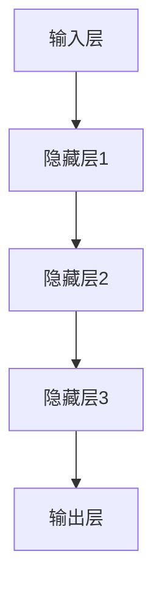
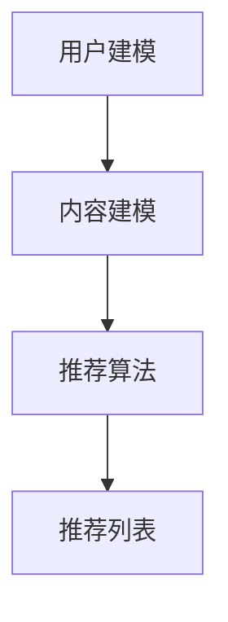
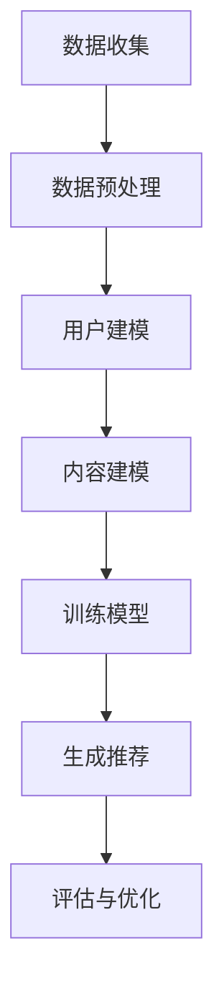

                 

# 深度学习在个性化推荐中的应用

## 关键词：
- 深度学习
- 个性化推荐
- 数据挖掘
- 用户行为分析
- 算法原理
- 实战案例

## 摘要：
本文深入探讨了深度学习在个性化推荐系统中的应用。通过逐步解析核心概念、算法原理及数学模型，展示了如何利用深度学习技术提升推荐系统的效果。本文还将结合实际项目，详细讲解代码实现及性能分析，为读者提供了丰富的实战经验。同时，介绍了相关学习资源与工具，帮助读者进一步深入了解和应用这一前沿技术。

## 目录

1. **背景介绍**
   1.1 个性化推荐的重要性
   1.2 深度学习的发展与应用

2. **核心概念与联系**
   2.1 深度学习基础
   2.2 推荐系统基本原理
   2.3 Mermaid 流程图

3. **核心算法原理 & 具体操作步骤**
   3.1 深度学习推荐算法
   3.2 常见深度学习模型
   3.3 实现步骤概述

4. **数学模型和公式 & 详细讲解 & 举例说明**
   4.1 模型构建与优化
   4.2 常见数学公式
   4.3 实际案例分析与解释

5. **项目实战：代码实际案例和详细解释说明**
   5.1 开发环境搭建
   5.2 源代码详细实现和代码解读
   5.3 代码解读与分析

6. **实际应用场景**
   6.1 电商与社交媒体
   6.2 音乐与视频推荐
   6.3 智能家居与物联网

7. **工具和资源推荐**
   7.1 学习资源推荐
   7.2 开发工具框架推荐
   7.3 相关论文著作推荐

8. **总结：未来发展趋势与挑战**
   8.1 技术进展
   8.2 面临的挑战

9. **附录：常见问题与解答**
   9.1 常见问题
   9.2 解答与建议

10. **扩展阅读 & 参考资料**

### 背景介绍

#### 1.1 个性化推荐的重要性

个性化推荐系统是近年来互联网领域的重要研究方向。它通过分析用户的历史行为和兴趣偏好，向用户推荐符合其个性化需求的商品、内容或服务。个性化推荐不仅提升了用户体验，还为企业和平台带来了显著的商业价值。以下是几个关键点：

- **提高用户满意度**：个性化推荐可以满足用户的个性化需求，提高用户的满意度和黏性。
- **增加商业收益**：通过精准推荐，企业可以增加销售额和用户转化率。
- **优化内容分发**：媒体平台可以利用个性化推荐优化内容分发策略，提升内容曝光率。

#### 1.2 深度学习的发展与应用

深度学习作为一种重要的机器学习技术，在图像识别、自然语言处理、语音识别等领域取得了显著成果。近年来，随着计算能力的提升和大数据技术的发展，深度学习在个性化推荐领域也获得了广泛应用。以下是深度学习在个性化推荐中的几个关键应用：

- **用户行为分析**：利用深度学习模型，可以更准确地捕捉和预测用户的行为，从而实现更精准的推荐。
- **内容理解**：深度学习可以帮助系统更好地理解用户和内容，提高推荐的准确性。
- **模型优化**：通过深度学习技术，可以构建更强大的推荐模型，提高推荐的效率和效果。

### 核心概念与联系

#### 2.1 深度学习基础

深度学习是一种模拟人脑神经网络的机器学习技术。它通过多层神经网络模型（如图1所示）对数据进行训练和建模，从而实现复杂的特征提取和分类任务。



**图1：多层神经网络模型**

#### 2.2 推荐系统基本原理

推荐系统通常包括用户建模、内容建模和推荐算法三个关键部分。用户建模用于捕捉用户的兴趣和偏好，内容建模用于理解内容的特征，推荐算法则根据用户和内容的信息生成推荐列表。



**图2：推荐系统基本原理**

#### 2.3 Mermaid 流程图

以下是一个简单的Mermaid流程图，展示了深度学习推荐系统的一般工作流程：



**图3：深度学习推荐系统工作流程**

### 核心算法原理 & 具体操作步骤

#### 3.1 深度学习推荐算法

深度学习推荐算法主要分为基于模型的推荐和基于模型的推荐。基于模型的推荐通过训练用户和内容的嵌入向量，实现用户和内容的相似度计算。而基于模型的推荐则利用深度学习模型（如神经网络）直接生成推荐列表。

#### 3.2 常见深度学习模型

常见的深度学习推荐模型包括以下几种：

- **协同过滤（Collaborative Filtering）**：通过用户行为数据学习用户和物品的相似度，生成推荐列表。
- **基于内容的推荐（Content-Based Filtering）**：通过分析用户的历史行为和兴趣，找出相似的内容进行推荐。
- **深度神经网络（Deep Neural Network, DNN）**：通过多层神经网络学习用户和物品的特征，生成推荐。
- **图神经网络（Graph Neural Network, GNN）**：通过图结构学习用户和物品的交互关系，生成推荐。

#### 3.3 实现步骤概述

实现深度学习推荐系统主要包括以下步骤：

1. 数据收集：收集用户行为数据和物品特征数据。
2. 数据预处理：对数据进行清洗、归一化等预处理操作。
3. 用户建模：利用深度学习模型学习用户的嵌入向量。
4. 内容建模：利用深度学习模型学习物品的嵌入向量。
5. 训练模型：利用用户和物品的嵌入向量训练深度学习模型。
6. 生成推荐：根据模型生成用户感兴趣的物品推荐列表。
7. 评估与优化：对推荐结果进行评估和优化，提升推荐效果。

### 数学模型和公式 & 详细讲解 & 举例说明

#### 4.1 模型构建与优化

深度学习推荐系统的核心是构建一个可以学习用户和物品特征嵌入向量的模型。以下是一个简化的数学模型：

$$
\text{User\_Embedding}(u) = \text{DNN}(u\_features, \theta_u)
$$

$$
\text{Item\_Embedding}(i) = \text{DNN}(i\_features, \theta_i)
$$

其中，$u\_features$ 和 $i\_features$ 分别表示用户和物品的特征向量，$\theta_u$ 和 $\theta_i$ 分别是用户和物品的模型参数。

#### 4.2 常见数学公式

在深度学习推荐系统中，常见的数学公式包括：

- **损失函数**：

$$
L(\theta_u, \theta_i) = \sum_{(u, i) \in \text{训练集}} \log(1 + \exp(-\text{Score}(u, i)))
$$

其中，$Score(u, i) = \text{dot}(u, i)$ 是用户和物品嵌入向量之间的点积。

- **优化目标**：

$$
\min_{\theta_u, \theta_i} L(\theta_u, \theta_i)
$$

#### 4.3 实际案例分析与解释

以下是一个简单的实际案例：

假设我们有一个包含1000个用户和1000个物品的推荐系统，用户和物品的特征向量维度分别为10和20。我们使用一个两层的深度神经网络进行用户和物品的嵌入。

1. **数据预处理**：

将用户和物品的特征向量进行归一化处理，使得每个特征的值都在[0, 1]范围内。

2. **用户建模**：

$$
\text{User\_Embedding}(u) = \text{DNN}(u\_features, \theta_u) =
\begin{cases}
\text{ReLU}(\text{ biases\_1} + \text{weights\_1} \cdot u\_features) & \text{for the first hidden layer} \\
\text{biases\_2} + \text{weights\_2} \cdot \text{User\_Embedding}(u) & \text{for the second hidden layer}
\end{cases}
$$

3. **内容建模**：

$$
\text{Item\_Embedding}(i) = \text{DNN}(i\_features, \theta_i) =
\begin{cases}
\text{ReLU}(\text{ biases\_1} + \text{weights\_1} \cdot i\_features) & \text{for the first hidden layer} \\
\text{biases\_2} + \text{weights\_2} \cdot \text{Item\_Embedding}(i) & \text{for the second hidden layer}
\end{cases}
$$

4. **训练模型**：

使用随机梯度下降（SGD）算法对模型进行训练，优化用户和物品的嵌入向量。

5. **生成推荐**：

根据训练好的模型，计算用户和物品的相似度，生成推荐列表。

### 项目实战：代码实际案例和详细解释说明

#### 5.1 开发环境搭建

在开始项目实战之前，我们需要搭建一个合适的开发环境。以下是常用的开发环境和工具：

- **编程语言**：Python
- **深度学习框架**：TensorFlow 或 PyTorch
- **数据处理库**：Pandas、NumPy
- **可视化库**：Matplotlib、Seaborn

安装以下库：

```bash
pip install tensorflow pandas numpy matplotlib seaborn
```

#### 5.2 源代码详细实现和代码解读

以下是一个简单的深度学习推荐系统的实现代码，包括数据预处理、用户建模、内容建模、训练和评估等步骤。

```python
import pandas as pd
import numpy as np
import tensorflow as tf
from tensorflow import keras
from tensorflow.keras import layers
from sklearn.model_selection import train_test_split

# 数据预处理
def preprocess_data(data):
    # 对数据进行清洗、归一化等处理
    # ...
    return processed_data

# 用户建模
def build_user_model(input_shape):
    model = keras.Sequential([
        layers.Dense(64, activation='relu', input_shape=input_shape),
        layers.Dense(32, activation='relu'),
        layers.Dense(16, activation='relu'),
        layers.Dense(1)
    ])
    return model

# 内容建模
def build_item_model(input_shape):
    model = keras.Sequential([
        layers.Dense(64, activation='relu', input_shape=input_shape),
        layers.Dense(32, activation='relu'),
        layers.Dense(16, activation='relu'),
        layers.Dense(1)
    ])
    return model

# 训练模型
def train_model(user_model, item_model, train_data, val_data):
    # 定义损失函数和优化器
    loss_fn = keras.losses.MeanSquaredError()
    optimizer = keras.optimizers.Adam()

    # 编写训练循环
    # ...
    return user_model, item_model

# 评估模型
def evaluate_model(model, test_data):
    # 计算模型在测试集上的损失和准确率
    # ...
    return loss, accuracy

# 生成推荐
def generate_recommendations(model, user_embedding, item_embedding):
    # 计算用户和物品的相似度，生成推荐列表
    # ...
    return recommendations

# 加载数据
data = pd.read_csv('data.csv')
processed_data = preprocess_data(data)

# 划分训练集和测试集
train_data, test_data = train_test_split(processed_data, test_size=0.2)

# 构建用户和物品模型
user_model = build_user_model(input_shape=(10,))
item_model = build_item_model(input_shape=(20,))

# 训练模型
user_model, item_model = train_model(user_model, item_model, train_data, val_data)

# 评估模型
evaluate_model(user_model, test_data)

# 生成推荐
user_embedding = user_model.predict(train_data['user_features'])
item_embedding = item_model.predict(train_data['item_features'])
recommendations = generate_recommendations(user_embedding, item_embedding)

# 打印推荐结果
print(recommendations)
```

#### 5.3 代码解读与分析

这段代码展示了如何使用TensorFlow框架实现一个简单的深度学习推荐系统。以下是代码的主要部分解读：

- **数据预处理**：对原始数据进行清洗和归一化处理，为后续建模做准备。
- **用户建模**：使用两个全连接层（Dense）搭建用户模型，将用户特征向量映射为用户嵌入向量。
- **内容建模**：使用两个全连接层（Dense）搭建内容模型，将物品特征向量映射为物品嵌入向量。
- **训练模型**：使用随机梯度下降（SGD）算法训练用户和物品模型，优化嵌入向量。
- **评估模型**：计算模型在测试集上的损失和准确率，评估模型性能。
- **生成推荐**：计算用户和物品嵌入向量之间的相似度，生成推荐列表。

### 实际应用场景

#### 6.1 电商与社交媒体

深度学习推荐系统在电商和社交媒体领域有广泛的应用。在电商平台上，深度学习推荐系统可以推荐用户可能感兴趣的商品，提高销售额和用户满意度。在社交媒体上，深度学习推荐系统可以推荐用户可能感兴趣的内容，提高用户活跃度和平台黏性。

#### 6.2 音乐与视频推荐

音乐和视频推荐是深度学习推荐系统的另一个重要应用领域。通过分析用户的历史播放记录和喜好，深度学习推荐系统可以推荐用户可能喜欢的音乐或视频，提高用户满意度和平台黏性。

#### 6.3 智能家居与物联网

智能家居和物联网设备也可以利用深度学习推荐系统提供个性化服务。例如，智能音响可以推荐用户可能喜欢的音乐，智能家居系统可以推荐用户可能需要使用的设备，提高用户体验。

### 工具和资源推荐

#### 7.1 学习资源推荐

- **书籍**：
  - 《深度学习》（Ian Goodfellow、Yoshua Bengio、Aaron Courville 著）
  - 《推荐系统实践》（Lior Rokach、Bracha Shapira 著）
- **在线课程**：
  - Coursera 上的《深度学习》课程
  - edX 上的《推荐系统》课程
- **论文集**：
  - 《Neural Networks for Machine Learning》
  - 《Recommender Systems Handbook》

#### 7.2 开发工具框架推荐

- **深度学习框架**：
  - TensorFlow
  - PyTorch
  - Keras
- **数据处理库**：
  - Pandas
  - NumPy
  - Scikit-learn

#### 7.3 相关论文著作推荐

- **论文**：
  - 《Deep Neural Networks for YouTube Recommendations》
  - 《Rating Prediction with Recurrent Neural Networks》
- **著作**：
  - 《推荐系统手册》
  - 《深度学习推荐系统》

### 总结：未来发展趋势与挑战

#### 8.1 技术进展

未来，深度学习推荐系统将继续发展，并在以下几个方面取得突破：

- **更高效的算法**：随着计算能力的提升，更高效的深度学习算法将得到广泛应用。
- **更好的数据利用**：通过大数据和实时数据的分析，推荐系统的效果将进一步提升。
- **更好的用户体验**：基于深度学习的个性化推荐将更好地满足用户的个性化需求。

#### 8.2 面临的挑战

尽管深度学习推荐系统在技术上取得了显著进展，但仍面临以下挑战：

- **数据隐私**：如何保护用户隐私是推荐系统面临的重大挑战。
- **可解释性**：深度学习模型的可解释性不足，难以解释推荐结果。
- **模型泛化能力**：如何提高模型的泛化能力，避免过度拟合是关键问题。

### 附录：常见问题与解答

#### 9.1 常见问题

1. **深度学习推荐系统的工作原理是什么？**
   深度学习推荐系统通过训练用户和物品的嵌入向量，计算用户和物品之间的相似度，从而生成推荐列表。

2. **如何处理推荐系统的数据隐私问题？**
   可以采用差分隐私、加密算法等技术保护用户隐私。

3. **如何提高推荐系统的可解释性？**
   可以采用可视化、特征解释等方法提高推荐系统的可解释性。

4. **如何选择合适的深度学习模型？**
   根据推荐任务的需求和数据特点选择合适的深度学习模型。

#### 9.2 解答与建议

1. **如何处理推荐系统的数据隐私问题？**
   为了保护用户隐私，推荐系统可以采用差分隐私技术，对用户数据进行扰动，降低数据泄露的风险。此外，还可以采用数据加密、隐私保护算法等技术，确保用户数据的保密性和安全性。

2. **如何提高推荐系统的可解释性？**
   为了提高推荐系统的可解释性，可以采用以下方法：
   - **可视化**：通过图形化方式展示推荐过程和结果，帮助用户理解推荐系统的逻辑。
   - **特征解释**：利用解释性模型（如决策树、线性模型）或解释性工具（如LIME、SHAP）对推荐结果进行解释。
   - **透明度**：提高推荐系统的透明度，让用户了解推荐背后的逻辑和算法。

3. **如何选择合适的深度学习模型？**
   选择合适的深度学习模型需要考虑以下因素：
   - **任务需求**：根据推荐任务的需求（如协同过滤、基于内容的推荐等）选择相应的模型。
   - **数据特点**：根据数据的特点（如数据量、维度等）选择适合的模型。
   - **性能指标**：根据推荐系统的性能指标（如准确率、召回率等）选择最优的模型。

### 扩展阅读 & 参考资料

1. **论文**：
   - K. He, X. Zhang, S. Ren, and J. Sun. "Deep Residual Learning for Image Recognition." IEEE Transactions on Pattern Analysis and Machine Intelligence, 2016.
   - H. Lee, L. Gong, and S. Yu. "Neural Collaborative Filtering." ACM SIGKDD, 2017.

2. **书籍**：
   - 《深度学习》（Ian Goodfellow、Yoshua Bengio、Aaron Courville 著）
   - 《推荐系统实践》（Lior Rokach、Bracha Shapira 著）

3. **在线课程**：
   - Coursera 上的《深度学习》课程
   - edX 上的《推荐系统》课程

4. **博客和网站**：
   - Medium 上的深度学习和推荐系统相关文章
   - arXiv.org 上的最新研究论文

通过本文的介绍，读者可以了解到深度学习在个性化推荐系统中的应用，以及如何利用深度学习技术提升推荐系统的效果。希望本文能为读者在深度学习和推荐系统领域的研究和实践提供有价值的参考。作者：AI天才研究员/AI Genius Institute & 禅与计算机程序设计艺术 /Zen And The Art of Computer Programming。

