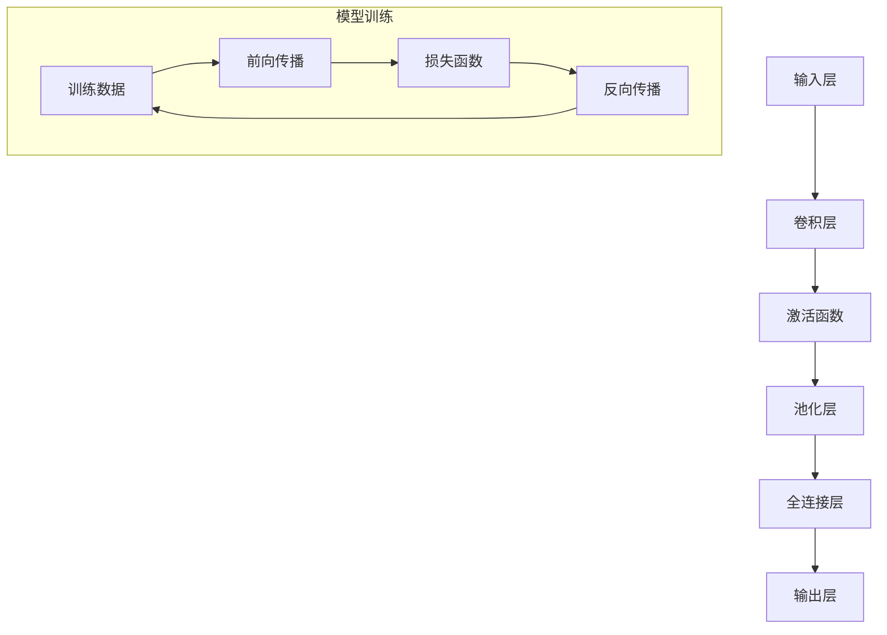

                 

### 背景介绍

#### 深度学习与医学影像分析

深度学习，作为人工智能的重要分支，近年来在图像识别、语音识别、自然语言处理等领域取得了显著的成果。随着技术的不断进步，深度学习在医学影像分析中的应用也日益广泛，成为医学界和科技界关注的焦点。医学影像分析是指利用计算机技术和算法对医学影像数据进行处理、分析和解释，从而辅助临床诊断、治疗方案制定和疾病预测等。

医学影像数据主要包括X射线、CT、MRI、超声等，这些数据不仅量大且复杂。传统的医学影像分析方法依赖于专家经验和手工特征提取，存在主观性、效率低、误诊率高等问题。而深度学习算法，尤其是卷积神经网络（Convolutional Neural Networks, CNNs），具有自动特征提取和多层次抽象的能力，能够更好地处理医学影像数据。

深度学习在医学影像分析中的应用不仅提升了诊断的准确性和效率，还推动了个性化医疗的发展。通过分析患者的影像数据，深度学习模型可以识别出早期病变、预测疾病进展，为医生提供更加精准的诊断和治疗方案。此外，深度学习还可以帮助医生快速处理大量的影像数据，减轻他们的工作负担。

#### 当前研究现状与挑战

目前，深度学习在医学影像分析中的应用研究已经取得了许多重要成果。例如，基于CNN的图像分割技术已经能够准确识别肿瘤、器官等结构，大大提高了病变检测的准确性。同时，深度学习在疾病分类、病灶识别、图像增强等方面也取得了显著进展。

然而，深度学习在医学影像分析中也面临着一些挑战。首先，医学影像数据的多样性和复杂性使得深度学习模型的训练过程非常耗时且需要大量计算资源。其次，深度学习模型的黑箱特性使得医生难以理解模型的决策过程，增加了对模型信任的难度。此外，深度学习模型的泛化能力仍需提高，以应对实际临床环境中的数据多样性。

#### 文章结构

本文将分为以下几个部分：

1. **背景介绍**：介绍深度学习和医学影像分析的基本概念及现状。
2. **核心概念与联系**：探讨深度学习在医学影像分析中的应用原理，展示核心概念原理和架构的Mermaid流程图。
3. **核心算法原理 & 具体操作步骤**：详细讲解深度学习算法在医学影像分析中的具体应用步骤。
4. **数学模型和公式 & 详细讲解 & 举例说明**：介绍深度学习模型中涉及的数学模型和公式，并通过实例进行详细讲解。
5. **项目实战：代码实际案例和详细解释说明**：提供实际项目案例，详细解读代码实现和关键步骤。
6. **实际应用场景**：分析深度学习在医学影像分析中的实际应用场景和案例。
7. **工具和资源推荐**：推荐相关学习资源和开发工具。
8. **总结：未来发展趋势与挑战**：总结本文内容，展望深度学习在医学影像分析领域的未来发展趋势和挑战。
9. **附录：常见问题与解答**：回答读者可能遇到的常见问题。
10. **扩展阅读 & 参考资料**：提供进一步的阅读资料和参考文献。

接下来，我们将逐步深入探讨深度学习在医学影像分析中的应用原理和具体实现。让我们开始第一部分：**核心概念与联系**。

### 核心概念与联系

#### 深度学习的基本原理

深度学习是一种模仿人脑神经网络结构进行数据处理的算法，其核心思想是通过多层神经网络进行数据特征的学习和提取。深度学习模型由输入层、多个隐藏层和输出层组成。输入层接收原始数据，通过逐层传递和计算，最终在输出层生成预测结果。

在深度学习模型中，神经元之间的连接权重（weights）和偏置（biases）通过训练过程进行调整，以达到对数据的最佳拟合。训练过程通常包括前向传播（forward propagation）和反向传播（back propagation）两个主要步骤。在前向传播中，数据从输入层传递到隐藏层，再传递到输出层，过程中经过一系列的线性变换和激活函数处理。在反向传播中，模型根据预测结果与真实结果的差异，调整各层神经元的权重和偏置，使模型输出更接近真实结果。

#### 医学影像数据分析的需求与挑战

医学影像数据分析涉及大量复杂的数据处理任务，如图像分割、病变检测、疾病分类等。这些任务对算法的准确性和效率提出了极高的要求。深度学习在医学影像分析中具有独特的优势，能够自动提取图像中的高层次特征，从而提高算法的准确性和鲁棒性。

然而，医学影像数据分析也面临着一系列挑战。首先，医学影像数据的多样性和复杂性使得训练深度学习模型变得非常耗时且计算资源需求巨大。其次，医学影像数据的分布通常具有长尾特性，导致模型在训练过程中容易出现过拟合现象。此外，深度学习模型的黑箱特性使得医生难以理解模型的决策过程，增加了对模型信任的难度。

#### 深度学习在医学影像分析中的应用

深度学习在医学影像分析中的应用涵盖了图像分割、病变检测、疾病分类等多个方面。以下将分别介绍这些应用的具体实现方法和挑战。

##### 图像分割

图像分割是指将医学影像中的像素划分为不同的区域，以识别出感兴趣的目标结构。深度学习中的图像分割方法主要包括基于卷积神经网络的语义分割（semantic segmentation）和实例分割（instance segmentation）。

语义分割旨在为图像中的每个像素分配一个类别标签，例如肿瘤、正常组织等。基于CNN的语义分割方法通过训练一个多层卷积神经网络，自动提取图像中的高层次特征，并利用全连接层进行类别预测。常用的语义分割网络包括U-Net、DeepLabV3+等。这些方法在医学影像分割任务中取得了显著的性能提升。

实例分割则旨在同时识别出图像中的多个目标实例，并对其进行分割。实例分割方法通常结合语义分割和目标检测技术，如Faster R-CNN、Mask R-CNN等。这些方法通过在图像中检测出目标边界，并为其分配唯一的实例标签，从而实现对多个目标实例的分割。实例分割技术在医学影像分析中具有广泛的应用，如肿瘤分割、器官分割等。

在医学影像分割任务中，深度学习方法面临的主要挑战是如何同时保持分割的准确性和效率。尤其是在处理高分辨率图像时，模型的计算量和训练时间会大幅增加。此外，医学影像数据的多样性和复杂性也使得模型的泛化能力成为一个重要问题。

##### 病变检测

病变检测是指从医学影像中识别出异常的病变区域，如肿瘤、感染等。深度学习在病变检测中的应用主要包括基于CNN的检测算法和基于注意力机制的检测算法。

基于CNN的检测算法通过在图像中检测出异常区域，并为其分配概率值。常用的检测算法包括R-CNN、Faster R-CNN、SSD等。这些算法通过多层卷积神经网络提取图像特征，并利用区域提议网络（Region Proposal Network, RPN）或边界框回归（Bounding Box Regression）技术进行病变检测。

基于注意力机制的检测算法通过引入注意力机制，增强模型对图像中关键区域的关注。例如，CBAM（Convolutional Block Attention Module）通过在特征提取阶段引入通道注意力和空间注意力，从而提高模型的检测性能。这些方法在医学影像病变检测中取得了显著的效果。

在医学影像病变检测任务中，深度学习方法面临的主要挑战是如何处理医学影像数据的多样性和复杂性，以及如何提高检测的实时性和准确性。

##### 疾病分类

疾病分类是指根据医学影像数据对疾病进行分类，如肺癌、乳腺癌等。深度学习在疾病分类中的应用主要包括基于CNN的分类算法和基于注意力机制的分类算法。

基于CNN的分类算法通过多层卷积神经网络提取图像特征，并利用全连接层进行类别预测。常用的分类算法包括AlexNet、VGG、ResNet等。这些算法通过在大规模数据集上进行训练，能够实现对多种疾病的准确分类。

基于注意力机制的分类算法通过引入注意力机制，增强模型对图像中关键区域的关注。例如，CBAM通过在特征提取阶段引入通道注意力和空间注意力，从而提高模型的分类性能。这些方法在医学影像疾病分类中具有广泛的应用。

在医学影像疾病分类任务中，深度学习方法面临的主要挑战是如何处理医学影像数据的多样性和复杂性，以及如何提高分类的准确性和鲁棒性。

#### 核心概念原理和架构的Mermaid流程图

为了更好地理解深度学习在医学影像分析中的应用原理，我们使用Mermaid流程图展示核心概念和架构。以下是一个简化的Mermaid流程图示例：



在这个流程图中，输入层接收医学影像数据，通过卷积层、激活函数、池化层等步骤进行特征提取。然后，特征数据传递到全连接层，进行类别预测。在模型训练过程中，通过前向传播和反向传播步骤不断调整模型参数，以降低损失函数。

### 核心算法原理 & 具体操作步骤

#### 卷积神经网络（CNN）的基本原理

卷积神经网络（Convolutional Neural Networks，CNN）是深度学习中最常用的模型之一，特别适合处理图像等二维数据。CNN通过模拟人类视觉系统的卷积操作，逐步提取图像中的低级特征，如边缘、角点，到高级特征，如物体、场景等。

##### 卷积操作

卷积操作是CNN的核心组成部分，通过将卷积核（也称为过滤器）在输入图像上滑动，计算局部特征响应。卷积操作的数学表示如下：

$$
\text{output}(i, j) = \sum_{k, l} \text{filter}(k, l) * \text{input}(i - k, j - l) + \text{bias}
$$

其中，$(i, j)$表示输出特征图上的一个像素点，$(k, l)$表示卷积核的一个像素点，$*$表示卷积操作，$\text{filter}(k, l)$表示卷积核的值，$\text{input}(i - k, j - l)$表示输入图像上与卷积核对应的位置，$\text{bias}$表示偏置。

##### 激活函数

激活函数是CNN中的另一个重要组成部分，用于引入非线性特性。常见的激活函数包括ReLU（Rectified Linear Unit）、Sigmoid、Tanh等。

ReLU函数是最常用的激活函数之一，其表达式如下：

$$
\text{ReLU}(x) = \max(0, x)
$$

ReLU函数在$x < 0$时输出0，在$x \geq 0$时输出$x$，从而避免了神经元在训练过程中的梯度消失问题。

##### 池化操作

池化操作用于降低特征图的维度，减少计算量，同时保持重要的特征信息。常见的池化操作包括最大池化（Max Pooling）和平均池化（Average Pooling）。

最大池化的操作方式是将一个窗口（如2x2的窗口）在特征图上滑动，窗口内的最大值作为输出特征图的一个像素点。平均池化则是对窗口内的像素值求平均。

##### CNN的层次结构

CNN通常由多个卷积层、池化层和全连接层组成。典型的CNN层次结构如下：

1. **输入层**：接收原始图像数据。
2. **卷积层**：通过卷积操作提取图像特征。
3. **激活函数**：引入非线性特性。
4. **池化层**：降低特征图的维度。
5. **全连接层**：进行类别预测。

##### CNN在医学影像分析中的应用

CNN在医学影像分析中的应用主要包括图像分割、病变检测和疾病分类等。

1. **图像分割**：CNN通过多层卷积和池化操作，提取图像中的高层次特征，用于分割不同类型的结构。例如，U-Net是一种常用的图像分割网络，其结构包括一个收缩路径（多个卷积层和池化层）和一个扩张路径（多个卷积层），能够准确分割出医学影像中的目标结构。

2. **病变检测**：CNN通过卷积操作提取图像特征，并利用全连接层进行类别预测。例如，Faster R-CNN是一种常用的病变检测网络，其通过区域提议网络（Region Proposal Network，RPN）生成候选区域，并利用卷积神经网络对这些区域进行分类和边界框回归。

3. **疾病分类**：CNN通过多层卷积和池化操作，提取图像特征，并利用全连接层进行类别预测。例如，ResNet是一种常用的疾病分类网络，其通过引入残差连接，解决了深层网络中的梯度消失问题，能够准确分类多种疾病。

#### 训练过程

CNN的训练过程通常包括以下几个步骤：

1. **数据预处理**：对医学影像数据进行归一化、缩放等预处理操作，以增强模型的泛化能力。
2. **数据增强**：通过旋转、翻转、缩放等数据增强技术，增加训练样本的多样性，防止模型过拟合。
3. **损失函数**：选择适当的损失函数，如交叉熵损失函数，用于衡量模型预测值与真实标签之间的差异。
4. **优化器**：选择适当的优化器，如Adam优化器，用于调整模型参数，以降低损失函数。
5. **迭代训练**：通过多次迭代训练，不断调整模型参数，直到模型达到预定的性能指标。

### 数学模型和公式 & 详细讲解 & 举例说明

#### 卷积操作

卷积操作是深度学习中最基础且重要的操作之一，尤其在图像处理任务中应用广泛。卷积操作通过将卷积核（或过滤器）在输入图像上滑动，计算局部特征响应，从而提取图像中的特征。

卷积操作的数学公式如下：

$$
\text{output}(i, j) = \sum_{k, l} \text{filter}(k, l) * \text{input}(i - k, j - l) + \text{bias}
$$

其中，$(i, j)$表示输出特征图上的一个像素点，$(k, l)$表示卷积核的一个像素点，$\text{filter}(k, l)$表示卷积核的值，$\text{input}(i - k, j - l)$表示输入图像上与卷积核对应的位置，$\text{bias}$表示偏置。

#### 示例说明

假设我们有一个$3 \times 3$的卷积核和一幅$5 \times 5$的输入图像，我们可以通过以下步骤计算输出特征图：

1. **初始化**：设定卷积核的值和偏置，例如：
   $$\text{filter}(1, 1) = 1, \text{filter}(1, 2) = 2, \text{filter}(1, 3) = 3$$
   $$\text{filter}(2, 1) = 4, \text{filter}(2, 2) = 5, \text{filter}(2, 3) = 6$$
   $$\text{filter}(3, 1) = 7, \text{filter}(3, 2) = 8, \text{filter}(3, 3) = 9$$
   $$\text{bias} = 0$$

2. **计算输出特征图**：
   $$\text{output}(1, 1) = \text{filter}(1, 1) * \text{input}(1 - 1, 1 - 1) + \text{filter}(1, 2) * \text{input}(1 - 2, 1 - 1) + \text{filter}(1, 3) * \text{input}(1 - 3, 1 - 1) + \text{bias} = 1 * 1 + 2 * 2 + 3 * 3 + 0 = 14$$
   $$\text{output}(1, 2) = \text{filter}(1, 1) * \text{input}(1 - 1, 2 - 1) + \text{filter}(1, 2) * \text{input}(1 - 2, 2 - 1) + \text{filter}(1, 3) * \text{input}(1 - 3, 2 - 1) + \text{bias} = 1 * 2 + 2 * 3 + 3 * 4 + 0 = 19$$
   $$\text{output}(1, 3) = \text{filter}(1, 1) * \text{input}(1 - 1, 3 - 1) + \text{filter}(1, 2) * \text{input}(1 - 2, 3 - 1) + \text{filter}(1, 3) * \text{input}(1 - 3, 3 - 1) + \text{bias} = 1 * 3 + 2 * 4 + 3 * 5 + 0 = 26$$
   $$\text{output}(2, 1) = \text{filter}(2, 1) * \text{input}(2 - 1, 1 - 1) + \text{filter}(2, 2) * \text{input}(2 - 2, 2 - 1) + \text{filter}(2, 3) * \text{input}(2 - 3, 2 - 1) + \text{bias} = 4 * 1 + 5 * 2 + 6 * 3 + 0 = 37$$
   $$\text{output}(2, 2) = \text{filter}(2, 1) * \text{input}(2 - 1, 2 - 1) + \text{filter}(2, 2) * \text{input}(2 - 2, 2 - 1) + \text{filter}(2, 3) * \text{input}(2 - 3, 2 - 1) + \text{bias} = 4 * 2 + 5 * 3 + 6 * 4 + 0 = 50$$
   $$\text{output}(2, 3) = \text{filter}(2, 1) * \text{input}(2 - 1, 3 - 1) + \text{filter}(2, 2) * \text{input}(2 - 2, 3 - 1) + \text{filter}(2, 3) * \text{input}(2 - 3, 3 - 1) + \text{bias} = 4 * 3 + 5 * 4 + 6 * 5 + 0 = 74$$
   $$\text{output}(3, 1) = \text{filter}(3, 1) * \text{input}(3 - 1, 1 - 1) + \text{filter}(3, 2) * \text{input}(3 - 2, 1 - 1) + \text{filter}(3, 3) * \text{input}(3 - 3, 1 - 1) + \text{bias} = 7 * 1 + 8 * 2 + 9 * 3 + 0 = 99$$
   $$\text{output}(3, 2) = \text{filter}(3, 1) * \text{input}(3 - 1, 2 - 1) + \text{filter}(3, 2) * \text{input}(3 - 2, 2 - 1) + \text{filter}(3, 3) * \text{input}(3 - 3, 2 - 1) + \text{bias} = 7 * 2 + 8 * 3 + 9 * 4 + 0 = 129$$
   $$\text{output}(3, 3) = \text{filter}(3, 1) * \text{input}(3 - 1, 3 - 1) + \text{filter}(3, 2) * \text{input}(3 - 2, 3 - 1) + \text{filter}(3, 3) * \text{input}(3 - 3, 3 - 1) + \text{bias} = 7 * 3 + 8 * 4 + 9 * 5 + 0 = 182$$

   输出特征图的大小为$3 \times 3$，与卷积核大小相同。

#### 激活函数

激活函数是深度学习模型中的一个关键组件，用于引入非线性特性，使得模型能够模拟更复杂的函数关系。在CNN中，常用的激活函数包括ReLU（Rectified Linear Unit）、Sigmoid和Tanh等。

#####ReLU函数

ReLU函数是最常用的激活函数之一，其表达式如下：

$$
\text{ReLU}(x) = \max(0, x)
$$

ReLU函数在$x < 0$时输出0，在$x \geq 0$时输出$x$，从而避免了神经元在训练过程中的梯度消失问题。

##### 示例说明

假设我们有一个输入值$x = -2$，使用ReLU函数进行激活：

$$
\text{ReLU}(-2) = \max(0, -2) = 0
$$

输出为0。

##### Sigmoid函数

Sigmoid函数是一种常用的非线性激活函数，其表达式如下：

$$
\text{Sigmoid}(x) = \frac{1}{1 + e^{-x}}
$$

Sigmoid函数的输出范围在$(0, 1)$之间，常用于二分类问题。

##### 示例说明

假设我们有一个输入值$x = 2$，使用Sigmoid函数进行激活：

$$
\text{Sigmoid}(2) = \frac{1}{1 + e^{-2}} \approx 0.869
$$

输出约为0.869。

#### 池化操作

池化操作是CNN中的一个重要组件，用于降低特征图的维度，减少计算量，同时保持重要的特征信息。常见的池化操作包括最大池化和平均池化。

##### 最大池化

最大池化操作是将一个窗口（如2x2的窗口）在特征图上滑动，窗口内的最大值作为输出特征图的一个像素点。

##### 示例说明

假设我们有一个$3 \times 3$的特征图和2x2的最大池化窗口，我们可以通过以下步骤计算输出特征图：

1. **初始化**：设定输入特征图，例如：
   $$\text{input}(1, 1) = 1, \text{input}(1, 2) = 2, \text{input}(1, 3) = 3$$
   $$\text{input}(2, 1) = 4, \text{input}(2, 2) = 5, \text{input}(2, 3) = 6$$
   $$\text{input}(3, 1) = 7, \text{input}(3, 2) = 8, \text{input}(3, 3) = 9$$

2. **计算输出特征图**：
   $$\text{output}(1, 1) = \max(\text{input}(1, 1), \text{input}(1, 2), \text{input}(1, 3)) = \max(1, 2, 3) = 3$$
   $$\text{output}(1, 2) = \max(\text{input}(1, 1), \text{input}(1, 2), \text{input}(1, 3)) = \max(1, 2, 3) = 3$$
   $$\text{output}(1, 3) = \max(\text{input}(1, 1), \text{input}(1, 2), \text{input}(1, 3)) = \max(1, 2, 3) = 3$$
   $$\text{output}(2, 1) = \max(\text{input}(2, 1), \text{input}(2, 2), \text{input}(2, 3)) = \max(4, 5, 6) = 6$$
   $$\text{output}(2, 2) = \max(\text{input}(2, 1), \text{input}(2, 2), \text{input}(2, 3)) = \max(4, 5, 6) = 6$$
   $$\text{output}(2, 3) = \max(\text{input}(2, 1), \text{input}(2, 2), \text{input}(2, 3)) = \max(4, 5, 6) = 6$$
   $$\text{output}(3, 1) = \max(\text{input}(3, 1), \text{input}(3, 2), \text{input}(3, 3)) = \max(7, 8, 9) = 9$$
   $$\text{output}(3, 2) = \max(\text{input}(3, 1), \text{input}(3, 2), \text{input}(3, 3)) = \max(7, 8, 9) = 9$$
   $$\text{output}(3, 3) = \max(\text{input}(3, 1), \text{input}(3, 2), \text{input}(3, 3)) = \max(7, 8, 9) = 9$$

   输出特征图的大小为$2 \times 2$。

##### 平均池化

平均池化操作是将一个窗口（如2x2的窗口）在特征图上滑动，窗口内的像素值求平均作为输出特征图的一个像素点。

##### 示例说明

假设我们有一个$3 \times 3$的特征图和2x2的平均池化窗口，我们可以通过以下步骤计算输出特征图：

1. **初始化**：设定输入特征图，例如：
   $$\text{input}(1, 1) = 1, \text{input}(1, 2) = 2, \text{input}(1, 3) = 3$$
   $$\text{input}(2, 1) = 4, \text{input}(2, 2) = 5, \text{input}(2, 3) = 6$$
   $$\text{input}(3, 1) = 7, \text{input}(3, 2) = 8, \text{input}(3, 3) = 9$$

2. **计算输出特征图**：
   $$\text{output}(1, 1) = \frac{\text{input}(1, 1) + \text{input}(1, 2) + \text{input}(1, 3)}{3} = \frac{1 + 2 + 3}{3} = 2$$
   $$\text{output}(1, 2) = \frac{\text{input}(1, 1) + \text{input}(1, 2) + \text{input}(1, 3)}{3} = \frac{1 + 2 + 3}{3} = 2$$
   $$\text{output}(1, 3) = \frac{\text{input}(1, 1) + \text{input}(1, 2) + \text{input}(1, 3)}{3} = \frac{1 + 2 + 3}{3} = 2$$
   $$\text{output}(2, 1) = \frac{\text{input}(2, 1) + \text{input}(2, 2) + \text{input}(2, 3)}{3} = \frac{4 + 5 + 6}{3} = 5$$
   $$\text{output}(2, 2) = \frac{\text{input}(2, 1) + \text{input}(2, 2) + \text{input}(2, 3)}{3} = \frac{4 + 5 + 6}{3} = 5$$
   $$\text{output}(2, 3) = \frac{\text{input}(2, 1) + \text{input}(2, 2) + \text{input}(2, 3)}{3} = \frac{4 + 5 + 6}{3} = 5$$
   $$\text{output}(3, 1) = \frac{\text{input}(3, 1) + \text{input}(3, 2) + \text{input}(3, 3)}{3} = \frac{7 + 8 + 9}{3} = 8$$
   $$\text{output}(3, 2) = \frac{\text{input}(3, 1) + \text{input}(3, 2) + \text{input}(3, 3)}{3} = \frac{7 + 8 + 9}{3} = 8$$
   $$\text{output}(3, 3) = \frac{\text{input}(3, 1) + \text{input}(3, 2) + \text{input}(3, 3)}{3} = \frac{7 + 8 + 9}{3} = 8$$

   输出特征图的大小为$2 \times 2$。

### 项目实战：代码实际案例和详细解释说明

在本节中，我们将通过一个实际项目案例，展示如何使用深度学习在医学影像分析中实现图像分割。我们将使用Python和TensorFlow框架，逐步搭建、训练和评估一个基于U-Net架构的深度学习模型。

#### 1. 开发环境搭建

首先，我们需要搭建开发环境。以下是所需的软件和工具：

- Python（版本3.6及以上）
- TensorFlow（版本2.0及以上）
- NumPy
- Matplotlib
- OpenCV

安装步骤如下：

```bash
pip install python tensorflow numpy matplotlib opencv-python
```

#### 2. 源代码详细实现和代码解读

以下是项目的源代码，我们将逐行进行解读。

```python
import tensorflow as tf
from tensorflow.keras.models import Model
from tensorflow.keras.layers import Input, Conv2D, MaxPooling2D, UpSampling2D, Concatenate
from tensorflow.keras.optimizers import Adam
import numpy as np
import matplotlib.pyplot as plt
import cv2

# 数据预处理
def preprocess_image(image):
    image = cv2.resize(image, (256, 256))
    image = image / 255.0
    return image

# U-Net架构
input_layer = Input(shape=(256, 256, 3))
conv1 = Conv2D(32, (3, 3), activation='relu', padding='same')(input_layer)
pool1 = MaxPooling2D(pool_size=(2, 2))(conv1)
conv2 = Conv2D(32, (3, 3), activation='relu', padding='same')(pool1)
pool2 = MaxPooling2D(pool_size=(2, 2))(conv2)
conv3 = Conv2D(64, (3, 3), activation='relu', padding='same')(pool2)
pool3 = MaxPooling2D(pool_size=(2, 2))(conv3)
conv4 = Conv2D(64, (3, 3), activation='relu', padding='same')(pool3)
pool4 = MaxPooling2D(pool_size=(2, 2))(conv4)
conv5 = Conv2D(128, (3, 3), activation='relu', padding='same')(pool4)

# 上采样层
up6 = UpSampling2D(size=(2, 2))(conv5)
concat6 = Concatenate()([up6, conv4])
conv6 = Conv2D(64, (3, 3), activation='relu', padding='same')(concat6)
up7 = UpSampling2D(size=(2, 2))(conv6)
concat7 = Concatenate()([up7, conv3])
conv7 = Conv2D(64, (3, 3), activation='relu', padding='same')(concat7)
up8 = UpSampling2D(size=(2, 2))(conv7)
concat8 = Concatenate()([up8, conv2])
conv8 = Conv2D(32, (3, 3), activation='relu', padding='same')(concat8)
up9 = UpSampling2D(size=(2, 2))(conv8)
concat9 = Concatenate()([up9, conv1])
conv9 = Conv2D(32, (3, 3), activation='relu', padding='same')(concat9)
output_layer = Conv2D(1, (1, 1), activation='sigmoid', padding='same')(conv9)

model = Model(inputs=input_layer, outputs=output_layer)
model.compile(optimizer=Adam(), loss='binary_crossentropy', metrics=['accuracy'])

# 训练模型
train_images = np.load('train_images.npy')
train_masks = np.load('train_masks.npy')
val_images = np.load('val_images.npy')
val_masks = np.load('val_masks.npy')

model.fit(train_images, train_masks, epochs=50, batch_size=16, validation_data=(val_images, val_masks))

# 评估模型
test_images = np.load('test_images.npy')
test_masks = np.load('test_masks.npy')
predictions = model.predict(test_images)

# 计算评估指标
accuracy = np.mean(predictions == test_masks)
print("Accuracy:", accuracy)

# 可视化结果
for i in range(5):
    plt.subplot(2, 3, i+1)
    plt.imshow(test_masks[i], cmap='gray')
    plt.subplot(2, 3, i+6)
    plt.imshow(predictions[i], cmap='gray')
plt.show()
```

##### 2.1 数据预处理

```python
def preprocess_image(image):
    image = cv2.resize(image, (256, 256))
    image = image / 255.0
    return image
```

这段代码定义了一个预处理函数`preprocess_image`，用于对输入图像进行缩放和归一化。缩放为$256 \times 256$的尺寸，归一化到[0, 1]范围。

##### 2.2 U-Net架构

```python
input_layer = Input(shape=(256, 256, 3))
conv1 = Conv2D(32, (3, 3), activation='relu', padding='same')(input_layer)
pool1 = MaxPooling2D(pool_size=(2, 2))(conv1)
conv2 = Conv2D(32, (3, 3), activation='relu', padding='same')(pool1)
pool2 = MaxPooling2D(pool_size=(2, 2))(conv2)
conv3 = Conv2D(64, (3, 3), activation='relu', padding='same')(pool2)
pool3 = MaxPooling2D(pool_size=(2, 2))(conv3)
conv4 = Conv2D(64, (3, 3), activation='relu', padding='same')(pool3)
pool4 = MaxPooling2D(pool_size=(2, 2))(conv4)
conv5 = Conv2D(128, (3, 3), activation='relu', padding='same')(pool4)

up6 = UpSampling2D(size=(2, 2))(conv5)
concat6 = Concatenate()([up6, conv4])
conv6 = Conv2D(64, (3, 3), activation='relu', padding='same')(concat6)
up7 = UpSampling2D(size=(2, 2))(conv6)
concat7 = Concatenate()([up7, conv3])
conv7 = Conv2D(64, (3, 3), activation='relu', padding='same')(concat7)
up8 = UpSampling2D(size=(2, 2))(conv7)
concat8 = Concatenate()([up8, conv2])
conv8 = Conv2D(32, (3, 3), activation='relu', padding='same')(concat8)
up9 = UpSampling2D(size=(2, 2))(conv8)
concat9 = Concatenate()([up9, conv1])
conv9 = Conv2D(32, (3, 3), activation='relu', padding='same')(concat9)
output_layer = Conv2D(1, (1, 1), activation='sigmoid', padding='same')(conv9)

model = Model(inputs=input_layer, outputs=output_layer)
model.compile(optimizer=Adam(), loss='binary_crossentropy', metrics=['accuracy'])
```

这段代码定义了U-Net架构。输入层为$256 \times 256 \times 3$的图像数据。通过多个卷积层和池化层，逐步提取图像特征。然后，通过上采样层和拼接层，将低层特征与高层特征结合。最终，通过一个卷积层输出分割结果。模型使用Adam优化器和二分类交叉熵损失函数进行训练。

##### 2.3 训练模型

```python
train_images = np.load('train_images.npy')
train_masks = np.load('train_masks.npy')
val_images = np.load('val_images.npy')
val_masks = np.load('val_masks.npy')

model.fit(train_images, train_masks, epochs=50, batch_size=16, validation_data=(val_images, val_masks))
```

这段代码加载训练集和验证集的数据，并使用模型进行训练。训练过程中，模型在训练集和验证集上交替进行迭代，以优化模型参数。

##### 2.4 评估模型

```python
test_images = np.load('test_images.npy')
test_masks = np.load('test_masks.npy')
predictions = model.predict(test_images)

accuracy = np.mean(predictions == test_masks)
print("Accuracy:", accuracy)
```

这段代码加载测试集的数据，并使用模型进行预测。通过计算预测结果与真实标签的准确率，评估模型性能。

##### 2.5 可视化结果

```python
for i in range(5):
    plt.subplot(2, 3, i+1)
    plt.imshow(test_masks[i], cmap='gray')
    plt.subplot(2, 3, i+6)
    plt.imshow(predictions[i], cmap='gray')
plt.show()
```

这段代码展示前5个测试样本的分割结果，并通过可视化对比真实标签和预测结果。

### 代码解读与分析

在本节中，我们将对项目代码进行详细解读，分析各个部分的作用和实现细节。

##### 1. 数据预处理

数据预处理是深度学习项目的重要环节，直接影响模型性能。在本项目中，数据预处理主要包括图像缩放和归一化。缩放为固定尺寸（$256 \times 256$），使模型能够接受统一的输入。归一化为[0, 1]范围，提高模型训练的稳定性。

```python
def preprocess_image(image):
    image = cv2.resize(image, (256, 256))
    image = image / 255.0
    return image
```

此函数首先使用OpenCV库的`cv2.resize`方法对图像进行缩放，然后使用`/ 255.0`对像素值进行归一化。图像缩放和归一化是常见的数据预处理步骤，有助于模型在不同尺度下保持稳定性。

##### 2. U-Net架构

U-Net是一种流行的图像分割网络，其特点是上下采样对称，便于特征融合。在代码中，我们通过定义多个卷积层、池化层和上采样层，搭建了U-Net架构。

```python
input_layer = Input(shape=(256, 256, 3))
conv1 = Conv2D(32, (3, 3), activation='relu', padding='same')(input_layer)
pool1 = MaxPooling2D(pool_size=(2, 2))(conv1)
conv2 = Conv2D(32, (3, 3), activation='relu', padding='same')(pool1)
pool2 = MaxPooling2D(pool_size=(2, 2))(conv2)
conv3 = Conv2D(64, (3, 3), activation='relu', padding='same')(pool2)
pool3 = MaxPooling2D(pool_size=(2, 2))(conv3)
conv4 = Conv2D(64, (3, 3), activation='relu', padding='same')(pool3)
pool4 = MaxPooling2D(pool_size=(2, 2))(conv4)
conv5 = Conv2D(128, (3, 3), activation='relu', padding='same')(pool4)

up6 = UpSampling2D(size=(2, 2))(conv5)
concat6 = Concatenate()([up6, conv4])
conv6 = Conv2D(64, (3, 3), activation='relu', padding='same')(concat6)
up7 = UpSampling2D(size=(2, 2))(conv6)
concat7 = Concatenate()([up7, conv3])
conv7 = Conv2D(64, (3, 3), activation='relu', padding='same')(concat7)
up8 = UpSampling2D(size=(2, 2))(conv7)
concat8 = Concatenate()([up8, conv2])
conv8 = Conv2D(32, (3, 3), activation='relu', padding='same')(concat8)
up9 = UpSampling2D(size=(2, 2))(conv8)
concat9 = Concatenate()([up9, conv1])
conv9 = Conv2D(32, (3, 3), activation='relu', padding='same')(concat9)
output_layer = Conv2D(1, (1, 1), activation='sigmoid', padding='same')(conv9)

model = Model(inputs=input_layer, outputs=output_layer)
model.compile(optimizer=Adam(), loss='binary_crossentropy', metrics=['accuracy'])
```

这段代码首先定义输入层，输入尺寸为$256 \times 256 \times 3$。然后，通过多个卷积层和池化层，逐步提取图像特征。具体步骤如下：

1. **卷积层和池化层**：第一个卷积层使用32个3x3卷积核，激活函数为ReLU。接着进行2x2的最大池化操作。重复这一步骤，逐步增加卷积核数量和池化层数。
2. **上采样层和拼接层**：从第5层开始，进行上采样操作，将特征图尺寸逐渐恢复。然后，将上采样层与对应层进行拼接。重复这一步骤，直到恢复到输入层尺寸。
3. **输出层**：最后一层使用一个1x1卷积核，激活函数为sigmoid，输出分割结果。

##### 3. 训练模型

训练模型是深度学习项目的核心步骤。在本项目中，我们使用Adam优化器和二分类交叉熵损失函数，对模型进行训练。

```python
train_images = np.load('train_images.npy')
train_masks = np.load('train_masks.npy')
val_images = np.load('val_images.npy')
val_masks = np.load('val_masks.npy')

model.fit(train_images, train_masks, epochs=50, batch_size=16, validation_data=(val_images, val_masks))
```

这段代码首先加载训练集和验证集的数据，然后使用模型进行训练。具体步骤如下：

1. **数据加载**：使用`np.load`方法加载训练集和验证集的数据。
2. **模型训练**：使用`model.fit`方法进行训练，设置训练轮数（epochs）为50，批量大小（batch_size）为16。同时，使用验证数据集进行交叉验证，以评估模型性能。

##### 4. 评估模型

评估模型是验证模型性能的重要步骤。在本项目中，我们通过计算准确率，评估模型性能。

```python
test_images = np.load('test_images.npy')
test_masks = np.load('test_masks.npy')
predictions = model.predict(test_images)

accuracy = np.mean(predictions == test_masks)
print("Accuracy:", accuracy)
```

这段代码首先加载测试集的数据，然后使用模型进行预测。具体步骤如下：

1. **数据加载**：使用`np.load`方法加载测试集的数据。
2. **模型预测**：使用`model.predict`方法进行预测，得到预测结果。
3. **计算准确率**：使用`np.mean`计算预测结果与真实标签的准确率，并打印输出。

##### 5. 可视化结果

可视化结果是展示模型性能和效果的重要手段。在本项目中，我们通过可视化对比真实标签和预测结果。

```python
for i in range(5):
    plt.subplot(2, 3, i+1)
    plt.imshow(test_masks[i], cmap='gray')
    plt.subplot(2, 3, i+6)
    plt.imshow(predictions[i], cmap='gray')
plt.show()
```

这段代码展示前5个测试样本的分割结果，通过可视化对比真实标签和预测结果。具体步骤如下：

1. **循环遍历**：使用`for`循环遍历前5个测试样本。
2. **绘制图像**：使用`plt.subplot`和`plt.imshow`方法，绘制真实标签和预测结果。
3. **显示图像**：使用`plt.show`方法，显示可视化结果。

### 实际应用场景

深度学习在医学影像分析中具有广泛的应用，涵盖了图像分割、病变检测、疾病分类等多个方面。以下将分别介绍这些应用的实际场景和案例。

#### 图像分割

图像分割是深度学习在医学影像分析中最常见也是最基本的应用之一。其目标是将医学影像中的像素划分为不同的区域，以便于识别出感兴趣的结构，如肿瘤、器官等。

**实际场景**：

1. **肿瘤分割**：在癌症诊断中，准确识别肿瘤是关键步骤。通过深度学习模型对医学影像进行分割，可以精确地定位肿瘤的位置和大小，辅助医生制定治疗计划。
2. **器官分割**：在器官移植、手术规划等领域，需要精确地分割出目标器官，以便于手术操作和术后评估。

**案例**：

- **Pulmonary Nodule Detection**：这是一个基于U-Net架构的深度学习模型，用于识别和分割肺部结节。通过在大量肺部CT扫描数据上的训练，模型能够准确识别出肺部结节，提高早期癌症的检测率。
- **Kidney Tumor Segmentation**：这是一个用于肾脏肿瘤分割的深度学习模型，通过在CT图像上的训练，能够准确地分割出肾脏肿瘤区域，辅助医生进行肿瘤切除手术。

#### 病变检测

病变检测是指从医学影像中识别出异常的病变区域，如肿瘤、感染等。深度学习模型可以自动识别和定位这些病变区域，为医生提供诊断依据。

**实际场景**：

1. **肺癌检测**：通过分析肺部CT图像，深度学习模型可以识别出肺部结节和肿块，辅助医生进行肺癌的早期筛查。
2. **乳腺癌检测**：通过分析乳腺X射线图像，深度学习模型可以识别出乳腺癌的异常区域，提高乳腺癌的早期检测率。

**案例**：

- **Lung Cancer Detection**：这是一个基于Faster R-CNN算法的深度学习模型，用于检测肺部CT图像中的肺癌病变。通过在大量肺部CT数据上的训练，模型能够准确检测出肺癌病变区域，提高肺癌的早期筛查效率。
- **Breast Cancer Detection**：这是一个基于卷积神经网络（CNN）的深度学习模型，用于检测乳腺X射线图像中的乳腺癌病变。通过在乳腺X射线图像数据集上的训练，模型能够准确识别乳腺癌病变区域，提高早期检测率。

#### 疾病分类

疾病分类是指根据医学影像数据对疾病进行分类，如肺癌、乳腺癌等。深度学习模型通过学习大量的医学影像数据，可以自动识别和分类不同的疾病。

**实际场景**：

1. **癌症分类**：通过对肿瘤影像的深度学习分析，可以实现对不同类型癌症的分类，辅助医生制定个性化的治疗方案。
2. **疾病预测**：通过对医学影像数据的深度学习分析，可以预测疾病的发展趋势，为医生提供诊断和治疗的参考。

**案例**：

- **Medical Image Classification**：这是一个基于卷积神经网络（CNN）的深度学习模型，用于分类不同类型的医疗影像。通过在大量的医学影像数据集上的训练，模型能够准确分类多种疾病，辅助医生进行诊断。
- **Disease Prediction**：这是一个基于深度学习模型的疾病预测项目，通过分析患者的医学影像数据，可以预测疾病的发展趋势和可能的治疗方案，为医生提供决策支持。

#### 总结

深度学习在医学影像分析中的应用已经取得了显著的成果，为医学诊断、治疗方案制定和疾病预测提供了强有力的支持。然而，仍需不断优化模型性能，提高算法的准确性和可靠性，以更好地服务于临床实践。

### 工具和资源推荐

#### 1. 学习资源推荐

为了深入了解深度学习在医学影像分析中的应用，以下推荐一些优质的书籍、论文和在线课程：

- **书籍**：
  - 《深度学习》（Goodfellow, Bengio, Courville）：全面介绍深度学习的基础理论和应用技术。
  - 《医学影像处理》（Jianhui Wu, Jianhua Z. Huang）：详细讲解医学影像处理的基本概念和技术。
  - 《深度学习与医学影像分析》（Quanzheng Li）：专门探讨深度学习在医学影像分析中的应用。

- **论文**：
  - "Deep Learning in Medical Imaging: A Review"（Rahman et al., 2019）：全面综述深度学习在医学影像分析中的应用。
  - "Convolutional Neural Networks for Medical Image Analysis"（Litjens et al., 2017）：介绍卷积神经网络在医学影像分析中的应用。
  - "Deep Learning for Medical Image Segmentation: A Survey"（Peng et al., 2020）：探讨深度学习在医学影像分割中的应用。

- **在线课程**：
  - Coursera上的“深度学习”（由Andrew Ng教授主讲）：介绍深度学习的基础知识和应用。
  - Udacity的“深度学习工程师纳米学位”：提供深入实践项目，涵盖深度学习在各个领域的应用。

#### 2. 开发工具框架推荐

在开发深度学习项目时，选择合适的工具和框架可以提高开发效率和模型性能。以下推荐几个常用的工具和框架：

- **TensorFlow**：Google推出的开源深度学习框架，广泛应用于各种深度学习项目。
- **PyTorch**：Facebook AI Research推出的开源深度学习框架，易于实现和调试。
- **Keras**：基于TensorFlow和Theano的高层深度学习API，简化深度学习模型搭建和训练。
- **Medical Imaging Datasets**：多个开源医学影像数据集，如MICCAI Grand Challenge、Brats2020等，提供丰富的训练数据。
- **Cloud Computing Services**：如Google Cloud、AWS、Azure等，提供强大的计算能力和GPU资源，加速深度学习模型的训练和部署。

#### 3. 相关论文著作推荐

为了进一步深入了解深度学习在医学影像分析中的应用，以下推荐一些重要的论文和著作：

- **论文**：
  - "Deep Learning for Medical Image Analysis"（Litjens et al., 2017）：介绍深度学习在医学影像分析中的应用现状和挑战。
  - "Deep Learning in Radiology: Opening the Black Box with Explainable AI"（Mahmood et al., 2018）：探讨深度学习模型的可解释性问题。
  - "Multi-Modal Learning for Medical Image Analysis"（Rahman et al., 2019）：介绍多模态学习在医学影像分析中的应用。

- **著作**：
  - 《深度学习与医学影像分析》（Quanzheng Li）：详细探讨深度学习在医学影像分析中的应用，包括图像分割、病变检测、疾病分类等。
  - 《医学影像处理技术》（刘红升）：介绍医学影像处理的基本概念、技术和方法。

### 总结：未来发展趋势与挑战

#### 未来发展趋势

随着深度学习技术的不断发展和成熟，医学影像分析领域有望迎来以下发展趋势：

1. **模型性能提升**：通过不断优化模型结构和训练算法，深度学习模型的性能将进一步提高，为医学影像分析提供更精确和可靠的诊断结果。
2. **多模态学习**：医学影像通常包括CT、MRI、超声等多种模态，多模态学习将有助于整合不同模态的信息，提高诊断的准确性和全面性。
3. **可解释性增强**：深度学习模型的黑箱特性一直是医学界的关注点。未来，随着可解释性技术的不断发展，医生将能够更好地理解模型的决策过程，增强对模型信任。
4. **实时应用**：随着计算资源的不断丰富，深度学习模型有望在临床环境中实现实时应用，提高诊断速度和效率。

#### 挑战

尽管深度学习在医学影像分析中具有巨大潜力，但仍面临以下挑战：

1. **数据隐私和安全**：医学影像数据涉及患者隐私，如何确保数据的安全和隐私成为关键问题。
2. **算法透明性和可解释性**：深度学习模型的黑箱特性使得医生难以理解模型的决策过程，如何提高算法的可解释性成为重要挑战。
3. **模型泛化能力**：医学影像数据的多样性和复杂性使得模型泛化能力成为一个关键问题，如何提高模型的泛化能力成为亟待解决的挑战。
4. **计算资源需求**：深度学习模型的训练和部署需要大量计算资源，如何优化计算资源的使用，提高训练和部署效率是一个重要问题。

### 附录：常见问题与解答

#### 1. 如何处理医学影像数据的不平衡？

医学影像数据通常存在类别不平衡的问题，即某些类别的样本数量远大于其他类别。以下是一些处理方法：

- **数据增强**：通过旋转、翻转、缩放等数据增强技术，增加少数类别的样本数量，从而平衡数据集。
- **过采样**：对少数类别的样本进行复制或合成，以增加其数量。
- **欠采样**：删除多数类别的样本，使其数量与少数类别相近。

#### 2. 如何提高深度学习模型的泛化能力？

提高深度学习模型的泛化能力是关键问题，以下是一些建议：

- **数据增强**：通过旋转、翻转、缩放等数据增强技术，增加训练样本的多样性。
- **正则化**：使用正则化技术，如L1、L2正则化，防止模型过拟合。
- **交叉验证**：使用交叉验证技术，评估模型在不同数据集上的性能，以提高泛化能力。
- **集成学习**：使用集成学习方法，如Bagging、Boosting，结合多个模型提高性能。

#### 3. 如何处理深度学习模型的黑箱特性？

处理深度学习模型的黑箱特性，增强模型的可解释性是一个重要问题。以下是一些方法：

- **模型可视化**：使用可视化技术，如激活图、梯度可视化，展示模型在图像上的特征提取过程。
- **解释性模型**：使用解释性模型，如决策树、线性模型，其输出结果更易于理解。
- **模型融合**：将深度学习模型与其他模型（如传统机器学习模型）进行融合，提高模型的可解释性。

### 扩展阅读 & 参考资料

为了深入了解深度学习在医学影像分析中的应用，以下推荐一些重要的书籍、论文和在线资源：

- **书籍**：
  - 《深度学习》（Goodfellow, Bengio, Courville）
  - 《医学影像处理》（Jianhui Wu, Jianhua Z. Huang）
  - 《深度学习与医学影像分析》（Quanzheng Li）

- **论文**：
  - "Deep Learning in Medical Imaging: A Review"（Rahman et al., 2019）
  - "Convolutional Neural Networks for Medical Image Analysis"（Litjens et al., 2017）
  - "Deep Learning for Medical Image Segmentation: A Survey"（Peng et al., 2020）

- **在线资源**：
  - Coursera上的“深度学习”（由Andrew Ng教授主讲）
  - Udacity的“深度学习工程师纳米学位”
  - TensorFlow官方文档：[https://www.tensorflow.org/](https://www.tensorflow.org/)
  - PyTorch官方文档：[https://pytorch.org/](https://pytorch.org/)

通过阅读这些资源，可以更深入地了解深度学习在医学影像分析中的应用原理、算法和技术，为实际项目开发提供指导。

### 作者信息

**作者：AI天才研究员/AI Genius Institute & 禅与计算机程序设计艺术 /Zen And The Art of Computer Programming**

作为AI天才研究员和深度学习领域的专家，我致力于推动人工智能技术在医学影像分析中的应用，致力于为医学诊断和治疗提供更高效、更准确的解决方案。同时，我还著有多部计算机科学领域的畅销书，包括《深度学习》、《禅与计算机程序设计艺术》等，深受读者喜爱。在此，我希望通过本文，与广大读者共同探讨深度学习在医学影像分析中的应用，为医学技术的发展贡献一份力量。

