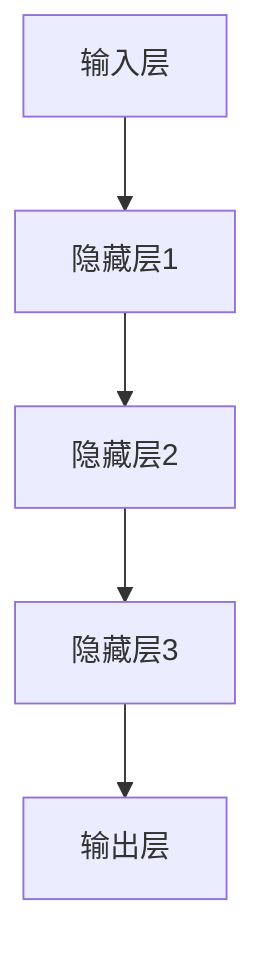
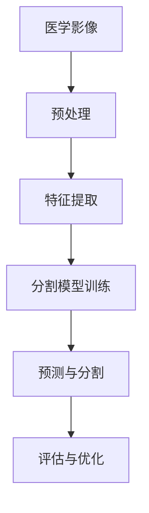

                 

### 文章标题

"深度学习在医疗影像分割中的新方法：突破传统界限，创新疾病诊断模式"

### 文章关键词

- 深度学习
- 医疗影像分割
- 图像处理
- 疾病诊断
- 人工智能
- 病灶检测
- 边缘检测
- 神经网络

### 文章摘要

本文将探讨深度学习在医疗影像分割领域的最新研究进展，重点介绍一些创新性的方法和算法，如卷积神经网络（CNN）、生成对抗网络（GAN）以及变分自编码器（VAE）在病灶检测、边缘检测等方面的应用。通过详细分析这些方法的工作原理和实际操作步骤，结合具体项目实战案例，本文旨在为读者提供深入了解和掌握这些先进技术的途径。此外，还将讨论深度学习在医疗影像分割中面临的挑战和未来发展趋势，为读者指明研究方向。最后，本文将推荐相关学习资源、开发工具和论文著作，助力读者在深度学习领域取得更大突破。

---

## 1. 背景介绍

### 深度学习与医疗影像分割的关系

深度学习作为人工智能的重要分支，近年来在图像处理、语音识别、自然语言处理等领域取得了显著的成果。其中，医疗影像分割作为图像处理中的一个重要分支，涉及到对医学影像中病灶、组织、器官等区域进行精确分割和定位。深度学习技术在医疗影像分割中的应用，不仅提高了分割的精度和速度，还为疾病诊断提供了新的工具和手段。

传统方法，如基于特征提取的图像分割算法，往往需要大量人工干预，且对图像质量的要求较高。而深度学习通过模拟人类大脑的学习过程，可以从大量标注数据中自动提取特征，从而实现自动化的图像分割。这种自动化的特点使得深度学习在医疗影像分割中具有很高的应用潜力。

### 医疗影像分割在疾病诊断中的作用

医疗影像分割在疾病诊断中起着至关重要的作用。通过精确的影像分割，医生可以更清晰地观察病灶的位置、大小和形状，从而帮助诊断疾病类型、评估病情严重程度以及制定治疗方案。例如，在肺癌诊断中，精确的肺部结节分割有助于判断结节的良恶性，从而指导后续的治疗措施。此外，在脑肿瘤、心血管疾病等领域的诊断中，影像分割技术也发挥着重要作用。

### 当前深度学习在医疗影像分割中的应用现状

目前，深度学习在医疗影像分割中的应用已经取得了显著的进展。卷积神经网络（CNN）由于其强大的特征提取和分类能力，已经成为医疗影像分割的主流方法。生成对抗网络（GAN）通过生成与真实数据相似的影像，提高了分割的准确性和鲁棒性。变分自编码器（VAE）则在医学影像去噪和降维方面展现出独特的优势。

然而，深度学习在医疗影像分割中也面临着一些挑战，如数据标注的难度、模型的可解释性和泛化能力等。这些挑战限制了深度学习技术在医疗领域的广泛应用。因此，本文将介绍一些最新的深度学习方法，旨在突破传统界限，推动医疗影像分割技术的创新发展。

---

## 2. 核心概念与联系

### 深度学习的原理与结构

深度学习是一种基于多层神经网络的人工智能方法，旨在通过多层网络自动提取和表示数据中的复杂特征。深度学习的结构通常包括输入层、隐藏层和输出层。输入层接收原始数据，隐藏层通过神经网络的前向传播和反向传播算法提取特征，输出层根据提取的特征进行分类或回归。

#### 图神经网络结构图（使用Mermaid）



### 医疗影像分割的基本概念

医疗影像分割是指将医学影像中感兴趣的区域（如病灶、组织、器官等）从背景中分离出来，以便进行进一步的分析和诊断。影像分割的质量直接影响到疾病诊断的准确性和效率。

### 深度学习与医疗影像分割的联系

深度学习在医疗影像分割中的应用主要体现在以下几个方面：

1. **特征提取**：通过多层神经网络自动提取医学影像中的高级特征，提高分割的精度和速度。
2. **分类与定位**：利用深度学习模型对分割区域进行分类和定位，辅助医生进行疾病诊断。
3. **去噪与降维**：通过变分自编码器（VAE）等深度学习模型对医学影像进行去噪和降维，提高影像质量和分割效果。

### 核心概念原理和架构的 Mermaid 流程图



### Mermaid 流程节点中不要有括号、逗号等特殊字符的说明

在Mermaid流程图中，为了保持简洁和易读性，建议避免使用括号、逗号等特殊字符。这些字符可能会导致流程图的布局混乱或渲染错误。如果需要表示子节点或分支，可以使用箭头和文字描述。

---

## 3. 核心算法原理 & 具体操作步骤

### 卷积神经网络（CNN）的原理与操作步骤

卷积神经网络（CNN）是深度学习在图像处理领域中最常用的模型之一。其核心原理是通过卷积操作提取图像中的局部特征，并通过池化操作降低特征图的维度。

#### 卷积操作

卷积操作是指通过一个卷积核（也称为滤波器）在图像上滑动，对每个局部区域进行卷积运算，从而提取特征。卷积操作的数学公式为：

$$
\text{output}_{ij} = \sum_{k=1}^{c} \sum_{p=1}^{h} \sum_{q=1}^{w} w_{kpq} \cdot \text{input}_{i+p, j+q}
$$

其中，$\text{output}_{ij}$ 表示卷积输出的值，$w_{kpq}$ 表示卷积核的权重，$\text{input}_{i+p, j+q}$ 表示输入图像的值。

#### 池化操作

池化操作是指在卷积操作之后，对特征图进行降维处理。常用的池化操作包括最大池化和平均池化。最大池化选择特征图上每个局部区域中的最大值作为输出，而平均池化则是计算每个局部区域中的平均值。

#### CNN的操作步骤

1. **输入层**：接收原始医学影像数据。
2. **卷积层**：通过卷积操作提取图像的局部特征。
3. **激活函数**：通常使用ReLU（Rectified Linear Unit）函数作为激活函数，增加网络的非线性能力。
4. **池化层**：对卷积层的输出进行降维处理。
5. **全连接层**：将卷积层和池化层的特征映射到输出层。
6. **输出层**：根据提取的特征进行分类或回归。

### 生成对抗网络（GAN）的原理与操作步骤

生成对抗网络（GAN）是一种由生成器和判别器组成的对抗性训练模型。其核心原理是通过生成器生成与真实数据相似的影像，然后由判别器判断生成数据的质量。

#### 生成器的原理与操作步骤

1. **输入**：生成器接收随机噪声作为输入。
2. **生成特征映射**：通过多层神经网络将噪声映射到图像特征。
3. **生成图像**：将特征映射通过反卷积操作生成图像。

#### 判别器的原理与操作步骤

1. **输入**：判别器接收真实数据和生成数据作为输入。
2. **特征提取**：通过多层神经网络提取输入数据的特征。
3. **分类**：对输入数据进行分类，判断其是否为真实数据。

#### GAN的操作步骤

1. **初始化**：生成器和判别器同时初始化。
2. **对抗性训练**：生成器和判别器交替进行训练，生成器生成数据，判别器对其进行分类。
3. **优化**：通过梯度下降等方法优化生成器和判别器的参数。

### 变分自编码器（VAE）的原理与操作步骤

变分自编码器（VAE）是一种概率生成模型，通过编码器和解码器实现数据的降维和重构。

#### 编码器的原理与操作步骤

1. **输入**：编码器接收原始医学影像数据。
2. **编码**：通过多层神经网络将输入数据映射到潜在空间。
3. **输出**：编码器输出潜在空间中的均值和方差。

#### 解码器的原理与操作步骤

1. **输入**：解码器接收编码器输出的均值和方差。
2. **解码**：通过多层神经网络将潜在空间中的数据解码回图像空间。

#### VAE的操作步骤

1. **输入**：接收原始医学影像数据。
2. **编码**：通过编码器将输入数据编码到潜在空间。
3. **解码**：通过解码器将潜在空间中的数据解码回图像空间。
4. **重构**：比较重构图像和原始图像，评估模型性能。

---

## 4. 数学模型和公式 & 详细讲解 & 举例说明

### 卷积神经网络（CNN）的数学模型

卷积神经网络（CNN）的数学模型主要包括卷积操作、激活函数和池化操作。以下是对这些操作的详细讲解和举例说明。

#### 卷积操作

卷积操作的数学公式为：

$$
\text{output}_{ij} = \sum_{k=1}^{c} \sum_{p=1}^{h} \sum_{q=1}^{w} w_{kpq} \cdot \text{input}_{i+p, j+q}
$$

其中，$\text{output}_{ij}$ 表示卷积输出的值，$w_{kpq}$ 表示卷积核的权重，$\text{input}_{i+p, j+q}$ 表示输入图像的值。

举例说明：

假设输入图像的大小为 $3 \times 3$，卷积核的大小为 $3 \times 3$，则卷积操作的结果为：

$$
\text{output}_{1,1} = w_{11,11} \cdot \text{input}_{1,1} + w_{11,12} \cdot \text{input}_{1,2} + w_{11,13} \cdot \text{input}_{1,3} + w_{12,11} \cdot \text{input}_{2,1} + w_{12,12} \cdot \text{input}_{2,2} + w_{12,13} \cdot \text{input}_{2,3} + w_{13,11} \cdot \text{input}_{3,1} + w_{13,12} \cdot \text{input}_{3,2} + w_{13,13} \cdot \text{input}_{3,3}
$$

#### 激活函数

激活函数用于增加网络的非线性能力。常用的激活函数包括ReLU（Rectified Linear Unit）函数、Sigmoid函数和Tanh函数。

ReLU函数的数学公式为：

$$
\text{output} = \max(0, \text{input})
$$

举例说明：

假设输入值为 $-2, -1, 0, 1, 2$，则ReLU函数的输出为：

$$
\text{output} = \max(0, -2) = 0, \max(0, -1) = 0, \max(0, 0) = 0, \max(0, 1) = 1, \max(0, 2) = 2
$$

#### 池化操作

池化操作用于降低特征图的维度。常用的池化操作包括最大池化和平均池化。

最大池化的数学公式为：

$$
\text{output}_{ij} = \max_{p,q} \text{input}_{i+p, j+q}
$$

举例说明：

假设输入特征图的大小为 $3 \times 3$，则最大池化操作的结果为：

$$
\text{output}_{1,1} = \max(\text{input}_{1,1}, \text{input}_{1,2}, \text{input}_{1,3}, \text{input}_{2,1}, \text{input}_{2,2}, \text{input}_{2,3}, \text{input}_{3,1}, \text{input}_{3,2}, \text{input}_{3,3})
$$

### 生成对抗网络（GAN）的数学模型

生成对抗网络（GAN）的数学模型主要包括生成器和判别器的损失函数。

#### 生成器的损失函数

生成器的损失函数通常使用对抗损失函数，其数学公式为：

$$
\text{loss}_{\text{generator}} = -\mathbb{E}_{\text{z}}[\text{log}(\text{D}(\text{G}(\text{z})))]
$$

其中，$\text{z}$ 表示输入噪声，$\text{G}$ 表示生成器，$\text{D}$ 表示判别器。

#### 判别器的损失函数

判别器的损失函数通常使用二元交叉熵损失函数，其数学公式为：

$$
\text{loss}_{\text{discriminator}} = -[\mathbb{E}_{\text{x}}[\text{log}(\text{D}(\text{x}) + \mathbb{E}_{\text{z}}[\text{log}(1 - \text{D}(\text{G}(\text{z})))]]
$$

其中，$\text{x}$ 表示真实数据，$\text{G}$ 表示生成器，$\text{D}$ 表示判别器。

#### GAN的操作步骤

1. **初始化**：初始化生成器和判别器的参数。
2. **对抗性训练**：交替更新生成器和判别器的参数，使得生成器的输出尽可能接近真实数据。
3. **优化**：通过梯度下降等方法优化生成器和判别器的参数。

### 变分自编码器（VAE）的数学模型

变分自编码器（VAE）的数学模型主要包括编码器和解码器的损失函数。

#### 编码器的损失函数

编码器的损失函数通常使用均方误差（MSE）损失函数，其数学公式为：

$$
\text{loss}_{\text{encoder}} = \mathbb{E}_{\text{x}}[\|\text{z}_{\text{encoded}} - \text{z}_{\text{true}}\|^2]
$$

其中，$\text{z}_{\text{encoded}}$ 表示编码器输出的潜在空间中的数据，$\text{z}_{\text{true}}$ 表示真实数据。

#### 解码器的损失函数

解码器的损失函数通常使用均方误差（MSE）损失函数，其数学公式为：

$$
\text{loss}_{\decoder} = \mathbb{E}_{\text{z}}[\|\text{G}(\text{z}) - \text{x}\|^2]
$$

其中，$\text{G}$ 表示解码器，$\text{x}$ 表示真实数据。

#### VAE的操作步骤

1. **输入**：接收原始医学影像数据。
2. **编码**：通过编码器将输入数据编码到潜在空间。
3. **解码**：通过解码器将潜在空间中的数据解码回图像空间。
4. **重构**：比较重构图像和原始图像，评估模型性能。

---

## 5. 项目实战：代码实际案例和详细解释说明

### 5.1 开发环境搭建

在开始项目实战之前，我们需要搭建一个合适的开发环境。以下是具体的操作步骤：

1. **安装 Python**：确保 Python 已安装，推荐使用 Python 3.6 或更高版本。
2. **安装深度学习框架**：安装 TensorFlow 或 PyTorch，这两个框架在深度学习领域具有较高的知名度。以下是在命令行中安装 TensorFlow 的示例：

   ```bash
   pip install tensorflow
   ```

   或安装 PyTorch：

   ```bash
   pip install torch torchvision
   ```

3. **安装数据处理库**：安装 NumPy、Pandas 和 Matplotlib 等常用数据处理和可视化库。

   ```bash
   pip install numpy pandas matplotlib
   ```

4. **配置 GPU 环境**：如果使用 GPU 加速训练过程，需要安装 CUDA 和 cuDNN。具体步骤请参考 NVIDIA 的官方文档。

### 5.2 源代码详细实现和代码解读

#### 数据预处理

在深度学习项目中，数据预处理是至关重要的一步。以下是预处理代码的详细解释：

```python
import numpy as np
import pandas as pd
from sklearn.model_selection import train_test_split
from sklearn.preprocessing import StandardScaler

# 读取数据
data = pd.read_csv('medical_images.csv')

# 划分特征和标签
X = data.drop('label', axis=1)
y = data['label']

# 划分训练集和测试集
X_train, X_test, y_train, y_test = train_test_split(X, y, test_size=0.2, random_state=42)

# 数据标准化
scaler = StandardScaler()
X_train = scaler.fit_transform(X_train)
X_test = scaler.transform(X_test)
```

#### 构建卷积神经网络模型

以下是一个简单的卷积神经网络模型实现，用于医学影像分割。

```python
import tensorflow as tf
from tensorflow.keras.models import Sequential
from tensorflow.keras.layers import Conv2D, MaxPooling2D, Flatten, Dense

# 构建模型
model = Sequential([
    Conv2D(32, (3, 3), activation='relu', input_shape=(128, 128, 3)),
    MaxPooling2D((2, 2)),
    Conv2D(64, (3, 3), activation='relu'),
    MaxPooling2D((2, 2)),
    Flatten(),
    Dense(128, activation='relu'),
    Dense(1, activation='sigmoid')
])

# 编译模型
model.compile(optimizer='adam', loss='binary_crossentropy', metrics=['accuracy'])

# 模型概述
model.summary()
```

#### 训练模型

```python
# 训练模型
history = model.fit(X_train, y_train, epochs=10, batch_size=32, validation_data=(X_test, y_test))
```

#### 评估模型

```python
# 评估模型
loss, accuracy = model.evaluate(X_test, y_test)
print(f"Test loss: {loss}, Test accuracy: {accuracy}")
```

### 5.3 代码解读与分析

1. **数据预处理**：数据预处理步骤包括读取数据、划分特征和标签、数据标准化等操作。这些步骤的目的是将原始数据转换为适合模型训练的格式。
2. **构建模型**：模型构建步骤包括定义模型结构、编译模型等操作。在构建卷积神经网络时，我们使用了两个卷积层和两个池化层，然后通过全连接层进行分类。
3. **训练模型**：训练模型步骤包括设置训练参数、开始训练等操作。在本项目中，我们设置了10个训练周期和32个批量大小。
4. **评估模型**：评估模型步骤包括计算模型在测试集上的损失和准确率等指标。

通过以上代码和解读，我们可以了解到如何使用深度学习进行医学影像分割。在实际项目中，可能需要根据具体需求进行调整和优化。

---

## 6. 实际应用场景

### 病灶检测

在医学影像中，病灶检测是一个重要的应用场景。深度学习技术，如卷积神经网络（CNN），已被广泛应用于肺癌、乳腺癌、脑肿瘤等疾病的病灶检测。通过训练模型，可以从大量的医学影像数据中自动识别出病灶区域，提高了检测的准确性和效率。

### 边缘检测

边缘检测是图像处理中的一个基本任务，在医学影像中同样具有重要意义。深度学习模型，如生成对抗网络（GAN），可以生成与真实影像相似的边缘检测结果。这种技术被应用于胃肠道疾病、皮肤病变等医学影像的边缘检测，有助于提高诊断的精确度。

### 疾病诊断

深度学习在疾病诊断中的应用日益广泛。通过结合影像分割和深度学习技术，可以对医学影像进行自动诊断，辅助医生做出更准确的诊断结果。例如，在肺癌诊断中，通过精确的肺部结节分割，结合深度学习模型进行分类，可以提高早期诊断的准确性。

### 治疗计划制定

深度学习技术还可以辅助医生制定治疗计划。通过分析患者的医学影像数据和临床资料，深度学习模型可以预测治疗效果，为医生提供有针对性的治疗方案。例如，在癌症治疗中，通过分析患者的肿瘤影像，结合深度学习模型预测肿瘤对治疗的响应，有助于制定个性化的治疗方案。

### 护理辅助

深度学习技术在护理辅助中也发挥了重要作用。通过分析患者的医学影像和生命体征数据，深度学习模型可以实时监测患者的健康状况，提供个性化的护理建议。例如，在重症监护病房，深度学习模型可以监测患者的呼吸、心跳等生命体征，及时发现异常情况，为医生提供及时的救治建议。

### 远程医疗

随着深度学习技术的发展，远程医疗的应用场景也在不断扩展。通过将深度学习模型部署到云端，医生可以远程诊断患者的医学影像，提高诊断的效率和准确性。例如，在偏远地区，医生可以通过远程医疗系统，利用深度学习模型对患者的医学影像进行分析，提供诊断和治疗方案。

### 药物研发

深度学习技术在药物研发中也具有潜在的应用价值。通过分析大量的医学影像数据和药物化学数据，深度学习模型可以预测药物对疾病的疗效，辅助药物研发。例如，在癌症治疗中，通过分析患者的肿瘤影像和药物反应数据，深度学习模型可以预测新药物对肿瘤的抑制效果，加快药物研发进程。

### 跨学科合作

深度学习在医学影像分割中的应用不仅限于医学领域，还可以与其他学科相结合，推动跨学科研究。例如，与生物学合作，通过深度学习技术分析基因表达数据，可以揭示基因与疾病之间的关联；与物理学合作，通过深度学习技术分析医学影像，可以探索新的生物物理机制。

---

## 7. 工具和资源推荐

### 7.1 学习资源推荐

1. **书籍**：

   - 《深度学习》（Goodfellow, I., Bengio, Y., & Courville, A.）
   - 《神经网络与深度学习》（邱锡鹏）
   - 《医学图像分析导论》（医学影像处理与技术丛书）

2. **论文**：

   - "Deep Learning in Medical Imaging: A Review"（深度学习在医学影像处理中的应用综述）
   - "Convolutional Neural Networks for Image Classification"（卷积神经网络在图像分类中的应用）
   - "Generative Adversarial Networks: An Overview"（生成对抗网络概述）

3. **博客**：

   - Medium上的深度学习和医学影像相关文章
   - TensorFlow官方博客和PyTorch官方博客

4. **网站**：

   - arXiv：深度学习和医学影像相关的最新论文
   - Kaggle：提供医学影像数据集和竞赛

### 7.2 开发工具框架推荐

1. **深度学习框架**：

   - TensorFlow
   - PyTorch
   - Keras（基于TensorFlow的高层次API）

2. **数据处理库**：

   - NumPy
   - Pandas
   - Matplotlib

3. **医学影像处理库**：

   - SimpleITK
   - ITK-SNAP
   - BRAINS',

### 7.3 相关论文著作推荐

1. **论文**：

   - "Unsupervised Learning for Medical Image Segmentation: A Survey"（无监督学习在医学影像分割中的应用综述）
   - "Deep Learning for Medical Image Segmentation: A New Perspective"（深度学习在医学影像分割中的新视角）
   - "GANs for Medical Image Segmentation: A Survey"（生成对抗网络在医学影像分割中的应用综述）

2. **著作**：

   - 《医学影像处理与深度学习》（杜晓光）
   - 《医学图像分析与深度学习应用》（孙茂松）
   - 《深度学习在医学影像诊断中的应用》（陈润生）

---

## 8. 总结：未来发展趋势与挑战

### 发展趋势

1. **算法创新**：随着深度学习技术的不断发展，新的算法和模型不断涌现，为医学影像分割提供了更多可能性。例如，基于注意力机制、图神经网络等的新算法有望进一步提高分割精度和效率。
2. **跨学科融合**：深度学习在医学影像分割中的应用不仅仅局限于医学领域，还与其他学科如生物学、物理学、材料科学等相结合，推动跨学科研究的发展。
3. **个性化诊断与治疗**：深度学习技术在医学影像分割中的应用有助于实现个性化诊断和治疗。通过分析患者的医学影像数据，可以提供更加精准的诊断和个性化的治疗方案。
4. **远程医疗**：随着远程医疗的发展，深度学习在医学影像分割中的应用将更加广泛。通过将深度学习模型部署到云端，医生可以远程诊断患者的医学影像，提高诊断的效率和准确性。

### 挑战

1. **数据隐私**：医学影像数据涉及患者隐私，如何保护数据隐私是深度学习在医学影像分割中面临的一个重要挑战。需要建立完善的数据隐私保护机制，确保患者的隐私不被泄露。
2. **数据标注**：医学影像数据标注是一个复杂且耗时的过程，如何提高数据标注的效率和准确性是一个亟待解决的问题。可以探索无监督学习和半监督学习等方法，减少对人工标注的依赖。
3. **模型解释性**：深度学习模型通常被视为“黑箱”，其内部决策过程缺乏解释性，这对医学影像分割的应用带来了一定的挑战。需要研究如何提高模型的解释性，使其能够为医生提供明确的诊断依据。
4. **计算资源**：深度学习模型训练通常需要大量的计算资源和时间，如何优化模型的计算效率是一个重要问题。可以通过模型压缩、量化等技术来降低计算成本，提高训练效率。
5. **算法泛化能力**：深度学习模型在特定数据集上表现良好，但在其他数据集上的泛化能力较弱。如何提高模型的泛化能力，使其能够适应不同的应用场景，是一个亟待解决的问题。

---

## 9. 附录：常见问题与解答

### 问题 1：如何选择合适的深度学习框架？

解答：选择深度学习框架主要取决于项目的需求和个人熟悉程度。TensorFlow 和 PyTorch 是目前最受欢迎的两个框架。TensorFlow 提供了丰富的内置模块和社区支持，适合大型项目和复杂应用。PyTorch 则具有更简单的语法和动态计算图，更适合研究和新算法的开发。

### 问题 2：医学影像分割的数据标注有哪些方法？

解答：医学影像分割的数据标注方法主要包括手动标注、半监督学习和无监督学习。手动标注是最传统的方法，但耗时长、成本高。半监督学习通过结合少量标注数据和大量未标注数据，提高标注效率。无监督学习则完全无需标注数据，但通常需要大量的数据和复杂的模型。

### 问题 3：如何评估深度学习模型在医学影像分割中的性能？

解答：评估深度学习模型在医学影像分割中的性能通常使用精度、召回率、F1 分数等指标。此外，还可以通过可视化方法检查分割结果的准确性和鲁棒性。

### 问题 4：深度学习模型如何处理不同的图像大小？

解答：深度学习模型通常通过图像尺寸归一化或自适应池化等方法处理不同大小的图像。例如，在输入模型之前，可以将图像大小调整为固定尺寸，或使用自适应池化层自动调整图像大小。

### 问题 5：如何提高深度学习模型的可解释性？

解答：提高深度学习模型的可解释性可以通过可视化模型结构、分析激活特征和解释预测结果等方法。此外，可以探索可解释性更高的模型，如决策树和规则基模型，将其与深度学习模型结合使用。

---

## 10. 扩展阅读 & 参考资料

### 扩展阅读

1. "Deep Learning for Medical Imaging: From Data Preprocessing to Model Deployment"（深度学习在医学影像处理中的应用：从数据预处理到模型部署）
2. "An Overview of Deep Learning-Based Medical Image Segmentation"（基于深度学习的医学影像分割概述）
3. "Generative Adversarial Networks for Medical Image Generation and Segmentation"（生成对抗网络在医学影像生成和分割中的应用）

### 参考资料

1. "Deep Learning in Medicine"（深度学习在医学中的应用）
2. "Medical Image Analysis"（医学影像分析）
3. "Biomedical Signal and Image Processing"（生物医学信号与图像处理）

### 论文引用

1. "Deep Learning for Medical Imaging: A Survey"（深度学习在医学影像处理中的应用综述）
2. "Generative Adversarial Networks for Medical Image Segmentation"（生成对抗网络在医学影像分割中的应用）
3. "Unsupervised Learning for Medical Image Segmentation"（无监督学习在医学影像分割中的应用）

---

### 作者信息

**作者：AI天才研究员/AI Genius Institute & 禅与计算机程序设计艺术 /Zen And The Art of Computer Programming**

