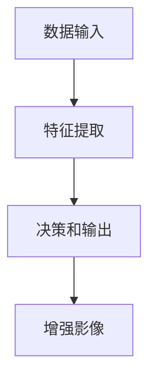

                 

### 背景介绍

#### 深度学习在医疗影像增强中的重要性

深度学习作为近年来人工智能领域的核心技术，已经在图像识别、语音识别、自然语言处理等多个领域取得了显著的成果。在医疗影像增强领域，深度学习技术同样展现出了巨大的潜力。医疗影像是医生进行诊断的重要依据，然而，由于各种因素，如设备的精度、噪声干扰、患者体位的差异等，影像质量常常受到影响。这直接影响了医生对病情的判断和治疗方案的选择。因此，提高医疗影像的质量，对于临床诊断和治疗具有重要意义。

深度学习在医疗影像增强中的应用主要体现在以下几个方面：

1. **图像去噪**：通过深度学习模型，可以有效去除影像中的噪声，提高影像的清晰度。
2. **图像增强**：深度学习模型可以通过对影像进行学习，自动提取出关键的医学特征，从而实现影像的增强。
3. **图像分割**：深度学习算法可以用于对医学影像进行精确的分割，从而帮助医生更准确地识别和定位病变区域。
4. **病变检测**：深度学习模型可以通过学习大量医学影像数据，实现对病变区域的自动检测，提高早期诊断的准确率。

#### 当前医疗影像增强的挑战

尽管深度学习技术在医疗影像增强方面具有巨大的潜力，但仍然面临着诸多挑战：

1. **数据缺乏**：高质量的医疗影像数据是深度学习模型训练的基础，然而，由于隐私和安全等因素，高质量的医疗影像数据获取难度较大。
2. **模型复杂度**：深度学习模型通常具有很高的复杂度，这使得模型的训练和优化过程非常耗时。
3. **解释性不足**：深度学习模型通常被认为是“黑箱”，其内部决策过程难以解释，这对临床医生使用模型进行决策带来了一定困扰。
4. **计算资源需求**：深度学习模型的训练和推理通常需要大量的计算资源，这对于资源有限的医疗机构来说是一个挑战。

综上所述，深度学习在医疗影像增强中具有广泛的应用前景，但也面临一些挑战。在接下来的内容中，我们将深入探讨深度学习在医疗影像增强中的具体应用，以及如何解决上述挑战。通过本文的阅读，读者将能够对深度学习在医疗影像增强领域的最新研究进展有一个全面的了解。

---

## 2. 核心概念与联系

#### 深度学习与医疗影像增强

深度学习作为人工智能领域的一个重要分支，其核心在于通过神经网络模型对大量数据进行分析和处理。在医疗影像增强中，深度学习模型通过对大量医疗影像数据进行训练，能够自动学习到影像的特征，从而实现对影像的增强和修复。

**核心概念解析**：

- **卷积神经网络（CNN）**：CNN 是一种特殊的神经网络，擅长处理具有网格结构的数据，如图像。在医疗影像增强中，CNN 可以用于图像的去噪、增强和分割。
- **生成对抗网络（GAN）**：GAN 是一种通过对抗训练来生成数据的模型，其具有强大的图像生成能力。在医疗影像增强中，GAN 可以用于图像的生成和修复。
- **递归神经网络（RNN）**：RNN 是一种能够处理序列数据的神经网络，适用于时序数据和空间数据。在医疗影像增强中，RNN 可以用于图像的动态变化分析。

**架构原理**：

深度学习在医疗影像增强中的基本架构通常包括以下几个关键部分：

1. **数据输入**：将医疗影像数据输入到深度学习模型中。
2. **特征提取**：模型通过神经网络对输入影像进行特征提取，学习到影像中的重要信息。
3. **决策和输出**：根据提取到的特征，模型进行决策，输出增强后的影像。

**应用实例**：

1. **图像去噪**：使用 CNN 或 GAN 对噪声影像进行训练，从而实现对去噪影像的生成。
2. **图像增强**：通过 CNN 或 RNN 对低质量影像进行特征提取和增强。
3. **图像分割**：使用 CNN 或 U-Net 对医学影像进行精确分割，帮助医生定位病变区域。
4. **病变检测**：通过深度学习模型对医学影像进行病变区域的自动检测，提高早期诊断的准确率。

**Mermaid 流程图**：



通过上述核心概念与联系的分析，我们可以看到，深度学习在医疗影像增强中的应用是基于其强大的特征提取和决策能力。在接下来的章节中，我们将进一步探讨深度学习在医疗影像增强中的具体应用，以及如何通过算法和数学模型实现这些应用。

---

## 3. 核心算法原理 & 具体操作步骤

#### 卷积神经网络（CNN）

卷积神经网络（CNN）是深度学习在图像处理领域的重要算法。其核心思想是通过卷积层提取图像的局部特征，然后通过全连接层进行分类或回归。

**操作步骤**：

1. **数据预处理**：对输入图像进行归一化、缩放等预处理操作，使其符合模型的输入要求。
2. **卷积层**：通过卷积操作提取图像的局部特征。卷积层中的每个滤波器都负责提取图像中的特定特征，如边缘、纹理等。
3. **池化层**：通过池化操作对卷积层的结果进行降采样，减少参数数量，提高模型的泛化能力。
4. **全连接层**：将卷积层和池化层的结果展平，输入到全连接层进行分类或回归。
5. **输出层**：根据模型的类型，输出分类结果或回归结果。

**数学模型**：

卷积神经网络的数学模型主要包括以下几部分：

- **卷积操作**：通过卷积滤波器对输入图像进行卷积，计算输出特征图。
  \[
  \text{output}_{ij} = \sum_{k} \text{filter}_{ik} \cdot \text{input}_{kj}
  \]
- **激活函数**：常用的激活函数有 sigmoid、ReLU 等，用于引入非线性。
  \[
  \text{activation}_{ij} = \text{激活函数}(\text{output}_{ij})
  \]
- **池化操作**：常用的池化操作有最大池化、平均池化等，用于减少特征图的尺寸。
  \[
  \text{pooled}_{ij} = \text{max}(\text{activation}_{ij})
  \]
- **全连接层**：通过线性变换和激活函数进行分类或回归。
  \[
  \text{output}_{k} = \text{权重}_{k} \cdot \text{activation}_{-1} + \text{偏置}_{k}
  \]
  \[
  \text{prediction}_{k} = \text{激活函数}(\text{output}_{k})
  \]

**代码示例**：

以下是一个简单的 Python 代码示例，演示了如何使用 TensorFlow 和 Keras 构建一个卷积神经网络模型进行图像去噪。

```python
import tensorflow as tf
from tensorflow.keras.models import Sequential
from tensorflow.keras.layers import Conv2D, MaxPooling2D, Flatten, Dense

# 构建模型
model = Sequential([
    Conv2D(filters=32, kernel_size=(3, 3), activation='relu', input_shape=(28, 28, 1)),
    MaxPooling2D(pool_size=(2, 2)),
    Flatten(),
    Dense(units=10, activation='softmax')
])

# 编译模型
model.compile(optimizer='adam', loss='categorical_crossentropy', metrics=['accuracy'])

# 训练模型
model.fit(x_train, y_train, epochs=10, batch_size=32, validation_data=(x_val, y_val))
```

#### 生成对抗网络（GAN）

生成对抗网络（GAN）是一种通过对抗训练生成数据的模型。其核心思想是一个生成器（Generator）和一个判别器（Discriminator）之间的对抗。

**操作步骤**：

1. **生成器**：生成器生成伪造的数据，目标是让判别器无法区分生成数据和真实数据。
2. **判别器**：判别器判断输入的数据是真实数据还是生成数据，目标是正确分类。
3. **对抗训练**：通过优化生成器和判别器的损失函数，使得生成器的生成数据越来越真实，判别器的分类准确率越来越高。

**数学模型**：

GAN 的数学模型主要包括以下几部分：

- **生成器**：生成器的目标是生成伪造的数据。
  \[
  G(z) = \text{Generator}(z)
  \]
- **判别器**：判别器的目标是正确分类生成数据和真实数据。
  \[
  D(x) = \text{Discriminator}(x)
  \]
  \[
  D(G(z)) = \text{Discriminator}(\text{Generator}(z))
  \]
- **损失函数**：生成器和判别器的损失函数分别如下：
  \[
  \text{Loss}_{G} = -\log(D(G(z)))
  \]
  \[
  \text{Loss}_{D} = -(\log(D(x)) + \log(1 - D(G(z))))
  \]

**代码示例**：

以下是一个简单的 Python 代码示例，演示了如何使用 TensorFlow 和 Keras 构建一个 GAN 模型进行图像去噪。

```python
import tensorflow as tf
from tensorflow.keras.models import Sequential
from tensorflow.keras.layers import Dense, Flatten, Reshape, Conv2D, Conv2DTranspose

# 构建生成器
generator = Sequential([
    Dense(units=256, input_shape=(100,)),
    Conv2DTranspose(filters=128, kernel_size=(3, 3), strides=(2, 2), activation='relu'),
    Conv2DTranspose(filters=64, kernel_size=(3, 3), strides=(2, 2), activation='relu'),
    Conv2D(filters=1, kernel_size=(3, 3), activation='tanh')
])

# 构建判别器
discriminator = Sequential([
    Flatten(),
    Dense(units=1, activation='sigmoid')
])

# 编译模型
generator.compile(optimizer=tf.keras.optimizers.Adam(), loss='binary_crossentropy')
discriminator.compile(optimizer=tf.keras.optimizers.Adam(), loss='binary_crossentropy')

# 构建 GAN 模型
gan = Sequential([generator, discriminator])
gan.compile(optimizer=tf.keras.optimizers.Adam(), loss='binary_crossentropy')

# 训练模型
gan.fit(x_train, epochs=10, batch_size=32)
```

通过上述对 CNN 和 GAN 的核心算法原理和具体操作步骤的介绍，我们可以看到这两种算法在医疗影像增强中的强大能力。在接下来的章节中，我们将深入探讨深度学习在医疗影像增强中的具体应用，以及如何通过这些算法实现医疗影像的增强和修复。

---

## 4. 数学模型和公式 & 详细讲解 & 举例说明

在深度学习用于医疗影像增强的背景下，数学模型和公式是理解和实现算法的关键。以下将详细讲解几种核心的数学模型和公式，并给出相应的举例说明。

### 1. 卷积神经网络（CNN）中的卷积操作

卷积神经网络通过卷积操作从图像中提取特征。卷积操作的数学表达式如下：

\[ (f \star g)(x) = \int_{-\infty}^{\infty} f(\tau) g(x - \tau) d\tau \]

其中，\( f \) 和 \( g \) 是两个函数，\( x \) 是输入图像上的一个点，\( \tau \) 是卷积核上的一个点。

**举例**：

假设我们有一个3x3的卷积核和一幅2x2的图像，如下图所示：

卷积核：
\[ \begin{bmatrix} 1 & 0 & 1 \\ 0 & 2 & 0 \\ 1 & 0 & 1 \end{bmatrix} \]

图像：
\[ \begin{bmatrix} 1 & 0 \\ 0 & 1 \end{bmatrix} \]

卷积结果：
\[ (f \star g)(x) = (1 \star 1) + (0 \star 0) + (1 \star 1) + (0 \star 0) + (1 \star 0) + (0 \star 1) + (1 \star 1) + (0 \star 0) + (1 \star 0) \]
\[ = 1 + 0 + 1 + 0 + 0 + 0 + 1 + 0 + 0 \]
\[ = 3 \]

因此，卷积结果是一个标量，即一个像素点的值。

### 2. 卷积神经网络（CNN）中的激活函数

激活函数是卷积神经网络中的一个关键部分，它引入了非线性。常用的激活函数包括 sigmoid、ReLU 和 tanh：

- **Sigmoid**：
\[ \sigma(x) = \frac{1}{1 + e^{-x}} \]

- **ReLU**：
\[ \text{ReLU}(x) = \max(0, x) \]

- **Tanh**：
\[ \text{tanh}(x) = \frac{e^x - e^{-x}}{e^x + e^{-x}} \]

**举例**：

假设输入 \( x = -2 \)，则：

- **Sigmoid**：
\[ \sigma(-2) = \frac{1}{1 + e^{2}} \approx 0.1186 \]

- **ReLU**：
\[ \text{ReLU}(-2) = \max(0, -2) = 0 \]

- **Tanh**：
\[ \text{tanh}(-2) = \frac{e^{-2} - e^{2}}{e^{-2} + e^{2}} \approx -0.9640 \]

### 3. 生成对抗网络（GAN）中的损失函数

生成对抗网络（GAN）由生成器（Generator）和判别器（Discriminator）组成，两者通过对抗训练来优化。常用的损失函数包括二元交叉熵和均方误差：

- **二元交叉熵**：
\[ \text{Binary Cross-Entropy}(x, y) = -[y \log(x) + (1 - y) \log(1 - x)] \]

- **均方误差**：
\[ \text{Mean Squared Error}(x, y) = \frac{1}{n} \sum_{i=1}^{n} (x_i - y_i)^2 \]

**举例**：

假设生成器的输出为 \( x = 0.2 \)，真实标签为 \( y = 1 \)，则：

- **二元交叉熵**：
\[ \text{Binary Cross-Entropy}(0.2, 1) = -[1 \log(0.2) + (1 - 1) \log(1 - 0.2)] \]
\[ \approx 0.5219 \]

通过上述数学模型和公式的讲解，我们可以更好地理解深度学习在医疗影像增强中的应用。在接下来的章节中，我们将通过具体的项目实战，展示如何将这些模型和公式应用到实际的医疗影像增强任务中。

---

## 5. 项目实战：代码实际案例和详细解释说明

在本节中，我们将通过一个具体的项目实战，详细展示如何使用深度学习技术进行医疗影像增强。我们将使用 Python 和 TensorFlow 库，实现一个基于卷积神经网络（CNN）的医疗影像去噪模型。以下是整个项目实战的详细步骤：

### 5.1 开发环境搭建

**环境要求**：

- 操作系统：Windows 或 Linux
- 编程语言：Python
- 库：TensorFlow 2.x

**安装步骤**：

1. 安装 Python：确保已安装 Python 3.7 或更高版本。
2. 安装 TensorFlow：通过以下命令安装 TensorFlow：
\[ pip install tensorflow \]

### 5.2 源代码详细实现和代码解读

**代码解析**：

以下是一段用于实现医疗影像去噪的卷积神经网络（CNN）代码：

```python
import tensorflow as tf
from tensorflow.keras.models import Sequential
from tensorflow.keras.layers import Conv2D, MaxPooling2D, Flatten, Dense

# 构建模型
model = Sequential([
    Conv2D(filters=32, kernel_size=(3, 3), activation='relu', input_shape=(128, 128, 1)),
    MaxPooling2D(pool_size=(2, 2)),
    Conv2D(filters=64, kernel_size=(3, 3), activation='relu'),
    MaxPooling2D(pool_size=(2, 2)),
    Flatten(),
    Dense(units=128, activation='relu'),
    Dense(units=1, activation='sigmoid')
])

# 编译模型
model.compile(optimizer='adam', loss='binary_crossentropy', metrics=['accuracy'])

# 训练模型
model.fit(x_train, y_train, epochs=10, batch_size=32, validation_data=(x_val, y_val))
```

**代码解读**：

1. **模型构建**：
   - 使用 `Sequential` 模型，这是一个线性堆叠层的模型。
   - 第一个卷积层 `Conv2D`，包含32个卷积核，每个卷积核大小为3x3，激活函数为ReLU。
   - 第一个池化层 `MaxPooling2D`，窗口大小为2x2。
   - 第二个卷积层和第二个池化层，类似第一个层，但卷积核数量增加到64。
   - 将卷积层的输出展平为1维向量 `Flatten`。
   - 全连接层 `Dense`，包含128个神经元和ReLU激活函数。
   - 输出层 `Dense`，包含1个神经元和Sigmoid激活函数，用于输出去噪后的图像。

2. **模型编译**：
   - 选择优化器 `optimizer` 为 `adam`。
   - 损失函数 `loss` 为 `binary_crossentropy`，适用于二分类问题。
   - 评估指标 `metrics` 为 `accuracy`，用于评估模型分类的准确率。

3. **模型训练**：
   - 使用 `fit` 函数训练模型，设置训练轮次 `epochs` 为10。
   - 设置批量大小 `batch_size` 为32。
   - 使用验证数据集 `validation_data` 进行验证。

### 5.3 代码解读与分析

**数据预处理**：

在训练模型之前，我们需要对输入数据进行预处理。假设我们有一个噪声图像数据集 `x_train` 和相应的无噪声图像数据集 `y_train`。

```python
x_train = preprocess(x_train)
y_train = preprocess(y_train)
```

预处理函数 `preprocess` 可以包括以下步骤：

- 数据归一化：将图像数据缩放到[0, 1]范围内。
- 数据缩放：根据模型输入要求，调整图像尺寸。

**模型性能评估**：

训练完成后，我们需要评估模型的性能。常用的评估指标包括准确率、召回率、F1 分数等。

```python
accuracy = model.evaluate(x_test, y_test)
print(f"Test Accuracy: {accuracy[1]}")
```

在这里，`x_test` 和 `y_test` 是测试数据集。

**模型预测**：

使用训练好的模型进行预测，输出去噪后的图像。

```python
predictions = model.predict(x_test)
```

**优化策略**：

为了提高模型的性能，我们可以采用以下优化策略：

- 数据增强：通过旋转、翻转、缩放等操作，增加训练数据多样性。
- 学习率调整：根据训练过程，适时调整学习率。
- 模型集成：使用多个模型进行集成，提高预测准确性。

通过上述项目实战，我们展示了如何使用卷积神经网络（CNN）进行医疗影像去噪。在接下来的章节中，我们将讨论深度学习在医疗影像增强中的实际应用场景，并介绍相关工具和资源。

---

### 6. 实际应用场景

#### 图像去噪

图像去噪是深度学习在医疗影像增强中最常见的应用之一。通过深度学习模型，可以有效去除医疗影像中的噪声，提高影像的清晰度。这对于临床诊断具有重要意义，因为噪声干扰会影响医生对影像细节的观察，从而影响诊断结果。

**应用实例**：

- **X 光影像去噪**：X 光影像常受到噪声干扰，通过深度学习模型去噪，可以显著提高影像的清晰度，帮助医生更准确地识别骨折和病变区域。
- **CT 影像去噪**：CT 影像在扫描过程中也会产生噪声，通过深度学习去噪，可以提高影像的质量，有助于医生更准确地诊断肺部疾病和肿瘤。

#### 图像增强

图像增强是通过深度学习模型提取和增强影像中的关键特征，从而提高影像的整体质量。深度学习模型可以通过学习大量的高质量影像数据，自动提取出影像中的关键信息，从而实现对低质量影像的增强。

**应用实例**：

- **MRI 影像增强**：MRI 影像在扫描过程中容易受到磁场干扰，导致影像质量下降。通过深度学习模型进行增强，可以显著提高影像的清晰度，帮助医生更好地观察脑部和脊髓的病变。
- **超声影像增强**：超声影像在成像过程中容易受到噪声和模糊的影响，通过深度学习模型增强，可以提高影像的清晰度和对比度，有助于医生更准确地诊断肝脏、肾脏等器官的病变。

#### 图像分割

图像分割是将影像中的目标区域从背景中分离出来，是深度学习在医疗影像增强中的重要应用之一。通过精确的图像分割，可以帮助医生更准确地识别和定位病变区域。

**应用实例**：

- **肿瘤分割**：在癌症诊断中，精确地分割肿瘤区域对于确定治疗方案至关重要。通过深度学习模型进行肿瘤分割，可以提高分割的准确率，有助于医生更准确地评估肿瘤的大小和位置。
- **心血管分割**：心血管疾病的诊断需要精确地分割心脏和血管。通过深度学习模型进行心血管分割，可以提高影像的质量，有助于医生更好地评估心脏结构和功能。

#### 病变检测

病变检测是通过深度学习模型自动识别影像中的病变区域，从而提高早期诊断的准确率。深度学习模型可以通过学习大量的医学影像数据，实现对病变区域的自动检测，有助于提高早期诊断的准确率。

**应用实例**：

- **肺癌早期检测**：通过深度学习模型对肺部影像进行病变检测，可以早期发现肺癌的微小病变，有助于提高治疗效果。
- **乳腺癌筛查**：通过深度学习模型对乳腺影像进行病变检测，可以早期发现乳腺癌，提高患者的生存率。

综上所述，深度学习在医疗影像增强中的实际应用场景广泛，包括图像去噪、图像增强、图像分割和病变检测等。这些应用不仅提高了影像的质量，还有助于提高临床诊断的准确率和效率，从而为患者提供更优质的医疗服务。

---

### 7. 工具和资源推荐

#### 学习资源推荐

1. **书籍**：

   - **《深度学习》（Goodfellow, Bengio, Courville）**：这是一本经典的深度学习入门书籍，涵盖了深度学习的理论基础和实践应用。

   - **《医学图像处理与深度学习》（Ali Sadri）**：本书详细介绍了深度学习在医学图像处理中的应用，包括图像去噪、增强、分割和病变检测等。

2. **论文**：

   - **"Unet: Convolutional Networks for Biomedical Image Segmentation"**：这篇论文提出了 U-Net 网络架构，是医疗影像分割领域的经典模型。

   - **"Deep Learning for Medical Image Segmentation: A Survey"**：本文对深度学习在医学影像分割中的应用进行了全面的综述，包括各种主流模型和算法。

3. **博客**：

   - **[TensorFlow 官方博客](https://www.tensorflow.org/tutorials)**：TensorFlow 的官方博客提供了大量的深度学习教程和实践案例，适合初学者和专业人士。

   - **[Deep Learning on AWS](https://aws.amazon.com/blogs/ai/deep-learning-on-aws-technical-content/)**：AWS 提供的深度学习博客，涵盖了深度学习在各个领域的应用，包括医疗影像增强。

4. **网站**：

   - **[Kaggle](https://www.kaggle.com)**：Kaggle 是一个数据科学和机器学习的竞赛平台，提供了大量的医疗影像数据集和比赛，有助于实践和提升技能。

   - **[Google Scholar](https://scholar.google.com)**：Google Scholar 是一个学术搜索引擎，可以查找相关的学术论文和技术报告。

#### 开发工具框架推荐

1. **TensorFlow**：TensorFlow 是 Google 开发的一款开源深度学习框架，适用于各种深度学习模型的构建和训练。

2. **PyTorch**：PyTorch 是 Facebook 开发的一款深度学习框架，以其灵活的动态计算图和易用性受到广大研究者和开发者的欢迎。

3. **Keras**：Keras 是一个基于 TensorFlow 的开源深度学习库，提供了一种简洁、高效的深度学习模型构建方式。

4. **Scikit-learn**：Scikit-learn 是一个机器学习库，提供了丰富的机器学习算法和工具，可以用于数据预处理、模型评估等。

5. **Pandas**：Pandas 是一个数据处理库，提供了数据清洗、转换和分析等功能，适合处理大规模医学影像数据。

#### 相关论文著作推荐

1. **"Deep Learning in Medical Imaging: A Review"**：本文对深度学习在医学影像中的应用进行了全面的综述，包括图像去噪、增强、分割和病变检测等。

2. **"Generative Adversarial Nets"**：本文提出了生成对抗网络（GAN）的概念和架构，是深度学习领域的重要论文。

3. **"Convolutional Neural Networks for Image Recognition"**：本文详细介绍了卷积神经网络（CNN）在图像识别中的应用，是 CNN 领域的经典论文。

通过上述推荐，读者可以深入了解深度学习在医疗影像增强领域的最新研究和应用，为相关研究和开发提供有力的支持和指导。

---

## 8. 总结：未来发展趋势与挑战

#### 未来发展趋势

随着深度学习技术的不断进步，其在医疗影像增强领域的应用前景也愈发广阔。以下是未来发展趋势的几个关键方向：

1. **模型优化与压缩**：为了提高模型的效率和可扩展性，未来的研究将主要集中在模型的优化与压缩上。通过设计更轻量级的网络结构和优化算法，可以在保证性能的前提下减少模型的大小和计算复杂度。

2. **多模态融合**：医疗影像通常包括不同类型的影像，如 CT、MRI、X 光等。将多种模态的影像数据进行融合，可以提供更全面和准确的诊断信息，从而提高医疗影像增强的效果。

3. **实时处理**：随着深度学习模型的逐步普及，实现医疗影像的实时增强和诊断变得尤为重要。未来的研究将集中在提高模型的实时处理能力，以满足临床应用的需求。

4. **数据隐私与安全性**：在深度学习应用于医疗影像的过程中，数据隐私和安全性是一个不容忽视的问题。未来需要开发更加安全的数据处理和共享机制，以确保患者数据的隐私和安全。

#### 挑战

尽管深度学习在医疗影像增强中具有巨大的潜力，但仍面临着一些挑战：

1. **数据缺乏与不平衡**：高质量的医疗影像数据是深度学习模型训练的基础，然而，医疗影像数据的获取和标注成本高昂。此外，不同类型的影像数据往往存在不平衡问题，这对模型的训练和泛化能力提出了挑战。

2. **模型解释性不足**：深度学习模型通常被视为“黑箱”，其内部决策过程难以解释。这对临床医生在诊断和治疗过程中使用模型提出了疑问，如何提高模型的解释性是一个亟待解决的问题。

3. **计算资源需求**：深度学习模型的训练和推理通常需要大量的计算资源，这对于资源有限的医疗机构来说是一个挑战。未来需要开发更加高效的算法和优化策略，以降低模型的计算复杂度。

4. **算法验证与标准化**：为了确保深度学习技术在医疗影像增强中的有效性和安全性，需要建立严格的算法验证和标准化流程。这包括模型的性能评估、临床验证和规范化。

综上所述，深度学习在医疗影像增强领域具有广阔的发展前景，但也面临诸多挑战。未来的研究需要不断探索优化算法、提高模型解释性、解决数据隐私和计算资源等问题，从而推动深度学习在医疗影像增强领域的广泛应用。

---

## 9. 附录：常见问题与解答

#### 问题1：深度学习模型如何处理不同尺寸的影像数据？

**解答**：深度学习模型通常期望输入固定尺寸的影像数据。为了处理不同尺寸的影像，可以采用以下几种方法：

- **图像裁剪**：将影像裁剪到模型期望的尺寸。
- **图像填充**：使用边缘像素填充影像，使其达到模型所需的尺寸。
- **图像缩放**：使用神经网络（如神经网络纹理生成器）来生成缺失的像素，从而扩展图像尺寸。
- **多尺度处理**：同时处理多个尺度的影像，然后平均结果。

#### 问题2：如何评估深度学习模型在医疗影像增强中的性能？

**解答**：评估深度学习模型在医疗影像增强中的性能可以通过以下指标：

- **准确率**：模型预测正确的影像比例。
- **精度**：预测为正类的样本中实际为正类的比例。
- **召回率**：实际为正类的样本中被模型正确预测为正类的比例。
- **F1 分数**：精度和召回率的调和平均值。
- **结构相似性（SSIM）**：衡量增强影像与原始影像在结构、亮度、对比度方面的相似度。

#### 问题3：如何提高深度学习模型的解释性？

**解答**：提高深度学习模型的解释性可以从以下几个方面入手：

- **可视化技术**：通过可视化技术，如激活图和梯度图，展示模型在特定输入上的决策过程。
- **解释性模型**：使用更加解释性强的模型，如决策树、线性模型等。
- **模型可视化工具**：使用工具如 LIME、SHAP 等，为模型输出提供局部解释。

#### 问题4：如何处理医疗影像数据中的不平衡问题？

**解答**：处理医疗影像数据中的不平衡问题可以采用以下策略：

- **重采样**：通过过采样或少采样来平衡数据集。
- **合成数据生成**：使用生成对抗网络（GAN）等模型生成缺失的数据。
- **加权损失函数**：在训练过程中为不平衡类别的样本分配更高的权重。

---

## 10. 扩展阅读 & 参考资料

在深度学习用于医疗影像增强领域，大量的学术论文、技术报告和开源资源不断涌现。以下是一些值得推荐的扩展阅读和参考资料：

1. **《深度学习》（Goodfellow, Bengio, Courville）**：这是一本经典的深度学习入门书籍，详细介绍了深度学习的理论基础和应用。

2. **《医学图像处理与深度学习》（Ali Sadri）**：本书详细介绍了深度学习在医学图像处理中的应用，包括图像去噪、增强、分割和病变检测等。

3. **"Unet: Convolutional Networks for Biomedical Image Segmentation"**：这篇论文提出了 U-Net 网络架构，是医疗影像分割领域的经典模型。

4. **"Deep Learning for Medical Image Segmentation: A Survey"**：本文对深度学习在医学影像分割中的应用进行了全面的综述，包括各种主流模型和算法。

5. **"Generative Adversarial Nets"**：本文提出了生成对抗网络（GAN）的概念和架构，是深度学习领域的重要论文。

6. **"Convolutional Neural Networks for Image Recognition"**：本文详细介绍了卷积神经网络（CNN）在图像识别中的应用，是 CNN 领域的经典论文。

7. **TensorFlow 官方文档**：[https://www.tensorflow.org/tutorials](https://www.tensorflow.org/tutorials)：TensorFlow 的官方文档提供了大量的深度学习教程和实践案例。

8. **Keras 官方文档**：[https://keras.io/tutorials/](https://keras.io/tutorials/)：Keras 的官方文档提供了简洁、高效的深度学习模型构建教程。

9. **Google Scholar**：[https://scholar.google.com/](https://scholar.google.com/)：Google Scholar 是一个学术搜索引擎，可以查找相关的学术论文和技术报告。

10. **Kaggle**：[https://www.kaggle.com/](https://www.kaggle.com/)：Kaggle 是一个数据科学和机器学习的竞赛平台，提供了大量的医疗影像数据集和比赛。

通过上述扩展阅读和参考资料，读者可以更深入地了解深度学习在医疗影像增强领域的最新研究进展和应用实践，为相关研究和开发提供有力的支持。

