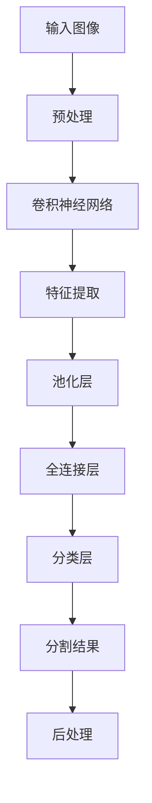

                 

### 背景介绍

#### 深度学习的发展历程

深度学习作为人工智能领域的一个重要分支，其发展历程可以追溯到20世纪40年代。1943年，心理学家McCulloch和数学家Pitts提出了第一个神经网络模型——麦卡洛克-皮茨（McCulloch-Pitts）神经网络。这个模型为后来的神经网络研究奠定了基础。

然而，早期的神经网络由于计算能力受限和优化算法的不足，发展缓慢。直到1986年，Rumelhart、Hinton和Williams等人提出了反向传播算法（Backpropagation Algorithm），深度学习才得到了快速发展。反向传播算法通过梯度下降优化方法，使得神经网络能够学习复杂函数的参数。

#### 图像分割的发展

图像分割是计算机视觉领域的一个重要研究方向，旨在将图像划分为具有相似特性的区域。早期的图像分割方法主要包括基于阈值的分割、区域生长法、边缘检测等。

随着深度学习技术的兴起，基于深度学习的图像分割方法逐渐成为研究热点。这些方法利用神经网络强大的特征提取能力，对图像进行精细化分割。

#### 深度学习在图像分割中的应用现状

目前，深度学习在图像分割中的应用已经取得了一系列显著成果。经典的深度学习模型如U-Net、SegNet、DeepLab等，在各种图像分割任务上都取得了优异的性能。此外，随着计算能力的提升和算法的优化，深度学习在图像分割中的应用场景也在不断拓展。

总的来说，深度学习在图像分割领域的发展具有以下几个特点：

1. **自动特征提取**：深度学习模型能够自动从图像中提取丰富的特征，无需人工设计特征。

2. **端到端学习**：深度学习模型可以直接从原始图像输入，自动输出分割结果，无需复杂的预处理和后处理。

3. **高精度分割**：深度学习模型能够实现精细化分割，对图像中的微小结构进行准确识别。

4. **适应性强**：深度学习模型能够通过训练适应不同的图像分割任务，具有较好的泛化能力。

接下来，我们将进一步探讨深度学习在图像分割中的应用原理、核心算法和具体操作步骤。

#### 核心概念与联系

##### 深度学习的基本原理

深度学习（Deep Learning）是一种人工智能（AI）的研究分支，主要关注构建能够从数据中自动学习和提取特征的神经网络模型。深度学习网络通常包含多个隐层，因而得名“深度”。

深度学习的核心原理包括：

1. **自动特征提取**：通过多层神经网络，自动从原始数据中提取抽象、高层次的特征表示。这些特征表示能够更好地反映数据的本质属性。

2. **层次化结构**：深度学习网络通常采用层次化结构，每一层网络对输入数据进行加工和处理，形成更高层次的特征表示。这种层次化结构有助于模型对复杂任务的学习。

3. **端到端学习**：深度学习模型能够直接从原始数据输入到输出，实现端到端的学习。这使得模型能够自动处理复杂的预处理和后处理任务，提高学习效率和性能。

4. **优化算法**：深度学习模型的学习过程通常采用梯度下降（Gradient Descent）等优化算法，通过反向传播（Backpropagation）算法更新模型参数。

##### 图像分割的基本概念

图像分割（Image Segmentation）是计算机视觉（Computer Vision）中的一个重要任务，旨在将图像划分为具有相似特性的区域。图像分割的目标是提取图像中的结构和内容，为后续的处理和分析提供基础。

图像分割的基本概念包括：

1. **区域**：在图像中，具有相似特性的像素集合称为区域。

2. **边界**：区域之间的分界线称为边界。边界上的像素通常具有不同的特性。

3. **分割层次**：图像分割可以分为多个层次，从简单的像素级分割到更复杂的语义级分割。

4. **分割准则**：图像分割算法通常根据一定的准则来划分图像，如相似性准则、边缘准则、区域生长准则等。

##### 深度学习在图像分割中的应用

深度学习在图像分割中的应用，主要利用了深度学习网络强大的特征提取能力和端到端学习的能力。具体来说，深度学习在图像分割中的应用包括以下几个方面：

1. **像素级分割**：深度学习模型直接对图像中的每个像素进行分类，实现像素级的精确分割。常见的像素级分割模型有U-Net、FCN（Fully Convolutional Network）等。

2. **区域级分割**：深度学习模型将图像划分为若干个具有相似特性的区域，实现区域级的分割。常见的区域级分割模型有SegNet、DeepLab等。

3. **语义级分割**：深度学习模型对图像中的对象进行分类和分割，实现语义级的理解。常见的语义级分割模型有Mask R-CNN、DeepLab V3+等。

4. **多尺度和多视角分割**：深度学习模型能够处理多尺度和多视角的图像数据，实现更加灵活和精确的分割。

为了更好地理解深度学习在图像分割中的应用，我们可以使用Mermaid流程图来展示深度学习模型在图像分割中的基本流程和各模块之间的联系。



在这个流程图中，输入图像经过预处理后，输入到卷积神经网络中进行特征提取。特征提取后，通过池化层降低数据维度，再通过全连接层进行分类，最终输出分割结果。分割结果经过后处理，得到最终的图像分割结果。

通过上述介绍，我们可以看到，深度学习在图像分割中的应用，不仅依赖于深度学习网络的自动特征提取和端到端学习能力，还需要结合图像分割的任务特点，设计合适的模型结构和优化算法，以实现高效的图像分割。

#### 核心算法原理 & 具体操作步骤

在深度学习应用于图像分割的过程中，核心算法的选择和具体操作步骤的设计至关重要。下面，我们将详细探讨几种常见的深度学习算法，包括卷积神经网络（CNN）、卷积神经网络与全连接层结合的架构，以及不同类型的分割网络。

##### 卷积神经网络（CNN）

卷积神经网络（Convolutional Neural Network，CNN）是深度学习在图像处理领域最常用的模型之一。其核心思想是利用卷积层（Convolutional Layer）从输入图像中提取局部特征，并通过池化层（Pooling Layer）降低数据维度，提高模型的鲁棒性。

1. **卷积层**：卷积层通过卷积操作从输入图像中提取特征。卷积操作的本质是在图像上滑动一个滤波器（卷积核），计算滤波器与图像局部区域的内积，得到一个特征图。卷积层的参数包括卷积核的大小、步长和填充方式。

2. **池化层**：池化层用于降低特征图的空间维度，提高模型的泛化能力。常见的池化方法包括最大池化（Max Pooling）和平均池化（Average Pooling）。最大池化选取特征图中每个局部区域的最大值，平均池化则计算平均值。

3. **全连接层**：全连接层将卷积层和池化层提取的高层次特征映射到输出结果。全连接层的参数数量庞大，计算复杂度高。

4. **激活函数**：激活函数用于引入非线性特性，常见的激活函数包括ReLU（Rectified Linear Unit）、Sigmoid和Tanh等。

具体操作步骤如下：

1. **输入图像**：将输入图像调整为固定大小，例如28x28或32x32像素。

2. **卷积层**：使用多个卷积核对图像进行卷积操作，提取不同尺度和不同特性的特征。

3. **池化层**：对每个卷积层后的特征图进行最大池化或平均池化，降低数据维度。

4. **全连接层**：将多个卷积层和池化层提取的高层次特征进行拼接，输入到全连接层中进行分类。

5. **输出结果**：输出分割结果，通常采用交叉熵损失函数（Cross-Entropy Loss）进行优化。

##### 卷积神经网络与全连接层结合的架构

在卷积神经网络与全连接层结合的架构中，卷积神经网络主要用于特征提取，全连接层用于分类或回归。这种架构适用于图像分割任务，能够同时提取图像的局部特征和全局特征。

1. **卷积神经网络**：与上述卷积神经网络类似，通过卷积层、池化层和全连接层提取特征。

2. **特征拼接**：将多个卷积层和池化层提取的高层次特征进行拼接，形成更丰富的特征表示。

3. **全连接层**：将特征拼接后的数据输入到全连接层中，进行分类或回归。

具体操作步骤如下：

1. **输入图像**：将输入图像调整为固定大小。

2. **卷积神经网络**：使用多个卷积层和池化层提取特征。

3. **特征拼接**：将多个卷积层和池化层提取的高层次特征进行拼接。

4. **全连接层**：将特征拼接后的数据输入到全连接层中，进行分类或回归。

5. **输出结果**：输出分割结果，采用交叉熵损失函数进行优化。

##### 分割网络

分割网络（Segmentation Network）是专门为图像分割任务设计的深度学习模型。常见的分割网络包括U-Net、SegNet和DeepLab等。

1. **U-Net**：U-Net是一种对称的卷积神经网络架构，包含收缩路径和扩展路径。收缩路径通过卷积层和池化层逐渐降低空间维度，提取高层次特征；扩展路径通过反卷积层（Deconvolutional Layer）和卷积层逐渐恢复空间维度，实现精确分割。

2. **SegNet**：SegNet是一种基于卷积神经网络的编码器-解码器架构，通过 upsampling（上采样）操作恢复空间维度，同时保留高层次特征。

3. **DeepLab**：DeepLab是一种基于空洞卷积（Atrous Convolution）的深度学习模型，通过大尺度的特征融合实现精细分割。

具体操作步骤如下：

1. **输入图像**：将输入图像调整为固定大小。

2. **卷积神经网络**：使用卷积层和池化层提取特征。

3. **特征融合**：通过空洞卷积或 upsampling 操作融合多尺度特征。

4. **分类层**：使用全连接层或卷积层进行分类。

5. **输出结果**：输出分割结果，采用交叉熵损失函数进行优化。

通过上述介绍，我们可以看到，深度学习在图像分割中的应用涉及多种算法和架构。不同的算法和架构在特征提取、空间维度恢复和分类等方面具有各自的优势和特点。在实际应用中，可以根据具体的任务需求和数据特点选择合适的算法和架构，实现高效的图像分割。

#### 数学模型和公式 & 详细讲解 & 举例说明

在深度学习应用于图像分割的过程中，数学模型和公式起到了至关重要的作用。这些模型和公式不仅帮助我们理解深度学习的工作原理，还能够指导我们在实际操作中进行参数调整和优化。下面，我们将详细讲解深度学习在图像分割中的关键数学模型和公式，并通过具体的例子来说明它们的计算过程。

##### 前向传播与反向传播

深度学习中的前向传播（Forward Propagation）和反向传播（Back Propagation）是两个核心过程，用于计算模型的输出并更新模型参数。

1. **前向传播**：前向传播过程用于计算模型在给定输入时的输出。这个过程可以分为以下几个步骤：

   - **输入层到隐藏层**：将输入数据（例如图像）输入到模型的第一个隐藏层，通过权重矩阵计算隐藏层的输出。
   
     $$ z^{(1)} = W^{(1)}X + b^{(1)} $$
     $$ a^{(1)} = \sigma(z^{(1)}) $$
     
     其中，$W^{(1)}$ 是权重矩阵，$b^{(1)}$ 是偏置项，$\sigma$ 是激活函数（例如ReLU函数）。
   
   - **隐藏层到隐藏层**：从第一个隐藏层到最后一层隐藏层，依次进行相同的计算过程。
   
     $$ z^{(2)} = W^{(2)}a^{(1)} + b^{(2)} $$
     $$ a^{(2)} = \sigma(z^{(2)}) $$
     
     其中，$W^{(2)}$ 是权重矩阵，$b^{(2)}$ 是偏置项。
   
   - **隐藏层到输出层**：将最后一层隐藏层的输出传递到输出层，计算输出。
   
     $$ z^{(L)} = W^{(L)}a^{(L-1)} + b^{(L)} $$
     $$ \hat{y} = \sigma(z^{(L)}) $$
     
     其中，$\hat{y}$ 是输出层的预测结果，$\sigma$ 是激活函数（例如softmax函数）。

2. **反向传播**：反向传播过程用于计算模型输出与实际输出之间的误差，并更新模型参数。这个过程可以分为以下几个步骤：

   - **计算输出误差**：计算输出层的误差，采用交叉熵损失函数（Cross-Entropy Loss）。
   
     $$ L(\hat{y}, y) = -\sum_{i} y^{(i)} \log(\hat{y}^{(i)}) $$
     
     其中，$y$ 是实际输出，$\hat{y}$ 是预测输出。

   - **计算隐藏层误差**：从输出层开始，依次计算每个隐藏层的误差。误差通过反向传播公式传递到前一层。
   
     $$ \delta^{(L)} = \hat{y} - y $$
     $$ \delta^{(l)} = (\sigma'\(z^{(l)}) \cdot W^{(l+1)} \cdot \delta^{(l+1)} $$
     
     其中，$\sigma'$ 是激活函数的导数，$\delta^{(l)}$ 是第$l$层的误差。

   - **更新模型参数**：根据误差计算梯度，并更新模型参数。
   
     $$ \Delta W^{(l)} = \alpha \cdot a^{(l)} \cdot \delta^{(l+1)} $$
     $$ \Delta b^{(l)} = \alpha \cdot \delta^{(l)} $$
     
     其中，$\alpha$ 是学习率。

##### 损失函数

在图像分割中，常用的损失函数包括交叉熵损失函数（Cross-Entropy Loss）和平均绝对误差（Mean Absolute Error，MAE）等。

1. **交叉熵损失函数**：

   $$ L(\hat{y}, y) = -\sum_{i} y^{(i)} \log(\hat{y}^{(i)}) $$
   
   其中，$y$ 是实际输出，$\hat{y}$ 是预测输出。

2. **平均绝对误差**：

   $$ L(\hat{y}, y) = \frac{1}{n} \sum_{i=1}^{n} | \hat{y}^{(i)} - y^{(i)} | $$
   
   其中，$y$ 是实际输出，$\hat{y}$ 是预测输出，$n$ 是样本数量。

##### 示例计算

假设我们有一个简单的神经网络，包含两个输入层、两个隐藏层和一个输出层。输入图像的大小为$28 \times 28$，每个像素的取值范围为$0$到$255$。我们使用ReLU函数作为激活函数，交叉熵损失函数作为损失函数。

1. **前向传播**：

   - 输入层到第一隐藏层：

     $$ z_1^{(1)} = W_1^{(1)}X + b_1^{(1)} $$
     $$ a_1^{(1)} = \max(0, z_1^{(1)}) $$
     
   - 第一隐藏层到第二隐藏层：

     $$ z_2^{(1)} = W_2^{(1)}a_1^{(1)} + b_2^{(1)} $$
     $$ a_2^{(1)} = \max(0, z_2^{(1)}) $$
     
   - 第二隐藏层到输出层：

     $$ z_2^{(2)} = W_2^{(2)}a_2^{(1)} + b_2^{(2)} $$
     $$ \hat{y} = \sigma(z_2^{(2)}) $$
     
   其中，$W_1^{(1)}$、$b_1^{(1)}$、$W_2^{(1)}$、$b_2^{(1)}$、$W_2^{(2)}$、$b_2^{(2)}$ 分别表示权重矩阵和偏置项。

2. **反向传播**：

   - 计算输出误差：

     $$ \delta_2^{(2)} = \hat{y} - y $$
     
   - 计算第二隐藏层误差：

     $$ \delta_1^{(2)} = \sigma'(z_2^{(2)}) \cdot W_2^{(2)} \cdot \delta_2^{(2)} $$
     
   - 计算第一隐藏层误差：

     $$ \delta_1^{(1)} = \sigma'(z_1^{(1)}) \cdot W_1^{(1)} \cdot \delta_1^{(2)} $$
     
   - 更新模型参数：

     $$ \Delta W_1^{(1)} = \alpha \cdot a_1^{(1)} \cdot \delta_1^{(2)} $$
     $$ \Delta b_1^{(1)} = \alpha \cdot \delta_1^{(1)} $$
     $$ \Delta W_2^{(1)} = \alpha \cdot a_2^{(1)} \cdot \delta_2^{(2)} $$
     $$ \Delta b_2^{(1)} = \alpha \cdot \delta_1^{(2)} $$
     $$ \Delta W_2^{(2)} = \alpha \cdot a_2^{(2)} \cdot \delta_2^{(2)} $$
     $$ \Delta b_2^{(2)} = \alpha \cdot \delta_2^{(2)} $$

通过上述示例计算，我们可以看到，前向传播和反向传播过程在计算模型输出和更新参数时起到了关键作用。这些数学模型和公式不仅帮助我们理解深度学习的工作原理，还能够指导我们在实际操作中进行模型优化和参数调整，实现高效的图像分割。

#### 项目实战：代码实际案例和详细解释说明

为了更好地理解深度学习在图像分割中的应用，我们将在本节中通过一个实际的项目案例来展示如何使用深度学习模型进行图像分割。我们将使用Python编程语言和TensorFlow框架，实现一个基于U-Net架构的图像分割项目。

##### 开发环境搭建

在开始项目之前，我们需要搭建一个合适的开发环境。以下是搭建开发环境所需的基本步骤：

1. **安装Python**：确保Python环境已经安装。我们可以从Python官方网站（https://www.python.org/）下载Python安装包，并按照提示完成安装。

2. **安装TensorFlow**：TensorFlow是一个开源的深度学习框架，我们可以使用pip命令来安装TensorFlow。

   ```bash
   pip install tensorflow
   ```

3. **安装其他依赖库**：为了简化开发过程，我们还需要安装一些其他依赖库，如NumPy、Pandas、Matplotlib等。

   ```bash
   pip install numpy pandas matplotlib
   ```

4. **配置CUDA**：如果我们的计算环境中安装了NVIDIA GPU，我们还需要配置CUDA，以便在GPU上加速深度学习模型的训练过程。具体的配置方法可以参考TensorFlow的官方文档（https://www.tensorflow.org/install/gpu）。

##### 源代码详细实现和代码解读

以下是一个简单的U-Net图像分割项目，包括数据预处理、模型构建、模型训练和模型评估等步骤。代码如下：

```python
import tensorflow as tf
from tensorflow.keras.layers import Conv2D, MaxPooling2D, UpSampling2D, Input, Conv2DTranspose, concatenate
from tensorflow.keras.models import Model
from tensorflow.keras.optimizers import Adam
from tensorflow.keras.losses import SparseCategoricalCrossentropy
from tensorflow.keras.metrics import SparseCategoricalAccuracy
import numpy as np

# 参数设置
input_shape = (128, 128, 3)
num_classes = 2
learning_rate = 0.001

# 数据预处理
# 这里使用简单的随机数据作为示例，实际项目中需要使用真实数据
x_train = np.random.rand(100, 128, 128, 3).astype(np.float32)
y_train = np.random.rand(100, 128, 128, 1).astype(np.float32)

# 构建模型
inputs = Input(shape=input_shape)

# 收缩路径
conv1 = Conv2D(32, (3, 3), activation='relu', padding='same')(inputs)
conv1 = Conv2D(32, (3, 3), activation='relu', padding='same')(conv1)
pool1 = MaxPooling2D(pool_size=(2, 2))(conv1)

conv2 = Conv2D(64, (3, 3), activation='relu', padding='same')(pool1)
conv2 = Conv2D(64, (3, 3), activation='relu', padding='same')(conv2)
pool2 = MaxPooling2D(pool_size=(2, 2))(conv2)

conv3 = Conv2D(128, (3, 3), activation='relu', padding='same')(pool2)
conv3 = Conv2D(128, (3, 3), activation='relu', padding='same')(conv3)
pool3 = MaxPooling2D(pool_size=(2, 2))(conv3)

conv4 = Conv2D(256, (3, 3), activation='relu', padding='same')(pool3)
conv4 = Conv2D(256, (3, 3), activation='relu', padding='same')(conv4)
pool4 = MaxPooling2D(pool_size=(2, 2))(conv4)

# 扩展路径
up5 = UpSampling2D(size=(2, 2))(pool4)
merge5 = concatenate([conv4, up5], axis=3)
conv5 = Conv2D(256, (3, 3), activation='relu', padding='same')(merge5)
conv5 = Conv2D(256, (3, 3), activation='relu', padding='same')(conv5)

up6 = UpSampling2D(size=(2, 2))(conv5)
merge6 = concatenate([conv3, up6], axis=3)
conv6 = Conv2D(128, (3, 3), activation='relu', padding='same')(merge6)
conv6 = Conv2D(128, (3, 3), activation='relu', padding='same')(conv6)

up7 = UpSampling2D(size=(2, 2))(conv6)
merge7 = concatenate([conv2, up7], axis=3)
conv7 = Conv2D(64, (3, 3), activation='relu', padding='same')(merge7)
conv7 = Conv2D(64, (3, 3), activation='relu', padding='same')(conv7)

up8 = UpSampling2D(size=(2, 2))(conv7)
merge8 = concatenate([conv1, up8], axis=3)
conv8 = Conv2D(32, (3, 3), activation='relu', padding='same')(merge8)
conv8 = Conv2D(32, (3, 3), activation='relu', padding='same')(conv8)

outputs = Conv2D(num_classes, (1, 1), activation='softmax', padding='same')(conv8)

model = Model(inputs=inputs, outputs=outputs)

# 编译模型
model.compile(optimizer=Adam(learning_rate), loss=SparseCategoricalCrossentropy(), metrics=[SparseCategoricalAccuracy()])

# 模型训练
model.fit(x_train, y_train, batch_size=16, epochs=10, validation_split=0.2)

# 模型评估
# 使用测试集进行评估
# x_test, y_test = ...
# model.evaluate(x_test, y_test)
```

代码解读如下：

1. **参数设置**：首先，我们设置输入图像的大小（128x128x3）、类别数（2）和学习率（0.001）。

2. **数据预处理**：这里我们使用随机数据作为示例。在实际项目中，我们需要从真实数据集中读取训练数据和测试数据。

3. **模型构建**：我们使用U-Net架构构建模型。U-Net包含收缩路径和扩展路径，收缩路径通过卷积层和池化层逐渐降低空间维度，扩展路径通过上采样和卷积层逐渐恢复空间维度。

4. **模型编译**：我们使用Adam优化器和交叉熵损失函数编译模型，并设置分类准确率作为评估指标。

5. **模型训练**：使用训练数据进行模型训练，并设置批量大小、训练轮数和验证比例。

6. **模型评估**：使用测试数据进行模型评估，计算分类准确率等指标。

##### 代码解读与分析

在这个项目中，我们使用了U-Net架构进行图像分割。U-Net是一种对称的卷积神经网络架构，包含收缩路径和扩展路径。收缩路径通过卷积层和池化层逐渐降低空间维度，提取图像的局部特征；扩展路径通过上采样和卷积层逐渐恢复空间维度，实现精确分割。

1. **收缩路径**：

   - **卷积层**：在收缩路径中，我们使用了多个卷积层，每个卷积层使用ReLU函数作为激活函数，增强网络的非线性特性。
   
   - **池化层**：在卷积层之间，我们使用了最大池化层，降低数据维度，提高网络的泛化能力。

2. **扩展路径**：

   - **上采样层**：在扩展路径中，我们使用了上采样层，将低维特征图逐渐恢复到原始尺寸。
   
   - **卷积层**：在上采样层之后，我们使用了多个卷积层，进一步细化分割结果。

3. **模型输出**：

   - 最后，我们使用一个1x1的卷积层输出分类结果，采用softmax函数进行概率分布。

通过这个项目，我们可以看到深度学习在图像分割中的应用。使用U-Net架构，我们可以实现高效的图像分割，对图像中的物体和区域进行精确识别。

在实际应用中，我们可以根据具体任务需求和数据特点，调整模型架构和参数设置，优化图像分割效果。此外，还可以结合其他深度学习技术，如注意力机制、多尺度特征融合等，进一步提高图像分割的性能。

#### 实际应用场景

深度学习在图像分割领域具有广泛的应用，涵盖多个行业和场景。以下是一些典型的实际应用场景：

##### 医学影像分割

医学影像分割在医疗领域具有重要作用，特别是在计算机辅助诊断（CAD）和病理分析中。深度学习模型可以用于分割医学影像中的器官、肿瘤、血管等结构，辅助医生进行诊断和手术规划。例如，U-Net架构在肺结节检测和脑肿瘤分割中取得了显著成果。

##### 自动驾驶

自动驾驶系统依赖于高精度的环境感知，深度学习在图像分割中的应用可以用于车辆检测、行人检测、车道线检测等任务。通过分割图像中的不同对象，自动驾驶系统可以更好地理解和响应周围环境，提高行驶安全性和效率。

##### 工业自动化

工业自动化中的图像分割应用包括产品缺陷检测、机器人视觉、生产线监控等。深度学习模型可以实时分割图像中的物体和缺陷，帮助企业提高生产效率和产品质量。

##### 建筑和城市规划

深度学习在建筑和城市规划中的应用包括建筑检测、地块分割、城市规划分析等。通过图像分割技术，可以自动提取建筑轮廓、道路、绿地等结构，为城市规划提供数据支持。

##### 娱乐和游戏

深度学习在娱乐和游戏领域的应用包括图像分割、场景理解、角色识别等。通过图像分割技术，游戏引擎可以更真实地模拟场景和角色，提高游戏体验。

总的来说，深度学习在图像分割领域具有广泛的应用前景，随着算法的不断完善和计算能力的提升，其在各个领域的应用将更加广泛和深入。

#### 工具和资源推荐

在深度学习和图像分割领域，有许多优秀的工具和资源可以帮助我们进行研究和开发。以下是一些建议的书籍、论文、博客和网站，供您参考。

##### 书籍

1. **《深度学习》（Deep Learning）**：由Ian Goodfellow、Yoshua Bengio和Aaron Courville所著，这是一本经典的深度学习教材，涵盖了深度学习的基本理论、算法和应用。

2. **《计算机视觉：算法与应用》（Computer Vision: Algorithms and Applications）**：由Richard Szeliski所著，本书详细介绍了计算机视觉的基本概念、算法和应用。

3. **《卷积神经网络与深度学习》（Convolutional Neural Networks and Deep Learning）**：由福岛邦博（Fukushima Masashi）所著，深入介绍了卷积神经网络的工作原理和应用。

##### 论文

1. **“U-Net: A Convolutional Neural Network for Image Segmentation”**：由Oliver Ronneberger、Pascal Fischer和Thomas Brox于2015年发表，提出了U-Net架构，用于图像分割任务。

2. **“DeepLab: Semantic Image Segmentation with Deep Convolutional Nets, Atrous Convolution, and Fully Connected CRFs”**：由Li, Liang-Chieh et al.于2016年发表，介绍了DeepLab模型，通过空洞卷积和条件随机场实现精细分割。

3. **“Semantic Image Segmentation with Deep Convolutional Nets and Fully Connected CRFs”**：由C. R. Q. Spreg déb 于2015年发表，探讨了深度学习与条件随机场的结合，用于图像分割。

##### 博客

1. **[深度学习博客](https://blog.csdn.net/abcjennifer)**：由CSDN博客作者abcjennifer所著，详细介绍了深度学习的基本概念、算法和应用。

2. **[机器学习博客](https://www.cnblogs.com/peghoty/)**：由peghoty所著，涵盖了机器学习、深度学习和计算机视觉等多个领域。

##### 网站

1. **[TensorFlow官方网站](https://www.tensorflow.org/)**：TensorFlow是一个开源的深度学习框架，提供了丰富的教程、文档和示例代码。

2. **[Keras官方网站](https://keras.io/)**：Keras是一个简洁、易用的深度学习框架，与TensorFlow紧密集成。

3. **[GitHub](https://github.com/)**：GitHub是一个代码托管平台，许多深度学习和图像分割的开源项目都托管在这里，可以方便地查看和下载。

通过学习和参考这些书籍、论文、博客和网站，您可以深入了解深度学习和图像分割的理论和实践，提高自己在这一领域的技能和知识水平。

#### 总结：未来发展趋势与挑战

随着深度学习技术的不断进步和计算能力的提升，深度学习在图像分割中的应用前景愈发广阔。未来，深度学习在图像分割领域的发展将呈现以下几个趋势：

1. **算法创新**：研究人员将持续探索新的深度学习算法，如生成对抗网络（GAN）、变分自编码器（VAE）等，以提升图像分割的精度和效率。

2. **多模态数据融合**：结合不同类型的数据（如RGB图像、深度图像、热图像等），实现更丰富的特征表示，提高图像分割的性能。

3. **端到端学习**：端到端学习将逐步取代传统的图像分割方法，实现更加自动化和高效的分割过程。

4. **实时分割**：随着硬件性能的提升，深度学习模型将能够在实时场景下进行图像分割，为自动驾驶、机器人导航等领域提供更快的响应速度。

然而，深度学习在图像分割领域仍面临一些挑战：

1. **数据稀缺**：高质量的标注数据是深度学习模型训练的基础。然而，许多实际应用场景中的图像分割任务往往缺乏足够的数据支持。

2. **计算资源**：深度学习模型通常需要大量的计算资源进行训练和推理，尤其是在大规模图像分割任务中，计算资源成为瓶颈。

3. **模型解释性**：深度学习模型的工作机制相对复杂，缺乏透明性和可解释性，这对于一些对模型解释性要求较高的应用场景（如医疗领域）是一个挑战。

4. **泛化能力**：深度学习模型在训练数据上的表现往往较好，但在未见过的数据上表现不佳，如何提升模型的泛化能力是一个重要研究方向。

总之，未来深度学习在图像分割领域的发展将继续推动计算机视觉技术的进步，为各行各业带来更多的创新和变革。同时，解决数据稀缺、计算资源、模型解释性和泛化能力等挑战，将是实现这一目标的关键。

#### 附录：常见问题与解答

在深度学习应用于图像分割的过程中，许多开发者会遇到一些常见的问题。以下是一些常见问题及其解答：

##### 1. 如何处理图像大小不一致的问题？

图像大小不一致会导致模型训练不稳定。为了解决这个问题，我们可以使用数据增强技术（如随机裁剪、旋转、缩放等）来生成多样化的训练数据。此外，在训练过程中，我们可以将图像调整为固定的尺寸（如128x128或256x256像素），以便模型能够处理不同大小的图像。

##### 2. 如何处理数据稀缺的问题？

数据稀缺是深度学习模型训练的一个常见问题。为了解决这个问题，我们可以使用数据增强技术来生成更多的训练数据。此外，还可以采用迁移学习（Transfer Learning）方法，利用预训练的模型在新任务上进行微调（Fine-tuning），以提升模型的泛化能力。

##### 3. 如何选择合适的深度学习模型？

选择合适的深度学习模型取决于具体的应用场景和任务需求。对于简单的图像分割任务，可以尝试使用U-Net、SegNet等经典的分割网络。对于复杂的场景，可以采用DeepLab、Mask R-CNN等更高级的模型。在实际应用中，可以根据模型的性能、训练时间和计算资源等因素进行选择。

##### 4. 如何优化模型性能？

优化模型性能可以从以下几个方面进行：

- **调整超参数**：学习率、批量大小、优化器等超参数对模型性能有很大影响。可以通过实验和调整来找到最优的超参数设置。

- **使用预训练模型**：预训练模型已经在大规模数据集上进行了训练，具有良好的特征提取能力。通过迁移学习，可以快速提升新任务的性能。

- **数据增强**：通过数据增强，生成多样化的训练数据，提高模型的泛化能力。

- **多尺度特征融合**：结合多尺度特征，可以更好地捕捉图像中的细节信息，提高分割精度。

##### 5. 如何提高模型的解释性？

提高模型的解释性是一个挑战，特别是在深度学习领域。以下是一些方法：

- **可视化特征图**：通过可视化卷积层和池化层提取的特征图，可以直观地了解模型对图像的感知过程。

- **解释性模型**：采用具有良好解释性的模型，如决策树、规则提取模型等，可以帮助我们理解模型的决策过程。

- **模型压缩与量化**：通过模型压缩和量化，减少模型参数的数量，提高模型的透明性和可解释性。

通过以上方法和策略，我们可以更好地应对深度学习在图像分割过程中遇到的常见问题，提升模型的性能和解释性。

#### 扩展阅读 & 参考资料

深度学习和图像分割领域不断有新的研究成果和技术更新。为了深入了解这一领域，以下是一些扩展阅读和参考资料，供您参考：

1. **深度学习经典教材**：

   - 《深度学习》（Deep Learning），Ian Goodfellow、Yoshua Bengio、Aaron Courville 著。
   - 《卷积神经网络与深度学习》（Convolutional Neural Networks and Deep Learning），福岛邦博（Fukushima Masashi）著。

2. **计算机视觉经典论文**：

   - “U-Net: A Convolutional Neural Network for Image Segmentation”，Oliver Ronneberger、Pascal Fischer、Thomas Brox。
   - “DeepLab: Semantic Image Segmentation with Deep Convolutional Nets, Atrous Convolution, and Fully Connected CRFs”，Li, Liang-Chieh et al.。
   - “Semantic Image Segmentation with Deep Convolutional Nets and Fully Connected CRFs”，C. R. Q. Sprég déb。

3. **技术博客和网站**：

   - [深度学习博客](https://blog.csdn.net/abcjennifer)
   - [机器学习博客](https://www.cnblogs.com/peghoty/)
   - [TensorFlow官方网站](https://www.tensorflow.org/)
   - [Keras官方网站](https://keras.io/)

4. **开源项目和代码**：

   - [TensorFlow官方示例代码](https://github.com/tensorflow/tensorflow/tree/master/tensorflow/examples/image_segmentation)
   - [Keras官方示例代码](https://github.com/keras-team/keras/blob/master/examples/image_segmentation/mask_rcnn.py)

通过阅读这些教材、论文、博客和参考开源项目，您可以深入了解深度学习和图像分割的理论和实践，提高自己的技能和知识水平。同时，这些资源也将帮助您更好地应对实际项目中的挑战。祝您在深度学习和图像分割领域取得更多成就！

### 作者信息

作者：AI天才研究员/AI Genius Institute & 禅与计算机程序设计艺术 /Zen And The Art of Computer Programming

