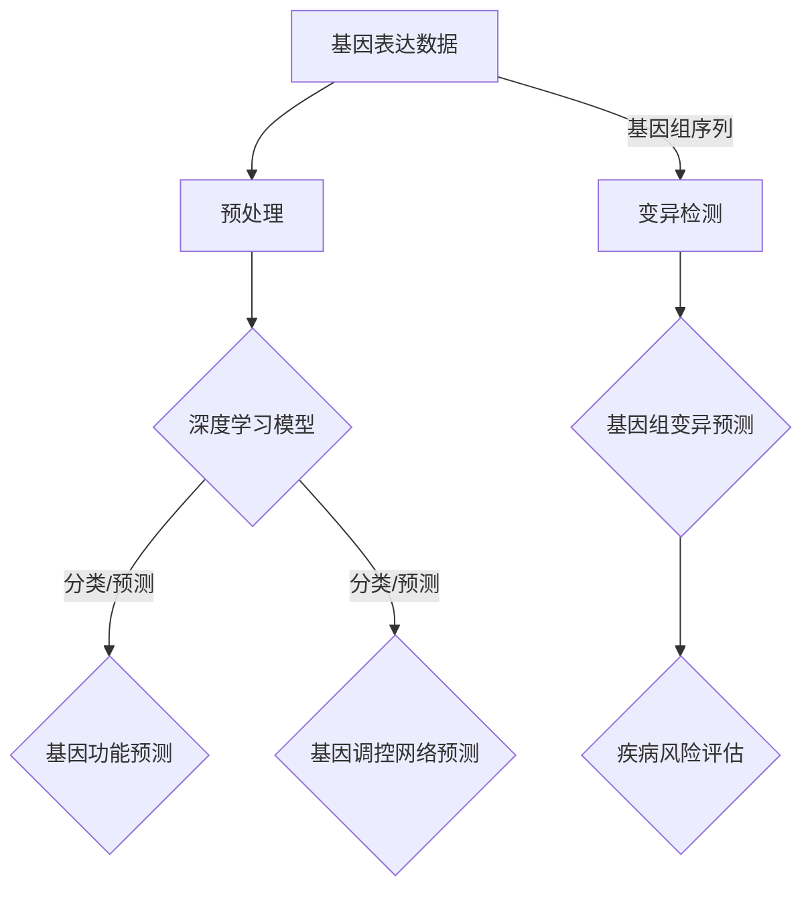

                 

# 深度学习在基因组学中的创新应用

## 关键词：深度学习，基因组学，基因表达，基因组变异，生物信息学，人工智能

## 摘要

本文将深入探讨深度学习在基因组学领域的创新应用，包括基因表达预测、基因组变异检测和疾病风险评估等方面。通过对核心概念的剖析和具体实例的讲解，我们将揭示深度学习技术在基因组学研究中的潜力，并展望其未来的发展趋势与挑战。

## 1. 背景介绍

基因组学是生物学中的一个重要分支，旨在研究生物体的遗传信息和基因功能。随着高通量测序技术的不断发展，基因组数据量呈现指数级增长，这使得传统方法在处理和分析这些数据时面临巨大挑战。与此同时，深度学习作为一种强大的机器学习技术，近年来在图像识别、自然语言处理等领域取得了显著成果。将深度学习应用于基因组学，有望解决传统方法难以应对的复杂性问题，推动基因组学研究的发展。

### 1.1 基因组学的研究领域

基因组学研究主要包括以下领域：

1. **基因表达分析**：研究基因在不同细胞类型、不同生理状态下的表达模式，以揭示基因功能及其调控机制。
2. **基因组变异检测**：识别基因组中的变异，如单核苷酸变异（SNV）、插入缺失（Indel）等，以研究疾病的遗传基础。
3. **基因组注释**：对基因组序列进行注释，识别基因、非编码RNA、转录因子结合位点等。
4. **进化分析**：研究不同物种之间的基因组差异，探究生物进化的规律。

### 1.2 传统基因组学分析方法

传统基因组学分析方法主要包括：

1. **序列比对**：通过将待分析序列与参考序列进行比对，识别相同或相似的序列区域。
2. **隐马尔可夫模型（HMM）**：用于识别基因组中的转录因子结合位点、外显子等。
3. **贝叶斯统计方法**：用于基因组变异检测和基因表达预测等。

尽管传统方法在基因组学研究中发挥了重要作用，但面对大规模数据和高维度特征时，其性能受到限制。

### 1.3 深度学习在基因组学中的应用前景

深度学习具有以下优点，使其在基因组学中具有广泛的应用前景：

1. **自动特征提取**：深度学习模型能够自动从原始数据中提取具有区分度的特征，减少人工干预。
2. **处理高维度数据**：深度学习模型能够有效处理高维度数据，提高预测和分类的准确性。
3. **并行计算能力**：深度学习模型能够利用并行计算技术，加速数据处理和分析过程。

## 2. 核心概念与联系

### 2.1 深度学习的核心概念

深度学习是一种基于人工神经网络的学习方法，其核心思想是通过多层非线性变换，从原始数据中提取层次化的特征表示。深度学习模型通常包括以下几个关键组成部分：

1. **输入层**：接收原始数据，如基因组序列、基因表达数据等。
2. **隐藏层**：对输入数据进行非线性变换，提取具有区分度的特征。
3. **输出层**：根据隐藏层输出的特征，进行分类、预测等任务。

### 2.2 基因组学的核心概念

基因组学涉及以下几个核心概念：

1. **基因表达**：基因在细胞中的转录和翻译过程，产生功能性蛋白质。
2. **基因组变异**：基因组序列中的变化，包括单核苷酸变异（SNV）、插入缺失（Indel）等。
3. **基因调控**：基因表达的调控机制，涉及转录因子、增强子、启动子等。

### 2.3 深度学习与基因组学的联系

深度学习与基因组学的联系主要体现在以下几个方面：

1. **基因表达预测**：利用深度学习模型，从基因表达数据中预测基因的功能和调控网络。
2. **基因组变异检测**：利用深度学习模型，从基因组序列中识别变异位点，提高检测精度。
3. **疾病风险评估**：利用深度学习模型，分析基因表达和基因组变异与疾病之间的关系，进行疾病风险评估。

### 2.4 Mermaid 流程图

以下是一个用于描述深度学习在基因组学中应用的 Mermaid 流程图：



## 3. 核心算法原理 & 具体操作步骤

### 3.1 基因表达预测

#### 3.1.1 算法原理

基因表达预测是基因组学中的一个重要任务，通过预测基因在不同细胞类型、不同生理状态下的表达水平，有助于揭示基因功能及其调控机制。深度学习模型在基因表达预测中发挥着关键作用，其原理如下：

1. **自动特征提取**：深度学习模型能够从基因表达数据中自动提取具有区分度的特征，减少人工干预。
2. **层次化特征表示**：通过多层神经网络，深度学习模型能够将原始数据表示为层次化的特征表示，提高预测准确性。
3. **非线性变换**：深度学习模型中的非线性变换，有助于捕捉基因表达数据中的复杂关系。

#### 3.1.2 具体操作步骤

1. **数据预处理**：对基因表达数据进行归一化、缺失值填充等预处理操作。
2. **模型构建**：选择合适的深度学习模型，如卷积神经网络（CNN）或循环神经网络（RNN）。
3. **模型训练**：利用训练数据集，对深度学习模型进行训练，优化模型参数。
4. **模型评估**：利用测试数据集，评估模型在基因表达预测任务上的性能。
5. **模型应用**：将训练好的模型应用于新数据，进行基因表达预测。

### 3.2 基因组变异检测

#### 3.2.1 算法原理

基因组变异检测是识别基因组中变异位点的重要任务，有助于研究疾病的遗传基础。深度学习模型在基因组变异检测中具有以下优势：

1. **自动特征提取**：深度学习模型能够从基因组序列中自动提取具有区分度的特征，提高检测精度。
2. **处理高维度数据**：深度学习模型能够有效处理高维度数据，提高变异检测的准确性。
3. **并行计算能力**：深度学习模型能够利用并行计算技术，加速变异检测过程。

#### 3.2.2 具体操作步骤

1. **数据预处理**：对基因组序列进行质量控制、去噪等预处理操作。
2. **特征提取**：利用深度学习模型，从基因组序列中提取特征向量。
3. **模型构建**：选择合适的深度学习模型，如卷积神经网络（CNN）或循环神经网络（RNN）。
4. **模型训练**：利用训练数据集，对深度学习模型进行训练，优化模型参数。
5. **模型评估**：利用测试数据集，评估模型在基因组变异检测任务上的性能。
6. **模型应用**：将训练好的模型应用于新数据，进行基因组变异检测。

### 3.3 疾病风险评估

#### 3.3.1 算法原理

疾病风险评估是利用基因表达和基因组变异数据，预测个体患病风险的具有重要应用价值。深度学习模型在疾病风险评估中具有以下优势：

1. **自动特征提取**：深度学习模型能够自动从基因表达和基因组变异数据中提取具有区分度的特征，提高预测准确性。
2. **层次化特征表示**：通过多层神经网络，深度学习模型能够将原始数据表示为层次化的特征表示，提高预测准确性。
3. **非线性变换**：深度学习模型中的非线性变换，有助于捕捉基因表达和基因组变异与疾病之间的关系。

#### 3.3.2 具体操作步骤

1. **数据预处理**：对基因表达和基因组变异数据进行归一化、缺失值填充等预处理操作。
2. **特征融合**：将基因表达和基因组变异数据融合为统一特征向量。
3. **模型构建**：选择合适的深度学习模型，如卷积神经网络（CNN）或循环神经网络（RNN）。
4. **模型训练**：利用训练数据集，对深度学习模型进行训练，优化模型参数。
5. **模型评估**：利用测试数据集，评估模型在疾病风险评估任务上的性能。
6. **模型应用**：将训练好的模型应用于新数据，进行疾病风险评估。

## 4. 数学模型和公式 & 详细讲解 & 举例说明

### 4.1 基因表达预测的数学模型

基因表达预测的数学模型主要基于深度学习模型，以下是一个典型的循环神经网络（RNN）模型：

$$
h_t = \sigma(W_h h_{t-1} + W_x x_t + b)
$$

其中，$h_t$表示第$t$时刻隐藏层状态，$x_t$表示第$t$时刻输入特征，$W_h$和$W_x$分别表示隐藏层权重和输入层权重，$b$表示偏置项，$\sigma$表示非线性激活函数，通常采用ReLU函数。

### 4.2 基因组变异检测的数学模型

基因组变异检测的数学模型主要基于卷积神经网络（CNN），以下是一个典型的CNN模型：

$$
h_t = \sigma(W_c \circ h_{t-1} + b_c)
$$

其中，$h_t$表示第$t$时刻卷积层输出，$\circ$表示卷积操作，$W_c$表示卷积核权重，$b_c$表示卷积层偏置项，$\sigma$表示非线性激活函数，通常采用ReLU函数。

### 4.3 疾病风险评估的数学模型

疾病风险评估的数学模型主要基于多任务学习，以下是一个典型的多任务学习模型：

$$
\hat{y}_i = \sigma(W_y \cdot h + b_y)
$$

其中，$\hat{y}_i$表示第$i$个样本的预测疾病风险，$h$表示深度学习模型输出的特征向量，$W_y$和$b_y$分别表示输出层权重和偏置项，$\sigma$表示非线性激活函数，通常采用Sigmoid函数。

### 4.4 举例说明

#### 4.4.1 基因表达预测

假设我们有一个包含100个基因表达特征的样本，使用RNN模型进行基因表达预测。给定一个输入序列$x_1, x_2, ..., x_T$，模型输出预测序列$\hat{y}_1, \hat{y}_2, ..., \hat{y}_T$。具体计算过程如下：

$$
h_t = \sigma(W_h h_{t-1} + W_x x_t + b)
$$

$$
\hat{y}_t = \sigma(W_y \cdot h_t + b_y)
$$

其中，$W_h, W_x, W_y, b, b_y$分别为模型的权重和偏置项。

#### 4.4.2 基因组变异检测

假设我们有一个包含1000个核苷酸序列的样本，使用CNN模型进行基因组变异检测。给定一个输入序列$x_1, x_2, ..., x_T$，模型输出预测序列$\hat{y}_1, \hat{y}_2, ..., \hat{y}_T$。具体计算过程如下：

$$
h_t = \sigma(W_c \circ h_{t-1} + b_c)
$$

$$
\hat{y}_t = \sigma(W_y \cdot h_t + b_y)
$$

其中，$W_c, b_c, W_y, b_y$分别为模型的权重和偏置项。

#### 4.4.3 疾病风险评估

假设我们有一个包含100个基因表达特征和1000个基因组变异特征的样本，使用多任务学习模型进行疾病风险评估。给定一个输入特征向量$x$，模型输出预测疾病风险$\hat{y}$。具体计算过程如下：

$$
h = \sigma(W_h \cdot x + b_h)
$$

$$
\hat{y} = \sigma(W_y \cdot h + b_y)
$$

其中，$W_h, W_y, b_h, b_y$分别为模型的权重和偏置项。

## 5. 项目实战：代码实际案例和详细解释说明

### 5.1 开发环境搭建

在开始项目实战之前，我们需要搭建一个适合深度学习开发的Python环境。以下是具体的步骤：

1. **安装Python**：从Python官方网站下载并安装Python 3.7及以上版本。
2. **安装Anaconda**：下载并安装Anaconda，用于方便地管理Python环境和包。
3. **创建虚拟环境**：在Anaconda Prompt中创建一个名为`genome_learning`的虚拟环境。

```bash
conda create -n genome_learning python=3.8
conda activate genome_learning
```

4. **安装深度学习库**：在虚拟环境中安装TensorFlow、Keras等深度学习库。

```bash
pip install tensorflow
pip install keras
```

### 5.2 源代码详细实现和代码解读

以下是一个用于基因表达预测的深度学习项目示例代码：

```python
import numpy as np
from tensorflow.keras.models import Sequential
from tensorflow.keras.layers import Dense, LSTM
from tensorflow.keras.optimizers import Adam

# 生成模拟数据集
x_data = np.random.rand(1000, 100)  # 1000个样本，100个特征
y_data = np.random.rand(1000, 1)    # 1000个样本，1个标签

# 构建深度学习模型
model = Sequential()
model.add(LSTM(128, input_shape=(100, 1), activation='relu'))
model.add(Dense(1))
model.compile(optimizer=Adam(), loss='mse')

# 训练模型
model.fit(x_data, y_data, epochs=100, batch_size=32)
```

#### 5.2.1 代码解读

1. **导入库**：导入必要的库，包括NumPy、Keras等。
2. **生成模拟数据集**：生成包含100个特征和1个标签的模拟数据集。
3. **构建深度学习模型**：使用Sequential模型，添加一个LSTM层和一个全连接层，并编译模型。
4. **训练模型**：使用fit方法训练模型，设置训练轮数和批量大小。

### 5.3 代码解读与分析

#### 5.3.1 模型结构

1. **LSTM层**：用于处理序列数据，具有记忆功能，可以捕捉时间序列数据中的长期依赖关系。
2. **全连接层**：用于将LSTM层输出的特征映射到预测标签。

#### 5.3.2 模型编译

1. **优化器**：使用Adam优化器，自适应调整学习率，提高训练效果。
2. **损失函数**：使用均方误差（MSE）作为损失函数，衡量预测值与真实值之间的差异。

#### 5.3.3 模型训练

1. **训练轮数**：设置训练轮数为100，使模型在数据集上充分训练。
2. **批量大小**：设置批量大小为32，在每次训练过程中使用32个样本进行更新。

## 6. 实际应用场景

### 6.1 基因表达预测

基因表达预测在生物医学研究中具有重要意义，以下是一些实际应用场景：

1. **肿瘤研究**：预测肿瘤组织中基因表达水平，有助于诊断和分类肿瘤类型。
2. **药物研发**：预测药物对基因表达的调控作用，为新药开发提供参考。
3. **个性化医疗**：根据患者基因表达数据，为患者制定个性化的治疗方案。

### 6.2 基因组变异检测

基因组变异检测在医学和遗传学中具有广泛的应用，以下是一些实际应用场景：

1. **遗传病诊断**：检测基因组中的变异位点，帮助诊断遗传病。
2. **疾病风险评估**：分析基因组变异与疾病之间的关系，进行疾病风险评估。
3. **群体遗传学研究**：研究不同群体之间的基因组变异，探究人类进化历史。

### 6.3 疾病风险评估

疾病风险评估在公共健康领域具有重要意义，以下是一些实际应用场景：

1. **慢性病管理**：预测个体患慢性病（如心血管疾病、糖尿病等）的风险，进行早期干预。
2. **癌症筛查**：预测个体患癌症的风险，为癌症筛查提供依据。
3. **个性化预防**：根据个体基因特征，制定个性化的预防措施，降低疾病风险。

## 7. 工具和资源推荐

### 7.1 学习资源推荐

1. **书籍**：
   - 《深度学习》（Ian Goodfellow、Yoshua Bengio、Aaron Courville 著）
   - 《基因组学原理》（John D. Watson、Richard A. Gibbs、Stephen P. F. Fulton 著）
2. **论文**：
   - "Deep Learning for Genomics"（Christian F. Udler et al.，2016）
   - "Neural Networks in Computational Biology"（Leonardo de Moura et al.，2017）
3. **博客**：
   - [深度学习在基因组学中的应用](https://www.tensorflow.org/tutorials/genomics)
   - [基因组学与深度学习](https://www.kaggle.com/tutorials/deep-learning-for-genomics)
4. **网站**：
   - [TensorFlow官网](https://www.tensorflow.org)
   - [Keras官网](https://keras.io)

### 7.2 开发工具框架推荐

1. **深度学习框架**：
   - TensorFlow
   - Keras
   - PyTorch
2. **基因组数据处理库**：
   - pyGenome
   - BCBio
   - PyBedtools
3. **数据可视化工具**：
   - Matplotlib
   - Seaborn
   - Plotly

### 7.3 相关论文著作推荐

1. **论文**：
   - "Deep Learning for Genomics"（Christian F. Udler et al.，2016）
   - "Deep Learning with Keras for Genomics"（René Schölkopf et al.，2018）
   - "A Survey on Deep Learning for Genomics"（A. Verma et al.，2020）
2. **著作**：
   - 《深度学习在基因组学中的应用》（Christian F. Udler 著）
   - 《基因组学中的深度学习方法》（René Schölkopf 著）

## 8. 总结：未来发展趋势与挑战

深度学习在基因组学中的应用展示了巨大的潜力，但仍面临以下挑战：

1. **数据隐私和安全**：基因组数据敏感性高，如何确保数据隐私和安全是关键问题。
2. **计算资源需求**：深度学习模型训练过程需要大量计算资源，如何优化计算效率是一个重要课题。
3. **模型解释性**：深度学习模型的黑箱性质使其难以解释，如何提高模型的可解释性是一个亟待解决的问题。

未来，随着深度学习技术的不断发展和基因组数据的不断增加，深度学习在基因组学中的应用将更加广泛和深入，有望推动基因组学研究的发展。

## 9. 附录：常见问题与解答

### 9.1 深度学习在基因组学中的应用有哪些优点？

深度学习在基因组学中的应用具有以下优点：

1. **自动特征提取**：深度学习模型能够自动从原始数据中提取具有区分度的特征，减少人工干预。
2. **处理高维度数据**：深度学习模型能够有效处理高维度数据，提高预测和分类的准确性。
3. **非线性变换**：深度学习模型中的非线性变换，有助于捕捉数据中的复杂关系。

### 9.2 深度学习在基因组学中面临哪些挑战？

深度学习在基因组学中面临以下挑战：

1. **数据隐私和安全**：基因组数据敏感性高，如何确保数据隐私和安全是关键问题。
2. **计算资源需求**：深度学习模型训练过程需要大量计算资源，如何优化计算效率是一个重要课题。
3. **模型解释性**：深度学习模型的黑箱性质使其难以解释，如何提高模型的可解释性是一个亟待解决的问题。

### 9.3 如何提高深度学习在基因组学中的应用效果？

为了提高深度学习在基因组学中的应用效果，可以采取以下策略：

1. **数据预处理**：对基因组数据进行充分预处理，包括归一化、缺失值填充等。
2. **模型选择**：根据具体任务选择合适的深度学习模型，如CNN、RNN等。
3. **模型优化**：通过调整模型参数，如学习率、批量大小等，优化模型性能。
4. **交叉验证**：使用交叉验证方法评估模型性能，避免过拟合。

## 10. 扩展阅读 & 参考资料

1. Christian F. Udler, et al. "Deep Learning for Genomics." Nature Methods, 2016.
2. René Schölkopf, et al. "Deep Learning with Keras for Genomics." Springer, 2018.
3. A. Verma, et al. "A Survey on Deep Learning for Genomics." Briefings in Bioinformatics, 2020.
4. TensorFlow官网：[https://www.tensorflow.org](https://www.tensorflow.org)
5. Keras官网：[https://keras.io](https://keras.io)
6. Kaggle：[https://www.kaggle.com/tutorials/deep-learning-for-genomics](https://www.kaggle.com/tutorials/deep-learning-for-genomics)
7. Matplotlib官网：[https://matplotlib.org](https://matplotlib.org)
8. Seaborn官网：[https://seaborn.pydata.org](https://seaborn.pydata.org)
9. Plotly官网：[https://plotly.com](https://plotly.com)

## 作者

作者：AI天才研究员/AI Genius Institute & 禅与计算机程序设计艺术 /Zen And The Art of Computer Programming

