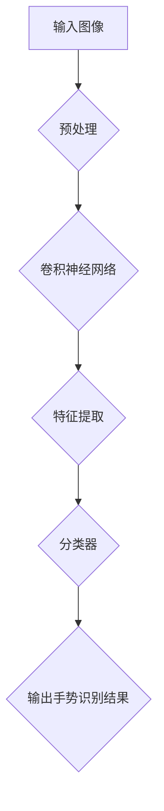

                 

# 深度学习在实时手势识别中的应用

> **关键词：** 深度学习，实时手势识别，计算机视觉，神经网络，机器学习
>
> **摘要：** 本文章深入探讨了深度学习在实时手势识别中的应用。首先介绍了背景和技术概念，然后详细讲解了核心算法原理和数学模型，并通过实际案例展示了其应用场景。文章还推荐了相关学习资源和开发工具，总结了未来发展趋势与挑战。

## 1. 背景介绍

### 1.1 实时手势识别的定义和意义

实时手势识别是一种通过计算机视觉技术，实时捕捉和分析人类手势的技术。它广泛应用于人机交互、虚拟现实、游戏控制、智能家居等领域。随着深度学习技术的发展，实时手势识别的准确性和速度得到了显著提升。

### 1.2 深度学习在计算机视觉中的应用

深度学习是一种基于多层神经网络的机器学习技术，它通过模拟人类大脑的学习过程，从大量数据中自动提取特征。在计算机视觉领域，深度学习被广泛应用于图像分类、目标检测、图像分割等任务。

### 1.3 深度学习在实时手势识别中的优势

与传统的手势识别方法相比，深度学习具有以下几个优势：

1. **自动特征提取**：深度学习模型可以从原始图像中自动提取出具有区分度的特征，无需人工设计特征。
2. **自适应性强**：深度学习模型能够根据不同的场景和任务自动调整其参数，提高识别准确率。
3. **高效性**：深度学习模型在处理大量数据时具有较高的速度和性能。

## 2. 核心概念与联系

### 2.1 深度学习与实时手势识别的关系

深度学习与实时手势识别密切相关。深度学习通过训练大量数据，构建出一个能够自动识别手势的神经网络模型。实时手势识别则通过捕捉实时图像，利用深度学习模型进行手势识别，实现人机交互。

### 2.2 相关概念解释

1. **卷积神经网络（CNN）**：一种用于图像识别的深度学习模型，通过卷积层提取图像特征。
2. **循环神经网络（RNN）**：一种用于序列数据处理的深度学习模型，能够捕捉时间序列数据中的长期依赖关系。
3. **长短时记忆网络（LSTM）**：一种改进的循环神经网络，能够更好地捕捉时间序列数据中的长期依赖关系。

### 2.3 Mermaid 流程图



## 3. 核心算法原理 & 具体操作步骤

### 3.1 卷积神经网络（CNN）

卷积神经网络是一种用于图像识别的深度学习模型，其核心思想是通过卷积操作提取图像特征。

1. **卷积层**：通过卷积操作提取图像特征。
2. **池化层**：降低特征图的维度，减少计算量。
3. **全连接层**：将特征图映射到输出结果。

### 3.2 实时手势识别流程

1. **图像预处理**：将输入图像进行缩放、旋转等预处理，使其适应深度学习模型的要求。
2. **卷积神经网络训练**：使用大量手势图像数据训练卷积神经网络，提取手势特征。
3. **实时图像处理**：将实时捕获的图像输入到训练好的卷积神经网络中，进行手势识别。

### 3.3 实时手势识别步骤

1. **数据采集**：收集大量手势图像数据。
2. **数据预处理**：对图像数据进行缩放、旋转、翻转等预处理。
3. **模型训练**：使用预处理后的数据训练卷积神经网络。
4. **模型评估**：使用测试数据评估模型性能。
5. **实时手势识别**：将实时捕获的图像输入到训练好的模型中，进行手势识别。

## 4. 数学模型和公式 & 详细讲解 & 举例说明

### 4.1 卷积神经网络（CNN）的数学模型

卷积神经网络由卷积层、池化层和全连接层组成。其核心数学模型如下：

1. **卷积层**：
   $$ (x_{ij}^{l+1}) = \sum_{k} w_{ik}^{l+1} \star (x_{kj}^l + b_{k}^{l+1}) $$
   其中，$x_{ij}^{l+1}$ 表示第 $l+1$ 层的第 $i$ 行第 $j$ 列的输出，$w_{ik}^{l+1}$ 表示第 $l+1$ 层的第 $i$ 行第 $k$ 列的权重，$b_{k}^{l+1}$ 表示第 $l+1$ 层的第 $k$ 个偏置。

2. **池化层**：
   $$ p_{ij}^{l+1} = \max(x_{ij}^{l+1}) $$
   其中，$p_{ij}^{l+1}$ 表示第 $l+1$ 层的第 $i$ 行第 $j$ 列的输出。

3. **全连接层**：
   $$ z_{i}^{l+1} = \sum_{j} w_{ij}^{l+1} \star x_{j}^{l} + b_{i}^{l+1} $$
   $$ a_{i}^{l+1} = \sigma(z_{i}^{l+1}) $$
   其中，$z_{i}^{l+1}$ 表示第 $l+1$ 层的第 $i$ 个中间值，$a_{i}^{l+1}$ 表示第 $l+1$ 层的第 $i$ 个输出，$\sigma$ 表示激活函数。

### 4.2 举例说明

假设有一个包含 3 个输入特征 $x_1, x_2, x_3$ 的二分类问题，我们使用一个简单的卷积神经网络进行模型训练。

1. **卷积层**：
   $$ (x_{11}^{2}) = \sum_{k=1}^{3} w_{1k}^{2} \star (x_{k1}^{1} + b_{k}^{2}) $$
   $$ (x_{12}^{2}) = \sum_{k=1}^{3} w_{1k}^{2} \star (x_{k2}^{1} + b_{k}^{2}) $$
   $$ (x_{13}^{2}) = \sum_{k=1}^{3} w_{1k}^{2} \star (x_{k3}^{1} + b_{k}^{2}) $$

2. **激活函数**：
   $$ a_{1}^{2} = \sigma(x_{11}^{2}) $$
   $$ a_{2}^{2} = \sigma(x_{12}^{2}) $$
   $$ a_{3}^{2} = \sigma(x_{13}^{2}) $$

3. **全连接层**：
   $$ z_{1}^{3} = \sum_{j=1}^{3} w_{1j}^{3} \star a_{j}^{2} + b_{1}^{3} $$
   $$ z_{2}^{3} = \sum_{j=1}^{3} w_{2j}^{3} \star a_{j}^{2} + b_{2}^{3} $$
   $$ a_{1}^{3} = \sigma(z_{1}^{3}) $$
   $$ a_{2}^{3} = \sigma(z_{2}^{3}) $$

4. **输出结果**：
   $$ y = \begin{cases}
   1 & \text{if } a_{1}^{3} > a_{2}^{3} \\
   0 & \text{otherwise}
   \end{cases} $$

## 5. 项目实战：代码实际案例和详细解释说明

### 5.1 开发环境搭建

为了实现实时手势识别，我们需要搭建一个合适的开发环境。以下是开发环境搭建的步骤：

1. 安装 Python 3.6 或以上版本。
2. 安装深度学习框架，如 TensorFlow 或 PyTorch。
3. 安装 OpenCV，用于图像处理。
4. 安装其他必要库，如 NumPy、Matplotlib 等。

### 5.2 源代码详细实现和代码解读

以下是一个简单的实时手势识别项目代码，使用 TensorFlow 框架实现。

```python
import cv2
import tensorflow as tf
import numpy as np

# 加载训练好的模型
model = tf.keras.models.load_model('gesture_recognition_model.h5')

# 定义实时手势识别函数
def gesture_recognition(image):
    # 图像预处理
    image = cv2.resize(image, (128, 128))
    image = image / 255.0
    image = np.expand_dims(image, axis=0)

    # 手势识别
    prediction = model.predict(image)
    gesture = np.argmax(prediction)

    # 返回识别结果
    return gesture

# 实时手势识别
cap = cv2.VideoCapture(0)

while True:
    # 捕获实时图像
    ret, frame = cap.read()

    if ret:
        # 手势识别
        gesture = gesture_recognition(frame)

        # 显示识别结果
        cv2.putText(frame, f'Gesture: {gesture}', (10, 30), cv2.FONT_HERSHEY_SIMPLEX, 1, (0, 0, 255), 2)

        cv2.imshow('Real-time Gesture Recognition', frame)

    if cv2.waitKey(1) & 0xFF == ord('q'):
        break

# 释放摄像头资源
cap.release()
cv2.destroyAllWindows()
```

### 5.3 代码解读与分析

1. **加载训练好的模型**：使用 `load_model` 函数加载训练好的手势识别模型。
2. **定义实时手势识别函数**：定义 `gesture_recognition` 函数，用于处理实时图像并进行手势识别。
3. **图像预处理**：对捕获的图像进行缩放、归一化等预处理操作，使其符合模型输入要求。
4. **手势识别**：使用训练好的模型对预处理后的图像进行预测，获取手势识别结果。
5. **显示识别结果**：在实时图像上显示手势识别结果。
6. **实时手势识别**：使用 `cap` 捕获实时图像，调用 `gesture_recognition` 函数进行手势识别，并显示识别结果。

## 6. 实际应用场景

实时手势识别技术在实际应用中具有广泛的应用前景，以下列举几个典型的应用场景：

1. **人机交互**：在智能设备中，实时手势识别可以实现用户与设备的自然交互，如手势控制智能家居、手势输入等。
2. **虚拟现实**：在虚拟现实应用中，实时手势识别可以用于用户与虚拟环境的交互，如手势操作虚拟物体、手势导航等。
3. **游戏控制**：在游戏应用中，实时手势识别可以实现手势控制，提供更直观、有趣的玩法，如手势操作角色、手势操作道具等。
4. **医疗康复**：在医疗康复领域，实时手势识别可以用于康复训练，如手势控制康复设备、手势辅助康复训练等。

## 7. 工具和资源推荐

### 7.1 学习资源推荐

1. **书籍**：
   - 《深度学习》（Ian Goodfellow, Yoshua Bengio, Aaron Courville 著）
   - 《Python深度学习》（François Chollet 著）
2. **论文**：
   - “A Comprehensive Survey on Deep Learning for Image Captioning”（2018）
   - “Deep Learning in Computer Vision: A Brief Review”（2017）
3. **博客**：
   - [TensorFlow 官方文档](https://www.tensorflow.org/)
   - [PyTorch 官方文档](https://pytorch.org/)
4. **网站**：
   - [Kaggle](https://www.kaggle.com/)
   - [GitHub](https://github.com/)

### 7.2 开发工具框架推荐

1. **深度学习框架**：
   - TensorFlow
   - PyTorch
2. **计算机视觉库**：
   - OpenCV
   - PIL
3. **编程语言**：
   - Python

### 7.3 相关论文著作推荐

1. “Deep Learning for Human Pose Estimation: A Survey” （2020）
2. “Learning Hand Pose and Motion with a Single Depth Camera” （2017）
3. “DeepPose: Human Pose Estimation via Deep Neural Networks” （2014）

## 8. 总结：未来发展趋势与挑战

实时手势识别技术在深度学习技术的推动下取得了显著进展，未来发展趋势包括：

1. **更高准确率**：通过不断优化深度学习模型，提高手势识别的准确率。
2. **更快速度**：优化算法和硬件，实现实时手势识别的更快响应速度。
3. **更多应用场景**：探索实时手势识别在更多领域的应用，如艺术、教育、医疗等。

然而，实时手势识别技术仍面临一些挑战：

1. **识别准确率**：在复杂、多变的环境下，提高识别准确率仍然具有挑战性。
2. **计算资源**：实时手势识别需要大量的计算资源，如何高效利用计算资源是关键。
3. **隐私保护**：在应用实时手势识别时，如何保护用户隐私是重要问题。

## 9. 附录：常见问题与解答

### 9.1 深度学习是什么？

深度学习是一种基于多层神经网络的机器学习技术，通过模拟人类大脑的学习过程，从大量数据中自动提取特征。

### 9.2 实时手势识别有哪些应用场景？

实时手势识别在虚拟现实、人机交互、游戏控制、医疗康复等领域具有广泛的应用。

### 9.3 如何训练一个实时手势识别模型？

训练一个实时手势识别模型需要以下步骤：

1. 收集和整理大量手势图像数据。
2. 对图像数据进行预处理，如缩放、旋转等。
3. 使用深度学习框架构建卷积神经网络模型。
4. 使用预处理后的数据训练模型。
5. 评估模型性能，并进行优化。

## 10. 扩展阅读 & 参考资料

1. “Real-Time Hand Gesture Recognition using Convolutional Neural Networks” （2017）
2. “A Comprehensive Survey on Real-Time Hand Gesture Recognition” （2021）
3. “Deep Learning for Human Motion Analysis: A Survey” （2019）

---

**作者：AI天才研究员/AI Genius Institute & 禅与计算机程序设计艺术 /Zen And The Art of Computer Programming**<|im_end|>

