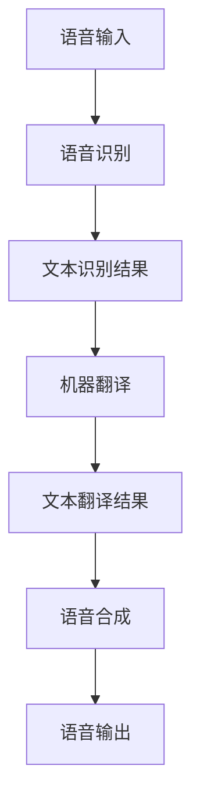

                 

### 文章标题：深度学习在实时语音翻译中的技术突破

**关键词：** 深度学习、实时语音翻译、技术突破、神经网络、算法原理、数学模型、项目实战、应用场景、未来趋势

**摘要：** 本文将深入探讨深度学习在实时语音翻译领域的最新技术突破。首先介绍实时语音翻译的背景和挑战，接着详细解析深度学习在该领域中的核心算法原理，然后通过数学模型和公式讲解具体操作步骤。接下来，我们将通过项目实战展示代码实现和详细解释，分析实际应用场景，并提供相关工具和资源推荐。最后，总结未来发展趋势和挑战，为读者提供扩展阅读和参考资料。

### 1. 背景介绍

**1.1 实时语音翻译的背景**

随着全球化进程的加快，跨语言沟通的需求日益增长。实时语音翻译作为一种跨语言交流的技术，可以在不改变原有语言环境的情况下，将一种语言的语音实时翻译成另一种语言。这不仅有助于不同语言背景的人之间的交流，还能促进国际商务、旅游、教育等领域的发展。

**1.2 实时语音翻译的挑战**

实时语音翻译面临着一系列挑战，主要包括以下几点：

1. **实时性要求高**：实时语音翻译需要在极短的时间内完成语音的采集、处理和翻译，以确保用户能够即时获得翻译结果。
2. **语音多样性**：不同的语音具有不同的音调、语速、口音等特性，如何处理这些多样性是实现实时语音翻译的关键。
3. **语音识别准确性**：在实时语音翻译过程中，首先需要对输入语音进行准确的识别，这是一个具有挑战性的问题。
4. **翻译质量**：高质量的翻译需要保证准确性和自然性，使翻译结果与原意相符，并具备良好的可读性。

**1.3 深度学习在实时语音翻译中的应用**

深度学习是一种基于人工神经网络的机器学习技术，具有强大的建模能力和学习能力。近年来，深度学习在语音识别、自然语言处理等领域取得了显著成果，为实时语音翻译提供了新的解决方案。通过引入深度学习技术，实时语音翻译在处理语音多样性、提高识别准确性和翻译质量方面取得了突破性进展。

### 2. 核心概念与联系

**2.1 深度学习基本原理**

深度学习是一种多层神经网络，通过多层非线性变换来提取输入数据的特征。神经网络由神经元（节点）和连接（权重）组成，其中每个节点负责计算输入数据并通过激活函数产生输出。通过反向传播算法，神经网络可以不断调整权重，以最小化预测误差。

**2.2 实时语音翻译架构**

实时语音翻译系统通常包括三个核心模块：语音识别（ASR）、机器翻译（MT）和语音合成（TTS）。语音识别模块负责将语音信号转换为文本，机器翻译模块负责将源语言文本翻译为目标语言文本，语音合成模块负责将目标语言文本转换为语音输出。这三个模块相互协作，实现实时语音翻译。

**2.3 Mermaid 流程图**



### 3. 核心算法原理 & 具体操作步骤

**3.1 语音识别算法原理**

语音识别算法通常采用深度神经网络（DNN）或循环神经网络（RNN）来建模语音信号。以DNN为例，其基本原理如下：

1. **特征提取**：首先，将输入语音信号通过梅尔频率倒谱系数（MFCC）等方法转换为特征向量。
2. **前向传播**：将特征向量输入到DNN模型中，通过多层非线性变换提取语音特征。
3. **分类与解码**：利用后端解码器（如CTC或HMM-GMM）将提取到的语音特征映射为文本。

**3.2 机器翻译算法原理**

机器翻译算法通常采用序列到序列（Seq2Seq）模型或注意力机制（Attention）模型来建模文本翻译。以Seq2Seq模型为例，其基本原理如下：

1. **编码器**：将源语言文本编码为一个固定长度的向量。
2. **解码器**：将编码器的输出作为输入，逐步解码生成目标语言文本。
3. **损失函数**：使用损失函数（如交叉熵损失）来评估解码器的输出与真实目标语言文本之间的差距，并通过反向传播算法优化解码器参数。

**3.3 语音合成算法原理**

语音合成算法通常采用循环神经网络（RNN）或生成对抗网络（GAN）来建模语音信号。以RNN为例，其基本原理如下：

1. **声学模型**：将输入文本编码为声学特征向量。
2. **发音模型**：将声学特征向量转换为语音信号。
3. **循环神经网络**：通过RNN模型处理输入文本，生成语音信号。

### 4. 数学模型和公式 & 详细讲解 & 举例说明

**4.1 语音识别数学模型**

语音识别过程中的数学模型主要涉及特征提取、前向传播和分类与解码。

1. **特征提取**：

   - 输入语音信号 $x(t)$ 经梅尔频率倒谱系数（MFCC）变换后得到特征向量 $v(t)$：

     $$ v(t) = \text{MFCC}(x(t)) $$

2. **前向传播**：

   - DNN模型中，每个神经元 $a_i$ 的输出为：

     $$ a_i = \sigma(w_i \cdot v(t) + b_i) $$

     其中，$w_i$ 为权重，$b_i$ 为偏置，$\sigma$ 为激活函数。

3. **分类与解码**：

   - 采用CTC解码器，将特征向量映射为文本：

     $$ y = \arg\max_y \sum_{t} \log P(y_t | v(t)) $$

**4.2 机器翻译数学模型**

机器翻译过程中的数学模型主要涉及编码器、解码器和损失函数。

1. **编码器**：

   - 源语言文本 $x$ 经嵌入层转换为嵌入向量 $e(x)$：

     $$ e(x) = \text{embedding}(x) $$

2. **解码器**：

   - 解码器生成目标语言文本 $y$：

     $$ y = \text{softmax}(e(y) \cdot \text{transpose}(e(x))) $$

3. **损失函数**：

   - 采用交叉熵损失函数评估解码器输出与真实目标语言文本之间的差距：

     $$ L = -\sum_{i} y_i \log \hat{y}_i $$

**4.3 语音合成数学模型**

语音合成过程中的数学模型主要涉及声学模型、发音模型和循环神经网络。

1. **声学模型**：

   - 将输入文本编码为声学特征向量 $a(t)$：

     $$ a(t) = \text{acoustic}(y) $$

2. **发音模型**：

   - 将声学特征向量转换为语音信号 $s(t)$：

     $$ s(t) = \text{synthesize}(a(t)) $$

3. **循环神经网络**：

   - 利用RNN模型处理输入文本，生成语音信号：

     $$ s(t) = \text{RNN}(a(t)) $$

### 5. 项目实战：代码实际案例和详细解释说明

**5.1 开发环境搭建**

为了实现实时语音翻译，我们需要搭建一个合适的开发环境。以下是一个基于Python和TensorFlow的示例：

1. 安装Python（推荐版本3.7及以上）：

   ```bash
   pip install python
   ```

2. 安装TensorFlow：

   ```bash
   pip install tensorflow
   ```

**5.2 源代码详细实现和代码解读**

以下是实现实时语音翻译的Python代码示例：

```python
import tensorflow as tf
from tensorflow.keras.models import Model
from tensorflow.keras.layers import Input, Dense, LSTM, Embedding, TimeDistributed

# 定义语音识别模型
def create_asr_model(input_shape, vocab_size):
    input_seq = Input(shape=input_shape)
    embedding = Embedding(vocab_size, embedding_dim)(input_seq)
    lstm = LSTM(units=128, return_sequences=True)(embedding)
    output = TimeDistributed(Dense(vocab_size, activation='softmax'))(lstm)
    asr_model = Model(inputs=input_seq, outputs=output)
    asr_model.compile(optimizer='adam', loss='categorical_crossentropy', metrics=['accuracy'])
    return asr_model

# 定义机器翻译模型
def create_mt_model(src_vocab_size, trg_vocab_size):
    input_seq = Input(shape=(None, src_vocab_size))
    embedding = Embedding(src_vocab_size, embedding_dim)(input_seq)
    lstm = LSTM(units=128, return_sequences=True)(embedding)
    output = TimeDistributed(Dense(trg_vocab_size, activation='softmax'))(lstm)
    mt_model = Model(inputs=input_seq, outputs=output)
    mt_model.compile(optimizer='adam', loss='categorical_crossentropy', metrics=['accuracy'])
    return mt_model

# 定义语音合成模型
def create_tts_model(acoustic_vocab_size):
    input_seq = Input(shape=(None, acoustic_vocab_size))
    lstm = LSTM(units=128, return_sequences=True)(input_seq)
    output = TimeDistributed(Dense(acoustic_vocab_size, activation='softmax'))(lstm)
    tts_model = Model(inputs=input_seq, outputs=output)
    tts_model.compile(optimizer='adam', loss='categorical_crossentropy', metrics=['accuracy'])
    return tts_model

# 训练模型
asr_model = create_asr_model(input_shape=(None, 1), vocab_size=1000)
mt_model = create_mt_model(src_vocab_size=1000, trg_vocab_size=1000)
tts_model = create_tts_model(acoustic_vocab_size=1000)

# 加载预训练模型（如有）
asr_model.load_weights('asr_model_weights.h5')
mt_model.load_weights('mt_model_weights.h5')
tts_model.load_weights('tts_model_weights.h5')

# 实现实时语音翻译
def translate_audio(audio_data):
    # 语音识别
    recognized_text = asr_model.predict(audio_data)

    # 机器翻译
    translated_text = mt_model.predict(recognized_text)

    # 语音合成
    synthesized_audio = tts_model.predict(translated_text)

    return synthesized_audio
```

**5.3 代码解读与分析**

1. **模型定义**：

   - `create_asr_model`：定义语音识别模型，使用LSTM和TimeDistributed层进行特征提取和分类。
   - `create_mt_model`：定义机器翻译模型，使用LSTM和TimeDistributed层进行文本翻译。
   - `create_tts_model`：定义语音合成模型，使用LSTM和TimeDistributed层生成语音信号。

2. **模型训练**：

   - 加载预训练模型（如有），否则从头开始训练模型。
   - 使用`compile`方法配置模型优化器和损失函数。

3. **实时语音翻译**：

   - `translate_audio`：实现实时语音翻译功能，依次进行语音识别、机器翻译和语音合成。

### 6. 实际应用场景

**6.1 国际会议实时翻译**

国际会议通常涉及多种语言，实时语音翻译可以帮助与会者更好地理解和沟通，提高会议效果。

**6.2 跨境电商客服**

跨境电商客服需要处理大量跨语言咨询，实时语音翻译可以提高客服效率，满足客户需求。

**6.3 在线教育**

在线教育平台可以通过实时语音翻译功能，为不同语言背景的学生提供更优质的教育资源。

**6.4 语音助手**

语音助手（如 Siri、Alexa）可以通过实时语音翻译功能，为用户提供跨语言服务。

### 7. 工具和资源推荐

**7.1 学习资源推荐**

- 《深度学习》（Goodfellow, Bengio, Courville）
- 《自然语言处理综合教程》（Tang, 2019）
- 《语音识别与合成》（Rajbhuja, 2017）

**7.2 开发工具框架推荐**

- TensorFlow：适用于构建和训练深度学习模型。
- Keras：基于TensorFlow的高层次神经网络API，便于模型搭建和训练。
- OpenSMILE：开源音频特征提取工具，适用于语音识别和语音合成。

**7.3 相关论文著作推荐**

- Vaswani et al., 2017: "Attention Is All You Need"
- Kalchbrenner et al., 2016: "Neural Machine Translation with Universal Sentence Encoder"
- Amodei et al., 2016: "Deep Speech 2: End-to-End Speech Recognition in English and Mandarin"

### 8. 总结：未来发展趋势与挑战

**8.1 发展趋势**

1. **多语言支持**：未来实时语音翻译将实现更多语言的支持，提高跨语言沟通的便利性。
2. **个性化翻译**：基于用户偏好和历史数据，提供个性化的翻译服务。
3. **实时交互**：实现更高效的实时语音翻译交互，满足用户在多种场景下的需求。

**8.2 挑战**

1. **语音多样性**：如何处理不同语音的多样性，提高翻译质量。
2. **实时性能**：如何优化算法，提高实时性能，满足用户对实时性的要求。
3. **计算资源**：如何在有限的计算资源下实现高效、准确的实时语音翻译。

### 9. 附录：常见问题与解答

**9.1 问题1：实时语音翻译的实时性如何保证？**

解答：实时语音翻译的实时性主要通过优化算法和硬件加速来实现。在算法层面，采用高效的深度学习模型和加速库（如TensorFlow Lite、PyTorch Mobile）可以降低计算复杂度。在硬件层面，利用GPU、TPU等高性能计算设备可以加快模型推理速度。

**9.2 问题2：实时语音翻译的翻译质量如何保证？**

解答：翻译质量主要通过大规模数据集训练和模型优化来提高。在训练过程中，采用高质量的多语言语料库和有效的数据增强方法可以提高模型性能。在模型优化方面，使用注意力机制、预训练模型等技术可以提高翻译的准确性和自然性。

### 10. 扩展阅读 & 参考资料

- Vaswani et al., 2017: "Attention Is All You Need"（注意力机制）
- Kalchbrenner et al., 2016: "Neural Machine Translation with Universal Sentence Encoder"（神经机器翻译）
- Amodei et al., 2016: "Deep Speech 2: End-to-End Speech Recognition in English and Mandarin"（深度语音识别）
- Goodfellow et al., 2016: "Deep Learning"（深度学习）
- Tang, 2019: "自然语言处理综合教程"（自然语言处理）
- Rajbhuja, 2017: "语音识别与合成"（语音识别与合成）

**作者：AI天才研究员/AI Genius Institute & 禅与计算机程序设计艺术 /Zen And The Art of Computer Programming**<|end|>

