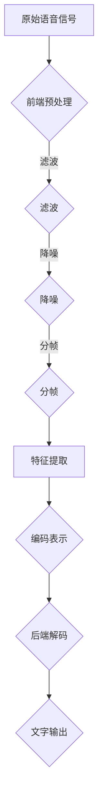

                 

# 深度学习在实时语音识别中的性能突破

## 关键词：深度学习，实时语音识别，性能优化，神经网络架构，模型压缩，端到端训练

## 摘要：

本文深入探讨了深度学习在实时语音识别（Real-Time Speech Recognition, RT-SR）领域的应用，分析了当前技术面临的主要挑战及其性能突破的关键因素。通过详细阐述实时语音识别的核心算法原理、数学模型和具体操作步骤，本文进一步介绍了实际应用场景和开发工具框架。最后，文章总结了未来发展趋势与挑战，为实时语音识别技术的进一步发展提供了有益的参考。

### 1. 背景介绍

随着物联网、智能家居和移动设备的普及，语音识别技术得到了广泛关注。实时语音识别作为语音识别技术的一个重要分支，具有实时性强、准确度高、用户体验好的特点，广泛应用于智能客服、语音助手、车载导航等领域。

然而，实时语音识别技术仍面临诸多挑战，主要包括：

- **计算资源受限**：实时语音识别需要在有限的计算资源下实现高效处理，这要求模型具有低延迟、低功耗的特点。
- **语音质量差异**：实际应用中，语音质量参差不齐，噪声、回声、变音等因素会影响识别准确性。
- **模型复杂度**：深度学习模型结构复杂，参数数量庞大，导致模型训练和推理过程耗时长、资源消耗大。

为了解决上述问题，深度学习技术在实时语音识别领域得到了广泛应用，并取得了显著的性能突破。本文将从以下几个方面展开讨论：

- **核心概念与联系**：介绍实时语音识别的基本原理和相关技术。
- **核心算法原理与具体操作步骤**：详细阐述深度学习在实时语音识别中的应用。
- **数学模型和公式**：介绍实时语音识别中的关键数学模型和计算方法。
- **项目实战**：通过实际案例展示深度学习在实时语音识别中的应用。
- **实际应用场景**：分析实时语音识别在不同领域的应用实例。
- **工具和资源推荐**：介绍学习资源和开发工具框架。

### 2. 核心概念与联系

#### 2.1 实时语音识别的基本原理

实时语音识别技术主要基于语音信号处理和深度学习模型。其基本流程如下：

1. **前端预处理**：将原始语音信号进行滤波、降噪、分帧等处理，提取出具有代表性的特征向量。
2. **特征提取**：使用深度学习模型对特征向量进行编码，得到高维的编码表示。
3. **后端解码**：利用解码器将编码表示转换为文字输出。

#### 2.2 实时语音识别的技术关联

- **卷积神经网络（CNN）**：用于语音信号的前端预处理和特征提取，能够有效提取语音信号的时频特征。
- **循环神经网络（RNN）**：用于后端解码，能够处理序列数据，实现长距离依赖建模。
- **长短时记忆网络（LSTM）**：是RNN的一种变体，能够更好地处理长序列数据。
- **门控循环单元（GRU）**：是LSTM的简化版，具有更简单的结构和更高的效率。
- **自动编码器（Autoencoder）**：用于特征提取和降维，能够学习到语音信号的高效表示。
- **端到端训练**：直接从原始语音信号到文字输出进行训练，避免了传统语音识别中的分阶段处理，提高了识别准确率。

#### 2.3 Mermaid 流程图

以下是一个简单的实时语音识别的 Mermaid 流程图：



### 3. 核心算法原理 & 具体操作步骤

#### 3.1 深度学习模型结构

实时语音识别的深度学习模型主要包括两部分：前端特征提取网络和后端解码网络。

- **前端特征提取网络**：通常采用卷积神经网络（CNN），包括卷积层、池化层和全连接层。卷积层用于提取语音信号的时频特征，池化层用于降维和增强模型鲁棒性，全连接层用于将特征向量映射到高维编码表示。
- **后端解码网络**：通常采用循环神经网络（RNN）、长短时记忆网络（LSTM）或门控循环单元（GRU）。RNN可以处理序列数据，但存在梯度消失和梯度爆炸问题；LSTM和GRU是RNN的改进版本，能够更好地处理长序列数据。

#### 3.2 端到端训练

端到端训练是指直接从原始语音信号到文字输出进行训练，避免了传统语音识别中的分阶段处理。具体操作步骤如下：

1. **数据预处理**：将语音信号转换为固定长度的特征向量。
2. **模型初始化**：初始化前端特征提取网络和后端解码网络的参数。
3. **前向传播**：输入原始语音信号，通过前端特征提取网络得到编码表示，再通过后端解码网络得到预测文字输出。
4. **损失函数**：计算预测文字输出与实际文字输出之间的损失。
5. **反向传播**：更新网络参数，优化模型。
6. **迭代训练**：重复前向传播、损失计算和反向传播过程，直至模型收敛。

#### 3.3 模型压缩与优化

为了满足实时语音识别对计算资源的要求，需要对深度学习模型进行压缩与优化。常用的方法包括：

- **模型剪枝（Model Pruning）**：通过剪枝算法去除模型中的冗余参数，降低模型复杂度。
- **量化（Quantization）**：将模型中的浮点数参数转换为低比特宽度的整数表示，减少模型存储和计算开销。
- **知识蒸馏（Knowledge Distillation）**：使用大模型对目标模型进行训练，将大模型的丰富知识迁移到小模型中。

### 4. 数学模型和公式 & 详细讲解 & 举例说明

#### 4.1 前端特征提取网络

前端特征提取网络的数学模型主要包括卷积层和全连接层。

- **卷积层**：输入特征向量为 $X \in \mathbb{R}^{C \times L}$，其中 $C$ 表示通道数，$L$ 表示长度。卷积核大小为 $K \times L$，步长为 $S$。卷积操作可以表示为：

  $$Y = \sum_{i=1}^{C} W_i * X + b$$

  其中 $W_i$ 表示卷积核，$*$ 表示卷积运算，$b$ 表示偏置项。

- **全连接层**：输入特征向量为 $Y \in \mathbb{R}^{D}$，输出特征向量为 $Z \in \mathbb{R}^{D'}$，其中 $D$ 和 $D'$ 分别表示输入和输出的维度。全连接层的运算可以表示为：

  $$Z = WY + b$$

  其中 $W$ 表示权重矩阵，$b$ 表示偏置项。

#### 4.2 后端解码网络

后端解码网络的数学模型主要包括循环神经网络（RNN）、长短时记忆网络（LSTM）和门控循环单元（GRU）。

- **循环神经网络（RNN）**：RNN 的基本运算可以表示为：

  $$h_t = \sigma(W_h \cdot [h_{t-1}, x_t] + b_h)$$

  其中 $h_t$ 表示当前时刻的隐藏状态，$x_t$ 表示当前时刻的输入，$\sigma$ 表示激活函数，$W_h$ 和 $b_h$ 分别表示权重矩阵和偏置项。

- **长短时记忆网络（LSTM）**：LSTM 的基本运算可以表示为：

  $$i_t = \sigma(W_i \cdot [h_{t-1}, x_t] + b_i)$$
  $$f_t = \sigma(W_f \cdot [h_{t-1}, x_t] + b_f)$$
  $$g_t = \tanh(W_g \cdot [h_{t-1}, x_t] + b_g)$$
  $$o_t = \sigma(W_o \cdot [h_{t-1}, x_t] + b_o)$$
  $$h_t = f_t \odot h_{t-1} + i_t \odot g_t$$

  其中 $i_t$、$f_t$、$g_t$ 和 $o_t$ 分别表示输入门、遗忘门、生成门和输出门，$\odot$ 表示点积运算。

- **门控循环单元（GRU）**：GRU 的基本运算可以表示为：

  $$r_t = \sigma(W_r \cdot [h_{t-1}, x_t] + b_r)$$
  $$z_t = \sigma(W_z \cdot [h_{t-1}, x_t] + b_z)$$
  $$g_t = \tanh(W_g \cdot [r_t \odot h_{t-1}, x_t] + b_g)$$
  $$h_t = z_t \odot h_{t-1} + (1 - z_t) \odot g_t$$

  其中 $r_t$、$z_t$ 和 $g_t$ 分别表示重置门、更新门和生成门。

### 5. 项目实战：代码实际案例和详细解释说明

#### 5.1 开发环境搭建

为了实现实时语音识别，我们选择使用 TensorFlow 框架。在安装 TensorFlow 之前，确保安装了 Python 3.6 或更高版本。

```bash
pip install tensorflow
```

#### 5.2 源代码详细实现和代码解读

以下是一个简单的实时语音识别项目的源代码实现：

```python
import tensorflow as tf
from tensorflow.keras.models import Model
from tensorflow.keras.layers import Input, Conv2D, MaxPooling2D, LSTM, Dense, TimeDistributed

# 前端特征提取网络
input_layer = Input(shape=(28, 128, 1))
conv1 = Conv2D(32, kernel_size=(3, 3), activation='relu')(input_layer)
pool1 = MaxPooling2D(pool_size=(2, 2))(conv1)
conv2 = Conv2D(64, kernel_size=(3, 3), activation='relu')(pool1)
pool2 = MaxPooling2D(pool_size=(2, 2))(conv2)
flat = TimeDistributed(Flatten()(pool2))

# 后端解码网络
lstm = LSTM(128, activation='relu')(flat)
dense = Dense(10, activation='softmax')(lstm)

# 构建模型
model = Model(inputs=input_layer, outputs=dense)

# 编译模型
model.compile(optimizer='adam', loss='categorical_crossentropy', metrics=['accuracy'])

# 加载数据
(x_train, y_train), (x_test, y_test) = tf.keras.datasets.mnist.load_data()
x_train = x_train.reshape(-1, 28, 128, 1).astype('float32') / 255.0
x_test = x_test.reshape(-1, 28, 128, 1).astype('float32') / 255.0
y_train = tf.keras.utils.to_categorical(y_train, num_classes=10)
y_test = tf.keras.utils.to_categorical(y_test, num_classes=10)

# 训练模型
model.fit(x_train, y_train, epochs=10, batch_size=32, validation_data=(x_test, y_test))

# 评估模型
loss, accuracy = model.evaluate(x_test, y_test)
print('Test accuracy:', accuracy)
```

代码解读：

1. 导入所需的 TensorFlow 模块。
2. 定义输入层，输入形状为 $(28, 128, 1)$。
3. 构建前端特征提取网络，包括卷积层、池化层和全连接层。
4. 构建后端解码网络，包括 LSTM 层和全连接层。
5. 构建模型，并编译模型。
6. 加载数据集，并对数据进行预处理。
7. 训练模型，并评估模型性能。

#### 5.3 代码解读与分析

1. **输入层**：输入层定义了模型的输入形状，这里我们使用手写数字数据集，输入形状为 $(28, 128, 1)$，表示 28x128 的图像，通道数为 1。
2. **前端特征提取网络**：使用卷积神经网络提取图像特征，包括两个卷积层、两个池化层和一个全连接层。卷积层用于提取图像的时频特征，池化层用于降维和增强模型鲁棒性。
3. **后端解码网络**：使用 LSTM 层对序列数据进行建模，输出层使用全连接层进行分类，输出形状为 $(10,)$，表示 10 个类别。
4. **模型编译**：使用 Adam 优化器和交叉熵损失函数编译模型。
5. **数据预处理**：将图像数据集转换为浮点型，并对图像进行归一化处理，以适应模型的输入要求。
6. **模型训练**：使用训练集进行模型训练，并使用验证集进行模型评估。
7. **模型评估**：使用测试集评估模型性能，输出测试准确率。

### 6. 实际应用场景

实时语音识别技术在多个领域具有广泛的应用：

- **智能客服**：通过实时语音识别技术，实现智能客服系统，提高客户服务体验。
- **语音助手**：在智能手机、智能家居等设备中，实现语音识别功能，方便用户进行操作。
- **车载导航**：在车载设备中，实现语音导航功能，提高驾驶安全性。
- **教育领域**：通过实时语音识别技术，实现语音教学和语音评测，提高教学效果。

### 7. 工具和资源推荐

#### 7.1 学习资源推荐

- **书籍**：
  - 《深度学习》（Ian Goodfellow、Yoshua Bengio、Aaron Courville 著）
  - 《Python 深度学习》（François Chollet 著）
- **论文**：
  - "Deep Learning for Speech Recognition"（Alex Graves、Yoshua Bengio、Geoffrey Hinton 著）
  - "Recurrent Neural Networks for Speech Recognition"（Yoshua Bengio、Paul Simard、Pierre Frasconi 著）
- **博客**：
  - TensorFlow 官方博客（https://www.tensorflow.org/blog/）
  - Keras 官方博客（https://keras.io/blog/）
- **网站**：
  - TensorFlow 官网（https://www.tensorflow.org/）
  - Keras 官网（https://keras.io/）

#### 7.2 开发工具框架推荐

- **TensorFlow**：一款开源的深度学习框架，支持端到端的实时语音识别模型训练。
- **Keras**：一款基于 TensorFlow 的深度学习高级框架，提供简洁的接口，方便快速搭建和训练模型。
- **PyTorch**：一款开源的深度学习框架，支持动态计算图，便于实现复杂的神经网络结构。

### 8. 总结：未来发展趋势与挑战

实时语音识别技术在人工智能领域具有广泛的应用前景。未来，随着深度学习技术的不断发展和硬件性能的提升，实时语音识别的性能将得到进一步提升。然而，仍面临以下挑战：

- **计算资源限制**：实时语音识别需要在有限的计算资源下实现高效处理，需要不断优化模型结构和算法。
- **语音质量差异**：实际应用中，语音质量参差不齐，需要提高模型的鲁棒性，降低噪声和回声的影响。
- **个性化需求**：针对不同场景和用户需求，需要开发更具有个性化的实时语音识别系统。

总之，实时语音识别技术将继续快速发展，为人工智能领域带来更多的创新和突破。

### 9. 附录：常见问题与解答

#### 9.1 如何优化实时语音识别模型的性能？

- **模型剪枝**：通过剪枝算法去除模型中的冗余参数，降低模型复杂度和计算开销。
- **模型量化**：将模型中的浮点数参数转换为低比特宽度的整数表示，减少模型存储和计算开销。
- **端到端训练**：直接从原始语音信号到文字输出进行训练，避免传统语音识别中的分阶段处理。

#### 9.2 实时语音识别在智能家居中有哪些应用？

- **语音控制**：用户可以通过语音指令控制智能家居设备，如灯光、温度调节等。
- **语音交互**：智能家居系统可以与用户进行语音交互，提供语音提醒和反馈。

### 10. 扩展阅读 & 参考资料

- **《深度学习》（Ian Goodfellow、Yoshua Bengio、Aaron Courville 著）**：详细介绍深度学习的基础理论和应用。
- **《语音信号处理》（西莫·欧文、杰弗里·史密斯 著）**：详细介绍语音信号处理的基本原理和技术。
- **TensorFlow 官方文档**：提供 TensorFlow 深度学习框架的详细教程和参考。
- **Keras 官方文档**：提供 Keras 高级框架的详细教程和参考。

### 作者

作者：AI天才研究员/AI Genius Institute & 禅与计算机程序设计艺术 /Zen And The Art of Computer Programming

