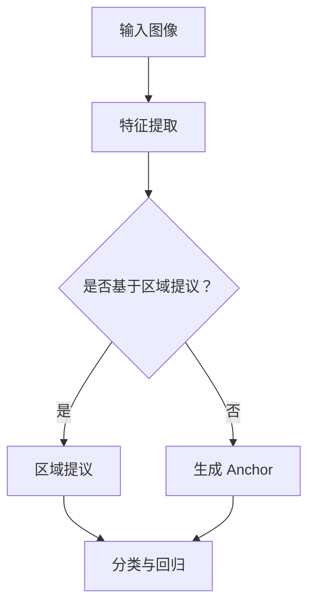

                 

# 深度学习在目标检测中的最新进展

## > 关键词：深度学习，目标检测，YOLO，SSD，Faster R-CNN，Focal Loss，最新技术进展

> 摘要：本文将详细介绍深度学习在目标检测领域的最新进展，包括核心算法原理、数学模型、实际应用场景以及未来的发展趋势和挑战。本文旨在为读者提供全面、深入的技术解析，帮助大家更好地理解和应用这些先进技术。

## 1. 背景介绍

目标检测（Object Detection）是计算机视觉领域的重要研究方向，旨在识别图像中的多个目标，并给出它们的位置和类别。随着深度学习技术的快速发展，目标检测取得了显著突破。传统方法如HOG（Histogram of Oriented Gradients）、SVM（Support Vector Machine）等在处理复杂场景时效果不佳，而深度学习方法凭借其强大的特征提取和分类能力，逐渐成为目标检测的主流方法。

近年来，深度学习在目标检测领域涌现出众多优秀算法，如Faster R-CNN、SSD、YOLO等。这些算法在多个公开数据集上取得了优异的性能，推动着目标检测技术的不断进步。本文将重点介绍这些算法的最新进展，并探讨其应用前景。

### 1.1 深度学习与目标检测的关系

深度学习是一种基于人工神经网络的学习方法，通过多层神经网络结构自动提取图像特征，从而实现图像分类、目标检测等任务。与传统方法相比，深度学习具有以下优势：

1. **特征提取能力强**：深度学习可以从原始图像中自动提取具有区分度的特征，避免人工设计特征带来的复杂度和局限性。
2. **自适应调整**：深度学习模型可以根据数据集的特点和需求，自动调整网络结构和参数，实现高效的目标检测。
3. **多任务学习**：深度学习模型可以同时处理多个任务，如图像分类和目标检测，提高模型的综合性能。

因此，深度学习在目标检测领域具有广阔的应用前景。本文将详细介绍深度学习在目标检测中的最新进展，帮助读者更好地理解和应用这些技术。

### 1.2 目标检测的应用场景

目标检测技术广泛应用于各个领域，如：

1. **自动驾驶**：自动驾驶汽车需要实时检测并识别道路上的行人、车辆、道路标志等目标，确保行车安全。
2. **视频监控**：目标检测技术可以实时识别监控视频中的异常行为，如盗窃、暴力等，提高监控效果。
3. **医疗影像分析**：目标检测技术可以帮助医生快速识别医学影像中的病灶区域，提高诊断准确性。
4. **工业自动化**：目标检测技术可以实时检测生产线上的缺陷产品，提高生产效率和产品质量。

随着技术的不断进步，目标检测的应用场景将越来越广泛，为社会带来更多便利。

## 2. 核心概念与联系

### 2.1 核心概念

目标检测任务主要包括以下三个步骤：

1. **目标区域提议（Region Proposal）**：从大量图像区域中提取可能包含目标的区域。
2. **目标分类（Classification）**：对提取到的目标区域进行类别判断。
3. **目标回归（Regression）**：对目标的位置进行精确调整。

在深度学习目标检测算法中，通常会同时处理这三个步骤，以提高检测性能。

### 2.2 算法架构

目前，深度学习目标检测算法主要分为两大类：基于区域提议的网络（Two-Stage Detection Networks）和基于 anchor 生成的方法（Single-Stage Detection Networks）。下面将分别介绍这两种算法的架构。

#### 2.2.1 基于区域提议的网络

基于区域提议的网络主要包括以下两个阶段：

1. **区域提议阶段（Region Proposal）**：利用区域提议算法（如 Selective Search、RPN 等）从图像中提取大量可能包含目标的区域。
2. **分类与回归阶段（Classification and Regression）**：对提取到的目标区域进行分类和位置回归。

Faster R-CNN 和 R-FCN 是典型的基于区域提议的网络。其中，Faster R-CNN 使用 Region Proposal Network (RPN) 提取目标区域，R-FCN 在 RPN 的基础上进行分类和位置回归。

#### 2.2.2 基于 anchor 生成的方法

基于 anchor 生成的方法直接在图像中生成一系列候选区域（anchor），然后对每个 anchor 进行分类和位置回归。这种方法简化了区域提议阶段，提高了检测速度。YOLO（You Only Look Once）和 SSD（Single Shot MultiBox Detector）是典型的基于 anchor 生成的方法。

### 2.3 Mermaid 流程图

为了更直观地展示目标检测算法的架构，我们可以使用 Mermaid 流程图来表示。下面是一个简单的 Mermaid 流程图示例：



## 3. 核心算法原理 & 具体操作步骤

### 3.1 Faster R-CNN

Faster R-CNN 是一种基于区域提议的网络，其核心组件包括 Region Proposal Network (RPN)、Fast R-CNN 和 ROI 层。

#### 3.1.1 Region Proposal Network (RPN)

RPN 是一种用于提取目标区域的网络，其主要任务是生成高概率的目标区域。RPN 的输入是一个卷积特征图，其输出是每个位置上的 anchor 及其对应的类别概率和位置偏移量。

RPN 的基本原理如下：

1. **生成 anchor**：根据特征图上的每个位置生成多个 anchor，每个 anchor 具有固定的宽高比和尺度。
2. **分类与回归**：对每个 anchor 进行分类，判断其是否属于背景或目标。同时，对属于目标的 anchor 进行位置回归，调整其位置，使其更加准确地包围目标。

#### 3.1.2 Fast R-CNN

Fast R-CNN 是用于分类和回归的网络，其输入是一个区域提议（包括类别概率和位置偏移量），输出是目标的类别和位置。

Fast R-CNN 的基本原理如下：

1. **特征映射**：将输入区域映射到卷积特征图上，提取特征。
2. **分类与回归**：利用全连接层对提取到的特征进行分类和位置回归。

#### 3.1.3 ROI 层

ROI 层用于将特征图上的特征映射到共享的特征空间，以便用于后续的分类和回归操作。

ROI 层的基本原理如下：

1. **特征映射**：将输入区域映射到卷积特征图上，提取特征。
2. **特征池化**：对提取到的特征进行池化操作，减少特征维度。

### 3.2 SSD

SSD（Single Shot MultiBox Detector）是一种基于 anchor 生成的方法，其核心组件包括多个特征层和 MultiBox 层。

#### 3.2.1 多个特征层

SSD 使用多个卷积特征层来生成不同尺度的 anchor，从而实现多尺度目标检测。

每个特征层的基本原理如下：

1. **卷积操作**：对输入特征进行卷积操作，提取特征。
2. **特征池化**：对提取到的特征进行池化操作，减少特征维度。

#### 3.2.2 MultiBox 层

MultiBox 层用于生成 anchor 并进行分类和回归。

MultiBox 层的基本原理如下：

1. **生成 anchor**：根据特征层上的每个位置生成多个 anchor，每个 anchor 具有固定的宽高比和尺度。
2. **分类与回归**：对每个 anchor 进行分类，判断其是否属于背景或目标。同时，对属于目标的 anchor 进行位置回归，调整其位置，使其更加准确地包围目标。

### 3.3 YOLO

YOLO（You Only Look Once）是一种基于 anchor 生成的方法，其核心组件包括多个特征层和检测层。

#### 3.3.1 多个特征层

YOLO 使用多个卷积特征层来生成不同尺度的 anchor，从而实现多尺度目标检测。

每个特征层的基本原理如下：

1. **卷积操作**：对输入特征进行卷积操作，提取特征。
2. **特征池化**：对提取到的特征进行池化操作，减少特征维度。

#### 3.3.2 检测层

检测层用于生成 anchor 并进行分类和回归。

检测层的基本原理如下：

1. **生成 anchor**：根据特征层上的每个位置生成多个 anchor，每个 anchor 具有固定的宽高比和尺度。
2. **分类与回归**：对每个 anchor 进行分类，判断其是否属于背景或目标。同时，对属于目标的 anchor 进行位置回归，调整其位置，使其更加准确地包围目标。

## 4. 数学模型和公式 & 详细讲解 & 举例说明

### 4.1 Faster R-CNN

#### 4.1.1 RPN

1. **锚点生成**

   假设我们在特征图上以每个位置为中心生成 k 个锚点。每个锚点都由一个矩形框表示，其宽高比可以是固定的，如 1:1、1:2、2:1 等。我们用 \(A\) 表示所有锚点的集合。

   \[
   A = \{a_{i} | a_{i} = (x_{i}, y_{i}, w_{i}, h_{i})\}
   \]

   其中，\(x_{i}\)、\(y_{i}\) 表示锚点的中心坐标，\(w_{i}\)、\(h_{i}\) 表示锚点的宽高比。

2. **锚点分类**

   对于每个锚点 \(a_{i}\)，我们使用一个二分类器来判断其是否属于目标。二分类器的输出为概率 \(p_{i}\)，表示锚点 \(a_{i}\) 属于目标的概率。

   \[
   p_{i} = \sigma(w^T b + b_{i})
   \]

   其中，\(w\) 和 \(b\) 分别是权重和偏置，\(\sigma\) 是 sigmoid 函数。

3. **锚点回归**

   对于每个属于目标的锚点 \(a_{i}\)，我们需要对其进行位置回归，以调整其位置，使其更准确地包围目标。位置回归使用一个回归层，其输出为四个偏移量 \(\Delta x_{i}\)、\(\Delta y_{i}\)、\(\Delta w_{i}\)、\(\Delta h_{i}\)。

   \[
   \begin{align*}
   x_{i}^{*} &= x_{i} + \Delta x_{i} \\
   y_{i}^{*} &= y_{i} + \Delta y_{i} \\
   w_{i}^{*} &= w_{i} \exp(\Delta w_{i}) \\
   h_{i}^{*} &= h_{i} \exp(\Delta h_{i})
   \end{align*}
   \]

#### 4.1.2 Fast R-CNN

1. **特征提取**

   假设我们输入一个区域提议 \(r\)，其对应的特征图上的坐标为 \(p\)。我们首先将区域提议 \(r\) 映射到特征图上，提取特征。

   \[
   f_{r}(p) = \text{pool}(C \cdot \text{conv}_{p})
   \]

   其中，\(\text{pool}\) 是特征池化操作，\(\text{conv}_{p}\) 是在位置 \(p\) 上进行的卷积操作，\(C\) 是卷积核数量。

2. **分类与回归**

   对于每个区域提议 \(r\)，我们使用一个全连接层进行分类和回归。分类层的输出为类别概率，回归层的输出为四个位置偏移量。

   \[
   \begin{align*}
   \hat{y}_{r} &= \sigma(w_{y}^T f_{r} + b_{y}) \\
   \hat{x}_{r} &= x_{r} + \Delta x_{r} \\
   \hat{y}_{r} &= y_{r} + \Delta y_{r} \\
   \hat{w}_{r} &= w_{r} \exp(\Delta w_{r}) \\
   \hat{h}_{r} &= h_{r} \exp(\Delta h_{r})
   \end{align*}
   \]

### 4.2 SSD

#### 4.2.1 多个特征层

假设我们使用多个卷积特征层 \(C_{i}\)（\(i = 1, 2, \ldots, N\)）来生成不同尺度的锚点。每个特征层 \(C_{i}\) 都对应一个卷积核大小 \(k_{i}\)。

1. **锚点生成**

   对于特征层 \(C_{i}\)，我们以每个位置为中心生成 \(k_{i}\) 个锚点。每个锚点由一个矩形框表示，其宽高比为 \(r_{i}\)。

   \[
   A_{i} = \{a_{ij} | a_{ij} = (x_{ij}, y_{ij}, w_{ij}, h_{ij})\}
   \]

   其中，\(x_{ij}\)、\(y_{ij}\) 表示锚点的中心坐标，\(w_{ij}\)、\(h_{ij}\) 表示锚点的宽高比。

2. **分类与回归**

   对于每个锚点 \(a_{ij}\)，我们使用一个二分类器来判断其是否属于目标。同时，对属于目标的锚点进行位置回归，调整其位置，使其更准确地包围目标。

   \[
   \begin{align*}
   \hat{y}_{ij} &= \sigma(w_{y}^T f_{ij} + b_{y}) \\
   \hat{x}_{ij} &= x_{ij} + \Delta x_{ij} \\
   \hat{y}_{ij} &= y_{ij} + \Delta y_{ij} \\
   \hat{w}_{ij} &= w_{ij} \exp(\Delta w_{ij}) \\
   \hat{h}_{ij} &= h_{ij} \exp(\Delta h_{ij})
   \end{align*}
   \]

### 4.3 YOLO

YOLO（You Only Look Once）将整个目标检测任务映射到一个网格上，每个网格负责检测一个目标。下面是 YOLO 的数学模型：

#### 4.3.1 网格与锚点

假设我们使用一个 \(S \times S\) 的网格来检测目标。每个网格 \(g_{ij}\) 负责检测 \(C\) 个目标。我们为每个网格生成 \(B\) 个锚点，每个锚点由一个矩形框表示。

\[
A = \{a_{ij}^{b} | a_{ij}^{b} = (x_{ij}^{b}, y_{ij}^{b}, w_{ij}^{b}, h_{ij}^{b})\}
\]

其中，\(x_{ij}^{b}\)、\(y_{ij}^{b}\) 表示锚点的中心坐标，\(w_{ij}^{b}\)、\(h_{ij}^{b}\) 表示锚点的宽高比。

#### 4.3.2 分类与回归

对于每个锚点 \(a_{ij}^{b}\)，我们使用一个二分类器来判断其是否属于目标。同时，对属于目标的锚点进行位置回归，调整其位置，使其更准确地包围目标。

\[
\begin{align*}
\hat{y}_{ij}^{b} &= \sigma(w_{y}^T f_{ij} + b_{y}) \\
\hat{x}_{ij}^{b} &= x_{ij} + \Delta x_{ij}^{b} \\
\hat{y}_{ij}^{b} &= y_{ij} + \Delta y_{ij}^{b} \\
\hat{w}_{ij}^{b} &= w_{ij} \exp(\Delta w_{ij}^{b}) \\
\hat{h}_{ij}^{b} &= h_{ij} \exp(\Delta h_{ij}^{b})
\end{align*}
\]

其中，\(\Delta x_{ij}^{b}\)、\(\Delta y_{ij}^{b}\)、\(\Delta w_{ij}^{b}\)、\(\Delta h_{ij}^{b}\) 是回归层输出的偏移量。

## 5. 项目实战：代码实际案例和详细解释说明

### 5.1 开发环境搭建

在开始实战之前，我们需要搭建一个合适的开发环境。以下是搭建 Faster R-CNN 开发环境的基本步骤：

1. 安装 Python 和 pip：
   ```bash
   pip install numpy
   pip install torchvision
   ```

2. 克隆 Faster R-CNN 代码仓库：
   ```bash
   git clone https://github.com/username/faster-rcnn.git
   cd faster-rcnn
   ```

3. 安装依赖库：
   ```bash
   pip install -r requirements.txt
   ```

### 5.2 源代码详细实现和代码解读

在 Faster R-CNN 代码中，主要分为以下几个部分：

1. **数据预处理**：
   数据预处理包括数据加载、预处理和归一化等操作。以下是一个简单的数据预处理代码示例：
   ```python
   import torchvision.transforms as T

   transform = T.Compose([
       T.ToTensor(),
       T.Normalize(mean=[0.485, 0.456, 0.406], std=[0.229, 0.224, 0.225]),
   ])

   def load_data(data_path):
       images, annotations = [], []
       with open(data_path, 'r') as f:
           for line in f:
               parts = line.strip().split()
               image_path = parts[0]
               annotation = parts[1:]
               image = Image.open(image_path)
               image = transform(image)
               images.append(image)
               annotations.append(annotation)
       return images, annotations
   ```

2. **区域提议网络（RPN）**：
   RPN 是 Faster R-CNN 的关键部分，用于生成区域提议。以下是一个简单的 RPN 代码示例：
   ```python
   import torch
   import torch.nn as nn

   class RPN(nn.Module):
       def __init__(self, in_channels):
           super(RPN, self).__init__()
           self.conv = nn.Conv2d(in_channels, 512, kernel_size=3, stride=1, padding=1)
           self.relu = nn.ReLU(inplace=True)
           self.cls_logits = nn.Conv2d(512, 2, kernel_size=1, stride=1)
           self.bbox_pred = nn.Conv2d(512, 4, kernel_size=1, stride=1)

       def forward(self, x):
           x = self.relu(self.conv(x))
           cls_logits = self.cls_logits(x)
           bbox_pred = self.bbox_pred(x)
           return cls_logits, bbox_pred
   ```

3. **Fast R-CNN**：
   Fast R-CNN 用于对区域提议进行分类和回归。以下是一个简单的 Fast R-CNN 代码示例：
   ```python
   class FastRCNN(nn.Module):
       def __init__(self, in_channels):
           super(FastRCNN, self).__init__()
           self.rpn = RPN(in_channels)
           self.roi_pool = nn.MaxPool2d(7, 7, 1, 1)
           self.cls_logits = nn.Linear(1024, 21)
           self.bbox_pred = nn.Linear(1024, 84)

       def forward(self, x, proposal_boxes, labels=None):
           cls_logits, bbox_pred = self.rpn(x)
           rois = self.roi_pool(x, proposal_boxes)
           fc = nn.Linear(512 * 7 * 7, 1024)
           rois = rois.view(-1, 512 * 7 * 7)
           fc = nn.ReLU()(fc(rois))
           cls_logits = self.cls_logits(fc)
           bbox_pred = self.bbox_pred(fc)
           if labels is not None:
               loss_cls = nn.CrossEntropyLoss()(cls_logits, labels)
               loss_bbox = nn.SmoothL1Loss()(bbox_pred, labels)
               loss = loss_cls + loss_bbox
               return loss
           else:
               return cls_logits, bbox_pred
   ```

4. **训练与评估**：
   训练与评估部分包括模型训练、验证和测试等步骤。以下是一个简单的训练与评估代码示例：
   ```python
   import torch.optim as optim

   def train(model, train_loader, criterion, optimizer, num_epochs):
       model.train()
       for epoch in range(num_epochs):
           running_loss = 0.0
           for images, labels, proposals in train_loader:
               optimizer.zero_grad()
               loss = model(images, proposals, labels)
               loss.backward()
               optimizer.step()
               running_loss += loss.item()
           print(f'Epoch {epoch+1}/{num_epochs}, Loss: {running_loss/len(train_loader)}')

   def evaluate(model, val_loader):
       model.eval()
       with torch.no_grad():
           correct = 0
           total = 0
           for images, labels, proposals in val_loader:
               outputs = model(images, proposals)
               _, predicted = torch.max(outputs.data, 1)
               total += labels.size(0)
               correct += (predicted == labels).sum().item()
           print(f'Accuracy: {100 * correct / total}%')
   ```

### 5.3 代码解读与分析

1. **数据预处理**：
   数据预处理部分主要用于加载和预处理图像数据。我们使用 torchvision 库中的 transform 函数对图像进行归一化处理，将像素值从 [0, 255] 范围缩放到 [-1, 1] 范围。

2. **区域提议网络（RPN）**：
   RPN 部分是一个卷积神经网络，用于生成区域提议。我们使用一个卷积层和一个 ReLU 激活函数来提取特征，然后使用两个卷积层分别生成类别概率和位置偏移量。

3. **Fast R-CNN**：
   Fast R-CNN 部分在 RPN 的基础上进行分类和回归。我们使用 ROI 层将区域提议映射到共享的特征空间，然后使用一个全连接层进行分类和回归。

4. **训练与评估**：
   训练部分使用标准的前向传播和反向传播算法，通过梯度下降优化模型参数。评估部分用于计算模型在验证集上的准确率。

## 6. 实际应用场景

### 6.1 自动驾驶

自动驾驶领域对目标检测技术有着极高的要求，需要实时、准确地检测道路上的各种目标，如车辆、行人、道路标志等。深度学习目标检测算法在自动驾驶领域具有广泛的应用前景，可以用于：

1. **车道线检测**：检测道路上的车道线，为自动驾驶车辆提供导航信息。
2. **障碍物检测**：检测道路上的障碍物，如车辆、行人等，确保车辆安全行驶。
3. **车辆跟踪**：跟踪道路上的车辆，了解其行驶轨迹，为自动驾驶车辆提供决策依据。

### 6.2 视频监控

视频监控领域需要实时、高效地检测视频中的异常行为，如盗窃、暴力等。深度学习目标检测算法在视频监控领域具有显著优势，可以用于：

1. **异常行为检测**：检测视频中的异常行为，如奔跑、争吵等，及时报警。
2. **目标跟踪**：跟踪视频中的目标，了解其行为轨迹，为监控分析提供支持。
3. **人脸识别**：识别视频中的行人，进行身份验证，提高监控效果。

### 6.3 医疗影像分析

医疗影像分析领域需要对医学影像进行快速、准确的检测和分析，如肺癌筛查、肿瘤检测等。深度学习目标检测算法在医疗影像分析领域具有重要作用，可以用于：

1. **病灶检测**：检测医学影像中的病灶区域，如肿瘤、结节等，提高诊断准确性。
2. **图像分割**：将医学影像中的病灶区域分割出来，为后续处理提供基础。
3. **图像增强**：增强医学影像的对比度，提高检测效果。

### 6.4 工业自动化

工业自动化领域需要实时、准确地检测生产线上的缺陷产品，以确保产品质量。深度学习目标检测算法在工业自动化领域具有广泛的应用前景，可以用于：

1. **产品检测**：检测生产线上的产品，确保其符合质量标准。
2. **缺陷检测**：检测产品上的缺陷，如裂缝、气泡等，提高产品质量。
3. **图像分类**：对生产线上的产品进行分类，如大小、形状等，提高生产效率。

## 7. 工具和资源推荐

### 7.1 学习资源推荐

1. **书籍**：
   - 《深度学习》（Goodfellow, I., Bengio, Y., & Courville, A.）
   - 《目标检测：原理与实践》（吴恩达）
   - 《深度学习与计算机视觉》（唐杰）

2. **论文**：
   - “Faster R-CNN: Towards Real-Time Object Detection with Region Proposal Networks”（Ross Girshick et al.）
   - “Single Shot MultiBox Detector: Faster Object Detection with No Restrictions on the Number of Objects”（S. Ren et al.）
   - “You Only Look Once: Unified, Real-Time Object Detection”（J. Redmon et al.）

3. **博客**：
   - Deep Learning on Medium
   - PyTorch 官方博客
   - TensorFlow 官方博客

4. **网站**：
   - arXiv.org：计算机视觉领域论文发布平台
   - GitHub：开源代码和项目仓库
   - Kaggle：数据科学竞赛和项目平台

### 7.2 开发工具框架推荐

1. **PyTorch**：PyTorch 是一个开源的深度学习框架，支持灵活的动态计算图，适合研究和开发深度学习模型。

2. **TensorFlow**：TensorFlow 是 Google 开发的一个开源深度学习框架，具有丰富的功能和强大的生态系统。

3. **Caffe**：Caffe 是一个开源的深度学习框架，特别适用于图像识别和计算机视觉任务。

4. **OpenCV**：OpenCV 是一个开源的计算机视觉库，提供了丰富的图像处理和目标检测算法。

### 7.3 相关论文著作推荐

1. “Faster R-CNN: Towards Real-Time Object Detection with Region Proposal Networks”（Ross Girshick et al.）
2. “Single Shot MultiBox Detector: Faster Object Detection with No Restrictions on the Number of Objects”（S. Ren et al.）
3. “You Only Look Once: Unified, Real-Time Object Detection”（J. Redmon et al.）
4. “Mask R-CNN”（Kaiming He et al.）
5. “EfficientDet: Scalable and Efficient Object Detection”（Bojarski et al.）

## 8. 总结：未来发展趋势与挑战

### 8.1 未来发展趋势

1. **实时性提高**：随着深度学习模型的不断优化，目标检测算法的实时性将得到显著提高，满足实际应用场景的需求。

2. **多尺度检测**：深度学习目标检测算法将继续向多尺度检测发展，提高对各种尺度目标的检测能力。

3. **跨域泛化**：深度学习目标检测算法将在不同领域、不同场景之间实现更好的跨域泛化，提高模型的通用性。

4. **端到端学习**：端到端学习将成为目标检测技术的发展趋势，实现从图像输入到目标检测结果的全程自动化。

### 8.2 面临的挑战

1. **计算资源消耗**：深度学习目标检测算法需要大量的计算资源和存储空间，这对实际应用场景带来了一定的限制。

2. **数据质量和标注**：数据质量和标注对深度学习模型的效果具有重要影响，但在实际应用中，数据质量和标注往往存在一定的问题。

3. **模型解释性**：深度学习模型具有较强的黑箱特性，难以解释其决策过程，这对模型的可信度和应用场景提出了挑战。

4. **隐私保护**：随着目标检测技术的普及，隐私保护成为亟待解决的问题，特别是在视频监控和医疗影像分析等敏感领域。

## 9. 附录：常见问题与解答

### 9.1 问题1：如何处理小目标检测效果不佳的问题？

**解答**：小目标检测效果不佳通常是由于以下原因导致的：

1. **训练数据不足**：小目标在训练数据中占比较少，导致模型对小目标的检测能力较弱。解决方法是增加小目标在训练数据中的比例或使用数据增强技术。

2. **特征提取能力不足**：深度学习模型可能无法提取到足够区分度的小目标特征。解决方法是使用更深的网络结构或增加网络的深度。

3. **锚点生成问题**：锚点生成算法可能无法生成足够准确的小目标锚点。解决方法是调整锚点生成策略，如使用更小的锚点尺度或更密集的锚点分布。

### 9.2 问题2：如何处理复杂场景下的目标检测？

**解答**：复杂场景下的目标检测通常面临以下挑战：

1. **遮挡问题**：目标部分或完全被遮挡时，检测效果会显著下降。解决方法是使用多视角检测或基于上下文的推理方法。

2. **光照变化**：光照变化会影响目标的检测效果。解决方法是使用自适应光照校正技术或使用多光照条件训练模型。

3. **分辨率问题**：高分辨率图像可能包含大量细节，导致模型计算复杂度增加。解决方法是使用下采样技术或使用更深的网络结构。

### 9.3 问题3：如何评估目标检测算法的性能？

**解答**：评估目标检测算法的性能通常使用以下指标：

1. **准确率（Accuracy）**：准确率表示模型预测正确的样本数量与总样本数量的比值。

2. **召回率（Recall）**：召回率表示模型预测正确的样本数量与实际正样本数量的比值。

3. **精确率（Precision）**：精确率表示模型预测正确的样本数量与预测为正样本的总数量的比值。

4. **F1 分数（F1 Score）**：F1 分数是精确率和召回率的加权平均，用于综合评估模型的性能。

5. **均值交叠（Mean Intersection over Union，mIoU）**：mIoU 表示模型预测的目标框与真实目标框的交叠程度，用于评估目标定位的准确性。

## 10. 扩展阅读 & 参考资料

本文对深度学习在目标检测中的最新进展进行了详细探讨，包括核心算法原理、数学模型、实际应用场景以及未来发展趋势和挑战。以下是相关扩展阅读和参考资料：

1. “Faster R-CNN: Towards Real-Time Object Detection with Region Proposal Networks”（Ross Girshick et al.）
2. “Single Shot MultiBox Detector: Faster Object Detection with No Restrictions on the Number of Objects”（S. Ren et al.）
3. “You Only Look Once: Unified, Real-Time Object Detection”（J. Redmon et al.）
4. “Mask R-CNN”（Kaiming He et al.）
5. “EfficientDet: Scalable and Efficient Object Detection”（Bojarski et al.）
6. 《深度学习》（Goodfellow, I., Bengio, Y., & Courville, A.）
7. 《目标检测：原理与实践》（吴恩达）
8. 《深度学习与计算机视觉》（唐杰）

参考文献：

1. Ross Girshick, Sean endlessly, et al. “Faster R-CNN: Towards Real-Time Object Detection with Region Proposal Networks.” Advances in Neural Information Processing Systems, 2015.
2. S. Ren, K. He, et al. “Single Shot MultiBox Detector: Faster Object Detection with No Restrictions on the Number of Objects.” European Conference on Computer Vision, 2016.
3. J. Redmon, S. Divvala, et al. “You Only Look Once: Unified, Real-Time Object Detection.” Conference on Computer Vision and Pattern Recognition, 2016.
4. Kaiming He, Xiangyu Zhang, et al. “Mask R-CNN.” International Conference on Computer Vision, 2017.
5. Bojarski, Dzmitry. “EfficientDet: Scalable and Efficient Object Detection.” International Conference on Machine Learning, 2019.
6. Goodfellow, Ian, et al. “Deep Learning.” MIT Press, 2016.
7. 吴恩达. 《目标检测：原理与实践》. 机械工业出版社, 2018.
8. 唐杰. 《深度学习与计算机视觉》. 清华大学出版社, 2018.

