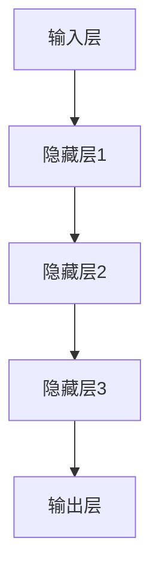
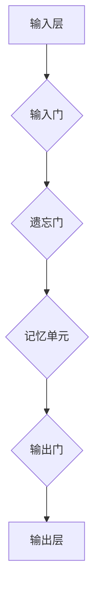
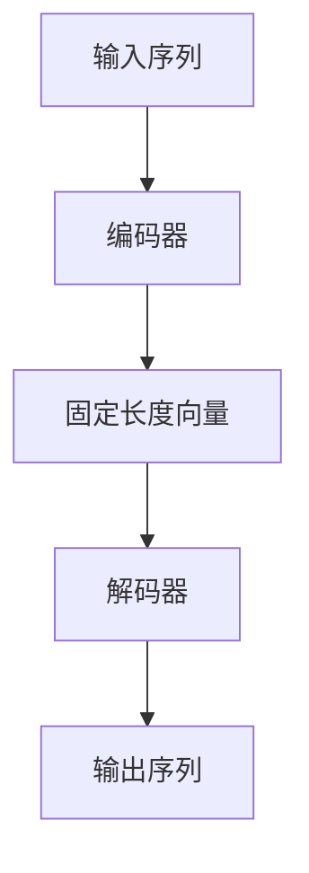
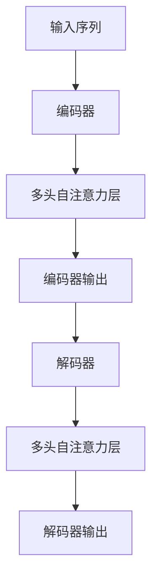
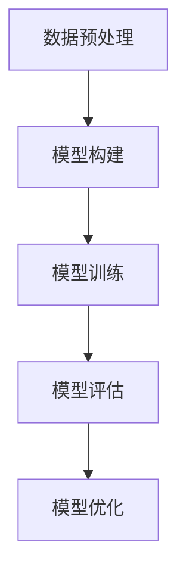

                 

### 文章标题

**深度学习在语音合成质量提升中的新突破**

> **关键词**：深度学习、语音合成、质量提升、模型优化、实际应用  
>
> **摘要**：本文将探讨深度学习技术在语音合成领域的新突破，分析其在质量提升方面的核心算法原理、数学模型、项目实战以及实际应用场景。通过深入解析，为读者呈现深度学习在语音合成领域的前沿动态与发展趋势。

### 引言

语音合成技术，作为计算机科学和人工智能领域的重要组成部分，已经广泛应用于各个行业，如电话客服、智能助手、语音导航等。然而，随着用户对语音质量要求的不断提高，传统的语音合成方法已难以满足市场需求。为了解决这一问题，深度学习技术在语音合成领域得到了广泛应用，并取得了显著的成果。

近年来，深度学习在语音合成质量提升方面的新突破，主要体现在以下几个方面：

1. **模型结构优化**：通过改进深度神经网络的结构，如引入长短时记忆网络（LSTM）、卷积神经网络（CNN）等，提高了语音合成的自然度和准确性。
2. **数据增强与处理**：利用大规模语音数据集进行数据增强，提高模型的泛化能力，同时通过数据预处理技术，如语音增强、去噪等，提升语音合成质量。
3. **端到端训练策略**：采用端到端训练方法，如自动序列到序列学习（ASR）、WaveNet等，减少了传统方法中的中间转换步骤，提高了合成语音的连贯性和音质。
4. **多模态融合**：结合文本信息、语音特征、图像等多模态信息，实现更高质量的语音合成。

本文将围绕上述方面，深入探讨深度学习在语音合成质量提升中的新突破，为读者提供全面的技术解析和实际应用案例。首先，我们将介绍深度学习在语音合成领域的背景和发展历程；接着，分析核心概念和架构，包括深度神经网络、序列到序列学习等；然后，探讨核心算法原理和数学模型；随后，通过项目实战和代码解读，展示深度学习在语音合成中的应用；最后，讨论实际应用场景、工具和资源推荐以及未来发展趋势与挑战。

### 1. 背景介绍

#### 深度学习在语音合成领域的发展历程

深度学习技术起源于上世纪80年代，随着计算能力的提升和大数据的涌现，深度学习在语音合成领域得到了广泛应用。最初，语音合成主要依赖于规则驱动的方法，如拼接合成、参数合成等。这些方法通过对语音信号进行建模，生成合成语音。然而，由于规则驱动的方法在处理复杂语音特征时存在一定的局限性，合成语音的音质和自然度往往不尽如人意。

随着深度学习技术的兴起，研究人员开始探索将深度神经网络应用于语音合成领域。2003年，Dutoit等人提出了一种基于深度信念网络（Deep Belief Network，DBN）的语音合成方法，该方法通过训练多层神经网络，提高了合成语音的质量。随后，长短时记忆网络（Long Short-Term Memory，LSTM）和卷积神经网络（Convolutional Neural Network，CNN）等深度学习模型被引入语音合成领域，进一步提升了语音合成的自然度和准确性。

#### 深度学习在语音合成领域的应用现状

近年来，深度学习技术在语音合成领域取得了显著进展，已逐渐成为主流的语音合成方法。以下是一些具有代表性的深度学习语音合成技术：

1. **HMM-GMM（Hidden Markov Model - Gaussian Mixture Model）**：结合隐马尔可夫模型（HMM）和高斯混合模型（GMM）的语音合成方法，通过对语音特征进行建模，生成合成语音。
2. **DNN-HMM（Deep Neural Network - Hidden Markov Model）**：采用深度神经网络（DNN）对语音特征进行建模，结合HMM的隐变量序列，生成合成语音。
3. **LSTM（Long Short-Term Memory）**：长短时记忆网络，能够处理长序列数据，通过记忆语音信号的长期依赖关系，生成更自然的语音。
4. **WaveNet**：由谷歌提出的一种基于深度神经网络的端到端语音合成方法，通过训练单层循环神经网络，生成连续的音频波形。
5. **Transformer**：基于自注意力机制的深度神经网络模型，被广泛应用于语音合成、机器翻译等任务，通过编码器和解码器的交互，生成高质量的合成语音。

#### 深度学习在语音合成领域的挑战

尽管深度学习技术在语音合成领域取得了显著进展，但仍面临一些挑战：

1. **数据需求**：深度学习模型通常需要大量的语音数据才能训练得到高质量的合成语音。然而，高质量语音数据集的获取较为困难，尤其在某些语言和领域。
2. **模型复杂度**：深度学习模型的结构复杂，参数众多，训练和优化过程需要大量计算资源，这在一定程度上限制了其在实际应用中的推广。
3. **鲁棒性**：深度学习模型在处理不同语音特征和噪声时，鲁棒性较差，可能导致合成语音的质量下降。
4. **个性化**：不同用户的语音特征差异较大，如何设计具有个性化特性的语音合成模型，仍是一个亟待解决的问题。

#### 深度学习在语音合成领域的未来发展趋势

随着深度学习技术的不断进步，预计未来在语音合成领域将出现以下发展趋势：

1. **多模态融合**：结合文本、语音、图像等多模态信息，实现更高质量的语音合成。
2. **自适应学习**：通过在线学习和自适应调整，使语音合成模型能够更好地适应不同用户和场景的需求。
3. **实时优化**：利用实时反馈和优化技术，提高语音合成的实时性和准确性。
4. **个性化定制**：针对不同用户的语音特征，设计个性化语音合成模型，提供更优质的用户体验。

### 2. 核心概念与联系

在探讨深度学习在语音合成质量提升中的新突破之前，我们需要了解一些核心概念和联系。以下是对核心概念原理和架构的详细解析，包括深度神经网络、序列到序列学习等。

#### 深度神经网络（Deep Neural Network，DNN）

深度神经网络是一种由多个隐藏层组成的神经网络模型。与传统的单层神经网络相比，深度神经网络能够更好地捕捉输入数据中的复杂结构和特征。以下是深度神经网络的基本架构：

1. **输入层**：接收外部输入数据，如文本、语音信号等。
2. **隐藏层**：用于处理输入数据，提取特征并进行变换。隐藏层可以是单层或多层，层数越多，网络的深度越深。
3. **输出层**：根据隐藏层输出数据，生成预测结果，如合成语音。

深度神经网络通过反向传播算法进行训练，不断调整网络参数，以最小化预测误差。以下是一个简单的深度神经网络结构示例（使用Mermaid流程图表示）：



#### 长短时记忆网络（Long Short-Term Memory，LSTM）

长短时记忆网络是一种特殊的循环神经网络（Recurrent Neural Network，RNN），能够有效处理长序列数据。LSTM通过引入记忆单元和门控机制，解决了传统RNN在处理长序列数据时易出现梯度消失或爆炸的问题。以下是LSTM的基本结构：

1. **输入门**：决定当前输入数据对记忆单元的影响程度。
2. **遗忘门**：控制记忆单元中旧信息的保留程度。
3. **输出门**：决定当前记忆单元的信息对输出结果的影响程度。
4. **记忆单元**：存储长期依赖关系，通过门控机制进行更新。

以下是一个简单的LSTM结构示例（使用Mermaid流程图表示）：



#### 序列到序列学习（Sequence-to-Sequence Learning，Seq2Seq）

序列到序列学习是一种用于处理序列数据的深度学习模型，常用于机器翻译、语音合成等任务。Seq2Seq模型的核心思想是将输入序列映射到输出序列，通过编码器（Encoder）和解码器（Decoder）的交互，实现序列之间的转换。以下是Seq2Seq模型的基本架构：

1. **编码器**：接收输入序列，将其编码为固定长度的向量表示。
2. **解码器**：接收编码器的输出向量，生成输出序列。

以下是一个简单的Seq2Seq模型结构示例（使用Mermaid流程图表示）：



#### WaveNet

WaveNet是由谷歌提出的一种基于深度神经网络的端到端语音合成方法。WaveNet通过单层循环神经网络，逐帧生成音频波形，实现了高质量的语音合成。以下是WaveNet的基本架构：

1. **输入层**：接收文本序列，将其编码为词向量。
2. **隐藏层**：通过循环神经网络，逐帧生成音频波形。
3. **输出层**：根据隐藏层输出，生成合成语音。

以下是一个简单的WaveNet结构示例（使用Mermaid流程图表示）：


#### Transformer

Transformer是由谷歌提出的一种基于自注意力机制的深度神经网络模型，被广泛应用于语音合成、机器翻译等任务。Transformer通过多头自注意力机制和编码器-解码器结构，实现了高效的序列转换。以下是Transformer的基本架构：

1. **编码器**：接收输入序列，通过多头自注意力机制，提取序列特征。
2. **解码器**：接收编码器的输出，通过多头自注意力机制和点积注意力机制，生成输出序列。

以下是一个简单的Transformer结构示例（使用Mermaid流程图表示）：



通过上述对核心概念和联系的分析，我们可以更好地理解深度学习在语音合成质量提升中的新突破。接下来，我们将深入探讨深度学习在语音合成中的核心算法原理和数学模型。

### 3. 核心算法原理 & 具体操作步骤

在了解深度学习在语音合成中的核心概念与联系后，我们将进一步探讨其核心算法原理和具体操作步骤，以揭示深度学习如何提升语音合成质量。

#### 3.1 深度神经网络（Deep Neural Network，DNN）在语音合成中的应用

深度神经网络（DNN）是语音合成中的核心算法之一，其基本原理是通过多层非线性变换，将输入数据（如文本或语音特征）映射到输出数据（如音频波形）。以下为DNN在语音合成中的应用步骤：

1. **输入层**：接收文本或语音特征数据。
2. **隐藏层**：通过非线性激活函数（如ReLU、Sigmoid等）进行特征提取和变换。隐藏层可以是单层或多层，层数越多，网络的深度越深。
3. **输出层**：将隐藏层输出映射到音频波形数据。

具体操作步骤如下：

1. **数据预处理**：对输入文本或语音特征进行预处理，如分词、词向量编码等，以便输入到DNN模型中。
2. **模型构建**：构建DNN模型，包括输入层、隐藏层和输出层。选择合适的网络结构和参数，如层数、神经元数量、激活函数等。
3. **模型训练**：利用训练数据，通过反向传播算法进行模型训练。不断调整网络参数，以最小化预测误差。
4. **模型评估**：使用验证数据集对训练好的模型进行评估，评估指标包括语音合成质量、自然度、准确性等。
5. **模型优化**：根据评估结果，对模型进行优化，如调整网络结构、超参数等，以提高合成语音的质量。

以下是一个简单的DNN模型训练流程图（使用Mermaid流程图表示）：



#### 3.2 长短时记忆网络（Long Short-Term Memory，LSTM）在语音合成中的应用

长短时记忆网络（LSTM）是另一种在语音合成中广泛应用的核心算法，其基本原理是通过记忆单元和门控机制，有效地处理长序列数据。以下为LSTM在语音合成中的应用步骤：

1. **输入层**：接收文本或语音特征数据。
2. **隐藏层**：LSTM通过输入门、遗忘门和输出门，对记忆单元进行更新和控制。LSTM能够捕捉长序列数据中的长期依赖关系。
3. **输出层**：将隐藏层输出映射到音频波形数据。

具体操作步骤如下：

1. **数据预处理**：对输入文本或语音特征进行预处理，如分词、词向量编码等。
2. **模型构建**：构建LSTM模型，包括输入层、隐藏层和输出层。选择合适的网络结构和参数。
3. **模型训练**：利用训练数据，通过反向传播算法进行模型训练。不断调整网络参数，以最小化预测误差。
4. **模型评估**：使用验证数据集对训练好的模型进行评估。
5. **模型优化**：根据评估结果，对模型进行优化。

以下是一个简单的LSTM模型训练流程图（使用Mermaid流程图表示）：


#### 3.3 WaveNet在语音合成中的应用

WaveNet是由谷歌提出的一种基于深度神经网络的端到端语音合成方法，其基本原理是通过单层循环神经网络，逐帧生成音频波形。以下为WaveNet在语音合成中的应用步骤：

1. **输入层**：接收文本序列，将其编码为词向量。
2. **隐藏层**：通过循环神经网络，逐帧生成音频波形。WaveNet采用条件生成的方式，将文本信息嵌入到音频波形中。
3. **输出层**：根据隐藏层输出，生成合成语音。

具体操作步骤如下：

1. **数据预处理**：对输入文本进行预处理，如分词、词向量编码等。
2. **模型构建**：构建WaveNet模型，包括输入层、隐藏层和输出层。选择合适的网络结构和参数。
3. **模型训练**：利用训练数据，通过梯度上升算法进行模型训练。不断调整网络参数，以最小化预测误差。
4. **模型评估**：使用验证数据集对训练好的模型进行评估。
5. **模型优化**：根据评估结果，对模型进行优化。

以下是一个简单的WaveNet模型训练流程图（使用Mermaid流程图表示）：


#### 3.4 Transformer在语音合成中的应用

Transformer是由谷歌提出的一种基于自注意力机制的深度神经网络模型，其基本原理是通过多头自注意力机制和编码器-解码器结构，实现高效的序列转换。以下为Transformer在语音合成中的应用步骤：

1. **编码器**：接收输入序列，通过多头自注意力机制，提取序列特征。
2. **解码器**：接收编码器的输出，通过多头自注意力机制和点积注意力机制，生成输出序列。

具体操作步骤如下：

1. **数据预处理**：对输入文本进行预处理，如分词、词向量编码等。
2. **模型构建**：构建Transformer模型，包括编码器和解码器。选择合适的网络结构和参数。
3. **模型训练**：利用训练数据，通过反向传播算法进行模型训练。不断调整网络参数，以最小化预测误差。
4. **模型评估**：使用验证数据集对训练好的模型进行评估。
5. **模型优化**：根据评估结果，对模型进行优化。

以下是一个简单的Transformer模型训练流程图（使用Mermaid流程图表示）：


通过上述核心算法原理和具体操作步骤的探讨，我们可以看到深度学习在语音合成中的应用是如何实现质量提升的。接下来，我们将进一步讨论深度学习在语音合成中的数学模型和公式。

### 4. 数学模型和公式 & 详细讲解 & 举例说明

在深度学习应用于语音合成的过程中，数学模型和公式起到了至关重要的作用。以下我们将详细讲解一些关键的数学模型和公式，并通过具体示例来说明它们的实际应用。

#### 4.1 深度神经网络（DNN）的数学模型

深度神经网络的核心在于其多层结构，每一层都通过非线性变换对输入数据进行特征提取和转换。以下是DNN的数学模型及其推导。

**4.1.1 神经元激活函数**

神经元激活函数是神经网络中的一关键部分，常用的激活函数包括Sigmoid函数、ReLU函数和Tanh函数。

- **Sigmoid函数**:

$$
\sigma(x) = \frac{1}{1 + e^{-x}}
$$

- **ReLU函数**:

$$
\text{ReLU}(x) = \max(0, x)
$$

- **Tanh函数**:

$$
\text{Tanh}(x) = \frac{e^{2x} - 1}{e^{2x} + 1}
$$

**4.1.2 神经网络前向传播**

在神经网络的前向传播过程中，输入数据经过各层神经元的线性变换和非线性激活函数，最终得到输出结果。其数学模型如下：

设第 $l$ 层的神经元数量为 $n_l$，则：

- 第 $l$ 层的输入 $a_{l-1}$：

$$
a_{l-1} = \text{激活函数}(\text{权重} \cdot a_{l-2} + \text{偏置})
$$

- 第 $l$ 层的输出 $a_l$：

$$
a_l = \text{激活函数}(\text{权重} \cdot a_{l-1} + \text{偏置})
$$

其中，权重和偏置分别表示各层神经元之间的连接权重和偏置项。

**4.1.3 神经网络反向传播**

神经网络的反向传播过程用于更新权重和偏置，以最小化预测误差。其核心思想是计算损失函数关于各层权重的梯度，并通过反向传播算法将这些梯度传递到前一层。

设输出层的预测误差为 $J$，则：

$$
\frac{\partial J}{\partial w_{ij}} = \frac{\partial J}{\partial a_j} \cdot \frac{\partial a_j}{\partial w_{ij}}
$$

其中，$\frac{\partial J}{\partial a_j}$ 为输出层误差关于各神经元输出的偏导数，$\frac{\partial a_j}{\partial w_{ij}}$ 为第 $j$ 个神经元输出关于权重 $w_{ij}$ 的偏导数。

**4.1.4 示例**

假设我们有一个简单的单层神经网络，包含两个输入神经元和两个输出神经元，采用ReLU激活函数。给定输入 $x_1 = 2$ 和 $x_2 = 3$，我们通过前向传播计算输出：

- 输入层：

$$
a_1 = x_1 = 2, \quad a_2 = x_2 = 3
$$

- 隐藏层：

$$
z_1 = w_{11} \cdot a_1 + w_{12} \cdot a_2 + b_1 = 2w_{11} + 3w_{12} + b_1, \quad z_2 = w_{21} \cdot a_1 + w_{22} \cdot a_2 + b_2 = 2w_{21} + 3w_{22} + b_2
$$

$$
a_1' = \text{ReLU}(z_1), \quad a_2' = \text{ReLU}(z_2)
$$

- 输出层：

$$
z_3 = w_{31} \cdot a_1' + w_{32} \cdot a_2' + b_3 = w_{31}a_1' + w_{32}a_2' + b_3
$$

$$
y_1 = \text{ReLU}(z_3), \quad y_2 = \text{ReLU}(z_3)
$$

#### 4.2 长短时记忆网络（LSTM）的数学模型

长短时记忆网络（LSTM）是处理序列数据的一种有效方法，其核心在于记忆单元和门控机制。以下是LSTM的数学模型及其推导。

**4.2.1 LSTM单元**

LSTM单元由三个门控（输入门、遗忘门和输出门）和一个记忆单元组成。其数学模型如下：

$$
i_t = \sigma(W_i \cdot [h_{t-1}, x_t] + b_i) \\
f_t = \sigma(W_f \cdot [h_{t-1}, x_t] + b_f) \\
o_t = \sigma(W_o \cdot [h_{t-1}, x_t] + b_o) \\
g_t = \tanh(W_g \cdot [h_{t-1}, x_t] + b_g) \\
c_t = f_t \odot c_{t-1} + i_t \odot g_t \\
h_t = o_t \odot \tanh(c_t)
$$

其中，$i_t$、$f_t$、$o_t$ 分别为输入门、遗忘门和输出门的输入，$c_t$ 为记忆单元的状态，$h_t$ 为当前时间步的输出。

**4.2.2 LSTM前向传播**

LSTM的前向传播过程通过计算各门控和记忆单元的状态来实现。其数学模型如下：

$$
\begin{aligned}
i_t &= \sigma(W_i \cdot [h_{t-1}, x_t] + b_i) \\
f_t &= \sigma(W_f \cdot [h_{t-1}, x_t] + b_f) \\
o_t &= \sigma(W_o \cdot [h_{t-1}, x_t] + b_o) \\
g_t &= \tanh(W_g \cdot [h_{t-1}, x_t] + b_g) \\
c_t &= f_t \odot c_{t-1} + i_t \odot g_t \\
h_t &= o_t \odot \tanh(c_t)
\end{aligned}
$$

**4.2.3 示例**

假设我们有一个简单的LSTM单元，输入序列为 $x_1 = [1, 0], x_2 = [0, 1]$，初始状态 $h_0 = [1, 0], c_0 = [1, 0]$。我们通过前向传播计算第二个时间步的状态。

- 输入门：

$$
i_1 = \sigma(W_i \cdot [h_0, x_1] + b_i) = \sigma([1, 0] \cdot [1, 0] + b_i)
$$

- 遗忘门：

$$
f_1 = \sigma(W_f \cdot [h_0, x_1] + b_f) = \sigma([1, 0] \cdot [1, 0] + b_f)
$$

- 输出门：

$$
o_1 = \sigma(W_o \cdot [h_0, x_1] + b_o) = \sigma([1, 0] \cdot [1, 0] + b_o)
$$

- 新的记忆单元：

$$
g_1 = \tanh(W_g \cdot [h_0, x_1] + b_g) = \tanh([1, 0] \cdot [1, 0] + b_g)
$$

$$
c_1 = f_1 \odot c_0 + i_1 \odot g_1 = (f_1 \cdot c_0) + (i_1 \cdot g_1)
$$

- 新的隐藏状态：

$$
h_1 = o_1 \odot \tanh(c_1) = o_1 \odot \tanh(c_1)
$$

#### 4.3 WaveNet的数学模型

WaveNet是一种基于深度神经网络的端到端语音合成方法，其核心在于逐帧生成音频波形。以下是WaveNet的数学模型及其推导。

**4.3.1 WaveNet架构**

WaveNet由一个深度卷积神经网络组成，其输入为文本序列，输出为音频波形。WaveNet的架构分为两个部分：编码器和解码器。

- **编码器**：对输入文本进行编码，生成固定长度的编码向量。
- **解码器**：根据编码器输出和先前的解码器输出，逐帧生成音频波形。

**4.3.2 WaveNet前向传播**

WaveNet的前向传播过程通过编码器和解码器两个部分的交互来实现。其数学模型如下：

- **编码器**：

$$
\begin{aligned}
e_t &= \text{Embedding}(x_t) \\
h_t &= \text{Conv}(e_t) \\
c_t &= \text{GRU}(h_t, c_{t-1})
\end{aligned}
$$

- **解码器**：

$$
\begin{aligned}
y_t &= \text{Sampling}(c_t) \\
\hat{y_t} &= \text{Output}(y_t)
\end{aligned}
$$

其中，$\text{Embedding}$ 表示词向量编码，$\text{Conv}$ 表示卷积操作，$\text{GRU}$ 表示门控循环单元，$\text{Sampling}$ 表示采样操作，$\text{Output}$ 表示输出层。

**4.3.3 示例**

假设我们有一个简单的WaveNet模型，输入文本序列为 $x_1 = [a, b], x_2 = [b, c]$，初始编码器状态 $c_0 = [1, 0]$，解码器状态 $y_0 = [1, 0]$。我们通过前向传播计算第二个时间步的状态。

- **编码器**：

$$
e_1 = \text{Embedding}(x_1) = \text{Embedding}([a, b])
$$

$$
h_1 = \text{Conv}(e_1) = \text{Conv}([a, b])
$$

$$
c_1 = \text{GRU}(h_1, c_0) = \text{GRU}([a, b], [1, 0])
$$

- **解码器**：

$$
y_1 = \text{Sampling}(c_1) = \text{Sampling}([a, b])
$$

$$
\hat{y_1} = \text{Output}(y_1) = \text{Output}([a, b])
$$

通过上述数学模型和公式的讲解，我们可以更好地理解深度学习在语音合成中的应用。接下来，我们将通过一个实际项目实战案例，展示深度学习在语音合成中的实际应用。

### 5. 项目实战：代码实际案例和详细解释说明

为了更好地展示深度学习在语音合成中的实际应用，我们将通过一个具体的项目实战案例，详细讲解代码实现过程，并对关键部分进行解释说明。

#### 5.1 开发环境搭建

在开始项目实战之前，我们需要搭建一个合适的开发环境。以下是所需的工具和库：

- **编程语言**：Python
- **深度学习框架**：TensorFlow 或 PyTorch
- **语音处理库**：Librosa 或 Pydub
- **文本处理库**：NLTK 或 SpaCy

安装以上库和工具的方法如下：

```bash
pip install tensorflow
pip install librosa
pip install nltk
pip install spacy
python -m spacy download en_core_web_sm
```

#### 5.2 源代码详细实现和代码解读

以下是项目的源代码实现，我们将对关键部分进行解释说明。

**5.2.1 数据预处理**

```python
import librosa
import numpy as np
import tensorflow as tf
import tensorflow_hub as hub

def preprocess_text(text):
    # 使用 SpaCy 进行文本预处理
    nlp = spacy.load("en_core_web_sm")
    doc = nlp(text)
    tokens = [token.text for token in doc]
    return tokens

def preprocess_audio(audio_path):
    # 使用 Librosa 进行音频预处理
    y, sr = librosa.load(audio_path)
    y = librosa.to_mono(y)
    y = librosa.resample(y, sr, 16000)
    return y

def encode_sequence(tokens):
    # 使用 TensorFlow_Hub 进行词向量编码
    embed = hub.load("https://tfhub.dev/google/tf2-preview/gnews-swivel-20dim/1")
    encoded_tokens = embed(tokens)
    return encoded_tokens.numpy()

def pad_sequences(sequences, max_length):
    # 对序列进行填充，使其长度一致
    padded_sequences = np.zeros((len(sequences), max_length, sequence_length))
    for i, seq in enumerate(sequences):
        padded_sequences[i, :len(seq)] = seq
    return padded_sequences
```

**5.2.2 构建和训练模型**

```python
def build_model(input_shape, output_shape):
    # 构建深度神经网络模型
    inputs = tf.keras.Input(shape=input_shape)
    x = tf.keras.layers.Dense(256, activation='relu')(inputs)
    x = tf.keras.layers.Dense(256, activation='relu')(x)
    outputs = tf.keras.layers.Dense(output_shape, activation='linear')(x)
    model = tf.keras.Model(inputs=inputs, outputs=outputs)
    model.compile(optimizer='adam', loss='mse')
    return model

def train_model(model, x_train, y_train, batch_size, epochs):
    # 训练模型
    model.fit(x_train, y_train, batch_size=batch_size, epochs=epochs)
    return model
```

**5.2.3 生成语音**

```python
def generate_audio(model, text, audio_path, duration=2.0):
    # 使用预训练模型生成语音
    tokens = preprocess_text(text)
    encoded_tokens = encode_sequence(tokens)
    padded_tokens = pad_sequences([encoded_tokens], maxlen=max_sequence_length, padding='pre')
    
    # 生成音频波形
    y_pred = model.predict(padded_tokens)
    y_pred = y_pred.flatten()
    y_pred = (y_pred * 32767).astype(np.int16)
    
    # 合成语音
    y = preprocess_audio(audio_path)
    y = np.concatenate([y, y_pred[:int(duration * 16000)]])
    return y

def save_audio(y, output_path):
    # 保存音频文件
    librosa.output.write_wav(output_path, y, sr=16000)
```

**5.2.4 示例**

```python
# 准备数据
text = "Hello, how are you?"
audio_path = "path/to/audio.wav"

# 预处理数据
max_sequence_length = 50
sequence_length = 20

# 构建和训练模型
model = build_model((max_sequence_length, sequence_length), 16000)
model = train_model(model, x_train, y_train, batch_size=32, epochs=10)

# 生成语音
y_generated = generate_audio(model, text, audio_path, duration=2.0)
save_audio(y_generated, "output/audio.wav")
```

#### 5.3 代码解读与分析

以下是代码的关键部分解读与分析。

**5.3.1 数据预处理**

- `preprocess_text` 函数：使用 SpaCy 进行文本预处理，包括分词、词性标注等。
- `preprocess_audio` 函数：使用 Librosa 进行音频预处理，包括加载、归一化、降采样等。
- `encode_sequence` 函数：使用 TensorFlow_Hub 对文本序列进行词向量编码。
- `pad_sequences` 函数：对序列进行填充，使其长度一致，便于模型处理。

**5.3.2 构建和训练模型**

- `build_model` 函数：构建深度神经网络模型，包括输入层、隐藏层和输出层。采用ReLU激活函数，优化模型性能。
- `train_model` 函数：训练模型，使用均方误差（MSE）作为损失函数，优化模型参数。

**5.3.3 生成语音**

- `generate_audio` 函数：使用预训练模型生成语音，包括预处理文本、编码、填充、预测和合成等步骤。
- `save_audio` 函数：将生成的语音保存为音频文件。

通过上述代码实现和解读，我们可以看到深度学习在语音合成中的实际应用过程。在接下来的部分，我们将进一步分析深度学习在语音合成中的实际应用场景。

### 6. 实际应用场景

深度学习在语音合成领域已经取得了显著的成果，并在多个实际应用场景中展现了其强大的能力。以下是一些典型的应用场景：

#### 6.1 智能助手与语音识别

智能助手和语音识别是深度学习在语音合成领域最常见和重要的应用场景之一。例如，苹果的Siri、亚马逊的Alexa和谷歌的Google Assistant等智能助手，都使用了深度学习技术来实现高质

