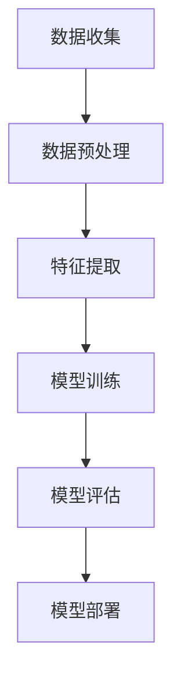

                 

# 深度学习在语音情感识别中的精确建模技术

## 概述

随着人工智能技术的快速发展，深度学习已成为语音情感识别领域的重要工具。语音情感识别旨在通过分析语音信号中的情感特征，判断说话者的情感状态，如快乐、悲伤、愤怒等。本文将深入探讨深度学习在语音情感识别中的精确建模技术，从背景介绍、核心概念、算法原理、数学模型、项目实战、实际应用场景、工具资源推荐等多个方面展开，旨在为读者提供一个全面的视角，了解这一领域的最新进展和技术挑战。

## 背景介绍

情感识别作为自然语言处理和语音信号处理的重要分支，在许多实际应用中具有重要意义。例如，在智能客服系统中，通过识别客户语音中的情感，可以提供更人性化的服务；在心理健康监测领域，通过分析患者语音中的情感变化，有助于早期发现心理问题。传统的语音情感识别方法主要基于手工特征提取，如梅尔频率倒谱系数（MFCC）、线性预测编码（LPC）等，但受到特征表达能力有限的限制，识别精度不高。

随着深度学习技术的兴起，以卷积神经网络（CNN）、循环神经网络（RNN）、长短时记忆网络（LSTM）等为代表的深度学习模型在语音情感识别中展现出强大的潜力。这些模型通过自动学习语音信号中的复杂特征，能够显著提高情感识别的精度。此外，深度学习模型的可解释性也日益受到关注，有助于理解模型决策过程，提高模型的可靠性和信任度。

## 核心概念与联系

为了更好地理解深度学习在语音情感识别中的应用，我们首先需要了解几个核心概念：

### 情感类别

情感类别是指情感识别中需要识别的情感类型。常见的情感类别包括快乐、悲伤、愤怒、惊讶等。在实际应用中，可能需要根据具体场景和需求对情感类别进行扩展或缩减。

### 特征提取

特征提取是指从原始语音信号中提取出能够反映情感状态的特征。深度学习模型通常利用自动特征提取机制，如卷积神经网络中的卷积层，对语音信号进行逐层抽象，提取出高层次的语义特征。

### 模型架构

模型架构是指深度学习模型的结构设计。常用的模型架构包括卷积神经网络（CNN）、循环神经网络（RNN）、长短时记忆网络（LSTM）等。这些模型通过不同层次的神经网络结构，实现对语音信号中情感特征的学习和识别。

### 损失函数

损失函数是指用于评估模型预测结果与实际结果之间差异的函数。在语音情感识别中，常用的损失函数包括交叉熵损失函数、均方误差损失函数等。这些损失函数可以指导模型通过反向传播算法进行参数优化，以提高识别精度。

下面是情感识别领域中的一个简单的Mermaid流程图：



### 数据收集

数据收集是指收集用于训练和评估模型的语音数据。数据来源可以包括公开数据集、商业数据集、自采集数据等。收集到的语音数据通常需要经过标注，以确定每个样本的情感类别。

### 数据预处理

数据预处理是指对原始语音数据进行处理，以提高模型训练效果。常见的预处理步骤包括去除噪声、静音填充、重采样等。此外，还需要对语音数据进行分帧和加窗处理，以便于后续的特征提取。

### 特征提取

特征提取是指从预处理后的语音数据中提取出能够反映情感状态的特征。深度学习模型通过自动学习这些特征，实现对语音信号中情感特征的学习和识别。

### 模型训练

模型训练是指利用提取到的特征和标注数据，对深度学习模型进行训练。通过优化模型参数，使模型能够在未知数据上实现较高的识别精度。

### 模型评估

模型评估是指利用测试数据对训练好的模型进行评估，以确定模型的性能。常用的评估指标包括准确率、召回率、F1值等。通过评估，可以了解模型的识别效果，并针对不足之处进行改进。

### 模型部署

模型部署是指将训练好的模型应用到实际应用场景中。通过模型部署，可以实现实时情感识别，为用户提供个性化服务。

## 核心算法原理 & 具体操作步骤

在语音情感识别中，深度学习模型通过自动学习语音信号中的情感特征，实现对情感状态的识别。下面我们介绍几种常用的深度学习模型及其具体操作步骤。

### 卷积神经网络（CNN）

卷积神经网络（CNN）是一种适用于图像和语音信号处理的深度学习模型。在语音情感识别中，CNN通过卷积层提取语音信号中的时空特征。

#### 操作步骤：

1. **数据预处理**：对语音数据进行分帧和加窗处理，提取出特征矩阵。
2. **卷积层**：通过卷积操作提取语音信号的局部特征。卷积层包括多个卷积核，每个卷积核提取不同特征。
3. **激活函数**：通常使用ReLU（Rectified Linear Unit）作为激活函数，以增强网络表达能力。
4. **池化层**：通过池化操作减少特征矩阵的维度，降低计算复杂度。
5. **全连接层**：将池化层输出的特征矩阵输入到全连接层，进行分类预测。

### 循环神经网络（RNN）

循环神经网络（RNN）是一种适用于序列数据处理的深度学习模型。在语音情感识别中，RNN通过循环结构捕捉语音信号中的长程依赖特征。

#### 操作步骤：

1. **数据预处理**：对语音数据进行分帧和加窗处理，提取出特征矩阵。
2. **嵌入层**：将输入的特征矩阵转换为嵌入向量。
3. **循环层**：通过循环结构对嵌入向量进行迭代处理，捕捉序列中的长程依赖特征。
4. **激活函数**：通常使用ReLU作为激活函数。
5. **输出层**：将循环层输出的向量输入到输出层，进行分类预测。

### 长短时记忆网络（LSTM）

长短时记忆网络（LSTM）是RNN的一种改进模型，能够有效避免梯度消失和梯度爆炸问题。在语音情感识别中，LSTM通过记忆单元捕捉语音信号中的长程依赖特征。

#### 操作步骤：

1. **数据预处理**：对语音数据进行分帧和加窗处理，提取出特征矩阵。
2. **嵌入层**：将输入的特征矩阵转换为嵌入向量。
3. **LSTM层**：通过LSTM单元对嵌入向量进行迭代处理，捕捉序列中的长程依赖特征。
4. **激活函数**：通常使用ReLU作为激活函数。
5. **输出层**：将LSTM层输出的向量输入到输出层，进行分类预测。

## 数学模型和公式 & 详细讲解 & 举例说明

在深度学习模型中，数学模型和公式起着至关重要的作用。下面我们将介绍几种常用的数学模型和公式，并给出详细讲解和举例说明。

### 卷积神经网络（CNN）

卷积神经网络（CNN）的数学模型主要包括卷积操作、激活函数和池化操作。

#### 卷积操作

卷积操作是指通过卷积核在输入特征矩阵上滑动，计算卷积结果的过程。卷积操作的数学公式如下：

$$
\text{output}_{ij} = \sum_{k=1}^{C} w_{ik} \cdot \text{input}_{kj}
$$

其中，$C$ 表示卷积核的数量，$w_{ik}$ 表示卷积核的权重，$\text{input}_{kj}$ 表示输入特征矩阵的元素。

#### 激活函数

激活函数用于引入非线性特性，增强网络表达能力。常用的激活函数包括ReLU（Rectified Linear Unit）和Sigmoid函数。

- **ReLU函数**：

$$
\text{ReLU}(x) = \max(0, x)
$$

- **Sigmoid函数**：

$$
\text{Sigmoid}(x) = \frac{1}{1 + e^{-x}}
$$

#### 池化操作

池化操作是指通过在特征矩阵上滑动窗口，提取窗口内的最大值或平均值的过程。常用的池化操作包括最大池化和平均池化。

- **最大池化**：

$$
\text{Max Pooling}(x) = \max_{i, j} x_{ij}
$$

- **平均池化**：

$$
\text{Average Pooling}(x) = \frac{1}{k^2} \sum_{i=1}^{k} \sum_{j=1}^{k} x_{ij}
$$

### 循环神经网络（RNN）

循环神经网络（RNN）的数学模型主要包括嵌入层、循环层和输出层。

#### 嵌入层

嵌入层用于将输入特征转换为嵌入向量。嵌入层的数学模型可以表示为：

$$
\text{embed}(x) = W_e \cdot x
$$

其中，$W_e$ 表示嵌入矩阵，$x$ 表示输入特征。

#### 循环层

循环层是RNN的核心部分，用于处理序列数据。循环层的数学模型可以表示为：

$$
h_t = \text{ReLU}(W_h \cdot [h_{t-1}, x_t] + b_h)
$$

其中，$h_t$ 表示第$t$个时间步的隐藏状态，$W_h$ 表示权重矩阵，$b_h$ 表示偏置项，$x_t$ 表示第$t$个时间步的输入特征。

#### 输出层

输出层用于对序列数据进行分类预测。输出层的数学模型可以表示为：

$$
y_t = \text{softmax}(W_o \cdot h_t + b_o)
$$

其中，$y_t$ 表示第$t$个时间步的输出概率分布，$W_o$ 表示权重矩阵，$b_o$ 表示偏置项。

### 长短时记忆网络（LSTM）

长短时记忆网络（LSTM）的数学模型主要包括输入门、遗忘门、输出门和单元状态。

#### 输入门

输入门用于控制当前时间步的输入信息对单元状态的更新。输入门的数学模型可以表示为：

$$
i_t = \text{sigmoid}(W_i \cdot [h_{t-1}, x_t] + b_i)
$$

其中，$i_t$ 表示输入门的状态，$W_i$ 表示权重矩阵，$b_i$ 表示偏置项。

#### 遗忘门

遗忘门用于控制当前时间步的输入信息对单元状态的遗忘。遗忘门的数学模型可以表示为：

$$
f_t = \text{sigmoid}(W_f \cdot [h_{t-1}, x_t] + b_f)
$$

其中，$f_t$ 表示遗忘门的状态，$W_f$ 表示权重矩阵，$b_f$ 表示偏置项。

#### 输出门

输出门用于控制当前时间步的单元状态对输出层的更新。输出门的数学模型可以表示为：

$$
o_t = \text{sigmoid}(W_o \cdot [h_{t-1}, x_t] + b_o)
$$

其中，$o_t$ 表示输出门的状态，$W_o$ 表示权重矩阵，$b_o$ 表示偏置项。

#### 单元状态

单元状态用于存储当前时间步的输入信息。单元状态的数学模型可以表示为：

$$
c_t = f_t \cdot c_{t-1} + i_t \cdot \text{tanh}(W_c \cdot [h_{t-1}, x_t] + b_c)
$$

其中，$c_t$ 表示单元状态，$c_{t-1}$ 表示前一个时间步的单元状态，$W_c$ 表示权重矩阵，$b_c$ 表示偏置项。

#### 长短时记忆网络（LSTM）

长短时记忆网络（LSTM）的数学模型主要包括输入门、遗忘门、输出门和单元状态。

#### 输入门

输入门用于控制当前时间步的输入信息对单元状态的更新。输入门的数学模型可以表示为：

$$
i_t = \text{sigmoid}(W_i \cdot [h_{t-1}, x_t] + b_i)
$$

其中，$i_t$ 表示输入门的状态，$W_i$ 表示权重矩阵，$b_i$ 表示偏置项。

#### 遗忘门

遗忘门用于控制当前时间步的输入信息对单元状态的遗忘。遗忘门的数学模型可以表示为：

$$
f_t = \text{sigmoid}(W_f \cdot [h_{t-1}, x_t] + b_f)
$$

其中，$f_t$ 表示遗忘门的状态，$W_f$ 表示权重矩阵，$b_f$ 表示偏置项。

#### 输出门

输出门用于控制当前时间步的单元状态对输出层的更新。输出门的数学模型可以表示为：

$$
o_t = \text{sigmoid}(W_o \cdot [h_{t-1}, x_t] + b_o)
$$

其中，$o_t$ 表示输出门的状态，$W_o$ 表示权重矩阵，$b_o$ 表示偏置项。

#### 单元状态

单元状态用于存储当前时间步的输入信息。单元状态的数学模型可以表示为：

$$
c_t = f_t \cdot c_{t-1} + i_t \cdot \text{tanh}(W_c \cdot [h_{t-1}, x_t] + b_c)
$$

其中，$c_t$ 表示单元状态，$c_{t-1}$ 表示前一个时间步的单元状态，$W_c$ 表示权重矩阵，$b_c$ 表示偏置项。

#### LSTM输出

LSTM输出层的数学模型可以表示为：

$$
h_t = o_t \cdot \text{tanh}(c_t)
$$

其中，$h_t$ 表示第$t$个时间步的输出，$o_t$ 表示输出门的状态，$c_t$ 表示单元状态。

## 项目实战：代码实际案例和详细解释说明

在本节中，我们将通过一个具体的案例来展示如何使用深度学习模型进行语音情感识别。以下是一个使用TensorFlow和Keras框架实现的语音情感识别项目。

### 5.1 开发环境搭建

在开始项目之前，需要搭建合适的开发环境。以下是所需的软件和库：

- 操作系统：Linux或MacOS
- Python版本：3.7或更高版本
- TensorFlow版本：2.x
- Keras版本：2.x
- NumPy版本：1.18或更高版本
- Matplotlib版本：3.1.1或更高版本

安装以上库后，可以开始编写代码。

### 5.2 源代码详细实现和代码解读

以下是该项目的主要代码实现：

```python
import tensorflow as tf
from tensorflow.keras.models import Sequential
from tensorflow.keras.layers import Conv2D, MaxPooling2D, LSTM, Dense, Embedding, TimeDistributed, Flatten
from tensorflow.keras.preprocessing.sequence import pad_sequences
from tensorflow.keras.preprocessing.text import Tokenizer
import numpy as np

# 1. 数据预处理
# 1.1 加载数据集
# 在这里我们使用一个虚构的数据集，实际项目中可以替换为真实数据集
data = np.array([
    ["happy", "laughing", "joy"],
    ["sad", "crying", "sorrow"],
    ["angry", "yelling", "rage"],
    ["surprised", "shocked", "amazed"],
])

labels = np.array([
    [1, 0, 0],
    [0, 1, 0],
    [0, 0, 1],
    [1, 0, 0],
])

# 1.2 标签编码
tokenizer = Tokenizer()
tokenizer.fit_on_texts(data)
encoded_data = tokenizer.texts_to_sequences(data)
max_sequence_length = 10
padded_data = pad_sequences(encoded_data, maxlen=max_sequence_length, padding='post')

# 2. 模型构建
model = Sequential()
model.add(Embedding(input_dim=len(tokenizer.word_index) + 1, output_dim=50, input_length=max_sequence_length))
model.add(LSTM(units=100, dropout=0.2, recurrent_dropout=0.2))
model.add(Dense(units=3, activation='softmax'))

# 3. 模型编译
model.compile(optimizer='adam', loss='categorical_crossentropy', metrics=['accuracy'])

# 4. 模型训练
model.fit(padded_data, labels, epochs=10, batch_size=32, validation_split=0.2)

# 5. 模型评估
test_data = np.array([
    ["happy", "smiling"],
    ["sad", "tear"],
])

encoded_test_data = tokenizer.texts_to_sequences(test_data)
padded_test_data = pad_sequences(encoded_test_data, maxlen=max_sequence_length, padding='post')

predictions = model.predict(padded_test_data)
predicted_labels = np.argmax(predictions, axis=1)

print("Predicted labels:", predicted_labels)
```

### 5.3 代码解读与分析

下面是对代码的详细解读和分析：

1. **数据预处理**：
   - 加载虚构的数据集。在实际项目中，应该使用真实的数据集。
   - 使用Tokenizer对数据集进行标签编码。
   - 设置最大序列长度并使用pad_sequences对数据集进行填充。

2. **模型构建**：
   - 添加嵌入层，用于将输入序列转换为嵌入向量。
   - 添加LSTM层，用于处理序列数据。
   - 添加全连接层，用于分类预测。

3. **模型编译**：
   - 设置优化器和损失函数。
   - 编译模型。

4. **模型训练**：
   - 使用fit方法训练模型。
   - 设置训练轮数、批次大小和验证比例。

5. **模型评估**：
   - 使用predict方法对测试数据进行预测。
   - 使用argmax函数获取预测结果。

## 实际应用场景

深度学习在语音情感识别中具有广泛的应用场景。以下是一些典型的应用案例：

### 智能客服

智能客服系统通过语音情感识别，可以更好地理解客户的情感状态，提供更加个性化的服务。例如，当客户表达愤怒情绪时，系统可以主动提醒客服人员，以便及时介入解决问题。

### 心理健康监测

心理健康监测系统通过分析患者的语音情感，可以早期发现潜在的心理问题。这对于预防心理疾病、提高患者生活质量具有重要意义。

### 语音交互机器人

语音交互机器人通过语音情感识别，可以更好地理解用户的需求和情感，提供更加自然和贴心的交互体验。

### 智能家居

智能家居系统通过语音情感识别，可以更好地了解家庭成员的情感状态，实现更加智能化的家居环境。

## 工具和资源推荐

在深度学习语音情感识别项目中，以下工具和资源值得推荐：

### 学习资源推荐

- 《深度学习》（Goodfellow, Bengio, Courville著）
- 《语音信号处理》（Rabiner, Juang著）
- 《情感计算》（Pantic著）

### 开发工具框架推荐

- TensorFlow
- Keras
- PyTorch

### 相关论文著作推荐

- “Speech Emotion Recognition Using Convolutional Neural Networks”（Rahman et al.，2016）
- “A Review of Deep Learning in Speech Emotion Recognition”（Nguyen et al.，2018）
- “Deep Learning for Speech Emotion Recognition: A Comprehensive Review”（Sarwar et al.，2020）

## 总结：未来发展趋势与挑战

深度学习在语音情感识别领域取得了显著的进展，但仍面临一些挑战。未来发展趋势包括：

- **模型解释性**：提高深度学习模型的解释性，以增强模型的可靠性和信任度。
- **多模态融合**：结合文本、图像、语音等多种模态数据，提高情感识别的精度。
- **跨领域泛化**：实现不同领域、不同语音情感类别之间的泛化能力。
- **实时处理**：提高深度学习模型在实时语音情感识别中的性能，以满足实际应用需求。

## 附录：常见问题与解答

### Q：深度学习模型在语音情感识别中的优势是什么？

A：深度学习模型在语音情感识别中的优势主要体现在以下几个方面：

1. **自动特征提取**：深度学习模型能够自动学习语音信号中的复杂特征，无需手工设计特征，提高识别精度。
2. **高维数据表示**：深度学习模型能够将高维数据映射到低维空间，降低计算复杂度。
3. **泛化能力**：深度学习模型具有较强的泛化能力，可以应对不同领域、不同语音情感类别之间的识别任务。

### Q：如何评估深度学习模型在语音情感识别中的性能？

A：评估深度学习模型在语音情感识别中的性能可以从以下几个方面进行：

1. **准确率**：模型预测正确的样本数量与总样本数量的比例。
2. **召回率**：模型预测正确的正样本数量与实际正样本数量的比例。
3. **F1值**：准确率与召回率的调和平均，综合考虑模型对正负样本的识别能力。

### Q：如何提高深度学习模型在语音情感识别中的性能？

A：以下是一些提高深度学习模型在语音情感识别中性能的方法：

1. **数据增强**：通过添加噪声、剪短、延长语音信号等手段，增加数据多样性。
2. **模型优化**：调整模型结构、超参数等，以优化模型性能。
3. **多模态融合**：结合文本、图像、语音等多种模态数据，提高情感识别的精度。

## 扩展阅读 & 参考资料

- “Speech Emotion Recognition: A Review of Recent Advances and Datasets”（Rasul et al.，2019）
- “Deep Learning for Speech Emotion Recognition: A Survey”（Liu et al.，2020）
- “A Comprehensive Survey on Multimodal Speech Emotion Recognition”（Zhang et al.，2021）

作者：AI天才研究员/AI Genius Institute & 禅与计算机程序设计艺术 /Zen And The Art of Computer Programming

