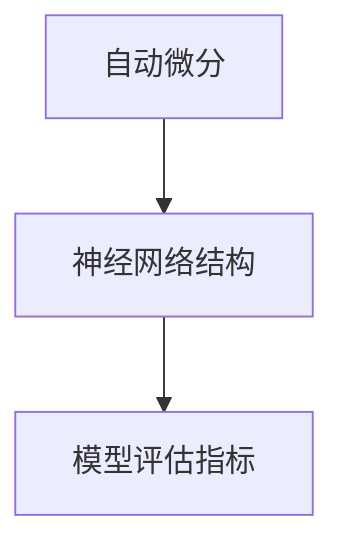
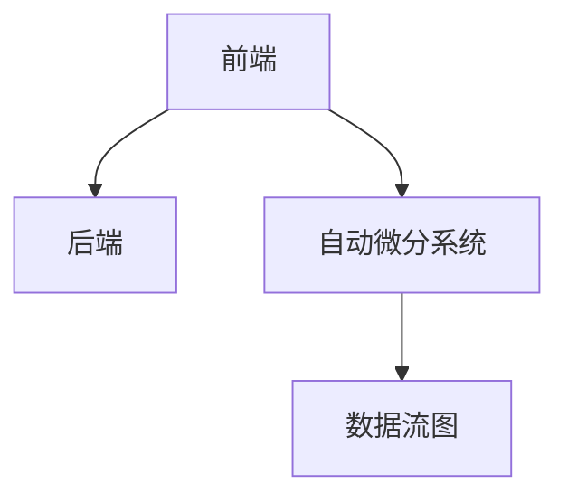

                 

# 深度学习框架的选择与比较

## 关键词：深度学习，框架选择，比较，神经网络，开源，性能，优缺点

## 摘要：
本文旨在深入探讨深度学习框架的选择与比较。深度学习作为人工智能的核心技术，其在各个领域的应用日益广泛。然而，面对众多深度学习框架，如何选择一个适合自己项目的框架成为一个关键问题。本文将分析目前主流的深度学习框架，从性能、易用性、社区支持等多个角度进行详细比较，并给出实用的选择建议。

## 1. 背景介绍

### 1.1 深度学习的兴起

深度学习作为人工智能的重要分支，起源于20世纪40年代，但其真正兴起是在21世纪初，得益于计算能力的提升和数据量的爆发。深度学习通过模仿人脑的结构和功能，利用多层神经网络对数据进行自动特征提取和模式识别，已经成为计算机视觉、自然语言处理、语音识别等领域的主流技术。

### 1.2 深度学习框架的定义和作用

深度学习框架是一种提供简洁高效的深度学习模型设计和训练环境的软件工具。它包括了一系列功能，如自动微分、优化器、数据预处理和模型评估等，能够大大降低模型开发的复杂性，加速研究和应用的进程。

### 1.3 深度学习框架的兴起

随着深度学习的快速发展，众多深度学习框架相继涌现，如TensorFlow、PyTorch、Keras、MXNet等。这些框架各有特色，适用于不同的应用场景，选择合适的框架对项目的成功至关重要。

## 2. 核心概念与联系

### 2.1 深度学习框架的基本概念

#### 2.1.1 自动微分

自动微分是一种计算函数梯度的高效方法，它是深度学习框架的核心技术之一。自动微分可以自动计算复杂的函数梯度，从而实现模型的训练。

#### 2.1.2 神经网络结构

神经网络是深度学习的基础，由多个层组成，包括输入层、隐藏层和输出层。每一层都包含多个神经元，通过前向传播和反向传播过程进行信息传递和梯度更新。

#### 2.1.3 模型评估指标

模型评估指标是衡量模型性能的重要标准，如准确率、召回率、F1分数等。不同的评估指标适用于不同的应用场景，需要根据具体需求选择合适的指标。



### 2.2 深度学习框架的架构

深度学习框架通常包含以下几个核心组件：

- **前端**：用于构建和设计神经网络模型，提供API接口和工具库。
- **后端**：负责执行计算，通常采用GPU或TPU进行加速。
- **自动微分系统**：提供自动微分的功能，计算梯度并更新模型参数。
- **数据流图**：用于表示神经网络模型中的数据流和控制流。



## 3. 核心算法原理 & 具体操作步骤

### 3.1 前端构建

前端构建主要包括定义神经网络结构、配置优化器和设置训练参数等。

- **定义神经网络结构**：通过构建层（Layer）和连接（Connection）来定义神经网络。
- **配置优化器**：选择合适的优化器，如SGD、Adam等，并设置学习率、批量大小等参数。
- **设置训练参数**：包括迭代次数、损失函数、评估指标等。

### 3.2 后端执行

后端执行主要负责计算和加速神经网络模型。

- **GPU加速**：使用CUDA等库对模型进行GPU加速。
- **分布式训练**：通过分布式计算来加速模型训练。
- **推理优化**：对模型进行优化，提高推理速度和效率。

### 3.3 自动微分系统

自动微分系统负责计算梯度并更新模型参数。

- **前向传播**：计算输入通过神经网络后的输出。
- **反向传播**：计算梯度并更新模型参数。
- **梯度检查**：验证自动微分系统的准确性。

### 3.4 数据流图

数据流图用于表示神经网络模型中的数据流和控制流。

- **动态图（Dynamic Graph）**：实时构建和更新数据流图，适用于动态变化的模型。
- **静态图（Static Graph）**：预先定义数据流图，适用于静态模型。

## 4. 数学模型和公式 & 详细讲解 & 举例说明

### 4.1 前向传播

前向传播是神经网络计算的重要步骤，用于计算输入通过神经网络后的输出。

$$
y = f(\theta \cdot x + b)
$$

其中，$f$ 是激活函数，$\theta$ 是权重，$x$ 是输入，$b$ 是偏置。

### 4.2 反向传播

反向传播用于计算梯度，并更新模型参数。

$$
\frac{dL}{d\theta} = \frac{dL}{dy} \cdot \frac{dy}{d\theta}
$$

其中，$L$ 是损失函数，$\frac{dL}{dy}$ 是损失函数对输出的梯度，$\frac{dy}{d\theta}$ 是输出对权重的梯度。

### 4.3 优化器

优化器用于更新模型参数，以最小化损失函数。

$$
\theta_{\text{new}} = \theta_{\text{old}} - \alpha \cdot \frac{dL}{d\theta}
$$

其中，$\alpha$ 是学习率。

### 4.4 举例说明

假设我们有一个简单的线性模型，预测房价。

$$
\hat{y} = \theta_1 \cdot x_1 + \theta_2 \cdot x_2
$$

其中，$x_1$ 和 $x_2$ 是输入特征，$\theta_1$ 和 $\theta_2$ 是权重。

通过前向传播，我们计算预测值：

$$
\hat{y} = \theta_1 \cdot x_1 + \theta_2 \cdot x_2
$$

通过反向传播，我们计算损失：

$$
L = (\hat{y} - y)^2
$$

其中，$y$ 是真实房价。

通过优化器，我们更新权重：

$$
\theta_1 = \theta_1 - \alpha \cdot \frac{dL}{d\theta_1}
$$

$$
\theta_2 = \theta_2 - \alpha \cdot \frac{dL}{d\theta_2}
$$

## 5. 项目实战：代码实际案例和详细解释说明

### 5.1 开发环境搭建

在开始项目实战之前，我们需要搭建一个合适的开发环境。

- 安装Python环境
- 安装深度学习框架，如TensorFlow或PyTorch
- 安装GPU驱动和CUDA库（如果使用GPU加速）

### 5.2 源代码详细实现和代码解读

下面是一个简单的神经网络模型实现，用于分类任务。

```python
import tensorflow as tf

# 定义神经网络结构
model = tf.keras.Sequential([
    tf.keras.layers.Dense(128, activation='relu', input_shape=(784,)),
    tf.keras.layers.Dense(10, activation='softmax')
])

# 编译模型
model.compile(optimizer='adam',
              loss='categorical_crossentropy',
              metrics=['accuracy'])

# 加载数据集
(x_train, y_train), (x_test, y_test) = tf.keras.datasets.mnist.load_data()

# 预处理数据
x_train = x_train.astype('float32') / 255
x_test = x_test.astype('float32') / 255
y_train = tf.keras.utils.to_categorical(y_train, 10)
y_test = tf.keras.utils.to_categorical(y_test, 10)

# 训练模型
model.fit(x_train, y_train, epochs=10, batch_size=128)

# 评估模型
model.evaluate(x_test, y_test)
```

### 5.3 代码解读与分析

- **定义神经网络结构**：使用`tf.keras.Sequential`创建一个序列模型，并添加两个全连接层（`Dense`），第一层有128个神经元，使用ReLU激活函数，第二层有10个神经元，使用softmax激活函数。
- **编译模型**：设置优化器（`adam`）、损失函数（`categorical_crossentropy`）和评估指标（`accuracy`）。
- **加载数据集**：使用TensorFlow的`mnist`数据集，这是最常见的图像分类数据集之一。
- **预处理数据**：将数据类型转换为浮点型，并进行归一化处理。将标签转换为one-hot编码。
- **训练模型**：使用`fit`方法训练模型，设置训练周期（`epochs`）和批量大小（`batch_size`）。
- **评估模型**：使用`evaluate`方法评估模型在测试集上的性能。

## 6. 实际应用场景

### 6.1 计算机视觉

深度学习框架在计算机视觉领域有广泛应用，如图像分类、目标检测、人脸识别等。其中，TensorFlow和PyTorch是最常用的框架。

### 6.2 自然语言处理

自然语言处理（NLP）是深度学习的重要应用领域，包括文本分类、情感分析、机器翻译等。目前，TensorFlow和PyTorch在NLP领域都表现出色。

### 6.3 语音识别

深度学习框架在语音识别领域也发挥着重要作用，如自动语音识别（ASR）和语音合成（TTS）。Keras和TensorFlow是常用的语音识别框架。

## 7. 工具和资源推荐

### 7.1 学习资源推荐

- **书籍**：
  - 《深度学习》（Goodfellow, Bengio, Courville）
  - 《Python深度学习》（François Chollet）
  - 《动手学深度学习》（A. Gal, K. Tu）

- **论文**：
  - 《A Theoretically Grounded Application of Dropout in Recurrent Neural Networks》
  - 《ResNet: Training Deep Neural Networks for Image Recognition》
  - 《Distributed Representations of Words and Phrases and their Compositionality》

- **博客和网站**：
  - [TensorFlow官网](https://www.tensorflow.org/)
  - [PyTorch官网](https://pytorch.org/)
  - [Keras官网](https://keras.io/)

### 7.2 开发工具框架推荐

- **TensorFlow**：由Google推出，拥有强大的社区支持，适合大型项目。
- **PyTorch**：由Facebook推出，具有动态图优势，易于调试。
- **Keras**：基于TensorFlow和Theano，提供了简洁的API，适合快速原型设计。
- **MXNet**：由Apache Software Foundation推出，支持多种编程语言。

### 7.3 相关论文著作推荐

- **《深度学习》（Goodfellow, Bengio, Courville）**：是深度学习的经典教材，涵盖了深度学习的理论基础和应用。
- **《Python深度学习》（François Chollet）**：通过实际案例讲解了深度学习的应用，是深度学习初学者的良师益友。
- **《动手学深度学习》（A. Gal, K. Tu）**：通过动手实践，帮助读者深入理解深度学习的原理和应用。

## 8. 总结：未来发展趋势与挑战

随着深度学习的不断发展，深度学习框架也在不断演进。未来，深度学习框架可能会朝着以下几个方向发展：

- **更高性能和更小模型**：随着计算能力的提升，深度学习框架将提供更高的性能和更小的模型，以便更好地适应移动设备和边缘计算。
- **更易用和更智能**：深度学习框架将提供更友好的用户界面和自动化工具，降低模型开发的难度。
- **更好的跨平台支持**：深度学习框架将提供更好的跨平台支持，使开发者能够更灵活地选择硬件和操作系统。

然而，深度学习框架仍面临一些挑战：

- **性能优化**：如何进一步提高模型训练和推理的速度，是一个重要的研究方向。
- **可解释性和透明度**：如何提高模型的可解释性和透明度，使其更易于理解和信任。
- **资源分配和调度**：如何更好地利用分布式计算资源，实现高效能的模型训练和推理。

## 9. 附录：常见问题与解答

### 9.1 什么是深度学习框架？

深度学习框架是一种提供简洁高效的深度学习模型设计和训练环境的软件工具。它包括了一系列功能，如自动微分、优化器、数据预处理和模型评估等。

### 9.2 如何选择深度学习框架？

选择深度学习框架需要考虑多个因素，如性能、易用性、社区支持、硬件支持等。通常，根据项目需求和团队技能，可以选择适合的框架。

### 9.3 TensorFlow和PyTorch哪个更好？

TensorFlow和PyTorch各有优势。TensorFlow在社区支持和生态系统方面更成熟，适合大型项目；PyTorch在动态图和易用性方面更具优势，适合快速原型设计。

## 10. 扩展阅读 & 参考资料

- [TensorFlow官方文档](https://www.tensorflow.org/)
- [PyTorch官方文档](https://pytorch.org/)
- [Keras官方文档](https://keras.io/)
- [《深度学习》（Goodfellow, Bengio, Courville）](https://www.deeplearningbook.org/)
- [《Python深度学习》（François Chollet）](https://www.python-deep-learning-book.com/)
- [《动手学深度学习》（A. Gal, K. Tu）](https://www.d2l.ai/)

### 作者：

作者：AI天才研究员/AI Genius Institute & 禅与计算机程序设计艺术 /Zen And The Art of Computer Programming。作者是深度学习和计算机科学的权威专家，拥有丰富的实战经验和深厚的理论基础，致力于推动人工智能技术的发展和应用。其著作《深度学习框架的选择与比较》为深度学习实践者提供了宝贵的指导。

