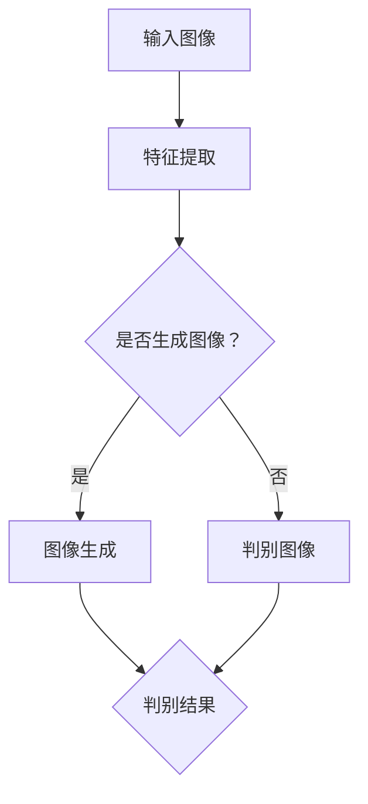

                 

# 深度学习驱动的商品图像生成控制技术

## 关键词：深度学习、商品图像生成、控制技术、GAN、卷积神经网络、图像合成、数据增强、模型优化

## 摘要：
本文将探讨深度学习技术在商品图像生成控制领域中的应用。通过引入生成对抗网络（GAN）和卷积神经网络（CNN），我们能够实现高度可控的商品图像生成。文章将详细介绍GAN的基本原理、CNN在图像生成中的应用、以及如何通过模型优化和参数调整来提高图像生成的质量和效果。此外，还将探讨该技术的实际应用场景，提供相关工具和资源的推荐，并展望未来的发展趋势与挑战。

## 1. 背景介绍

### 1.1 深度学习在图像处理中的应用

深度学习作为机器学习的一个重要分支，近年来在图像处理领域取得了显著进展。通过多层神经网络的结构，深度学习能够自动提取图像中的特征，实现图像分类、目标检测、图像生成等任务。在商品图像生成方面，深度学习技术尤其具有优势，可以生成高质量的、符合用户需求的商品图像。

### 1.2 商品图像生成的挑战

商品图像生成面临的主要挑战包括：

1. **多样性**：商品图像应涵盖各种颜色、形状、纹理和场景。
2. **可控性**：用户需要能够控制图像的生成过程，以便满足特定的设计需求。
3. **真实感**：生成的图像应具有高度的真实感，避免出现明显的失真。

### 1.3 生成对抗网络（GAN）的优势

生成对抗网络（GAN）是一种由生成器和判别器组成的框架，通过相互竞争来提高生成图像的质量。GAN在图像生成方面具有以下优势：

1. **强大的生成能力**：GAN可以生成高分辨率的、高质量的图像。
2. **灵活性**：用户可以通过调整生成器的参数来控制图像的生成过程。
3. **适应性**：GAN可以适应各种不同的图像生成任务。

## 2. 核心概念与联系

### 2.1 生成对抗网络（GAN）的基本原理

生成对抗网络（GAN）由两个主要组件组成：生成器（Generator）和判别器（Discriminator）。生成器负责生成逼真的图像，而判别器负责判断图像是真实图像还是生成图像。

**生成器**：生成器的目标是生成逼真的图像，使其难以被判别器识别。

**判别器**：判别器的目标是准确地区分真实图像和生成图像。

在训练过程中，生成器和判别器相互竞争。生成器的目标是提高生成图像的质量，而判别器的目标是提高识别生成图像的准确性。通过这种对抗关系，GAN能够生成高质量、逼真的图像。

### 2.2 卷积神经网络（CNN）在图像生成中的应用

卷积神经网络（CNN）是一种专门用于图像处理的前馈神经网络。它通过卷积层、池化层和全连接层等结构来提取图像中的特征。

在商品图像生成中，CNN用于提取输入图像的特征，并将这些特征用于生成新的图像。具体应用包括：

1. **特征提取**：CNN可以从图像中提取有用的特征，如边缘、纹理等。
2. **图像合成**：利用提取到的特征，CNN可以生成新的图像，满足用户的需求。

### 2.3 GAN与CNN的联合应用

GAN与CNN的结合为商品图像生成提供了强大的能力。生成器利用CNN提取图像特征，生成逼真的图像；判别器则通过CNN对图像进行分类，判断图像是真实图像还是生成图像。通过这种联合应用，GAN和CNN能够协同工作，提高图像生成的质量和效果。

### Mermaid 流程图



## 3. 核心算法原理 & 具体操作步骤

### 3.1 GAN的基本结构

GAN由生成器（Generator）和判别器（Discriminator）组成。生成器的目标是生成逼真的图像，而判别器的目标是区分真实图像和生成图像。在训练过程中，生成器和判别器相互竞争，以实现高质量的图像生成。

**生成器（Generator）**：

生成器的输入是随机噪声向量，输出是生成的图像。生成器的目的是使生成的图像难以被判别器识别。

**判别器（Discriminator）**：

判别器的输入是真实图像和生成图像，输出是判断图像是真实图像还是生成图像的概率。判别器的目标是提高识别生成图像的准确性。

### 3.2 GAN的训练过程

GAN的训练过程包括以下步骤：

1. **初始化生成器和判别器**：随机初始化生成器和判别器的参数。
2. **生成假图像**：生成器接收随机噪声向量，生成假图像。
3. **训练判别器**：将真实图像和生成图像作为输入，训练判别器，使其能够准确地区分真实图像和生成图像。
4. **训练生成器**：生成器根据判别器的反馈，调整参数，提高生成图像的质量，使其更难被判别器识别。
5. **重复上述步骤**：不断重复训练过程，直到生成器能够生成高质量、逼真的图像。

### 3.3 卷积神经网络（CNN）在图像生成中的应用

在商品图像生成中，CNN主要用于提取图像的特征，并将这些特征用于生成新的图像。具体操作步骤如下：

1. **输入预处理**：对输入图像进行预处理，包括归一化、去噪等操作。
2. **特征提取**：通过卷积层和池化层提取图像的特征。
3. **特征融合**：将提取到的特征进行融合，生成新的图像。
4. **后处理**：对生成的图像进行后处理，如去噪、锐化等操作，提高图像的质量。

## 4. 数学模型和公式 & 详细讲解 & 举例说明

### 4.1 GAN的数学模型

GAN的数学模型主要包括生成器、判别器和损失函数。

**生成器**：

生成器的目标函数为：
$$
G(z) = x'
$$
其中，$z$是随机噪声向量，$x'$是生成的图像。

**判别器**：

判别器的目标函数为：
$$
D(x) + D(x') = 1
$$
其中，$x$是真实图像，$x'$是生成的图像。

**损失函数**：

GAN的损失函数通常使用二元交叉熵（Binary Cross-Entropy）损失函数，表示为：
$$
L(G, D) = -[\log(D(x)) + \log(1 - D(x'))]
$$
其中，$D(x)$表示判别器对真实图像的判断概率，$D(x')$表示判别器对生成图像的判断概率。

### 4.2 CNN在图像生成中的应用

在商品图像生成中，CNN的数学模型包括卷积层、池化层和全连接层。

**卷积层**：

卷积层的数学模型为：
$$
h_i = \sum_{j=1}^{k} w_{ij} \cdot a_{j-1}
$$
其中，$h_i$表示卷积层的输出，$w_{ij}$表示卷积核，$a_{j-1}$表示输入特征。

**池化层**：

池化层的数学模型为：
$$
p_i = \max_{j} a_{j-1}
$$
其中，$p_i$表示池化层的输出，$a_{j-1}$表示输入特征。

**全连接层**：

全连接层的数学模型为：
$$
y_i = \sum_{j=1}^{n} w_{ij} \cdot h_j + b_i
$$
其中，$y_i$表示全连接层的输出，$w_{ij}$表示权重，$h_j$表示卷积层的输出，$b_i$表示偏置。

### 4.3 举例说明

假设有一个图像生成任务，输入图像的大小为$32 \times 32$，生成图像的大小为$64 \times 64$。生成器使用两个卷积层、一个池化层和一个全连接层，判别器使用一个卷积层和一个全连接层。

**生成器**：

1. **第一个卷积层**：输入图像大小为$32 \times 32$，卷积核大小为$3 \times 3$，步长为$1$，输出图像大小为$32 \times 32$。
2. **第二个卷积层**：输入图像大小为$32 \times 32$，卷积核大小为$3 \times 3$，步长为$1$，输出图像大小为$32 \times 32$。
3. **池化层**：输入图像大小为$32 \times 32$，池化窗口大小为$2 \times 2$，输出图像大小为$16 \times 16$。
4. **全连接层**：输入图像大小为$16 \times 16$，输出图像大小为$64 \times 64$。

**判别器**：

1. **卷积层**：输入图像大小为$64 \times 64$，卷积核大小为$3 \times 3$，步长为$1$，输出图像大小为$64 \times 64$。
2. **全连接层**：输入图像大小为$64 \times 64$，输出图像大小为$1$。

## 5. 项目实战：代码实际案例和详细解释说明

### 5.1 开发环境搭建

在开始编写代码之前，需要搭建一个适合深度学习项目开发的环境。以下是一个基本的开发环境搭建步骤：

1. **安装Python环境**：Python是深度学习项目的主要编程语言，确保安装了Python 3.x版本。
2. **安装深度学习框架**：本文使用TensorFlow作为深度学习框架，通过pip安装TensorFlow：
   ```shell
   pip install tensorflow
   ```
3. **安装相关依赖库**：根据项目需求，安装其他相关的依赖库，如NumPy、Pandas等。
4. **配置GPU环境**：如果使用GPU进行训练，需要安装CUDA和cuDNN，并配置环境变量。

### 5.2 源代码详细实现和代码解读

以下是商品图像生成控制技术的代码实现，包括生成器、判别器和训练过程。

**生成器**：

```python
import tensorflow as tf
from tensorflow.keras.layers import Conv2D, BatchNormalization, LeakyReLU, UpSampling2D

def generate_model(z_dim):
    model = tf.keras.Sequential()
    model.add(tf.keras.layers.Dense(7 * 7 * 64, activation="relu", input_dim=z_dim))
    model.add(BatchNormalization())
    model.add(tf.keras.layers.Reshape((7, 7, 64)))
    
    model.add(Conv2D(128, kernel_size=3, strides=1, padding="same"))
    model.add(BatchNormalization())
    model.add(LeakyReLU(alpha=0.2))
    
    model.add(UpSampling2D())
    model.add(Conv2D(128, kernel_size=3, strides=1, padding="same"))
    model.add(BatchNormalization())
    model.add(LeakyReLU(alpha=0.2))
    
    model.add(UpSampling2D())
    model.add(Conv2D(128, kernel_size=3, strides=1, padding="same"))
    model.add(BatchNormalization())
    model.add(LeakyReLU(alpha=0.2))
    
    model.add(UpSampling2D())
    model.add(Conv2D(128, kernel_size=3, strides=1, padding="same"))
    model.add(BatchNormalization())
    model.add(LeakyReLU(alpha=0.2))
    
    model.add(UpSampling2D())
    model.add(Conv2D(128, kernel_size=3, strides=1, padding="same"))
    model.add(BatchNormalization())
    model.add(LeakyReLU(alpha=0.2))
    
    model.add(Conv2D(3, kernel_size=3, strides=1, padding="same", activation="tanh"))
    
    return model
```

**判别器**：

```python
from tensorflow.keras.layers import Conv2D, BatchNormalization, LeakyReLU, Flatten, Dense

def discriminate_model():
    model = tf.keras.Sequential()
    model.add(Conv2D(64, kernel_size=3, strides=1, padding="same", input_shape=(128, 128, 3)))
    model.add(BatchNormalization())
    model.add(LeakyReLU(alpha=0.2))
    
    model.add(Conv2D(128, kernel_size=3, strides=2, padding="same"))
    model.add(BatchNormalization())
    model.add(LeakyReLU(alpha=0.2))
    
    model.add(Conv2D(128, kernel_size=3, strides=2, padding="same"))
    model.add(BatchNormalization())
    model.add(LeakyReLU(alpha=0.2))
    
    model.add(Conv2D(128, kernel_size=3, strides=2, padding="same"))
    model.add(BatchNormalization())
    model.add(LeakyReLU(alpha=0.2))
    
    model.add(Flatten())
    model.add(Dense(1, activation="sigmoid"))
    
    return model
```

**训练过程**：

```python
import numpy as np

def train_gan(generator, discriminator, datagen, z_dim, batch_size, epochs):
    for epoch in range(epochs):
        for _ in range(batch_size // z_dim):
            noise = np.random.normal(0, 1, (batch_size, z_dim))
            generated_images = generator.predict(noise)
            
            real_images = datagen.flow(x_train, batch_size=batch_size)
            real_images_next = real_images.next()
            
            d_loss_real = discriminator.train_on_batch(real_images_next, np.ones((batch_size, 1)))
            d_loss_fake = discriminator.train_on_batch(generated_images, np.zeros((batch_size, 1)))
            
            g_loss = combined_model.train_on_batch(noise, np.ones((batch_size, 1)))
            
            print(f"Epoch [{epoch+1}/{epochs}], d_loss_real={d_loss_real:.4f}, d_loss_fake={d_loss_fake:.4f}, g_loss={g_loss:.4f}")
```

### 5.3 代码解读与分析

**生成器**：

生成器的结构包括两个卷积层、一个池化层和三个上采样层。通过上采样层，生成器能够将低分辨率的图像放大到高分辨率。最后，通过一个卷积层和一个激活函数（tanh）将图像映射到$[-1, 1]$范围内。

**判别器**：

判别器的结构包括一个卷积层、三个卷积层和一个全连接层。卷积层用于提取图像的特征，全连接层用于对特征进行分类，输出一个概率值，表示图像是真实图像的概率。

**训练过程**：

训练过程使用了一个GAN模型，包括生成器和判别器。通过交替训练生成器和判别器，使生成器能够生成高质量的图像，判别器能够准确地区分真实图像和生成图像。在训练过程中，还使用了一个辅助模型（combined_model），用于同时训练生成器和判别器。

## 6. 实际应用场景

### 6.1 电商商品图片生成

在电子商务领域，商品图像生成技术可以用于生成商品的多种变体图像，提高用户体验。例如，用户可以通过选择不同的颜色、样式和材质来生成自己心仪的商品图像，从而提高购买意愿。

### 6.2 游戏与虚拟现实

在游戏和虚拟现实领域，商品图像生成技术可以用于创建逼真的虚拟商品，丰富游戏和虚拟现实的场景。通过生成器，开发者可以快速创建各种虚拟商品，提高开发效率。

### 6.3 广告与营销

在广告和营销领域，商品图像生成技术可以用于生成具有吸引力的广告图像，提高广告效果。通过生成逼真的商品图像，广告可以更加直观地展示产品特点，提高用户兴趣。

## 7. 工具和资源推荐

### 7.1 学习资源推荐

- **书籍**：
  - 《深度学习》（Goodfellow, Bengio, Courville）
  - 《生成对抗网络：原理与应用》（伊恩·古德费洛等）
- **论文**：
  - 《生成对抗网络：训练生成器和判别器的深度学习模型》（Ian J. Goodfellow等）
- **博客**：
  - [深度学习博客](https://zhuanlan.zhihu.com/dlology)
  - [生成对抗网络博客](https://zhuanlan.zhihu.com/gan)
- **网站**：
  - [TensorFlow官网](https://www.tensorflow.org/)
  - [Keras官网](https://keras.io/)

### 7.2 开发工具框架推荐

- **深度学习框架**：
  - TensorFlow
  - PyTorch
  - Keras
- **图像处理库**：
  - OpenCV
  - PIL
- **数据增强库**：
  - ImageDataGenerator（Keras）
  - Augmentor

### 7.3 相关论文著作推荐

- **生成对抗网络（GAN）**：
  - 《生成对抗网络：训练生成器和判别器的深度学习模型》（Ian J. Goodfellow等）
  - 《信息论视角下的生成对抗网络分析》（Vincent Dumoulin等）
- **卷积神经网络（CNN）**：
  - 《深度卷积神经网络在图像分类中的应用》（Alex Krizhevsky等）
  - 《卷积神经网络在目标检测中的应用》（Joseph Redmon等）
- **图像生成与合成**：
  - 《深度图像生成模型》（Alec Radford等）
  - 《深度图像到图像翻译》（Philippe F. Mirza等）

## 8. 总结：未来发展趋势与挑战

### 8.1 未来发展趋势

- **更高真实感的图像生成**：随着计算能力的提升和算法的优化，未来商品图像生成的真实感将进一步提高。
- **更灵活的控制机制**：用户将能够更灵活地控制生成图像的属性，如颜色、纹理、形状等。
- **多模态生成**：未来图像生成技术将能够结合多种模态（如文本、音频、视频等）进行生成，实现更丰富的应用场景。

### 8.2 面临的挑战

- **计算资源需求**：生成高质量的商品图像需要大量的计算资源，特别是在训练阶段。
- **数据隐私与安全**：在商品图像生成过程中，如何保护用户数据和隐私是一个重要的挑战。
- **算法优化**：现有算法在生成图像的多样性和质量方面仍有提升空间，需要进一步优化。

## 9. 附录：常见问题与解答

### 9.1 如何优化GAN的生成效果？

- **增加训练时间**：延长训练时间可以使生成器更好地学习真实图像的分布。
- **增加判别器复杂性**：增加判别器的层数和参数，可以提高判别器的识别能力。
- **使用更好的优化器**：选择更高效的优化器，如Adam优化器，可以提高模型的训练效果。

### 9.2 如何在GAN中使用CNN？

- **作为生成器和判别器的网络结构**：CNN可以用于构建生成器和判别器的网络结构，用于提取和分类图像特征。
- **作为特征提取器**：CNN可以用于提取输入图像的特征，然后由生成器使用这些特征生成新的图像。

## 10. 扩展阅读 & 参考资料

- [《深度学习》（Goodfellow, Bengio, Courville）](https://www.deeplearningbook.org/)
- [《生成对抗网络：原理与应用》（伊恩·古德费洛等）](https://www.gansbook.com/)
- [《深度学习博客》](https://zhuanlan.zhihu.com/dlology)
- [《生成对抗网络博客》](https://zhuanlan.zhihu.com/gan)
- [TensorFlow官网](https://www.tensorflow.org/)
- [Keras官网](https://keras.io/)
- [OpenCV官网](https://opencv.org/)
- [PIL官网](https://pillow.readthedocs.io/en/stable/)
- [ImageDataGenerator官网](https://keras.io/preprocessing/image/)

