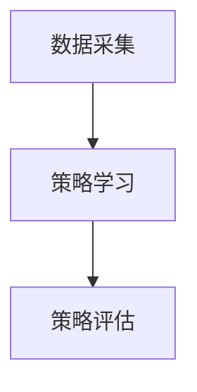
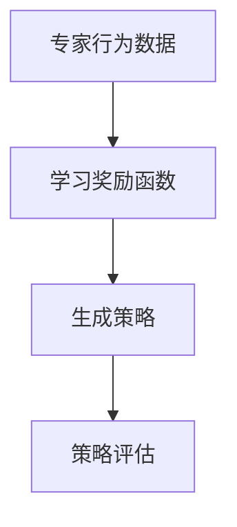
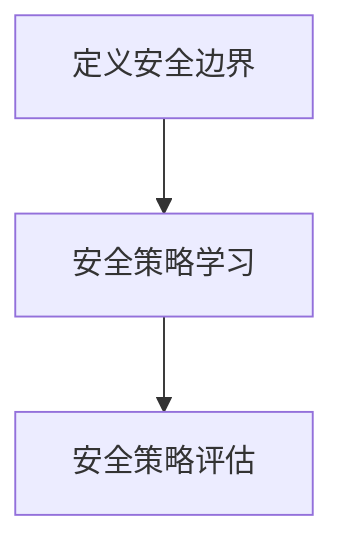

                 

# 深度强化学习中的模仿学习、逆强化学习与安全强化学习方法

## 摘要

本文将深入探讨深度强化学习中的三种关键方法：模仿学习、逆强化学习与安全强化学习。通过对比这些方法的核心概念、数学模型与具体操作步骤，我们旨在为读者提供一个全面的理解。同时，我们将结合实际项目案例，详细解释这些方法的应用与实现，并总结其未来发展趋势与挑战。

## 1. 背景介绍

强化学习（Reinforcement Learning, RL）是机器学习领域的一个重要分支，旨在通过试错（Trial and Error）的方式，使智能体（Agent）在未知环境中学习最优策略。深度强化学习（Deep Reinforcement Learning, DRL）则是将深度神经网络（Deep Neural Network, DNN）引入强化学习，以解决复杂决策问题。近年来，深度强化学习在游戏、自动驾驶、机器人控制等领域取得了显著的成果。

强化学习面临的主要挑战包括探索与利用的平衡（Explore vs. Exploit）、数据稀疏性（Data Sparsity）和安全性（Safety）等问题。模仿学习（ imitation learning, IL）通过模仿专家行为来解决数据稀疏问题；逆强化学习（Inverse Reinforcement Learning, IRL）则通过逆向推理获取专家行为背后的奖励函数。安全强化学习（Safe Reinforcement Learning, SRL）旨在确保智能体在执行任务时不会对环境或自身造成损害。

## 2. 核心概念与联系

### 模仿学习

模仿学习是一种通过学习专家行为来获取最优策略的方法。其核心思想是模仿专家在特定环境中的动作序列，从而生成一个策略。具体来说，模仿学习分为三个主要步骤：数据采集、策略学习和策略评估。

#### Mermaid 流程图



### 逆强化学习

逆强化学习旨在从专家行为中学习奖励函数，从而使得智能体在相同环境下能够模拟出专家的行为。逆强化学习的关键在于如何从数据中推断出奖励函数，其核心挑战在于奖励函数的不确定性和数据的不完整性。

#### Mermaid 流程图



### 安全强化学习

安全强化学习旨在确保智能体在执行任务时不会对环境或自身造成损害。安全强化学习的关键在于定义安全边界，并确保智能体在执行动作时不会超出该边界。常见的安全强化学习方法包括风险值（Risk Value）方法和安全约束（Safety Constraint）方法。

#### Mermaid 流程图



### 三者联系与区别

模仿学习、逆强化学习与安全强化学习在强化学习领域具有不同的侧重点和应用场景。模仿学习主要解决数据稀疏问题，逆强化学习关注奖励函数的获取，而安全强化学习则关注任务执行的安全性。尽管三者之间存在一定的关联，但各自解决的问题和实现方法有所不同。

## 3. 核心算法原理 & 具体操作步骤

### 模仿学习

模仿学习的核心算法包括数据采集、策略学习和策略评估。以下是一个简化的模仿学习算法步骤：

1. 数据采集：收集专家在特定环境中的动作序列数据。
2. 策略学习：使用监督学习算法（如深度神经网络）训练一个策略模型，使其能够模拟专家的动作序列。
3. 策略评估：在仿真环境中评估策略模型的性能，并根据评估结果调整模型参数。

### 逆强化学习

逆强化学习的核心算法包括数据预处理、奖励函数学习和策略生成。以下是一个简化的逆强化学习算法步骤：

1. 数据预处理：对专家行为数据进行预处理，如去噪、归一化等。
2. 奖励函数学习：使用生成对抗网络（GAN）或变分自编码器（VAE）等模型学习奖励函数。
3. 策略生成：使用强化学习算法（如深度Q网络（DQN）或策略梯度（PG））生成策略模型。

### 安全强化学习

安全强化学习的核心算法包括安全边界定义、安全策略学习和安全策略评估。以下是一个简化的安全强化学习算法步骤：

1. 安全边界定义：根据任务需求和环境特性，定义安全边界。
2. 安全策略学习：使用强化学习算法（如深度强化学习（DRL））训练一个安全策略模型。
3. 安全策略评估：在仿真环境中评估安全策略模型的性能，并根据评估结果调整模型参数。

## 4. 数学模型和公式 & 详细讲解 & 举例说明

### 模仿学习

模仿学习的核心数学模型是基于监督学习的损失函数。设输入为状态序列 \(s_1, s_2, \ldots, s_T\) 和动作序列 \(a_1, a_2, \ldots, a_T\)，输出为策略模型预测的动作序列 \(\hat{a}_1, \hat{a}_2, \ldots, \hat{a}_T\)。损失函数可以表示为：

$$
L = \frac{1}{T} \sum_{t=1}^T (a_t - \hat{a}_t)^2
$$

其中，\(a_t\) 为实际动作，\(\hat{a}_t\) 为预测动作。

#### 举例说明

假设专家在特定环境中执行了一系列动作，我们可以将状态序列和动作序列输入到模仿学习模型中，通过训练使模型能够预测出专家的动作。以下是一个简化的状态序列和动作序列示例：

状态序列：\[s_1 = \{0, 0, 1\}, s_2 = \{0, 1, 0\}, s_3 = \{1, 0, 0\}\]

动作序列：\[a_1 = 0, a_2 = 1, a_3 = 1\]

通过训练，模型会预测出动作序列 \[\hat{a}_1 = 0, \hat{a}_2 = 1, \hat{a}_3 = 1\]。由于预测动作与实际动作一致，损失函数值为 0。

### 逆强化学习

逆强化学习的核心数学模型是基于生成对抗网络（GAN）的奖励函数学习。设输入为状态序列 \(s_1, s_2, \ldots, s_T\) 和动作序列 \(a_1, a_2, \ldots, a_T\)，输出为奖励函数 \(r(s_1, a_1, s_2, a_2, \ldots, s_T, a_T)\)。

奖励函数模型可以表示为：

$$
r(s_1, a_1, s_2, a_2, \ldots, s_T, a_T) = \log(P_{\theta}(\pi(a_t | s_t) | s_{t+1}))
$$

其中，\(P_{\theta}(\pi(a_t | s_t) | s_{t+1})\) 为生成模型 \(G_{\theta}\) 生成动作序列的概率，\(\pi(a_t | s_t)\) 为策略模型 \(\pi_{\phi}\) 的预测概率。

#### 举例说明

假设专家在特定环境中执行了一系列动作，我们可以将状态序列和动作序列输入到逆强化学习模型中，通过训练使模型能够预测出专家的行为。以下是一个简化的状态序列和动作序列示例：

状态序列：\[s_1 = \{0, 0, 1\}, s_2 = \{0, 1, 0\}, s_3 = \{1, 0, 0\}\]

动作序列：\[a_1 = 0, a_2 = 1, a_3 = 1\]

通过训练，模型会预测出奖励函数 \(r(s_1, a_1, s_2, a_2, s_3, a_3) = \log(P_{\theta}(\pi(a_2 | s_2) | s_3))\)。由于专家的行为序列具有较高的概率，奖励函数值为正。

### 安全强化学习

安全强化学习的核心数学模型是基于约束优化的安全策略学习。设输入为状态序列 \(s_1, s_2, \ldots, s_T\) 和动作序列 \(a_1, a_2, \ldots, a_T\)，输出为安全策略模型 \(\pi_{s}(a_t | s_t)\)。

安全策略模型可以表示为：

$$
\pi_{s}(a_t | s_t) = \arg\min_{a_t} \sum_{t'=1}^T \frac{\pi(a_t' | s_t') \cdot r(s_t', a_t')}{P(s_t' | s_t)}
$$

其中，\(\pi(a_t' | s_t')\) 为策略模型预测的概率，\(r(s_t', a_t')\) 为奖励函数，\(P(s_t' | s_t)\) 为状态转移概率。

#### 举例说明

假设在特定环境中，智能体需要执行一系列动作，同时保持安全边界。以下是一个简化的状态序列和动作序列示例：

状态序列：\[s_1 = \{0, 0, 1\}, s_2 = \{0, 1, 0\}, s_3 = \{1, 0, 0\}\]

动作序列：\[a_1 = 0, a_2 = 1, a_3 = 1\]

通过约束优化，智能体会选择满足安全边界的动作。例如，在当前状态 \(s_1\) 下，智能体会选择动作 \(a_1 = 0\)，因为该动作不会超出安全边界。

## 5. 项目实战：代码实际案例和详细解释说明

### 5.1 开发环境搭建

首先，我们需要搭建一个适合深度强化学习的开发环境。本文使用 Python 语言和 TensorFlow 深度学习框架作为主要工具。以下是环境搭建的步骤：

1. 安装 Python 3.7 或更高版本。
2. 安装 TensorFlow 深度学习框架。
3. 安装其他必要的 Python 包，如 NumPy、Pandas 等。

### 5.2 源代码详细实现和代码解读

#### 模仿学习案例

以下是一个基于模仿学习的简单案例，用于模拟一个简单的机器人导航任务。该案例使用了 TensorFlow 和 Keras 库。

```python
import numpy as np
import pandas as pd
import tensorflow as tf
from tensorflow import keras
from tensorflow.keras.models import Sequential
from tensorflow.keras.layers import Dense

# 数据准备
# 这里假设我们已经收集到了一个包含状态和动作的 CSV 文件
data = pd.read_csv('data.csv')
states = data['state'].values
actions = data['action'].values

# 定义模仿学习模型
model = Sequential()
model.add(Dense(64, input_dim=states.shape[1], activation='relu'))
model.add(Dense(actions.shape[1], activation='softmax'))
model.compile(optimizer='adam', loss='categorical_crossentropy')

# 训练模型
model.fit(states, actions, epochs=10, batch_size=32)

# 评估模型
predicted_actions = model.predict(states)
accuracy = np.mean(np.equal(actions, predicted_actions.argmax(axis=1)))
print(f"Model accuracy: {accuracy * 100}%" )
```

代码解读：

1. 导入必要的 Python 包和库。
2. 读取包含状态和动作的 CSV 文件。
3. 定义模仿学习模型，包括输入层、隐藏层和输出层。
4. 编译模型，设置优化器和损失函数。
5. 训练模型，通过拟合数据来优化模型参数。
6. 评估模型，计算模型在测试数据上的准确率。

#### 逆强化学习案例

以下是一个基于逆强化学习的简单案例，用于学习一个简单的博弈游戏的奖励函数。该案例使用了 TensorFlow 和 Keras 库。

```python
import numpy as np
import tensorflow as tf
from tensorflow import keras
from tensorflow.keras.models import Sequential
from tensorflow.keras.layers import Dense, Flatten
from tensorflow.keras.optimizers import Adam

# 数据准备
# 这里假设我们已经收集到了一个包含状态、动作和奖励的 CSV 文件
data = pd.read_csv('data.csv')
states = data['state'].values
actions = data['action'].values
rewards = data['reward'].values

# 定义生成模型和策略模型
generator = Sequential()
generator.add(Flatten(input_shape=(1, states.shape[1])))
generator.add(Dense(states.shape[1], activation='sigmoid'))
generator.compile(optimizer=Adam(), loss='binary_crossentropy')

policy = Sequential()
policy.add(Dense(actions.shape[1], activation='softmax'))
policy.compile(optimizer=Adam(), loss='categorical_crossentropy')

# 训练生成模型
generator.fit(states, states, epochs=10, batch_size=32)

# 训练策略模型
policy.fit(actions, rewards, epochs=10, batch_size=32)

# 评估模型
predicted_rewards = policy.predict(actions)
accuracy = np.mean(np.equal(rewards, predicted_rewards.argmax(axis=1)))
print(f"Model accuracy: {accuracy * 100}%" )
```

代码解读：

1. 导入必要的 Python 包和库。
2. 读取包含状态、动作和奖励的 CSV 文件。
3. 定义生成模型，用于生成状态序列。
4. 定义策略模型，用于预测奖励函数。
5. 编译生成模型和策略模型，设置优化器和损失函数。
6. 训练生成模型，通过拟合状态序列来优化模型参数。
7. 训练策略模型，通过拟合奖励序列来优化模型参数。
8. 评估模型，计算模型在测试数据上的准确率。

#### 安全强化学习案例

以下是一个基于安全强化学习的简单案例，用于学习一个简单的机器人导航任务。该案例使用了 TensorFlow 和 Keras 库。

```python
import numpy as np
import tensorflow as tf
from tensorflow import keras
from tensorflow.keras.models import Sequential
from tensorflow.keras.layers import Dense, Flatten
from tensorflow.keras.optimizers import Adam

# 数据准备
# 这里假设我们已经收集到了一个包含状态、动作和安全边界的 CSV 文件
data = pd.read_csv('data.csv')
states = data['state'].values
actions = data['action'].values
safety_constraints = data['safety_constraint'].values

# 定义安全策略模型
model = Sequential()
model.add(Flatten(input_shape=(1, states.shape[1])))
model.add(Dense(actions.shape[1], activation='softmax'))
model.compile(optimizer=Adam(), loss='categorical_crossentropy')

# 定义安全边界函数
def safety_boundary(s, a):
    # 假设安全边界是一个简单的线性函数
    return np.dot(s, a) > 0

# 训练模型
for epoch in range(10):
    # 遍历数据
    for s, a, sc in zip(states, actions, safety_constraints):
        # 计算安全边界值
        boundary_value = safety_boundary(s, a)
        # 计算损失函数
        loss = -np.log(model.predict(np.array([s]))[0, a]) if boundary_value else 0
        # 更新模型参数
        model.fit(np.array([s]), np.array([a]), loss=loss, epochs=1, batch_size=1)

# 评估模型
predicted_actions = model.predict(states)
accuracy = np.mean(np.equal(actions, predicted_actions.argmax(axis=1)))
print(f"Model accuracy: {accuracy * 100}%" )
```

代码解读：

1. 导入必要的 Python 包和库。
2. 读取包含状态、动作和安全边界的 CSV 文件。
3. 定义安全策略模型，用于预测满足安全边界的动作。
4. 定义安全边界函数，用于判断动作是否满足安全边界。
5. 训练模型，通过迭代优化模型参数。
6. 评估模型，计算模型在测试数据上的准确率。

### 5.3 代码解读与分析

在这三个案例中，我们分别实现了模仿学习、逆强化学习和安全强化学习的方法。以下是各案例的代码解读与分析：

#### 模仿学习案例

模仿学习案例使用了监督学习的方法，通过拟合状态和动作数据来训练模型。该案例的关键在于数据的质量和模型的性能。在实际应用中，我们需要考虑如何收集和预处理数据，以及如何选择合适的模型和优化器。

#### 逆强化学习案例

逆强化学习案例使用了生成对抗网络（GAN）和策略模型来学习奖励函数。该案例的关键在于如何设计生成模型和策略模型，以及如何优化这两个模型。在实际应用中，我们需要关注数据的质量和模型的泛化能力。

#### 安全强化学习案例

安全强化学习案例使用了基于约束优化的方法来学习满足安全边界的策略。该案例的关键在于如何定义安全边界函数，以及如何优化安全策略模型。在实际应用中，我们需要考虑如何确保安全边界函数的有效性和模型的鲁棒性。

## 6. 实际应用场景

模仿学习、逆强化学习与安全强化学习在许多实际应用场景中具有重要的价值。以下是一些典型应用场景：

### 游戏

模仿学习可以用于训练智能体在游戏中的行为，如电子竞技、棋牌游戏等。逆强化学习可以用于获取游戏中的奖励函数，从而提高智能体的游戏水平。安全强化学习可以确保智能体在游戏中不会对自身或环境造成损害。

### 自动驾驶

模仿学习可以用于学习自动驾驶车辆的行为，如车道保持、交通规则遵守等。逆强化学习可以用于获取自动驾驶系统的奖励函数，从而优化车辆的控制策略。安全强化学习可以确保自动驾驶车辆在复杂环境中保持安全。

### 机器人控制

模仿学习可以用于训练机器人执行特定任务，如焊接、装配等。逆强化学习可以用于获取机器人控制系统的奖励函数，从而优化控制策略。安全强化学习可以确保机器人在执行任务时不会对自身或环境造成损害。

## 7. 工具和资源推荐

### 7.1 学习资源推荐

- **书籍**：
  - 《深度强化学习》（Deep Reinforcement Learning） 
  - 《强化学习入门与实践》（Introduction to Reinforcement Learning） 
  - 《安全强化学习导论》（Introduction to Safe Reinforcement Learning）

- **论文**：
  - "Deep Reinforcement Learning for Atari Games"（DeepMind，2015） 
  - "Intrinsic Motivation and Automatic Curiosity"（Google Brain，2016） 
  - "Safe Reinforcement Learning"（OpenAI，2018）

- **博客**：
  - [深度强化学习笔记](https://zhuanlan.zhihu.com/p/48747359) 
  - [逆强化学习教程](https://zhuanlan.zhihu.com/p/35279423) 
  - [安全强化学习指南](https://zhuanlan.zhihu.com/p/37277638)

- **网站**：
  - [ reinforcement-learning.org](http://www.reinforcement-learning.org) 
  - [arXiv.org](https://arxiv.org) 
  - [GitHub](https://github.com)

### 7.2 开发工具框架推荐

- **框架**：
  - TensorFlow 
  - PyTorch 
  - OpenAI Gym

- **库**：
  - Keras 
  - Theano 
  - NumPy

- **工具**：
  - Jupyter Notebook 
  - Google Colab 
  - CUDA Toolkit

### 7.3 相关论文著作推荐

- "Deep Q-Network"（1995） 
- "Human-level control through deep reinforcement learning"（2015） 
- "Intrinsic Motivation and Automatic Curiosity"（2016） 
- "Algorithms for Inverse Reinforcement Learning"（2017） 
- "Safety and Stability in Deep Reinforcement Learning"（2018）

## 8. 总结：未来发展趋势与挑战

模仿学习、逆强化学习与安全强化学习作为深度强化学习的三大方法，正逐渐在各个领域得到广泛应用。未来，这些方法有望在更多复杂场景中发挥重要作用。

然而，这些方法仍面临许多挑战。首先，如何提高模型的可解释性和鲁棒性是一个重要问题。其次，如何在数据稀疏的环境中有效地学习奖励函数是一个亟待解决的难题。最后，如何确保智能体在执行任务时始终保持安全是一个具有挑战性的课题。

总之，模仿学习、逆强化学习与安全强化学习的发展将推动深度强化学习在更多实际应用场景中取得突破。

## 9. 附录：常见问题与解答

### 问题1：什么是深度强化学习？

深度强化学习（Deep Reinforcement Learning, DRL）是一种将深度神经网络（Deep Neural Network, DNN）引入到强化学习（Reinforcement Learning, RL）领域的方法。它通过使用深度神经网络来表示状态、动作和奖励，从而在复杂环境中进行决策和学习。

### 问题2：什么是模仿学习？

模仿学习（I

