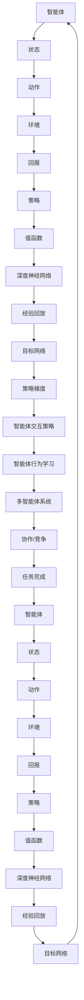

                 

# 深度强化学习在多智能体系统中的应用

## 关键词
- 深度强化学习
- 多智能体系统
- 人工智能
- 强化学习
- 多智能体交互
- 多智能体合作与竞争

## 摘要

本文将深入探讨深度强化学习在多智能体系统中的应用。首先，我们将介绍深度强化学习和多智能体系统的基本概念，并解释它们之间的联系。接着，我们将详细讨论深度强化学习的核心算法原理，以及如何应用于多智能体系统中的具体操作步骤。随后，我们将使用数学模型和公式来详细讲解算法，并通过实际案例进行举例说明。文章还将探讨深度强化学习在多智能体系统中的实际应用场景，并提供相关工具和资源的推荐。最后，我们将总结未来发展趋势与挑战，并给出常见问题的解答。

## 1. 背景介绍

### 1.1 深度强化学习

深度强化学习（Deep Reinforcement Learning，简称DRL）是结合了深度学习和强化学习（Reinforcement Learning，简称RL）的一种学习方法。深度学习部分负责处理复杂的输入数据，如图像、音频和文本，而强化学习部分则负责通过试错和反馈来训练模型。

强化学习的基本思想是，智能体（Agent）通过与环境（Environment）的交互，学习一种策略（Policy），使得智能体能够根据当前状态（State）选择最优动作（Action），从而获得最大的回报（Reward）。深度强化学习通过引入深度神经网络（Deep Neural Network，简称DNN），使得智能体能够处理高维度的输入数据，如图像。

### 1.2 多智能体系统

多智能体系统（Multi-Agent Systems，简称MAS）是指由多个智能体组成的系统，这些智能体可以通过协作或竞争来完成任务。多智能体系统在许多领域都有广泛的应用，如智能交通、机器人编队、协同控制等。

多智能体系统中的智能体可以是真实的物理实体，如机器人、无人机，也可以是虚拟的代理，如软件代理、Web服务。智能体之间的交互可以是直接通信，也可以是通过环境进行间接交互。

### 1.3 联系

深度强化学习在多智能体系统中的应用主要是通过以下两个方面实现的：

1. **智能体之间的交互策略学习**：深度强化学习可以用于训练智能体之间的交互策略，使得智能体能够根据当前的状态选择最优的协作或竞争策略，从而实现协同工作。

2. **智能体在多智能体环境中的行为学习**：深度强化学习可以用于训练智能体在多智能体环境中的行为，使得智能体能够通过试错和反馈来学习最优的行为策略，从而实现自主决策。

接下来，我们将详细讨论深度强化学习的核心算法原理，以及如何应用于多智能体系统中的具体操作步骤。

## 2. 核心概念与联系

### 2.1 深度强化学习核心概念

#### 2.1.1 强化学习基本概念

- **状态（State）**：描述智能体当前所处的环境状态。
- **动作（Action）**：智能体可以执行的动作。
- **策略（Policy）**：智能体在当前状态下选择动作的规则。
- **值函数（Value Function）**：衡量智能体在当前状态下执行特定动作的预期回报。
- **策略梯度（Policy Gradient）**：用于更新策略参数，使得策略能够最大化回报。

#### 2.1.2 深度强化学习扩展

- **深度神经网络（Deep Neural Network，DNN）**：用于处理高维度输入数据，如图像。
- **经验回放（Experience Replay）**：用于缓解训练样本分布的偏差。
- **目标网络（Target Network）**：用于稳定训练过程，减少策略网络与目标网络之间的差距。

### 2.2 多智能体系统核心概念

#### 2.2.1 多智能体交互

- **协作（Collaboration）**：多个智能体共同完成一个任务。
- **竞争（Competition）**：多个智能体为了有限的资源或目标而竞争。

#### 2.2.2 多智能体策略

- **独立策略（Independent Policy）**：每个智能体独立决策。
- **协同策略（Cooperative Policy）**：多个智能体共享决策信息。

### 2.3 深度强化学习与多智能体系统的联系

- **智能体交互策略**：深度强化学习可用于训练智能体之间的交互策略，使得智能体能够根据当前状态选择最优的协作或竞争策略。
- **智能体行为学习**：深度强化学习可用于训练智能体在多智能体环境中的行为，使得智能体能够通过试错和反馈来学习最优的行为策略。

接下来，我们将使用Mermaid流程图来展示深度强化学习在多智能体系统中的应用架构。

### 2.4 Mermaid流程图

接下来，我们将详细讨论深度强化学习的核心算法原理，以及如何应用于多智能体系统中的具体操作步骤。

## 3. 核心算法原理 & 具体操作步骤

### 3.1 深度强化学习算法原理

#### 3.1.1 Q-learning算法

Q-learning是一种值函数学习方法，其核心思想是通过更新Q值来学习最优策略。Q值表示在当前状态下执行某个动作的预期回报。算法步骤如下：

1. **初始化**：初始化Q值表格，所有Q值初始化为0。
2. **选择动作**：在当前状态下，选择一个动作，可以是基于ε-贪心策略。
3. **执行动作**：执行选择的动作，并获取新的状态和回报。
4. **更新Q值**：根据新的状态和回报，更新Q值。

更新公式为：

$$
Q(s,a) \leftarrow Q(s,a) + \alpha [r + \gamma \max_{a'} Q(s',a') - Q(s,a)]
$$

其中，$s$表示当前状态，$a$表示当前动作，$r$表示回报，$s'$表示新状态，$a'$表示新动作，$\alpha$表示学习率，$\gamma$表示折扣因子。

#### 3.1.2 Deep Q Network（DQN）算法

DQN是在Q-learning基础上引入深度神经网络的一种方法，用于处理高维度的输入数据。算法步骤如下：

1. **初始化**：初始化策略网络（Policy Network）和目标网络（Target Network），两个网络的结构相同。
2. **选择动作**：在当前状态下，使用策略网络选择动作。
3. **执行动作**：执行选择的动作，并获取新的状态和回报。
4. **更新经验回放**：将新的状态和动作存入经验回放池。
5. **目标网络更新**：每隔一定时间，将策略网络权重复制到目标网络。
6. **策略网络更新**：从经验回放池中随机抽取一批样本，使用目标网络和实际回报更新策略网络。

#### 3.1.3 Policy Gradient算法

Policy Gradient是一种直接优化策略参数的方法，其核心思想是通过最大化策略参数的梯度来更新策略参数。算法步骤如下：

1. **初始化**：初始化策略参数。
2. **选择动作**：在当前状态下，根据策略参数选择动作。
3. **执行动作**：执行选择的动作，并获取回报。
4. **计算策略梯度**：根据回报计算策略梯度。
5. **更新策略参数**：使用策略梯度更新策略参数。

### 3.2 多智能体系统中的具体操作步骤

在多智能体系统中，深度强化学习的具体操作步骤可以分为以下几个阶段：

#### 3.2.1 智能体交互策略学习

1. **定义状态空间和动作空间**：根据任务需求，定义每个智能体的状态空间和动作空间。
2. **选择合适的深度强化学习算法**：根据任务特点和性能需求，选择适合的深度强化学习算法，如DQN或Policy Gradient。
3. **训练智能体交互策略**：使用深度强化学习算法训练智能体的交互策略，使得智能体能够根据当前状态选择最优的协作或竞争策略。

#### 3.2.2 智能体行为学习

1. **定义多智能体环境**：根据任务需求，构建多智能体环境，包括状态空间、动作空间和回报函数。
2. **训练智能体行为**：使用深度强化学习算法训练智能体的行为策略，使得智能体能够在多智能体环境中通过试错和反馈来学习最优的行为策略。

#### 3.2.3 智能体协作与竞争

1. **智能体协作**：在协作任务中，智能体通过共享信息和协作策略来完成共同的任务。
2. **智能体竞争**：在竞争任务中，智能体为了有限的资源或目标而进行竞争，通过策略选择来最大化自己的利益。

接下来，我们将使用数学模型和公式来详细讲解深度强化学习在多智能体系统中的应用。

## 4. 数学模型和公式 & 详细讲解 & 举例说明

### 4.1 Q-learning算法

#### 4.1.1 Q-learning公式

$$
Q(s,a) \leftarrow Q(s,a) + \alpha [r + \gamma \max_{a'} Q(s',a') - Q(s,a)]
$$

#### 4.1.2 DQN算法

#### 4.1.2.1 Q网络公式

$$
Q(s,a;\theta) = \sum_{a'} \pi(a'|s;\theta) [r + \gamma \max_{a''} Q(s',a'';\theta')]
$$

#### 4.1.2.2 策略网络公式

$$
\pi(a'|s;\theta) = \frac{1}{Z(s;\theta)} \exp(Q(s,a;\theta)/\tau)
$$

其中，$Z(s;\theta) = \sum_{a'} \exp(Q(s,a;\theta)/\tau)$，$\tau$为温度参数。

#### 4.1.3 Policy Gradient算法

$$
\theta \leftarrow \theta + \alpha \nabla_{\theta} J(\theta)
$$

其中，$J(\theta) = \sum_{s,a} \pi(a|s;\theta) \log \pi(a|s;\theta) R(s,a)$，$R(s,a)$为回报。

### 4.2 举例说明

#### 4.2.1 单智能体环境

假设有一个智能体在一个离散的状态空间中，状态空间为$\{0, 1, 2, 3\}$，动作空间为$\{0, 1\}$。智能体的目标是最大化累积回报。

1. **初始化**：初始化Q值表格为0。

|   | 0 | 1 |
|---|---|---|
| 0 | 0 | 0 |
| 1 | 0 | 0 |
| 2 | 0 | 0 |
| 3 | 0 | 0 |

2. **选择动作**：智能体在状态1时，根据ε-贪心策略选择动作1。

3. **执行动作**：执行动作1，进入状态2，并获得回报1。

4. **更新Q值**：

$$
Q(1,1) \leftarrow Q(1,1) + \alpha [1 + \gamma \max_{a'} Q(2,a') - Q(1,1)]
$$

假设$\alpha = 0.1$，$\gamma = 0.9$，$Q(2,0) = 0$，$Q(2,1) = 0$。

$$
Q(1,1) \leftarrow 0 + 0.1 [1 + 0.9 \max(0, 0) - 0] = 0.1
$$

更新后的Q值表格：

|   | 0 | 1 |
|---|---|---|
| 0 | 0 | 0 |
| 1 | 0 | 0.1 |
| 2 | 0 | 0 |
| 3 | 0 | 0 |

3. **重复步骤2-4**，直到达到终止条件。

#### 4.2.2 多智能体环境

假设有两个智能体在一个二维网格环境中，每个智能体的状态由其位置和方向组成，动作空间为$\{上，下，左，右\}$。智能体的目标是最大化累积回报，其中包含协作和竞争两部分。

1. **定义状态空间和动作空间**。

状态空间：$\{(x_1, y_1, d_1), (x_2, y_2, d_2)\}$，其中$x_1, y_1, d_1$表示第一个智能体的位置和方向，$x_2, y_2, d_2$表示第二个智能体的位置和方向。

动作空间：$\{上，下，左，右\}$。

2. **选择合适的深度强化学习算法**。

由于状态空间较大，选择DQN算法。

3. **训练智能体交互策略**。

使用DQN算法训练智能体交互策略，使得智能体能够根据当前状态选择最优的协作或竞争策略。

4. **训练智能体行为策略**。

使用DQN算法训练智能体行为策略，使得智能体能够在多智能体环境中通过试错和反馈来学习最优的行为策略。

5. **智能体协作与竞争**。

在协作任务中，智能体通过共享信息和协作策略来完成共同的任务。

在竞争任务中，智能体为了有限的资源或目标而进行竞争，通过策略选择来最大化自己的利益。

接下来，我们将探讨深度强化学习在多智能体系统中的实际应用场景。

## 5. 实际应用场景

### 5.1 智能交通

深度强化学习在智能交通领域有着广泛的应用，如交通信号控制、自动驾驶和智能导航。通过训练智能体之间的交互策略，可以实现高效的交通流量控制和最优的路径规划。

### 5.2 机器人编队

在无人机编队和机器人编队中，深度强化学习可以用于训练智能体之间的协作策略，使得智能体能够实现自主编队和协同工作。

### 5.3 游戏与娱乐

深度强化学习在游戏领域也有着重要的应用，如游戏AI、电子竞技和虚拟现实。通过训练智能体在复杂游戏环境中的行为策略，可以实现更加智能和有趣的游戏体验。

### 5.4 金融与经济

在金融和经济领域，深度强化学习可以用于风险控制和投资策略优化。通过训练智能体在金融市场中的行为策略，可以实现更加稳健的投资决策。

### 5.5 教育

深度强化学习在教育领域也有应用，如个性化学习、智能评测和教学策略优化。通过训练智能体在教育环境中的行为策略，可以实现更加有效的学习体验和教学效果。

接下来，我们将提供一些学习和开发工具的推荐。

## 6. 工具和资源推荐

### 6.1 学习资源推荐

- **书籍**：
  - 《深度强化学习》（Deep Reinforcement Learning） - 刘铁岩
  - 《强化学习》（Reinforcement Learning: An Introduction） - Richard S. Sutton and Andrew G. Barto
  - 《智能博弈：深度强化学习的原理与应用》（Smart Games: The Principles and Applications of Deep Reinforcement Learning） - 吴恩达

- **论文**：
  - 《深度Q网络》（Deep Q-Network） - DeepMind
  - 《异步优势演员-评论家算法：经验权重与学习率的选择》 （Asynchronous Advantage Actor-Critic Algorithm: Experience Weighting and Learning Rate） - DeepMind

- **博客**：
  - [知乎：深度强化学习专栏](https://zhuanlan.zhihu.com/reinforcement-learning)
  - [博客园：深度强化学习](https://www.cnblogs.com/denny杨明/category/1042266.html)

- **网站**：
  - [OpenAI Gym](https://gym.openai.com/): 一个开源的强化学习环境。
  - [Google AI](https://ai.google/research/teams/rl/)：Google AI的强化学习研究团队。

### 6.2 开发工具框架推荐

- **TensorFlow**：一个开源的机器学习框架，广泛用于深度学习和强化学习。
- **PyTorch**：一个开源的机器学习库，以其灵活性和易用性著称。
- **stable-baselines**：一个基于TensorFlow和PyTorch的强化学习库，提供了各种预训练算法的实现。
- **Gymnasium**：一个现代化的Python环境，用于编写和测试强化学习算法。

### 6.3 相关论文著作推荐

- **论文**：
  - 《人类行为生成的深度强化学习模型》 - OpenAI
  - 《基于图神经网络的强化学习》 - DeepMind

- **著作**：
  - 《深度强化学习实践》 - 江湖救急
  - 《强化学习应用实践》 - 路人甲

## 7. 总结：未来发展趋势与挑战

深度强化学习在多智能体系统中的应用前景广阔，但仍面临诸多挑战。未来发展趋势包括以下几个方面：

1. **算法优化**：不断优化深度强化学习算法，提高训练效率和学习性能，以应对复杂的多智能体环境。
2. **多模态数据融合**：结合多模态数据（如视觉、听觉、传感器数据），提升智能体的感知能力和决策水平。
3. **分布式训练**：利用分布式计算技术，加速深度强化学习算法的训练过程。
4. **安全与可靠性**：加强对智能体行为的监管和控制，确保系统安全可靠。
5. **跨领域应用**：深度强化学习在多智能体系统中的应用将扩展到更多领域，如医疗、能源、制造业等。

## 8. 附录：常见问题与解答

### 问题1：深度强化学习与传统的强化学习有何区别？

**解答**：深度强化学习与传统的强化学习的主要区别在于，深度强化学习引入了深度神经网络来处理高维度的输入数据，而传统的强化学习通常依赖于有限的状态和动作空间。深度强化学习能够处理更复杂的任务，但同时也带来了更高的计算复杂度和训练难度。

### 问题2：如何处理多智能体系统中的相互干扰问题？

**解答**：在多智能体系统中，相互干扰是常见的问题。为了解决这一问题，可以采用以下方法：

1. **通信协议**：设计有效的通信协议，使得智能体能够共享信息，协调行动。
2. **约束优化**：通过优化算法，确保智能体的行为不会相互干扰，如使用多智能体强化学习算法。
3. **平衡策略**：设计平衡策略，使得智能体在合作与竞争之间找到最优平衡点。

## 9. 扩展阅读 & 参考资料

- 《深度强化学习：原理与进阶》 - 李航
- 《多智能体系统：协同与决策》 - 张辉
- 《强化学习：理论与实践》 - 刘永坚

## 作者

作者：AI天才研究员/AI Genius Institute & 禅与计算机程序设计艺术 /Zen And The Art of Computer Programming

