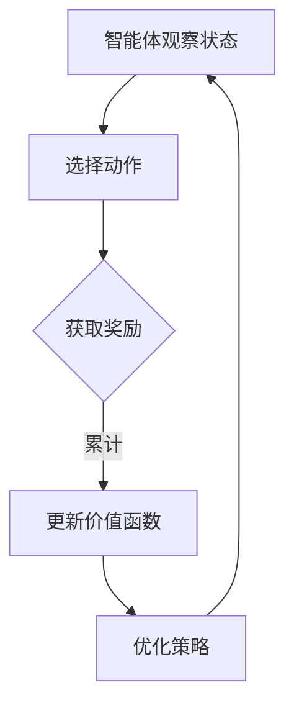

                 

# 深度强化学习在智能机器人自主学习中的应用

> 关键词：深度强化学习、智能机器人、自主学习、强化学习算法、应用场景

> 摘要：本文将介绍深度强化学习在智能机器人自主学习中的应用。通过分析强化学习的核心概念和算法原理，我们将探讨如何利用深度强化学习实现智能机器人的自主学习和决策能力。此外，还将探讨深度强化学习在实际应用场景中的挑战和未来发展趋势。

## 1. 背景介绍

在当今快速发展的信息技术时代，人工智能（AI）已经成为推动社会进步的重要力量。智能机器人作为AI领域的一个重要分支，正逐步应用于各个行业，如制造业、服务业、医疗保健等。智能机器人的发展离不开自主学习和决策能力，而深度强化学习作为一种先进的机器学习方法，为智能机器人的自主学习提供了强有力的支持。

深度强化学习（Deep Reinforcement Learning，DRL）是强化学习（Reinforcement Learning，RL）与深度学习（Deep Learning，DL）相结合的一种机器学习方法。与传统的基于规则的智能系统相比，深度强化学习具有更强的自适应性和通用性，能够在复杂环境中进行有效的决策和学习。

在智能机器人领域，深度强化学习可以应用于路径规划、环境感知、任务执行等多个方面。通过自主学习，智能机器人可以不断优化自己的行为策略，提高任务完成的效率和质量。本文将重点探讨深度强化学习在智能机器人自主学习中的应用，旨在为相关研究人员和开发者提供有价值的参考。

## 2. 核心概念与联系

### 2.1 强化学习（Reinforcement Learning，RL）

强化学习是一种通过试错过程来学习如何进行决策的机器学习方法。在强化学习中，智能体（agent）通过观察环境（environment）的状态（state），并选择相应的动作（action），从而获得奖励（reward）或惩罚（punishment）。智能体的目标是最大化累积奖励，以实现学习目标。

强化学习的基本概念包括：

- **状态（State）**：描述智能体所处的环境条件。
- **动作（Action）**：智能体在特定状态下可以采取的行为。
- **奖励（Reward）**：表示智能体采取动作后获得的即时奖励或惩罚。
- **策略（Policy）**：智能体根据当前状态选择动作的决策规则。
- **价值函数（Value Function）**：评估智能体在某个状态下的最优动作值。
- **模型（Model）**：描述智能体与环境之间的动态转移关系。

### 2.2 深度学习（Deep Learning，DL）

深度学习是一种基于多层神经网络（Neural Network）的机器学习方法。深度学习通过多层神经元节点对输入数据进行特征提取和抽象，从而实现对复杂问题的建模和预测。深度学习的核心概念包括：

- **神经网络（Neural Network）**：由多个神经元组成的层次结构。
- **神经元（Neuron）**：模拟生物神经元的基本单元，负责对输入数据进行加权求和并激活。
- **激活函数（Activation Function）**：用于定义神经元输出与输入之间的关系。
- **损失函数（Loss Function）**：评估神经网络输出与真实值之间的差距，用于指导模型优化。
- **优化算法（Optimization Algorithm）**：用于调整神经网络参数，以最小化损失函数。

### 2.3 深度强化学习（Deep Reinforcement Learning，DRL）

深度强化学习是将强化学习与深度学习相结合的一种方法。在深度强化学习中，智能体通过深度神经网络来表示价值函数或策略，从而实现对复杂环境的自主学习和决策。深度强化学习的基本概念包括：

- **深度神经网络（Deep Neural Network）**：具有多个隐藏层的神经网络。
- **策略网络（Policy Network）**：用于预测智能体在给定状态下的最优动作。
- **价值网络（Value Network）**：用于评估智能体在给定状态下的最优动作值。
- **经验回放（Experience Replay）**：用于缓解样本相关性，提高学习效果。
- **目标网络（Target Network）**：用于稳定学习过程，减少梯度消失问题。

### 2.4 Mermaid 流程图



## 3. 核心算法原理 & 具体操作步骤

### 3.1 算法原理

深度强化学习的基本原理是通过智能体在环境中进行交互，不断更新策略网络和价值网络，以实现自主学习和决策。以下是深度强化学习的具体操作步骤：

1. **初始化策略网络和价值网络**：在开始学习前，初始化策略网络和价值网络，通常使用随机初始化或预训练的方法。
2. **选择动作**：智能体根据当前状态和策略网络，选择一个动作。
3. **执行动作并获取奖励**：智能体在环境中执行所选动作，并获取对应的奖励。
4. **更新价值函数**：根据智能体执行动作后的状态和奖励，更新价值函数。
5. **优化策略网络**：使用梯度下降等优化算法，根据价值函数的梯度，更新策略网络。
6. **重复步骤 2-5**：不断重复步骤 2-5，直到策略网络收敛。

### 3.2 操作步骤

以下是深度强化学习的具体操作步骤：

1. **环境初始化**：初始化环境，设置智能体的初始状态。
2. **初始化策略网络和价值网络**：使用随机初始化或预训练的方法，初始化策略网络和价值网络。
3. **选择动作**：智能体根据当前状态和策略网络，选择一个动作。
4. **执行动作并获取奖励**：智能体在环境中执行所选动作，并获取对应的奖励。
5. **更新价值函数**：根据智能体执行动作后的状态和奖励，使用经验回放和目标网络，更新价值函数。
6. **优化策略网络**：使用梯度下降等优化算法，根据价值函数的梯度，更新策略网络。
7. **评估策略网络**：使用评估指标（如累积奖励、任务完成率等），评估策略网络的性能。
8. **重复步骤 3-7**：不断重复步骤 3-7，直到策略网络收敛。

## 4. 数学模型和公式 & 详细讲解 & 举例说明

### 4.1 数学模型

深度强化学习中的数学模型主要包括策略网络和价值网络。以下是这些网络的数学表示：

1. **策略网络（Policy Network）**：

   $$ \pi(s; \theta_\pi) = P(a_t = a | s_t = s) $$

   其中，$s$ 表示当前状态，$a$ 表示智能体选择的动作，$\pi(s; \theta_\pi)$ 表示在状态 $s$ 下，智能体选择动作 $a$ 的概率。

2. **价值网络（Value Network）**：

   $$ V(s; \theta_v) = \sum_{a} \pi(a|s; \theta_\pi) \cdot Q(s, a; \theta_v) $$

   其中，$s$ 表示当前状态，$a$ 表示智能体选择的动作，$Q(s, a; \theta_v)$ 表示在状态 $s$ 下，执行动作 $a$ 的即时奖励。

3. **Q网络（Q-Network）**：

   $$ Q(s, a; \theta_v) = r + \gamma \max_{a'} Q(s', a'; \theta_v) $$

   其中，$s$ 表示当前状态，$a$ 表示智能体选择的动作，$s'$ 表示智能体执行动作后的状态，$r$ 表示即时奖励，$\gamma$ 表示折扣因子。

### 4.2 详细讲解

1. **策略网络**：

   策略网络是深度强化学习中的核心部分，它负责生成智能体的动作概率分布。策略网络通常是一个多层感知机（Multilayer Perceptron，MLP），其输入为状态 $s$，输出为动作 $a$ 的概率分布。在训练过程中，策略网络通过优化损失函数，不断调整参数 $\theta_\pi$，使得生成的动作概率分布更接近于最优策略。

2. **价值网络**：

   价值网络用于评估智能体在给定状态下的最优动作值。价值网络也是一个多层感知机，其输入为状态 $s$ 和动作 $a$，输出为动作 $a$ 在状态 $s$ 下的即时奖励。价值网络的输出结果反映了智能体在执行动作 $a$ 后的预期奖励。在训练过程中，价值网络通过优化损失函数，不断调整参数 $\theta_v$，使得输出结果更接近于实际奖励。

3. **Q网络**：

   Q网络是深度强化学习中的核心模块，它用于计算状态 $s$ 下执行动作 $a$ 的即时奖励。Q网络通过值函数估计，将状态 $s$ 和动作 $a$ 转换为即时奖励。在训练过程中，Q网络通过优化损失函数，不断调整参数 $\theta_v$，使得输出结果更接近于实际奖励。

### 4.3 举例说明

假设智能体处于一个简单的环境，环境的状态空间为 {0, 1}，动作空间为 {A, B}。智能体的目标是最大化累积奖励。以下是深度强化学习在环境中的具体操作步骤：

1. **初始化策略网络和价值网络**：
   - 策略网络：$ \pi(s; \theta_\pi) = P(A|s=0) = 0.5, P(B|s=0) = 0.5$
   - 价值网络：$V(s; \theta_v) = V(0) = 0.5$
2. **选择动作**：
   - 状态 $s=0$，根据策略网络，智能体选择动作 $A$。
3. **执行动作并获取奖励**：
   - 智能体执行动作 $A$，获得即时奖励 $r=1$。
4. **更新价值函数**：
   - $V(0) = r + \gamma \max_{a} Q(0, a; \theta_v) = 1 + 0.99 \max_{a} Q(0, a; \theta_v)$
   - 更新价值函数：$V(0) = 1 + 0.99 \cdot 1 = 1.99$
5. **优化策略网络**：
   - 根据价值函数的梯度，更新策略网络参数 $\theta_\pi$。
6. **重复步骤 2-5**：不断重复步骤 2-5，直到策略网络收敛。

通过以上步骤，智能体在环境中不断学习和优化动作策略，以实现累积奖励的最大化。

## 5. 项目实战：代码实际案例和详细解释说明

### 5.1 开发环境搭建

在进行深度强化学习项目实战前，需要搭建相应的开发环境。以下是搭建深度强化学习开发环境的步骤：

1. **安装 Python**：安装 Python 3.7 或更高版本。
2. **安装 TensorFlow**：安装 TensorFlow 2.0 或更高版本，通过以下命令安装：
   ```bash
   pip install tensorflow
   ```
3. **安装 Gym**：安装 Gym，通过以下命令安装：
   ```bash
   pip install gym
   ```
4. **安装 Numpy**：安装 Numpy，通过以下命令安装：
   ```bash
   pip install numpy
   ```

### 5.2 源代码详细实现和代码解读

以下是一个简单的深度强化学习项目实战，使用 TensorFlow 和 Gym 库实现一个智能体在 CartPole 环境中的自主学习。

```python
import gym
import tensorflow as tf
import numpy as np

# 创建 CartPole 环境
env = gym.make('CartPole-v0')

# 定义策略网络
class PolicyNetwork(tf.keras.Model):
    def __init__(self, input_shape, output_shape):
        super().__init__()
        self.fc1 = tf.keras.layers.Dense(units=64, activation='relu')
        self.fc2 = tf.keras.layers.Dense(units=output_shape)

    def call(self, inputs, training=False):
        x = self.fc1(inputs)
        x = self.fc2(x)
        return x

# 定义价值网络
class ValueNetwork(tf.keras.Model):
    def __init__(self, input_shape, output_shape):
        super().__init__()
        self.fc1 = tf.keras.layers.Dense(units=64, activation='relu')
        self.fc2 = tf.keras.layers.Dense(units=output_shape)

    def call(self, inputs, training=False):
        x = self.fc1(inputs)
        x = self.fc2(x)
        return x

# 初始化策略网络和价值网络
policy_network = PolicyNetwork(input_shape=env.observation_space.shape[0], output_shape=env.action_space.n)
value_network = ValueNetwork(input_shape=env.observation_space.shape[0], output_shape=1)

# 定义优化器
optimizer = tf.keras.optimizers.Adam(learning_rate=0.001)

# 定义损失函数
def loss_function(policy_probs, target_values, actions, discount_factor=0.99):
    policy_loss = -tf.reduce_sum(target_values * tf.log(policy_probs))
    return policy_loss

# 训练策略网络
@tf.function
def train_step(policy_network, value_network, optimizer, inputs, actions, target_values):
    with tf.GradientTape() as tape:
        policy_probs = policy_network(inputs)
        policy_loss = loss_function(policy_probs, target_values, actions)
        value_loss = tf.reduce_mean(tf.square(target_values - value_network(inputs)))
    
    gradients = tape.gradient(policy_loss + value_loss, [policy_network, value_network])
    optimizer.apply_gradients(zip(gradients, [policy_network, value_network]))

# 训练智能体
def train_agent(policy_network, value_network, env, num_episodes, discount_factor=0.99):
    for episode in range(num_episodes):
        state = env.reset()
        done = False
        total_reward = 0
        
        while not done:
            action = policy_network(tf.convert_to_tensor(state, dtype=tf.float32))[0]
            next_state, reward, done, _ = env.step(action)
            total_reward += reward
            
            target_value = reward + discount_factor * value_network(tf.convert_to_tensor(next_state, dtype=tf.float32))[0]
            train_step(policy_network, value_network, optimizer, state, action, target_value)
            
            state = next_state
        
        print(f"Episode {episode}: Total Reward = {total_reward}")

# 开始训练
train_agent(policy_network, value_network, env, num_episodes=1000)

# 关闭环境
env.close()
```

### 5.3 代码解读与分析

以上代码实现了一个简单的深度强化学习项目，用于在 CartPole 环境中训练智能体。以下是代码的详细解读：

1. **环境初始化**：首先，使用 Gym 库创建 CartPole 环境，该环境是一个经典的强化学习任务，目标是在不使杆子倒下的情况下保持小车在轨道上尽可能长时间。
2. **定义策略网络和价值网络**：策略网络和价值网络分别用于预测智能体在给定状态下的动作概率和价值。策略网络是一个具有两个全连接层的神经网络，输出为动作概率分布。价值网络是一个具有两个全连接层的神经网络，输出为状态的价值。
3. **定义优化器**：使用 Adam 优化器对策略网络和价值网络进行优化。
4. **定义损失函数**：损失函数用于评估策略网络和价值网络的性能。策略网络的损失函数为策略损失，即目标价值与实际价值的差距。价值网络的损失函数为平方误差损失，即目标价值与实际价值的平方差距。
5. **训练策略网络**：训练策略网络通过梯度下降优化算法，更新策略网络和价值网络的参数。
6. **训练智能体**：训练智能体通过在 CartPole 环境中执行动作，并更新策略网络和价值网络，以实现累积奖励的最大化。
7. **关闭环境**：训练完成后，关闭环境以释放资源。

通过以上代码实现，我们可以看到深度强化学习在智能机器人自主学习中的应用。在实际项目中，可以根据需求对代码进行扩展和优化，实现更复杂的任务和环境。

## 6. 实际应用场景

深度强化学习在智能机器人自主学习中的应用场景非常广泛。以下是一些典型的应用场景：

### 6.1 自动驾驶

自动驾驶是深度强化学习在智能机器人领域的一个重要应用场景。通过深度强化学习，自动驾驶汽车可以在复杂的交通环境中进行自主驾驶，实现高速公路驾驶、城市道路驾驶等任务。自动驾驶系统需要具备环境感知、路径规划、决策控制等能力，而深度强化学习为这些能力提供了有效的解决方案。

### 6.2 机器人足球

机器人足球是一项具有挑战性的强化学习任务，涉及到机器人团队之间的合作与对抗。通过深度强化学习，机器人可以学习如何协作进攻、防守和应对对手的策略。机器人足球比赛不仅具有娱乐性，还可以用于研究机器人团队协作和策略学习。

### 6.3 家庭服务机器人

家庭服务机器人如扫地机器人、擦窗机器人等，通过深度强化学习可以实现更智能化的行为。例如，扫地机器人可以通过深度强化学习算法学习如何高效地清洁房间，擦窗机器人可以通过深度强化学习算法学习如何安全地擦洗窗户。这些机器人可以不断优化自己的行为策略，提高服务质量。

### 6.4 工业自动化

在工业自动化领域，深度强化学习可以用于优化机器人的任务执行和路径规划。例如，在制造业中，机器人可以通过深度强化学习算法学习如何高效地搬运物料、装配产品等任务。深度强化学习还可以用于优化生产线调度和资源分配，提高生产效率和降低成本。

### 6.5 机器人协作

机器人协作是未来智能机器人发展的一个重要方向。通过深度强化学习，不同类型的机器人可以在复杂的任务环境中进行协作，共同完成复杂的任务。例如，机器人团队可以在无人仓库中协同完成拣选、包装和配送任务，提高工作效率和准确性。

## 7. 工具和资源推荐

### 7.1 学习资源推荐

- **书籍**：
  - 《深度强化学习》（Deep Reinforcement Learning），作者：S. Bengio、Y. LeCun、P. Lajoie
  - 《强化学习：原理与Python实现》（Reinforcement Learning: An Introduction），作者：Richard S. Sutton、Andrew G. Barto
- **论文**：
  - “Deep Q-Network”（深度 Q 网络），作者：V. Mnih、K. Kavukcuoglu、D. Silver 等
  - “Asynchronous Methods for Deep Reinforcement Learning”（异步深度强化学习方法），作者：T. H. Ward、R. S. Zemel
- **博客**：
  - [TensorFlow Reinforcement Learning Tutorials](https://github.com/tensorflow/agents)
  - [DeepMind Research Blog](https://deepmind.com/research/)
- **网站**：
  - [Gym](https://gym.openai.com/)：提供多种强化学习环境
  - [OpenAI](https://openai.com/)：提供深度强化学习研究和应用

### 7.2 开发工具框架推荐

- **TensorFlow**：一款流行的深度学习框架，支持深度强化学习算法的实现和应用。
- **PyTorch**：一款高效的深度学习框架，支持动态计算图和自动微分，方便实现深度强化学习算法。
- **Keras**：一个基于 TensorFlow 的高级神经网络 API，简化深度学习模型的搭建和训练。

### 7.3 相关论文著作推荐

- **“Deep Reinforcement Learning in Continuous Environments”**：探讨深度强化学习在连续环境中的应用，作者：T. H. Ward、R. S. Zemel
- **“DQN: Dueling Network Architectures for Deep Q-Learning”**：提出 DQN 算法，解决深度 Q 学习中的估值偏差问题，作者：Vanessa Tan、Pieter Abbeel
- **“Asynchronous Methods for Deep Reinforcement Learning”**：提出异步深度强化学习方法，提高学习效率，作者：T. H. Ward、R. S. Zemel

## 8. 总结：未来发展趋势与挑战

深度强化学习在智能机器人自主学习领域具有广泛的应用前景。随着计算能力的提升和算法的进步，深度强化学习将在自动驾驶、机器人足球、家庭服务机器人、工业自动化等领域发挥更大的作用。

然而，深度强化学习在实际应用中仍面临一些挑战：

1. **数据需求**：深度强化学习需要大量高质量的数据来训练模型，特别是在复杂环境中。如何获取和处理大量数据是深度强化学习面临的一个关键问题。
2. **收敛速度**：深度强化学习算法在训练过程中可能需要很长时间才能收敛，特别是在复杂环境中。如何提高收敛速度是一个亟待解决的问题。
3. **安全性和可靠性**：深度强化学习算法在决策过程中可能存在不确定性和风险，特别是在高风险领域。如何确保算法的安全性和可靠性是一个重要的挑战。

未来，随着人工智能技术的不断发展，深度强化学习在智能机器人自主学习领域的应用将更加广泛。通过不断优化算法和提升计算能力，深度强化学习将为智能机器人领域带来更多创新和突破。

## 9. 附录：常见问题与解答

### 9.1 深度强化学习与监督学习、无监督学习的区别

- **深度强化学习**：通过试错和反馈机制，从环境中学习如何进行决策。智能体通过不断尝试和调整策略，以实现累积奖励的最大化。
- **监督学习**：给定输入数据和对应的标签，通过学习输入和输出之间的映射关系，从而预测新的输入数据。监督学习需要预先标记的数据集。
- **无监督学习**：在没有标签的情况下，从数据中学习潜在的规律或结构。无监督学习包括聚类、降维等方法。

### 9.2 深度强化学习与强化学习的区别

- **深度强化学习**：结合了深度学习和强化学习的优势，使用深度神经网络来表示价值函数或策略函数，适用于复杂环境。
- **强化学习**：基于试错和反馈机制，使用价值函数或策略函数来指导智能体的决策。强化学习算法包括 Q 学习、SARSA、深度 Q 网络（DQN）等。

### 9.3 深度强化学习中的探索与利用问题

- **探索（Exploration）**：在决策过程中，智能体需要尝试不同的动作，以获取更多关于环境的了解。
- **利用（Utilization）**：在决策过程中，智能体需要利用已学到的知识，选择能够最大化累积奖励的动作。
- **探索与利用平衡**：深度强化学习需要找到一个合适的平衡点，既不过度探索，也不过度利用，以实现快速收敛和稳定决策。

## 10. 扩展阅读 & 参考资料

- 《深度强化学习》：S. Bengio、Y. LeCun、P. Lajoie 著
- 《强化学习：原理与Python实现》：Richard S. Sutton、Andrew G. Barto 著
- [TensorFlow Reinforcement Learning Tutorials](https://github.com/tensorflow/agents)
- [Gym](https://gym.openai.com/)
- [DeepMind Research Blog](https://deepmind.com/research/)
- [OpenAI](https://openai.com/)

