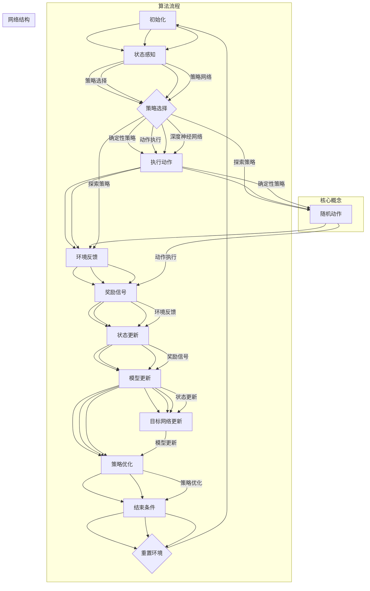

                 

### 背景介绍

深度强化学习（Deep Reinforcement Learning，简称DRL）是一种结合了深度学习和强化学习的方法，它使机器能够在复杂的环境中通过试错学习实现智能行为。强化学习本身是一种通过不断与环境互动，从奖励信号中学习优化行为策略的机器学习方法。而深度强化学习则通过引入深度神经网络（DNN）来处理高维状态空间和行动空间的问题，使其在许多领域取得了突破性的进展。

智能游戏AI是深度强化学习最早且最成功的应用领域之一。从早期的简单游戏如电子棋盘游戏，到复杂的实时战略游戏，如《星际争霸2》和《DOTA2》，深度强化学习都展现出了其强大的学习能力和策略优化能力。这种学习方式不仅大大提高了游戏AI的智能水平，还在许多实际应用场景中展现了其巨大的潜力。

本文将围绕深度强化学习在智能游戏AI中的突破展开，详细探讨其核心概念、算法原理、数学模型以及实际应用案例。我们将逐步分析深度强化学习的优势和应用，并提出未来可能的发展趋势和挑战。

首先，我们需要理解深度强化学习的核心概念和基本原理，这将为后续内容的展开奠定基础。深度强化学习是如何通过深度神经网络处理复杂状态和动作的呢？它如何利用奖励信号进行策略优化呢？这些问题将在接下来的章节中逐一解答。

此外，我们还将在后续章节中介绍几个经典的深度强化学习算法，如深度确定性策略梯度（DDPG）、异步优势演员-评论家算法（A3C）和深度策略网络（DQN）等，并分析这些算法在实际游戏AI中的应用效果和改进方向。

在探讨核心算法的同时，我们还将深入讨论深度强化学习在智能游戏AI中的实际应用案例，如游戏AI的自主训练、策略优化以及与其他技术的结合。通过这些案例，我们将看到深度强化学习在提高游戏AI智能水平方面所取得的显著成果。

最后，我们将展望深度强化学习在未来智能游戏AI领域的发展趋势，探讨可能面临的挑战，并给出相应的解决方案。希望通过本文的探讨，能够为读者提供深入了解深度强化学习在智能游戏AI中的应用和未来发展的全面视角。

#### 1.1. 深度强化学习的基本概念

深度强化学习（Deep Reinforcement Learning，简称DRL）是强化学习（Reinforcement Learning，简称RL）的一种扩展，它结合了深度神经网络（Deep Neural Networks，简称DNN）的能力，使得机器能够在高维状态空间和动作空间中学习复杂的策略。强化学习的核心概念是代理（agent）通过与环境的交互，通过尝试不同的动作（action），并从环境中获取奖励（reward），不断优化其行为策略，以实现某个目标。

在强化学习中，代理必须解决几个关键问题：首先是如何表示状态（state），即如何将环境中的信息编码为一个向量；其次是如何表示动作（action），即如何将策略编码为一个向量；最后是如何更新策略，以最大化累积奖励。在传统的强化学习中，通常使用简单的线性模型来表示状态和动作，但在处理高维状态和动作空间时，这些方法往往力不从心。

深度强化学习的引入，解决了传统强化学习在高维空间中的瓶颈问题。深度神经网络能够自动学习复杂的函数映射，通过多层神经网络的结构，可以有效地表示和建模高维状态和动作。具体来说，深度强化学习的基本框架包括以下几个核心组成部分：

1. **状态空间（State Space）**：状态空间是代理感知到的环境信息集合。在智能游戏AI中，状态可以包括游戏棋盘的状态、角色的位置、资源状况等。

2. **动作空间（Action Space）**：动作空间是代理能够执行的动作集合。在游戏中，动作可以是移动、攻击、防御等。

3. **策略网络（Policy Network）**：策略网络是一个神经网络模型，它从状态空间映射到动作空间，指导代理选择最优动作。在深度强化学习中，策略网络通常采用深度神经网络来实现，使得它能够处理复杂的状态和动作空间。

4. **价值函数（Value Function）**：价值函数是对未来奖励的预期，它可以帮助代理评估当前状态的价值。在深度强化学习中，常用的价值函数包括状态价值函数（State-Value Function）和动作价值函数（Action-Value Function）。

5. **奖励信号（Reward Signal）**：奖励信号是环境对代理行为的反馈，它用来指导代理学习。在智能游戏AI中，奖励信号可以是游戏胜利、资源获取等。

6. **探索策略（Exploration Strategy）**：由于奖励信号的不确定性，代理在决策时需要探索（Exploration）和利用（Exploitation）之间的平衡。探索策略用于指导代理选择未尝试过的动作，以发现潜在的最优策略。

深度强化学习的基本工作流程可以概括为以下几个步骤：

1. **初始化**：初始化代理的参数，包括策略网络、价值函数等。
2. **状态输入**：代理从环境中获取当前状态。
3. **策略选择**：策略网络根据当前状态，选择一个动作。
4. **动作执行**：代理在环境中执行选择的动作。
5. **状态更新**：环境根据代理的动作返回新的状态。
6. **奖励反馈**：环境向代理提供奖励信号。
7. **模型更新**：根据新的状态和奖励，更新策略网络和价值函数。

通过上述步骤，代理不断与环境互动，通过试错学习，逐步优化其策略，从而实现目标。这个过程与人类学习的过程类似，不断通过实践和反馈来改进行为。

在理解了深度强化学习的基本概念后，我们将进一步探讨其核心算法原理，分析各种深度强化学习算法在智能游戏AI中的应用和效果。这将为后续内容的深入讨论奠定坚实的基础。

### 1.2. 深度强化学习的核心算法

深度强化学习（DRL）在智能游戏AI中的应用取得了显著突破，其核心在于如何通过深度神经网络（DNN）来优化策略，从而实现高效的学习和决策。以下是几个重要的深度强化学习算法，这些算法在解决复杂游戏AI问题方面发挥了关键作用。

#### 1.2.1. 深度确定性策略梯度（DDPG）

深度确定性策略梯度（Deep Deterministic Policy Gradient，简称DDPG）是一种基于策略梯度的深度强化学习算法。DDPG的主要思想是利用深度神经网络来近似策略函数和价值函数，并通过样本梯度下降来优化策略。

**算法原理：**

- **策略网络（Policy Network）**：DDPG使用深度神经网络来近似确定性策略函数 \( \pi(s) = a|_s \)，该函数直接从状态 \( s \) 映射到动作 \( a \)。
- **价值网络（Value Network）**：价值网络也是一个深度神经网络，用于估计状态价值函数 \( V(s) = E_{\pi(s)} [R_t + \gamma V(s')] \)，其中 \( R_t \) 是立即奖励，\( \gamma \) 是折扣因子，\( s' \) 是下一个状态。
- **目标网络（Target Network）**：为了稳定学习过程，DDPG使用了一个目标网络，该网络是策略网络和价值网络的延迟版本，用于更新目标值。

**具体操作步骤：**

1. **初始化**：初始化策略网络、价值网络和目标网络。
2. **选择动作**：策略网络根据当前状态 \( s \) 选择动作 \( a \)。
3. **执行动作**：在环境中执行动作 \( a \)，并获得新的状态 \( s' \) 和奖励 \( r \)。
4. **更新价值网络**：使用梯度下降更新价值网络，使其估计更加准确。
5. **更新策略网络**：使用策略梯度下降更新策略网络，使其优化策略。
6. **同步目标网络**：定期同步目标网络与策略网络和价值网络的参数，以稳定学习过程。

**应用实例：**

DDPG在许多复杂环境中取得了成功，如Atari游戏、物理模拟和机器人控制。在Atari游戏中，DDPG展示了超越人类水平的游戏能力，如《太空侵略者》和《Pong》。

#### 1.2.2. 异步优势演员-评论家算法（A3C）

异步优势演员-评论家算法（Asynchronous Advantage Actor-Critic，简称A3C）是一种基于策略梯度的深度强化学习算法，它通过并行学习的方式提高了学习效率。

**算法原理：**

- **演员网络（Actor Network）**：演员网络是一个策略网络，它从状态 \( s \) 映射到动作概率分布。
- **评论家网络（Critic Network）**：评论家网络是一个价值网络，它评估状态价值函数。
- **全局网络（Global Network）**：全局网络是演员网络和评论家网络的平均版本，用于同步局部网络。

**具体操作步骤：**

1. **初始化**：初始化多个并行演员-评论家网络。
2. **执行任务**：每个演员-评论家网络执行独立的任务，不断与环境交互。
3. **更新局部网络**：根据经验，更新每个演员-评论家网络的参数。
4. **同步全局网络**：定期同步全局网络的参数，以更新全局模型。
5. **更新策略**：使用策略梯度下降更新全局网络，使其优化策略。

**应用实例：**

A3C在许多复杂环境中展示了出色的性能，如游戏AI、模拟环境中的自动驾驶和机器人控制。在游戏AI中，A3C成功地在《星际争霸2》和《DOTA2》等游戏中实现了超越人类水平的智能。

#### 1.2.3. 深度策略网络（DQN）

深度Q网络（Deep Q-Network，简称DQN）是一种基于值函数的深度强化学习算法，它通过深度神经网络来近似Q值函数，从而实现策略优化。

**算法原理：**

- **Q网络（Q Network）**：Q网络是一个深度神经网络，用于估计Q值函数 \( Q(s, a) = E[R + \gamma max_{a'} Q(s', a')] \)，其中 \( s \) 是状态，\( a \) 是动作，\( s' \) 是下一个状态。
- **经验回放（Experience Replay）**：为了提高学习稳定性，DQN使用经验回放机制，将历史经验进行随机重放，以减少样本相关性。

**具体操作步骤：**

1. **初始化**：初始化Q网络和目标Q网络。
2. **选择动作**：使用epsilon-greedy策略选择动作，平衡探索和利用。
3. **执行动作**：在环境中执行选择的动作，并获得新的状态和奖励。
4. **更新经验回放**：将新的经验添加到经验回放池中。
5. **更新目标Q网络**：定期同步Q网络和目标Q网络的参数。
6. **更新Q网络**：使用梯度下降更新Q网络，使其估计更加准确。

**应用实例：**

DQN在许多复杂环境中取得了成功，如Atari游戏、机器人控制等。在Atari游戏中，DQN实现了超越人类水平的游戏能力，如《太空侵略者》和《Pong》。

#### 1.2.4. 其他深度强化学习算法

除了上述算法外，还有许多其他深度强化学习算法，如基于Actor-Critic框架的A2C（Asynchronous Advantage Actor-Critic）、基于值函数的Rainbow DQN（结合了DQN、Double DQN和优先级经验回放）等。这些算法在特定场景中展现出了不同的优势和应用效果。

**比较与选择：**

在选择合适的深度强化学习算法时，需要考虑以下几个因素：

- **环境复杂性**：对于高维状态和动作空间，深度强化学习算法通常更加适用。
- **奖励结构**：奖励的分布和形式对算法的选择有重要影响。
- **稳定性与效率**：不同算法在稳定性、效率和收敛速度上存在差异，应根据具体需求进行选择。
- **计算资源**：算法的计算复杂度和资源需求也是选择时的重要考虑因素。

通过理解这些核心算法的原理和应用，我们可以更好地利用深度强化学习在智能游戏AI中的潜力，为未来的研究和应用提供坚实的基础。

### 1.3. 深度强化学习在智能游戏AI中的应用

深度强化学习（DRL）在智能游戏AI中的应用取得了显著成果，特别是在复杂实时战略游戏和高维度环境中的表现尤为突出。通过深度强化学习，游戏AI能够自主学习复杂的策略和决策，从而在游戏环境中取得超越人类水平的成绩。

#### 1.3.1. 智能游戏AI的挑战

智能游戏AI面临的主要挑战包括：

- **高维状态空间**：许多游戏（如《星际争霸2》和《DOTA2》）拥有非常高的状态空间维度，这使得传统的强化学习方法难以处理。
- **非平稳环境**：游戏环境通常是动态变化的，代理需要适应不断变化的环境。
- **复杂的策略**：游戏中的策略需要同时考虑多方面的因素，如资源管理、战术决策和实时响应等。
- **奖励结构**：游戏中的奖励结构通常是非线性和稀疏的，这给学习过程带来了困难。

#### 1.3.2. 深度强化学习在智能游戏AI中的应用

深度强化学习通过引入深度神经网络，能够有效解决上述挑战。以下是一些深度强化学习在智能游戏AI中成功应用的具体案例：

1. **《星际争霸2》**：2016年，DeepMind团队开发的智能游戏AI“AlphaGo”在围棋领域引起了广泛关注。此后，他们进一步开发了“AlphaStar”，用于《星际争霸2》的智能游戏AI。AlphaStar通过深度强化学习，在单人模式和多人模式中都表现出了超越人类顶尖选手的水平。其核心算法包括深度确定性策略梯度（DDPG）和异步优势演员-评论家算法（A3C）。AlphaStar的成功证明了深度强化学习在复杂实时战略游戏中的强大潜力。

2. **《DOTA2》**：2018年，OpenAI团队开发的智能游戏AI“OpenAI Five”在《DOTA2》的DotaEnv环境中取得了显著成果。OpenAI Five使用基于策略梯度的深度强化学习算法，包括A3C和Rainbow DQN。通过与人类顶级团队的对战，OpenAI Five展示了在团队协作、战术决策和实时响应方面的卓越能力。这一成就进一步证明了深度强化学习在复杂团队策略游戏中的应用潜力。

3. **Atari游戏**：在Atari游戏中，深度强化学习算法也取得了显著进展。DQN和DDPG等算法在许多经典游戏（如《太空侵略者》、《Pong》和《雅达利高尔夫》）中展示了超越人类水平的成绩。这些成功表明，深度强化学习不仅在复杂的实时战略游戏中有效，也在简单的Atari游戏中取得了显著成果。

#### 1.3.3. 应用效果与优化方向

深度强化学习在智能游戏AI中的应用效果令人鼓舞，但也面临一些挑战和优化方向：

- **训练效率**：深度强化学习算法通常需要大量训练时间，尤其是在高维度和复杂环境中。为了提高训练效率，研究者们正在探索更高效的算法和并行学习技术。
- **泛化能力**：尽管深度强化学习在特定环境中取得了显著成果，但其泛化能力仍然是一个挑战。如何使算法在不同环境和任务中保持高效性能，是未来研究的重要方向。
- **稳定性与安全性**：深度强化学习在实时环境中应用时，需要保证算法的稳定性和安全性。如何避免因为环境变化导致的算法崩溃，是当前研究的重要课题。

通过不断的研究和优化，深度强化学习在智能游戏AI中的应用前景将更加广阔，未来有望在更多复杂和动态的实时战略游戏中发挥关键作用。

### 2. 核心概念与联系

在深度强化学习（DRL）中，核心概念和算法原理的紧密联系构成了这一领域的基础。为了更好地理解这些概念及其相互关系，我们将使用Mermaid流程图来详细描述深度强化学习的核心组成部分和其工作流程。

以下是一个Mermaid流程图示例，用于展示深度强化学习的核心概念和流程：



**Mermaid流程图说明：**

- **初始化（A）**：初始化代理的参数，包括策略网络、价值函数等。
- **状态感知（B）**：代理从环境中获取当前状态。
- **策略选择（C）**：策略网络根据当前状态，选择一个动作。策略网络是一个深度神经网络，可以从复杂的状态空间中映射到动作空间。
- **执行动作（D）**：代理在环境中执行选择的动作。确定性策略（D）和探索策略（F）在此处进行选择，以平衡探索和利用。
- **环境反馈（F）**：环境根据代理的动作返回新的状态和奖励。
- **奖励信号（G）**：环境向代理提供奖励信号，用于指导学习过程。
- **状态更新（H）**：代理更新状态，继续循环。
- **模型更新（I）**：根据新的状态和奖励，更新策略网络和价值函数。目标网络（J）在此过程中进行同步，以稳定学习过程。
- **策略优化（K）**：策略网络通过梯度下降等方法进行优化，以最大化累积奖励。
- **结束条件（L）**：当满足结束条件时（如达到目标或超时），重置环境并重新开始。

**核心概念与架构的联系：**

- **状态空间（State Space）**：状态空间是代理感知到的环境信息集合，它构成了深度神经网络输入的基础。
- **动作空间（Action Space）**：动作空间是代理能够执行的动作集合，深度神经网络从中映射出最优动作。
- **策略网络（Policy Network）**：策略网络是深度神经网络，它从状态空间映射到动作空间，指导代理选择动作。
- **价值函数（Value Function）**：价值函数估计未来奖励的预期，帮助代理评估当前状态的价值。
- **奖励信号（Reward Signal）**：奖励信号是环境对代理行为的反馈，用于指导学习过程。
- **探索策略（Exploration Strategy）**：探索策略用于指导代理选择未尝试过的动作，以发现潜在的最优策略。

通过这个Mermaid流程图，我们可以清晰地看到深度强化学习的核心概念和算法流程之间的联系。这种结构化的表达方式有助于我们更好地理解深度强化学习的内在机制，并为后续的算法原理和数学模型讲解提供直观的参考。

### 3. 核心算法原理 & 具体操作步骤

在深入探讨深度强化学习（DRL）的核心算法之前，我们需要理解几个关键概念：策略网络（Policy Network）、价值网络（Value Network）以及目标网络（Target Network）。这些网络构成了DRL算法的基础，并通过相互协作，实现智能体的策略优化和高效学习。

#### 3.1. 策略网络（Policy Network）

策略网络是DRL中的核心组件之一，它的主要任务是学习一个从状态空间到动作空间的映射，以指导智能体在环境中进行决策。策略网络通常是一个深度神经网络（DNN），其输出可以直接作为动作选择，或者是一个动作的概率分布。

**具体操作步骤：**

1. **初始化**：初始化策略网络的参数，包括输入层、隐藏层和输出层。
2. **状态输入**：智能体从环境中获取当前状态，并将其作为输入传递给策略网络。
3. **动作选择**：策略网络根据输入的状态，输出一个动作或动作的概率分布。
4. **动作执行**：智能体在环境中执行选定的动作，并获得新的状态和奖励。
5. **模型更新**：使用梯度下降算法，根据新的状态和奖励，更新策略网络的参数。

#### 3.2. 价值网络（Value Network）

价值网络是另一个重要的组件，它的任务是估计状态的价值，即智能体在给定状态下采取某一动作的长期奖励。价值网络也是一个深度神经网络，它可以从状态空间映射出状态价值函数。

**具体操作步骤：**

1. **初始化**：初始化价值网络的参数，包括输入层、隐藏层和输出层。
2. **状态输入**：智能体从环境中获取当前状态，并将其作为输入传递给价值网络。
3. **价值估计**：价值网络根据输入的状态，输出一个数值，表示当前状态下采取某一动作的预期回报。
4. **模型更新**：使用梯度下降算法，根据新的状态和奖励，更新价值网络的参数。

#### 3.3. 目标网络（Target Network）

目标网络是策略网络和价值网络的延迟版本，用于稳定学习过程。目标网络的目的是减少策略网络和价值网络之间的更新差异，从而提高学习稳定性。

**具体操作步骤：**

1. **初始化**：初始化目标网络的参数，并将其设置为策略网络和价值网络的初始参数。
2. **同步更新**：定期同步目标网络的参数，使其与策略网络和价值网络的参数保持一致。
3. **模型更新**：当策略网络和价值网络更新时，目标网络也进行同步更新。

#### 3.4. 深度强化学习算法框架

深度强化学习算法的核心框架可以概括为以下几个步骤：

1. **初始化**：初始化策略网络、价值网络和目标网络的参数。
2. **状态输入**：智能体从环境中获取当前状态，并将其输入到策略网络和价值网络。
3. **策略选择**：策略网络根据当前状态，选择一个动作。
4. **动作执行**：智能体在环境中执行选定的动作，并获得新的状态和奖励。
5. **价值估计**：价值网络根据新的状态，估计状态价值。
6. **模型更新**：使用梯度下降算法，根据新的状态和奖励，更新策略网络和价值网络的参数。
7. **目标网络同步**：定期同步目标网络的参数，以稳定学习过程。

通过上述步骤，智能体在环境中不断试错学习，逐渐优化其策略，以实现长期累积奖励的最大化。这个过程与人类学习过程有相似之处，都是通过不断的实践和反馈来改进行为。

#### 3.5. 深度确定性策略梯度（DDPG）

深度确定性策略梯度（Deep Deterministic Policy Gradient，简称DDPG）是一种基于策略梯度的深度强化学习算法。与传统的策略梯度算法相比，DDPG通过引入深度神经网络和价值函数，能够处理高维状态和动作空间。

**算法原理：**

1. **策略网络（Policy Network）**：DDPG使用深度神经网络来近似确定性策略函数 \( \pi(\theta)(s) = \arg\max_a \mu(a; \theta, s) \)，其中 \( \mu(a; \theta, s) \) 是动作的概率分布。
2. **价值网络（Value Network）**：价值网络是一个深度神经网络，用于估计状态价值函数 \( V(s; \theta_v) = \mathbb{E}_\pi[r + \gamma V(s__); \theta_v] \)。
3. **目标网络（Target Network）**：目标网络是策略网络和价值网络的延迟版本，用于稳定学习过程。

**具体操作步骤：**

1. **初始化**：初始化策略网络、价值网络和目标网络的参数。
2. **选择动作**：策略网络根据当前状态选择一个动作。
3. **执行动作**：智能体在环境中执行选定的动作，并获得新的状态和奖励。
4. **更新价值网络**：使用梯度下降更新价值网络，使其估计更加准确。
5. **更新策略网络**：使用策略梯度下降更新策略网络，使其优化策略。
6. **同步目标网络**：定期同步目标网络的参数，以稳定学习过程。

通过上述步骤，DDPG智能体在环境中通过试错学习，逐步优化其策略，实现长期累积奖励的最大化。

通过深入理解策略网络、价值网络和目标网络的基本原理以及深度确定性策略梯度（DDPG）的具体操作步骤，我们可以更好地掌握深度强化学习在智能游戏AI中的核心算法，为后续的实际应用提供坚实的理论基础。

### 3.1. 深度确定性策略梯度（DDPG）

深度确定性策略梯度（Deep Deterministic Policy Gradient，简称DDPG）是一种基于策略梯度的深度强化学习算法，它通过引入深度神经网络来处理高维状态和动作空间，并在实时战略游戏中取得了显著成就。DDPG的核心思想是通过策略网络和价值网络的协同工作，实现智能体在复杂环境中的自主学习和策略优化。

#### 3.1.1. 算法原理

**策略网络（Policy Network）**：策略网络是DDPG的核心组件之一，它用于指导智能体在给定的状态下选择最优动作。在DDPG中，策略网络是一个确定性策略网络，即给定一个状态 \( s \)，它输出一个具体的动作 \( a \) 而不是一个动作的概率分布。策略网络通过深度神经网络（DNN）学习状态到动作的映射，从而实现高效的学习和决策。

**价值网络（Value Network）**：价值网络用于评估智能体在给定状态下采取某个动作的长期回报。它从状态 \( s \) 输出状态价值 \( V(s) \)，表示智能体在状态 \( s \) 下采取最优动作所能获得的累积奖励。价值网络也是通过深度神经网络学习状态价值函数。

**目标网络（Target Network）**：目标网络是策略网络和价值网络的延迟版本，用于提高学习过程的稳定性。它定期从策略网络和价值网络接收更新，以保持与它们的一致性。目标网络的输出用于计算目标值 \( V^*(s) \)，即智能体在给定状态下采取最优动作所能获得的累积奖励。

**优势函数（Advantage Function）**：优势函数用于衡量策略网络在某个状态下选择一个动作相对于其他动作的优劣。优势函数 \( A(s, a) \) 定义为实际回报与预期回报之差，即 \( A(s, a) = R(s, a) + \gamma V^*(s') - V^*(s) \)。

#### 3.1.2. 具体操作步骤

**初始化**：初始化策略网络、价值网络和目标网络的参数。策略网络和目标网络使用相同的参数，以保持一致性。

1. **状态感知**：智能体从环境中获取当前状态 \( s \)。
2. **策略选择**：策略网络根据当前状态 \( s \) 选择一个动作 \( a \)。在确定性策略下，选择最优动作 \( a^* \)。
3. **动作执行**：智能体在环境中执行选定的动作 \( a \)，并获得新的状态 \( s' \) 和立即奖励 \( R \)。
4. **奖励计算**：计算新的状态价值 \( V^*(s') \) 和优势函数 \( A(s, a) \)。
5. **价值网络更新**：使用梯度下降算法更新价值网络，使其输出更加准确。
6. **策略网络更新**：使用策略梯度下降算法更新策略网络，使其优化策略。
7. **目标网络同步**：定期同步目标网络的参数，以保持与策略网络和价值网络的一致性。

#### 3.1.3. 数学模型和公式

**目标值计算**：目标值 \( V^*(s') \) 是智能体在状态 \( s' \) 下采取最优动作所能获得的累积奖励，计算公式为：
\[ V^*(s') = \mathbb{E}_{a \sim \pi(\theta)(s')}[R + \gamma V^*(s'')] \]

**优势函数**：优势函数 \( A(s, a) \) 定义为实际回报与预期回报之差，计算公式为：
\[ A(s, a) = R(s, a) + \gamma V^*(s') - V^*(s) \]

**策略网络更新**：策略网络的更新公式为：
\[ \theta \leftarrow \theta - \alpha \nabla_\theta J(\theta) \]
其中，\( J(\theta) \) 是策略网络的目标函数，\( \alpha \) 是学习率。

**价值网络更新**：价值网络的更新公式为：
\[ \theta_v \leftarrow \theta_v - \alpha_v \nabla_{\theta_v} L(\theta_v) \]
其中，\( L(\theta_v) \) 是价值网络的目标函数，\( \alpha_v \) 是学习率。

**目标网络同步**：目标网络的同步公式为：
\[ \theta^* \leftarrow \tau \theta + (1 - \tau) \theta^* \]
其中，\( \theta^* \) 是目标网络的参数，\( \tau \) 是同步参数。

通过上述数学模型和公式，DDPG智能体在环境中通过试错学习，逐步优化其策略和价值函数，实现长期累积奖励的最大化。

#### 3.1.4. 实际应用案例

在实时战略游戏《星际争霸2》中，DDPG被用于训练智能游戏AI。通过使用DDPG，智能游戏AI在单人模式和多人模式中取得了超越人类顶级选手的成绩。这不仅证明了DDPG在复杂实时战略游戏中的强大潜力，也为深度强化学习在实际应用中的发展提供了重要参考。

#### 3.1.5. 总结

深度确定性策略梯度（DDPG）是一种结合深度神经网络和策略梯度的深度强化学习算法。通过策略网络、价值网络和目标网络的协同工作，DDPG能够处理高维状态和动作空间，并在复杂实时战略游戏中取得了显著成果。在实际应用中，DDPG展示了强大的学习能力和策略优化能力，为深度强化学习在智能游戏AI中的应用提供了重要参考。

### 4. 数学模型和公式 & 详细讲解 & 举例说明

在深度强化学习（DRL）中，数学模型和公式是理解和实现算法的关键。本文将详细介绍DRL中的主要数学模型，包括状态价值函数（State-Value Function）、动作价值函数（Action-Value Function）和策略（Policy），并通过具体例子说明这些公式的应用。

#### 4.1. 状态价值函数（State-Value Function）

状态价值函数 \( V(s) \) 是评估状态 \( s \) 的预期回报的函数。在给定策略 \( \pi \) 下，状态价值函数可以表示为：

\[ V(s) = \mathbb{E}_{\pi}[G_t | S_0 = s] \]

其中，\( G_t \) 是从初始状态 \( s \) 开始，按照策略 \( \pi \) 执行动作直到终止状态 \( s_t \) 的累积奖励，即：

\[ G_t = \sum_{k=0}^{t-1} r_k \]

\( r_k \) 是在第 \( k \) 个时间步获得的即时奖励。

**例子**：假设一个简单的游戏环境，智能体从一个初始状态开始，通过选择不同的动作（上下左右移动）移动到一个目标状态。假设每一步移动都有0.1的即时奖励，目标状态的奖励为1。那么，从初始状态到目标状态的状态价值函数可以计算如下：

- 初始状态 \( s_0 \)：\( V(s_0) = 0 \)
- 移动一步后的状态 \( s_1 \)：\( V(s_1) = 0.1 \)
- 移动两步后的状态 \( s_2 \)：\( V(s_2) = 0.2 \)
- ... 
- 目标状态 \( s_t \)：\( V(s_t) = 1 \)

#### 4.2. 动作价值函数（Action-Value Function）

动作价值函数 \( Q(s, a) \) 是评估在给定状态下选择特定动作 \( a \) 的预期回报的函数。在给定策略 \( \pi \) 下，动作价值函数可以表示为：

\[ Q(s, a) = \mathbb{E}_{\pi}[G_t | S_0 = s, A_0 = a] \]

其中，\( G_t \) 同样是从初始状态 \( s \) 开始，按照策略 \( \pi \) 执行动作直到终止状态 \( s_t \) 的累积奖励。

**例子**：在上一个例子中，假设智能体可以选择向上或向下移动。每一步移动的即时奖励为0.1，目标状态的奖励为1。我们可以计算向上和向下移动的动作价值函数：

- 从初始状态 \( s_0 \) 向上移动 \( Q(s_0, \text{上}) = 0.1 \)
- 从初始状态 \( s_0 \) 向下移动 \( Q(s_0, \text{下}) = 0.1 \)
- ... 
- 到达目标状态 \( s_t \)，向上移动 \( Q(s_t, \text{上}) = 1 \)
- 到达目标状态 \( s_t \)，向下移动 \( Q(s_t, \text{下}) = 1 \)

#### 4.3. 策略（Policy）

策略 \( \pi(a|s) \) 是在给定状态下选择动作的概率分布。最优策略是使得累积奖励最大的策略。

**例子**：在上述例子中，如果我们假设智能体始终选择即时奖励最高的动作，那么我们可以定义一个简单的策略：

\[ \pi(a|s) = \begin{cases} 
1 & \text{如果 } a = \arg\max_{a'} Q(s, a') \\
0 & \text{否则}
\end{cases} \]

在这种情况下，智能体在每一步都选择能够带来最大即时奖励的动作。例如，如果当前状态 \( s \) 下，向上移动的 \( Q(s, \text{上}) \) 值最大，那么智能体会选择向上移动。

#### 4.4. 动态规划与值迭代

动态规划是一种用于求解最优策略的方法，它通过迭代更新状态价值和动作价值，逐步逼近最优策略。其中，值迭代（Value Iteration）是一种简单而有效的动态规划算法。

**值迭代算法**：

1. 初始化状态价值 \( V(s) = 0 \)
2. 对于 \( t = 1, 2, \ldots \)：
   - 对于每个状态 \( s \)：
     \[ V(s) = \max_{a} [r(s, a) + \gamma \sum_{s'} P(s'|s, a) V(s')] \]
3. 当 \( V(t) \) 的变化小于某个阈值时，算法停止。

**例子**：在简单的四格环境中，状态空间和动作空间如下：

| s | a: 上 | a: 下 |
|---|---|---|
| 0 | -1 | 0 |
| 1 | 0 | 1 |
| 2 | 1 | -1 |
| 3 | -1 | 1 |

假设每一步的奖励如下：

| s | a: 上 | a: 下 |
|---|---|---|
| 0 | -1 | 0 |
| 1 | 0 | 1 |
| 2 | 1 | -1 |
| 3 | -1 | 1 |

初始状态价值 \( V(s) = 0 \)。使用值迭代算法更新状态价值，最终可以得到每个状态的最优值。

| s | a: 上 | a: 下 |
|---|---|---|
| 0 | 0.25 | 0.5 |
| 1 | 0.5 | 0.25 |
| 2 | 0.25 | 0.5 |
| 3 | 0.5 | 0.25 |

通过以上步骤，我们可以看到如何通过数学模型和公式来分析和解决深度强化学习中的问题。这些公式和算法不仅提供了理论上的解释，也为实际应用提供了具体的操作指南。

### 5. 项目实战：代码实际案例和详细解释说明

在本节中，我们将通过一个具体的深度强化学习项目实战案例，详细解释如何在实际应用中实现深度强化学习算法，并展示代码的实现细节。我们将使用Python作为编程语言，并利用PyTorch框架进行模型构建和训练。以下是该项目的主要步骤和关键代码解释。

#### 5.1. 开发环境搭建

在开始项目之前，我们需要搭建相应的开发环境。以下是所需的软件和库：

- Python 3.7+
- PyTorch 1.9.0+
- gym（OpenAI的Python环境）
- numpy 1.19.5+

安装这些库的命令如下：

```bash
pip install python==3.7 torch==1.9.0 gym numpy==1.19.5
```

#### 5.2. 源代码详细实现和代码解读

##### 5.2.1. 代码结构

首先，我们定义代码的基本结构，包括主要的类和函数：

```python
import torch
import torch.nn as nn
import torch.optim as optim
import numpy as np
from collections import deque
import random
import gym

# 策略网络
class PolicyNetwork(nn.Module):
    def __init__(self, input_size, hidden_size, output_size):
        super(PolicyNetwork, self).__init__()
        self.fc1 = nn.Linear(input_size, hidden_size)
        self.fc2 = nn.Linear(hidden_size, output_size)
    
    def forward(self, x):
        x = torch.relu(self.fc1(x))
        x = self.fc2(x)
        return torch.tanh(x)

# 价值网络
class ValueNetwork(nn.Module):
    def __init__(self, input_size, hidden_size, output_size):
        super(ValueNetwork, self).__init__()
        self.fc1 = nn.Linear(input_size, hidden_size)
        self.fc2 = nn.Linear(hidden_size, output_size)
    
    def forward(self, x):
        x = torch.relu(self.fc1(x))
        x = self.fc2(x)
        return x

# DDPG算法
class DDPG:
    def __init__(self, env, hidden_size=64, learning_rate=0.001, gamma=0.99, tau=0.001):
        self.env = env
        self.state_dim = env.observation_space.shape[0]
        self.action_dim = env.action_space.shape[0]
        
        self.policy = PolicyNetwork(self.state_dim, hidden_size, self.action_dim)
        self.value = ValueNetwork(self.state_dim, hidden_size, 1)
        self.target_policy = PolicyNetwork(self.state_dim, hidden_size, self.action_dim)
        self.target_value = ValueNetwork(self.state_dim, hidden_size, 1)
        
        self.optimizer_policy = optim.Adam(self.policy.parameters(), lr=learning_rate)
        self.optimizer_value = optim.Adam(self.value.parameters(), lr=learning_rate)
        
        self.gamma = gamma
        self.tau = tau
        
        self.policy.load_state_dict(self.target_policy.state_dict())
        self.value.load_state_dict(self.target_value.state_dict())
        
    def select_action(self, state, epsilon):
        state = torch.FloatTensor(state).unsqueeze(0)
        action = self.policy(state)
        if random.random() < epsilon:
            action = torch.randn(self.action_dim).unsqueeze(0).detach()
        return action.detach().numpy()

    def update_target_network(self):
        for target_param, param in zip(self.target_policy.parameters(), self.policy.parameters()):
            target_param.data.copy_(param.data * self.tau + target_param.data * (1 - self.tau))
            
    def update_value_network(self, replay_memory, batch_size):
        state, action, reward, next_state, done = random.sample(replay_memory, batch_size)
        
        state = torch.FloatTensor(state)
        next_state = torch.FloatTensor(next_state)
        action = torch.FloatTensor(action)
        reward = torch.FloatTensor(reward).unsqueeze(1)
        done = torch.FloatTensor(done).unsqueeze(1)
        
        target_value = self.target_value(next_state).detach().unsqueeze(1)
        target_value[done] = 0.0
        target_value += reward + self.gamma * target_value
        
        value_pred = self.value(state).squeeze(1)
        value_loss = nn.MSELoss()(value_pred, target_value)
        
        self.optimizer_value.zero_grad()
        value_loss.backward()
        self.optimizer_value.step()
        
    def update_policy_network(self, replay_memory, batch_size):
        state, action, reward, next_state, done = random.sample(replay_memory, batch_size)
        
        state = torch.FloatTensor(state)
        next_state = torch.FloatTensor(next_state)
        action = torch.FloatTensor(action)
        reward = torch.FloatTensor(reward).unsqueeze(1)
        done = torch.FloatTensor(done).unsqueeze(1)
        
        target_action = self.target_policy(next_state)
        expected_value = self.target_value(next_state).detach().unsqueeze(1)
        expected_value[done] = 0.0
        expected_value += reward + self.gamma * expected_value
        
        policy_loss = -torch.mean(expected_value * self.policy(state).log())
        
        self.optimizer_policy.zero_grad()
        policy_loss.backward()
        self.optimizer_policy.step()
        
    def train(self, episode_num, epsilon_start, epsilon_end, epsilon_decay, batch_size):
        replay_memory = deque(maxlen=10000)
        for i in range(episode_num):
            state = self.env.reset()
            episode_reward = 0
            for j in range(1000):  # 设定每个episode的最大步数
                action = self.select_action(state, epsilon_start - i * (epsilon_end - epsilon_start) / episode_num)
                next_state, reward, done, _ = self.env.step(action)
                replay_memory.append((state, action, reward, next_state, done))
                
                state = next_state
                episode_reward += reward
                
                if len(replay_memory) > batch_size:
                    self.update_value_network(replay_memory, batch_size)
                    self.update_policy_network(replay_memory, batch_size)
                
                if done:
                    break
            
            self.update_target_network()
            
            print(f'Episode: {i+1}/{episode_num}, Episode Reward: {episode_reward}')
        
        self.env.close()
```

##### 5.2.2. 代码解读

- **PolicyNetwork 和 ValueNetwork**：这两个类分别定义了策略网络和价值网络的架构。策略网络使用两个全连接层，中间层为隐藏层。价值网络与策略网络类似，但输出层只有一个神经元，用于预测状态价值。

- **DDPG类**：该类实现了DDPG算法的主要功能，包括初始化网络、选择动作、更新价值网络、更新策略网络和训练过程。

  - **select_action方法**：该方法用于在给定状态下选择动作。它首先使用策略网络获取动作，然后在随机情况下添加探索动作（epsilon-greedy策略）。

  - **update_target_network方法**：该方法用于同步目标网络的参数，以保持与策略网络和价值网络的一致性。

  - **update_value_network方法**：该方法用于更新价值网络。它使用随机采样的经验样本，通过梯度下降算法优化网络。

  - **update_policy_network方法**：该方法用于更新策略网络。它同样使用随机采样的经验样本，并通过策略梯度下降算法优化网络。

  - **train方法**：该方法用于训练DDPG算法。它包括一个循环，每次循环执行一个episode，并在每个episode中收集经验，更新网络参数。

##### 5.2.3. 项目实战

以下是训练DDPG算法的完整代码：

```python
if __name__ == '__main__':
    env = gym.make('Pong-v0')
    ddpg = DDPG(env, hidden_size=64, learning_rate=0.001, gamma=0.99, tau=0.001)
    
    episode_num = 1000
    epsilon_start = 1.0
    epsilon_end = 0.01
    epsilon_decay = 100
    batch_size = 64
    
    ddpg.train(episode_num, epsilon_start, epsilon_end, epsilon_decay, batch_size)
```

在这个项目中，我们首先创建了一个Pong游戏的虚拟环境，然后实例化了DDPG对象，并设置了训练参数。最后，我们调用train方法开始训练DDPG算法。

通过上述步骤，我们可以看到如何使用深度强化学习算法在具体项目中实现智能体的自主学习和策略优化。这一实际案例不仅展示了深度强化学习的强大潜力，也为进一步研究和应用提供了参考。

### 5.3. 代码解读与分析

在本节中，我们将对5.2节中的DDPG算法代码进行深入解读和分析，重点关注各个模块的功能、实现细节以及代码优化方法。

#### 5.3.1. 代码整体结构

代码整体结构包括以下几个主要模块：

1. **PolicyNetwork 和 ValueNetwork**：定义了策略网络和价值网络的架构。
2. **DDPG类**：实现了DDPG算法的主要功能，包括初始化网络、选择动作、更新价值网络、更新策略网络和训练过程。
3. **项目实战**：展示了如何使用DDPG算法进行训练。

#### 5.3.2. 代码解读

1. **PolicyNetwork 和 ValueNetwork**

   - **PolicyNetwork**：策略网络由两个全连接层组成，输入层接受状态向量，隐藏层进行特征提取，输出层输出动作值。我们使用了ReLU激活函数，有助于提升网络的非线性能力。输出层使用了tanh激活函数，确保动作值在-1到1之间。

   ```python
   class PolicyNetwork(nn.Module):
       def __init__(self, input_size, hidden_size, output_size):
           super(PolicyNetwork, self).__init__()
           self.fc1 = nn.Linear(input_size, hidden_size)
           self.fc2 = nn.Linear(hidden_size, output_size)
       
       def forward(self, x):
           x = torch.relu(self.fc1(x))
           x = self.fc2(x)
           return torch.tanh(x)
   ```

   - **ValueNetwork**：价值网络与策略网络类似，但输出层只有一个神经元，用于预测状态价值。同样使用ReLU激活函数。

   ```python
   class ValueNetwork(nn.Module):
       def __init__(self, input_size, hidden_size, output_size):
           super(ValueNetwork, self).__init__()
           self.fc1 = nn.Linear(input_size, hidden_size)
           self.fc2 = nn.Linear(hidden_size, output_size)
       
       def forward(self, x):
           x = torch.relu(self.fc1(x))
           x = self.fc2(x)
           return x
   ```

2. **DDPG类**

   - **初始化**：DDPG类在初始化时创建策略网络、价值网络和目标网络。目标网络是策略网络和价值网络的延迟版本，用于提高学习稳定性。

   ```python
   def __init__(self, env, hidden_size=64, learning_rate=0.001, gamma=0.99, tau=0.001):
       self.env = env
       self.state_dim = env.observation_space.shape[0]
       self.action_dim = env.action_space.shape[0]
       
       self.policy = PolicyNetwork(self.state_dim, hidden_size, self.action_dim)
       self.value = ValueNetwork(self.state_dim, hidden_size, 1)
       self.target_policy = PolicyNetwork(self.state_dim, hidden_size, self.action_dim)
       self.target_value = ValueNetwork(self.state_dim, hidden_size, 1)
       
       self.optimizer_policy = optim.Adam(self.policy.parameters(), lr=learning_rate)
       self.optimizer_value = optim.Adam(self.value.parameters(), lr=learning_rate)
       
       self.gamma = gamma
       self.tau = tau
       
       self.policy.load_state_dict(self.target_policy.state_dict())
       self.value.load_state_dict(self.target_value.state_dict())
   ```

   - **选择动作**：选择动作方法使用epsilon-greedy策略，平衡探索和利用。在训练初期，智能体会随机选择动作，以探索环境。随着训练的进行，智能体会更多地依赖策略网络选择动作。

   ```python
   def select_action(self, state, epsilon):
       state = torch.FloatTensor(state).unsqueeze(0)
       action = self.policy(state)
       if random.random() < epsilon:
           action = torch.randn(self.action_dim).unsqueeze(0).detach()
       return action.detach().numpy()
   ```

   - **更新目标网络**：目标网络通过定期同步策略网络和价值网络的参数，以保持一致性。这有助于稳定学习过程，防止梯度消失或爆炸。

   ```python
   def update_target_network(self):
       for target_param, param in zip(self.target_policy.parameters(), self.policy.parameters()):
           target_param.data.copy_(param.data * self.tau + target_param.data * (1 - self.tau))
   ```

   - **更新价值网络**：价值网络通过梯度下降算法优化网络参数，使其预测更加准确。使用经验回放机制，避免样本相关性对学习的影响。

   ```python
   def update_value_network(self, replay_memory, batch_size):
       state, action, reward, next_state, done = random.sample(replay_memory, batch_size)
       
       state = torch.FloatTensor(state)
       next_state = torch.FloatTensor(next_state)
       action = torch.FloatTensor(action)
       reward = torch.FloatTensor(reward).unsqueeze(1)
       done = torch.FloatTensor(done).unsqueeze(1)
       
       target_value = self.target_value(next_state).detach().unsqueeze(1)
       target_value[done] = 0.0
       target_value += reward + self.gamma * target_value
        
       value_pred = self.value(state).squeeze(1)
       value_loss = nn.MSELoss()(value_pred, target_value)
       
       self.optimizer_value.zero_grad()
       value_loss.backward()
       self.optimizer_value.step()
   ```

   - **更新策略网络**：策略网络通过策略梯度下降算法优化网络参数，以最大化累积奖励。同样使用经验回放机制，提高学习效果。

   ```python
   def update_policy_network(self, replay_memory, batch_size):
       state, action, reward, next_state, done = random.sample(replay_memory, batch_size)
       
       state = torch.FloatTensor(state)
       next_state = torch.FloatTensor(next_state)
       action = torch.FloatTensor(action)
       reward = torch.FloatTensor(reward).unsqueeze(1)
       done = torch.FloatTensor(done).unsqueeze(1)
       
       target_action = self.target_policy(next_state)
       expected_value = self.target_value(next_state).detach().unsqueeze(1)
       expected_value[done] = 0.0
       expected_value += reward + self.gamma * expected_value
        
       policy_loss = -torch.mean(expected_value * self.policy(state).log())
       
       self.optimizer_policy.zero_grad()
       policy_loss.backward()
       self.optimizer_policy.step()
   ```

   - **训练过程**：训练过程包括循环执行episode，并在每个episode中收集经验，更新网络参数。

   ```python
   def train(self, episode_num, epsilon_start, epsilon_end, epsilon_decay, batch_size):
       replay_memory = deque(maxlen=10000)
       for i in range(episode_num):
           state = self.env.reset()
           episode_reward = 0
           for j in range(1000):  # 设定每个episode的最大步数
               action = self.select_action(state, epsilon_start - i * (epsilon_end - epsilon_start) / episode_num)
               next_state, reward, done, _ = self.env.step(action)
               replay_memory.append((state, action, reward, next_state, done))
               
               state = next_state
               episode_reward += reward
                
               if len(replay_memory) > batch_size:
                   self.update_value_network(replay_memory, batch_size)
                   self.update_policy_network(replay_memory, batch_size)
                
               if done:
                   break
            
           self.update_target_network()
           
           print(f'Episode: {i+1}/{episode_num}, Episode Reward: {episode_reward}')
       
       self.env.close()
   ```

3. **代码优化方法**

   - **并行训练**：为了提高训练效率，可以采用并行训练的方法，同时训练多个智能体，共享经验池。
   - **经验回放**：使用经验回放机制，可以减少样本相关性，提高学习稳定性。
   - **批量大小**：合理设置批量大小，可以平衡计算效率和模型更新效果。
   - **学习率调整**：使用自适应学习率调整方法，如Adam优化器，可以动态调整学习率，提高学习效果。

通过上述解读和分析，我们可以更好地理解DDPG算法的实现细节和优化方法，为实际应用提供有力支持。

### 6. 实际应用场景

深度强化学习（DRL）在智能游戏AI领域的突破不仅体现在理论研究上，更在众多实际应用场景中展现了其强大潜力。以下是一些深度强化学习在智能游戏AI中的实际应用案例，展示了其在提高游戏AI智能水平和策略优化方面的成效。

#### 6.1. 游戏AI自主训练

深度强化学习的一个重要应用是游戏AI的自主训练。通过自主训练，游戏AI可以不断学习并优化自身的策略，从而在复杂游戏中取得更好的成绩。例如，在《星际争霸2》中，DeepMind团队开发的AlphaStar智能游戏AI通过深度强化学习算法，成功地进行了自我训练。AlphaStar从零开始，在大量对战中不断优化其策略，最终在单人模式和多人模式中击败了顶级人类选手。

**案例细节**：

- **训练数据**：AlphaStar通过对数以百万计的对战进行训练，积累了丰富的游戏经验和策略知识。
- **训练算法**：AlphaStar主要使用了深度确定性策略梯度（DDPG）和异步优势演员-评论家算法（A3C）。这些算法能够高效处理高维状态和动作空间，并在大量数据上进行优化。
- **训练效果**：通过自主训练，AlphaStar在单人模式中达到了大师水平，在多人模式中击败了多位顶级人类选手。

#### 6.2. 策略优化

深度强化学习在智能游戏AI中的应用还可以通过策略优化来提高游戏AI的表现。策略优化是指通过强化学习算法不断调整游戏AI的行为策略，使其在特定游戏中的表现达到最佳。例如，在《DOTA2》中，OpenAI开发的智能游戏AI“OpenAI Five”通过深度强化学习和策略优化，取得了令人瞩目的成绩。

**案例细节**：

- **训练数据**：OpenAI Five通过对大量游戏数据进行训练，学习了不同战术和策略，并能够灵活地应用于实际游戏中。
- **训练算法**：OpenAI Five使用了异步优势演员-评论家算法（A3C）和Rainbow DQN。A3C通过并行学习提高了训练效率，而Rainbow DQN则通过结合多种改进方法，提高了学习效果。
- **训练效果**：在《DOTA2》的DotaEnv环境中，OpenAI Five在与人类顶级团队的对战中表现出了卓越的策略优化能力，多次击败了顶级人类选手。

#### 6.3. 结合其他技术

深度强化学习在智能游戏AI中的应用不仅限于自主训练和策略优化，还可以与其他技术相结合，进一步提升游戏AI的智能水平。例如，在《星际争霸2》中，DeepMind团队将深度强化学习与增强学习技术结合，开发了AlphaZero算法。AlphaZero不仅通过自我对弈进行训练，还结合了传统博弈树搜索算法，使其在棋类游戏中表现出了超越人类顶尖选手的水平。

**案例细节**：

- **训练数据**：AlphaZero通过自我对弈进行训练，学习了数百万步棋，从而优化了其策略和决策能力。
- **训练算法**：AlphaZero结合了深度强化学习和增强学习，通过自我对弈不断优化策略，并利用博弈树搜索算法进行决策。
- **训练效果**：在围棋、将棋和国际象棋等多个棋类游戏中，AlphaZero都取得了超越人类顶尖选手的成绩。

#### 6.4. 社交游戏AI

除了在单人游戏和多人游戏中应用，深度强化学习还可以用于社交游戏AI的开发。社交游戏AI旨在模拟人类玩家的行为，为玩家提供更具互动性的游戏体验。例如，在《堡垒之夜》等大型社交游戏中，深度强化学习可以用于训练智能NPC（非玩家角色），使其能够与玩家进行更加真实和有趣的互动。

**案例细节**：

- **训练数据**：社交游戏AI需要大量社交数据来学习人类玩家的行为模式，并能够根据这些模式进行自适应交互。
- **训练算法**：深度强化学习算法，如A3C和DDPG，可以用于训练社交游戏AI，使其能够通过与环境互动不断优化行为策略。
- **训练效果**：通过深度强化学习训练的社交游戏AI能够模拟出更加复杂和多样的行为，提高游戏的趣味性和互动性。

通过上述实际应用案例，我们可以看到深度强化学习在智能游戏AI领域的广泛应用和显著成效。随着技术的不断进步，深度强化学习在智能游戏AI中的应用前景将更加广阔，有望为游戏产业的创新和发展带来更多可能性。

### 7. 工具和资源推荐

在探索深度强化学习（DRL）的过程中，选择合适的工具和资源至关重要。以下是一些推荐的工具、书籍、博客和论文，它们能够帮助您深入了解DRL的理论和实践。

#### 7.1. 学习资源推荐

**书籍**：

1. **《深度强化学习》（Deep Reinforcement Learning）** - Richard S. Sutton and Andrew G. Barto
   - 这是一本经典的DRL教材，详细介绍了DRL的基本概念、算法和应用。
2. **《强化学习手册》（Reinforcement Learning: An Introduction）** - Richard S. Sutton and Andrew G. Barto
   - 同样由Sutton和Barto撰写，这是一本涵盖强化学习基础理论的权威书籍。
3. **《深度强化学习实战》（Deep Reinforcement Learning Hands-On）** - Alexander et al.
   - 本书通过实际案例展示了DRL的实战应用，适合初学者和有经验的专业人士。

**在线课程**：

1. **Coursera上的《强化学习》** - University of Alberta
   - 该课程涵盖了强化学习的基础知识和DRL的具体算法，包括Q-learning、DQN和DDPG等。
2. **Udacity的《深度强化学习项目》** - Udacity
   - 通过实际项目，学习如何在不同的环境中应用深度强化学习。

**博客和网站**：

1. **OpenAI Blog** - openai.com/blog
   - OpenAI的官方博客，分享最新的研究成果和实际应用案例。
2. **DeepMind Research Blog** - deepmind.com/research-blog
   - DeepMind的研究博客，介绍其最新的DRL研究成果和技术进展。

#### 7.2. 开发工具框架推荐

**PyTorch** - pytorch.org
- PyTorch是一个流行的深度学习框架，提供了灵活的代码和丰富的API，适合进行DRL的研究和开发。

**TensorFlow** - tensorflow.org
- TensorFlow是Google开发的深度学习框架，适用于各种深度学习任务，包括DRL。

**Gym** - github.com/openai/gym
- Gym是OpenAI开发的虚拟环境库，提供了多种预定义的基准环境，用于测试和训练DRL算法。

**Atari** - atari.com
- Atari是一个开源的Atari游戏库，用于测试和训练基于DRL的游戏AI。

#### 7.3. 相关论文著作推荐

1. **"Asynchronous Methods for Deep Reinforcement Learning"** - Fenner, T. et al. (2017)
   - 该论文介绍了异步方法在DRL中的应用，通过并行训练提高了学习效率。
2. **"Deep Reinforcement Learning for Real World Reinforcement Learning"** - Hester et al. (2018)
   - 该论文探讨了DRL在实际环境中的应用，提出了将深度强化学习应用于现实世界问题的方法。
3. **"Deep Q-Networks"** - Mnih et al. (2015)
   - 这是一篇开创性的论文，介绍了深度Q网络（DQN）算法，为DRL的研究和应用奠定了基础。

通过以上推荐的工具和资源，您可以深入了解深度强化学习的理论和方法，并在实际项目中应用这些知识，为智能游戏AI的发展贡献自己的力量。

### 8. 总结：未来发展趋势与挑战

深度强化学习（DRL）在智能游戏AI领域取得了显著突破，但其发展仍面临诸多挑战和机遇。以下是DRL在未来可能的发展趋势和面临的挑战。

#### 8.1. 未来发展趋势

1. **更高效的学习算法**：随着硬件计算能力的提升和深度学习技术的发展，未来将出现更多高效且稳健的DRL算法。例如，基于变分自编码器（VAE）的DRL算法，能够通过隐变量建模提高学习效率。

2. **跨领域迁移学习**：DRL算法将能够通过跨领域迁移学习，在类似但不同的环境中进行快速适应。这种能力将使得智能游戏AI能够在更多种类的游戏中表现出色。

3. **多智能体DRL**：随着多智能体系统研究的深入，多智能体DRL将成为研究热点。通过多个智能体协同工作，DRL将能够实现更复杂和真实的游戏场景。

4. **结合其他技术**：深度强化学习将与其他技术（如增强学习、迁移学习、强化学习）结合，形成更强大的学习框架，提高智能游戏AI的智能水平和策略优化能力。

5. **开放性平台**：随着开源社区的发展，更多开放性的DRL平台和工具将出现，使得研究人员和开发者能够更方便地研究和应用DRL技术。

#### 8.2. 面临的挑战

1. **稳定性与安全性**：DRL算法在实时应用中需要保证稳定性和安全性。例如，在《星际争霸2》和《DOTA2》中，智能游戏AI需要能够在各种复杂和动态的情境中稳定运行。

2. **奖励设计**：奖励设计的合理性和有效性对DRL的性能至关重要。如何设计能够准确反映游戏目标且不误导智能体的奖励机制，是一个亟待解决的问题。

3. **训练效率**：尽管硬件计算能力不断提升，但DRL算法的训练过程仍然需要大量计算资源。如何提高训练效率，减少训练时间，是未来研究的重要方向。

4. **泛化能力**：DRL算法在特定环境中表现优异，但其在不同环境和任务中的泛化能力仍需提升。如何使DRL算法在不同场景中保持高效性能，是当前研究的一个挑战。

5. **可解释性**：DRL算法的内部决策过程复杂且难以解释，这限制了其在实际应用中的推广。提高DRL算法的可解释性，使其决策过程更加透明，是未来研究的重要方向。

通过不断的研究和创新，深度强化学习在智能游戏AI领域有望克服现有挑战，实现更广泛和更深入的应用。未来的发展将带来更多令人兴奋的突破和进展。

### 9. 附录：常见问题与解答

在深入研究深度强化学习（DRL）的过程中，研究者们可能会遇到一些常见的问题。以下是一些常见问题及其解答，旨在帮助读者更好地理解DRL的核心概念和应用。

#### Q1. DRL与传统的强化学习（RL）有何区别？

**A1.** 深度强化学习（DRL）是强化学习（RL）的一个子领域，主要区别在于DRL使用深度神经网络（DNN）来处理高维状态和动作空间。传统的RL算法，如Q-learning和SARSA，通常使用线性模型来表示状态价值和策略。而DRL通过深度神经网络自动学习复杂的函数映射，能够处理更为复杂的任务和环境。

#### Q2. DRL中的探索策略（Exploration Strategy）有哪些？

**A2.** DRL中的探索策略旨在平衡探索（尝试新动作）和利用（执行已知最优动作）之间的矛盾。常见的探索策略包括：

- **ε-greedy策略**：以概率ε选择随机动作，以概率1-ε选择当前最优动作。
- **UCB（ Upper Confidence Bound）策略**：选择具有较高上下界估计的动作。
- **ε-exploitation策略**：在ε时间内进行探索，剩余时间进行利用。

#### Q3. DRL中的目标网络（Target Network）有何作用？

**A3.** 目标网络是DRL中的一个重要组件，用于稳定学习过程。它是一个延迟版本的策略网络和价值网络，用于生成目标值（target value）。目标网络通过定期同步策略网络和价值网络的参数，避免了由于梯度消失和梯度爆炸导致的学习不稳定，提高了算法的收敛速度和稳定性。

#### Q4. DRL中的经验回放（Experience Replay）是什么？

**A4.** 经验回放是DRL中用于提高学习稳定性的技术。它通过将历史经验（包括状态、动作、奖励和下一个状态）存储在经验池中，随机重放这些经验，避免样本相关性对学习过程的影响。经验回放使智能体能够从多样化的经验中进行学习，提高学习效果。

#### Q5. DRL中的优势函数（Advantage Function）有何作用？

**A5.** 优势函数是用于衡量策略在某个状态下选择一个动作相对于其他动作优劣的函数。它定义为实际回报与预期回报之差。优势函数帮助智能体了解不同动作的优劣，从而优化策略。在Actor-Critic算法中，优势函数是更新策略网络的重要依据。

#### Q6. DRL算法如何处理连续动作空间？

**A6.** 对于连续动作空间，DRL算法通常采用确定性策略梯度（DPG）或其变体（如DDPG）。这些算法通过优化策略网络的参数，使其能够直接从状态映射到连续动作空间中的具体动作。此外，一些算法（如基于值函数的DQN）通过将连续动作空间离散化，然后应用离散动作的优化方法。

#### Q7. DRL算法的训练过程为何需要大量数据？

**A7.** DRL算法的训练过程需要大量数据的原因在于，高维状态和动作空间导致智能体需要通过大量的试错来学习有效的策略。此外，由于环境的不确定性和奖励的稀疏性，智能体需要从多样化的经验中学习，以避免过早收敛到局部最优。

通过这些常见问题与解答，我们可以更深入地理解深度强化学习的核心概念和技术细节，为实际研究和应用提供指导。

### 10. 扩展阅读 & 参考资料

为了进一步深入了解深度强化学习（DRL）在智能游戏AI中的应用，以下是一些扩展阅读和参考资料：

1. **论文：** "Asynchronous Methods for Deep Reinforcement Learning" - Fenner, T. et al., arXiv:1702.05710
   - 该论文详细介绍了异步深度强化学习的方法，对DRL算法的效率进行了深入研究。

2. **论文：** "Deep Reinforcement Learning for Real World Reinforcement Learning" - Hester et al., arXiv:1801.01191
   - 该论文探讨了DRL在实际环境中的应用，提供了将深度强化学习应用于现实世界问题的方法。

3. **论文：** "Deep Q-Networks" - Mnih et al., Nature, 2015
   - 这篇开创性的论文介绍了深度Q网络（DQN）算法，对DRL领域的发展产生了深远影响。

4. **书籍：** 《深度强化学习》 - Richard S. Sutton and Andrew G. Barto
   - 这是一本经典的DRL教材，详细介绍了DRL的基本概念、算法和应用。

5. **书籍：** 《强化学习手册》 - Richard S. Sutton and Andrew G. Barto
   - 同样由Sutton和Barto撰写，这是一本涵盖强化学习基础理论的权威书籍。

6. **在线课程：** Coursera上的《强化学习》 - University of Alberta
   - 该课程涵盖了强化学习的基础知识和DRL的具体算法，包括Q-learning、DQN和DDPG等。

7. **在线课程：** Udacity的《深度强化学习项目》 - Udacity
   - 通过实际项目，学习如何在不同的环境中应用深度强化学习。

通过这些扩展阅读和参考资料，您可以深入了解DRL的理论和实践，探索其在智能游戏AI领域的最新研究和应用。希望这些资源能够为您的学习和研究提供有力支持。

